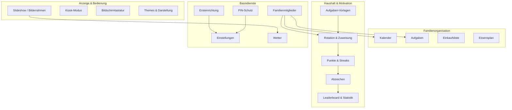
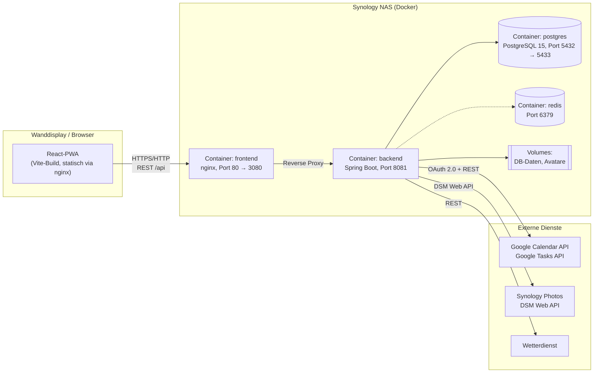

# 01 – Systemüberblick

## Zweck & Geltungsbereich

Dieses Dokument beschreibt FamilyHub aus der Vogelperspektive: Produktidee, Einsatzszenario,
fachliche Bausteine, technische Architektur und den ehrlichen Umsetzungsstand des Altsystems.
Es ist der Einstiegspunkt in das Lastenheft und verweist für jede Detailfrage auf das jeweils
zuständige Fachdokument. Es enthält bewusst keine Implementierungsdetails.

## Inhalt

- [1. Produktidee](#1-produktidee)
- [2. Einsatzszenario und Zielgerät](#2-einsatzszenario-und-zielgerät)
- [3. Fachliche Bausteine](#3-fachliche-bausteine)
- [4. Systemarchitektur](#4-systemarchitektur)
- [5. Externe Systeme und Abhängigkeiten](#5-externe-systeme-und-abhängigkeiten)
- [6. Datenflüsse](#6-datenflüsse)
- [7. Kennzahlen des Altsystems](#7-kennzahlen-des-altsystems)
- [8. Umsetzungsstand im Überblick](#8-umsetzungsstand-im-überblick)
- [9. Entwicklungsgeschichte und Kurswechsel](#9-entwicklungsgeschichte-und-kurswechsel)
- [10. Abgrenzung: Was FamilyHub nicht ist](#10-abgrenzung-was-familyhub-nicht-ist)

---

## 1. Produktidee

FamilyHub ist ein **selbst gehostetes Familien-Dashboard** als Web-Anwendung (PWA). Es bündelt
auf einem einzigen, dauerhaft eingeschalteten Wanddisplay die Informationen, die eine Familie
im Alltag ständig braucht, und ersetzt damit Pinnwand, Wandkalender, Einkaufszettel und
Ämtliplan.

Die fünf Produktversprechen des Altsystems:

| Nr. | Versprechen | Umsetzung im Altsystem |
|-----|-------------|------------------------|
| 1 | Digitaler Bilderrahmen, der Familienfotos automatisch anzeigt | Über Synology Photos (ursprünglich Google Photos geplant) |
| 2 | Ein gemeinsamer Familienkalender aus mehreren Google-Kalendern | Bidirektionale Synchronisation mit Google Calendar |
| 3 | Aufgabenverwaltung, die sich mit den Handys der Familie deckt | Bidirektionale Synchronisation mit Google Tasks |
| 4 | Faire, automatische Verteilung von Haushaltsämtli | Eigene Rotationslogik mit Vorlagen und Instanzen |
| 5 | Motivation für Kinder durch Punkte und Abzeichen | Eigenes Gamification-System mit Punkten, Streaks, Badges, Leaderboard |

Leitprinzip ist **Datenhoheit**: Das System läuft vollständig im Heimnetz auf einer Synology NAS.
Es gibt keinen Cloud-Dienst des Herstellers, keine Nutzerkonten bei Dritten und keine Telemetrie.
Die einzigen externen Verbindungen gehen zu Google (Kalender/Aufgaben, mit Zustimmung des Nutzers)
und zu einem Wetterdienst.

## 2. Einsatzszenario und Zielgerät

Das primäre Zielgerät ist ein **wandmontiertes Touch-Display** (typischerweise in Küche oder Flur),
das im Browser-Vollbild dauerhaft die Anwendung anzeigt. Daraus ergeben sich prägende
Rahmenbedingungen, die jede Designentscheidung der Neuauflage beeinflussen:

| Rahmenbedingung | Konsequenz |
|-----------------|------------|
| Keine physische Tastatur | Bildschirmtastatur (QWERTZ + numerisch) muss Teil der Anwendung sein |
| Bedienung ausschließlich per Finger | Touch-Ziele mindestens 44 × 44 px, keine Hover-only-Interaktionen |
| Gerät läuft 24/7 | Kiosk-Modus, Wake Lock, Bildschirmschoner/Slideshow als Ruhezustand, Burn-in-Vermeidung |
| Gerät ist öffentlich zugänglich | Kein Login im klassischen Sinne; sensible Bereiche nur per PIN |
| Betrachtungsabstand 1–3 m | Große Schrift, hoher Kontrast, informationsarme Verdichtung |
| Mehrere Nutzer, keine Sitzungen | Kein „eingeloggter Nutzer"; Aktionen werden Familienmitgliedern explizit zugeordnet |
| Betrieb im LAN | Kein Zugriff von außen vorgesehen, keine Härtung gegen Internet-Angreifer |

Sekundär ist die Anwendung auf Smartphones und Tablets im Heimnetz nutzbar (responsives Layout),
dies war aber nicht der Optimierungsschwerpunkt.

## 3. Fachliche Bausteine

> **Achtung – Einkaufsliste und Essensplan:** Beide sind oben als fachliche Bausteine aufgeführt,
> weil sie zur Produktidee gehören und im Altsystem als Komponenten angelegt wurden. Sie sind
> jedoch **nicht Teil der lauffähigen Anwendung**: kein Navigationseintrag, keine Einbindung,
> kein Backend. Für die Neuauflage sind sie als neu zu bauende Funktionen zu planen, nicht als
> zu portierender Bestand. Details in [02](02-funktionale-anforderungen.md).

Zuständige Dokumente: Anzeige/Organisation/Basis siehe
[02 – Funktionale Anforderungen](02-funktionale-anforderungen.md), Haushalt und Motivation siehe
[03 – Haushalt & Gamification](03-haushalt-gamification.md), Slideshow-Technik siehe
[07 – Synology & Fotos](07-synology-fotos.md).

## 4. Systemarchitektur

FamilyHub ist eine klassische Drei-Schichten-Anwendung mit strikter Trennung von Frontend,
Backend und Persistenz. Alle Bestandteile laufen als Docker-Container auf derselben NAS.

**Architekturprinzipien des Altsystems:**

1. **Backend als alleiniger Integrationspunkt.** Das Frontend spricht ausschließlich mit dem
   eigenen Backend. Weder Google noch die NAS-Foto-API werden direkt aus dem Browser
   angesprochen. Vorteil: Zugangsdaten verlassen den Server nie, CORS- und
   Zertifikatsprobleme entfallen im Client.
2. **Geschichtete Backend-Struktur.** `controller` → `service` → `repository` → `model`, mit
   `dto` als Transportschicht und expliziten Mappern. Geschäftslogik liegt ausschließlich in
   den Services.
3. **Datenbank als Konfigurationsspeicher.** Laufzeit-Einstellungen (inklusive Google-Client-ID
   und -Secret sowie NAS-Zugangsdaten) liegen verschlüsselt in der Datenbank, nicht in
   Umgebungsvariablen. Dadurch ist die Ersteinrichtung vollständig über den Setup-Assistenten
   im Browser möglich, ohne Dateizugriff auf die NAS.
4. **Lokale Kopie externer Daten.** Kalendertermine und Aufgaben werden per Scheduler von Google
   geholt und in eigenen Tabellen gespiegelt. Die Anzeige funktioniert damit auch, wenn Google
   kurzzeitig nicht erreichbar ist.
5. **Schemaverwaltung per Migration.** Alle Schemaänderungen laufen über nummerierte
   Flyway-Skripte; es gibt kein automatisches Schema-Update durch Hibernate.

Details: [08 – Betrieb & Deployment](08-betrieb-und-deployment.md).

## 5. Externe Systeme und Abhängigkeiten

| System | Zweck | Protokoll | Ausfall-Auswirkung | Detaildokument |
|--------|-------|-----------|--------------------|----------------|
| Google Calendar API | Termine lesen und schreiben | OAuth 2.0 + REST | Anzeige läuft mit letztem Sync-Stand weiter; neue Termine erreichen Google nicht | [06](06-google-integration.md) |
| Google Tasks API | Aufgaben lesen und schreiben | OAuth 2.0 + REST | wie oben | [06](06-google-integration.md) |
| Synology Photos (DSM Web API) | Fotos und Videos für die Slideshow | HTTP(S) im LAN | Slideshow zeigt Fallback bzw. leeren Zustand | [07](07-synology-fotos.md) |
| Wetterdienst | Aktuelles Wetter und Vorhersage | REST | Wetter-Widget entfällt | [08](08-betrieb-und-deployment.md) |
| Geocoding-Dienst | Ortsname → Koordinaten in den Einstellungen | REST | Ort muss manuell als Koordinate gesetzt werden | [08](08-betrieb-und-deployment.md) |
| PostgreSQL | Persistenz | JDBC | Totalausfall der Anwendung | [05](05-datenmodell.md) |
| Redis | Als Cache vorgesehen | – | keine – wird nicht genutzt | [08](08-betrieb-und-deployment.md) |

> **Hinweis zu Redis:** Redis ist im `docker-compose.yml` als Container definiert, wird von der
> Anwendung aber **nachweislich nicht verwendet** – es gibt weder eine Abhängigkeit im Build noch
> eine Konfiguration noch einen Codeaufruf. Alle Caches sind entweder prozesslokal im Backend
> oder liegen im Browser. Der Container ist reiner Ballast und ein zusätzlich offener Port. Für
> die Neuauflage ersatzlos streichen, sofern kein konkreter Bedarf entsteht.

## 6. Datenflüsse

Die drei prägenden Datenflüsse des Systems:

**A) Synchronisation mit Google (periodisch, Hintergrund)**

Ein Scheduler im Backend holt in festen Intervallen Kalender und Aufgabenlisten aller
verbundenen Google-Konten, gleicht sie mit den lokalen Tabellen ab und schreibt lokal
entstandene Änderungen zurück. Das Frontend liest ausschließlich die lokale Kopie.

**B) Fotoabruf (bedarfsgesteuert, im Vordergrund)**

Die Slideshow fordert Bildlisten und Einzelbilder beim Backend an. Das Backend meldet sich an
der NAS an, holt die Daten über die DSM Web API und reicht sie an das Frontend durch. Das
Frontend hält einen eigenen Cache vor, damit Bildwechsel ohne Netzwerkwartezeit erfolgen.

**C) Haushaltsaufgaben (periodisch erzeugt, interaktiv erledigt)**

Ein zweiter Scheduler erzeugt aus den Aufgaben-Vorlagen periodisch konkrete Aufgaben-Instanzen
und weist sie nach einem Rotationsverfahren einem Familienmitglied zu. Erledigt ein Mitglied
eine Instanz am Display, vergibt das System Punkte, aktualisiert Statistiken und prüft, ob
dadurch Abzeichen verdient wurden. Dieser Fluss hat keine externe Abhängigkeit.

## 7. Kennzahlen des Altsystems

Als Größenordnung für die Aufwandsschätzung der Neuauflage:

| Kennzahl | Wert |
|----------|------|
| Backend-Produktivcode (Kotlin) | ca. 9.400 Zeilen |
| Backend-Testcode (Kotlin) | ca. 15.700 Zeilen in 36 Testdateien |
| Frontend-Produktivcode (TS/TSX, ohne generierte UI-Bibliothek) | ca. 35.600 Zeilen |
| Frontend-Testdateien | 31 |
| REST-Controller | 14 |
| Backend-Services | 27 |
| JPA-Entitäten | 13 |
| Datenbank-Migrationen | 22 (V1–V22) |
| Hauptansichten im Frontend (angelegt) | 8 |
| davon tatsächlich eingebunden | 5 |
| Git-Commits | 40 |

Das Verhältnis von Test- zu Produktivcode im Backend beträgt rund 1,7 : 1. Diese Zahl täuscht
allerdings: Der letzte dokumentierte Backend-Testlauf war mit 260 Fehlschlägen bei 714 Tests
nicht grün (Details in [08](08-betrieb-und-deployment.md)). Ebenso relevant für die
Aufwandsschätzung: Ein nennenswerter Teil des Frontend-Codes ist nicht eingebunden und damit
toter Bestand – darunter ausgerechnet gut getestete Bausteine wie die natürlichsprachige
Eingabe. Die Codemenge des Altsystems ist deshalb kein verlässlicher Maßstab für den
Neubauaufwand.

## 8. Umsetzungsstand im Überblick

Die projekteigene Checkliste weist einen Fertigstellungsgrad von rund 98 % aus. Diese Zahl ist
mit Vorsicht zu genießen: Sie bezieht sich auf abgehakte Aufgaben, nicht auf produktive
Belastbarkeit. Die folgende Einschätzung ist die Grundlage für die Neuauflage; die belastbaren
Details stehen in den Fachdokumenten.

| Bereich | Einschätzung |
|---------|--------------|
| Google-Anbindung (Kalender, Aufgaben) | Funktional vollständig, inkl. Multi-Account und Token-Refresh |
| Haushaltsrotation und Gamification | Funktional vollständig und gut getestet |
| Synology-Fotos und Slideshow | Funktional, aber der jüngste und am wenigsten gereifte Teil |
| Kalender- und Aufgabenansicht | Vollständig; die natürlichsprachige Eingabe ist gebaut, aber nicht angebunden |
| Einkaufsliste und Essensplan | **Nicht vorhanden** – die Komponenten existieren, sind aber weder verlinkt noch eingebunden, ohne Backend und ohne Daten |
| Ersteinrichtung, Einstellungen, PIN | Funktionsfähig, aber die Wiederaufnahme der Ersteinrichtung ist defekt |
| Kiosk-Modus, Themes, Bildschirmtastatur | Vollständig |
| Erinnerungen/Benachrichtigungen | Nicht umgesetzt |
| Anpassbares Dashboard | Nicht umgesetzt |
| End-to-End-Tests, CI/CD | Nicht umgesetzt |
| Sicherheitsaudit, Barrierefreiheit, Lasttests | Nicht durchgeführt |

## 9. Entwicklungsgeschichte und Kurswechsel

Für die Neuauflage sind vier Kurswechsel des Altsystems wichtig, weil sie Entscheidungen
begründen, die sonst willkürlich wirken:

1. **Google Photos → Synology Photos.** Google hat den lesenden Zugriff auf Fotoalben
   (Scope `photoslibrary.readonly`) für Drittanwendungen entzogen. Der ursprünglich zentrale
   Baustein „Fotos aus einem geteilten Google-Album" war damit nicht mehr umsetzbar. Da die
   Anwendung ohnehin auf einer Synology NAS läuft, wurde Synology Photos als Quelle gewählt.
   Für die Neuauflage bedeutet das: Die Fotoquelle sollte von vornherein austauschbar
   modelliert werden.
2. **Konfiguration aus `.env` → Konfiguration in der Datenbank.** Ursprünglich sollten
   Google-Zugangsdaten über Umgebungsvariablen gesetzt werden. Das war für die Zielgruppe
   (Familien ohne Serveradministrations-Kenntnisse) unbrauchbar. Ergebnis ist der
   Setup-Assistent, der alles im Browser erfasst und verschlüsselt in der Datenbank ablegt.
3. **Familienmitglieder ohne Google-Konto.** Anfangs war ein Familienmitglied gleichbedeutend
   mit einem verbundenen Google-Konto. Das schloss kleine Kinder aus, die am Haushaltssystem
   teilnehmen sollen. Später wurden Mitglieder ohne Google-Verknüpfung nachgerüstet.
4. **Rotationsmodell überarbeitet.** Der ursprüngliche „Rotationspool" wurde durch
   „Zuweisungsgruppen" ersetzt und die Frequenz „täglich" wieder entfernt. Die Hintergründe
   sind in [05 – Datenmodell](05-datenmodell.md) (Migrationshistorie) und
   [03 – Haushalt & Gamification](03-haushalt-gamification.md) dokumentiert.

## 10. Abgrenzung: Was FamilyHub nicht ist

Damit die Neuauflage nicht unbeabsichtigt Umfang aufnimmt:

- **Kein Mehrmandantensystem.** Eine Installation bedient genau eine Familie. Es gibt keinen
  Mandantenbegriff im Datenmodell.
- **Keine Benutzerkonten mit Passwort.** Es gibt kein Login, keine Sessions, keine Rollen im
  Sinne eines Berechtigungssystems – nur Familienmitglieder als Stammdaten und einen
  PIN-Schutz für die Einstellungen.
- **Kein Smart-Home-System.** Keine Geräte- oder Sensorintegration.
- **Kein Dokumenten- oder Medienarchiv.** Fotos werden nur angezeigt, nicht verwaltet,
  hochgeladen oder verändert.
- **Nicht für den Betrieb im offenen Internet ausgelegt.** Es existiert keine Absicherung, die
  eine Veröffentlichung rechtfertigen würde.

---

*Nächstes Dokument: [02 – Funktionale Anforderungen](02-funktionale-anforderungen.md)*
