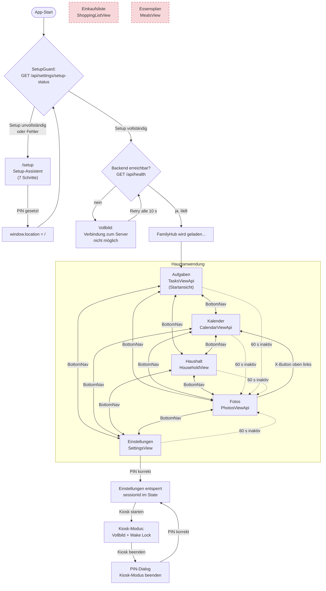

# 02 — Funktionale Anforderungen (Nutzerfunktionen)

## Zweck & Geltungsbereich

Dieses Dokument beschreibt vollständig die funktionalen Anforderungen an alle Nutzerfunktionen des
bestehenden FamilyHub, so wie sie im Altsystem tatsächlich implementiert sind. Es dient als
Lastenheft für eine Neuauflage, deren Entwicklungsteam den Altcode nicht zur Verfügung hat.
Nicht Gegenstand dieses Dokuments sind: Haushaltsaufgaben und Gamification (eigenes Dokument),
sowie die technischen Integrationsdetails zu Google und Synology (eigene Dokumente) — diese
Bereiche werden hier ausschließlich aus der Nutzersicht gestreift.

Alle Angaben beschreiben den **Ist-Zustand**. Funktionen, die nur als Mock, als toter Code oder
gar nicht existieren, sind ausdrücklich als solche gekennzeichnet.

## Inhaltsverzeichnis

- [1. Produktvision & Einsatzszenario](#1-produktvision--einsatzszenario)
- [2. Nutzerrollen und Berechtigungen](#2-nutzerrollen-und-berechtigungen)
- [3. Navigations- und Informationsarchitektur](#3-navigations--und-informationsarchitektur)
- [4. Kalender](#4-kalender)
- [5. Aufgaben](#5-aufgaben)
- [6. Einkaufsliste](#6-einkaufsliste)
- [7. Essensplan](#7-essensplan)
- [8. Familienmitglieder-Verwaltung](#8-familienmitglieder-verwaltung)
- [9. Wetter](#9-wetter)
- [10. Fotos / Bildschirmschoner (Nutzersicht)](#10-fotos--bildschirmschoner-nutzersicht)
- [11. Einstellungen](#11-einstellungen)
- [12. Ersteinrichtung / Setup-Wizard (Nutzersicht)](#12-ersteinrichtung--setup-wizard-nutzersicht)
- [13. Kiosk-Modus](#13-kiosk-modus)
- [14. PIN-Schutz](#14-pin-schutz)
- [15. Bildschirmtastatur](#15-bildschirmtastatur)
- [16. Theme / Darstellung](#16-theme--darstellung)
- [17. Bedienung, Touch und allgemeine UI-Anforderungen](#17-bedienung-touch-und-allgemeine-ui-anforderungen)
- [18. Umsetzungsstand — API-Anbindung vs. toter Code](#18-umsetzungsstand--api-anbindung-vs-toter-code)
- [19. Geplant, aber nicht umgesetzt](#19-geplant-aber-nicht-umgesetzt)
- [20. Bekannte Schwächen / offene Punkte](#20-bekannte-schwächen--offene-punkte)
- [21. Empfehlungen für die Neuauflage](#21-empfehlungen-für-die-neuauflage)

---

## 1. Produktvision & Einsatzszenario

FamilyHub ist ein selbst-gehostetes Familien-Dashboard, das als **Progressive Web App (PWA)** auf
einem **wandmontierten Touch-Display** in der Familienküche dauerhaft läuft. Die Anwendung ersetzt
den klassischen Familienkalender an der Kühlschranktür: Termine, Aufgaben, Wetter und Fotos sind
ohne Anmeldung für alle Familienmitglieder sichtbar; verändernde Eingriffe in die Konfiguration
sind per PIN geschützt.

Der eigene Selbstbeschreibungstext der Anwendung (Einstellungen → „Ueber FamilyHub") lautet
wörtlich:

> „FamilyHub ist ein selbst-gehostetes Familien-Dashboard fuer wandmontierte Touch-Displays."

### Charakteristische Eigenschaften des Einsatzszenarios

| Eigenschaft | Ausprägung im Altsystem |
|-------------|-------------------------|
| Betriebsmodus | Dauerbetrieb („immer an"), kein Login-Screen für die Alltagsnutzung |
| Primäre Eingabe | Touch. `mousemove` wird bei der Inaktivitätserkennung bewusst ignoriert, weil das Gerät touch-first ist |
| Sekundäre Eingabe | Eingebaute Bildschirmtastatur (QWERTZ / numerisch), da keine Hardware-Tastatur am Wandgerät hängt |
| Ausrichtung | Umschaltbar zwischen Querformat (Standard) und Hochformat |
| Distribution | PWA über `vite-plugin-pwa`, Icons `pwa-192x192.png` und `pwa-512x512.png`, `apple-touch-icon.png`, `theme-color` = `#3b82f6` |
| Sprache | Deutsch (`<html lang="de">`), Datums-/Zeitformatierung durchgehend `de` bzw. `de-DE` |
| Bildschirmschoner | Nach 60 Sekunden Inaktivität automatischer Wechsel in die Foto-Slideshow |
| Backend-Bindung | Ohne erreichbares Backend startet die App nicht in den Normalbetrieb, sondern zeigt einen dedizierten Fehlerbildschirm |
| Ports (Entwicklung) | Frontend-Dev-Server 8080, Backend 8081, Frontend im Docker-Betrieb 3080 |

### Allgemeine Anforderungen

| ID | Anforderung | Priorität | Ist-Zustand |
|----|-------------|-----------|-------------|
| FA-ALLG-01 | Das System muss als Single-Page-Web-Anwendung im Browser eines wandmontierten Touch-Displays laufen. | MUSS | Umgesetzt |
| FA-ALLG-02 | Das System muss als PWA installierbar sein (Manifest, Icons, `theme-color`). | SOLL | Umgesetzt |
| FA-ALLG-03 | Die gesamte Oberfläche muss in deutscher Sprache erscheinen; Datum, Uhrzeit und Wochentage müssen in deutschem Format ausgegeben werden. | MUSS | Umgesetzt (vereinzelt englische Reste, siehe FA-ALLG-12) |
| FA-ALLG-04 | Das System muss ohne Benutzeranmeldung bedienbar sein; alle Ansichten außer den Einstellungen sind ohne Authentifizierung erreichbar. | MUSS | Umgesetzt |
| FA-ALLG-05 | Das System muss die Erreichbarkeit des Backends periodisch prüfen und bei Nichterreichbarkeit einen erklärenden Vollbild-Hinweis anzeigen. | MUSS | Umgesetzt |
| FA-ALLG-06 | Die Backend-Prüfung muss im gesunden Zustand alle 60 Sekunden, im Fehlerzustand alle 10 Sekunden erfolgen. | SOLL | Umgesetzt |
| FA-ALLG-07 | Das System muss während des initialen Ladens einen Ladebildschirm mit der Meldung „FamilyHub wird geladen..." anzeigen. | SOLL | Umgesetzt |
| FA-ALLG-08 | Das System muss die Anzeigeausrichtung (Quer-/Hochformat) umschaltbar machen und alle Ansichten entsprechend layouten. | SOLL | Umgesetzt |
| FA-ALLG-09 | Die gewählte Ausrichtung muss über Neustarts hinweg erhalten bleiben. | SOLL | **Nicht umgesetzt** — nur React-State, geht bei Reload verloren |
| FA-ALLG-10 | Das System muss serverseitigen Zustand (Termine, Aufgaben, Mitglieder) über eine REST-API vom Backend beziehen. | MUSS | Umgesetzt |
| FA-ALLG-11 | Das System muss Netzwerkfehler und Timeouts abfangen und je Ansicht eine Fehlermeldung mit Wiederholungsmöglichkeit anbieten. | MUSS | Teilweise (Kalender/Aufgaben/Fotos ja, andere Bereiche uneinheitlich) |
| FA-ALLG-12 | Alle Nutzertexte müssen konsistent deutsch und korrekt umlautiert sein. | SOLL | **Teilweise** — die 404-Seite ist englisch, viele Settings-Strings sind ohne Umlaute geschrieben („Hinzufuegen", „Gruen", „Waehle") |

### Fehlerbildschirm „Backend nicht erreichbar"

Wird `GET /api/health` nicht erfolgreich beantwortet, ersetzt ein Vollbildschirm die gesamte
Anwendung. Wörtliche Texte:

- Überschrift: „Verbindung zum Server nicht möglich"
- Erläuterung: „FamilyHub benötigt eine Verbindung zum Backend-Server. Bitte stelle sicher, dass
  der Server läuft und erreichbar ist."
- Schaltfläche: „Erneut versuchen" / im Ladezustand „Verbindung wird geprüft..."
- Hinweis: „Automatische Wiederholung alle 10 Sekunden"
- Zeitstempel: „Letzter Versuch: HH:MM:SS" (Format `de-DE`, zweistellig inkl. Sekunden)
- Ursachenliste unter der Überschrift „Mögliche Ursachen:":
  - „Der Backend-Server ist nicht gestartet"
  - „Netzwerkverbindung unterbrochen"
  - „Firewall blockiert die Verbindung"

### Technische Randbedingungen der API-Anbindung (Nutzerrelevanz)

| Aspekt | Wert |
|--------|------|
| Basis-URL | `VITE_API_BASE_URL`, sonst `/api` (Produktion) bzw. `http://localhost:8081/api` (Entwicklung) |
| Request-Timeout | 30 000 ms; danach Fehler „Request timeout" mit Pseudo-Status 408 |
| Netzwerkfehler | Pseudo-Status 0 |
| Fehlertext | `message`-Feld der Fehlerantwort, sonst `HTTP error <status>` |
| Leere Antwort | Wird als leeres Objekt behandelt (kein Fehler) |

### 404-Seite

Alle nicht bekannten Routen führen auf eine Fehlerseite. Diese ist **nicht lokalisiert** und zeigt:
„404", „Oops! Page not found" sowie den Link „Return to Home". Zusätzlich wird der Pfad auf der
Browser-Konsole protokolliert.

---

## 2. Nutzerrollen und Berechtigungen

FamilyHub kennt **keine Benutzeranmeldung**. Es gibt kein Sitzungskonzept für Personen, sondern
nur zwei Schutzebenen: „offen" (alles, was am Display sichtbar ist) und „PIN-geschützt"
(Einstellungen, Kiosk-Beenden). Die Rolle eines Familienmitglieds ist ein reines **Stammdatenfeld**
und steuert im Altsystem **keine Berechtigungen**.

### 2.1 Rollenmodell

| Rolle | Feldwert `role` | Deutsche Beschriftung | Bedeutung im Altsystem |
|-------|-----------------|------------------------|------------------------|
| Elternteil | `parent` | „Elternteil" | Nur Stammdatum. Wird in der Haushaltsaufgaben-Rotation als Zielgruppe verwendet (siehe eigenes Dokument). |
| Kind | `child` | „Kind" | Nur Stammdatum. Der (nicht eingebundene) `TasksView` filtert auf `role === 'child'`; die tatsächlich verwendete `TasksViewApi` tut dies **nicht**. |

Es existiert **kein** Feld `isAdmin` und **keine** Zuordnung „dieses Gerät wird gerade von Person X
bedient". Wer eine Aufgabe abhakt, wird nicht erfasst — die API bietet zwar einen optionalen
Parameter `completedByMemberId`, das Frontend übergibt ihn beim Abhaken jedoch nie.

### 2.2 Berechtigungen

| Bereich | Zugriff ohne PIN | Zugriff mit PIN |
|---------|------------------|-----------------|
| Kalender ansehen, Termine anlegen/ändern/löschen | ja | ja |
| Aufgaben ansehen, anlegen/ändern/löschen/abhaken | ja | ja |
| Haushalt-Ansicht | ja | ja |
| Fotos / Slideshow | ja | ja |
| Ausrichtung Quer-/Hochformat | nein (liegt in den Einstellungen) | ja |
| Einstellungen öffnen | nein | ja |
| Familienmitglieder anlegen/bearbeiten | nein | ja |
| Google-Konten, Kalenderauswahl, Synology, Wetter, Slideshow | nein | ja |
| Kiosk-Modus starten | nein (Bedienelement liegt in den Einstellungen) | ja |
| Kiosk-Modus beenden | nein — separate PIN-Abfrage | ja |

| ID | Anforderung | Priorität | Ist-Zustand |
|----|-------------|-----------|-------------|
| FA-PIN-01 | Das System muss ein Rollenfeld je Familienmitglied mit den Werten „Elternteil" und „Kind" führen. | MUSS | Umgesetzt |
| FA-PIN-02 | Die Rolle soll den Zugriff auf Funktionen steuern (z. B. Kinder dürfen Einstellungen nicht öffnen). | SOLL | **Nicht umgesetzt** — Rolle hat keinerlei Berechtigungswirkung |
| FA-PIN-03 | Das System muss alle konfigurierenden Bereiche hinter einer PIN-Abfrage schützen. | MUSS | **Teilweise** — in der Oberfläche umgesetzt, serverseitig nicht durchgesetzt (siehe FA-PIN-18) |
| FA-PIN-04 | Das System muss ohne Personen-Login auskommen (Wanddisplay im Familienumfeld). | MUSS | Umgesetzt |
| FA-PIN-05 | Das System soll erfassen, welches Familienmitglied eine Aufgabe erledigt hat. | KANN | **Nicht umgesetzt** im Frontend (API-Parameter vorhanden, wird nicht gesetzt) |

---

## 3. Navigations- und Informationsarchitektur

### 3.1 Routen

| Route | Inhalt | Bemerkung |
|-------|--------|-----------|
| `/` | Hauptanwendung mit Ansichtsumschaltung | Durch `SetupGuard` geschützt |
| `/setup` | Ersteinrichtungs-Assistent | Vom `SetupGuard` ausgenommen |
| `/oauth/callback` | Rücksprung aus dem Google-OAuth-Flow | Vom `SetupGuard` ausgenommen |
| `*` | 404-Seite | Englisch, siehe Kapitel 1 |

Die App ist als **eine** Route mit interner Ansichtsumschaltung gebaut: Der Wechsel zwischen
Kalender, Aufgaben, Haushalt, Fotos und Einstellungen erfolgt über React-State (`ViewMode`),
**nicht** über den Router. Konsequenzen: kein Deep-Link auf eine Ansicht, kein Zurück-Button des
Browsers, kein Wiederherstellen der Ansicht nach einem Reload.

### 3.2 Ansichten (`ViewMode`)

Der Typ `ViewMode` kennt sieben Werte: `calendar`, `tasks`, `shopping`, `meals`, `photos`,
`household`, `settings`. **Nur fünf davon sind tatsächlich erreichbar.**

| ViewMode | Deutsche Beschriftung in der Navigation | Erreichbar? | Eingebundene Komponente |
|----------|------------------------------------------|-------------|--------------------------|
| `calendar` | „Kalender" | ja | `CalendarViewApi` |
| `tasks` | „Aufgaben" | ja | `TasksViewApi` |
| `household` | „Haushalt" | ja | `HouseholdView` (eigenes Dokument) |
| `photos` | „Fotos" | ja | `PhotosViewApi` |
| `settings` | „Einstellungen" | ja | `SettingsView` |
| `shopping` | — | **nein** | keine — Navigationseintrag fehlt, `renderView()` hat keinen Zweig |
| `meals` | — | **nein** | keine — Navigationseintrag fehlt, `renderView()` hat keinen Zweig |

Würde `shopping` oder `meals` doch gesetzt, greift der `default`-Zweig und es wird **nichts**
gerendert (leerer Hauptbereich). Details in Kapitel 6, 7 und 18.

### 3.3 Startansicht

Die Anwendung startet in der Ansicht **„Aufgaben"** (`useState<ViewMode>('tasks')`). Das ist
insofern bemerkenswert, als die Foto-Slideshow der eigentliche Ruhezustand ist und der Kalender
inhaltlich die naheliegendere Startansicht wäre.

### 3.4 Rahmenelemente

**Kopfzeile (`Header`)** — sichtbar in allen Ansichten **außer** Fotos und außer im aktiven
Kiosk-Modus. Aufbau von links nach rechts:

1. Datum groß, Format `d. MMMM` mit deutschem Locale (z. B. „21. Juli"); darunter der Wochentag
   ausgeschrieben (`EEEE`, z. B. „Montag").
2. Uhrzeit `HH:mm`, groß und dünn gesetzt. Aktualisierung im 60-Sekunden-Takt.
3. Wetter-Widget in der Variante `compact` (Icon, Temperatur, Ort).

**Fußnavigation (`BottomNav`)** — sichtbar in allen Ansichten **außer** Fotos; im Kiosk-Modus
bleibt sie bewusst sichtbar, damit weiter navigiert werden kann. Fünf gleich breite Schaltflächen
mit Icon und Textlabel:

| Position | Icon (lucide) | Label |
|----------|---------------|-------|
| 1 | `Calendar` | „Kalender" |
| 2 | `CheckSquare` | „Aufgaben" |
| 3 | `Home` | „Haushalt" |
| 4 | `Image` | „Fotos" |
| 5 | `Settings` | „Einstellungen" |

Die aktive Schaltfläche erhält eine Hervorhebung (`bg-primary/10`, Primärfarbe für Icon und Text).
Jede Schaltfläche hat die Utility-Klasse `touch-target` und damit eine Mindestgröße von
44 × 44 Pixeln.

**Foto-Ansicht** blendet Kopfzeile und Fußnavigation aus. Stattdessen erscheint oben links eine
runde Schaltfläche mit `X`-Icon zum Verlassen. Diese springt allerdings **nicht** in die vorherige
Ansicht zurück, sondern fest in den **Kalender**.

**Kiosk-Modus** blendet zusätzlich die Kopfzeile aus und zeigt oben rechts die Schaltfläche
„Kiosk beenden".

### 3.5 Bildschirmschoner-/Idle-Verhalten

| ID | Anforderung | Priorität | Ist-Zustand |
|----|-------------|-----------|-------------|
| FA-ALLG-13 | Das System muss nach 60 Sekunden ohne Nutzerinteraktion automatisch in die Foto-Slideshow wechseln. | MUSS | Umgesetzt |
| FA-ALLG-14 | Als Interaktion müssen `click`, `touchstart` und `keydown` gewertet werden; Mausbewegung darf den Timer nicht zurücksetzen. | MUSS | Umgesetzt (bewusste Entscheidung für Touch-Geräte) |
| FA-ALLG-15 | In der Foto-Ansicht darf der Inaktivitätstimer nicht laufen. | MUSS | Umgesetzt |
| FA-ALLG-16 | Der Timeout soll konfigurierbar sein. | SOLL | **Nicht umgesetzt** — 60 000 ms fest im Code |
| FA-ALLG-17 | Beim Verlassen der Foto-Ansicht soll die zuvor aktive Ansicht wiederhergestellt werden. | SOLL | **Nicht umgesetzt** — es wird stets der Kalender geöffnet |

Erhebliche Nebenwirkung: Der Timer läuft **unabhängig davon, ob ein Dialog geöffnet ist**. Wer im
Termin- oder Aufgabendialog länger als 60 Sekunden tippt, ohne zu klicken oder eine Taste zu
drücken, verliert seine Eingabe, weil die Anwendung in die Slideshow springt. Da die
Bildschirmtastatur `click`-Events auslöst, ist der Fall in der Praxis abgemildert, aber nicht
ausgeschlossen.

### 3.6 Navigationsdiagramm



Die rot-gestrichelten Knoten „Einkaufsliste" und „Essensplan" existieren als Quelltext, sind aber
an **keiner** Stelle der Navigation angebunden.

---

## 4. Kalender

### 4.1 Kurzbeschreibung

Die Kalenderansicht zeigt eine **Wochenansicht Montag bis Sonntag** mit einem Zeitraster von
06:00 bis 22:00 Uhr. Termine sind nach der Farbe des zugeordneten Familienmitglieds eingefärbt.
Ganztägige und mehrtägige Termine erscheinen in einer eigenen Zeile über dem Zeitraster,
Feiertage werden als Tages-Kennzeichnung im Spaltenkopf hervorgehoben. Die Ansicht arbeitet
vollständig gegen die Backend-API und synchronisiert auf Knopfdruck mit Google Kalender.

### 4.2 Anforderungen

| ID | Anforderung | Priorität | Ist-Zustand |
|----|-------------|-----------|-------------|
| FA-KAL-01 | Das System muss Termine in einer Wochenansicht von Montag bis Sonntag darstellen. | MUSS | Umgesetzt |
| FA-KAL-02 | Das Zeitraster muss die Stunden 06:00 bis 22:00 abdecken; eine Stunde entspricht 50 Pixeln Höhe. | MUSS | Umgesetzt |
| FA-KAL-03 | Das System muss vorwärts und rückwärts wochenweise blättern können. | MUSS | Umgesetzt |
| FA-KAL-04 | Das System muss eine Schaltfläche „Heute" bieten, die zur aktuellen Woche zurückspringt. | MUSS | Umgesetzt |
| FA-KAL-05 | Der Kopfbereich muss den Monat und das Jahr der angezeigten Woche in deutscher Kurzform anzeigen (`MMM yyyy`). | SOLL | Umgesetzt |
| FA-KAL-06 | Termine müssen in der Farbe des zugewiesenen Familienmitglieds dargestellt werden. | MUSS | Umgesetzt |
| FA-KAL-07 | Bei zeitlicher Überlappung müssen Termine nebeneinander mit gleichmäßig geteilter Breite dargestellt werden. | MUSS | Umgesetzt |
| FA-KAL-08 | Überlappende Termine müssen zur Unterscheidung abwechselnd in einer helleren und einer dunkleren Variante derselben Farbe erscheinen. | SOLL | Umgesetzt |
| FA-KAL-09 | Das System muss die aktuelle Uhrzeit als rote Linie im Zeitraster markieren. | SOLL | Umgesetzt; Aktualisierung im 60-Sekunden-Takt; keine Linie außerhalb 06:00–22:00 |
| FA-KAL-10 | Der heutige Tag muss farblich hervorgehoben werden. | SOLL | Umgesetzt (blauer Hintergrund, blaue Tageszahl) |
| FA-KAL-11 | Ganztägige Termine müssen in einer separaten Zeile „Ganztag" über dem Zeitraster erscheinen. | MUSS | Umgesetzt |
| FA-KAL-12 | Mehrtägige Termine müssen als durchgehender Balken über die betroffenen Tage dargestellt werden; der Titel erscheint nur am ersten Tag. | SOLL | Umgesetzt |
| FA-KAL-13 | Feiertage müssen erkannt und im Spaltenkopf mit Namen sowie bernsteinfarbenem Hintergrund gekennzeichnet werden. | SOLL | Umgesetzt (heuristische Erkennung, siehe 4.6) |
| FA-KAL-14 | Je Wochentag soll die Wettervorhersage (Höchst-/Tiefsttemperatur, Symbol, Regenwahrscheinlichkeit) angezeigt werden. | SOLL | Umgesetzt, sofern Wetter konfiguriert ist |
| FA-KAL-15 | Über dem Kalender muss eine Leiste mit den Avataren aller Familienmitglieder erscheinen. | SOLL | Umgesetzt; auf sehr schmalen Displays ausgeblendet |
| FA-KAL-16 | Das System muss neue Termine über einen Dialog anlegen können. | MUSS | Umgesetzt |
| FA-KAL-17 | Das System muss bestehende Termine per Antippen zum Bearbeiten öffnen können. | MUSS | Umgesetzt |
| FA-KAL-18 | Das System muss Termine löschen können. | MUSS | Umgesetzt |
| FA-KAL-19 | Das System muss eine manuelle Synchronisation mit Google Kalender auslösen können. | MUSS | Umgesetzt — **aber nur für das erste Familienmitglied der Liste**, siehe 4.7 |
| FA-KAL-20 | Ladezustände und Fehlerzustände müssen erkennbar sein. | MUSS | Umgesetzt („Fehler beim Laden der Termine" + „Erneut versuchen") |
| FA-KAL-21 | Das System soll eine Tages-, Monats- und Agenda-Ansicht anbieten. | SOLL | **Nicht umgesetzt** — nur Wochenansicht |
| FA-KAL-22 | Das System soll Serientermine anlegen und bearbeiten können. | SOLL | **Nicht umgesetzt** im Dialog (`recurrenceRule` wird nur gelesen, nie gesetzt) |
| FA-KAL-23 | Das System soll Erinnerungen zu Terminen setzen können. | SOLL | **Nicht umgesetzt** im Dialog (`reminderMinutes` im API-Typ vorhanden, im UI nicht) |
| FA-KAL-24 | Das System soll Termine per Ziehen verschieben können (Drag & Drop). | KANN | **Nicht umgesetzt** |
| FA-KAL-25 | Das System soll Ort und Beschreibung eines Termins anzeigen und bearbeiten lassen. | SOLL | **Nicht umgesetzt** im Dialog (Felder `location`, `description` existieren in der API, nicht im UI) |
| FA-KAL-26 | Das System soll natürlichsprachige Termineingabe („Zahnarzt Freitag 15 Uhr") anbieten. | SOLL | **Nicht umgesetzt in der Oberfläche** — Parser und API-Hook existieren, sind aber nirgends eingebunden (siehe 5.7) |
| FA-KAL-27 | Beim Bearbeiten eines Termins soll das zugeordnete Familienmitglied änderbar sein. | SOLL | **Nicht umgesetzt** — Auswahlfeld ist im Bearbeitungsmodus deaktiviert |

### 4.3 Oberfläche

**Kopfzeile der Ansicht** (von links nach rechts):

| Element | Beschriftung / Symbol | Wirkung |
|---------|------------------------|---------|
| Schaltfläche | `ChevronLeft` | eine Woche zurück |
| Text | z. B. „Jul 2026" | Monat/Jahr des Wochenanfangs, Format `MMM yyyy`, Locale `de` |
| Schaltfläche | „Heute" | springt auf die aktuelle Woche |
| Schaltfläche | `RefreshCw` bzw. Ladespinner | löst Google-Synchronisation aus |
| Schaltfläche | `ChevronRight` | eine Woche vor |

**Mitgliederleiste**: Avatar (klein) plus Name je Familienmitglied, horizontal scrollbar. Auf
kleinen Displays wird die gesamte Leiste ausgeblendet, ab mittlerer Breite erscheint zusätzlich
der Name.

**Tagesköpfe**: Wochentagsname (auf kleinen Displays Kurzform „Mo"…„So", ab mittlerer Breite
ausgeschrieben „Montag"…„Sonntag"), daneben das Tages-Wettersymbol, darunter die Tageszahl.
Ist ein Feiertag erkannt, erscheint darunter dessen Titel in Bernstein.

**Ganztagszeile**: linke Spaltenbeschriftung „Ganztag". Darunter je Tag die mehrtägigen und
ganztägigen Termine als flache Balken. Mehrtägige Balken laufen optisch über die Spaltengrenzen
hinweg (erster Tag mit abgerundeter linker Kante, mittlere Tage randlos, letzter Tag mit
abgerundeter rechter Kante).

**Zeitraster**: linke Spalte mit Stundenbeschriftungen `HH:mm` von 06:00 bis 21:00. Sieben
Tagesspalten. Termine werden absolut positioniert; die Höhe entspricht der Dauer, mindestens
jedoch 20 Pixel (bzw. 25 Pixel aus der Berechnung). Ab 35 Pixel Höhe wird zusätzlich der
Zeitbereich eingeblendet, ab 45 Pixel Höhe der Avatar des Mitglieds.

**Aktionsschaltfläche**: runder Plus-Knopf unten rechts (schwebend über der Fußnavigation).

### 4.4 Termindialog (`EventDialog`)

Titel: „Neuer Kalendereintrag" beim Anlegen, „Termin bearbeiten" beim Bearbeiten. Für
Screenreader hinterlegte Beschreibung: „Erstelle oder bearbeite einen Kalendereintrag mit Datum
und Uhrzeit."

| Feld | Beschriftung | Typ | Pflicht | Vorbelegung | Validierung / Besonderheiten |
|------|--------------|-----|---------|-------------|-------------------------------|
| Titel | „Titel" | einzeiliger Text, Platzhalter „z.B. Arzttermin" | ja | leer | Speichern erst möglich, wenn nicht leer |
| Ganztägig | „Ganztägig" | Checkbox | nein | nicht gesetzt | Blendet beide Uhrzeitfelder aus |
| Beginn (Datum) | „Beginn" | Datumswähler im Popover, Anzeige `EEE, dd. MMM yyyy` | ja | heute | Bei leerem Wert Text „Datum wählen" |
| Beginn (Uhrzeit) | — | `type="time"` | nur wenn nicht ganztägig | `09:00` | — |
| Ende (Datum) | „Ende" | Datumswähler im Popover | nein | heute | Datumsauswahl vor dem Startdatum ist gesperrt; liegt das Enddatum vor dem Start, wird es automatisch nachgezogen |
| Ende (Uhrzeit) | — | `type="time"` | nur wenn nicht ganztägig | `10:00` | keine Prüfung „Ende nach Beginn" bei gleichem Tag |
| Familienmitglied | „Familienmitglied" | Auswahlliste mit Avatar und Name, Platzhalter „Person wählen" | ja | leer | **Beim Bearbeiten deaktiviert** |

Schaltflächen: „Löschen" (nur im Bearbeitungsmodus, destruktive Optik, mit Papierkorb-Icon),
„Abbrechen", sowie „Hinzufügen" (Anlegen) bzw. „Speichern" (Bearbeiten). Während des Speicherns
erscheint „Speichern..." mit Ladespinner. Es gibt **keine** Sicherheitsabfrage vor dem Löschen.

Umrechnung ganztägiger Termine: Startzeit wird auf 00:00 des gewählten Tages gesetzt, Endzeit auf
00:00 des **Folgetages** des gewählten Enddatums (exklusives Ende, wie bei Google Kalender).

### 4.5 Datenfelder eines Termins

| Feld | Typ | Herkunft | Im Dialog bearbeitbar |
|------|-----|----------|------------------------|
| `id` | Ganzzahl | Backend | nein |
| `googleEventId` | Text, optional | Google | nein |
| `googleCalendarId` | Text, optional | Google | nein — nur zur Feiertagserkennung genutzt |
| `ownerId` / `ownerName` / `ownerColor` | Ganzzahl / Text / Text | Backend | nein |
| `assignedMemberId` / `assignedMemberName` / `assignedMemberColor` | optional | Backend | nur beim Anlegen (`memberId`) |
| `title` | Text | Eingabe | ja |
| `description` | Text, optional | API | **nein** |
| `location` | Text, optional | API | **nein** |
| `startTime` | ISO-8601-Zeitstempel | Eingabe | ja |
| `endTime` | ISO-8601-Zeitstempel, optional | Eingabe | ja |
| `allDay` | Wahrheitswert | Eingabe | ja |
| `recurrenceRule` | Text, optional | API | **nein** |
| `color` | Text, optional | API | **nein** |
| `reminderMinutes` | Liste von Ganzzahlen, optional | API | **nein** |
| `syncStatus` | Text | Backend | nein |
| `createdAt` / `updatedAt` | ISO-8601 | Backend | nein |

Die Farbdarstellung richtet sich **nicht** nach `color`, sondern nach der Farbe des effektiven
Mitglieds: `assignedMemberId ?? ownerId`. Unterstützte Farbschlüssel im Kalender sind `blue`,
`pink`, `green`, `purple`, `orange`, `teal`, `yellow`, `red`; unbekannte Werte fallen auf `blue`
zurück. (Anlegbar sind über die Mitgliederverwaltung nur die ersten sechs.)

### 4.6 Kategorisierung und Sonderfälle

Die Einordnung eines Termins erfolgt in dieser Reihenfolge:

1. **Feiertag**, wenn die Kalender-ID eines der Muster `holiday@group`, `feiertag`, `holidays`
   enthält **oder** der Titel „feiertag" bzw. „holiday" enthält (Groß-/Kleinschreibung
   unerheblich). Feiertage werden **nicht** als Termin gezeichnet, sondern nur als
   Spaltenkopf-Kennzeichnung. Pro Tag wird nur **ein** Feiertag angezeigt.
2. **Ganztägig oder Mitternacht-bis-Mitternacht**: Ein Termin gilt als ganztägig, wenn das Flag
   `allDay` gesetzt ist **oder** Start- und Endzeit jeweils exakt auf 00:00 liegen.
   - Erstreckt sich der Termin über mehr als einen Tag (Differenz > 1 Tag), ist er ein
     **mehrtägiger** Termin.
   - Sonst ist er ein **ganztägiger Einzeltermin**.
3. **Sonst**: Termin mit Uhrzeit, wird im Zeitraster positioniert.

Mehrtägige Termine **mit** Uhrzeiten (z. B. Freitag 20:00 bis Sonntag 10:00) landen im Zeitraster
und werden pro Tag geschnitten: erster Tag von der Startzeit bis 22:00, mittlere Tage 06:00 bis
22:00, letzter Tag 06:00 bis zur Endzeit. Der angezeigte Zeitbereich lautet dann „20:00 →" am
ersten Tag, leer an mittleren Tagen und „→ 10:00" am letzten Tag.

Termine ohne Endzeit werden mit einer Stunde Dauer dargestellt.

**Leerzustände**: Es gibt keinen expliziten Leerzustand — eine Woche ohne Termine zeigt schlicht
das leere Raster. Die Ganztagszeile wird nur eingeblendet, wenn mindestens ein ganztägiger oder
mehrtägiger Termin existiert.

**Fehlerzustand**: „Fehler beim Laden der Termine" mit Schaltfläche „Erneut versuchen".

### 4.7 Synchronisation aus Nutzersicht

Der Aktualisieren-Knopf löst `POST /api/google-calendar/sync?memberId=<id>` aus. Übergeben wird
**immer `members[0].id`**, also das erste Familienmitglied der vom Backend gelieferten Liste. Für
Familien mit mehreren Google-Konten bedeutet das: Ein Klick synchronisiert nur ein Konto, welches
genau, ist für den Nutzer nicht ersichtlich und hängt von der Sortierung der Mitgliederliste ab.
Es gibt weder eine Erfolgs- noch eine Ergebnismeldung („x erstellt, y aktualisiert"), obwohl die
API ein solches Ergebnis (`created`, `updated`, `deleted`) zurückliefert.

Der abgefragte Zeitraum ist stets die dargestellte Woche: `start` = Montag, `end` = Montag + 7
Tage, jeweils als Datum ohne Uhrzeit.

---

## 5. Aufgaben

### 5.1 Kurzbeschreibung

Die Aufgabenansicht zeigt persönliche Aufgaben (Google-Tasks-Pendant), gruppiert als **eine Karte
pro Familienmitglied**. Jede Karte enthält den Fortschritt als Ring in Prozent und darunter die
Aufgabenliste mit runden Abhak-Feldern. Über Filterschaltflächen lässt sich zwischen allen,
offenen und erledigten Aufgaben umschalten.

Nicht zu verwechseln mit den **Haushaltsaufgaben** (Ansicht „Haushalt"), die einem eigenen
Rotations- und Punktesystem folgen und in einem separaten Dokument beschrieben sind.

### 5.2 Anforderungen

| ID | Anforderung | Priorität | Ist-Zustand |
|----|-------------|-----------|-------------|
| FA-AUF-01 | Das System muss Aufgaben je Familienmitglied gruppiert in Karten darstellen. | MUSS | Umgesetzt |
| FA-AUF-02 | Das System muss je Mitglied den Erledigungsstand als „x/y erledigt" und als prozentualen Fortschrittsring anzeigen. | SOLL | Umgesetzt |
| FA-AUF-03 | Das System muss Aufgaben durch Antippen eines runden Kontrollfeldes als erledigt bzw. wieder als offen markieren können. | MUSS | Umgesetzt |
| FA-AUF-04 | Erledigte Aufgaben müssen durchgestrichen und ausgegraut dargestellt werden. | SOLL | Umgesetzt |
| FA-AUF-05 | Das System muss die Filter „Alle", „Offen" und „Erledigt" mit jeweiliger Anzahl anbieten. | MUSS | Umgesetzt |
| FA-AUF-06 | Die Filterzähler müssen sich immer auf den Gesamtbestand beziehen, nicht auf die gefilterte Teilmenge. | SOLL | Umgesetzt (zweite, ungefilterte Abfrage) |
| FA-AUF-07 | Das System muss neue Aufgaben über einen Dialog anlegen können. | MUSS | Umgesetzt |
| FA-AUF-08 | Das System muss bestehende Aufgaben bearbeiten und löschen können. | MUSS | Umgesetzt (Stift-Symbol je Aufgabe) |
| FA-AUF-09 | Das System muss Aufgaben einem Familienmitglied zuweisen können. | MUSS | Umgesetzt |
| FA-AUF-10 | Das System muss eine Priorität mit drei Stufen unterstützen und als Sterne darstellen. | SOLL | Umgesetzt |
| FA-AUF-11 | Das System muss ein Fälligkeitsdatum anzeigen und dabei „Heute", „Morgen" und „Überfällig" hervorheben. | SOLL | Umgesetzt in der Anzeige |
| FA-AUF-12 | Das System muss das Fälligkeitsdatum im Dialog erfassen lassen. | MUSS | **Nicht umgesetzt** — Feld fehlt im Dialog, obwohl die API es unterstützt |
| FA-AUF-13 | Das System muss eine manuelle Synchronisation mit Google Tasks auslösen können. | MUSS | Umgesetzt — mit derselben Einschränkung wie beim Kalender (nur `members[0]`) |
| FA-AUF-14 | Das System muss Lade- und Fehlerzustände anzeigen. | MUSS | Umgesetzt („Fehler beim Laden der Aufgaben" + „Erneut versuchen") |
| FA-AUF-15 | Bei einem Mitglied ohne Aufgaben muss ein Leerzustandstext erscheinen. | SOLL | Umgesetzt („Keine Aufgaben") |
| FA-AUF-16 | Das System soll natürlichsprachige Aufgabeneingabe („Einkaufen bis Freitag") anbieten. | SOLL | **Nicht umgesetzt in der Oberfläche** (siehe 5.7) |
| FA-AUF-17 | Das System soll Aufgaben nach Fälligkeit oder Priorität sortieren können. | SOLL | **Nicht umgesetzt in der Oberfläche** — Sortierfunktionen existieren im Service, werden nirgends aufgerufen |
| FA-AUF-18 | Das System soll Aufgaben in Tageszeiten (morgens/nachmittags/abends) gliedern können. | KANN | **Nicht umgesetzt** — Konzept existiert nur im toten `TasksView`; die API-Variante setzt alle Aufgaben pauschal auf `chores` |
| FA-AUF-19 | Das System soll Unteraufgaben unterstützen. | KANN | **Nicht umgesetzt** (`parentTaskId` in der API vorhanden, im UI nicht) |
| FA-AUF-20 | Das System soll Notizen zu einer Aufgabe anzeigen. | SOLL | **Teilweise** — Notizen sind im Dialog erfassbar, werden in der Liste aber nicht dargestellt |

### 5.3 Oberfläche

**Kopfbereich**: Überschrift „Aufgaben", darunter die Zusammenfassung „{erledigt} von {gesamt}
erledigt". Rechts der runde Aktualisieren-Knopf (`RefreshCw`, im Ladezustand rotierender Spinner).

**Filterleiste**: drei Pillen-Schaltflächen mit Beschriftung und Zähler:

| Schaltfläche | Zähler | API-Parameter |
|--------------|--------|----------------|
| „Alle" | Gesamtzahl | kein `status`-Parameter |
| „Offen" | Gesamt minus erledigt | `status=pending` |
| „Erledigt" | Anzahl mit `status === 'completed'` | `status=completed` |

Voreingestellt ist **„Offen"**.

**Mitgliederleiste**: je Mitglied kleiner Avatar, Name und der Zähler „{erledigt}/{gesamt}".

**Aufgabenraster**: Im Querformat ein Raster mit 2 Spalten, ab großer Breite 3, ab sehr großer
Breite 4 Spalten; im Hochformat eine einspaltige, scrollbare Liste. Angezeigt werden Mitglieder,
die Aufgaben haben — oder alle, wenn die Familie höchstens 4 Mitglieder hat.

Jede Mitgliedskarte besteht aus:

- Kopfzeile in der Pastellfarbe des Mitglieds: Avatar (40 × 40 px, weißer Rand), Name,
  Untertitel „{erledigt}/{gesamt} erledigt" und rechts ein SVG-Fortschrittsring (48 × 48 px,
  grüner Bogen) mit der Prozentzahl in der Mitte.
- Aufgabenliste. Je Eintrag: rundes Kontrollfeld (24 × 24 px) in der Mitgliedsfarbe, Titel,
  darunter eine Zeile mit Fälligkeitsangabe (Kalender-Icon) und Prioritätssternen, rechts ein
  Stift-Symbol zum Bearbeiten (erscheint beim Überfahren).

### 5.4 Aufgabendialog (`TaskDialog`)

Titel: „Neue Aufgabe" bzw. „Aufgabe bearbeiten". Hinterlegte Beschreibung für Screenreader:
„Bearbeite Aufgabeninhalt, Zuweisung und Prioritat." (im Original ohne „ä").

| Feld | Beschriftung | Typ | Pflicht | Vorbelegung |
|------|--------------|-----|---------|-------------|
| Titel | „Aufgabe" | Text, Platzhalter „z.B. Einkaufen gehen" | ja | leer |
| Person | „Person" | Auswahlliste mit Avatar und Name, Platzhalter „Person wählen" | ja | leer |
| Priorität | „Priorität" | drei Umschaltflächen | nein | „Mittel" |
| Notizen | „Notizen (optional)" | einzeiliger Text, Platzhalter „Zusätzliche Details..." | nein | leer |

Prioritätsstufen: „⭐ Niedrig" (`low`), „⭐⭐ Mittel" (`medium`), „⭐⭐⭐ Hoch" (`high`).

Schaltflächen wie beim Termindialog: „Löschen" (nur beim Bearbeiten, ohne Sicherheitsabfrage),
„Abbrechen", „Hinzufügen"/„Speichern", im Speichervorgang „Speichern..." mit Spinner.

Beim Anlegen werden `ownerMemberId` und `assignedMemberId` **auf dasselbe Mitglied** gesetzt.

### 5.5 Datenfelder einer Aufgabe

| Feld | Typ | Im Dialog bearbeitbar | In der Liste sichtbar |
|------|-----|------------------------|------------------------|
| `id` | Ganzzahl | nein | nein |
| `googleTaskId` | Text, optional | nein | nein |
| `ownerId` | Ganzzahl | beim Anlegen | indirekt (Kartenzuordnung) |
| `assignedMemberId` | Ganzzahl, optional | ja | indirekt (Kartenzuordnung) |
| `title` | Text | ja | ja |
| `notes` | Text, optional | ja | **nein** |
| `dueDate` | ISO-Datum, optional | **nein** | ja |
| `status` | Text (`pending` / `completed`) | über Abhaken | ja |
| `priority` | Text (`low` / `medium` / `high`) | ja | als Sterne |
| `completedAt` | Zeitstempel, optional | nein | nein |
| `completedByMemberId` | Ganzzahl, optional | nein | nein |
| `parentTaskId` | Ganzzahl, optional | nein | nein |
| `syncStatus` | Text | nein | nein |
| `createdAt` / `updatedAt` | Zeitstempel | nein | nein |

Abbildungsregeln in der Anzeige:

- Zuordnung zur Mitgliedskarte über `assignedMemberId ?? ownerId`.
- Priorität → Sterne: `high` = 3, `medium` = 2, `low` = 1; ohne Priorität keine Sterne.
- Symbol: alle Aufgaben erhalten pauschal 📋; ein individuelles Icon ist nicht wählbar.
- Zeitfenster: alle Aufgaben werden intern auf `chores` gesetzt (Relikt des alten Datenmodells).

### 5.6 Fälligkeitsanzeige

| Bedingung | Angezeigter Text | Hervorhebung |
|-----------|------------------|--------------|
| kein Datum | (nichts) | — |
| Datum ist heute | „Heute" | bernsteinfarben, fett (dringend) |
| Datum ist morgen | „Morgen" | bernsteinfarben, fett (dringend) |
| Datum liegt in der Vergangenheit (und nicht heute) | „Überfällig" | rot, fett |
| sonst | `dd. MMM`, deutsch (z. B. „05. Aug") | grau |

### 5.7 Natürlichsprachige Eingabe — vorhandene, aber nicht angebundene Funktion

Im Altsystem existiert ein vollständig implementierter und mit rund 75 Testfällen abgesicherter
Parser für deutschsprachige Termin- und Aufgabeneingaben (`lib/nlp-parser.ts`, basierend auf
`chrono-node` mit deutschem Locale). **Er wird von keiner Oberflächenkomponente aufgerufen.**
Ebenso existieren die API-Hooks für `POST /api/events/quick-add` und `POST /api/tasks/quick-add`,
die von keiner Komponente verwendet werden. Für die Neuauflage ist die Funktion daher als Konzept
wertvoll und wird hier vollständig dokumentiert.

**Verhalten `parseEventText(text)`** — Ergebnis: Titel, Startzeit, optionale Endzeit, Kennzeichen
„ganztägig", optionaler Ort (Ort wird nie befüllt).

1. Leerer oder nur aus Leerzeichen bestehender Text ergibt kein Ergebnis (`null`).
2. Die Zeitangabe wird mit **Vorwärtsdatierung** interpretiert: „Freitag" meint stets den nächsten
   kommenden Freitag, nie den vergangenen.
3. Der erkannte Datums-/Zeitausdruck wird aus dem Text entfernt; der Rest wird zum Titel.
4. Wird gar kein Datum erkannt, gilt der gesamte Text als Titel und die **aktuelle Uhrzeit** als
   Startzeit, `isAllDay` = falsch.
5. Ist im Ausdruck **keine Stunde** sicher erkannt worden, gilt der Termin als **ganztägig**.
6. Bleibt nach dem Entfernen kein Titel übrig, wird das erste nicht-datumsbezogene Wort verwendet;
   gibt es keines, lautet der Titel „Termin" (bei Aufgaben „Aufgabe").

**Verhalten `parseTaskText(text)`** — Ergebnis: Titel und optionales Fälligkeitsdatum. Gleiche
Regeln, jedoch ohne Endzeit und ohne Ganztags-Kennzeichen.

**Titelbereinigung** — vom Anfang und vom Ende des Titels werden folgende Füllwörter entfernt
(Groß-/Kleinschreibung unerheblich), anschließend werden Mehrfach-Leerzeichen zusammengefasst:

`um`, `am`, `bis`, `von`, `für`, `an`, `in`, `ab`, `nach`, `zu`, `bei`, `auf`, `gegen`, `per`
sowie die englischen Varianten `at`, `on`, `until`, `from`, `for`, `to`.

**Als datumsbezogen geltende Wörter** (für die Titel-Notfallermittlung):

| Gruppe | Wörter |
|--------|--------|
| Relative Tage (de) | `heute`, `morgen`, `übermorgen`, `gestern` |
| Wochentage (de) | `montag`, `dienstag`, `mittwoch`, `donnerstag`, `freitag`, `samstag`, `sonntag` |
| Monate (de) | `januar`, `februar`, `märz`, `april`, `mai`, `juni`, `juli`, `august`, `september`, `oktober`, `november`, `dezember` |
| Zeitpartikel (de) | `uhr`, `um`, `am`, `bis`, `ab` |
| Relative Tage (en) | `today`, `tomorrow`, `yesterday` |
| Wochentage (en) | `monday` … `sunday` |

**Erkannte Eingabemuster** (aus Dokumentation und Testfällen des Altsystems):

| Muster | Beispiel | Ergebnis |
|--------|----------|----------|
| Relativer Tag | „Zahnarzt morgen" | Titel „Zahnarzt", morgen, ganztägig |
| Relativer Tag übermorgen | „Arzt übermorgen" | Titel „Arzt", übermorgen, ganztägig |
| Wochentag | „Termin Freitag" | nächster Freitag, ganztägig |
| Wochentag mit Präposition | „Yoga am Mittwoch" | nächster Mittwoch, Titel „Yoga" |
| Tag + Monat | „Geburtstag 15. März" / „Geburtstag am 15. März" | 15. März, ganztägig |
| Vollständiges Datum | „Event 15.03.2025" | 15.03.2025 |
| Tag + Uhrzeit („Uhr") | „Meeting morgen 15 Uhr" | morgen 15:00, nicht ganztägig |
| Tag + „um" + Uhrzeit | „Brunch morgen um 10 Uhr" | morgen 10:00 |
| Uhrzeit mit Minuten | „Termin heute 10:30", „Zahnarzt Freitag um 14:45" | exakte Uhrzeit |
| Zeitraum mit Bindestrich | „Urlaub 10.-20. Juli" | Start 10. Juli, Ende 20. Juli, ganztägig |
| Zeitraum „von … bis …" | „Konferenz von Montag bis Freitag" | Start Montag, Ende Freitag |
| Zeitraum kurz | „Seminar 1.-5. März" | Start 1. März, Ende 5. März |
| Datum vorangestellt | „morgen Zahnarzt" | Titel „Zahnarzt" |
| Mehrwortiger Titel | „Team Meeting morgen 10 Uhr" | Titel „Team Meeting" |
| Fälligkeit für Aufgaben | „Einkaufen bis Freitag", „Rechnung bezahlen bis 20. Februar" | Titel ohne „bis", Fälligkeitsdatum |
| Ohne Datum | „Milch kaufen", „Wichtiges Meeting" | nur Titel |

**Hilfsfunktionen**: `formatForApi(date)` liefert einen ISO-8601-Zeitstempel; `formatForDisplay`
formatiert deutsch mit Wochentag, Datum und Uhrzeit; `prepareQuickAddEvent` bzw.
`prepareQuickAddTask` bereiten die Nutzlast für die Schnellerfassungs-Endpunkte auf (der Rohtext
wird dabei **an den Server geschickt**, die eigentliche Auswertung fände serverseitig statt).

---

## 6. Einkaufsliste

### 6.1 Kurzbeschreibung und Umsetzungsstand

> **Wichtiger Hinweis für die Neuauflage:** Die Einkaufsliste ist im Altsystem **nicht nutzbar**.
> Die Komponente `ShoppingListView` existiert vollständig ausprogrammiert, ist aber weder in der
> Fußnavigation noch in der Ansichtsumschaltung eingebunden. Sie besitzt keinerlei
> Datenanbindung: Listen, Einträge und alle Änderungsfunktionen werden ausschließlich als
> Eigenschaften von außen erwartet — und niemand übergibt sie. Es existieren auch keine
> Mock-Daten (mehr) und **kein** Backend-Endpunkt für Einkaufslisten.

Der folgende Abschnitt beschreibt daher das im Altsystem **vorbereitete** Verhalten, damit die
Neuauflage die Absicht übernehmen kann.

### 6.2 Anforderungen

| ID | Anforderung | Priorität | Ist-Zustand |
|----|-------------|-----------|-------------|
| FA-EINK-01 | Das System muss eine Einkaufsliste als eigene Ansicht anbieten. | MUSS | **Nicht umgesetzt** — Komponente vorhanden, nicht eingebunden |
| FA-EINK-02 | Das System muss mehrere benannte Listen unterstützen und zwischen ihnen per Reiter umschalten. | SOLL | Prototyp (nur in der nicht eingebundenen Komponente) |
| FA-EINK-03 | Einträge müssen durch Antippen als erledigt markierbar sein. | MUSS | Prototyp |
| FA-EINK-04 | Erledigte Einträge müssen durchgestrichen und farblich abgesetzt dargestellt werden. | SOLL | Prototyp |
| FA-EINK-05 | Das System muss den Fortschritt als Balken und als „x von y erledigt" mit Prozentwert anzeigen. | SOLL | Prototyp |
| FA-EINK-06 | Einträge müssen nach Kategorien gruppiert dargestellt werden. | SOLL | Prototyp |
| FA-EINK-07 | Das System muss neue Einträge über einen Dialog hinzufügen können. | MUSS | Prototyp |
| FA-EINK-08 | Die Einkaufsliste muss serverseitig persistiert werden. | MUSS | **Nicht umgesetzt** — kein Backend-Endpunkt, kein Datenmodell |
| FA-EINK-09 | Einträge sollen sich löschen und bearbeiten lassen. | SOLL | **Nicht umgesetzt** — nur Abhaken vorgesehen |
| FA-EINK-10 | Erledigte Einträge sollen sich sammelweise entfernen lassen. | SOLL | **Nicht umgesetzt** |
| FA-EINK-11 | Die Einkaufsliste soll mit dem Essensplan verknüpfbar sein (Zutaten übernehmen). | KANN | **Nicht umgesetzt** |
| FA-EINK-12 | Einträge sollen einem Familienmitglied oder einer Menge zugeordnet werden können. | KANN | **Nicht umgesetzt** |

### 6.3 Vorbereitete Oberfläche

**Listenreiter**: eine Pillen-Schaltfläche je Liste mit Symbol und Listenname. Das Symbol richtet
sich nach dem Farbschlüssel der Liste: `green` → Einkaufswagen (`ShoppingCart`), `blue` →
Aufgabenliste (`ListTodo`), alle übrigen → Einkaufswagen. Die aktive Liste ist in der Primärfarbe
hinterlegt. Vorbelegt ist die **erste** Liste.

**Fortschrittsbereich**: links „{erledigt} von {gesamt} erledigt", rechts der gerundete
Prozentwert, darunter ein durchgehender Fortschrittsbalken in der Erfolgsfarbe. Bei leerer Liste
wird durch die Division 0 gerechnet und 0 % ausgegeben.

**Einträge**: gruppiert nach Kategorie; Einträge ohne Kategorie landen in der Gruppe
**„Sonstiges"**. Jede Gruppe ist eine Karte mit Überschrift (Punkt in Primärfarbe plus
Kategoriename). Ein Eintrag besteht aus rundem Kontrollfeld (24 × 24 px) und Titel; die gesamte
Zeile ist antippbar. Layout: Querformat zweispaltiges Raster, Hochformat einspaltig.

**Aktionsschaltfläche**: runder Plus-Knopf unten rechts.

### 6.4 Dialog „Neuer Eintrag"

Titel: „Neuer Eintrag - {Listenname}".

| Feld | Beschriftung | Typ | Pflicht | Werte |
|------|--------------|-----|---------|-------|
| Eintrag | „Eintrag" | Text, Platzhalter „z.B. Milch" | ja | frei |
| Kategorie | „Kategorie (optional)" | Auswahlliste, Platzhalter „Kategorie wählen" | nein | siehe unten |

Fest hinterlegte Kategorien (in dieser Reihenfolge):

1. „Milchprodukte"
2. „Backwaren"
3. „Obst & Gemüse"
4. „Grundnahrungsmittel"
5. „Fleisch & Fisch"
6. „Getränke"
7. „Haushalt"
8. „Sonstiges"

Schaltflächen: „Abbrechen" und „Hinzufügen" (deaktiviert, solange kein Eintragstext vorhanden
ist). Nach dem Absenden werden beide Felder zurückgesetzt und der Dialog geschlossen.

### 6.5 Datenfelder

| Objekt | Feld | Typ | Bemerkung |
|--------|------|-----|-----------|
| `ShoppingList` | `id` | Text | eindeutig |
| `ShoppingList` | `name` | Text | Reiterbeschriftung |
| `ShoppingList` | `color` | Text | steuert nur das Reitersymbol |
| `ShoppingList` | `items` | Liste von `ListItem` | — |
| `ListItem` | `id` | Text | eindeutig |
| `ListItem` | `title` | Text | Pflicht |
| `ListItem` | `completed` | Wahrheitswert | Anlegen stets `false` |
| `ListItem` | `category` | Text, optional | leer ⇒ Gruppe „Sonstiges" |

### 6.6 Leerzustände und Sonderfälle

- **Keine Liste vorhanden**: Die Reiterleiste bleibt leer, es ist keine Liste aktiv; der
  Fortschritt zeigt „0 von 0 erledigt" und 0 %; der Dialog erhält einen leeren Listennamen und
  überschreibt seine Überschrift zu „Neuer Eintrag - ".
- **Liste ohne Einträge**: keine eigene Leerzustandsmeldung — es erscheint einfach kein
  Kartenbereich.
- **Fehler-/Ladezustand**: nicht vorgesehen, da es keine Datenquelle gibt.

---

## 7. Essensplan

### 7.1 Kurzbeschreibung und Umsetzungsstand

> **Wichtiger Hinweis für die Neuauflage:** Wie die Einkaufsliste ist auch der Essensplan
> (`MealsView`) im Altsystem **nicht erreichbar**. Es gibt keinen Navigationseintrag, keine
> Einbindung in die Ansichtsumschaltung, keine Datenquelle und keinen Backend-Endpunkt. Die
> Komponente erwartet die Mahlzeiten als Eigenschaft von außen.

### 7.2 Anforderungen

| ID | Anforderung | Priorität | Ist-Zustand |
|----|-------------|-----------|-------------|
| FA-ESSEN-01 | Das System muss einen Wochenplan für Mahlzeiten als eigene Ansicht anbieten. | MUSS | **Nicht umgesetzt** — Komponente vorhanden, nicht eingebunden |
| FA-ESSEN-02 | Der Plan muss die sieben Wochentage Montag bis Sonntag umfassen. | MUSS | Prototyp |
| FA-ESSEN-03 | Je Tag müssen die Mahlzeiten Frühstück, Mittagessen und Abendessen erfassbar sein. | MUSS | Prototyp |
| FA-ESSEN-04 | Der heutige Tag muss hervorgehoben werden. | SOLL | Prototyp |
| FA-ESSEN-05 | Zu jeder Mahlzeit muss eine freie Notiz erfassbar sein. | SOLL | Prototyp |
| FA-ESSEN-06 | Aus jeder Tagesspalte heraus muss direkt eine Mahlzeit für diesen Tag angelegt werden können. | SOLL | Prototyp |
| FA-ESSEN-07 | Der Essensplan muss serverseitig persistiert werden. | MUSS | **Nicht umgesetzt** — kein Backend-Endpunkt, kein Datenmodell |
| FA-ESSEN-08 | Mahlzeiten sollen bearbeitet und gelöscht werden können. | SOLL | **Nicht umgesetzt** — nur Anlegen vorgesehen |
| FA-ESSEN-09 | Der Plan soll sich wochenweise vor- und zurückblättern lassen. | SOLL | **Nicht umgesetzt** — nur die aktuelle Woche, ohne Datumsbezug |
| FA-ESSEN-10 | Der Plan soll mit Rezepten und der Einkaufsliste verknüpft werden können. | KANN | **Nicht umgesetzt** |

### 7.3 Vorbereitete Oberfläche

**Kopfbereich**: Überschrift „Wochenplan", Untertitel „Mahlzeiten für diese Woche".

**Tagesraster**: Querformat sieben gleich breite Spalten, Hochformat untereinander. Je Tag eine
Karte mit:

- Tageskopf: die **ersten zwei Buchstaben** des Wochentags (also „Mo", „Di", „Mi", „Do", „Fr",
  „Sa", „So").
- Beim heutigen Tag zusätzlich eine Marke „Heute" und ein Ring in der Primärfarbe um die Karte.
- Mahlzeitenkarten (siehe unten) bzw. bei leerem Tag den Text „Keine Planung".
- Am Ende eine gestrichelte Plus-Schaltfläche, die den Dialog mit vorbelegtem Tag öffnet.

**Mahlzeitenkarte**: farbiger linker Rand je Mahlzeitentyp, kleine Typzeile mit Symbol und
Beschriftung, darunter der Gerichtname (fett), optional die Notiz mit Sprechblasen-Symbol.

| Typ | Wert | Beschriftung | Symbol in der Liste | Farbakzent |
|-----|------|--------------|----------------------|------------|
| Frühstück | `breakfast` | „Frühstück" | Kaffeetasse (`Coffee`) | Orange |
| Mittagessen | `lunch` | „Mittagessen" | Sonne (`Sun`) | Blau |
| Abendessen | `dinner` | „Abendessen" | Mond (`Moon`) | Lila |

**Aktionsschaltfläche**: runder Plus-Knopf unten rechts (öffnet den Dialog ohne Tagesvorbelegung).

### 7.4 Dialog „Neue Mahlzeit"

| Feld | Beschriftung | Typ | Pflicht | Vorbelegung |
|------|--------------|-----|---------|-------------|
| Gericht | „Gericht" | Text, Platzhalter „z.B. Spaghetti Bolognese" | ja | leer |
| Tag | „Tag" | Auswahlliste, Platzhalter „Tag wählen" | ja | vorbelegter Tag, sonst leer |
| Mahlzeit | „Mahlzeit" | Auswahlliste mit Emoji („☕ Frühstück", „☀️ Mittagessen", „🌙 Abendessen") | ja | „Abendessen" |
| Notizen | „Notizen (optional)" | mehrzeiliges Textfeld (2 Zeilen), Platzhalter „z.B. Lieblingsessen von Ben" | nein | leer |

Schaltflächen „Abbrechen" und „Hinzufügen"; letztere ist deaktiviert, solange Gericht oder Tag
fehlen.

### 7.5 Datenfelder

| Feld | Typ | Werte / Validierung |
|------|-----|---------------------|
| `id` | Text | vom aufrufenden System zu vergeben |
| `name` | Text | Pflicht, Gerichtname |
| `day` | Text | Pflicht, ausgeschriebener deutscher Wochentag („Montag" … „Sonntag") |
| `type` | Aufzählung | `breakfast`, `lunch`, `dinner` |
| `notes` | Text, optional | frei |

### 7.6 Sonderfälle

Der Wochentag wird als **deutscher Klartext** gespeichert und über einen Zeichenkettenvergleich
mit `new Date().toLocaleDateString('de-DE', { weekday: 'long' })` als „heute" erkannt. Das ist
fehleranfällig (Locale-Abhängigkeit, keine Datumszuordnung) und macht das Blättern über Wochen
hinweg unmöglich: Ein Plan gilt implizit „für diese Woche", ohne dass irgendwo ein Datum
gespeichert würde. Für die Neuauflage ist ein datumsbasiertes Modell zwingend.

---

## 8. Familienmitglieder-Verwaltung

### 8.1 Kurzbeschreibung

Familienmitglieder sind das zentrale Stammdatum: Sie bestimmen die Farbcodierung im Kalender und
in den Aufgaben, die Kartengruppierung in der Aufgabenansicht und die Zuordnung von Google-Konten.
Die Verwaltung liegt vollständig in den **PIN-geschützten Einstellungen** im Bereich
„Familienmitglieder". Es gibt zwei Arten von Mitgliedern:

- **Mitglieder mit Google-Konto** — entstehen im Setup-Assistenten bzw. durch Verknüpfen eines
  Google-Kontos; deren Kalender und Aufgaben werden synchronisiert.
- **Lokale Mitglieder** (in der Oberfläche „(Lokal)") — ohne Google-Konto, typischerweise Kinder.
  Ihnen können Kalender **anderer** Mitglieder zugewiesen werden, damit ihre Termine im
  Familienkalender in ihrer Farbe erscheinen.

### 8.2 Anforderungen

| ID | Anforderung | Priorität | Ist-Zustand |
|----|-------------|-----------|-------------|
| FA-FAM-01 | Das System muss alle Familienmitglieder mit Avatar, Name und Rolle darstellen. | MUSS | Umgesetzt |
| FA-FAM-02 | Das System muss neue Familienmitglieder ohne Google-Konto anlegen können. | MUSS | Umgesetzt |
| FA-FAM-03 | Das System muss bestehende Familienmitglieder bearbeiten können. | MUSS | Umgesetzt |
| FA-FAM-04 | Das System muss je Mitglied eine von sechs Farben zuweisen lassen. | MUSS | Umgesetzt |
| FA-FAM-05 | Das System muss je Mitglied eine Rolle („Elternteil" / „Kind") zuweisen lassen. | MUSS | Umgesetzt |
| FA-FAM-06 | Das System muss ein Profilbild hochladen lassen und dieses vor dem Hochladen verkleinern und komprimieren. | SOLL | Umgesetzt |
| FA-FAM-07 | Fehlt ein Profilbild oder ist es nicht ladbar, muss ein neutrales Ersatzbild erscheinen. | MUSS | Umgesetzt (eingebettete SVG-Silhouette) |
| FA-FAM-08 | Das System muss ein Google-Konto mit einem Mitglied verknüpfen können. | MUSS | Umgesetzt |
| FA-FAM-09 | Lokalen Mitgliedern müssen Kalender anderer Mitglieder zuweisbar sein. | SOLL | Umgesetzt |
| FA-FAM-10 | Das System muss den Namen validieren (Pflichtfeld, mindestens 2 Zeichen). | MUSS | Umgesetzt |
| FA-FAM-11 | Das System muss Familienmitglieder löschen können. | MUSS | **Nicht umgesetzt** — es gibt keine Löschfunktion in der Oberfläche |
| FA-FAM-12 | Das System soll ein Geburtsdatum je Mitglied erfassen. | SOLL | **Teilweise** — nur beim Anlegen erfassbar, im Bearbeiten-Dialog nicht vorhanden, nirgends angezeigt |
| FA-FAM-13 | Geburtstage sollen im Kalender erscheinen. | KANN | **Nicht umgesetzt** |
| FA-FAM-14 | Das System soll Mitglieder deaktivieren können (Feld `isActive`). | KANN | **Nicht umgesetzt** in der Oberfläche |
| FA-FAM-15 | Das System soll einen Spitznamen je Mitglied unterstützen. | KANN | **Nicht umgesetzt** in der Oberfläche (`nickname` nur im API-Typ) |
| FA-FAM-16 | Die Verknüpfung eines Google-Kontos soll auch wieder aufhebbar sein. | SOLL | **Nicht umgesetzt** — die Auswahl „Kein Konto" entfernt eine bestehende Verknüpfung nicht |

### 8.3 Übersicht in den Einstellungen

Raster mit 2 Spalten (klein) bis 6 Spalten (groß). Je Mitglied eine Kachel mit großem Avatar
(64 × 64 px) samt farbigem Ring, dem Namen und darunter der Rolle in Klartext („Elternteil" bzw.
„Kind"). Bei lokalen Mitgliedern folgt der bernsteinfarbene Zusatz „(Lokal)". Die gesamte Kachel
öffnet den Bearbeiten-Dialog; zusätzlich erscheint beim Überfahren oben rechts ein Stift-Symbol.
Über der Liste steht rechtsbündig die Schaltfläche „Hinzufuegen" (im Original ohne Umlaut).

### 8.4 Dialog „Familienmitglied hinzufuegen"

Beschreibung: „Fuege ein neues Familienmitglied ohne Google-Konto hinzu (z.B. ein Kind)."

| Feld | Beschriftung | Typ | Pflicht | Vorbelegung | Validierung |
|------|--------------|-----|---------|-------------|-------------|
| Name | „Name *" | Text, Platzhalter „Name eingeben", automatischer Fokus | ja | leer | nicht leer → sonst „Name ist erforderlich"; mindestens 2 Zeichen (nach Trimmen) → sonst „Name muss mindestens 2 Zeichen haben" |
| Rolle | „Rolle" | Auswahlliste, Platzhalter „Rolle waehlen" | ja | „Kind" | Werte „Kind" (`child`), „Elternteil" (`parent`) |
| Farbe | „Farbe" | sechs runde Farbfelder, je 40 × 40 px | ja | „Blau" | siehe Farbtabelle |
| Geburtsdatum | „Geburtsdatum (optional)" | `type="date"` | nein | leer | keine |

Erläuterungstext unter „Farbe": „Diese Farbe wird im Kalender und bei Aufgaben verwendet".
Abschließender Hinweiskasten: „Dieses Mitglied wird ohne Google-Konto erstellt. Tasks werden lokal
gespeichert und nicht mit Google Tasks synchronisiert."

Schaltflächen: „Abbrechen" und „Erstellen" (während des Speicherns „Erstellen..." mit Spinner).
Fehler beim Speichern erscheinen als roter Kasten mit Warndreieck; der Standardtext lautet
„Fehler beim Erstellen".

Der Anlegen-Aufruf sendet den Kopfzeilen-Wert `X-Pin-Session` mit der aktiven PIN-Sitzung.

### 8.5 Dialog „Familienmitglied bearbeiten"

| Bereich | Beschriftung | Verhalten |
|---------|--------------|-----------|
| Profilbild | „Profilbild" | Runder Bildbereich 96 × 96 px mit farbigem Rand in der Mitgliedsfarbe; Klick öffnet die Dateiauswahl; beim Überfahren erscheint ein Kamera-Symbol. Untertitel: „Klicke, um ein neues Bild hochzuladen" |
| Name | „Name" | wie beim Anlegen, gleiche Validierung |
| Rolle | „Rolle" | Auswahlliste „Elternteil" / „Kind" |
| Farbe | „Farbe" | sechs Farbfelder, gleicher Erläuterungstext |
| Google-Konto | „Google-Konto" | Auswahlliste aller hinterlegten Google-Konten; erster Eintrag „Kein Konto"; Konten mit Primärkennzeichnung erhalten den Zusatz „(Primary)". Erläuterung: „Verknuepfe ein Google-Konto fuer Kalender und Aufgaben". Ladezustand: „Lade Konten...". Ohne Konten: „Keine Google-Konten konfiguriert. Fuege zuerst ein Konto in den Einstellungen hinzu." |
| Zugewiesene Kalender | „Zugewiesene Kalender" | **nur für lokale Mitglieder**; siehe unten |

**Kalenderzuweisung für lokale Mitglieder**: Erläuterung „Waehle Kalender von anderen
Familienmitgliedern, die diesem Nutzer zugewiesen werden sollen." Die verfügbaren Kalender werden
nach Quell-Mitglied gruppiert; je Kalender ein Kontrollkästchen, ein Farbpunkt in der
Kalenderfarbe und der Kalendername, gegebenenfalls mit dem Zusatz „(Primary)". Der Bereich ist
höchstens 192 Pixel hoch und scrollbar. Unter der Liste steht bei getroffener Auswahl
„{n} Kalender ausgewaehlt". Weitere Zustände:

- Ladezustand: „Lade verfuegbare Kalender..."
- Fehler: „Fehler beim Laden: {Meldung}" (rot umrandet)
- Leerzustand: „Keine Kalender verfuegbar. Es muss mindestens ein Familienmitglied mit
  Google-Konto existieren."

Schaltflächen: „Abbrechen" und „Speichern" (während des Speicherns „Speichern..." mit Spinner).

### 8.6 Bildverarbeitung beim Avatar-Upload

| Regel | Wert |
|-------|------|
| Zulässige Dateitypen | alles mit MIME-Präfix `image/`; sonst Fehler „Bitte waehle eine Bilddatei aus." |
| Maximale Originalgröße | 20 MB; sonst „Das Bild ist zu gross. Bitte waehle ein kleineres Bild." |
| Zielkantenlänge | längere Kante wird auf maximal 512 Pixel verkleinert, Seitenverhältnis bleibt erhalten |
| Ausgabeformat | JPEG, Qualität 0,85; Dateiendung wird auf `.jpg` geändert |
| Maximale Größe nach Komprimierung | 500 KB (Grenze wegen des vorgelagerten nginx); sonst „Das Bild konnte nicht ausreichend komprimiert werden. Bitte waehle ein kleineres Bild." |
| Fehler bei der Verarbeitung | „Fehler beim Verarbeiten des Bildes." |
| Fehler beim Hochladen (HTTP 413) | „Das Bild ist zu gross fuer den Server. Bitte waehle ein kleineres Bild." |
| Sonstiger Hochladefehler | „Fehler beim Hochladen des Bildes: {Meldung}" |

Die Vorschau wird sofort aus der komprimierten Datei erzeugt.

### 8.7 Datenfelder eines Familienmitglieds

| Feld | Typ | Pflicht | Herkunft / Wertebereich | Im UI erfassbar |
|------|-----|---------|--------------------------|-----------------|
| `id` | Ganzzahl | ja | Backend | nein |
| `name` | Text | ja | Eingabe, ≥ 2 Zeichen nach Trimmen | ja |
| `role` | Aufzählung | ja | `parent` \| `child`, Standard `child` | ja |
| `color` | Text | ja | `blue`, `pink`, `green`, `purple`, `orange`, `teal`; Standard `blue`; unbekannte Werte fallen auf `blue` zurück | ja |
| `avatarUrl` | Text, optional | nein | Upload; leer ⇒ Ersatzbild | ja (Upload) |
| `isActive` | Wahrheitswert | ja | Backend | nein |
| `hasGoogleAccount` | Wahrheitswert | ja | Backend (abgeleitet) | nein |
| `googleCredentialId` | Ganzzahl, optional | nein | Auswahl im Bearbeiten-Dialog | ja |
| `googleEmail` | Text, optional | nein | Backend | nein |
| `dateOfBirth` | Datum, optional | nein | nur beim Anlegen | nur beim Anlegen |
| `nickname` | Text, optional | nein | nur im API-Typ | nein |
| `createdAt` | Zeitstempel | ja | Backend | nein |

### 8.8 Farbpalette

| Wert | Beschriftung im Dialog | Farbdefinition (HSL) |
|------|------------------------|----------------------|
| `blue` | „Blau" | 210 80 % 70 % |
| `pink` | „Pink" | 340 75 % 75 % |
| `green` | „Gruen" | 140 60 % 65 % |
| `purple` | „Lila" | 270 60 % 70 % |
| `orange` | „Orange" | 30 85 % 65 % |
| `teal` | „Tuerkis" | 180 55 % 60 % |

Die ausgewählte Farbe wird durch einen Ring und eine leichte Vergrößerung (Faktor 1,1)
gekennzeichnet. Jede Farbschaltfläche trägt den Farbnamen als Tooltip und als
Barrierefreiheits-Beschriftung.

### 8.9 Avatar-Darstellung

Die Avatar-Komponente kennt vier Größen: `sm` = 32 px, `md` = 48 px (Standard), `lg` = 64 px,
`xl` = 80 px. Standardmäßig wird ein farbiger Ring in der Mitgliedsfarbe gezeichnet. Optional
kann der Name darunter erscheinen. Schlägt das Laden des Bildes fehl, wird automatisch auf die
eingebettete SVG-Silhouette (graue Person auf transparentem Grund) umgeschaltet.

---

## 9. Wetter

### 9.1 Kurzbeschreibung

Das Wetter wird über einen OpenWeatherMap-Zugang bezogen, der in den Einstellungen konfiguriert
wird. Es erscheint an drei Stellen: kompakt in der Kopfzeile, als Tagesvorhersage in den
Kalender-Spaltenköpfen und als große Anzeige über der Foto-Slideshow. Ist der Dienst nicht
konfiguriert, verschwinden alle drei Anzeigen ersatzlos.

### 9.2 Anforderungen

| ID | Anforderung | Priorität | Ist-Zustand |
|----|-------------|-----------|-------------|
| FA-WETTER-01 | Das System muss das aktuelle Wetter mit Temperatur, Symbol und Ort in der Kopfzeile anzeigen. | MUSS | Umgesetzt |
| FA-WETTER-02 | Das System muss je Kalendertag eine Vorhersage mit Höchst-/Tiefsttemperatur und Symbol anzeigen. | SOLL | Umgesetzt |
| FA-WETTER-03 | Das System muss die Regenwahrscheinlichkeit anzeigen, wenn sie über 20 % liegt. | SOLL | Umgesetzt (Kalender); im Detail-Widget ab > 0 % |
| FA-WETTER-04 | Das System muss das Wetter in der Foto-Slideshow groß und lesbar über dem Bild anzeigen. | SOLL | Umgesetzt |
| FA-WETTER-05 | Das aktuelle Wetter muss automatisch alle 10 Minuten aktualisiert werden. | SOLL | Umgesetzt |
| FA-WETTER-06 | Die Vorhersage muss automatisch stündlich aktualisiert werden. | SOLL | Umgesetzt |
| FA-WETTER-07 | Ist der Wetterdienst nicht konfiguriert, dürfen keine Platzhalter oder Fehler erscheinen. | MUSS | Umgesetzt (Komponente rendert nichts) |
| FA-WETTER-08 | Bei einem Abruffehler muss ein neutraler Hinweis erscheinen. | SOLL | Umgesetzt („Wetter nicht verfügbar" mit durchgestrichenem Wolkensymbol) |
| FA-WETTER-09 | Der Ort muss in den Einstellungen änderbar sein. | MUSS | Umgesetzt |
| FA-WETTER-10 | Die Temperatureinheit muss zwischen Celsius und Fahrenheit umschaltbar sein. | SOLL | Umgesetzt |
| FA-WETTER-11 | Die Wetter-Integration muss vollständig deaktivierbar sein (inkl. Löschen des API-Schlüssels). | SOLL | Umgesetzt |
| FA-WETTER-12 | Zur Foto-Slideshow soll der Aufnahmeort des Bildes aus den Koordinaten ermittelt und angezeigt werden. | KANN | Umgesetzt (siehe 9.5) |
| FA-WETTER-13 | Die Sprache der Wetterbeschreibung soll wählbar sein. | KANN | **Teilweise** — technisch vorgesehen (`de` / `en`), im Einstellungsdialog aber kein Bedienelement vorhanden |
| FA-WETTER-14 | Der Ort soll per Ortssuche statt per Freitexteingabe gewählt werden können. | KANN | **Nicht umgesetzt** |
| FA-WETTER-15 | Es soll eine mehrtägige Vorhersageübersicht als eigene Anzeige geben. | KANN | **Teilweise** — die Variante `full` mit `showForecast` existiert, wird aber nirgends verwendet |

### 9.3 Darstellungsvarianten

| Variante | Verwendet in | Inhalt |
|----------|--------------|--------|
| `compact` | Kopfzeile | Wettersymbol 32 × 32 px, Temperatur gerundet mit Gradzeichen, darunter der Ortsname klein |
| `slideshow` | Foto-Ansicht (unten rechts) | Wettersymbol 48 × 48 px, sehr große dünne Temperaturangabe, darunter der Ort; weiße Schrift mit Schlagschatten für Lesbarkeit auf beliebigen Bildern |
| `full` | **nirgends eingebunden** | Karte mit Ort, Temperatur, Symbol, Wetterbeschreibung, Luftfeuchte, Windgeschwindigkeit in m/s, Sonnenauf- und -untergang sowie optional acht Vorhersagezeitpunkten |

Temperaturen werden immer **gerundet** und mit Gradzeichen ohne Einheitenbuchstaben ausgegeben
(z. B. „21°").

**Tagesvorhersage im Kalender** (`DayForecast`): Für den jeweiligen Tag werden alle Vorhersagepunkte
gesammelt. Angezeigt werden das Symbol des Zeitpunkts zwischen 11 und 14 Uhr (ersatzweise der
mittlere Zeitpunkt des Tages), darüber die Tageshöchsttemperatur, darunter die Tagestiefsttemperatur
sowie — nur wenn die maximale Regenwahrscheinlichkeit über 20 % liegt — der Prozentwert in Blau.
Liegen für einen Tag keine Vorhersagedaten vor, wird nichts gezeichnet.

### 9.4 Einstellungen „Wetter"

**Zustand „nicht konfiguriert"**: einleitender Text „Verbinde dich mit OpenWeatherMap, um
Wetterdaten auf dem Dashboard anzuzeigen." Darunter ein Kasten mit der Anleitung „So erhältst du
einen API-Schlüssel:" und den drei nummerierten Schritten:

1. „Gehe zu openweathermap.org/api" (verlinkt)
2. „Erstelle ein kostenloses Konto"
3. „Gehe zu \"API Keys\" und kopiere den Schlüssel"

| Feld | Beschriftung | Typ | Pflicht |
|------|--------------|-----|---------|
| API-Schlüssel | „API-Schlüssel" | Passwortfeld mit Bildschirmtastatur, Platzhalter „OpenWeatherMap API Key" | ja (bei Erstkonfiguration) |
| Stadt | „Stadt" | Textfeld mit Bildschirmtastatur, Platzhalter „z.B. Berlin, Hamburg, München" | ja |
| Temperatur-Einheit | „Temperatur-Einheit" | Auswahlliste „Celsius (°C)" / „Fahrenheit (°F)" | ja, Standard Celsius |

Schaltfläche „Wetter aktivieren" (im Vorgang „Verbinde..."). Ohne PIN-Sitzung sind alle Felder
gesperrt und es erscheint „Melde dich mit PIN an, um Wetter zu konfigurieren."

**Zustand „konfiguriert"**: grüner Statuskasten „Wetter für {Stadt} konfiguriert", darunter die
Zusammenfassung „Stadt: {Stadt}" und „Einheit: Celsius" bzw. „Fahrenheit". Änderbar sind das Feld
„Stadt ändern" (Platzhalter „z.B. Berlin, Hamburg") und die Temperatur-Einheit; Schaltfläche
„Einstellungen aktualisieren" (im Vorgang „Speichere..."). Darunter die rote Schaltfläche
„Wetter deaktivieren", die eine Sicherheitsabfrage öffnet:

- Titel: „Wetter deaktivieren?"
- Text: „Möchtest du die Wetter-Integration wirklich deaktivieren? Der API-Schlüssel wird
  gelöscht."
- Schaltflächen: „Abbrechen" und „Deaktivieren"

Fehlermeldungen des Einstellungsbereichs: „Bitte melde dich zuerst mit deinem PIN an", „Bitte gib
einen API-Schlüssel ein", „Bitte gib eine Stadt ein", „Speichern fehlgeschlagen", „Trennen
fehlgeschlagen", „Fehler beim Laden der Konfiguration".

### 9.5 Ortsauflösung für Fotos (Reverse Geocoding)

Für die Ortsanzeige unter der Uhr in der Slideshow werden die GPS-Koordinaten des Fotos in einen
Ortsnamen übersetzt. Verwendet wird der öffentliche Dienst **OpenStreetMap Nominatim**
(`https://nominatim.openstreetmap.org/reverse`) mit den Parametern `format=json`, `zoom=10`
(Stadtebene) und `accept-language=de`.

| Aspekt | Verhalten |
|--------|-----------|
| Zwischenspeicher (flüchtig) | `Map` im Arbeitsspeicher |
| Zwischenspeicher (dauerhaft) | IndexedDB, Datenbank `familyhub-geocoding`, Objektspeicher `locations`, Version 1 |
| Schlüsselbildung | Koordinaten auf 3 Nachkommastellen gerundet (≈ 111 m), Format `lat,lon` |
| Ratenbegrenzung | mindestens 1 100 ms zwischen zwei Anfragen (Nominatim-Nutzungsbedingungen) |
| Ergebnisformat | „{Ort}, {Land}"; ersatzweise nur Ort, dann „{Bundesland}, {Land}", dann Land, zuletzt die ersten zwei Bestandteile des Anzeigenamens |
| Fehlerverhalten | keine Meldung; die Ortszeile bleibt einfach leer |

Anmerkung für die Neuauflage: Dieser Aufruf erfolgt **direkt aus dem Browser** an einen externen
Dienst. Ist das Wanddisplay in einem Netz ohne Internetzugang oder hinter einer restriktiven
Firewall, entfällt die Ortsanzeige stillschweigend.

---

## 10. Fotos / Bildschirmschoner (Nutzersicht)

### 10.1 Kurzbeschreibung

Die Foto-Ansicht ist zugleich Bildschirmschoner und digitaler Bilderrahmen. Sie zeigt Fotos und
Videos aus einem in den Einstellungen gewählten Album formatfüllend, überlagert von einer großen
Uhr, dem Datum, dem Aufnahmeort und dem aktuellen Wetter. Die technische Anbindung an die
Fotoquelle ist in einem eigenen Dokument beschrieben; hier steht nur, was der Nutzer sieht und
bedient.

### 10.2 Anforderungen

| ID | Anforderung | Priorität | Ist-Zustand |
|----|-------------|-----------|-------------|
| FA-ALLG-18 | Das System muss Fotos formatfüllend und automatisch weiterschaltend anzeigen. | MUSS | Umgesetzt |
| FA-ALLG-19 | Die Anzeigedauer je Bild muss konfigurierbar sein. | MUSS | Umgesetzt (5 s, 10 s, 30 s, 1 min, 2 min, 5 min) |
| FA-ALLG-20 | Der Übergang zwischen Bildern muss konfigurierbar sein. | SOLL | Umgesetzt („Uberblenden", „Schieben", „Ohne") |
| FA-ALLG-21 | Die Reihenfolge muss zwischen chronologisch und zufällig wählbar sein. | SOLL | Umgesetzt (Fisher-Yates-Mischung) |
| FA-ALLG-22 | Das System muss eine große Uhr über dem Bild anzeigen; Position und Format müssen konfigurierbar sein. | SOLL | Umgesetzt (4 Positionen, 12/24 Stunden) |
| FA-ALLG-23 | Unter der Uhr müssen Wochentag und Datum ausgeschrieben erscheinen. | SOLL | Umgesetzt (z. B. „Dienstag, 21. Juli") |
| FA-ALLG-24 | Das System muss Videos abspielen und nach deren Ende weiterschalten. | SOLL | Umgesetzt |
| FA-ALLG-25 | Der Ton von Videos muss stumm geschaltet startbar und per Bedienelement einschaltbar sein. | SOLL | Umgesetzt (Standard: stumm) |
| FA-ALLG-26 | Bedienelemente müssen bei Berührung eingeblendet und nach 3 Sekunden Inaktivität wieder ausgeblendet werden. | SOLL | Umgesetzt |
| FA-ALLG-27 | Das System muss manuelles Vor- und Zurückblättern sowie Pause/Wiedergabe erlauben. | MUSS | Umgesetzt |
| FA-ALLG-28 | Bei bis zu 20 Bildern müssen Positionspunkte zum direkten Anspringen erscheinen. | KANN | Umgesetzt |
| FA-ALLG-29 | Das System muss den Albumnamen und den Zähler „aktuell / gesamt" einblenden. | SOLL | Umgesetzt |
| FA-ALLG-30 | Fehlt eine Verbindung oder ein Album, muss eine erklärende Meldung mit Handlungsanweisung erscheinen. | MUSS | Umgesetzt (siehe 10.4) |
| FA-ALLG-31 | Das System muss die Foto-Ansicht per Schaltfläche verlassen können. | MUSS | Umgesetzt (X oben links, führt in den Kalender) |
| FA-ALLG-32 | Foto-Metadaten (Datum, Ort) sollen einblendbar sein. | SOLL | **Teilweise** — der Ort erscheint unter der Uhr; die Einstellung „Foto-Infos anzeigen" wird von der Ansicht ausgewertet, aber es existiert keine gesonderte Metadaten-Einblendung |

### 10.3 Oberfläche

- **Hintergrund**: schwarz. Bilder im Querformat bildfüllend beschnitten (`object-cover`), im
  Hochformat vollständig eingepasst (`object-contain`).
- **Farbverläufe**: oben 96 px und unten 160 px dunkler Verlauf zur besseren Lesbarkeit der
  Überlagerungen.
- **Uhr**: sehr große, dünne Ziffern; darunter Wochentag, Tag und Monat ausgeschrieben; darunter
  gegebenenfalls der ermittelte Aufnahmeort. Positionierbar oben links, oben rechts, unten links
  oder unten rechts (Standard laut Anwendung: unten links; die Standardwerte beim Laden der
  Serverkonfiguration weichen ab, siehe Kapitel 20).
- **Wetter**: stets unten rechts.
- **Seitliche Blätterpfeile**: runde Schaltflächen links und rechts, halbtransparent.
- **Untere Leiste**: Positionspunkte (bei ≤ 20 Medien), Pause/Wiedergabe, bei Videos zusätzlich
  Ton an/aus, sowie Aktualisieren.
- **Obere Leiste**: Albumname, bei Videos die Marke „Video", sowie „{aktuell} / {gesamt}". Diese
  Leiste wandert nach links, wenn die Uhr oben rechts steht, sonst nach rechts.
- **Synchronisationshinweis**: oben mittig „Synchronisiere..." mit rotierendem Symbol.

### 10.4 Zustände und Meldungen

| Zustand | Anzeige |
|---------|---------|
| Laden | Spinner und „Lade Fotos..." |
| Album leer | Symbol, Überschrift „Keine Fotos", Text „Das ausgewahlte Album enthalt keine Fotos." (im Original ohne Umlaute), Schaltfläche „Aktualisieren" |
| Fehler, Sitzung abgelaufen | „Synology-Sitzung abgelaufen. Bitte prüfe die Zugangsdaten in den Einstellungen." |
| Fehler, keine Verbindung konfiguriert | „Verbinde dich mit Synology Photos in den Einstellungen." |
| Fehler, kein Album gewählt | „Wähle ein Album in den Einstellungen aus." |
| Netzwerkfehler | „Verbindung zum Server fehlgeschlagen. Bitte prüfe die Netzwerkverbindung." |
| Sonstiger Fehler | „Versuche es erneut oder prüfe die Verbindung." |

In allen Fehlerfällen steht die Schaltfläche „Erneut versuchen" zur Verfügung.

### 10.5 Konfigurierbare Werte (Bereich „Slideshow" in den Einstellungen)

| Einstellung | Beschriftung | Auswahlmöglichkeiten |
|-------------|--------------|----------------------|
| Anzeigedauer | „Anzeigedauer" | „5 Sekunden", „10 Sekunden", „30 Sekunden", „1 Minute", „2 Minuten", „5 Minuten" |
| Übergang | „Ubergangseffekt" | „Uberblenden" (`fade`), „Schieben" (`slide`), „Ohne" (`none`) |
| Reihenfolge | „Reihenfolge" | „Chronologisch", „Zufallig" |
| Uhr anzeigen | „Uhr anzeigen" | Schalter |
| Uhr-Position | „Uhr-Position" | „Oben links", „Oben rechts", „Unten links", „Unten rechts" |
| Uhr-Format | „Uhr-Format" | „24-Stunden", „12-Stunden" |
| Foto-Infos | „Foto-Infos anzeigen" | Schalter |
| Zwischenspeicher | „Cache-Dauer" | „30 Minuten", „1 Stunde", „2 Stunden", „4 Stunden" |

---

## 11. Einstellungen

### 11.1 Kurzbeschreibung

Die Einstellungen sind der einzige PIN-geschützte Bereich der Anwendung. Sie sind über die
Fußnavigation erreichbar, zeigen jedoch zunächst einen Sperrbildschirm. Nach erfolgreicher
PIN-Eingabe erscheint eine lange, in sechs thematische Gruppen unterteilte Seite mit auf- und
zuklappbaren Abschnitten.

### 11.2 Anforderungen

| ID | Anforderung | Priorität | Ist-Zustand |
|----|-------------|-----------|-------------|
| FA-EINST-01 | Der Zugriff auf die Einstellungen muss durch einen PIN geschützt sein. | MUSS | Umgesetzt |
| FA-EINST-02 | Die Einstellungen müssen in thematische Gruppen und auf-/zuklappbare Abschnitte gegliedert sein. | SOLL | Umgesetzt |
| FA-EINST-03 | Der entsperrte Zustand muss erkennbar angezeigt werden. | SOLL | Umgesetzt (grüne Marke „Entsperrt" mit Schlüsselsymbol) |
| FA-EINST-04 | Der Bereich „Familienmitglieder" muss Anlegen und Bearbeiten von Mitgliedern ermöglichen. | MUSS | Umgesetzt (siehe Kapitel 8) |
| FA-EINST-05 | Der Bereich „Anzeige" muss Dunkelmodus und Ausrichtung umschalten lassen. | MUSS | Umgesetzt |
| FA-EINST-06 | Der Bereich „Kiosk-Modus" muss den Kiosk-Modus starten und beenden lassen. | MUSS | Umgesetzt (siehe Kapitel 13) |
| FA-EINST-07 | Der Bereich „Kalender verwalten" muss je Mitglied auswählen lassen, welche Google-Kalender synchronisiert werden. | MUSS | Umgesetzt |
| FA-EINST-08 | Die Bereiche „Wetter", „Synology Photos" und „Slideshow" müssen die jeweilige Integration konfigurierbar machen. | MUSS | Umgesetzt |
| FA-EINST-09 | Der Bereich „Ueber FamilyHub" muss Version und Build ausweisen. | KANN | **Mock/Dummy** — feste Werte „1.0.0" und „2024.01" im Quelltext |
| FA-EINST-10 | Der Bereich „Farbschema" muss die Akzentfarbe der Anwendung umschalten lassen. | SOLL | **Mock/Dummy** — fünf Schaltflächen ohne jede Funktion; die erste ist fest als ausgewählt markiert |
| FA-EINST-11 | Der Bereich „Erinnerungen" muss Benachrichtigungsarten ein- und ausschaltbar machen. | SOLL | **Mock/Dummy** — drei Schalter ohne Zustand und ohne Wirkung, alle fest vorbelegt |
| FA-EINST-12 | Der Bereich „Sicherheit" muss das Ändern des PIN ermöglichen. | MUSS | **Mock/Dummy** — Schaltfläche „Aendern" ohne Funktion |
| FA-EINST-13 | Die PIN-Sitzung soll nach einer definierten Zeit der Inaktivität automatisch enden. | SOLL | **Nicht umgesetzt** — die Sitzung endet erst, wenn die Einstellungen verlassen und neu geöffnet werden |
| FA-EINST-14 | Die Einstellungen sollen eine Sicherung und Wiederherstellung der Konfiguration anbieten. | KANN | **Nicht umgesetzt** |
| FA-EINST-15 | Ausgewählte Einstellungen sollen sofort ohne separaten Speichern-Schritt wirksam werden. | SOLL | **Teilweise** — Dunkelmodus und Ausrichtung ja, alle Integrationsbereiche verlangen „Speichern" |

### 11.3 Sperrbildschirm

Vor der Entsperrung zeigt die Ansicht mittig:

- Rundes Haus-Symbol in der Primärfarbe
- „FamilyHub"
- „Einstellungen"
- „Bitte PIN eingeben, um fortzufahren"
- Passwortfeld mit Bildschirmtastatur, Platzhalter „PIN eingeben (4-6 Ziffern)", Höchstlänge 6,
  numerisches Tastaturlayout
- Schaltfläche „Entsperren" (deaktiviert, solange weniger als 4 Zeichen eingegeben sind; im
  Vorgang „Wird geprüft...")
- Fußnote: „Der PIN schützt die Einstellungen vor unbeabsichtigten Änderungen."

Fehlermeldungen: „PIN muss mindestens 4 Zeichen haben" (lokale Prüfung) und „Falscher PIN"
(Antwort des Servers).

### 11.4 Gliederung nach Entsperrung

Kopfbereich: „Einstellungen" mit Untertitel „Passe dein Family Hub an", rechts die grüne Marke
„Entsperrt".

| Gruppe | Beschriftung | Untertitel | Abschnitte |
|--------|--------------|------------|------------|
| 1 | „Familie" | „Familienmitglieder und verknüpfte Konten" | „Familienmitglieder" (offen) inkl. „Verknüpfte Google-Konten" |
| 2 | „Darstellung" | „Aussehen und Anzeigeoptionen" | „Anzeige" (offen), „Kiosk-Modus" (zu), „Farbschema" (zu) |
| 3 | „Integrationen" | „Externe Dienste und Verbindungen" | „Kalender verwalten", „Wetter", „Synology Photos" (inkl. Einrichtungsassistent), „Slideshow" |
| 4 | „Haushalt" | „Haushaltsaufgaben und Rotation" | „Haushalt" (eigenes Dokument) |
| 5 | „Benachrichtigungen" | „Erinnerungen und Hinweise" | „Erinnerungen" (offen) |
| 6 | „System" | „App-Einstellungen und Informationen" | „Sicherheit" (zu), „Ueber FamilyHub" (nicht klappbar) |

Ein Abschnitt besteht aus einer Kopfzeile mit Symbol, Titel und Pfeil (nach unten = offen, nach
rechts = zu). Ein Klick auf die Kopfzeile klappt den Abschnitt um. Der Abschnitt „Ueber FamilyHub"
ist bewusst nicht klappbar.

### 11.5 Abschnitt „Anzeige"

| Einstellung | Beschriftung | Bedienelement | Wirkung |
|-------------|--------------|---------------|---------|
| Dunkelmodus | „Dunkelmodus", Untertitel „Dunkles Design aktiv" bzw. „Helles Design aktiv" | Schalter; Symbol links wechselt zwischen Mond und Sonne | Setzt das Thema fest auf `dark` bzw. `light` und speichert es dauerhaft |
| Ausrichtung | „Ausrichtung", Untertitel „Waehle Hoch- oder Querformat" | zwei Schaltflächen „Querformat" und „Hochformat" | Wirkt sofort auf das gesamte Layout; **nicht** dauerhaft gespeichert |

Im Hochformat wird die gesamte Anwendung auf eine maximale Breite von 448 Pixeln begrenzt und
zentriert.

### 11.6 Abschnitt „Kalender verwalten"

Überschrift „Kalender verwalten", Erläuterung „Waehle fuer jedes Familienmitglied die Kalender
aus, die synchronisiert werden sollen."

Aufgelistet werden **nur Mitglieder mit Google-Konto**. Je Mitglied eine aufklappbare Zeile mit
Avatar, Name und — sofern vorhanden — dem Hinweis „{n} Kalender ausgewaehlt". Aufgeklappt zeigt
sie eine Schaltfläche „Aktualisieren" und darunter je Kalender ein Kontrollkästchen, einen
Farbpunkt und den Kalendernamen (Zusatz „(Primary)" beim Hauptkalender). Sobald etwas geändert
wurde, erscheint die Schaltfläche „Auswahl speichern" (im Vorgang „Speichere...").

Weitere Texte:

- Ladezustand: „Lade Kalender..."
- Leerzustand: „Keine Kalender gefunden. Ist das Google-Konto verbunden?"
- Ohne Google-Mitglieder: „Keine Familienmitglieder mit Google-Konto vorhanden."
- Ohne PIN-Sitzung: „Melde dich mit PIN an, um Kalender zu verwalten."

### 11.7 Abschnitte ohne Funktion (Mock)

Für die Neuauflage ist wichtig, dass drei sichtbare Abschnitte im Altsystem **rein dekorativ**
sind und beim Nutzer den Eindruck vorhandener Funktionen erwecken:

| Abschnitt | Sichtbarer Inhalt | Tatsächliche Wirkung |
|-----------|-------------------|----------------------|
| „Farbschema" | Fünf runde Farbfelder mit den Beschriftungen „Koralle", „Blau", „Gruen", „Lila", „Orange"; die erste ist mit einem Ring als ausgewählt markiert | **keine** — die Schaltflächen haben keinen Klick-Handler; die Markierung ist an den Index 0 gebunden |
| „Erinnerungen" | Drei Schalter: „Terminerinnerungen" / „15 Minuten vor Terminen", „Aufgabenerinnerungen" / „Taegliche Aufgabenuebersicht", „Neue Fotos" / „Bei neuen Familienfotos"; alle vorbelegt aktiv | **keine** — die Schalter sind unkontrolliert (`defaultChecked`), es gibt keinerlei Benachrichtigungsfunktion in der Anwendung |
| „Sicherheit" | Text „PIN aendern" mit Erläuterung, Schaltfläche „Aendern" | **keine** — kein Klick-Handler, kein Dialog. Der PIN kann nach der Ersteinrichtung nicht mehr geändert werden |

Ebenso ist der Abschnitt „Ueber FabmilyHub" mit den festen Werten Version „1.0.0" und Build
„2024.01" hinterlegt; beide Werte stammen nicht aus dem Build-Prozess.

### 11.8 PIN-Sitzung und Weitergabe

Nach erfolgreichem `POST /api/settings/verify-pin` liefert der Server eine `sessionId`. Diese wird
im React-State der Einstellungsansicht gehalten und an die Unterkomponenten weitergereicht. Zwei
verschiedene Kopfzeilen-Namen sind im Einsatz — ein Bruch, der in der Neuauflage zu vereinheitlichen
ist:

| Kopfzeile | Verwendet von |
|-----------|---------------|
| `X-Pin-Session` | Familienmitglied anlegen, Familienmitglied bearbeiten, Avatar hochladen |
| `X-Settings-Session` | Wetter-Konfiguration speichern und löschen |

Bereiche, die die Sitzung nicht besitzen, sperren ihre Bedienelemente und weisen mit einem Satz
darauf hin („Melde dich mit PIN an, um …"). Die Sitzung geht verloren, sobald die Einstellungen
verlassen werden — beim Zurückkehren ist erneut der PIN einzugeben. Da der Inaktivitäts-Timer nach
60 Sekunden in die Foto-Ansicht springt, wird die Sitzung dadurch faktisch **jede Minute**
verworfen, sofern nicht durchgehend bedient wird.

---

## 12. Ersteinrichtung / Setup-Wizard (Nutzersicht)

### 12.1 Kurzbeschreibung

Beim allerersten Start ist die Anwendung noch nicht benutzbar. Ein vorgeschalteter Wächter
(`SetupGuard`) fragt beim Backend den Einrichtungsstand ab und leitet bei unvollständiger
Einrichtung zwingend auf `/setup` um. Dort führt ein Assistent in **sieben Schritten** durch die
Einrichtung. Die technischen Details zur Google-Anbindung sind Gegenstand eines eigenen Dokuments;
hier steht nur die Nutzerführung.

### 12.2 Anforderungen

| ID | Anforderung | Priorität | Ist-Zustand |
|----|-------------|-----------|-------------|
| FA-SETUP-01 | Das System muss beim ersten Start automatisch in einen Einrichtungsassistenten führen. | MUSS | Umgesetzt |
| FA-SETUP-02 | Der Assistent darf nicht übersprungen werden können. | MUSS | Umgesetzt (der Wächter leitet bei jedem Aufruf um) |
| FA-SETUP-03 | Der Assistent muss den Fortschritt als „Schritt x von y" mit Prozentwert und Balkenreihe anzeigen. | SOLL | Umgesetzt |
| FA-SETUP-04 | Der Assistent muss vor der Google-Anbindung erklären, welche Berechtigungen benötigt werden. | MUSS | Umgesetzt |
| FA-SETUP-05 | Der Assistent muss auf die Datenhoheit hinweisen. | SOLL | Umgesetzt („Deine Daten bleiben auf deinem eigenen Server.") |
| FA-SETUP-06 | Der Assistent muss am Ende die Vergabe eines PIN erzwingen. | MUSS | Umgesetzt |
| FA-SETUP-07 | Der PIN muss zweimal eingegeben und auf Übereinstimmung geprüft werden. | MUSS | Umgesetzt |
| FA-SETUP-08 | Nach Abschluss muss automatisch in die Hauptanwendung gewechselt werden. | MUSS | Umgesetzt (harter Seitenwechsel auf `/`) |
| FA-SETUP-09 | Bei einem Fehler in der Google-Anbindung muss eine verständliche Meldung mit Wiederholungsmöglichkeit erscheinen. | MUSS | Umgesetzt |
| FA-SETUP-10 | Der Assistent muss nach einem Neuladen an der zuletzt erreichten Stelle fortsetzen. | MUSS | **Nicht umgesetzt** — die Wiederaufnahme ist wegen abweichender Feldnamen wirkungslos, siehe Kapitel 20 |
| FA-SETUP-11 | Der Assistent soll eine kurze, überspringbare Einführung in die App enthalten. | KANN | **Nicht umgesetzt** |
| FA-SETUP-12 | Der Assistent soll die Eingabe von Zugangsdaten über die Bildschirmtastatur ermöglichen. | MUSS | **Nicht umgesetzt** — die Schritte des Assistenten verwenden gewöhnliche Eingabefelder ohne Bildschirmtastatur |

### 12.3 Schrittfolge

| Nr. | Interner Name | Überschrift | Inhalt und Bedienelemente |
|-----|---------------|-------------|----------------------------|
| 1 | `welcome` | „Willkommen!" | Erläuterungstext: „FamilyHub verbindet deinen Familienkalender, Aufgaben und Fotos an einem zentralen Ort. Im naechsten Schritt zeigen wir dir, wie du dein Google Cloud Projekt einrichtest." Schaltfläche „Los geht's" |
| 2 | `google-guide` | Anleitung Google Cloud | Schritt-für-Schritt-Anleitung zum Anlegen eines eigenen Google-Cloud-Projekts; „Weiter" / „Zurück" |
| 3 | `credentials` | Zugangsdaten | Eingabe von Client-ID und Client-Secret; nach dem Speichern wird die interne Kennung der Zugangsdaten übernommen |
| 4 | `google-connect` | „Mit Google verbinden" | Text „Jetzt verbinden wir dein Google-Konto mit FamilyHub. Deine Daten bleiben auf deinem eigenen Server." Berechtigungsliste (siehe unten). Schaltflächen „Mit Google verbinden" (im Vorgang „Verbinde...") und „Zurueck" |
| 5 | `calendar-select` | Kalenderauswahl | Bestätigungsbanner „✓ Verbunden als {Name}", darunter die Auswahl der zu synchronisierenden Kalender; „Weiter" / „Zurück" |
| 6 | `resources-select` | Ressourcenauswahl | Auswahl von Aufgabenlisten und weiteren Ressourcen; zusätzlich **überspringbar** |
| 7 | `pin-setup` | „PIN festlegen" | PIN-Vergabe, siehe Kapitel 14 |

Berechtigungsliste in Schritt 4 (wörtlich):

- „✓ Google Kalender lesen & schreiben"
- „✓ Google Tasks lesen & schreiben"
- „✓ Profil-Informationen (Name, Bild)"

### 12.4 Oberfläche des Assistenten

Vollflächiger Farbverlauf (hell: von Blau nach Indigo; dunkel: von sehr dunkelgrau nach dunkelgrau)
mit einer zentrierten Karte von höchstens 512 Pixeln Breite. Kopf der Karte: rundes blaues Feld mit
Haus-Emoji, darunter der Titel „FamilyHub Setup". Darunter der Fortschrittsbereich:

- Zeile „Schritt {x} von 7" links, gerundeter Prozentwert rechts
- Sieben gleich breite Balken: bereits erledigte Schritte grün, der aktuelle blau, kommende grau

Ladezustand beim Aufruf: Spinner mit dem Text „Setup wird geladen...".

### 12.5 Fehlerbehandlung

| Situation | Meldung |
|-----------|---------|
| OAuth-Start schlägt fehl | „Verbindung zu Google fehlgeschlagen. Bitte erneut versuchen." |
| Rücksprung mit Fehler | Fehlertext des Servers, Rücksprung auf Schritt 4 |
| Abruf des Einrichtungsstands schlägt fehl | Der Assistent startet stillschweigend bei Schritt 1 |
| Backend nicht erreichbar (im Wächter) | Umleitung auf `/setup` — die Anwendung ist dann in einer Schleife gefangen, bis das Backend antwortet |

### 12.6 Wächter-Logik (`SetupGuard`)

Der Wächter ruft `GET /api/settings/setup-status` auf und leitet auf `/setup` um, wenn
`isSetupCompleted` falsch ist **oder** `requiresGoogleConnection` wahr ist. Die Routen `/setup`
und `/oauth/callback` sind von der Prüfung ausgenommen. **Jeder** Fehler beim Abruf führt
ebenfalls zur Umleitung auf `/setup` — auch dann, wenn das System bereits vollständig eingerichtet
ist und nur gerade das Backend nicht antwortet.

---

## 13. Kiosk-Modus

### 13.1 Kurzbeschreibung

Der Kiosk-Modus versetzt das Wanddisplay in den Dauerbetrieb: Vollbild ohne Browser-Bedienelemente
und Verhinderung des Bildschirm-Standby. Er wird in den Einstellungen gestartet und ist nur mit
PIN wieder zu beenden.

### 13.2 Anforderungen

| ID | Anforderung | Priorität | Ist-Zustand |
|----|-------------|-----------|-------------|
| FA-KIOSK-01 | Das System muss einen Kiosk-Modus anbieten, der beim Aktivieren in den Vollbildmodus wechselt. | MUSS | Umgesetzt (Fullscreen API) |
| FA-KIOSK-02 | Das System muss im Kiosk-Modus verhindern, dass der Bildschirm abschaltet. | MUSS | Umgesetzt (Screen Wake Lock API) |
| FA-KIOSK-03 | Das Verlassen des Kiosk-Modus muss eine PIN-Eingabe verlangen. | MUSS | Umgesetzt |
| FA-KIOSK-04 | Verlässt der Nutzer den Vollbildmodus auf anderem Weg (z. B. Escape-Taste), muss das System ihn automatisch wieder aktivieren. | MUSS | Umgesetzt |
| FA-KIOSK-05 | Nach dem Wiedereinblenden des Browser-Tabs muss die Bildschirmsperre erneut angefordert werden. | MUSS | Umgesetzt (Reaktion auf `visibilitychange`) |
| FA-KIOSK-06 | Vollbild und Bildschirmsperre müssen auch einzeln umschaltbar sein. | SOLL | Umgesetzt |
| FA-KIOSK-07 | Werden Vollbild oder Bildschirmsperre vom Browser nicht unterstützt, muss darauf hingewiesen werden. | SOLL | Umgesetzt |
| FA-KIOSK-08 | Im Kiosk-Modus muss die Kopfzeile ausgeblendet und stattdessen eine Schaltfläche zum Beenden angezeigt werden. | SOLL | Umgesetzt |
| FA-KIOSK-09 | Der Kiosk-Zustand muss über ein Neuladen der Seite hinweg erhalten bleiben. | SOLL | **Nicht umgesetzt** — reiner React-State, nach Reload ist der Modus aus |
| FA-KIOSK-10 | Das System soll optional automatisch in den Kiosk-Modus starten. | SOLL | **Nicht umgesetzt** |
| FA-KIOSK-11 | Das System soll im Kiosk-Modus das Kontextmenü und Tastenkürzel sperren. | SOLL | **Nicht umgesetzt** |
| FA-KIOSK-12 | Das System soll im Kiosk-Modus die Navigation zu externen Seiten unterbinden. | SOLL | **Nicht umgesetzt** |
| FA-KIOSK-13 | Der Kiosk-Modus soll den Zugriff auf die Navigation einschränken. | SOLL | **Bewusst nicht umgesetzt** — die Fußnavigation bleibt im Kiosk-Modus sichtbar und bedienbar |

### 13.3 Bedienelemente in den Einstellungen

Abschnitt „Kiosk-Modus" (standardmäßig zugeklappt). Einleitung: „Der Kiosk-Modus aktiviert Vollbild
und verhindert, dass der Bildschirm ausgeht. Zum Beenden wird der PIN benötigt."

**Inaktiver Zustand**: eine breite Schaltfläche „Kiosk-Modus starten" mit Schloss-Symbol. Werden
Vollbild oder Bildschirmsperre vom Browser nicht unterstützt, erscheint darunter der Hinweis
„Vollbild wird nicht unterstützt. " bzw. „Bildschirm-Wachhalten wird nicht unterstützt."

**Aktiver Zustand**: rote Schaltfläche „Kiosk-Modus beenden" mit geöffnetem Schloss, darunter ein
Statuskasten mit der Überschrift „Kiosk-Modus aktiv" und zwei Zeilen:

| Zeile | Symbol | Umschalter |
|-------|--------|------------|
| „Vollbild" | Vergrößern/Verkleinern | „An" / „Aus" |
| „Bildschirm aktiv" | Sonne/Mond | „An" / „Aus" |

Abschließend der Hinweis „PIN erforderlich zum Beenden".

Es existiert zusätzlich eine kompakte Variante der Bedienleiste (drei Symbolschaltflächen mit
Tooltips „Kiosk-Modus starten" / „Kiosk-Modus beenden", „Vollbild" / „Vollbild beenden",
„Bildschirm bleibt an" / „Bildschirm kann ausgehen"). Diese kompakte Variante wird im Altsystem
**nirgends verwendet**.

### 13.4 Verhalten im aktiven Kiosk-Modus

- Die Kopfzeile (Datum, Uhr, Wetter) wird ausgeblendet.
- Oben rechts erscheint die halbtransparente Schaltfläche „Kiosk beenden".
- Die Fußnavigation bleibt sichtbar; alle Ansichten sind weiter erreichbar.
- Der Inaktivitätstimer läuft unverändert, das heißt: Nach 60 Sekunden ohne Bedienung wechselt
  auch der Kiosk-Modus in die Foto-Slideshow.

### 13.5 Beenden-Dialog

Titel „Kiosk-Modus beenden", Beschreibung „Gib deinen PIN ein, um den Kiosk-Modus zu verlassen."

- **PIN-Anzeige**: sechs Felder à 40 × 48 px; ausgefüllte Stellen zeigen einen Punkt („•") und
  einen farbigen Rahmen. Bei einem Fehler werden alle Felder rot umrandet und mit einer
  Schüttel-Animation versehen.
- **Bildschirmtastatur**: numerisches Layout, standardmäßig eingeblendet. Ganz unten ein
  Textschalter „Tastatur ausblenden" / „Tastatur einblenden".
- **Verstecktes Eingabefeld**: für Hardware-Tastaturen; Eingabe wird auf Ziffern gefiltert und auf
  6 Stellen begrenzt. Die Eingabetaste löst die Prüfung aus.
- **Schaltflächen**: „Abbrechen" und „Beenden" (deaktiviert unter 4 Ziffern; im Vorgang „Prüfe..."
  mit Spinner).

Fehlermeldungen: „PIN muss mindestens 4 Ziffern haben" (lokale Prüfung) und „Falscher PIN"
(Serverantwort). Nach einem falschen PIN wird das Feld geleert und der Fokus zurückgesetzt.

Die Komponente kennt zusätzlich einen Attrappen-Modus (`apiMode = false`), der nach 500 ms jeden
PIN mit mindestens 4 Ziffern akzeptiert. Im Altsystem wird sie stets mit `apiMode = true`
verwendet.

### 13.6 Technische Randbedingungen (nutzerrelevant)

| Aspekt | Verhalten |
|--------|-----------|
| Vollbild | `document.documentElement.requestFullscreen()`; Unterstützung wird über `document.fullscreenEnabled` geprüft |
| Bildschirmsperre | `navigator.wakeLock.request('screen')`; Unterstützung wird über das Vorhandensein von `wakeLock` in `navigator` geprüft |
| Automatisches Wiederanfordern | Beim Ereignis `visibilitychange`, wenn der Tab wieder sichtbar wird |
| Automatische Rückkehr in den Vollbildmodus | Beim Ereignis `fullscreenchange`, sofern der Kiosk-Modus aktiv ist und nicht bewusst beendet wurde |
| Aufräumen | Beim Verlassen der Komponente wird die Bildschirmsperre freigegeben |

Wichtig für die Neuauflage: Beide Browser-Schnittstellen verlangen eine **Nutzergeste**. Nach einem
Neustart des Displays lässt sich der Kiosk-Modus daher nicht ohne Berührung wiederherstellen — ein
für ein Wanddisplay wesentlicher Nachteil.

---

## 14. PIN-Schutz

### 14.1 Kurzbeschreibung

Der PIN ist der einzige Zugangsschutz des Systems. Er wird im letzten Schritt der Ersteinrichtung
vergeben und danach an zwei Stellen abgefragt: beim Öffnen der Einstellungen und beim Verlassen
des Kiosk-Modus.

> **Schutzziel (Produktentscheidung):** Der PIN ist eine **Kindersicherung**. Er soll
> verhindern, dass Kinder am Wanddisplay Einstellungen verändern oder den Kiosk-Modus
> verlassen. Er ist ausdrücklich **kein** Sicherheitsmerkmal und muss keinen Angreifer mit
> Netzwerkzugriff abwehren. Anforderungen an gehashte Speicherung und an eine Sperre nach
> Fehlversuchen sind deshalb auf `KANN` herabgestuft.
>
> Damit die Sperre ihren eingeschränkten Zweck überhaupt erfüllt, bleiben zwei Punkte
> verbindlich: Der PIN-Wert darf nicht abrufbar sein (FA-PIN-17) und die Sitzung muss
> serverseitig geprüft werden (FA-PIN-18). Beides ist im Altsystem nicht gegeben, wodurch die
> Kindersicherung derzeit wirkungslos ist.

### 14.2 Anforderungen

| ID | Anforderung | Priorität | Ist-Zustand |
|----|-------------|-----------|-------------|
| FA-PIN-06 | Der PIN muss aus 4 bis 6 Ziffern bestehen. | MUSS | Umgesetzt bei der Vergabe |
| FA-PIN-07 | Der PIN muss ausschließlich Ziffern enthalten. | MUSS | Umgesetzt (Eingabe wird gefiltert und zusätzlich geprüft) |
| FA-PIN-08 | Bei der Vergabe muss der PIN zweimal eingegeben und auf Übereinstimmung geprüft werden. | MUSS | Umgesetzt |
| FA-PIN-09 | Die PIN-Eingabe muss verdeckt erfolgen. | MUSS | Umgesetzt |
| FA-PIN-10 | Die PIN-Prüfung muss serverseitig erfolgen. | MUSS | Umgesetzt (`POST /api/settings/verify-pin`) |
| FA-PIN-11 | Die PIN-Eingabe muss ohne Hardware-Tastatur möglich sein. | MUSS | Umgesetzt (numerische Bildschirmtastatur) |
| FA-PIN-12 | Nach erfolgreicher Prüfung muss eine Sitzungskennung ausgestellt und für schreibende Aufrufe verwendet werden. | MUSS | Umgesetzt |
| FA-PIN-13 | Der PIN muss nachträglich änderbar sein. | MUSS | **Nicht umgesetzt** — die Schaltfläche „Aendern" hat keine Funktion |
| FA-PIN-14 | Die PIN-Sitzung soll nach einer konfigurierbaren Zeit der Inaktivität ablaufen. | SOLL | **Nicht umgesetzt** |
| FA-PIN-15 | Wiederholte Fehleingaben können begrenzt werden (Sperre oder Verzögerung). | KANN | Nicht umgesetzt. **Herabgestuft** — die PIN ist eine Kindersicherung, kein Sicherheitsmerkmal (siehe Produktentscheidung in [08](08-betrieb-und-deployment.md), Abschnitt 10.3). |
| FA-PIN-17 | Der PIN-Wert darf über keinen Endpunkt an den Client zurückgegeben werden. | MUSS | **Nicht umgesetzt** — `GET /api/settings` liefert ihn mit aus; ein Kind mit einem Browser umgeht die Sperre damit in einem Schritt. |
| FA-PIN-18 | Alle konfigurierenden Aufrufe müssen die PIN-Sitzung serverseitig prüfen, nicht nur die Oberfläche. | MUSS | **Nicht umgesetzt** — nur ein einziger Endpunkt prüft sie tatsächlich. |
| FA-PIN-16 | Bei der Prüfung soll die Mindestlänge einheitlich gehandhabt werden. | SOLL | **Teilweise** — die Vergabe verlangt 4–6 Ziffern, die Prüfdialoge lassen bereits ab 4 Zeichen absenden, aber der Höchstwert wird nur teilweise erzwungen |

### 14.3 PIN-Vergabe (Schritt 7 der Ersteinrichtung)

Überschrift „PIN festlegen", Erläuterung „Der PIN schützt die Einstellungen vor unbeabsichtigten
Änderungen."

| Feld | Beschriftung | Typ | Besonderheiten |
|------|--------------|-----|----------------|
| PIN | „PIN (4-6 Stellen)" | Passwortfeld, numerische Tastatur, Höchstlänge 6, Platzhalter „••••" | zentrierte, sehr große Schrift mit weiter Laufweite; Eingabe wird auf Ziffern gefiltert |
| Bestätigung | „PIN bestätigen" | wie oben | — |

Schaltfläche „PIN festlegen" (im Vorgang „Speichere..."), aktiv ab 4 Ziffern im ersten Feld.

Prüfungen in dieser Reihenfolge und mit diesen Meldungen:

1. Länge kleiner 4 oder größer 6 → „PIN muss 4-6 Stellen haben."
2. Beide Eingaben verschieden → „PINs stimmen nicht überein."
3. Enthält Nicht-Ziffern → „PIN darf nur Zahlen enthalten."
4. Serverfehler → „PIN konnte nicht gesetzt werden."

Nach Erfolg wechselt die Anwendung per hartem Seitenwechsel auf `/`.

### 14.4 PIN-Prüfung

| Ort | Bedienelement | Mindestlänge | Fehlermeldung |
|-----|---------------|--------------|---------------|
| Einstellungen | Eingabefeld mit numerischer Bildschirmtastatur, Höchstlänge 6 | 4 | „PIN muss mindestens 4 Zeichen haben" / „Falscher PIN" |
| Kiosk beenden | Sechs Punktfelder plus numerische Bildschirmtastatur | 4 | „PIN muss mindestens 4 Ziffern haben" / „Falscher PIN" |

Zusätzlich existiert ein zentraler Dienst zur PIN-Prüfung mit der Validierungsregel „mindestens 4
Zeichen" und der Meldung „PIN muss mindestens 4 Zeichen haben". Dieser Dienst wird im Altsystem
allerdings von keiner Oberflächenkomponente genutzt — beide Dialoge sprechen die API direkt an und
bringen ihre eigene, leicht abweichende Validierung mit.

---

## 15. Bildschirmtastatur

### 15.1 Kurzbeschreibung

Da am Wanddisplay keine physische Tastatur hängt, bringt FamilyHub eine eigene Bildschirmtastatur
mit. Es gibt zwei Layouts (vollständiges deutsches QWERTZ und ein numerisches Feld für PIN-Eingaben)
und eine Wrapper-Komponente, die ein normales Eingabefeld um eine Tastatur-Schaltfläche ergänzt.

### 15.2 Anforderungen

| ID | Anforderung | Priorität | Ist-Zustand |
|----|-------------|-----------|-------------|
| FA-UI-01 | Das System muss eine vollwertige deutsche Bildschirmtastatur (QWERTZ) bereitstellen. | MUSS | Umgesetzt |
| FA-UI-02 | Die Tastatur muss Umschaltung auf Großbuchstaben und Sonderzeichen unterstützen. | MUSS | Umgesetzt (eine Umschaltebene) |
| FA-UI-03 | Die Tastatur muss deutsche Umlaute und das Eszett enthalten. | MUSS | Umgesetzt |
| FA-UI-04 | Für Zifferneingaben (PIN) muss ein numerisches Layout bereitstehen. | MUSS | Umgesetzt |
| FA-UI-05 | Jedes Textfeld, das ohne Hardware-Tastatur befüllt werden muss, muss eine Tastatur-Schaltfläche besitzen. | MUSS | **Teilweise** — nur in wenigen Feldern eingebunden, siehe 15.5 |
| FA-UI-06 | Auf Touch-Geräten muss die Tastatur beim Fokussieren eines Feldes automatisch erscheinen. | SOLL | Umgesetzt |
| FA-UI-07 | Die Tastatur muss sich durch Tippen außerhalb sowie durch die Escape-Taste schließen lassen. | SOLL | Umgesetzt |
| FA-UI-08 | Die Tasten müssen ausreichend groß für Touch-Bedienung sein. | MUSS | Umgesetzt (48 px Höhe, 36 px Mindestbreite; numerisch 56 × 56 px) |
| FA-UI-09 | Die Tastatur muss im Dunkelmodus korrekt dargestellt werden. | SOLL | Umgesetzt |
| FA-UI-10 | Die Tastatur muss eine maximale Eingabelänge berücksichtigen. | SOLL | Umgesetzt |
| FA-UI-11 | Die Tastatur soll am unteren Bildschirmrand erscheinen. | SOLL | **Nicht umgesetzt** — sie erscheint direkt unter dem jeweiligen Eingabefeld und kann darunterliegende Inhalte verdecken |
| FA-UI-12 | Die Tastatur soll eine Abschluss-Schaltfläche „Fertig" besitzen. | SOLL | **Teilweise** — es gibt nur die Eingabetaste („↵") |
| FA-UI-13 | Das fokussierte Eingabefeld soll automatisch in den sichtbaren Bereich gescrollt werden. | SOLL | **Nicht umgesetzt** |
| FA-UI-14 | Die Bildschirmtastatur muss in allen Dialogen zur Verfügung stehen (Termin, Aufgabe, Mitglied). | MUSS | **Nicht umgesetzt** — die Fachdialoge verwenden ausschließlich gewöhnliche Eingabefelder |

### 15.3 QWERTZ-Layout

**Grundebene** (fünf Reihen):

```
1 2 3 4 5 6 7 8 9 0 ß {bksp}
q w e r t z u i o p ü +
a s d f g h j k l ö ä #
{shift} y x c v b n m , . - {shift}
{space} @ {enter}
```

**Umschaltebene (Shift)**:

```
! " § $ % & / ( ) = ? {bksp}
Q W E R T Z U I O P Ü *
A S D F G H J K L Ö Ä '
{shift} Y X C V B N M ; : _ {shift}
{space} @ {enter}
```

**Numerisches Layout** (vier Reihen):

```
1 2 3
4 5 6
7 8 9
{bksp} 0 {enter}
```

**Beschriftung der Sondertasten**:

| Taste | Anzeige |
|-------|---------|
| Rücktaste | ⌫ |
| Eingabetaste | ↵ |
| Umschalttaste | ⇧ |
| Leertaste | (leer, breite Taste) |
| Tabulator | ⇥ |
| Feststelltaste | ⇪ |

### 15.4 Darstellung und Verhalten

| Aspekt | Wert |
|--------|------|
| Tastenhöhe | 48 px (Standard), 56 px im numerischen Layout |
| Tastenmindestbreite | 36 px (Standard), 56 px im numerischen Layout |
| Schriftgröße | 18 px (Standard), 24 px im numerischen Layout |
| Eckenradius | 8 px |
| Leertaste | mindestens 200 px, wächst mit |
| Eingabetaste | mindestens 80 px, in der Primärfarbe hervorgehoben |
| Rücktaste / Umschalttaste | mindestens 60 px bzw. 70 px |
| Rückmeldung beim Drücken | Farbwechsel in die Primärfarbe und leichte Verkleinerung (Faktor 0,98) |
| Hardware-Tastatur | wird hervorgehoben mitgeführt (`physicalKeyboardHighlight`) |

Die Umschalttaste schaltet zwischen Grund- und Umschaltebene um und **bleibt nicht** nach einem
Zeichen automatisch zurück (kein automatisches Zurückschalten nach einem Großbuchstaben). Die
Eingabetaste löst die hinterlegte Bestätigungsaktion aus und schließt die Tastatur.

### 15.5 Eingabefeld mit Tastatur (`KeyboardInput`)

Diese Komponente kombiniert ein gewöhnliches Eingabefeld mit einer kleinen Tastatur-Schaltfläche am
rechten Rand (32 × 32 px, Symbol `Keyboard`; bei geöffneter Tastatur ein `X`). Weiteres Verhalten:

- Optionale Beschriftung über dem Feld und optionale Fehlermeldung darunter (rot).
- Beim Fokussieren wird geprüft, ob das Gerät berührungsfähig ist (`ontouchstart` im Fenster oder
  `navigator.maxTouchPoints > 0`); ist das der Fall, öffnet die Tastatur automatisch.
- Ein Klick außerhalb des Feldbereichs schließt die Tastatur.
- Die Escape-Taste schließt die Tastatur und setzt den Fokus zurück ins Feld.
- Die Tastatur wird absolut positioniert direkt unter dem Feld eingeblendet und überlagert
  nachfolgende Inhalte.

**Tatsächliche Verwendungsstellen im Altsystem** (vollständige Liste):

| Ort | Felder |
|-----|--------|
| Einstellungen — Sperrbildschirm | PIN |
| Einstellungen — Wetter | API-Schlüssel, Stadt (Erstkonfiguration), Stadt ändern |
| Einstellungen — Synology Photos | DSM-URL, Benutzername, Passwort |
| Kiosk beenden | direkt eingebundene numerische Tastatur (nicht über `KeyboardInput`) |

Damit ist die Bildschirmtastatur **nicht** in den Fachdialogen verfügbar: Termintitel,
Aufgabentitel, Notizen, Mitgliedsname und alle Felder des Ersteinrichtungs-Assistenten sind am
reinen Touch-Display nur über die Bildschirmtastatur des Betriebssystems erfassbar — sofern eine
solche vorhanden ist.

---

## 16. Theme / Darstellung

### 16.1 Kurzbeschreibung

Die Anwendung unterstützt einen hellen und einen dunklen Modus sowie die Übernahme der
Systemeinstellung. Der gewählte Modus wird dauerhaft im Browser gespeichert.

### 16.2 Anforderungen

| ID | Anforderung | Priorität | Ist-Zustand |
|----|-------------|-----------|-------------|
| FA-UI-15 | Das System muss einen hellen und einen dunklen Darstellungsmodus anbieten. | MUSS | Umgesetzt |
| FA-UI-16 | Das System muss die Systemeinstellung des Geräts übernehmen können. | SOLL | Umgesetzt (Standardwert `system`) |
| FA-UI-17 | Bei aktiver Systemübernahme muss ein Wechsel der Systemeinstellung sofort wirken. | SOLL | Umgesetzt (Beobachtung von `prefers-color-scheme`) |
| FA-UI-18 | Der gewählte Modus muss dauerhaft gespeichert werden. | MUSS | Umgesetzt (`localStorage`, Schlüssel `familyhub_theme`) |
| FA-UI-19 | Der Modus muss in den Einstellungen umschaltbar sein. | MUSS | Umgesetzt |
| FA-UI-20 | Über den Schalter in den Einstellungen soll auch der Modus „System" wieder wählbar sein. | SOLL | **Nicht umgesetzt** — der Schalter kennt nur „hell" und „dunkel"; einmal umgeschaltet, lässt sich „System" nicht mehr über die Oberfläche zurückholen |
| FA-UI-21 | Das System soll mehrere Farbschemata (Akzentfarben) anbieten. | SOLL | **Mock/Dummy** — Abschnitt „Farbschema" ohne Funktion, siehe 11.7 |
| FA-UI-22 | Das System soll einen Modus mit hohem Kontrast für die Barrierefreiheit anbieten. | SOLL | **Nicht umgesetzt** |
| FA-UI-23 | Die Schriftgröße soll einstellbar sein. | KANN | **Nicht umgesetzt** |

### 16.3 Wirkungsweise

| Wert | Bedeutung |
|------|-----------|
| `light` | Heller Modus, feste Wahl |
| `dark` | Dunkler Modus, feste Wahl |
| `system` | Folgt der Systemeinstellung; Standardwert beim ersten Start |

Umgesetzt wird der dunkle Modus durch die CSS-Klasse `dark` am Wurzelelement des Dokuments. Der
Speicherschlüssel lautet `familyhub_theme`; ungültige gespeicherte Werte werden ignoriert.

### 16.4 Farbsystem

Alle Farben sind als HSL-Variablen definiert. Die für Nutzer sichtbaren Mitgliedsfarben sind in
Kapitel 8.8 aufgeführt. Weitere für die Neuauflage relevante Konventionen:

| Klasse / Variable | Bedeutung |
|-------------------|-----------|
| `--member-<farbe>` | Grundfarbe eines Familienmitglieds (HSL) |
| `.member-<farbe>`, `.text-member-<farbe>`, `.border-member-<farbe>` | Hilfsklassen für Hintergrund, Schrift und Rahmen |
| `.touch-target` | Mindestgröße 44 × 44 px |
| `.nav-icon`, `.nav-icon.active` | Navigationsschaltfläche und deren aktiver Zustand |
| `.task-checkbox`, `.task-checkbox.completed` | Rundes Abhak-Feld (28 × 28 px) |
| `.slideshow-image` | Formatfüllendes Bild mit einer Sekunde Überblendung |
| `.glass-card` | Halbtransparente Karte mit Weichzeichner |

**Wichtige Einschränkung**: Kalender- und Aufgabenansicht verwenden **nicht** dieses Farbsystem,
sondern feste Tailwind-Pastellfarben (`bg-blue-50`, `bg-blue-100`, `text-blue-800` usw.) auf einem
fest weißen Hintergrund (`bg-white`). Beide Ansichten sind damit **nicht dunkelmodusfähig**: Bei
aktivem Dunkelmodus bleiben Kalender und Aufgaben hell und stehen im Kontrast zum Rest der
Anwendung.

---

## 17. Bedienung, Touch und allgemeine UI-Anforderungen

### 17.1 Anforderungen

| ID | Anforderung | Priorität | Ist-Zustand |
|----|-------------|-----------|-------------|
| FA-UI-24 | Alle interaktiven Elemente müssen mindestens 44 × 44 Pixel groß sein. | MUSS | **Teilweise** — die Hilfsklasse existiert und wird in der Fußnavigation genutzt; viele Schaltflächen in Kalender, Aufgaben und Einstellungen sind kleiner (z. B. 32 × 32 px Symbolschaltflächen, 24 × 24 px Abhak-Felder) |
| FA-UI-25 | Es darf keine Funktion geben, die nur per Mauszeiger-Überfahren erreichbar ist. | MUSS | **Nicht eingehalten** — die Bearbeiten-Symbole bei Aufgaben und Familienmitgliedern erscheinen erst beim Überfahren (`opacity-0 group-hover:opacity-100`) und sind auf einem reinen Touch-Gerät praktisch unsichtbar |
| FA-UI-26 | Das Layout muss sich an Quer- und Hochformat sowie an unterschiedliche Bildschirmgrößen anpassen. | MUSS | Umgesetzt |
| FA-UI-27 | Wischgesten sollen zur Navigation nutzbar sein. | SOLL | **Nicht umgesetzt** |
| FA-UI-28 | Ladezustände müssen einheitlich als rotierender Spinner dargestellt werden. | SOLL | Umgesetzt |
| FA-UI-29 | Aktionen, die Daten verändern, müssen währenddessen die auslösende Schaltfläche sperren. | SOLL | Umgesetzt |
| FA-UI-30 | Löschvorgänge müssen bestätigt werden. | MUSS | **Nicht umgesetzt** bei Terminen und Aufgaben (sofortiges Löschen ohne Rückfrage); umgesetzt beim Deaktivieren der Wetter-Integration |
| FA-UI-31 | Das System muss Rückmeldungen zu erfolgreichen Aktionen geben. | SOLL | **Nicht umgesetzt** — es existiert eine Infrastruktur für Kurzmeldungen (zwei Toast-Systeme sind eingebunden), sie wird aber von keiner Fachfunktion genutzt |
| FA-UI-32 | Die Anwendung muss Tastaturbedienung und Screenreader unterstützen (WCAG 2.1 AA). | SOLL | **Teilweise** — Dialoge besitzen verborgene Beschreibungen und Farbfelder haben Beschriftungen; es gibt jedoch keine durchgängige Fokusführung, keine Tastenkürzel und keine geprüfte Kontrastwahrung |
| FA-UI-33 | Die Anwendung soll bei Verbindungsverlust zwischengespeicherte Daten weiter anzeigen. | SOLL | **Nicht umgesetzt** für Termine und Aufgaben (Vollbild-Fehlerschirm); umgesetzt für Fotos (eigener Zwischenspeicher) |
| FA-UI-34 | Datums- und Zeitangaben müssen einheitlich deutsch formatiert werden. | MUSS | Umgesetzt |

### 17.2 Verwendete Formatmuster

| Ort | Muster | Beispiel |
|-----|--------|----------|
| Kopfzeile, Datum | `d. MMMM` | „21. Juli" |
| Kopfzeile, Wochentag | `EEEE` | „Dienstag" |
| Kopfzeile, Uhrzeit | `HH:mm` | „14:35" |
| Kalender, Monatstitel | `MMM yyyy` | „Jul 2026" |
| Kalender, Tagesname lang / kurz | Festliste | „Montag" / „Mo" |
| Kalender, Stundenskala | `HH:mm` | „06:00" |
| Termindialog, Datum | `EEE, dd. MMM yyyy` | „Di, 21. Jul 2026" |
| Aufgaben, Fälligkeit | `dd. MMM` | „05. Aug" |
| Slideshow, Datum | `de-DE`, Wochentag + Tag + Monat | „Dienstag, 21. Juli" |
| Slideshow, Uhrzeit | `HH:mm` bzw. 12-Stunden-Format | „14:35" / „2:35 PM" |
| Fehlerbildschirm, Zeitstempel | `de-DE`, zweistellig mit Sekunden | „14:35:02" |

Der Wochenbeginn ist durchgehend **Montag** (`weekStartsOn: 1`).

### 17.3 Wiederkehrende Bedienmuster

| Muster | Ausprägung |
|--------|------------|
| Hauptaktion je Ansicht | Runder Plus-Knopf unten rechts, schwebend über der Fußnavigation (56 × 56 px, auf kleinen Displays 40 × 40 px) |
| Aktualisieren | Rundes Pfeilsymbol in der Kopfzeile der jeweiligen Ansicht; rotiert während des Vorgangs |
| Filter | Pillenförmige Umschaltflächen mit Beschriftung und Zähler |
| Dialoge | Zentriert, höchstens 448 bzw. 512 Pixel breit; Fußzeile mit „Abbrechen" links vom Bestätigen; „Löschen" ganz links |
| Ladezustand in Schaltflächen | Text wechselt auf die Verlaufsform („Speichern...", „Erstellen...", „Prüfe...", „Verbinde...", „Speichere...") plus Spinner |
| Fehlerdarstellung in Dialogen | Roter Kasten mit Warndreieck und Klartextmeldung |
| Fehlerdarstellung in Ansichten | Zentrierter Text plus Schaltfläche „Erneut versuchen" |
| Leerzustände | Kurzer grauer Text (z. B. „Keine Aufgaben", „Keine Planung") |

---

## 18. Umsetzungsstand — API-Anbindung vs. toter Code

Dies ist das wichtigste Kapitel dieses Dokuments für die Neuauflage. Das Altsystem enthält eine
erhebliche Menge an Quelltext, der **niemals ausgeführt wird**. Wer den Funktionsumfang aus dem
Dateibaum ableitet, überschätzt ihn deutlich.

### 18.1 Die Doppelung `XView` / `XViewApi`

Historisch wurde das Frontend zunächst mit lokalem Zustand und Mock-Daten gebaut („Phase 2:
Frontend Foundation"). Bei der späteren Anbindung an das Backend wurden **neue Komponenten mit dem
Suffix `Api`** angelegt, statt die bestehenden umzubauen. Die alten Komponenten wurden nie
entfernt.

| Alte Variante | Neue Variante | In `Index.tsx` eingebunden | Zustand der alten Variante |
|---------------|---------------|-----------------------------|-----------------------------|
| `CalendarView.tsx` | `CalendarViewApi.tsx` | **`CalendarViewApi`** | Toter Code. Erwartet `events` als Eigenschaft; einfaches Tagesraster ohne Zeitachse, ohne Ganztagszeile, ohne Feiertage, ohne Überlappungsbehandlung. Verwendet `AddEventDialog`. |
| `TasksView.tsx` | `TasksViewApi.tsx` | **`TasksViewApi`** | Toter Code. Erwartet `tasks` als Eigenschaft; gliedert nach Tageszeiten (Morgens/Nachmittag/Abend/Aufgaben) und zeigt **nur Mitglieder mit Rolle `child`**. Verwendet `AddTaskDialog`. |
| `PhotosView.tsx` | `PhotosViewApi.tsx` | **`PhotosViewApi`** | Toter Code. Erwartet `photos` als Eigenschaft; feste Anzeigedauer von 5 Sekunden, keine Videos, keine Uhr, keine Konfiguration. |

Die neuen `Api`-Varianten sind funktional deutlich reicher; die alten Varianten enthalten jedoch
**Konzepte, die in den neuen fehlen** und die für die Neuauflage wertvoll sind (Tageszeiten-Filter
bei Aufgaben, Bildunterschriften bei Fotos, Kalenderauswahl im Anlegen-Dialog).

### 18.2 Vollständige Umsetzungsmatrix

| Bereich | Komponente | Eingebunden | Datenquelle | Persistenz |
|---------|------------|-------------|-------------|------------|
| Kalender | `CalendarViewApi` | ja | `GET /api/events`, `POST/PUT/DELETE /api/events`, `POST /api/google-calendar/sync` | **Backend + Google** |
| Aufgaben | `TasksViewApi` | ja | `GET /api/tasks`, `POST/PUT/DELETE /api/tasks`, `/complete`, `/uncomplete`, `POST /api/tasks/sync` | **Backend + Google** |
| Haushalt | `HouseholdView` | ja | Haushalts-API (eigenes Dokument) | **Backend** |
| Fotos | `PhotosViewApi` | ja | `GET /api/settings/slideshow`, `GET /api/synology/status`, Foto-Zwischenspeicher (IndexedDB) | **Backend + NAS + lokaler Cache** |
| Einstellungen | `SettingsView` | ja | diverse Einstellungs-Endpunkte | **Backend**, mit Ausnahmen (siehe 18.3) |
| Familienmitglieder | `AddMemberDialog`, `EditMemberDialog` | ja (in den Einstellungen) | `GET/POST/PUT /api/family-members`, Avatar-Upload | **Backend** |
| Wetter | `WeatherWidget`, `DayForecast`, `WeatherSettings` | ja | `GET /api/weather/config`, `/current`, `/forecast`, `POST/DELETE /api/weather/config` | **Backend** |
| Ersteinrichtung | `SetupScreen` und Schritte | ja (Route `/setup`) | `GET /api/settings/setup-status`, OAuth-Endpunkte, `POST /api/settings/set-pin` | **Backend** |
| Kiosk-Modus | `useKioskMode`, `KioskControls`, `KioskExitDialog` | ja | Browser-APIs, `POST /api/settings/verify-pin` | **nur Browser-Sitzung** (nicht persistent) |
| Theme | `ThemeProvider`, `useTheme` | ja | `localStorage` | **Browser (localStorage)** |
| Ausrichtung | `Index.tsx` | ja | React-State | **keine** — geht bei Reload verloren |
| **Einkaufsliste** | `ShoppingListView` | **nein** | keine | **keine** |
| **Essensplan** | `MealsView` | **nein** | keine | **keine** |
| Kalender (alt) | `CalendarView` | **nein** | Eigenschaft von außen | **keine** |
| Aufgaben (alt) | `TasksView` | **nein** | Eigenschaft von außen | **keine** |
| Fotos (alt) | `PhotosView` | **nein** | Eigenschaft von außen | **keine** |
| Platzhalter | `ComingSoonPlaceholder` | **nein** | — | — |
| Termindialog (alt) | `AddEventDialog` | **nein** (nur von `CalendarView`) | — | — |
| Aufgabendialog (alt) | `AddTaskDialog` | **nein** (nur von `TasksView`) | — | — |
| Listeneintrag-Dialog | `AddListItemDialog` | **nein** (nur von `ShoppingListView`) | — | — |
| Mahlzeit-Dialog | `AddMealDialog` | **nein** (nur von `MealsView`) | — | — |
| Sprachparser | `lib/nlp-parser.ts` | **nein** | — | — |
| Schnellerfassung | `useQuickAddEvent`, `useQuickAddTask` | **nein** | — | — |
| PIN-Dienst | `PinAuthService` | **nein** | — | — |
| Routen-Link-Hilfe | `NavLink.tsx` | **nein** | — | — |
| Wetter, Variante `full` | `WeatherWidget variant="full"` | **nein** | — | — |
| Kiosk-Bedienleiste kompakt | `KioskControls compact` | **nein** | — | — |
| Sortierfunktionen Aufgaben | `TaskProcessingService.sortByDueDate` / `sortByPriority` | **nein** | — | — |
| Datumshilfsdienst | `services/common/DateService.ts` | **nein** — die Kalenderansicht rechnet direkt mit `date-fns` | — | — |
| Farbdienst | `services/common/ColorService.ts` | **nein** — Kalender und Aufgaben halten eigene, redundante Farbtabellen | — | — |
| Kurzmeldungen | `Toaster`, `Sonner`, `use-toast` | eingehängt, aber **von keiner Fachfunktion aufgerufen** | — | — |

### 18.3 Einkaufsliste und Essensplan — die klare Antwort

> **Weder die Einkaufsliste noch der Essensplan sind im Altsystem persistent. Beide sind
> überhaupt nicht erreichbar.**

Im Einzelnen:

1. Es gibt **keinen Navigationseintrag** für „Einkaufsliste" oder „Essensplan" — die Fußnavigation
   kennt nur fünf Einträge.
2. Die Ansichtsumschaltung in `Index.tsx` hat **keinen Zweig** für `shopping` und `meals`; würde
   der Zustand doch gesetzt, bliebe der Hauptbereich leer.
3. Beide Komponenten erwarten ihre Daten als Eigenschaften von außen. **Niemand rendert sie**, also
   werden auch nie Daten übergeben.
4. Es existieren **keine Mock-Daten** mehr im Quelltext (die einstigen Beispielinhalte aus der
   Prototypphase wurden entfernt).
5. Es existiert **kein Backend-Endpunkt**, **kein Datenmodell** und **keine Datenbanktabelle** für
   Einkaufslisten oder Mahlzeiten.
6. Auch die zugehörigen Dialoge (`AddListItemDialog`, `AddMealDialog`) sind ausschließlich aus den
   toten Ansichten heraus verlinkt.

Die Projekt-Checkliste des Altsystems behauptet demgegenüber, „Alle Kern-Views (Kalender, Tasks,
Haushalt, **Shopping, Mahlzeiten**, Fotos, Settings)" seien fertig. Diese Aussage ist **falsch**
und stammt aus der Prototypphase, in der die Ansichten tatsächlich mit Beispieldaten navigierbar
waren. Für die Neuauflage gilt: Beide Bereiche sind **von Grund auf neu** zu bauen, einschließlich
Datenmodell und Schnittstelle.

### 18.4 Weitere Mock-/Attrappen-Elemente in eingebundenen Ansichten

Selbst innerhalb der aktiv genutzten Einstellungsansicht gibt es Bedienelemente ohne Funktion:

| Element | Ort | Verhalten |
|---------|-----|-----------|
| Fünf Farbschema-Schaltflächen | Einstellungen → „Farbschema" | ohne Klick-Handler; die erste ist fest markiert |
| Drei Erinnerungs-Schalter | Einstellungen → „Erinnerungen" | unkontrollierte Schalter ohne Speicherung und ohne Benachrichtigungsfunktion |
| Schaltfläche „Aendern" | Einstellungen → „Sicherheit" | ohne Klick-Handler |
| Version „1.0.0" / Build „2024.01" | Einstellungen → „Ueber FamilyHub" | fest im Quelltext |
| Attrappen-Modus im Kiosk-Dialog | `KioskExitDialog` mit `apiMode = false` | akzeptiert nach 500 ms jeden PIN mit ≥ 4 Ziffern; im Altsystem nicht aktiv |

---

## 19. Geplant, aber nicht umgesetzt

Grundlage dieses Kapitels ist der Abgleich des Ist-Zustands mit `PRODUCT_REQUIREMENTS.md`
(Version 2.2) und `CHECKLIST.md` des Altprojekts. Die Anforderungsnummern in Klammern sind die des
Altdokuments.

### 19.1 Im Anforderungsdokument gefordert, aber nicht (vollständig) gebaut

| Bereich | Geforderte Funktion (Quelle) | Ist-Zustand |
|---------|------------------------------|-------------|
| Kalender | Tages-, Monats- und Agenda-Ansicht zusätzlich zur Wochenansicht (F9) | **Nicht umgesetzt** — nur Wochenansicht. Die Checkliste behauptet „Day/Week/Month/Agenda Views" als erledigt und bezeichnet den Stand an anderer Stelle als „✅ (Week/Day)" |
| Kalender | Ansichtsumschalter (Reiter oder Auswahlliste) | **Nicht umgesetzt** |
| Kalender | Wisch- und Tastaturnavigation zwischen Zeiträumen | **Nicht umgesetzt** |
| Kalender | „Zu Datum springen" | **Nicht umgesetzt** |
| Kalender | Farblegende, bis zu 12 unterscheidbare Farben, farbenblind-freundlicher Modus, Kontrastmodus (F6) | **Nicht umgesetzt** — 6 wählbare Mitgliedsfarben, keine Legende, kein Kontrastmodus |
| Kalender | Serientermine im UI anlegen (RRULE, „Meeting every Monday 9am") | **Nicht umgesetzt** — nur Datenmodell |
| Kalender | Terminerinnerungen mit 5/15/30 Minuten, 1 Stunde, 1 Tag; mehrere Erinnerungen je Termin; Bildschirmbenachrichtigung; Ton; Schlummern (5/10/30 Minuten); Benachrichtigungsverlauf (F10) | **Nicht umgesetzt** — die Checkliste führt F10 selbst als „⬜ Offen" |
| Kalender | Ort und Teilnehmer eines Termins bearbeiten | **Nicht umgesetzt** |
| Kalender | Standarddauer 1 Stunde, konfigurierbar | **Teilweise** — 09:00–10:00 fest vorbelegt, nicht konfigurierbar |
| Kalender/Aufgaben | Schnellerfassung per natürlicher Sprache, „immer erreichbares" Eingabefeld, Vorschau vor dem Anlegen (F7, F12) | **Nicht umgesetzt in der Oberfläche** — Parser und API-Hooks vorhanden, nirgends eingebunden. Die Checkliste führt beides als erledigt |
| Aufgaben | Fälligkeitsdatum im Dialog erfassen | **Nicht umgesetzt** |
| Aufgaben | Unteraufgaben (verschachtelte Google Tasks) | **Nicht umgesetzt** im UI |
| Aufgaben | Ansicht „Meine Aufgaben" (gefiltert auf eine Person) | **Nicht umgesetzt** |
| Aufgaben | Mehrfachzuweisung, Sammelzuweisung, Pool nicht zugewiesener Aufgaben | **Nicht umgesetzt** |
| Aufgaben | Erledigung innerhalb von 5 Minuten rückgängig machen; Erfassen, **wer** erledigt hat; Erledigungsverlauf und -statistik | **Nicht umgesetzt** (Rückgängigmachen ist zwar über erneutes Antippen möglich, aber ohne Zeitfenster und ohne Protokoll) |
| Aufgaben | Suchen und Filtern nach zugewiesener Person | **Nicht umgesetzt** |
| Aufgaben | Tastenkürzel zur Schnellerfassung | **Nicht umgesetzt** |
| Familienmitglieder | Mitglied entfernen (mit Bestätigung) | **Nicht umgesetzt** |
| Familienmitglieder | Aktivieren/Deaktivieren zum vorübergehenden Ausblenden | **Nicht umgesetzt** |
| Familienmitglieder | Spitzname bearbeiten | **Nicht umgesetzt** |
| Familienmitglieder | Profilbild in mehreren Größen (48/128/256 px) erzeugen | **Nicht umgesetzt** — es wird eine Version mit maximal 512 px erzeugt |
| Familienmitglieder | E-Mail-Adresse anzeigen | **Nicht umgesetzt** |
| Einstellungen | PIN-Sitzung mit Zeitablauf, konfigurierbar (5 min / 15 min / 30 min / 1 h / Nie), Standard 30 Minuten | **Nicht umgesetzt** |
| Einstellungen | PIN nachträglich ändern | **Nicht umgesetzt** |
| Einstellungen | Sicherung und Wiederherstellung | **Nicht umgesetzt** |
| Einstellungen | Einstellungen mit festen Auswahlwerten durchgängig als Schaltflächengruppen statt Texteingabe; sofortiges Wirksamwerden ohne Speichern-Schritt | **Teilweise** — in den Integrationsbereichen werden Auswahllisten und Speichern-Schaltflächen verwendet |
| Darstellung | Frei anpassbares Dashboard mit Widgets (Uhr, Wetter, heutige Termine, Wochenkalender, heutige Aufgaben, Notizen …), Verschieben per Ziehen, Größen, mehrere Profile („Photo Frame", „Family Hub", „Command Center", „Kids View", „Custom"), zeitgesteuerte Layouts (F27) | **Nicht umgesetzt** — die Checkliste führt F27 selbst als „⬜ Offen" |
| Darstellung | Fünf Anzeigemodi (Photo Frame, Dashboard, Kiosk, Calendar Focus, Task Board) und automatische Umschaltung nach Tageszeit (F28) | **Teilweise** — es existieren faktisch nur „Dashboard" und „Kiosk"; die Foto-Ansicht ist ein einfacher Bildschirmschoner ohne eigenen Modusbegriff |
| Darstellung | Mehrere Themes („Modern", „Classic", „Vibrant", „Minimal", „Nature"), Kontrastmodus, anpassbare Akzentfarbe, Schriftart, Schriftgröße, Eckenradius, Schattentiefe, Live-Vorschau, Export/Import (F29) | **Nicht umgesetzt** — es existieren nur hell/dunkel/System. Die Checkliste behauptet „6 Themes + Dark Mode" |
| Kiosk | Kontextmenü sperren, Tastenkürzel sperren, Navigation zu externen Seiten unterbinden, automatischer Kiosk-Start beim Laden (F30) | **Nicht umgesetzt** |
| Bildschirmtastatur | Tastatur an **jedem** Textfeld verfügbar; Erscheinen am unteren Bildschirmrand; „Fertig"-Schaltfläche; automatisches Scrollen des Feldes in den sichtbaren Bereich (F26) | **Teilweise** — nur in Einstellungen und PIN-Dialogen; erscheint unter dem Feld; keine „Fertig"-Schaltfläche |
| Ersteinrichtung | Kurze, überspringbare Einführungstour nach dem Setup (F36) | **Nicht umgesetzt** |
| Ersteinrichtung | „Verbindung testen" als eigener Schritt | **Nicht umgesetzt** |
| Fotos | Übergänge „Zoom" und „Cross-fade"; Richtungswahl bei „Schieben"; getrennte Anzeigedauer für Videos; Pause zwischen Übergängen | **Nicht umgesetzt** — nur Überblenden, Schieben, Ohne |
| Fotos | Metadaten-Overlay mit Bildunterschrift, Aufnahmedatum, Hochladendem, Ort; Position oben/unten/keine; Transparenz 0–100 % | **Teilweise** — nur der Ort erscheint unter der Uhr; die Einstellung „Foto-Infos anzeigen" bleibt praktisch wirkungslos |
| Fotos | Uhrgröße wählbar (klein/mittel/groß) | **Nicht umgesetzt** |
| Fotos | Fortschrittsanzeige der Slideshow | **Nicht umgesetzt** |
| Fotos | Vorausladen der nächsten drei Bilder | **Teilweise** — nur das direkt benachbarte Bild wird „eager" geladen |
| Wetter | Provider, Aktualisierungsintervall und Vorhersagezeitraum waren im Anforderungsdokument gar nicht spezifiziert | Umgesetzt mit OpenWeatherMap; Sprachauswahl technisch vorgesehen, im UI nicht bedienbar |
| Allgemein | Echtzeit-Aktualisierung über WebSocket (`event:created`, `task:completed`, `badge:earned` …) mit unter 500 ms Verzögerung | **Nicht umgesetzt** — die Oberfläche aktualisiert sich nur beim Neuladen bzw. nach eigenen Änderungen |
| Allgemein | Offline-Betrieb: Operationen bei fehlender Verbindung einreihen und später synchronisieren; zwischengespeicherte Daten weiter anzeigen | **Nicht umgesetzt** — bei Backend-Ausfall wird die gesamte Anwendung durch einen Fehlerschirm ersetzt |
| Allgemein | Mehrsprachigkeit (Deutsch und Englisch) über eine Übersetzungsbibliothek | **Nicht umgesetzt** — Texte sind fest im Quelltext, überwiegend deutsch |
| Allgemein | Barrierefreiheit nach WCAG 2.1 Stufe AA (Tastaturnavigation, Screenreader, Kontrastmodus, Alternativtexte, Fokusanzeige) | **Teilweise / ungeprüft** — die Checkliste führt „Accessibility Check" selbst als offen |
| Allgemein | Ende-zu-Ende-Tests, Leistungstests, Sicherheitsprüfung | **Nicht umgesetzt** — in der Checkliste als offen geführt |

### 19.2 Im Anforderungsdokument nie vorgesehen, aber im Code angelegt

| Bereich | Ist-Zustand |
|---------|-------------|
| **Einkaufsliste** | Im Anforderungsdokument **überhaupt nicht enthalten**. Der Prototyp im Code entstand offenbar aus der Design-Vorlage. Eine Neuauflage muss hier zuerst die fachliche Anforderung klären. |
| **Essensplan** | Im Anforderungsdokument **aktiv gestrichen** — die Änderungshistorie führt zu Version 2.0 wörtlich „removed meal planning". Der Prototyp im Code widerspricht also der Produktentscheidung. |
| **Eltern-/Kind-Rollenmodell** | Das Anforderungsdokument schließt Rollen ausdrücklich aus („Keine Rollen (Admin, Editor, Viewer)", „Alle Familienmitglieder haben gleiche Rechte"). Das Feld `role` im Code ist damit ein reines Stammdatum ohne Berechtigungswirkung — was zum Ist-Zustand passt, aber die naheliegende Erwartung eines Kinderschutzes enttäuscht. |

### 19.3 Vom Anforderungsdokument selbst als „später" markiert

Diese Punkte sind bewusst zurückgestellt und für die Neuauflage nur nachrichtlich:

- Qualitätsbewertung erledigter Aufgaben
- Teilen von Erfolgen (soziale Netze, E-Mail)
- Fotonachweis bei Haushaltsaufgaben
- Sprachen mit Rechts-nach-links-Schreibrichtung
- Wöchentliche Zusammenfassung per E-Mail, Monatsbericht

---

## 20. Bekannte Schwächen / offene Punkte

### 20.1 Funktionale Fehler und Inkonsistenzen

| Nr. | Beobachtung | Auswirkung |
|-----|-------------|------------|
| 1 | **Fortsetzen der Ersteinrichtung funktioniert nicht.** Der Assistent liest aus der Serverantwort die Felder `setupComplete`, `hasCredentials`, `hasMembers`, `hasPin` und einen **textuellen** `currentStep`. Das Backend liefert jedoch `isSetupCompleted`, `hasFamilyMembers`, `requiresGoogleConnection`, `isPinConfigured`, `hasGoogleCredentials`, `hasSelectedCalendars`, `hasSelectedTaskLists`, `hasSelectedAlbum` und einen **numerischen** `currentStep` (1–7). Die Zuordnungstabelle greift damit nie. | Nach jedem Neuladen beginnt der Assistent wieder bei Schritt 1 „Willkommen!" |
| 2 | **Synchronisation nur für das erste Mitglied.** Kalender- und Aufgaben-Synchronisation übergeben stets `members[0].id`. | Bei mehreren Google-Konten wird nur eines synchronisiert; welches, ist nicht ersichtlich |
| 3 | **Keine Rückmeldung zur Synchronisation.** Die API liefert Zählwerte (`created`, `updated`, `deleted`), diese werden verworfen. | Der Nutzer weiß nicht, ob und was synchronisiert wurde |
| 4 | **Inaktivitätstimer unterbricht Eingaben.** Der Timer läuft auch bei geöffnetem Dialog. | Länger dauernde Eingaben können verloren gehen |
| 5 | **PIN-Sitzung geht ständig verloren.** Da der Timer nach 60 Sekunden in die Foto-Ansicht wechselt und die Sitzung nur im Zustand der Einstellungsansicht lebt, muss der PIN sehr häufig neu eingegeben werden. | Erhebliche Alltagshürde beim Konfigurieren |
| 6 | **Verlassen der Foto-Ansicht landet immer im Kalender**, nicht in der zuvor genutzten Ansicht. | Verlust des Bedienkontexts |
| 7 | **Kalender und Aufgaben sind nicht dunkelmodusfähig** (fester weißer Hintergrund, feste Pastellfarben). | Der Dunkelmodus wirkt nur teilweise; nachts blendet das Display |
| 8 | **Überfahren-abhängige Bedienelemente** (Bearbeiten-Symbol bei Aufgaben und Familienmitgliedern) sind auf Touch-Geräten praktisch unsichtbar. | Funktionen sind faktisch unauffindbar |
| 9 | **Kein Löschschutz.** Termine und Aufgaben werden ohne Rückfrage gelöscht. | Datenverlust durch Fehlberührung, besonders an einem Familiendisplay |
| 10 | **Keine Erfolgsmeldungen.** Zwei Kurzmeldungssysteme sind eingehängt, werden aber nirgends genutzt. | Aktionen wirken „stumm" |
| 11 | **Ausrichtung und Kiosk-Zustand sind nicht persistent.** | Nach jedem Neustart des Displays sind beide Einstellungen zurückgesetzt |
| 12 | **Mitgliedszuordnung eines Termins ist nach dem Anlegen nicht mehr änderbar.** | Fehlzuordnungen lassen sich nur durch Löschen und Neuanlegen korrigieren |
| 13 | **Aufgabenfälligkeit nur lesbar, nicht setzbar.** | Fälligkeiten können ausschließlich über Google Tasks gepflegt werden |
| 14 | **Zwei verschiedene Sitzungs-Kopfzeilen** (`X-Pin-Session` und `X-Settings-Session`). | Fehleranfällig, erschwert Wartung und Erweiterung |
| 15 | **Der Backend-Wächter leitet bei jedem Abruffehler in die Ersteinrichtung um.** | Bei kurzzeitigem Backend-Ausfall landet ein vollständig eingerichtetes System im Setup-Assistenten |
| 16 | **Voreinstellungen der Slideshow widersprechen sich.** Die Komponente definiert als Standard u. a. `transition: 'none'`, `clockPosition: 'bottom-left'`; beim Auswerten der Serverantwort werden bei fehlenden Werten hingegen `'fade'` und `'top-right'` eingesetzt. | Uneinheitliches Verhalten bei fehlender Serverkonfiguration |
| 17 | **Die Foto-Reihenfolge wird bei jedem Neuberechnen neu gemischt.** Die Mischung hängt an einem `useMemo` über die Fotoliste. | Beim Aktualisieren der Fotoliste springt die Slideshow an eine unerwartete Stelle |
| 18 | **Kein zentrales Farb- und Datumssystem.** `ColorService` und `DateService` existieren, werden aber nicht genutzt; Kalender und Aufgaben führen eigene, teilweise abweichende Farbtabellen. | Doppelte Pflege, Gefahr divergierender Darstellung |
| 19 | **Uneinheitliche PIN-Validierung.** Vergabe verlangt 4–6 Ziffern; die Prüfdialoge lassen ab 4 Zeichen absenden und begrenzen unterschiedlich. | Verwirrend, aber unkritisch |
| 20 | **Reverse Geocoding erfolgt direkt aus dem Browser** gegen einen öffentlichen Dienst. | Ohne Internetzugang oder bei restriktiver Firewall fehlt die Ortsangabe kommentarlos; zudem verlässt jede Fotokoordinate das Haus |

### 20.2 Sprachliche und redaktionelle Mängel

- Die 404-Seite ist vollständig **englisch** („Oops! Page not found", „Return to Home").
- In den Einstellungen und mehreren Dialogen fehlen durchgängig Umlaute: „Hinzufuegen", „Gruen",
  „Tuerkis", „Waehle", „Ueber FamilyHub", „PIN aendern", „Ubergangseffekt", „Uberblenden",
  „Zufallig", „ausgewaehlt", „verfuegbar", „Verknuepfe", „naechsten", „Zurueck".
- In der Foto-Ansicht: „Das ausgewahlte Album enthalt keine Fotos."
- Im Aufgabendialog: „Bearbeite Aufgabeninhalt, Zuweisung und Prioritat."
- In `AddEventDialog`: „Person waehlen", „Kalender waehlen", „Keine Kalender verfuegbar".
- Gemischte Anreden: überwiegend „du", vereinzelt unpersönlich.

### 20.3 Architektonische Schwächen

| Nr. | Beobachtung |
|-----|-------------|
| 1 | **Ansichtswechsel ohne Router.** Keine Deep-Links, kein Browser-Zurück, kein Wiederherstellen nach Reload. Erschwert auch das automatisierte Testen. |
| 2 | **Erhebliche Menge toten Codes** (fünf Ansichten, vier Dialoge, ein Sprachparser mit rund 75 Testfällen, mehrere Dienste und Hooks). Das verfälscht jede Aufwandsschätzung, die aus dem Dateibaum abgeleitet wird. |
| 3 | **Zwei parallele Datentypmodelle**: die API-Typen (`EventResponse`, `TaskResponse`, `FamilyMemberResponse`) und die lokalen Typen (`CalendarEvent`, `Task`, `FamilyMember`) mit Konvertierungsdiensten dazwischen. Die lokalen Typen enthalten Felder, die es nur in der Prototypphase gab (`timeSlot`, `icon`, `stars`). |
| 4 | **Keine zentrale Zustandsverwaltung für Einstellungen.** Jede Einstellungskomponente lädt und speichert eigenständig. |
| 5 | **Kein globales Fehler- und Meldungskonzept.** Jede Ansicht formuliert eigene Fehlertexte. |
| 6 | **Doppelte Kurzmeldungssysteme** (`Toaster` und `Sonner`) sind eingebunden, ohne dass eines genutzt würde. |
| 7 | **Zwei Basis-URL-Berechnungen** — die allgemeine API-Hilfe und die Foto-Ansicht ermitteln die Basis-URL unterschiedlich (letztere schneidet den `/api`-Anteil wieder ab). |

---

## 21. Empfehlungen für die Neuauflage

> Dieses Kapitel enthält ausschließlich Empfehlungen und beschreibt nicht den Ist-Zustand.

### 21.1 Architektur und Grundlagen

1. **Echtes Routing einführen.** Jede Ansicht bekommt eine eigene Route (`/kalender`, `/aufgaben`,
   `/haushalt`, `/einkaufsliste`, `/essensplan`, `/fotos`, `/einstellungen`). Das ermöglicht
   Deep-Links, Wiederherstellung nach Neustart des Displays und deutlich einfachere Tests.
2. **Ein Datenmodell statt zwei.** Die API-Typen sollten die einzige Wahrheit sein; auf lokale
   Parallelmodelle und Konvertierungsdienste ist zu verzichten.
3. **Toten Code nicht übernehmen.** Vor dem Nachbau ist Kapitel 18 heranzuziehen, um den
   tatsächlichen Umfang zu bemessen. Als Konzeptvorlage bleiben aber wertvoll: der Sprachparser
   (Kapitel 5.7), die Tageszeiten-Gliederung bei Aufgaben und die Kalenderauswahl beim Anlegen.
4. **Zentrale Dienste tatsächlich nutzen**: ein Farbsystem, ein Datumssystem, ein Fehler- und
   Meldungskonzept, eine Sitzungsverwaltung.
5. **Zustand persistieren.** Ausrichtung, Kiosk-Modus, zuletzt genutzte Ansicht und Theme gehören
   dauerhaft gespeichert — vorzugsweise serverseitig, damit die Konfiguration geräteübergreifend
   gilt und einen Browser-Cache-Verlust übersteht.
6. **Eine einzige Sitzungs-Kopfzeile** für PIN-geschützte Aufrufe festlegen.

### 21.2 Robustheit im Dauerbetrieb

7. **Kein Totalausfall bei Backend-Problemen.** Statt die gesamte Anwendung durch einen
   Fehlerschirm zu ersetzen, sollten zuletzt geladene Daten weiter angezeigt und der Ausfall als
   dezenter Statushinweis dargestellt werden. Ein Wanddisplay, das bei einem Backend-Neustart
   komplett ausfällt, verliert seinen Zweck.
8. **Ersteinrichtungs-Wächter absichern.** Ein Abruffehler darf nicht in den Setup-Assistenten
   führen; nur eine eindeutige Negativantwort des Servers darf das auslösen. Zusätzlich sollte der
   Assistent tatsächlich an der zuletzt erreichten Stelle fortsetzen — dafür ist eine
   vertragsgeprüfte Schnittstelle nötig (siehe Fehler 1 in Kapitel 20).
9. **Aktualisierung ohne Benutzeraktion.** Die Anforderung nach Echtzeit-Aktualisierung ist für ein
   Wanddisplay zentral: Ein Termin, der am Telefon angelegt wird, muss binnen kurzer Zeit an der
   Wand erscheinen. Empfehlung: serverseitig gepushte Ereignisse (Server-Sent Events oder
   WebSocket) oder zumindest ein regelmäßiges Nachladen im Hintergrund.
10. **Kiosk-Modus überdenken.** Da Vollbild und Bildschirmsperre eine Nutzergeste voraussetzen,
    sollte die Neuauflage zusätzlich einen echten Kiosk-Start auf Betriebssystemebene vorsehen
    (Browser im Kiosk-Startmodus) und die Anwendung darauf ausrichten, statt sich allein auf
    Browser-Schnittstellen zu verlassen.

### 21.3 Bedienung am Touch-Display

11. **Bildschirmtastatur überall.** Jedes Textfeld — insbesondere Termintitel, Aufgabentitel und
    Mitgliedsname — braucht die Bildschirmtastatur. Sie sollte am unteren Bildschirmrand erscheinen,
    das aktive Feld in den sichtbaren Bereich scrollen und eine deutliche Abschluss-Schaltfläche
    („Fertig") besitzen.
12. **Keine Funktion nur beim Überfahren.** Bearbeiten-, Lösch- und Zusatzaktionen müssen dauerhaft
    sichtbar oder über eine explizite Geste (langes Drücken, Kontextleiste) erreichbar sein.
13. **Touch-Zielgrößen konsequent einhalten** (mindestens 44 × 44 Pixel, mindestens 8 Pixel Abstand)
    — auch bei Symbolschaltflächen und Abhak-Feldern.
14. **Löschen absichern.** Für Termine, Aufgaben und Familienmitglieder eine Rückfrage oder ein
    kurzzeitiges „Rückgängig" vorsehen.
15. **Erfolgsrückmeldungen einführen.** Nach Anlegen, Ändern, Löschen und Synchronisieren eine kurze
    Bestätigung anzeigen; bei der Synchronisation die Zählwerte des Servers ausgeben.
16. **Idle-Verhalten verfeinern.** Den Timeout konfigurierbar machen, ihn bei geöffnetem Dialog und
    laufender Eingabe anhalten und beim Verlassen des Bildschirmschoners in die zuvor aktive
    Ansicht zurückkehren.

### 21.4 Fachliche Lücken schließen

17. **Kalenderansichten ergänzen**: Tag, Woche, Monat und Agenda mit einem klaren Umschalter sowie
    Wischgesten zum Blättern. Die Wochenansicht des Altsystems ist als Ausgangspunkt hochwertig
    (Überlappungsbehandlung, mehrtägige Termine, Feiertage, Wetter je Tag) und sollte fachlich
    übernommen werden.
18. **Termindialog vervollständigen**: Ort, Beschreibung, Erinnerungen, Serienregel sowie eine
    änderbare Mitgliedszuordnung auch im Bearbeitungsmodus.
19. **Aufgabendialog vervollständigen**: Fälligkeitsdatum, Sichtbarkeit der Notizen in der Liste,
    Sortierung nach Fälligkeit und Priorität.
20. **Natürlichsprachige Schnellerfassung tatsächlich anbinden.** Der Parser aus Kapitel 5.7 ist
    fertig spezifiziert und getestet; er braucht nur ein prominentes, immer erreichbares
    Eingabefeld mit Vorschau vor dem Anlegen. Das ist an einem Touch-Display der mit Abstand
    schnellste Erfassungsweg und sollte hohe Priorität erhalten.
21. **Synchronisation für alle Konten.** Der Aktualisieren-Knopf muss alle verbundenen Konten
    synchronisieren, nicht nur das erste.
22. **PIN-Verwaltung fertigstellen**: PIN ändern, Sitzungsablauf mit konfigurierbarer Dauer
    (Vorschlag: 5 / 15 / 30 Minuten / 1 Stunde / nie, Standard 30 Minuten), Begrenzung von
    Fehlversuchen.
23. **Familienmitglieder vollständig verwalten**: Löschen mit Bestätigung, Deaktivieren,
    Geburtsdatum auch im Bearbeiten-Dialog, Entkoppeln eines Google-Kontos.
24. **Einkaufsliste und Essensplan als Produktentscheidung klären.** Beide sind im Altsystem nicht
    funktionsfähig; der Essensplan war im Anforderungsdokument sogar ausdrücklich gestrichen worden.
    Wenn sie gebaut werden, dann vollständig mit Datenmodell, Schnittstelle und Persistenz — und
    beim Essensplan **datumsbasiert** statt mit deutschen Wochentagsnamen als Textschlüssel.
25. **Attrappen entfernen oder implementieren.** Farbschema-Auswahl, Erinnerungsschalter,
    „PIN aendern" und die feste Versionsangabe dürfen nicht als scheinbar funktionsfähige
    Bedienelemente erscheinen. Version und Build sollten aus dem Build-Prozess stammen.

### 21.5 Qualität und Darstellung

26. **Dunkelmodus vollständig durchziehen.** Kalender und Aufgaben müssen das Themensystem nutzen.
    Ein zusätzlicher Nachtmodus mit stark reduzierter Helligkeit ist für ein dauerhaft laufendes
    Küchendisplay empfehlenswert.
27. **Texte auslagern.** Alle Nutzertexte in eine Übersetzungsschicht überführen; das behebt
    zugleich die fehlenden Umlaute und ermöglicht die im Anforderungsdokument geforderte
    Zweisprachigkeit.
28. **Barrierefreiheit belastbar prüfen** (WCAG 2.1 Stufe AA): Fokusführung, Alternativtexte,
    Kontraste, Screenreader-Beschriftungen, optional ein Kontrastmodus und eine Schriftgrößenwahl.
29. **Externe Aufrufe über das Backend leiten.** Die Ortsauflösung für Fotos sollte serverseitig
    erfolgen — das schont die Ratenbegrenzung des öffentlichen Dienstes, funktioniert hinter
    restriktiven Netzen und verhindert, dass Aufnahmekoordinaten aus dem Browser nach außen gehen.
30. **Testabdeckung an der Oberfläche.** Das Altsystem hat gute Tests für Dienste und den
    Sprachparser, aber die eingebundenen Ansichten sind kaum abgesichert — und ausgerechnet der
    bestgetestete Baustein wird gar nicht verwendet. Für die Neuauflage sind Integrations- und
    Ende-zu-Ende-Tests der tatsächlich erreichbaren Abläufe wichtiger als eine hohe Zeilenabdeckung
    einzelner Hilfsfunktionen.

---

*Ende des Dokuments.*
