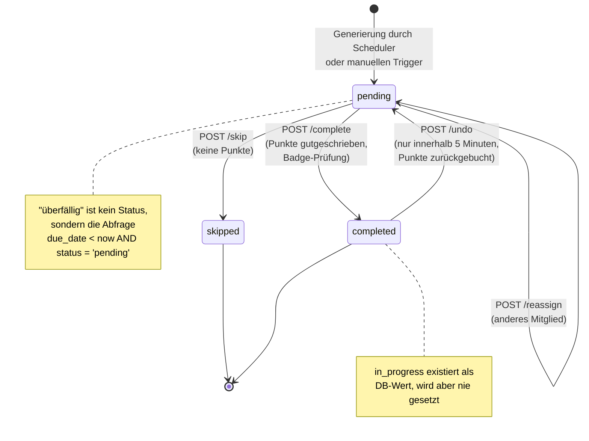

# 03 — Haushalts-/Ämtli-System und Gamification

## Zweck & Geltungsbereich

Dieses Dokument beschreibt vollständig das Haushaltsaufgaben-System („Ämtli") des bestehenden
FamilyHub sowie die darauf aufbauende Gamification (Punkte, Streaks, Abzeichen, Rangliste,
Mitglieds-Statistiken). Es dient als Lastenheft für eine Neuauflage, deren Entwicklungsteam den
Altcode nicht zur Verfügung hat. Rotations-, Generierungs- und Punktealgorithmen sind so
beschrieben, dass sie ohne Altcode identisch nachgebaut werden können. Nicht Gegenstand dieses
Dokuments sind die persönlichen Aufgaben („Tasks", Google-Tasks-Synchronisation), der Kalender und
die Foto-Ansicht.

---

## Inhaltsverzeichnis

- [1. Fachliches Konzept](#1-fachliches-konzept)
- [2. Aufgaben-Vorlagen (Templates)](#2-aufgaben-vorlagen-templates)
- [3. Rotationsalgorithmus im Detail](#3-rotationsalgorithmus-im-detail)
- [4. Generierungslogik und Scheduler](#4-generierungslogik-und-scheduler)
- [5. Erledigung, Zurücknahme, Überspringen, Neuzuweisung](#5-erledigung-zurücknahme-überspringen-neuzuweisung)
- [6. Punktesystem und Streaks](#6-punktesystem-und-streaks)
- [7. Abzeichen (Badges)](#7-abzeichen-badges)
- [8. Rangliste (Leaderboard)](#8-rangliste-leaderboard)
- [9. Statistiken je Mitglied](#9-statistiken-je-mitglied)
- [10. REST-Schnittstellen](#10-rest-schnittstellen)
- [11. Oberfläche](#11-oberfläche)
- [12. Anforderungstabellen](#12-anforderungstabellen)
- [13. Bekannte Schwächen / offene Punkte](#13-bekannte-schwächen--offene-punkte)
- [14. Empfehlungen für die Neuauflage](#14-empfehlungen-für-die-neuauflage)

---

## 1. Fachliches Konzept

### 1.1 Template vs. Instanz

Das System trennt strikt zwischen zwei Entitäten:

| Begriff | Datenbanktabelle | Bedeutung |
|---------|------------------|-----------|
| **Aufgaben-Vorlage** (Template) | `household_task_templates` | Definition einer wiederkehrenden Haushaltsaufgabe: *was*, *wie oft*, *wer kommt in Frage*, *wie viele Punkte*. Enthält keinen konkreten Termin und keine konkrete Person. |
| **Aufgaben-Instanz** (Instance) | `household_task_instances` | Eine konkrete, an genau ein Familienmitglied zugewiesene Ausprägung einer Vorlage für genau einen Tag. Trägt Status, Fälligkeitszeitpunkt, Erledigungszeitpunkt und die zum Generierungszeitpunkt eingefrorenen Punkte. |

**Gründe für die Trennung im Altsystem:**

1. Die Vorlage ist über die PIN-geschützte Einstellungsseite pflegbar, die Instanzen entstehen
   automatisch — die Familie muss nichts terminieren.
2. Die Rotation braucht einen persistenten Merker, wer zuletzt an der Reihe war
   (`last_assigned_member_id` an der Vorlage).
3. Punkte werden bei der Generierung in die Instanz kopiert (`household_task_instances.points`).
   Eine spätere Änderung der Punktzahl an der Vorlage verändert bereits erzeugte Instanzen **nicht**
   — die Punktehistorie bleibt stabil.
4. Statistik und Rangliste werten ausschließlich Instanzen aus.

### 1.2 Lebenszyklus einer Instanz

Eine Instanz kennt genau vier Statuswerte (DB-Constraint auf `household_task_instances.status`):
`pending`, `in_progress`, `completed`, `skipped`.

**Wichtig für den Nachbau:** `in_progress` ist zwar im Datenbank-Constraint erlaubt, wird aber von
keiner Codestelle des Altsystems jemals gesetzt oder gelesen. Es ist toter Wertebereich.

„Überfällig" (overdue) ist **kein** Status, sondern eine reine Abfrage:
`due_date < jetzt AND status = 'pending'`. Es findet keinerlei Statusänderung, keine Benachrichtigung
und kein Punktabzug statt.



Nicht möglich sind im Altsystem: `skipped` → `pending` (Rücknahme eines Skips), `completed` → `skipped`,
`skipped` → `completed`, sowie Neuzuweisung einer bereits erledigten Instanz.

---

## 2. Aufgaben-Vorlagen (Templates)

### 2.1 Feldliste

Tabelle `household_task_templates` (Migrationen `V6`, geändert durch `V18`, `V19`, `V22`).

| Feld (DB) | Feld (API/JSON) | Typ | Pflicht | Default | Wertebereich | Bedeutung |
|-----------|-----------------|-----|---------|---------|--------------|-----------|
| `id` | `id` | SERIAL | ja (auto) | — | > 0 | Primärschlüssel |
| `name` | `name` | VARCHAR(255) | **ja** | — | frei | Anzeigename, z. B. „Müll rausbringen" |
| `description` | `description` | TEXT | nein | `null` | frei | Optionale Detailbeschreibung |
| `category` | `category` | VARCHAR(100) | nein | `null` | frei (UI bietet feste Liste an, s. u.) | Kategorie, steuert im UI das Emoji-Icon |
| `priority` | `priority` | VARCHAR(50) | nein | `'medium'` | `high`, `medium`, `low` (DB-CHECK) | Priorität. **Wird nirgends ausgewertet** — nicht bei Generierung, nicht bei Sortierung; das UI zeigt sie nicht an und bietet kein Eingabefeld. |
| `estimated_duration_minutes` | `estimatedDurationMinutes` | INT | nein | `null` | > 0 | Geschätzte Dauer. **Wird nirgends ausgewertet und im UI nicht gepflegt.** |
| `frequency_type` | `frequencyType` | VARCHAR(50) | **ja** | — | s. Abschnitt 2.2 | Häufigkeit |
| `frequency_config` | `frequencyConfig` | JSONB | **ja** (NOT NULL) | `{}` | beliebiges JSON-Objekt | Historisches Feld für tagesgenaue Konfiguration. **Wird seit V19 von keiner Logik mehr gelesen**; das UI sendet immer `{}`. Die Validierung im Service ignoriert den Inhalt vollständig. |
| `assignment_group` | `assignmentGroup` | VARCHAR(20) | **ja** | `'all'` | `parents`, `children`, `all` (DB-CHECK `chk_assignment_group`) | Zuweisungsgruppe, s. Abschnitt 3.3 |
| `rotation_mode` | `rotationMode` | VARCHAR(50) | nein | `'round_robin'` | `round_robin`, `random`, `load_balanced` (DB-CHECK) | Verteilverfahren, s. Abschnitt 3.4 |
| `points` | `points` | INT | **ja** | `10` | Ganzzahl; UI-Schieberegler 5–50 in 5er-Schritten | Punkte, die eine erledigte Instanz einbringt |
| `default_due_hour` | `defaultDueHour` | INT | nein | `18` | 0–23 (UI-Auswahl) | Uhrzeit, zu der die erzeugte Instanz fällig ist |
| `allow_reassignment` | `allowReassignment` | BOOLEAN | nein | `TRUE` | true/false | Erlaubt Übertragung einer Instanz an ein anderes Mitglied |
| `is_active` | `isActive` | BOOLEAN | nein | `TRUE` | true/false | Nur aktive Vorlagen werden generiert |
| `last_assigned_member_id` | `lastAssignedMemberId` | INT FK → `family_members(id)` ON DELETE SET NULL | nein | `null` | — | Wer zuletzt aus dieser Vorlage zugewiesen bekam. **Alleiniger Zustand der Rotation.** |
| `created_at` | `createdAt` | TIMESTAMP | ja | `NOW()` | — | Anlagezeitpunkt. Wird als Ankerdatum der Vorschau-Berechnung benutzt (Abschnitt 3.6). |
| `updated_at` | — | TIMESTAMP | ja | `NOW()` | — | Letzte Änderung. Wird auch bei jeder Rotationsfortschreibung neu gesetzt. |

Indizes: `idx_household_templates_active` auf `is_active`, `idx_household_templates_category` auf
`category`, `idx_household_templates_assignment_group` auf `assignment_group`.

Es gibt **kein** Icon- und **kein** Farbfeld an der Vorlage. Das Icon wird im Frontend aus der
Kategorie abgeleitet (hartcodierte Emoji-Zuordnung, s. Abschnitt 11.2), die Farbe stammt vom
zugewiesenen Familienmitglied (`family_members.color`).

### 2.2 Frequenz-Typen und ihre exakte Semantik

Die Frequenz legt **ausschließlich einen Mindestabstand in Tagen** zwischen zwei Instanzen derselben
Vorlage fest. Es gibt **keine** Wochentags-, Monatstags- oder Uhrzeit-Konfiguration. Der Fälligkeitstag
ist immer der Generierungstag; die Fälligkeitszeit ist `default_due_hour` desselben Tages.

| Wert | Deutsches UI-Label | UI-Beschreibungstext | Intervall in Tagen | Semantik |
|------|--------------------|----------------------|--------------------|----------|
| `weekly` | „Wöchentlich" | „Einmal pro Woche" | **7** | Neue Instanz frühestens 7 Tage nach der letzten |
| `biweekly` | „Alle 2 Wochen" | „Einmal alle zwei Wochen" | **14** | frühestens nach 14 Tagen |
| `monthly` | „Monatlich" | „Einmal pro Monat" | **30** | frühestens nach 30 Tagen (Kalendermonat wird **nicht** berücksichtigt) |
| `bimonthly` | „Alle 2 Monate" | „Einmal alle zwei Monate" | **60** | frühestens nach 60 Tagen |
| `quarterly` | „Vierteljährlich" | „Einmal pro Quartal (3 Monate)" | **90** | frühestens nach 90 Tagen |
| `semiannually` | „Halbjährlich" | „Einmal alle 6 Monate" | **180** | frühestens nach 180 Tagen |
| `yearly` | „Jährlich" | „Einmal pro Jahr" | **365** | frühestens nach 365 Tagen |
| *(unbekannter Wert)* | — | — | **7** | Fallback: jeder nicht gelistete Wert wird wie `weekly` behandelt |

Kurzform in der Vorlagenliste der Einstellungen (`HouseholdSettings`) — identische Labels:
„Wöchentlich", „Alle 2 Wochen", „Monatlich", „Alle 2 Monate", „Vierteljährlich", „Halbjährlich",
„Jährlich".

**Fälliger Tag:** Es gibt keinen. Eine Instanz entsteht an dem Tag, an dem der Scheduler läuft und
der Mindestabstand erfüllt ist — nicht an einem definierten Wochentag. Für eine wöchentliche Aufgabe
bedeutet das: Wird die erste Instanz an einem Dienstag erzeugt, liegen alle folgenden ebenfalls
dienstags, solange der Scheduler lückenlos läuft. Fällt der Scheduler an einem Tag aus, verschiebt
sich der Rhythmus dauerhaft nach hinten.

**Fällige Uhrzeit:** `assigned_date` um `default_due_hour`:00 Uhr, umgerechnet mit
`ZoneOffset.UTC` in einen Zeitstempel. Die Anwendung rechnet an dieser Stelle explizit in UTC,
während die Streak-Berechnung (Abschnitt 6.3) die Systemzeitzone verwendet — eine Inkonsistenz,
die in Abschnitt 13 aufgeführt ist.

### 2.3 Historie der Frequenz-Werte (Migrationen)

| Migration | Änderung |
|-----------|----------|
| `V6__create_household_task_templates.sql` | Ursprünglicher Wertebereich: `daily`, `weekly`, `monthly`, `custom` |
| `V18__extend_frequency_types.sql` | Erweiterung auf `daily`, `weekly`, `biweekly`, `monthly`, `bimonthly`, `quarterly`, `semiannually`, `yearly`, `custom` |
| `V19__remove_daily_frequency.sql` | Entfernt `daily` (Begründung im Migrationskommentar: „Tasks can only be assigned minimum weekly"). Bestehende Zeilen mit `daily` werden per `UPDATE` auf `weekly` gesetzt. Der neue CHECK-Constraint lässt **auch `custom` nicht mehr zu**, es findet aber **keine** Migration bestehender `custom`-Zeilen statt. |

Das Frontend enthält zusätzlich eine defensive Abbildung: Beim Öffnen des Bearbeiten-Dialogs wird
ein noch vorhandener Wert `daily` auf `weekly` gemappt.

### 2.4 Kategorien

Die Kategorie ist in der Datenbank ein freies Textfeld. Das Frontend bietet eine feste Liste an
(Reihenfolge wie im Dialog):

| ID (= gespeicherter Wert) | Label | Icon |
|---------------------------|-------|------|
| `Reinigung` | „Reinigung" | 🧹 |
| `Küche` | „Küche" | 🍳 |
| `Badezimmer` | „Badezimmer" | 🚿 |
| `Böden` | „Böden" | 🧽 |
| `Wäsche` | „Wäsche" | 👕 |
| `Organisation` | „Organisation" | 📦 |
| `Büro` | „Büro" | 🖥️ |
| `Entsorgung` | „Entsorgung" | 🗑️ |
| `Garten` | „Garten" | 🌱 |
| `Sonstiges` | „Sonstiges" | 📌 (auch Fallback für unbekannte/leere Kategorie) |

Der Default im Anlage-Dialog ist `Sonstiges`.

**Abweichende zweite Liste:** `services/household/HouseholdStatsService.ts` pflegt eine eigene,
davon abweichende Kategorie-Icon-Tabelle (`Reinigung` 🧹, `Küche` 🍳, `Garten` 🌱, `Wäsche` 👕,
`Haustiere` 🐕, `Müll` 🗑️, `Einkaufen` 🛒, Fallback 📋). Die Kategorien „Haustiere", „Müll" und
„Einkaufen" existieren in keinem Eingabeformular; die Liste ist somit teilweise unerreichbar und
inkonsistent zur Hauptliste.

### 2.5 Validierung beim Anlegen/Ändern

Der Server prüft ausschließlich zwei Dinge:

1. `assignmentGroup` ∈ {`parents`, `children`, `all`}, sonst HTTP 400 mit
   `Invalid assignment group: <wert>. Valid groups: parents, children, all`.
2. `frequencyType` ∈ {`weekly`, `biweekly`, `monthly`, `bimonthly`, `quarterly`, `semiannually`,
   `yearly`}, sonst HTTP 400 mit
   `Invalid frequency type: <wert>. Valid types: weekly, biweekly, monthly, bimonthly, quarterly, semiannually, yearly`.

Nicht geprüft werden: leerer Name, Punktebereich, `defaultDueHour` ∈ 0..23, `priority`,
`rotationMode`, `estimatedDurationMinutes`, Inhalt von `frequencyConfig`.

Beim Ändern (`PUT`) gilt Patch-Semantik: nur nicht-`null` Felder werden übernommen. Wird
`frequencyType` geändert, ohne `frequencyConfig` mitzusenden, wird gegen die bestehende
`frequencyConfig` validiert (die inhaltlich ohnehin ignoriert wird).

---

## 3. Rotationsalgorithmus im Detail

Der Rotationsalgorithmus bestimmt, **wer** eine neu zu erzeugende Instanz bekommt. Er läuft pro
Vorlage und pro Generierungstag genau einmal.

### 3.1 Zustand

Der gesamte Rotationszustand besteht aus **einem einzigen Feld pro Vorlage**:
`household_task_templates.last_assigned_member_id`. Es gibt keine Zählerliste, keinen
Fairness-Speicher und keine Historie. Nach jeder erfolgreichen Zuweisung wird das Feld auf das
zugewiesene Mitglied gesetzt und `updated_at` aktualisiert.

Wird das referenzierte Mitglied gelöscht, setzt der Fremdschlüssel (`ON DELETE SET NULL`) das Feld
auf `NULL`; die Rotation beginnt dann wieder beim ersten Poolmitglied.

### 3.2 Der Zuweisungspool

Der Pool ist die Menge der **aktiven** Familienmitglieder (`family_members.is_active = true`),
gefiltert nach der Zuweisungsgruppe der Vorlage. Inaktive Mitglieder sind damit automatisch und
vollständig von der Rotation ausgeschlossen — es gibt darüber hinaus **kein** Abwesenheits-,
Urlaubs- oder Krankheitskonzept.

**Reihenfolge des Pools:** Die Abfragen (`findAllByIsActiveTrue()`,
`findAllByIsActiveTrueAndRole(role)`) enthalten **keine** `ORDER BY`-Klausel. Die Reihenfolge ist
damit formal undefiniert und hängt vom Ausführungsplan der Datenbank ab. Für den Nachbau ist dies
zwingend zu korrigieren (siehe Abschnitt 14); zur Beschreibung des Ist-Verhaltens wird im Folgenden
von einer stabilen Pool-Reihenfolge `P[0..n-1]` ausgegangen.

### 3.3 Zuweisungsgruppen (`assignment_group`) und die Änderung in V22

Bis einschließlich Migration `V21` besaß eine Vorlage die Spalte `rotation_pool INT[] NOT NULL` —
eine **explizite Liste von Mitglieds-IDs**, die der Anwender pro Aufgabe zusammenstellte.

`V22__change_rotation_pool_to_assignment_group.sql` ersetzt dieses Konzept durch eine **rollenbasierte
Gruppe**:

| Wert | Deutsches Label | Beschreibungstext im Dialog | Pool |
|------|-----------------|------------------------------|------|
| `parents` | „Eltern" | „Nur Erwachsene" | alle aktiven Mitglieder mit `role = 'parent'` |
| `children` | „Kinder" | „Nur Kinder" | alle aktiven Mitglieder mit `role = 'child'` |
| `all` | „Alle" | „Alle Familienmitglieder" | alle aktiven Mitglieder |

Ein unbekannter Wert in `assignment_group` fällt im Code auf „alle aktiven Mitglieder" zurück (der
DB-Constraint verhindert solche Werte allerdings).

Die Migration lief in fünf Schritten:

1. Neue Spalte `assignment_group VARCHAR(20) NOT NULL DEFAULT 'all'` anlegen.
2. CHECK-Constraint `chk_assignment_group` auf {`parents`, `children`, `all`} setzen.
3. Bestandsdaten ableiten:
   - `assignment_group = 'parents'`, wenn der bisherige `rotation_pool` nicht leer war, **kein**
     enthaltenes Mitglied die Rolle `child` oder `NULL` hat und **mindestens ein** Mitglied die
     Rolle `parent` hat.
   - `assignment_group = 'children'` analog mit vertauschten Rollen.
   - Alle übrigen Zeilen (gemischte Pools, leere Pools, Pools mit gelöschten Mitgliedern) behalten
     den Default `'all'`.
4. Spalte `rotation_pool` löschen.
5. Index `idx_household_templates_assignment_group` anlegen.

**Fachliche Folge der Umstellung:** Eine individuelle Auswahl einzelner Personen pro Aufgabe ist seit
V22 nicht mehr möglich. Wer zu einer Aufgabe gehört, ergibt sich allein aus der Rolle des Mitglieds
(`family_members.role`, Default `'child'`). Ein Ausschluss einer einzelnen Person von einer
einzelnen Aufgabe ist nicht mehr darstellbar. Bei gemischten Alt-Pools wurde die Einschränkung
ersatzlos auf „Alle" aufgeweitet — hier kam es zu einem stillen Verlust der Zuordnungsabsicht.

### 3.4 Rotationsmodi

| Wert | UI-Label | UI-Beschreibung | Verfahren |
|------|----------|------------------|-----------|
| `round_robin` | „Reihum" | „Fairste Verteilung" | Reihum ab dem Nachfolger des zuletzt Zugewiesenen; überspringt Mitglieder, die das Tageslimit erreicht haben |
| `load_balanced` | „Last-Ausgleich" | „Wer am wenigsten hat" | Mitglied mit den wenigsten **heute zugewiesenen** Instanzen |
| `random` | „Zufällig" | „Zufällige Zuweisung" | Gleichverteilte Zufallsauswahl aus dem Pool |
| *(unbekannter Wert)* | — | — | verhält sich wie `round_robin` |

### 3.5 Tageslimit

Die Konfigurationsgröße `familyhub.household.max-tasks-per-day` begrenzt, wie viele
Haushaltsaufgaben-Instanzen **ein Mitglied an einem Tag zugewiesen** bekommen kann.

- **Default: 5** (der Wert ist in `application.yml` nicht gesetzt, es gilt der Code-Default).
- Gezählt werden alle Instanzen mit `assigned_member_id = X AND assigned_date = <Tag>`,
  **unabhängig vom Status** (auch bereits erledigte und übersprungene zählen mit).
- Das Limit wird in `round_robin` und `load_balanced` berücksichtigt, in `random` **nicht**.

### 3.6 Pseudocode — Auswahl des nächsten Zuständigen

Der folgende Ablauf ist 1:1 nachimplementierbar. Eingaben: die Vorlage `T`, das Generierungsdatum `D`.

```text
FUNKTION waehleNaechstenZustaendigen(T, D) -> Mitglied ODER NICHTS

  1.  P := lade Pool(T.assignmentGroup)
        1a. WENN T.assignmentGroup = "parents"
              P := alle Mitglieder mit is_active = true UND role = "parent"
        1b. SONST WENN T.assignmentGroup = "children"
              P := alle Mitglieder mit is_active = true UND role = "child"
        1c. SONST  (Wert "all" oder unbekannt)
              P := alle Mitglieder mit is_active = true

  2.  WENN P ist leer DANN
        gib NICHTS zurueck            // Aufgabe wird an diesem Tag nicht erzeugt
      ENDE WENN

  3.  VERZWEIGE nach T.rotationMode

      -------- Fall "random" --------
      3a. waehle ein Element aus P mit gleicher Wahrscheinlichkeit
          gib dieses zurueck
          // KEINE Pruefung des Tageslimits, KEINE Beruecksichtigung
          // von last_assigned_member_id

      -------- Fall "load_balanced" --------
      3b. K := { m aus P : anzahlInstanzenAmTag(m, D) < MAX_TASKS_PER_DAY }
      3c. WENN K ist leer DANN gib NICHTS zurueck
      3d. gib dasjenige m aus K zurueck, fuer das anzahlInstanzenAmTag(m, D)
          minimal ist; bei Gleichstand das in der Pool-Reihenfolge P
          zuerst auftretende Element

      -------- Fall "round_robin" (auch Default) --------
      3e. letzteId := T.lastAssignedMemberId          // kann NICHTS sein
      3f. WENN letzteId ist NICHTS DANN
              start := 0
          SONST
              idx := Position von letzteId in P       // -1, falls nicht enthalten
              WENN idx >= 0 DANN
                  start := (idx + 1) MODULO Anzahl(P)
              SONST
                  start := 0                          // z. B. Mitglied inaktiv
                                                      // oder Gruppe gewechselt
              ENDE WENN
          ENDE WENN
      3g. FUER offset VON 0 BIS Anzahl(P) - 1
              kandidat := P[(start + offset) MODULO Anzahl(P)]
              WENN anzahlInstanzenAmTag(kandidat, D) < MAX_TASKS_PER_DAY DANN
                  gib kandidat zurueck
              ENDE WENN
          ENDE FUER
      3h. gib NICHTS zurueck        // alle Poolmitglieder am Tageslimit

ENDE FUNKTION


FUNKTION anzahlInstanzenAmTag(m, D) -> Ganzzahl
  gib Anzahl der Zeilen in household_task_instances zurueck mit
      assigned_member_id = m.id UND assigned_date = D
  (Status wird NICHT gefiltert)
ENDE FUNKTION
```

Fortschreibung des Zustands nach erfolgreicher Erzeugung einer Instanz:

```text
T.lastAssignedMemberId := zugewiesenesMitglied.id
T.updatedAt            := jetzt
speichere T
```

Diese Fortschreibung erfolgt in **allen drei Modi**, also auch bei `random` und `load_balanced`.

### 3.7 Sonderfälle

| Situation | Verhalten des Altsystems |
|-----------|--------------------------|
| Pool ist leer (z. B. `parents`, aber kein aktives Elternteil) | Es wird keine Instanz erzeugt. Der Zähler `skipped` des Generierungslaufs wird um 1 erhöht und eine Warnung protokolliert: `No available assignee for template <Name> on <Datum>`. |
| Pool enthält genau **ein** Mitglied | Dieses Mitglied bekommt jede Instanz. Bei `round_robin` ist `start` immer 0 bzw. `(0+1) mod 1 = 0`. Es gibt keinen Wechsel und keine Sonderbehandlung. |
| Zuletzt zugewiesenes Mitglied ist nicht mehr im Pool (inaktiv geworden, Rolle geändert, Gruppe der Vorlage geändert) | `start := 0` — die Rotation beginnt wieder beim ersten Poolmitglied. Es wird **nicht** versucht, die ursprüngliche Position zu rekonstruieren. |
| Zuletzt zugewiesenes Mitglied gelöscht | `last_assigned_member_id` wird durch den Fremdschlüssel auf `NULL` gesetzt → `start := 0`. |
| Alle Poolmitglieder haben das Tageslimit erreicht | Keine Instanz, `skipped + 1`. Die Aufgabe wird **nicht** auf den Folgetag verschoben; sie entfällt für diesen Tag ersatzlos und der nächste Versuch erfolgt erst, wenn der Frequenz-Mindestabstand ab der letzten *tatsächlich erzeugten* Instanz wieder erfüllt ist. |
| Vorlage ist inaktiv (`is_active = false`) | Sie wird gar nicht erst betrachtet. |

### 3.8 Fairness-Ausgleich

Ein echter Fairness-Ausgleich (Punkteausgleich, Ausgleich über mehrere Aufgaben hinweg,
Nachholmechanismus für übersprungene Personen) **existiert nicht**.

Als einzige Ausgleichsmechanismen wirken:

- `round_robin` verteilt **pro Vorlage** streng reihum. Über mehrere Vorlagen hinweg gibt es keine
  Koordination — es kann daher vorkommen, dass eine Person systematisch bei mehreren Vorlagen
  gleichzeitig an der Reihe ist.
- `load_balanced` gleicht die **Anzahl der an einem einzelnen Tag zugewiesenen Instanzen** aus,
  nicht Punkte, nicht Aufwand, nicht die Historie über mehrere Tage.
- Das Tageslimit (Default 5) deckelt die Tagesbelastung pro Person.

Wird eine Person durch das Tageslimit übersprungen, „schuldet" ihr das System nichts — der
übersprungene Turnus wird nie nachgeholt.

### 3.9 Vorschau (`preview`) — abweichender Algorithmus

Der Endpoint `GET /api/household-tasks/templates/{id}/preview?days=N` (Default `days=30`) liefert
eine Vorausschau der nächsten Zuweisungen. Er verwendet eine **andere** Logik als die tatsächliche
Generierung; die Ergebnisse können daher von der Realität abweichen.

```text
FUNKTION vorschau(templateId, tage = 30) -> Liste von (datum, wochentag, mitgliedId, mitgliedName)

  1.  T := lade Vorlage(templateId)          // 404, falls nicht vorhanden
  2.  P := lade Pool(T.assignmentGroup)      // wie in 3.6 Schritt 1
  3.  WENN P leer DANN gib leere Liste zurueck

  4.  WENN T.lastAssignedMemberId gesetzt UND in P enthalten DANN
          index := (Position + 1) MODULO Anzahl(P)
      SONST
          index := 0
      ENDE WENN

  5.  intervall := intervallTage(T.frequencyType)     // 7/14/30/60/90/180/365, sonst 7
  6.  anlagetag := T.createdAt umgerechnet in ein Datum in UTC

  7.  FUER offset VON 0 BIS tage - 1
          d := heute + offset Tage
          diff := Anzahl Tage zwischen anlagetag und d
          WENN diff >= 0 UND (diff MODULO intervall) = 0 DANN
              m := P[index]
              haenge (d, Wochentag(d), m.id, m.name) an die Ergebnisliste an
              index := (index + 1) MODULO Anzahl(P)
          ENDE WENN
      ENDE FUER

  8.  gib Ergebnisliste zurueck
ENDE FUNKTION
```

Unterschiede zur echten Generierung:

- Der Termin wird aus `created_at + k · Intervall` errechnet, die echte Generierung dagegen aus
  `letzte tatsächlich erzeugte Instanz + Intervall`. Sobald ein Generierungslauf ausgefallen ist
  oder eine Zuweisung mangels Kandidat unterblieb, laufen beide auseinander.
- Die Vorschau verwendet **immer** Reihum-Verteilung, auch wenn die Vorlage `random` oder
  `load_balanced` konfiguriert hat.
- Die Vorschau ignoriert das Tageslimit vollständig.
- Die Vorschau wird im Frontend **nicht aufgerufen** — der Hook `useTemplatePreview` existiert, wird
  aber von keiner Komponente verwendet.

---

## 4. Generierungslogik und Scheduler

### 4.1 Scheduler-Jobs (exakte Cron-Ausdrücke)

Alle Jobs laufen in der Komponente `HouseholdTaskScheduler`; `@EnableScheduling` ist an der
Hauptanwendungsklasse aktiv. Die Cron-Ausdrücke folgen der Spring-Syntax mit **sechs** Feldern
(`Sekunde Minute Stunde Tag Monat Wochentag`) und laufen in der Zeitzone der JVM.

| Job | Auslöser | Bedeutung | Fehlerverhalten |
|-----|----------|-----------|-----------------|
| `generateDailyTasks` | `@Scheduled(cron = "0 0 0 * * *")` — **täglich 00:00:00** | Ruft `generateTasksForDate(heute)` auf. Protokolliert `Generated {created} tasks, skipped {skipped}`. | Exception wird gefangen und nur protokolliert (`Failed to generate daily tasks: …`); kein Retry. |
| `generateOnStartup` | `@Scheduled(initialDelay = 5000, fixedDelay = Long.MAX_VALUE)` — **einmalig 5 Sekunden nach Anwendungsstart** | Ruft ebenfalls `generateTasksForDate(heute)` auf. Protokolliert `Startup generation: {created} tasks created, {skipped} skipped`. | wie oben |
| `resetDailyCounters` | `@Scheduled(cron = "0 1 0 * * *")` — **täglich 00:01:00** | Setzt `tasks_completed_today = 0` für **alle** Statistikzeilen. | wie oben |
| `resetWeeklyCounters` | `@Scheduled(cron = "0 2 0 * * MON")` — **montags 00:02:00** | Setzt `tasks_completed_this_week = 0` für alle Statistikzeilen. | wie oben |
| `resetMonthlyCounters` | `@Scheduled(cron = "0 3 0 1 * *")` — **am 1. jedes Monats 00:03:00** | Setzt `tasks_completed_this_month = 0` für alle Statistikzeilen. | wie oben |

Ein manueller Anstoß ist über `POST /api/household-tasks/instances/generate` möglich, optional mit
`?date=YYYY-MM-DD` (ohne Parameter: heute). Dieser Endpoint ist **nicht** PIN-geschützt.

### 4.2 Pseudocode — Generierungslauf

```text
FUNKTION generiereFuerDatum(D) -> (erzeugt, uebersprungen)

  erzeugt := 0
  uebersprungen := 0

  FUER JEDE Vorlage T mit T.isActive = true

      // (a) Duplikatvermeidung: genau eine Instanz pro Vorlage und Tag
      WENN existiert Instanz mit template_id = T.id UND assigned_date = D DANN
          uebersprungen := uebersprungen + 1
          NAECHSTE Vorlage
      ENDE WENN

      // (b) Frequenz-Mindestabstand pruefen
      letzte := Instanz mit template_id = T.id, groesstes assigned_date (oder NICHTS)
      letztesDatum := letzte.assigned_date  (oder NICHTS)

      WENN letztesDatum ist NICHTS DANN
          darfErzeugen := WAHR
      SONST
          darfErzeugen := (Tage zwischen letztesDatum und D) >= intervallTage(T.frequencyType)
      ENDE WENN

      WENN NICHT darfErzeugen DANN
          NAECHSTE Vorlage        // ACHTUNG: zaehlt NICHT als "uebersprungen"
      ENDE WENN

      // (c) Zustaendigen bestimmen (Abschnitt 3.6)
      m := waehleNaechstenZustaendigen(T, D)
      WENN m ist NICHTS DANN
          protokolliere Warnung "No available assignee for template <T.name> on <D>"
          uebersprungen := uebersprungen + 1
          NAECHSTE Vorlage
      ENDE WENN

      // (d) Instanz anlegen
      faellig := D um T.defaultDueHour:00:00, interpretiert in UTC
      lege an: household_task_instances(
          template_id        = T.id,
          assigned_member_id = m.id,
          assigned_date      = D,
          due_date           = faellig,
          status             = "pending",
          points             = T.points,       // Kopie, spaeter unabhaengig von T
          completed_at       = NULL,
          completed_by_member_id = NULL,
          notes              = NULL
      )
      protokolliere "Generated task '<T.name>' for <m.name> on <D>"

      // (e) Rotationszustand fortschreiben
      T.lastAssignedMemberId := m.id
      T.updatedAt := jetzt
      speichere T

      erzeugt := erzeugt + 1
  ENDE FUER

  gib (erzeugt, uebersprungen) zurueck
ENDE FUNKTION
```

Der gesamte Lauf ist **eine** Datenbanktransaktion (`@Transactional`). Schlägt eine einzelne Vorlage
mit einer Exception fehl, wird der komplette Lauf zurückgerollt.

### 4.3 Vorausschauzeitraum

Es wird **kein** Zeitraum im Voraus generiert. Ein Lauf erzeugt Instanzen ausschließlich für genau
den übergebenen Tag. Zukünftige Aufgaben sind in der Datenbank nicht sichtbar; die Familie sieht
immer nur den aktuellen Tag.

### 4.4 Duplikatvermeidung

Zwei Mechanismen, beide ausschließlich anwendungsseitig:

1. `existsByTemplateIdAndAssignedDate(templateId, D)` — verhindert eine zweite Instanz derselben
   Vorlage am selben Tag.
2. Der Frequenz-Mindestabstand gegenüber der Instanz mit dem größten `assigned_date`.

Es gibt **keinen** Unique-Constraint auf `(template_id, assigned_date)` in der Datenbank. Bei
parallelen Läufen (z. B. Scheduler und manueller Trigger gleichzeitig, oder mehrere
Anwendungsinstanzen) sind Doppelanlagen technisch möglich.

### 4.5 Verhalten bei nachträglich geänderten Vorlagen

| Änderung an der Vorlage | Wirkung auf bereits erzeugte Instanzen | Wirkung auf künftige Instanzen |
|-------------------------|-----------------------------------------|-------------------------------|
| `points` geändert | **keine** — die Instanz behält ihre kopierten Punkte | ab der nächsten Generierung |
| `name`, `category` geändert | **sofort sichtbar**, da die Antwort-DTOs `templateName`/`templateCategory` über die Fremdschlüsselbeziehung auflösen | ja |
| `defaultDueHour` geändert | keine — `due_date` der Instanz bleibt | ab der nächsten Generierung |
| `frequencyType` geändert | keine | ab sofort; der Mindestabstand wird ab der letzten bereits existierenden Instanz neu gemessen. Eine Verkürzung (z. B. monatlich → wöchentlich) kann daher sofort eine neue Instanz auslösen. |
| `assignmentGroup` geändert | keine | ab sofort; ist der bisherige `last_assigned_member_id` nicht im neuen Pool, startet die Rotation bei Index 0 |
| `rotationMode` geändert | keine | ab sofort |
| `allowReassignment` geändert | **wirkt rückwirkend**, da beim Umzuweisen die aktuelle Vorlage geprüft wird | ja |
| `isActive = false` gesetzt | keine — bestehende offene Instanzen bleiben bestehen und bleiben abhakbar | keine weiteren Instanzen |
| Vorlage gelöscht (`DELETE`) | **alle Instanzen werden mitgelöscht** (`ON DELETE CASCADE`) — inklusive bereits erledigter. Punkte in `member_statistics` bleiben stehen, die Rangliste für Zeiträume verliert die Datenbasis. | — |

### 4.6 Verhalten bei Ausfall oder Neustart

**Verpasste Läufe werden nicht nachgeholt.** Der Startup-Job ruft die Generierung ausschließlich für
`heute` auf; ein zwischenzeitlich ausgefallener Tag bleibt dauerhaft ohne Instanzen.

Konkrete Auswirkungen:

- War die Anwendung z. B. drei Tage abgeschaltet, entstehen für diese Tage keine Instanzen.
- Beim Wiederanlaufen wird für heute generiert, sofern der Frequenz-Mindestabstand seit der letzten
  Instanz erfüllt ist. Der Rhythmus verschiebt sich dauerhaft.
- Der Startup-Job und der Mitternachtsjob können am selben Tag beide laufen; der zweite Lauf greift
  dann bei jeder bereits erzeugten Vorlage in die Duplikatprüfung und meldet sie als `skipped`.
- Es existiert kein Protokoll ausgeführter Läufe, kein „letzter erfolgreicher Lauf"-Zeitstempel und
  keine Wiederaufsetzlogik.
- Ein Nachholen kann nur manuell erfolgen, indem
  `POST /api/household-tasks/instances/generate?date=YYYY-MM-DD` für jeden fehlenden Tag einzeln
  aufgerufen wird.

---

## 5. Erledigung, Zurücknahme, Überspringen, Neuzuweisung

### 5.1 Erledigen

`POST /api/household-tasks/instances/{id}/complete?completedByMemberId={memberId}`
Optionaler JSON-Body: `{"notes": "…"}`.

```text
FUNKTION erledige(instanzId, erledigtVonId, notizen)
  1. I := lade Instanz(instanzId)                  // 404, falls nicht vorhanden
  2. M := lade Mitglied(erledigtVonId)             // 404, falls nicht vorhanden
  3. WENN I.status = "completed" DANN
         gib I unveraendert zurueck                // idempotent, KEIN Fehler
     ENDE WENN
  4. I.status              := "completed"
     I.completedAt         := jetzt
     I.completedByMember   := M
     I.notes               := notizen              // ueberschreibt auch mit NULL
     speichere I
  5. verbucheErledigung(M, I.points)               // Abschnitt 6.2
  6. pruefeAbzeichen(M)                            // Abschnitt 7.3
  7. gib I zurueck
ENDE FUNKTION
```

**Wer darf abhaken:** Jeder. Es gibt keine Authentifizierung auf diesem Endpoint, keine PIN-Prüfung
und keine Prüfung, ob `completedByMemberId` mit `assigned_member_id` übereinstimmt. Ein beliebiges
Mitglied kann eine fremde Aufgabe für sich verbuchen und erhält dafür die Punkte — der
Zusammenhang zwischen `assigned_member_id` (wem zugeteilt) und `completed_by_member_id` (wer die
Punkte bekommt) wird nirgends validiert. Die Weboberfläche sendet allerdings stets
`assignedMember.id`.

**Bestätigung durch Eltern:** Es gibt **keinen** Verifikationsschritt. Weder existiert ein
Statuswert für „zur Prüfung eingereicht", noch ein Feld `verified_by`, noch ein Endpoint zum
Freigeben. Punkte werden sofort und endgültig gutgeschrieben.

### 5.2 Zurücknehmen (Undo)

`POST /api/household-tasks/instances/{id}/undo` — ohne Parameter.

```text
FUNKTION nimmZurueck(instanzId)
  1. I := lade Instanz(instanzId)                              // 404
  2. WENN I.status <> "completed" DANN
         gib I unveraendert zurueck                            // idempotent
     ENDE WENN
  3. WENN I.completedAt < (jetzt - 300 Sekunden) DANN
         Fehler 400 mit Meldung "Cannot undo completion after 5 minutes"
     ENDE WENN
  4. bisherigerErlediger := I.completedByMember
  5. I.status            := "pending"
     I.completedAt       := NULL
     I.completedByMember := NULL
     speichere I
        // ACHTUNG: I.notes wird NICHT zurueckgesetzt
  6. WENN bisherigerErlediger <> NICHTS DANN
         storniereErledigung(bisherigerErlediger, I.points)    // Abschnitt 6.2
     ENDE WENN
  7. gib I zurueck
ENDE FUNKTION
```

Die Frist beträgt exakt **300 Sekunden**. Ein bereits verliehenes Abzeichen wird **nicht** entzogen;
die Streak-Werte werden **nicht** korrigiert (siehe Abschnitt 6.4).

### 5.3 Überspringen

`POST /api/household-tasks/instances/{id}/skip` — ohne Parameter.

- Ist die Instanz bereits `completed`: HTTP 400 mit `Cannot skip a completed task`.
- Sonst: `status := "skipped"`. Keine Punkte, keine Statistikänderung, keine Begründung erfassbar,
  **keine Rücknahmemöglichkeit**.
- Übersprungene Instanzen zählen weiterhin in das Tageslimit (Abschnitt 3.5) und werden in der
  Kennzahl „zugewiesen" der Mitgliedsstatistik mitgezählt, senken also die Erledigungsrate.
- Die Weboberfläche bietet **keine** Schaltfläche zum Überspringen an; der Endpoint ist nur über die
  API erreichbar.

### 5.4 Neuzuweisung

`POST /api/household-tasks/instances/{id}/reassign?newMemberId={memberId}`

- Ist `template.allowReassignment = false`: HTTP 400 mit `This task cannot be reassigned`.
- Ist die Instanz `completed`: HTTP 400 mit `Cannot reassign completed task`.
- Existiert `newMemberId` nicht: HTTP 404 mit `Member not found: <id>`.
- Sonst: `assigned_member_id := newMemberId`.

Es wird **nicht** geprüft, ob das neue Mitglied aktiv ist, ob es zur Zuweisungsgruppe der Vorlage
gehört oder ob es dadurch das Tageslimit überschreitet. Der Rotationszustand
(`last_assigned_member_id`) wird durch eine Neuzuweisung **nicht** verändert — die nächste
Generierung rotiert also unabhängig von der Umverteilung weiter. Die Weboberfläche bietet auch
hierfür **keine** Bedienelemente an; der Hook `useReassignHouseholdTask` existiert, wird aber von
keiner Komponente aufgerufen.

### 5.5 Überfällige Aufgaben

`GET /api/household-tasks/instances/overdue` liefert alle Instanzen mit
`due_date < jetzt AND status = 'pending'`.

Es gibt **keine** weitere Behandlung: kein automatischer Statuswechsel, kein Punktabzug, keine
Eskalation, keine Benachrichtigung, keine Übertragung auf den Folgetag, keine Kennzeichnung in der
Weboberfläche. Der Endpoint wird vom Frontend nicht aufgerufen.

---

## 6. Punktesystem und Streaks

### 6.1 Berechnungsformel

Es gibt genau **eine** Punktequelle: das Erledigen einer Haushaltsaufgaben-Instanz.

```text
gutschrift = instanz.points
```

`instanz.points` ist die zum Generierungszeitpunkt kopierte `template.points`.

Ausdrücklich **nicht** vorhanden sind:

- Multiplikatoren jeglicher Art (Schwierigkeit, Priorität, Kategorie, Dauer),
- ein Pünktlichkeitsbonus (die Erledigungszeit wird nicht mit `due_date` verglichen),
- ein Malus für verspätete oder nicht erledigte Aufgaben,
- ein Streak-Bonus auf Punkte,
- eine Gutschrift der Punkte eines verliehenen Abzeichens (siehe Abschnitt 7.5),
- Punkte aus persönlichen Aufgaben („Tasks") — diese sind vollständig vom Punktesystem getrennt.

Das UI-Eingabefeld begrenzt `points` auf 5 bis 50 in 5er-Schritten; der Server erzwingt diese
Grenzen nicht.

### 6.2 Buchungen auf `member_statistics`

Beim Erledigen (`recordTaskCompletion`), in dieser Reihenfolge:

```text
1. S := Statistikzeile des Mitglieds; existiert keine, lege eine mit allen Zaehlern auf 0 an
2. S.totalTasksCompleted      := S.totalTasksCompleted + 1
3. S.totalPointsEarned        := S.totalPointsEarned + gutschrift
4. S.tasksCompletedToday      := S.tasksCompletedToday + 1
5. S.tasksCompletedThisWeek   := S.tasksCompletedThisWeek + 1
6. S.tasksCompletedThisMonth  := S.tasksCompletedThisMonth + 1
7. aktualisiereStreak(S, heute)          // liest S.lastTaskCompletedAt im ALTEN Zustand
8. S.lastTaskCompletedAt      := jetzt
9. S.updatedAt                := jetzt
10. speichere S
```

Reihenfolge beachten: Schritt 7 muss **vor** Schritt 8 erfolgen, da die Streak-Logik den bisherigen
Wert von `lastTaskCompletedAt` benötigt.

Beim Zurücknehmen (`reverseTaskCompletion`):

```text
S.totalTasksCompleted     := max(0, S.totalTasksCompleted - 1)
S.totalPointsEarned       := max(0, S.totalPointsEarned - gutschrift)
S.tasksCompletedToday     := max(0, S.tasksCompletedToday - 1)
S.tasksCompletedThisWeek  := max(0, S.tasksCompletedThisWeek - 1)
S.tasksCompletedThisMonth := max(0, S.tasksCompletedThisMonth - 1)
S.updatedAt               := jetzt
```

Alle Zähler sind bei 0 abgeschnitten. `currentStreakDays`, `longestStreakDays` und
`lastTaskCompletedAt` werden **nicht** zurückgesetzt.

### 6.3 Streak-Logik

Ein Streak zählt **Kalendertage, an denen mindestens eine Haushaltsaufgabe erledigt wurde**. Er wird
ausschließlich beim Erledigen einer Aufgabe neu bewertet.

```text
FUNKTION aktualisiereStreak(S, heute)
  1. letzterTag := WENN S.lastTaskCompletedAt gesetzt
                      DANN S.lastTaskCompletedAt umgerechnet in ein Datum
                           in der SYSTEMZEITZONE der Anwendung
                      SONST NICHTS

  2. WENN letzterTag ist NICHTS DANN
         S.currentStreakDays := 1
     SONST
         diff := Anzahl Kalendertage zwischen letzterTag und heute
         WENN diff = 0 DANN
             // gleicher Tag: Streak bleibt unveraendert
         SONST WENN diff = 1 DANN
             S.currentStreakDays := S.currentStreakDays + 1
         SONST
             // Luecke von 2 oder mehr Tagen (oder negativer Wert)
             S.currentStreakDays := 1
         ENDE WENN
     ENDE WENN

  3. WENN S.currentStreakDays > S.longestStreakDays DANN
         S.longestStreakDays := S.currentStreakDays
     ENDE WENN
ENDE FUNKTION
```

Konkrete Beispiele (durch Tests im Altsystem festgeschrieben):

| Ausgangslage | Aktion | Ergebnis |
|--------------|--------|----------|
| `lastTaskCompletedAt = NULL`, `currentStreakDays = 0` | Aufgabe erledigt | `currentStreakDays = 1` |
| letzte Erledigung gestern, `currentStreakDays = 3` | Aufgabe erledigt | `currentStreakDays = 4` |
| letzte Erledigung heute, `currentStreakDays = 5` | zweite Aufgabe erledigt | `currentStreakDays = 5` (unverändert) |
| letzte Erledigung vor 2 Tagen, `currentStreakDays = 10` | Aufgabe erledigt | `currentStreakDays = 1` |
| letzte Erledigung gestern, `currentStreakDays = 7`, `longestStreakDays = 7` | Aufgabe erledigt | `currentStreakDays = 8`, `longestStreakDays = 8` |

**Wichtige Eigenschaft (und Schwäche):** Der Streak „bricht" nicht von selbst. Erledigt jemand
14 Tage lang nichts, bleibt `current_streak_days` unverändert auf dem alten Wert stehen und wird
überall — Rangliste, Statistikkarte, Abzeichenprüfung — weiterhin so angezeigt. Erst die nächste
Erledigung setzt ihn auf 1 zurück. Es existiert kein Scheduler, der Streaks abends prüft.

### 6.4 Level und Ränge

**Es gibt kein Level-System und keine Rangstufen.** Weder Backend noch Frontend enthalten eine
Umrechnung von Punkten in ein Level, eine Erfahrungsstufe oder einen Titel. Der Begriff „Rang" tritt
ausschließlich als Platzierung in der Rangliste auf (Abschnitt 8) und ist keine dauerhafte
Eigenschaft eines Mitglieds. Die Abzeichen kennen zwar Stufen (`tier`), diese sind aber Eigenschaft
des Abzeichens, nicht des Mitglieds.

---

## 7. Abzeichen (Badges)

### 7.1 Datenmodell

`badge_definitions` (Migration `V8`):

| Feld | Typ | Pflicht | Default | Wertebereich | Bedeutung |
|------|-----|---------|---------|--------------|-----------|
| `id` | SERIAL | ja | — | — | Primärschlüssel |
| `name` | VARCHAR(100) | ja | — | frei | Anzeigename (deutsch) |
| `description` | TEXT | ja | — | frei | Beschreibung der Bedingung (deutsch) |
| `icon` | VARCHAR(50) | ja | — | frei | Icon-Bezeichner, s. Abschnitt 7.6 |
| `tier` | VARCHAR(20) | ja | — | `bronze`, `silver`, `gold`, `platinum`, `diamond` (DB-CHECK) | Stufe, steuert die Farbgebung im UI |
| `rarity` | VARCHAR(20) | ja | — | `common`, `uncommon`, `rare`, `epic`, `legendary` (DB-CHECK) | Seltenheit, steuert Rahmenfarbe und Kennzeichen im UI |
| `points` | INT | ja | `0` | — | Punktwert des Abzeichens. **Wird nirgends verbucht** (Abschnitt 7.5), nur angezeigt. |
| `criteria` | JSONB | ja | — | s. Abschnitt 7.2 | Auslösebedingung |
| `one_time_only` | BOOLEAN | nein | `TRUE` | true/false | Nur einmal verleihbar |
| `is_active` | BOOLEAN | nein | `TRUE` | true/false | Nur aktive Abzeichen werden geprüft und angezeigt |
| `created_at` | TIMESTAMP | ja | `NOW()` | — | — |

`member_badges` (Migration `V9`): `id`, `member_id` (FK, CASCADE), `badge_id` (FK, CASCADE),
`earned_at` (Default `NOW()`), `metadata` (JSONB), **`UNIQUE(member_id, badge_id)`**.

Der Unique-Constraint macht eine Mehrfachverleihung desselben Abzeichens an dasselbe Mitglied
datenbankseitig unmöglich — unabhängig vom Flag `one_time_only`.

### 7.2 Vollständige Tabelle der Seed-Abzeichen

Alle acht Abzeichen stammen aus `V8__create_badge_definitions.sql`. Es gibt **keine** weiteren
Abzeichen, keine Verwaltungsoberfläche und keinen Schreib-Endpoint für Abzeichendefinitionen.

| # | Name (deutsch, = Schlüssel) | Beschreibung (deutsch, Original) | Icon | Stufe | Seltenheit | Punkte | `criteria` (JSON) | Präzise Regel |
|---|------------------------------|-----------------------------------|------|-------|------------|--------|-------------------|---------------|
| 1 | **Streak-Master Bronze** | „7 Tage in Folge mindestens eine Aufgabe erledigt" | `flame` | bronze | common | 50 | `{"type":"streak","days":7}` | `member_statistics.current_streak_days >= 7` |
| 2 | **Streak-Master Silber** | „30 Tage in Folge mindestens eine Aufgabe erledigt" | `flame` | silver | uncommon | 150 | `{"type":"streak","days":30}` | `current_streak_days >= 30` |
| 3 | **Streak-Master Gold** | „90 Tage in Folge mindestens eine Aufgabe erledigt" | `flame` | gold | rare | 500 | `{"type":"streak","days":90}` | `current_streak_days >= 90` |
| 4 | **Century Club** | „100 Aufgaben insgesamt erledigt" | `award` | gold | rare | 200 | `{"type":"count","threshold":100,"category":"all","timeframe":"all_time"}` | Anzahl aller Instanzen mit `completed_by_member_id = M` **und** `status = 'completed'` ≥ 100 (über die gesamte Historie) |
| 5 | **Speed Demon** | „10 Aufgaben an einem Tag erledigt" | `zap` | silver | uncommon | 100 | `{"type":"speed","tasksPerDay":10}` | Anzahl Instanzen mit `completed_by_member_id = M`, `assigned_date = heute`, `status = 'completed'` ≥ 10 |
| 6 | **Putz-Profi** | „Die meisten Putz-Aufgaben im Monat" | `sparkles` | gold | rare | 150 | `{"type":"monthly_leader","category":"cleaning"}` | **Tatsächlich implementiert:** mindestens **eine** erledigte Instanz seit Monatsanfang, deren Vorlage die Kategorie `cleaning` hat. Es findet **kein** Vergleich mit anderen Mitgliedern statt — die Beschreibung „die meisten" ist nicht umgesetzt. |
| 7 | **Early Bird** | „Die meisten Aufgaben vor 10 Uhr erledigt (im Monat)" | `sunrise` | silver | uncommon | 100 | `{"type":"early_bird","beforeHour":10}` | Anzahl Instanzen mit `completed_by_member_id = M`, `assigned_date >= erster Tag des laufenden Monats`, `completed_at IS NOT NULL` und `Stunde(completed_at) < 10` ≥ **10** (Schwellwert aus dem fehlenden Feld `count`, Default 10). Auch hier **kein** Vergleich mit anderen Mitgliedern. |
| 8 | **Task Terminator Bronze** | „7 Tage alle zugewiesenen Aufgaben pünktlich erledigt" | `check-circle` | bronze | common | 75 | `{"type":"completion_streak","days":7}` | 7 Tage mit vollständiger Erledigung, s. detaillierten Algorithmus unten. „Pünktlich" wird **nicht** geprüft — `due_date` spielt keine Rolle. |

### 7.3 Prüf- und Verleihalgorithmus

```text
FUNKTION pruefeAbzeichen(M) -> Liste neu verliehener Abzeichen
  1. A := alle Abzeichendefinitionen mit is_active = true
  2. bereitsErhalten := Menge der badge_id aus member_badges fuer M
  3. S := Statistikzeile von M (oder NICHTS)
  4. neu := leere Liste

  5. FUER JEDES B aus A
         WENN B.id in bereitsErhalten UND B.oneTimeOnly DANN
             NAECHSTES B
         ENDE WENN
         WENN kriteriumErfuellt(M.id, B, S) DANN
             WENN B.id NICHT in bereitsErhalten DANN
                 verleihe(M, B)
                 haenge B an neu an
             ENDE WENN
         ENDE WENN
     ENDE FUER

  6. gib neu zurueck
ENDE FUNKTION

FUNKTION verleihe(M, B)
  protokolliere "Awarding badge '<B.name>' to <M.name>"
  lege an: member_badges(
      member_id = M.id,
      badge_id  = B.id,
      earned_at = jetzt,
      metadata  = { "awardedAt": <heutiges Datum als ISO-Text> }
  )
ENDE FUNKTION
```

**Auslösezeitpunkt:** ausschließlich am Ende von `completeTask` und nur für das Mitglied, das
erledigt hat (`completed_by_member_id`). Es gibt **keine** zeitgesteuerte Prüfung, keine Prüfung
beim Anlegen eines Mitglieds und keine Prüfung für andere Mitglieder.

**Mehrfachverleihung:** faktisch unmöglich. Selbst bei `one_time_only = false` verhindert Schritt 5
(`WENN B.id NICHT in bereitsErhalten`) eine zweite Verleihung, zusätzlich greift der
Unique-Constraint. Ein Abzeichen kann also je Mitglied genau einmal verliehen werden.

**Entzug:** nicht vorgesehen. Ein Undo einer Erledigung entzieht ein dadurch ausgelöstes Abzeichen
nicht.

### 7.4 Detailalgorithmen der Kriterientypen

```text
kriteriumErfuellt(memberId, B, S):
  typ := B.criteria["type"]              // fehlt der Schluessel -> FALSCH
  VERZWEIGE nach typ:

  "count":
      schwelle := B.criteria["threshold"]        // fehlt -> FALSCH
      kategorie := B.criteria["category"]        // optional
      zeitraum  := B.criteria["timeframe"] oder "all_time"
      WENN zeitraum = "all_time" UND (kategorie = "all" ODER kategorie fehlt) DANN
          n := ANZAHL(instanzen mit completed_by_member_id = memberId
                                UND status = "completed")
      SONST WENN zeitraum = "all_time" UND kategorie gesetzt DANN
          n := ANZAHL(instanzen mit completed_by_member_id = memberId
                                UND template.category = kategorie
                                UND status = "completed")
      SONST
          n := ANZAHL(instanzen mit completed_by_member_id = memberId
                                UND status = "completed")   // Zeitraum ignoriert
      ENDE WENN
      gib (n >= schwelle) zurueck

  "streak":
      tage := B.criteria["days"]                 // fehlt -> FALSCH
      gib ((S.currentStreakDays oder 0) >= tage) zurueck

  "speed":
      proTag := B.criteria["tasksPerDay"]        // fehlt -> FALSCH
      n := ANZAHL(instanzen mit completed_by_member_id = memberId
                            UND assigned_date = heute
                            UND status = "completed")
      gib (n >= proTag) zurueck

  "monthly_leader":
      kategorie := B.criteria["category"]        // fehlt -> FALSCH
      monatsanfang := erster Tag des laufenden Monats
      L := instanzen mit completed_by_member_id = memberId
                    UND assigned_date > (monatsanfang - 1 Tag)
                    UND status = "completed"
      L := L gefiltert auf status = "completed" UND template.category = kategorie
      gib (L ist nicht leer) zurueck

  "early_bird":
      vorStunde := B.criteria["beforeHour"] oder 10
      anzahlNoetig := B.criteria["count"] oder 10
      monatsanfang := erster Tag des laufenden Monats
      n := ANZAHL(instanzen mit completed_by_member_id = memberId
                            UND assigned_date >= monatsanfang
                            UND completed_at IS NOT NULL
                            UND Stunde(completed_at) < vorStunde)
      gib (n >= anzahlNoetig) zurueck
      // Hinweis: der Status wird hier NICHT gefiltert; da completed_at aber
      // nur beim Erledigen gesetzt wird, ist das praktisch gleichwertig.

  "completion_streak":
      noetigeTage := B.criteria["days"]          // fehlt -> FALSCH
      strecke := 0
      pruefTag := heute
      WIEDERHOLE (noetigeTage + 7) MAL
          I := alle Instanzen mit assigned_member_id = memberId
                             UND assigned_date = pruefTag
          WENN I leer DANN
              // Tag ohne Zuweisung: Strecke bleibt unveraendert (bricht NICHT)
          SONST WENN alle Elemente von I haben status = "completed" DANN
              strecke := strecke + 1
          SONST
              strecke := 0
          ENDE WENN
          WENN strecke >= noetigeTage DANN gib WAHR zurueck
          pruefTag := pruefTag - 1 Tag
      ENDE WIEDERHOLE
      gib FALSCH zurueck

  sonst:
      gib FALSCH zurueck
```

Besonderheiten, die beim Nachbau zu beachten sind:

- `completion_streak` betrachtet `assigned_member_id` (wem zugeteilt), alle anderen Kriterien
  `completed_by_member_id` (wer erledigt hat).
- `completion_streak` durchsucht maximal `days + 7` Tage rückwärts. Bei `days = 7` liegt das
  Suchfenster also bei 14 Tagen; mehr als 7 Tage ohne Zuweisung im Fenster machen das Abzeichen
  unerreichbar, da die Schleife vorher endet.
- `monthly_leader` mit `assigned_date > monatsanfang - 1 Tag` schließt den Monatsersten ein.
- `early_bird` wertet die Stunde von `completed_at` über die HQL-Funktion `HOUR()` aus, also in der
  Zeitzone der Datenbank-/JVM-Auswertung des Zeitstempels, nicht in der Anzeigezeitzone der Familie.

### 7.5 Punkte eines Abzeichens

Die Spalte `badge_definitions.points` wird ausschließlich zur Anzeige verwendet (Frontend:
„+{points} Punkte"). Beim Verleihen findet **keine** Buchung auf `member_statistics.total_points_earned`
statt. Die in der Oberfläche versprochenen Abzeichen-Punkte fließen also nicht in Rangliste oder
Punktestand ein.

### 7.6 Icon-Bezeichner

Die Seed-Daten verwenden Namen aus der Icon-Bibliothek `lucide`: `flame`, `award`, `zap`,
`sparkles`, `sunrise`, `check-circle`.

Das Frontend rendert das Feld `badge.icon` jedoch als **reinen Text** (`<span>{badge.icon}</span>`)
und erwartet dort ein Emoji. Die Seed-Abzeichen erscheinen deshalb in der Oberfläche mit den
Zeichenketten „flame", „award", „zap", „sparkles", „sunrise", „check-circle" statt mit einem Symbol.
Die Testdaten des Altsystems arbeiten dagegen mit Emojis (z. B. `🏆`), was zeigt, dass die
Emoji-Variante die beabsichtigte war.

### 7.7 Fortschrittsanzeige

`GET /api/badges/member/{memberId}/progress` liefert für **jedes aktive Abzeichen** einen
Fortschritt:

```text
fuer jedes aktive Abzeichen B:
   isEarned        := B.id ist in member_badges des Mitglieds enthalten
   (aktuell, ziel) := fortschritt(memberId, B, S)
   progressPercent := WENN ziel > 0 DANN min(100, ganzzahlig(aktuell * 100 / ziel)) SONST 0

fortschritt(memberId, B, S):
   "count"  -> (Anzahl aller erledigten Instanzen des Mitglieds, B.criteria["threshold"] oder 1)
   "streak" -> (S.currentStreakDays oder 0,                      B.criteria["days"] oder 1)
   "speed"  -> (heute erledigte Instanzen des Mitglieds,         B.criteria["tasksPerDay"] oder 1)
   sonst    -> (0, 1)
```

Für die Kriterientypen `monthly_leader`, `early_bird` und `completion_streak` gibt es **keine**
Fortschrittsberechnung — sie melden immer 0 von 1 (0 %). Der Fortschritt für `count` ignoriert eine
eventuell gesetzte Kategorie und zählt stets alle erledigten Aufgaben.

---

## 8. Rangliste (Leaderboard)

### 8.1 Zeiträume

Der Parameter `period` steuert die Datenbasis. Der zulässige Standardwert im Frontend ist `week`.

| `period` | Startdatum `dateStart` | Tatsächliche Filterbedingung | Datenquelle |
|----------|------------------------|-------------------------------|-------------|
| `today` | heute | `assigned_date > (heute − 1 Tag)`, also `assigned_date >= heute` | erledigte Instanzen |
| `week` | heute − 7 Tage | `assigned_date > (heute − 8 Tage)` — praktisch die **letzten 8 Kalendertage inklusive heute** | erledigte Instanzen |
| `month` | heute − 30 Tage | `assigned_date > (heute − 31 Tage)` — die **letzten 31 Kalendertage** | erledigte Instanzen |
| `all_time` bzw. **jeder andere Wert** | — | keine | `member_statistics.total_tasks_completed` und `total_points_earned` |

Es handelt sich um **gleitende Zeitfenster**, nicht um Kalenderwoche oder Kalendermonat. Die
Verschiebung um einen zusätzlichen Tag (`.minusDays(1)` in Kombination mit dem strikten `>`) ist im
Altsystem so implementiert; die tatsächlichen Fenster sind also einen Tag länger als die Bezeichnung
suggeriert.

Ein unbekannter `period`-Wert löst **keinen Fehler** aus, sondern liefert stillschweigend die
Gesamtwertung.

### 8.2 Berechnung eines Eintrags

```text
FUNKTION rangliste(period, limit) -> Liste von Eintraegen
  1. Mitglieder := alle Mitglieder mit is_active = true
  2. dateStart  := gemaess Tabelle in 8.1 (oder NICHTS bei all_time)
  3. Eintraege := leer

  4. FUER JEDES Mitglied m
         S  := Statistikzeile von m (oder NICHTS)
         bc := ANZAHL(member_badges mit member_id = m.id)

         WENN dateStart <> NICHTS DANN
             L := Instanzen mit completed_by_member_id = m.id
                            UND assigned_date > (dateStart - 1 Tag)
                            UND status = "completed"
             aufgaben := Anzahl(L)
             punkte   := Summe ueber L von instanz.points
         SONST
             aufgaben := S.totalTasksCompleted   oder 0
             punkte   := S.totalPointsEarned     oder 0
         ENDE WENN

         haenge Eintrag an: {
             memberId, memberName, profilePhotoUrl, color,
             tasksCompleted = aufgaben,
             pointsEarned   = punkte,
             badgeCount     = bc,
             currentStreak  = S.currentStreakDays oder 0
         }
     ENDE FUER

  5. sortiere Eintraege ABSTEIGEND nach pointsEarned
  6. behalte die ersten `limit` Eintraege
  7. setze rank := Position + 1 (beginnend bei 1)
  8. gib Eintraege zurueck
ENDE FUNKTION
```

Der Standardwert von `limit` ist **10**.

### 8.3 Sortierung und Gleichstand

- **Einziges Sortierkriterium:** `pointsEarned` absteigend.
- **Kein Tie-Breaking.** Bei Punktgleichstand entscheidet die Stabilität der verwendeten Sortierung,
  also die ursprüngliche Reihenfolge der Mitgliederliste aus der Datenbank — die ihrerseits ohne
  `ORDER BY` abgefragt wird und damit undefiniert ist.
- **Ränge sind fortlaufend, nicht geteilt.** Zwei Mitglieder mit je 100 Punkten erhalten Rang 1 und
  Rang 2, nicht zweimal Rang 1.
- Mitglieder ohne Punkte und ohne Statistikzeile erscheinen mit 0 Punkten in der Liste (sofern sie
  innerhalb `limit` liegen); die Liste ist also keine reine „Bestenliste".
- `currentStreak` und `badgeCount` stammen immer aus dem Gesamtbestand und werden **nicht** auf den
  gewählten Zeitraum eingeschränkt.

### 8.4 Aktualisierung

Die Rangliste wird bei **jedem** Aufruf vollständig neu berechnet; es gibt keinen Cache, keine
materialisierte Sicht und keinen Vorberechnungs-Job. Die Antwort enthält ein Feld `updatedAt` mit
dem Zeitpunkt der Berechnung.

Im Frontend wird sie über TanStack Query ohne gesetztes `staleTime` und ohne `refetchInterval`
geladen; sie aktualisiert sich also beim Einhängen der Komponente, beim Fensterfokus und nach jeder
Aufgaben-Erledigung (die Erledigungs-Mutation invalidiert den gesamten `['household']`-Schlüsselraum
— nicht jedoch den `['gamification']`-Schlüsselraum, unter dem die Rangliste liegt).

### 8.5 Zweite, abweichende Rangliste

Neben `/api/leaderboard` existiert ein zweiter, unabhängiger Endpoint
`GET /api/family-members/leaderboard` mit abweichender Logik und abweichendem Antwortformat:

- Datenquelle: nur Zeilen aus `member_statistics` von aktiven Mitgliedern, sortiert nach
  `total_points_earned` absteigend.
- Mitglieder **ohne** Statistikzeile fehlen vollständig.
- Kein `period`-Parameter, kein `limit`.
- Antwortformat: `{ entries: [{ rank, member: <vollständiges Mitglied>, totalPoints, currentStreak, badgeCount }], updatedAt }`.

Dieser Endpoint wird vom Frontend nicht verwendet und ist redundant.

---

## 9. Statistiken je Mitglied

### 9.1 Gespeicherte Kennzahlen

Tabelle `member_statistics` (Migration `V10`), genau **eine** Zeile je Mitglied
(`member_id` mit UNIQUE-Constraint, FK CASCADE).

| Feld | Typ | Default | Berechnung | Zurückgesetzt durch |
|------|-----|---------|------------|---------------------|
| `total_tasks_completed` | INT | 0 | +1 je Erledigung, −1 (min. 0) je Undo | nie |
| `total_points_earned` | INT | 0 | + `instanz.points` je Erledigung, − `instanz.points` (min. 0) je Undo | nie |
| `current_streak_days` | INT | 0 | Algorithmus aus Abschnitt 6.3 | nie automatisch; nur implizit bei der nächsten Erledigung nach einer Lücke |
| `longest_streak_days` | INT | 0 | Maximum aller je erreichten `current_streak_days` | nie |
| `last_task_completed_at` | TIMESTAMP | `NULL` | Zeitpunkt der letzten Erledigung | nie (auch nicht bei Undo) |
| `tasks_completed_today` | INT | 0 | +1 je Erledigung, −1 (min. 0) je Undo | Scheduler täglich 00:01:00 |
| `tasks_completed_this_week` | INT | 0 | +1 je Erledigung, −1 (min. 0) je Undo | Scheduler montags 00:02:00 |
| `tasks_completed_this_month` | INT | 0 | +1 je Erledigung, −1 (min. 0) je Undo | Scheduler am 1. des Monats 00:03:00 |
| `updated_at` | TIMESTAMP | `NOW()` | bei jeder Buchung und bei jedem Reset | — |

Indizes: `idx_member_statistics_member` auf `member_id`,
`idx_member_statistics_points` auf `total_points_earned DESC`.

Die Zeile wird **lazy** angelegt: erst bei der ersten Erledigung eines Mitglieds
(`getOrCreateStatistics`). Vorher liefern alle abfragenden Stellen die Ersatzwerte 0 bzw. `null`.

### 9.2 Ad-hoc berechnete Kennzahlen

`GET /api/household-tasks/instances/stats/{memberId}?period={today|week|month}` liefert eine
gemischte Kennzahlenmenge:

| Feld | Herkunft | Berechnung |
|------|----------|------------|
| `totalAssigned` | Instanzen | Anzahl aller Instanzen des Mitglieds im Zeitraum, **jeden Status** (inkl. `skipped`) |
| `totalCompleted` | Instanzen | davon mit `status = 'completed'` |
| `completionRate` | berechnet | `WENN totalAssigned > 0 DANN ganzzahlig(totalCompleted * 100 / totalAssigned) SONST 0` — **abgeschnitten, nicht gerundet** |
| `totalPoints` | `member_statistics` | `total_points_earned` — **immer der Gesamtwert, unabhängig vom `period`-Parameter** |
| `currentStreak` | `member_statistics` | `current_streak_days` — ebenfalls zeitraumunabhängig |
| `longestStreak` | `member_statistics` | `longest_streak_days` — ebenfalls zeitraumunabhängig |

Zeitraumdefinition dieser Abfrage (abweichend von der Rangliste!):

| `period` | Filter auf Instanzen |
|----------|----------------------|
| `today` | `assigned_member_id = M AND assigned_date = heute` |
| `week` | `assigned_member_id = M AND assigned_date > (heute − 7 Tage)` |
| `month` | `assigned_member_id = M AND assigned_date > (heute − 30 Tage)` |
| jeder andere Wert | liefert `totalAssigned = 0`, `totalCompleted = 0`, `completionRate = 0`; die Statistikfelder werden dennoch befüllt |

Existiert das Mitglied nicht, liefert der Endpoint HTTP 404 (`Member not found: <id>`).
Beachte: hier wird nach `assigned_member_id` gefiltert, in der Rangliste nach
`completed_by_member_id`.

### 9.3 Zurücksetzen

- **Automatisch:** nur die drei Periodenzähler durch die Scheduler-Jobs (Abschnitt 4.1). Der Reset
  läuft über **alle** Statistikzeilen ohne Rücksicht auf die Zeitzone des Mitglieds.
- **Manuell:** Es gibt **keinen** Endpoint und keine Oberfläche zum Zurücksetzen von Punkten,
  Streaks, Abzeichen oder Gesamtzahlen. Ein Saisonwechsel („neue Runde") ist nicht vorgesehen.
- **Indirekt:** Löschen eines Mitglieds entfernt per CASCADE Statistik, Abzeichen und alle
  Instanzen. Löschen einer Vorlage entfernt per CASCADE deren Instanzen, lässt aber die bereits
  gutgeschriebenen Punkte in `member_statistics` stehen — die Summe der Instanzpunkte und
  `total_points_earned` können danach dauerhaft auseinanderlaufen.

---

## 10. REST-Schnittstellen

Alle Endpoints liegen unter dem Präfix `/api`. Fehlerantworten haben durchgängig das Format
`{"status": <int>, "error": "<kurz>", "message": "<text>"}`.
Zuordnung: `ResourceNotFoundException` → 404, `BadRequestException` → 400,
`UnauthorizedException` → 401, jede sonstige Ausnahme → 500.

### 10.1 Vorlagen

| Methode | Pfad | Parameter | PIN nötig | Antwort |
|---------|------|-----------|-----------|---------|
| GET | `/api/household-tasks/templates` | `activeOnly` (Default `false`), `category` (optional) | nein | Liste von Vorlagen |
| GET | `/api/household-tasks/templates/{id}` | — | nein | Vorlage; 404 falls unbekannt |
| GET | `/api/household-tasks/templates/categories` | — | nein | Liste der belegten Kategorien (`DISTINCT`, ohne `NULL`) |
| POST | `/api/household-tasks/templates` | Header `X-Pin-Session`, JSON-Body | **ja** | angelegte Vorlage; 401 ohne gültige Session; 400 bei ungültiger Gruppe/Frequenz |
| PUT | `/api/household-tasks/templates/{id}` | Header `X-Pin-Session`, JSON-Body (Patch-Semantik) | **ja** | geänderte Vorlage |
| DELETE | `/api/household-tasks/templates/{id}` | Header `X-Pin-Session` | **ja** | 200 ohne Inhalt; löscht per CASCADE alle Instanzen |
| GET | `/api/household-tasks/templates/{id}/preview` | `days` (Default `30`) | nein | Liste `{date, dayOfWeek, assignedMemberId, assignedMemberName}` |

**PIN-Mechanismus:** Der Header `X-Pin-Session` enthält eine Session-ID, die zuvor über die
PIN-Prüfung erzeugt wurde. Die Sessions liegen ausschließlich im Arbeitsspeicher der Anwendung
(gehen bei Neustart verloren) und laufen nach `familyhub.security.pin-timeout-minutes`
(Default 30 Minuten) ab. Die zulässige PIN stammt aus der Einstellung `setup.pin` in der Datenbank,
ersatzweise aus `familyhub.security.settings-pin` (Beispielwert `1234`, in einer produktiven
Installation zu setzen).

### 10.2 Instanzen

| Methode | Pfad | Parameter | PIN nötig | Antwort/Verhalten |
|---------|------|-----------|-----------|-------------------|
| GET | `/api/household-tasks/instances` | `date` (ISO-Datum, optional), `memberId` (optional) | nein | Vorrang hat `memberId`; ohne beides: Instanzen von heute |
| GET | `/api/household-tasks/instances/today` | — | nein | Instanzen von heute |
| GET | `/api/household-tasks/instances/pending/{memberId}` | — | nein | Instanzen mit `status ∉ {completed, skipped}`, sortiert nach `due_date` |
| GET | `/api/household-tasks/instances/overdue` | — | nein | `due_date < jetzt AND status = 'pending'` |
| GET | `/api/household-tasks/instances/{id}` | — | nein | Instanz; 404 falls unbekannt |
| POST | `/api/household-tasks/instances/{id}/complete` | **Query** `completedByMemberId` (Pflicht), Body `{notes?}` (optional) | **nein** | s. 5.1 |
| POST | `/api/household-tasks/instances/{id}/undo` | — | **nein** | s. 5.2 |
| POST | `/api/household-tasks/instances/{id}/skip` | — | **nein** | s. 5.3 |
| POST | `/api/household-tasks/instances/{id}/reassign` | **Query** `newMemberId` (Pflicht) | **nein** | s. 5.4 |
| GET | `/api/household-tasks/instances/stats/{memberId}` | `period` (Default `today`) | nein | s. 9.2 |
| POST | `/api/household-tasks/instances/generate` | `date` (optional, Default heute) | **nein** | `{date, tasksCreated, tasksSkipped}` |

### 10.3 Abzeichen und Rangliste

| Methode | Pfad | Parameter | Antwort |
|---------|------|-----------|---------|
| GET | `/api/badges/definitions` | — | alle aktiven Abzeichendefinitionen |
| GET | `/api/badges/definitions/{tier}` | Pfadvariable `tier` | aktive Abzeichen der Stufe; unbekannte Stufe → leere Liste, kein Fehler |
| GET | `/api/badges/member/{memberId}` | — | verliehene Abzeichen `{badge, earnedAt}` |
| GET | `/api/badges/member/{memberId}/progress` | — | Fortschritt je Abzeichen, s. 7.7 |
| GET | `/api/badges/member/{memberId}/recent` | `limit` (Default `5`) | verliehene Abzeichen, absteigend nach `earnedAt` |
| GET | `/api/leaderboard` | `period` (Default `week`), `limit` (Default `10`) | `{period, entries, updatedAt}` |
| GET | `/api/leaderboard/today` | `limit` (Default `10`) | wie oben mit `period = "today"` |
| GET | `/api/leaderboard/week` | `limit` (Default `10`) | wie oben mit `period = "week"` |
| GET | `/api/leaderboard/month` | `limit` (Default `10`) | wie oben mit `period = "month"` |
| GET | `/api/leaderboard/all-time` | `limit` (Default `10`) | wie oben mit `period = "all_time"` |
| GET | `/api/family-members/{id}/statistics` | — | Statistikzeile; **404**, falls noch keine Zeile existiert |
| GET | `/api/family-members/leaderboard` | — | abweichende zweite Rangliste, s. 8.5 |

**Sicherheit:** Die Spring-Security-Konfiguration setzt `anyRequest().permitAll()` und deaktiviert
CSRF; CORS erlaubt alle Ursprünge. Der einzige Schutz im gesamten Haushaltsbereich ist die
PIN-Session an den drei schreibenden Vorlagen-Endpoints. Erledigen, Zurücknehmen, Überspringen,
Umzuweisen und der manuelle Generierungslauf sind ungeschützt.

### 10.4 Beispiel-Payloads

Vorlage anlegen:

```http
POST /api/household-tasks/templates
X-Pin-Session: 1f0a5c2e-....
Content-Type: application/json

{
  "name": "Müll rausbringen",
  "description": null,
  "category": "Entsorgung",
  "points": 15,
  "frequencyType": "weekly",
  "frequencyConfig": {},
  "assignmentGroup": "children",
  "rotationMode": "round_robin",
  "defaultDueHour": 18,
  "allowReassignment": true
}
```

Instanz in der Antwort einer Listenabfrage:

```json
{
  "id": 412,
  "templateId": 7,
  "templateName": "Müll rausbringen",
  "templateCategory": "Entsorgung",
  "assignedMember": { "id": 3, "name": "Lena", "profilePhotoUrl": null, "color": "#3B82F6" },
  "assignedDate": "2026-07-21",
  "dueDate": "2026-07-21T18:00:00Z",
  "status": "pending",
  "completedAt": null,
  "completedByMember": null,
  "points": 15,
  "notes": null,
  "createdAt": "2026-07-21T00:00:03Z"
}
```

---

## 11. Oberfläche

### 11.1 Haushalts-Ansicht (`HouseholdView`)

Erreichbar über den Ansichtsmodus `household` der Hauptseite; in der unteren Navigationsleiste
trägt der Eintrag das Haus-Symbol und die Beschriftung „Haushalt". Aufbau von oben nach unten:

**Kopfzeile:** Überschrift „Haushalt", daneben ein Uhr-Symbol mit dem Text „Heute". Rechts eine
Schaltfläche zum Neuladen (Symbol wechselt während des Ladens zu einem Spinner).

**Reiterleiste:** zwei Reiter und ein Filter.

| Reiter | Beschriftung | Symbol |
|--------|--------------|--------|
| `today` (Standard) | „Aufgaben" | 📋 |
| `leaderboard` | „Rangliste" | Pokal |

Rechts daneben eine Auswahlliste zum Filtern nach Mitglied; erster Eintrag „Alle", danach die Namen
der Familienmitglieder.

**Reiter „Aufgaben":** Es wird stets **nur der heutige Tag** angezeigt; eine Datumsnavigation
existiert nicht. Das abgefragte Datum wird als `new Date().toISOString().split('T')[0]` gebildet,
also in **UTC** — in Mitteleuropa zeigt die Ansicht daher an Abenden nach 22:00 bzw. 23:00 Uhr
Ortszeit bereits die Aufgaben des Folgetags. Je Familienmitglied wird eine Karte gerendert — auch
für Mitglieder ohne Aufgaben.
Die Karte enthält:

- Avatar, Name, darunter der Fortschrittstext im Format „{erledigt}/{gesamt} erledigt".
- Rechts oben ein gelbes Sternchen mit der Summe der heute erledigten Punkte dieses Mitglieds.
- Darunter die Aufgabenliste in der Reihenfolge, in der der Server sie liefert (**keine Sortierung
  im Frontend**). Je Aufgabe: eine runde Abhak-Schaltfläche in der Mitgliedsfarbe, das
  Kategorie-Emoji, der Vorlagenname (bei Erledigung durchgestrichen und ausgegraut), darunter die
  Kategorie in Kleinschrift, rechts ein Punkte-Chip im Format „+{points}".
- Hat ein Mitglied heute keine Aufgabe: „Keine Aufgaben heute".

**Interaktion:** Ein Klick auf die Abhak-Schaltfläche wechselt den Zustand. Ist die Aufgabe offen,
wird `complete` mit `completedByMemberId = assignedMember.id` aufgerufen; ist sie erledigt, wird
`undo` aufgerufen. Während des Vorgangs zeigt die Schaltfläche einen Spinner und ist gesperrt.
Andere Interaktionen (Überspringen, Umzuweisen, Notiz erfassen, Detailansicht) gibt es nicht.
Der Aufruf ist ohne Fehlerbehandlung implementiert (nur `try/finally`, kein `catch`): Schlägt das
Abhaken fehl, verschwindet lediglich der Spinner — **es erscheint keinerlei Meldung**. Im gesamten
Haushaltsbereich wird kein Toast-System verwendet.

**Zustände:** Beim Laden ein zentrierter Spinner. Bei einem Fehler der Instanzabfrage wird der
gesamte Inhalt ersetzt durch „Fehler beim Laden der Haushaltsaufgaben" und eine Schaltfläche
„Erneut versuchen". Sind keine Familienmitglieder vorhanden: „Keine Familienmitglieder gefunden".

**Reiter „Rangliste":** Überschrift „Wochen-Rangliste" mit Pokal-Symbol. Fest verdrahtet auf
`period = 'week'` und `limit = 10`; die Zeitraumauswahl ist nicht bedienbar.

- Fehlerfall: „Fehler beim Laden der Rangliste".
- Leerer Fall: Überschrift „Die Rangliste wartet auf euch!", Text „Erledigt Haushaltsaufgaben, um
  Punkte zu sammeln und auf der Rangliste zu erscheinen." sowie drei Hinweise: „Punkte sammeln",
  „Streaks aufbauen", „Badges verdienen".
- Je Eintrag: Platzsymbol (🥇 für Rang 1, 🥈 für Rang 2, 🥉 für Rang 3, sonst die Zahl), Avatar,
  Name, darunter „{n} Aufgaben" und — nur bei `currentStreak > 0` — ein Flammensymbol mit
  „{n} Tage". Rechts die Punktzahl mit Beschriftung „Punkte" und — nur bei `badgeCount > 0` — die
  Abzeichenzahl mit 🏅 und Beschriftung „Badges". Die Karten der ersten drei Ränge sind farblich
  hervorgehoben (Gold-, Silber-, Bronze-Verlauf).
- Am rechten Rand jeder Zeile steht ein Pfeilsymbol, das jedoch **keine Funktion** hat — es gibt
  keine Detailansicht.

### 11.2 Verwaltung der Vorlagen (`HouseholdSettings`)

Eingebettet als Abschnitt in der Einstellungsansicht, dort in der Gruppe mit dem Titel „Haushalt"
und der Beschreibung „Haushaltsaufgaben und Rotation". Überschrift des Abschnitts
„Haushaltsaufgaben", rechts die Schaltfläche „Neue Aufgabe" (nur aktiv, wenn eine PIN-Session
besteht).

- Ohne PIN-Session erscheint der Hinweis „PIN erforderlich für Änderungen".
- Ladezustand: Spinner. Fehler: „Fehler beim Laden" mit Schaltfläche „Erneut versuchen".
- Leerzustand: „Noch keine Haushaltsaufgaben erstellt" und darunter „Erstelle wiederkehrende
  Aufgaben für die Familie".
- Je Vorlage eine Zeile mit Kategorie-Emoji, Name, bei inaktiven Vorlagen zusätzlich das Kennzeichen
  „Pausiert" (Name durchgestrichen), darunter die Zeile
  „{Frequenzlabel} • {Gruppenlabel} • {points} Pkt.".
- Aktionen je Zeile: Pause/Wiedergabe-Schaltfläche mit dem Tooltip „Pausieren" bzw. „Aktivieren"
  (schaltet `isActive` um) und eine Stift-Schaltfläche zum Bearbeiten.

Fehlermeldungen als Browser-Dialog:

- ohne Session beim Speichern: „Bitte PIN eingeben um Änderungen zu speichern"
- bei HTTP 401 während einer Mutation: „Session abgelaufen. Bitte erneut PIN eingeben."
- Löschbestätigung: „Möchtest du diese Aufgabe wirklich löschen?"

### 11.3 Vorlagen-Dialog (`HouseholdTemplateDialog`)

Titel „Neue Aufgabe erstellen" bzw. „Aufgabe bearbeiten".

| Feld | Beschriftung | Steuerelement | Default | Validierung |
|------|--------------|---------------|---------|-------------|
| Name | „Name *" | Textfeld, Platzhalter „z.B. Müll rausbringen" | leer | Speichern ist gesperrt, solange leer/nur Leerzeichen |
| Beschreibung | „Beschreibung" | mehrzeiliges Textfeld (2 Zeilen), Platzhalter „Optionale Details..." | leer | keine |
| Kategorie | „Kategorie" | Chip-Auswahl über die zehn Kategorien aus 2.4 | „Sonstiges" | keine |
| Punkte | „Punkte" | Schieberegler, min 5, max 50, Schrittweite 5, Wert rechts daneben | 10 | durch das Steuerelement |
| Häufigkeit | „Häufigkeit" | zweispaltiges Kachelraster über die sieben Frequenzen aus 2.2, jeweils mit Erläuterungstext | „Wöchentlich" | keine |
| Zuweisungsgruppe | „Zuständige Gruppe" | dreispaltiges Kachelraster „Eltern" / „Kinder" / „Alle" mit den Erläuterungen „Nur Erwachsene" / „Nur Kinder" / „Alle Familienmitglieder" | „Alle" | keine |
| Rotationsmodus | „Rotationsmodus" | dreispaltiges Kachelraster „Reihum" (Fairste Verteilung) / „Last-Ausgleich" (Wer am wenigsten hat) / „Zufällig" (Zufällige Zuweisung) | „Reihum" | keine |
| Fälligkeitsstunde | „Fällig bis (Uhrzeit)" | Auswahlliste mit 24 Einträgen im Format „08:00 Uhr" | 18 | durch das Steuerelement |
| Neuzuweisung | „Neuzuweisung erlauben" mit Erläuterung „Aufgabe kann an anderes Mitglied übertragen werden" | Schalter | ein | — |
| Aktiv | „Aktiv" mit Erläuterung „Deaktivierte Aufgaben werden nicht generiert" | Schalter, **nur im Bearbeiten-Modus sichtbar** | ein | — |

Fußzeile: im Bearbeiten-Modus links „Löschen"; rechts „Abbrechen" und „Erstellen" bzw. „Speichern"
(während des Speicherns „Speichern..." mit Spinner).

Der Dialog sendet `frequencyConfig` immer als leeres Objekt und übermittelt `priority` und
`estimatedDurationMinutes` gar nicht — beide Felder sind über die Oberfläche nicht pflegbar.

### 11.4 Nicht eingebundene Bausteine

Die folgenden Komponenten sind vollständig implementiert und getestet, werden aber **von keiner
Seite der Anwendung eingebunden**. Sie sind im Ist-Zustand toter Code:

| Komponente | Zweck | Wichtige deutsche Beschriftungen |
|------------|-------|----------------------------------|
| `LeaderboardWidget` | Kompaktes Ranglisten-Widget mit wählbarem Zeitraum (Default `week`, Default-Limit 5) | Überschrift „Rangliste"; Zeitraumkennzeichen „Heute" / „Diese Woche" / „Dieser Monat" / „Gesamt"; Fehlerfall „Fehler beim Laden"; Leerfall „Noch keine Punkte" und „Erledigt Aufgaben, um hier zu erscheinen!" |
| `MemberStatsCard` | Statistikkarte je Mitglied mit Zeitraumwahl `today`/`week`/`month` | Zeitraumbeschriftungen „Heute" / „Diese Woche" / „Dieser Monat"; Kennzahlkacheln „Erledigt", „Zugewiesen", „Streak", „Rekord"; Fortschrittsbalken „Erledigungsrate" mit Prozentwert; Abzeichenzeile „Badges ({n})" und Überlauf „+{n} mehr" |
| `BadgeDisplay` | Raster aller Abzeichen mit Fortschritt und Sperrsymbol für nicht erreichte | Leerzustand „Noch keine Badges verdient"; Punkteangabe „+{points} Punkte"; Fortschrittsangabe „{aktuell}/{ziel}" |
| `BadgeNotification` + `useBadgeNotification` | Vollbild-Einblendung bei neu verliehenem Abzeichen | Überschrift „Neuer Badge!"; Punkteangabe „+{points}" mit Zusatz „Punkte"; Fußzeile „{tier} Tier • {rarity}" (Stufe und Seltenheit bleiben **englisch**) |

`BadgeNotification` blendet sich 50 ms nach dem Setzen eines Abzeichens ein, schließt sich nach
`autoCloseMs` (Default **5000 ms**) automatisch mit einer 300 ms langen Ausblendanimation und zeigt
währenddessen eine CSS-Konfetti-Animation mit 20 Partikeln (Farben `#FFD700`, `#FF6B6B`, `#4ECDC4`,
`#A66CFF`, `#FF9F43`, Falldauer 3 s) sowie ein langsam wippendes Abzeichensymbol. Ein Klick auf den
Hintergrund oder das Kreuz schließt sie vorzeitig.

**Der Auslöser fehlt jedoch vollständig:** Der Endpoint `POST …/complete` gibt lediglich die
aktualisierte Instanz zurück und meldet neu verliehene Abzeichen **nicht** an den Client. Das
Frontend hat somit keine Möglichkeit, eine Verleihung zu erkennen. Der Hook `useBadgeNotification`
wird nirgends aufgerufen. **Es gibt im Ist-Zustand keine Benachrichtigung über neue Abzeichen.**

### 11.5 Frontend-Datenzugriff

| Hook | Endpoint | Bemerkung |
|------|----------|-----------|
| `useHouseholdTemplates(activeOnly)` | `GET /household-tasks/templates[?activeOnly=true]` | Query-Key `['household','templates','list',{activeOnly}]` |
| `useHouseholdTemplate(id)` | `GET /household-tasks/templates/{id}` | nur bei gesetzter ID aktiv |
| `useTemplatePreview(id, days=30)` | `GET /household-tasks/templates/{id}/preview?days=…` | **nicht verwendet** |
| `useCreateTemplate` / `useUpdateTemplate` / `useDeleteTemplate` | `POST` / `PUT` / `DELETE` mit Header `X-Pin-Session` | invalidieren `['household','templates']` |
| `useHouseholdInstances({date, memberId})` | `GET /household-tasks/instances?…` | — |
| `useHouseholdInstance(id)` | `GET /household-tasks/instances/{id}` | **nicht verwendet** |
| `useMemberTaskStats(memberId, period='today')` | `GET /household-tasks/instances/stats/{id}?period=…` | nur von `MemberStatsCard` genutzt |
| `useCompleteHouseholdTask` | `POST /household-tasks/instances/{id}/complete` | invalidiert `['household','instances']` **und** `['household']` |
| `useUndoHouseholdTask` | `POST /household-tasks/instances/{id}/undo` | invalidiert `['household','instances']` |
| `useReassignHouseholdTask` | `POST /household-tasks/instances/{id}/reassign` | **nicht verwendet** |
| `useBadgeDefinitions` | `GET /badges/definitions` | **nicht verwendet** |
| `useMemberBadges(memberId)` | `GET /badges/member/{id}` | — |
| `useBadgeProgress(memberId)` | `GET /badges/member/{id}/progress` | — |
| `useLeaderboard(period='week', limit=10)` | `GET /leaderboard?period=…&limit=…`, gibt `entries` zurück | — |

Es gibt **keinen** Hook zum Überspringen einer Aufgabe. Keine der Abfragen setzt `refetchInterval`,
`staleTime`, `gcTime` oder `retry`; auch der zentrale Query-Client wird ohne `defaultOptions`
erzeugt, es gelten also durchgängig die TanStack-Query-Standardwerte (`staleTime` 0, drei
Wiederholungsversuche, Neuladen bei Fensterfokus). Optimistische Aktualisierungen werden nirgends
verwendet — die Oberfläche wartet stets die Serverantwort ab.

Die Erledigungs-Mutation invalidiert ausschließlich den Schlüsselraum `['household']`. Die Rangliste
und die Abzeichen liegen unter `['gamification']` und werden dadurch **nicht** aktualisiert; die
Rangliste im zweiten Reiter bleibt nach einem Abhaken bis zum nächsten Fensterfokus veraltet.

**Vermutlicher Defekt in der Aufruf-Signatur:** Der Hook `useCompleteHouseholdTask` überträgt
`{"completedByMemberId": <id>}` im **JSON-Body**. Der Server erwartet `completedByMemberId`
hingegen als **Query-Parameter** und im Body ausschließlich das Feld `notes`. Da der Parameter
serverseitig als Pflichtparameter deklariert ist und der generische Ausnahme-Handler jede nicht
gesondert behandelte Ausnahme auf HTTP 500 abbildet, kann das Abhaken einer Aufgabe über die
Weboberfläche in dieser Form nicht funktionieren. Das ist bei der Neuauflage zwingend zu
verifizieren und zu korrigieren.

### 11.6 Weitere Anzeigezuordnungen

Stufen-Farbverläufe im Frontend (`bronze`, `silver`, `gold`, `platinum`) — für die im
Datenbank-Constraint ebenfalls zulässige Stufe `diamond` existiert **keine** Farbzuordnung; ein
solches Abzeichen würde ohne Hintergrund dargestellt.

Seltenheits-Kennzeichen am Abzeichen: `legendary` → ★ (gelb), `epic` → ◆ (violett), `rare` → ●
(blau), `uncommon` → ○ (grün), `common` → kein Kennzeichen.

Prioritätsfarben (`high` rot, `medium` gelb, `low` grün) sind in der Haushalts-Ansicht definiert,
werden aber nur mit dem festen Wert `medium` für den Punkte-Chip verwendet — die tatsächliche
Priorität wird nicht übertragen und nicht angezeigt.

Der Fortschrittsbalken der Erledigungsrate wechselt die Farbe: ab 80 % grün, ab 50 % gelb,
darunter rot.

---

## 12. Anforderungstabellen

Prioritäten: `MUSS`, `SOLL`, `KANN`. Ist-Zustand: `Umgesetzt`, `Teilweise`, `Prototyp`,
`Nicht umgesetzt`, `Mock/Dummy`.

### 12.1 Haushaltsaufgaben und Vorlagen (`FA-HH-`)

| ID | Anforderung | Priorität | Ist-Zustand |
|----|-------------|-----------|-------------|
| FA-HH-01 | Das System muss wiederkehrende Haushaltsaufgaben als Vorlagen verwalten (anlegen, ändern, löschen, aktivieren/deaktivieren). | MUSS | Umgesetzt |
| FA-HH-02 | Das System muss aus Vorlagen tagesbezogene Aufgaben-Instanzen mit genau einem zugewiesenen Mitglied erzeugen. | MUSS | Umgesetzt |
| FA-HH-03 | Das System muss je Vorlage einen Namen, eine optionale Beschreibung und eine optionale Kategorie führen. | MUSS | Umgesetzt |
| FA-HH-04 | Das System muss je Vorlage eine Punktzahl führen und diese beim Erzeugen in die Instanz übernehmen. | MUSS | Umgesetzt |
| FA-HH-05 | Das System muss je Vorlage eine Fälligkeitsstunde (0–23) führen und daraus den Fälligkeitszeitpunkt der Instanz ableiten. | MUSS | Umgesetzt |
| FA-HH-06 | Das System soll je Vorlage eine Priorität führen und diese auswerten (Sortierung, Hervorhebung). | SOLL | Teilweise — Feld vorhanden und validiert, wird aber nirgends ausgewertet, ist über die Oberfläche nicht pflegbar |
| FA-HH-07 | Das System kann je Vorlage eine geschätzte Dauer führen. | KANN | Teilweise — Feld vorhanden, über die Oberfläche nicht pflegbar, wird nirgends ausgewertet |
| FA-HH-08 | Das System muss die Frequenz einer Vorlage aus einer festen Liste wählbar machen (wöchentlich bis jährlich). | MUSS | Umgesetzt |
| FA-HH-09 | Das System soll pro Vorlage einen festen Wochentag/Monatstag konfigurierbar machen. | SOLL | Nicht umgesetzt — die Frequenz definiert nur einen Mindestabstand in Tagen; `frequency_config` ist ein totes Feld |
| FA-HH-10 | Das System muss inaktive Vorlagen von der Generierung ausschließen. | MUSS | Umgesetzt |
| FA-HH-11 | Das System muss Kategorien mit einem Symbol darstellen. | SOLL | Teilweise — hartcodierte Emoji-Zuordnung im Frontend, zwei widersprüchliche Listen |
| FA-HH-12 | Das System muss das Ändern von Vorlagen gegen unbefugten Zugriff schützen. | MUSS | Teilweise — PIN-Session nur an den drei schreibenden Vorlagen-Endpoints, alle übrigen Endpoints sind ungeschützt |
| FA-HH-13 | Das System soll eine Vorschau der kommenden Zuweisungen einer Vorlage anbieten. | SOLL | Prototyp — Endpoint und Hook vorhanden, in der Oberfläche nicht eingebunden, Algorithmus weicht von der echten Generierung ab |
| FA-HH-14 | Das System muss beim Löschen einer Vorlage nachvollziehbar mit deren Instanzhistorie umgehen. | MUSS | Teilweise — alle Instanzen werden per CASCADE gelöscht, bereits gutgeschriebene Punkte bleiben bestehen; Zeitraum-Ranglisten verlieren die Basis |

### 12.2 Rotation und Zuweisung (`FA-ROT-`)

| ID | Anforderung | Priorität | Ist-Zustand |
|----|-------------|-----------|-------------|
| FA-ROT-01 | Das System muss Aufgaben reihum (`round_robin`) an die Mitglieder der Zuweisungsgruppe verteilen. | MUSS | Umgesetzt |
| FA-ROT-02 | Das System muss den zuletzt zugewiesenen Empfänger je Vorlage persistieren und die nächste Zuweisung daraus ableiten. | MUSS | Umgesetzt |
| FA-ROT-03 | Das System muss die Zuweisungsgruppe `Eltern`/`Kinder`/`Alle` unterstützen und den Pool aus den aktiven Mitgliedern der jeweiligen Rolle bilden. | MUSS | Umgesetzt |
| FA-ROT-04 | Das System soll eine aufgabenindividuelle Auswahl einzelner Mitglieder erlauben. | SOLL | Nicht umgesetzt — mit Migration V22 zugunsten rollenbasierter Gruppen entfernt |
| FA-ROT-05 | Das System muss inaktive Mitglieder von der Zuweisung ausschließen. | MUSS | Umgesetzt |
| FA-ROT-06 | Das System soll temporäre Abwesenheiten (Urlaub, Krankheit) berücksichtigen. | SOLL | Nicht umgesetzt |
| FA-ROT-07 | Das System muss eine deterministische, stabile Reihenfolge des Zuweisungspools garantieren. | MUSS | Nicht umgesetzt — die Abfragen enthalten keine `ORDER BY`-Klausel, die Reihenfolge ist formal undefiniert |
| FA-ROT-08 | Das System muss ein Tageslimit an Aufgaben je Mitglied durchsetzen. | MUSS | Teilweise — greift bei `round_robin` und `load_balanced`, **nicht** bei `random`; Default 5, konfigurierbar über `familyhub.household.max-tasks-per-day` |
| FA-ROT-09 | Das System kann eine lastausgleichende Verteilung anbieten. | KANN | Umgesetzt — `load_balanced` gleicht die Anzahl der Zuweisungen desselben Tages aus |
| FA-ROT-10 | Das System kann eine zufällige Verteilung anbieten. | KANN | Umgesetzt, jedoch ohne Beachtung des Tageslimits |
| FA-ROT-11 | Das System soll einen Fairness-Ausgleich über mehrere Aufgaben und über die Zeit hinweg vornehmen. | SOLL | Nicht umgesetzt — keine übergreifende Betrachtung, kein Nachholen übersprungener Turnusse |
| FA-ROT-12 | Das System muss bei nur einem Poolmitglied und bei leerem Pool definiert reagieren. | MUSS | Umgesetzt — bei einem Mitglied erhält dieses jede Instanz, bei leerem Pool wird nichts erzeugt und eine Warnung protokolliert |

### 12.3 Generierung (`FA-HH-` Fortsetzung, Scheduler)

| ID | Anforderung | Priorität | Ist-Zustand |
|----|-------------|-----------|-------------|
| FA-HH-20 | Das System muss Instanzen automatisch einmal täglich erzeugen (`0 0 0 * * *`). | MUSS | Umgesetzt |
| FA-HH-21 | Das System muss beim Anwendungsstart eine Generierung anstoßen (5 s Verzögerung). | MUSS | Umgesetzt |
| FA-HH-22 | Das System muss verpasste Generierungsläufe nachholen. | MUSS | Nicht umgesetzt — der Startlauf erzeugt ausschließlich für den heutigen Tag; ausgefallene Tage bleiben dauerhaft leer |
| FA-HH-23 | Das System muss doppelte Instanzen derselben Vorlage am selben Tag verhindern. | MUSS | Teilweise — anwendungsseitige Prüfung vorhanden, aber **kein** Datenbank-Constraint; bei parallelen Läufen sind Dubletten möglich |
| FA-HH-24 | Das System muss den Frequenz-Mindestabstand seit der letzten Instanz einhalten. | MUSS | Umgesetzt |
| FA-HH-25 | Das System soll Instanzen für einen Zeitraum im Voraus erzeugen. | SOLL | Nicht umgesetzt — es wird stets nur genau ein Tag erzeugt |
| FA-HH-26 | Das System kann einen manuellen Generierungslauf für ein wählbares Datum anbieten. | KANN | Teilweise — Endpoint vorhanden, ungeschützt, in der Oberfläche nicht eingebunden |
| FA-HH-27 | Das System muss Generierungsläufe protokollieren und deren Ergebnis (erzeugt/übersprungen) melden. | SOLL | Teilweise — Protokollierung vorhanden, aber kein persistentes Laufprotokoll und keine Anzeige |

### 12.4 Erledigung und Verifikation (`FA-HH-` Fortsetzung)

| ID | Anforderung | Priorität | Ist-Zustand |
|----|-------------|-----------|-------------|
| FA-HH-30 | Das System muss das Abhaken einer Aufgabe per Berührung ermöglichen. | MUSS | Teilweise — Bedienung vorhanden, jedoch vermuteter Signatur-Defekt zwischen Frontend und Server (s. 11.5) |
| FA-HH-31 | Das System muss beim Abhaken die Punkte dem erledigenden Mitglied gutschreiben. | MUSS | Umgesetzt |
| FA-HH-32 | Das System muss das Zurücknehmen einer Erledigung innerhalb einer Frist erlauben. | MUSS | Umgesetzt — 300 Sekunden, Fehlermeldung `Cannot undo completion after 5 minutes` |
| FA-HH-33 | Das System soll eine Bestätigung/Freigabe durch ein Elternteil vorsehen. | SOLL | Nicht umgesetzt — kein Verifikationsschritt, kein Statuswert, kein Feld, kein Endpoint |
| FA-HH-34 | Das System muss sicherstellen, dass nur berechtigte Personen fremde Aufgaben abhaken. | MUSS | Nicht umgesetzt — der Endpoint ist ungeschützt, `completedByMemberId` wird nicht gegen `assigned_member_id` geprüft |
| FA-HH-35 | Das System muss überfällige Aufgaben erkennbar machen. | MUSS | Teilweise — Abfrage-Endpoint vorhanden, in der Oberfläche keinerlei Kennzeichnung |
| FA-HH-36 | Das System soll überfällige Aufgaben behandeln (Erinnerung, Übertrag, Malus). | SOLL | Nicht umgesetzt |
| FA-HH-37 | Das System kann das Überspringen einer Aufgabe erlauben. | KANN | Teilweise — Endpoint vorhanden, in der Oberfläche nicht bedienbar, nicht zurücknehmbar |
| FA-HH-38 | Das System kann das Umzuweisen einer offenen Aufgabe erlauben. | KANN | Teilweise — Endpoint und Hook vorhanden, in der Oberfläche nicht bedienbar; keine Prüfung auf Gruppe, Aktivität oder Tageslimit |
| FA-HH-39 | Das System kann eine Notiz zur Erledigung erfassen. | KANN | Teilweise — Feld und Body-Parameter vorhanden, in der Oberfläche nicht erfassbar; wird beim Zurücknehmen nicht geleert |

### 12.5 Punkte und Streaks (`FA-GAM-`)

| ID | Anforderung | Priorität | Ist-Zustand |
|----|-------------|-----------|-------------|
| FA-GAM-01 | Das System muss je erledigter Aufgabe genau die in der Instanz gespeicherten Punkte gutschreiben. | MUSS | Umgesetzt |
| FA-GAM-02 | Das System muss beim Zurücknehmen einer Erledigung die Punkte wieder abziehen (nicht unter 0). | MUSS | Umgesetzt |
| FA-GAM-03 | Das System muss die Punktzahl einer Instanz gegen spätere Änderungen der Vorlage einfrieren. | MUSS | Umgesetzt |
| FA-GAM-04 | Das System soll Boni (Pünktlichkeit, Schwierigkeit, Streak) vergeben. | SOLL | Nicht umgesetzt — es gibt ausschließlich die feste Punktzahl |
| FA-GAM-05 | Das System soll einen Malus für nicht erledigte oder überfällige Aufgaben vergeben. | SOLL | Nicht umgesetzt |
| FA-GAM-06 | Das System muss eine Tagesserie (Streak) je Mitglied führen: +1 bei Erledigung am Folgetag, unverändert am selben Tag, Rücksetzung auf 1 bei einer Lücke. | MUSS | Umgesetzt |
| FA-GAM-07 | Das System muss die längste je erreichte Serie speichern. | MUSS | Umgesetzt |
| FA-GAM-08 | Das System muss eine Serie beenden, wenn an einem Tag nichts erledigt wurde. | MUSS | Nicht umgesetzt — die Serie wird nur bei der nächsten Erledigung neu bewertet und bleibt bis dahin unverändert stehen |
| FA-GAM-09 | Das System muss beim Zurücknehmen einer Erledigung auch die Serie korrigieren. | SOLL | Nicht umgesetzt |
| FA-GAM-10 | Das System soll Punkte in ein Level oder einen Rang umrechnen. | SOLL | Nicht umgesetzt — es existiert weder im Backend noch im Frontend eine Level-Logik |
| FA-GAM-11 | Das System soll Punkte in einlösbare Belohnungen überführen. | SOLL | Nicht umgesetzt |
| FA-GAM-12 | Das System muss Punkte aller Mitglieder in einer nachvollziehbaren Zeitzone abrechnen. | MUSS | Teilweise — Fälligkeitszeit wird in UTC berechnet, die Serie in der Systemzeitzone; die Reset-Jobs laufen in der JVM-Zeitzone |

### 12.6 Abzeichen (`FA-BADGE-`)

| ID | Anforderung | Priorität | Ist-Zustand |
|----|-------------|-----------|-------------|
| FA-BADGE-01 | Das System muss Abzeichen mit Name, Beschreibung, Symbol, Stufe, Seltenheit, Punktwert und Bedingung führen. | MUSS | Umgesetzt |
| FA-BADGE-02 | Das System muss beim Erledigen einer Aufgabe prüfen, ob neue Abzeichen zu verleihen sind. | MUSS | Umgesetzt |
| FA-BADGE-03 | Das System muss ein Abzeichen je Mitglied genau einmal verleihen. | MUSS | Umgesetzt (Unique-Constraint plus Prüfung im Code) |
| FA-BADGE-04 | Das System kann mehrfach verleihbare Abzeichen unterstützen. | KANN | Nicht umgesetzt — das Flag `one_time_only` existiert, wird durch die Prüfung und den Unique-Constraint aber wirkungslos |
| FA-BADGE-05 | Das System muss acht vordefinierte Abzeichen ausliefern. | MUSS | Umgesetzt (Seed in Migration V8) |
| FA-BADGE-06 | Das System soll den Fortschritt zu noch nicht erreichten Abzeichen anzeigen. | SOLL | Teilweise — nur für die Typen `count`, `streak` und `speed`; die übrigen drei melden stets 0 % |
| FA-BADGE-07 | Das Abzeichen „Putz-Profi" muss an das Mitglied mit den meisten Putz-Aufgaben des Monats gehen. | MUSS | Nicht umgesetzt — implementiert ist „mindestens eine erledigte Aufgabe der Kategorie im Monat"; zusätzlich prüft die Regel auf die Kategorie `cleaning`, während die Oberfläche nur deutsche Kategorien wie `Reinigung` vergibt — das Abzeichen ist damit praktisch unerreichbar |
| FA-BADGE-08 | Das Abzeichen „Early Bird" muss an das Mitglied mit den meisten Erledigungen vor 10 Uhr gehen. | MUSS | Nicht umgesetzt — implementiert ist ein fester Schwellwert von 10 frühen Erledigungen im Monat, ohne Vergleich mit anderen Mitgliedern |
| FA-BADGE-09 | Das Abzeichen „Task Terminator Bronze" muss pünktliche Erledigung prüfen. | MUSS | Nicht umgesetzt — `due_date` wird nicht ausgewertet; geprüft wird nur, ob an einem Tag alle zugewiesenen Aufgaben erledigt sind |
| FA-BADGE-10 | Das System muss die Punkte eines verliehenen Abzeichens dem Mitglied gutschreiben. | MUSS | Nicht umgesetzt — `badge_definitions.points` wird nur angezeigt, nie verbucht |
| FA-BADGE-11 | Das System muss die Verleihung eines Abzeichens in der Oberfläche sichtbar melden. | MUSS | Nicht umgesetzt — Komponente vorhanden, aber die Antwort des Erledigungs-Endpoints enthält keine Information über neu verliehene Abzeichen; die Komponente ist nirgends eingebunden |
| FA-BADGE-12 | Das System soll Abzeichen über eine Oberfläche pflegbar machen. | SOLL | Nicht umgesetzt — nur lesende Endpoints, Änderungen nur per Migration |
| FA-BADGE-13 | Das System muss Abzeichensymbole korrekt darstellen. | MUSS | Nicht umgesetzt — die Seed-Daten enthalten Icon-Namen, das Frontend gibt das Feld als Text aus; es erscheinen Zeichenketten wie „flame" statt eines Symbols |
| FA-BADGE-14 | Das System muss die Abzeichenstufe `diamond` darstellen können. | SOLL | Nicht umgesetzt — im Datenbank-Constraint erlaubt, im Frontend ohne Farbzuordnung, im Seed nicht verwendet |

### 12.7 Rangliste (`FA-LEAD-`)

| ID | Anforderung | Priorität | Ist-Zustand |
|----|-------------|-----------|-------------|
| FA-LEAD-01 | Das System muss eine Rangliste nach Punkten absteigend liefern. | MUSS | Umgesetzt |
| FA-LEAD-02 | Das System muss die Zeiträume „heute", „Woche", „Monat" und „gesamt" anbieten. | MUSS | Umgesetzt (Endpoints), aber s. FA-LEAD-06 |
| FA-LEAD-03 | Das System muss je Eintrag Platz, Name, Punkte, erledigte Aufgaben, Serie und Abzeichenzahl liefern. | MUSS | Umgesetzt |
| FA-LEAD-04 | Das System muss bei Punktgleichstand ein definiertes Zweitkriterium anwenden. | MUSS | Nicht umgesetzt — kein Tie-Breaking, Reihenfolge hängt von der undefinierten Mitgliederreihenfolge ab; Ränge werden fortlaufend statt geteilt vergeben |
| FA-LEAD-05 | Das System muss die Zeitraumauswahl in der Oberfläche bedienbar machen. | SOLL | Nicht umgesetzt — die Haushalts-Ansicht ist fest auf „Woche" verdrahtet; das flexible Widget ist nicht eingebunden |
| FA-LEAD-06 | Die Zeitraumgrenzen müssen den Bezeichnungen entsprechen. | MUSS | Nicht umgesetzt — „Woche" umfasst tatsächlich 8 Tage, „Monat" 31 Tage; es sind gleitende Fenster, keine Kalenderwochen/-monate |
| FA-LEAD-07 | Serie und Abzeichenzahl sollen zum gewählten Zeitraum passen. | SOLL | Nicht umgesetzt — beide werden immer als Gesamtwert geliefert |
| FA-LEAD-08 | Das System soll die Rangliste ohne spürbare Verzögerung liefern. | SOLL | Teilweise — vollständige Neuberechnung je Aufruf, eine Instanzabfrage plus zwei Zählabfragen **pro Mitglied**; ohne Cache |
| FA-LEAD-09 | Es darf nur eine Ranglistenlogik geben. | MUSS | Nicht umgesetzt — zwei unabhängige, inhaltlich abweichende Endpoints (`/api/leaderboard` und `/api/family-members/leaderboard`) |

### 12.8 Statistiken (`FA-STAT-`)

| ID | Anforderung | Priorität | Ist-Zustand |
|----|-------------|-----------|-------------|
| FA-STAT-01 | Das System muss je Mitglied Gesamtzahl erledigter Aufgaben und Gesamtpunkte führen. | MUSS | Umgesetzt |
| FA-STAT-02 | Das System muss je Mitglied aktuelle und längste Serie führen. | MUSS | Umgesetzt |
| FA-STAT-03 | Das System muss Tages-, Wochen- und Monatszähler führen und periodisch zurücksetzen. | MUSS | Umgesetzt (Cron `0 1 0 * * *`, `0 2 0 * * MON`, `0 3 0 1 * *`) |
| FA-STAT-04 | Das System muss eine Erledigungsrate je Mitglied und Zeitraum ermitteln. | MUSS | Teilweise — vorhanden, aber ganzzahlig abgeschnitten; übersprungene Aufgaben senken die Rate |
| FA-STAT-05 | Die je Zeitraum ausgewiesenen Punkte und Serien müssen sich auf den gewählten Zeitraum beziehen. | MUSS | Nicht umgesetzt — `totalPoints`, `currentStreak` und `longestStreak` sind stets Gesamtwerte |
| FA-STAT-06 | Das System soll die Statistik je Mitglied in der Oberfläche darstellen. | SOLL | Prototyp — `MemberStatsCard` vollständig implementiert und getestet, aber nirgends eingebunden |
| FA-STAT-07 | Das System soll ein manuelles Zurücksetzen von Punkten/Statistiken erlauben (Saisonwechsel). | SOLL | Nicht umgesetzt |
| FA-STAT-08 | Der Statistik-Endpoint muss auch für Mitglieder ohne bisherige Aktivität funktionieren. | MUSS | Nicht umgesetzt — `GET /api/family-members/{id}/statistics` liefert 404, solange keine Statistikzeile existiert (die Zeile entsteht erst bei der ersten Erledigung) |
| FA-STAT-09 | Die Statistikzähler müssen mit den zugrunde liegenden Instanzen konsistent bleiben. | MUSS | Teilweise — beim Löschen einer Vorlage werden Instanzen entfernt, die Punktesummen bleiben stehen; die Periodenzähler werden global und ohne Bezug zu den Instanzdaten zurückgesetzt |

---

## 13. Bekannte Schwächen / offene Punkte

**Rotation und Generierung**

1. **Undefinierte Pool-Reihenfolge.** Die Mitgliederabfragen enthalten kein `ORDER BY`. Damit ist
   die Reihum-Reihenfolge formal nicht determiniert und kann sich nach einem Datenbank-Neuaufbau
   oder einer Statistikaktualisierung ändern.
2. **Keine Nachholung verpasster Läufe.** Jeder Tag ohne laufende Anwendung führt zu einer
   dauerhaften Lücke und verschiebt den Rhythmus aller Vorlagen nach hinten.
3. **Kein fester Wochentag.** Wann eine wöchentliche Aufgabe anfällt, hängt allein vom Datum der
   ersten Erzeugung und der Lückenlosigkeit des Schedulers ab. Das Feld `frequency_config`, das
   dafür einmal vorgesehen war, ist funktionslos.
4. **Kein Unique-Constraint** auf `(template_id, assigned_date)`. Die Duplikatvermeidung ist rein
   anwendungsseitig.
5. **`random` ignoriert das Tageslimit** — hier kann eine Person beliebig viele Aufgaben eines Tages
   erhalten.
6. **Vorschau und Generierung folgen unterschiedlichen Algorithmen** und liefern daher abweichende
   Ergebnisse.
7. **Kein Nachholen übersprungener Turnusse.** Wer wegen des Tageslimits übergangen wird, verliert
   den Turnus ersatzlos.
8. **`in_progress`** ist ein toter Statuswert; `priority`, `estimated_duration_minutes` und
   `frequency_config` sind tote Felder.
9. **Der Wert `custom`** wurde in Migration V19 aus dem CHECK-Constraint entfernt, ohne bestehende
   Zeilen zu migrieren — die Migration schlägt in einer Installation mit solchen Zeilen fehl.

**Erledigung und Sicherheit**

10. **Alle Instanz-Endpoints sind ungeschützt.** Erledigen, Zurücknehmen, Überspringen, Umzuweisen
    und der manuelle Generierungslauf sind ohne PIN oder Authentifizierung aufrufbar; die
    Sicherheitskonfiguration setzt `anyRequest().permitAll()`, CORS erlaubt alle Ursprünge.
11. **`completedByMemberId` wird nicht validiert.** Jedes Mitglied kann sich die Punkte einer
    beliebigen fremden Aufgabe gutschreiben.
12. **Kein Verifikationsschritt durch Eltern.** Für ein Familienszenario mit Kindern ist das eine
    zentrale fachliche Lücke.
13. **Vermuteter Aufruf-Defekt beim Abhaken** (siehe 11.5): Das Frontend sendet
    `completedByMemberId` im Body, der Server erwartet einen Query-Parameter.
14. **Notizen werden beim Zurücknehmen nicht geleert** und bleiben an der wieder offenen Instanz
    hängen.
15. **Überspringen ist nicht rücknehmbar** und senkt die Erledigungsrate wie eine nicht erledigte
    Aufgabe.

**Punkte, Serien und Abzeichen**

16. **Serien brechen nie von selbst.** Ein Wert von „12 Tage" kann monatealt sein und wird trotzdem
    in Rangliste und Abzeichenprüfung verwendet.
17. **Undo korrigiert die Serie nicht** und entzieht kein dadurch ausgelöstes Abzeichen.
18. **Abzeichen-Punkte werden nie gutgeschrieben**, obwohl die Oberfläche „+500 Punkte" verspricht.
19. **Zwei der acht Abzeichen sind faktisch unerreichbar oder falsch umgesetzt:** „Putz-Profi"
    prüft die englische Kategorie `cleaning`, die über die Oberfläche nie vergeben wird;
    „Early Bird" und „Putz-Profi" prüfen keinen Vergleich mit anderen Mitgliedern, obwohl ihre
    Beschreibung „die meisten" lautet.
20. **„Task Terminator Bronze" prüft keine Pünktlichkeit**, obwohl die Beschreibung dies zusagt.
21. **Abzeichensymbole werden falsch dargestellt** — die Seed-Daten enthalten Icon-Namen, das
    Frontend erwartet Emojis.
22. **Es gibt keine Benachrichtigung über neue Abzeichen**, obwohl eine vollständig ausgearbeitete
    Komponente dafür existiert: Der Server meldet neu verliehene Abzeichen nicht an den Client
    zurück.
23. **Abzeichen werden nur beim Erledigen geprüft.** Zeitabhängige Kriterien (Monatsende) können
    dadurch verpasst werden, wenn zufällig keine Aufgabe erledigt wird.
24. **Kein Level-, Rang- oder Belohnungssystem** — die Gamification endet bei Punkten, Serien und
    Abzeichen.

**Rangliste und Statistik**

25. **Zwei konkurrierende Ranglisten-Implementierungen** mit unterschiedlichen Ergebnissen.
26. **Zeitraumgrenzen stimmen nicht mit ihrer Bezeichnung überein** („Woche" = 8 Tage,
    „Monat" = 31 Tage) und sind gleitend statt kalendarisch.
27. **Kein Tie-Breaking**, Ränge werden fortlaufend statt geteilt vergeben.
28. **Statistik-Endpoint mit `period`-Parameter liefert zeitraumunabhängige Punkte und Serien** —
    eine irreführende Vermischung.
29. **`GET /api/family-members/{id}/statistics` antwortet mit 404**, solange ein Mitglied noch nichts
    erledigt hat.
30. **N+1-Abfragen in der Rangliste** — je Mitglied mehrere Einzelabfragen, ohne Cache.
31. **Löschen einer Vorlage entfernt die Instanzhistorie**, lässt die Punktesummen aber stehen.

**Oberfläche**

32. **Vier vollständig implementierte und getestete Komponenten sind nicht eingebunden**
    (`LeaderboardWidget`, `MemberStatsCard`, `BadgeDisplay`, `BadgeNotification`). Der
    Abzeichenbereich ist damit für die Familie unsichtbar; Abzeichen sind ausschließlich als Zahl
    in der Ranglistenzeile wahrnehmbar.
33. **Keine Datumsnavigation.** Nur der heutige Tag ist einsehbar; weder Vergangenheit noch
    Vorschau.
34. **Keine Kennzeichnung überfälliger Aufgaben** in der Oberfläche.
35. **Überspringen und Umzuweisen sind über die Oberfläche nicht bedienbar.**
36. **Zwei widersprüchliche Kategorie-Icon-Listen** im Frontend.
37. **Die Zeitraumauswahl der Rangliste ist fest auf „Woche" verdrahtet**, die Überschrift lautet
    entsprechend „Wochen-Rangliste".
38. **Der Pfeil am rechten Rand jeder Ranglistenzeile suggeriert eine Detailansicht**, die es nicht
    gibt.
39. **Fehlermeldungen der Vorlagenverwaltung nutzen Browser-Dialoge** (`alert`, `confirm`) statt der
    im Projekt vorhandenen Dialog-Komponenten — auf einem wandmontierten Touch-Display unpassend.
40. **Stufe und Seltenheit werden in der Abzeichen-Einblendung englisch ausgegeben**
    („gold Tier • rare"), obwohl die Oberfläche sonst durchgängig deutsch ist.
41. **Fehlgeschlagenes Abhaken bleibt unbemerkt.** Die Erledigungs-Interaktion hat keine
    Fehlerbehandlung; im gesamten Haushaltsbereich gibt es weder Erfolgs- noch Fehlermeldungen.
42. **Die Rangliste aktualisiert sich nach einer Erledigung nicht**, da die Mutation nur den
    Schlüsselraum `['household']`, nicht aber `['gamification']` invalidiert.
43. **Das angezeigte Datum wird in UTC gebildet.** Am späten Abend zeigt die Haushalts-Ansicht in
    Mitteleuropa bereits den Folgetag.
44. **Drei unterschiedliche Avatar-Ersatzbilder** (eingebettetes SVG in der Haushalts-Ansicht,
    `/placeholder.svg` in zwei weiteren Komponenten) und eine Mitgliedsfarbe ohne Prüfung gegen die
    erlaubten Werte.
45. **`HouseholdStatsService` wird von keiner Komponente verwendet**; die Haushalts-Ansicht enthält
    zwei inhaltsgleiche Kopien seiner Gruppierungs- und Berechnungslogik.

**Zeitzonen**

46. **Uneinheitliche Zeitzonenbehandlung:** Die Fälligkeit wird in UTC berechnet, die Serie in der
    Systemzeitzone, die Abzeichenprüfung „vor 10 Uhr" über eine Datenbankfunktion. Bei einer
    Installation in Mitteleuropa führt die UTC-Fälligkeit dazu, dass eine als „18:00 Uhr" gepflegte
    Aufgabe tatsächlich um 19:00 bzw. 20:00 Uhr Ortszeit fällig wird.

---

## 14. Empfehlungen für die Neuauflage

> Die folgenden Punkte sind **Empfehlungen**, nicht Bestandteil des Ist-Zustands.

### 14.1 Rotation und Planung

- **Empfehlung R1:** Die Pool-Reihenfolge deterministisch festlegen, z. B. `ORDER BY id` oder ein
  explizites Sortierfeld je Mitglied. Ohne dies ist „Reihum" nicht reproduzierbar.
- **Empfehlung R2:** Den Rotationszustand nicht nur als „zuletzt zugewiesen", sondern als
  **Zuweisungshistorie** modellieren (je Vorlage und Mitglied ein Zähler). Das ermöglicht echte
  Fairness, Nachholen übersprungener Turnusse und einen Ausgleich über mehrere Vorlagen hinweg.
- **Empfehlung R3:** Die Zuweisungsgruppe erweitern: neben `Eltern`/`Kinder`/`Alle` wieder eine
  **explizite Mitgliederauswahl** je Vorlage zulassen (die Rückkehr des in V22 entfernten Konzepts),
  ergänzt um einen Ausschluss einzelner Personen.
- **Empfehlung R4:** Ein **Abwesenheitskonzept** (Zeitraum je Mitglied) einführen, das abwesende
  Personen aus dem Pool nimmt, ohne sie inaktiv zu schalten.
- **Empfehlung R5:** Die Frequenz von einem reinen Tagesabstand zu einer echten Terminregel
  ausbauen (Wochentag bei `weekly`/`biweekly`, Monatstag bei `monthly` und größer), gegebenenfalls
  über eine Teilmenge von RFC-5545-Wiederholungsregeln. Das Feld `frequency_config` dafür wieder
  belegen oder ersatzlos entfernen.
- **Empfehlung R6:** Das Tageslimit in **allen** Modi durchsetzen, auch bei zufälliger Verteilung.

### 14.2 Generierung und Betrieb

- **Empfehlung G1:** Einen **Nachholmechanismus** einführen: Beim Start alle Tage seit dem letzten
  erfolgreichen Lauf abarbeiten. Dafür einen persistenten Zeitstempel „letzter erfolgreicher
  Generierungslauf" führen.
- **Empfehlung G2:** Einen **Vorausschauzeitraum** (z. B. 14 Tage) generieren, damit die Familie
  kommende Aufgaben sieht und planen kann. Die Vorschau-Funktion wird damit überflüssig, und
  Vorschau und Realität können nicht mehr auseinanderlaufen.
- **Empfehlung G3:** Einen **Unique-Constraint** `(template_id, assigned_date)` in der Datenbank
  ergänzen und den Generierungslauf gegen Parallelausführung absichern (z. B. Datenbank-Advisory-Lock).
- **Empfehlung G4:** Den Generierungslauf **pro Vorlage** transaktional kapseln, damit ein Fehler in
  einer Vorlage nicht den gesamten Lauf zurückrollt.
- **Empfehlung G5:** Ein **Laufprotokoll** persistieren (Zeitpunkt, erzeugt, übersprungen, Gründe)
  und in den Einstellungen anzeigen.
- **Empfehlung G6:** Alle Datums- und Zeitberechnungen auf **eine konfigurierbare Haushaltszeitzone**
  vereinheitlichen (Fälligkeit, Serien, Reset-Jobs, Abzeichenprüfung).

### 14.3 Erledigung und Berechtigung

- **Empfehlung E1:** Einen **Rollen- und Berechtigungsbegriff** einführen. Mindestens: Kinder dürfen
  nur eigene Aufgaben abhaken, Eltern dürfen alles. Die heutige „alles offen"-Konfiguration ist für
  ein Punktesystem mit Wettbewerbscharakter ungeeignet.
- **Empfehlung E2:** Einen optionalen, pro Vorlage aktivierbaren **Verifikationsschritt** einführen
  (Status `awaiting_verification` → `verified`), mit Freigabe durch ein Elternteil. Punkte erst bei
  Freigabe buchen.
- **Empfehlung E3:** Statt einer 5-Minuten-Frist eine **rollenabhängige Rücknahme** vorsehen: Kinder
  innerhalb einer kurzen Frist, Eltern jederzeit.
- **Empfehlung E4:** Beim Zurücknehmen konsequent **alle** abgeleiteten Größen zurückrechnen:
  Punkte, Zähler, Serie und gegebenenfalls dadurch verliehene Abzeichen.
- **Empfehlung E5:** Überfällige Aufgaben in der Oberfläche deutlich kennzeichnen und optional in
  eine Erinnerung überführen; einen konfigurierbaren Übertrag auf den Folgetag anbieten.

### 14.4 Punkte, Serien, Abzeichen

- **Empfehlung P1:** Die Punktegutschrift als **Buchungsjournal** modellieren (eine Zeile je
  Buchung mit Quelle, Betrag, Zeitpunkt, Referenz). Die aggregierten Zähler in `member_statistics`
  werden dadurch jederzeit rekonstruierbar; die heutigen Konsistenzprobleme entfallen.
- **Empfehlung P2:** Abzeichen-Punkte tatsächlich als Buchung gutschreiben — oder das Feld aus der
  Oberfläche entfernen. Der heutige Zustand ist eine offene Falschaussage gegenüber der Familie.
- **Empfehlung P3:** Serien **täglich abends** durch einen Scheduler bewerten, damit ein Abbruch
  sichtbar wird, statt den alten Wert stehen zu lassen. Alternativ die Serie bei jeder Anzeige aus
  `last_task_completed_at` neu ableiten.
- **Empfehlung P4:** Die Abzeichen-Kriterien in eine **deklarative, versionierte und testbare
  Regelbeschreibung** überführen. Kriterientyp, Vergleichsart und Schwellwerte sollten vollständig
  aus den Daten hervorgehen; jede Regel braucht eine passende Fortschrittsberechnung.
- **Empfehlung P5:** Die vergleichenden Abzeichen („die meisten im Monat") entweder korrekt als
  Monatsauswertung mit Vergleich aller Mitglieder implementieren — dann sinnvollerweise über einen
  Monatsend-Job — oder ihre Beschreibung an die tatsächliche Schwellwertlogik anpassen.
- **Empfehlung P6:** Abzeichenkriterien niemals gegen frei getippte Kategorietexte prüfen. Kategorien
  als **eigene Entität mit stabilem Schlüssel** und übersetzbarer Bezeichnung modellieren.
- **Empfehlung P7:** Die Antwort des Erledigungs-Endpoints um die Liste **neu verliehener Abzeichen**
  erweitern, damit die bereits vorhandene Einblendung endlich funktioniert.
- **Empfehlung P8:** Ein **Level- oder Belohnungssystem** ergänzen, wenn Gamification tatsächlich
  motivieren soll. Punkte ohne Einlösemöglichkeit verlieren erfahrungsgemäß schnell an Wirkung. Ein
  einfacher Ansatz: Punkteschwellen mit Titeln plus eine Liste einlösbarer Familien-Belohnungen.

### 14.5 Rangliste und Statistik

- **Empfehlung L1:** Die zweite Ranglisten-Implementierung ersatzlos entfernen.
- **Empfehlung L2:** Zeiträume **kalendarisch** definieren (laufende Kalenderwoche ab Montag,
  laufender Kalendermonat) und die Grenzen exakt zur Bezeichnung passend wählen.
- **Empfehlung L3:** Ein eindeutiges **Tie-Breaking** festlegen (z. B. mehr erledigte Aufgaben, dann
  längere Serie, dann Name) und bei Gleichstand **geteilte Ränge** vergeben.
- **Empfehlung L4:** Serie und Abzeichenzahl entweder zeitraumbezogen berechnen oder in der
  Oberfläche klar als Gesamtwerte kennzeichnen.
- **Empfehlung L5:** Die Rangliste in **einer** Aggregatabfrage berechnen statt in N+1 Einzelabfragen
  und das Ergebnis kurz zwischenspeichern (z. B. 30 Sekunden).
- **Empfehlung L6:** Die Zeitraumauswahl in der Oberfläche bedienbar machen — das dafür fertige
  Widget existiert bereits.
- **Empfehlung L7:** Ein manuelles Zurücksetzen („neue Saison") mit Archivierung der alten Werte
  anbieten.

### 14.6 Oberfläche

- **Empfehlung U1:** Die vier fertigen, aber nicht eingebundenen Komponenten einbinden — insbesondere
  die Abzeichenübersicht und die Statistikkarte. Ohne sichtbare Abzeichen ist der gesamte
  Abzeichenmechanismus fachlich wirkungslos.
- **Empfehlung U2:** Eine **Datumsnavigation** (gestern/heute/morgen, Wochenübersicht) ergänzen.
- **Empfehlung U3:** Überspringen, Umzuweisen und das Erfassen einer Notiz über die Oberfläche
  zugänglich machen — die Endpoints existieren bereits.
- **Empfehlung U4:** Browser-Dialoge (`alert`, `confirm`) durch die im Projekt vorhandenen
  Dialog-Komponenten ersetzen; auf einem Wanddisplay ohne Tastatur sind Systemdialoge unpassend.
- **Empfehlung U5:** Die Kategorie-Icon-Zuordnung an **einer** Stelle führen — idealerweise
  serverseitig als Teil der Kategorie-Entität.
- **Empfehlung U6:** Stufe und Seltenheit übersetzen (z. B. „Bronze/Silber/Gold/Platin/Diamant" und
  „Gewöhnlich/Ungewöhnlich/Selten/Episch/Legendär").
- **Empfehlung U7:** Die API-Verträge zwischen Frontend und Server verbindlich ableiten (generierte
  Typen aus einer OpenAPI-Beschreibung). Der Signatur-Defekt beim Abhaken (Body statt
  Query-Parameter) wäre damit nicht entstanden.
