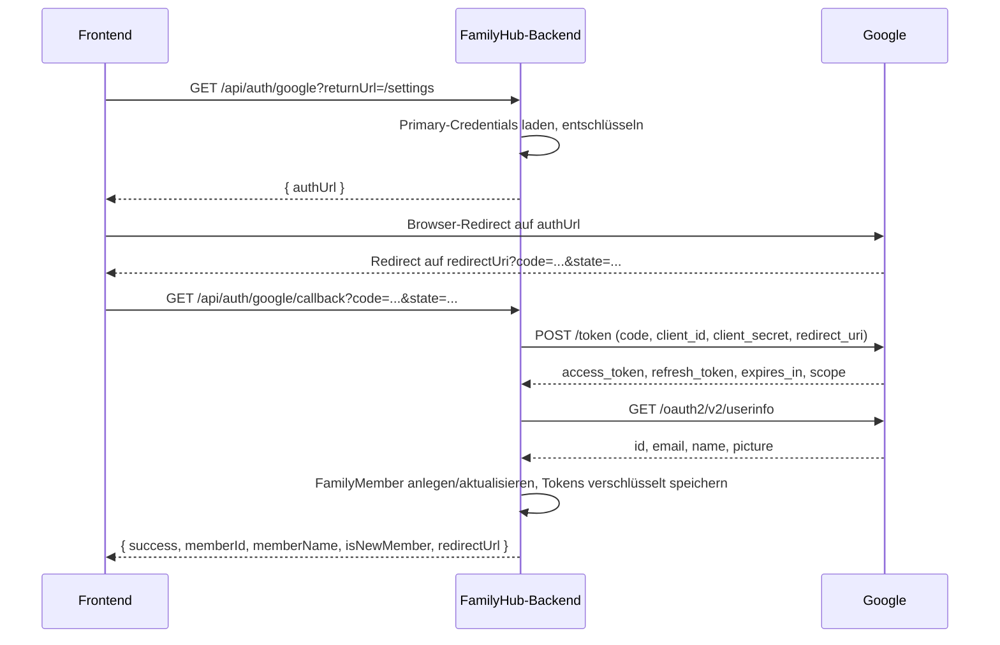

# 04 — REST-API-Referenz (Ist-Zustand)

## Zweck & Geltungsbereich

Dieses Dokument beschreibt vollständig die REST-API des FamilyHub-Backends im Ist-Zustand.
Es dient als Lastenheft-Grundlage für eine Neuauflage: ein Entwicklungsteam muss die API
allein aus diesem Dokument nachbauen können, ohne den Altcode zu sehen. Dokumentiert werden
alle 112 Endpoints aus 14 Controllern, ihre Request-/Response-Schemata, die tatsächlich
vorhandenen Authentifizierungsmechanismen, CORS- und Rate-Limit-Verhalten sowie die
einheitliche Fehlerbehandlung. Quelle ist ausschließlich der Code unter
`familyhub/backend/src/main/kotlin/com/familyhub/`. Was dort nicht ermittelbar war, ist
explizit als „im Code nicht ermittelbar" gekennzeichnet.

**Anforderungs-ID-Präfix dieses Dokuments:** `API-` (z. B. `API-KAL-03`). Die IDs sind in der
Übersichtstabelle in [Kapitel 21](#21-übersicht-aller-endpoints-schnellreferenz) vergeben und
über die Kapitel hinweg stabil. Zusätzlich verwendet Kapitel 22 die Präfixe `S-`, `F-`, `D-`,
`P-`, `L-`, `Z-` und `W-` für bekannte Schwächen sowie Kapitel 23 das Präfix `E-` für
Empfehlungen. Da noch kein `00-README.md` mit einer zentralen Präfix-Reservierung existiert,
sind diese Präfixe hiermit für dieses Dokument belegt.

## Inhaltsverzeichnis

1. [Allgemeines](#1-allgemeines)
2. [Authentifizierung & Autorisierung](#2-authentifizierung--autorisierung)
3. [CORS](#3-cors)
4. [Rate Limiting](#4-rate-limiting)
5. [Fehlerbehandlung](#5-fehlerbehandlung)
6. [Datentypen, Enums & Formate](#6-datentypen-enums--formate)
7. [HealthController](#7-healthcontroller)
8. [FamilyMemberController](#8-familymembercontroller)
9. [CalendarController](#9-calendarcontroller)
10. [CalendarAssignmentController](#10-calendarassignmentcontroller)
11. [TaskController](#11-taskcontroller)
12. [HouseholdTaskTemplateController](#12-householdtasktemplatecontroller)
13. [HouseholdTaskInstanceController](#13-householdtaskinstancecontroller)
14. [BadgeController](#14-badgecontroller)
15. [LeaderboardController](#15-leaderboardcontroller)
16. [SettingsController](#16-settingscontroller)
17. [GoogleAuthController](#17-googleauthcontroller)
18. [GoogleCredentialsController](#18-googlecredentialscontroller)
19. [SynologyPhotosController](#19-synologyphotoscontroller)
20. [WeatherController](#20-weathercontroller)
21. [Übersicht aller Endpoints (Schnellreferenz)](#21-übersicht-aller-endpoints-schnellreferenz)
22. [Bekannte Schwächen der API](#22-bekannte-schwächen-der-api)
23. [Empfehlungen für die Neuauflage](#23-empfehlungen-für-die-neuauflage)

---

## 1. Allgemeines

### 1.1 Base-URL und Ports

| Umgebung | Base-URL | Herkunft |
|----------|----------|----------|
| Lokale Entwicklung | `http://localhost:8081/api` | `server.port: 8081` in `application.yml`; Frontend-Default in `familyhub/frontend/src/lib/api.ts` |
| Docker-Compose (Backend direkt) | `http://<host>:8081/api` | Port-Mapping `8081:8081` in `familyhub/docker-compose.yml` |
| Docker-Compose (über Frontend-nginx) | `http://<host>:3080/api` | Port-Mapping `3080:80`; nginx proxied `/api` auf das Backend |

Das Frontend leitet die Base-URL wie folgt ab (`familyhub/frontend/src/lib/api.ts`):

- `VITE_API_BASE_URL`, falls gesetzt;
- sonst `/api` im Production-Build (relative URL, damit nginx proxyt);
- sonst `http://localhost:8081/api` im Dev-Build.

Ein abschließender `/` wird entfernt; endet die URL nicht auf `/api`, wird `/api` angehängt.

### 1.2 Pfad-Präfix

Alle Endpoints liegen unter dem Präfix `/api`. Es gibt **keine API-Versionierung** — weder im
Pfad (`/api/v1/...`) noch über einen Header. Zwei Controller mappen direkt auf `/api`
(`HealthController`, `CalendarController`), die übrigen auf `/api/<bereich>`.

Das System **muss** in der Neuauflage eine explizite Versionierung vorsehen (siehe Kapitel 23).

### 1.3 Content-Type-Konventionen

| Richtung | Content-Type | Anmerkung |
|----------|--------------|-----------|
| Request (Standard) | `application/json` | Vom Frontend-Client immer gesetzt; serverseitig nicht erzwungen (kein `consumes` an den Mappings, außer beim Avatar-Upload) |
| Request (Avatar-Upload) | `multipart/form-data` | Explizit über `consumes = MediaType.MULTIPART_FORM_DATA_VALUE` |
| Response (Standard) | `application/json` | Jackson mit `jackson-module-kotlin` |
| Response (Bilder) | `image/jpeg` | Avatar, Synology-Foto, Synology-Thumbnail |
| Response (Video) | `video/mp4` | Synology-Video, zusätzlich `Content-Disposition: inline` |
| Response (leer) | — | Viele Endpoints liefern `200 OK` bzw. `204 No Content` mit leerem Body |

Der Frontend-Client behandelt einen leeren Response-Body als leeres Objekt `{}`
(`api.ts`, `if (!text) return {} as T`). Ein Client-seitiger Timeout von **30.000 ms** ist
voreingestellt; bei Überschreitung wirft der Client einen synthetischen Fehler mit Status `408`,
der nie vom Server stammt.

### 1.4 Zeichencodierung

UTF-8. Nutzertexte sind deutsch; Fehlermeldungen der Services sind gemischt deutsch/englisch
(siehe Kapitel 22).

### 1.5 Idempotenz und HTTP-Semantik

- `GET` ist durchgängig lesend, mit Ausnahme der impliziten Caching-Effekte bei Wetter und Synology.
- `PUT` wird sowohl für partielle Updates (alle Update-DTOs haben nullable Felder mit
  „nur setzen wenn nicht null"-Semantik) als auch für Voll-Ersetzungen (Calendar-Assignments)
  verwendet. **PATCH wird nirgends verwendet.**
- Mehrere zustandsändernde Operationen sind als `POST` auf Sub-Ressourcen modelliert
  (`/complete`, `/undo`, `/skip`, `/reassign`, `/activate`, `/deactivate`, `/sync`, `/generate`).
- `DELETE` liefert je nach Controller `200 OK` mit leerem Body oder `204 No Content` — uneinheitlich.

---

## 2. Authentifizierung & Autorisierung

### 2.1 Spring Security: alles öffentlich

`familyhub/backend/src/main/kotlin/com/familyhub/config/SecurityConfig.kt` konfiguriert:

```kotlin
http
    .csrf { it.disable() }
    .cors { }
    .authorizeHttpRequests { auth ->
        auth
            .requestMatchers("/api/health").permitAll()
            .anyRequest().permitAll()
    }
```

**Ergebnis: Es gibt keine Authentifizierung auf Framework-Ebene.** Jeder Request auf jeden
Endpoint wird von Spring Security durchgelassen. CSRF-Schutz ist deaktiviert. Es existiert
kein Login, keine Session-Cookie-Authentifizierung, kein Bearer-Token, kein API-Key und kein
`WWW-Authenticate`. Die Abhängigkeiten `spring-boot-starter-security` und
`spring-boot-starter-oauth2-client` sind vorhanden, werden für den Schutz der eigenen API
aber nicht genutzt (OAuth2 wird ausschließlich als *Client* gegenüber Google verwendet).

### 2.2 PIN-Session als einziger Schutzmechanismus (anwendungsseitig)

Der einzige Zugriffsschutz ist ein selbstgebauter PIN-Session-Mechanismus, implementiert in
`familyhub/backend/src/main/kotlin/com/familyhub/service/PinService.kt`. Er ist **kein**
Servlet-Filter und **kein** Interceptor, sondern wird punktuell in einzelnen Controller-Methoden
aufgerufen.

**Funktionsweise:**

| Aspekt | Ist-Zustand |
|--------|-------------|
| PIN-Quelle | Setting-Key `setup.pin` in der Datenbank; falls leer, Fallback auf Property `familyhub.security.settings-pin` (Default `1234`, überschreibbar via Env `FAMILYHUB_SETTINGS_PIN`) |
| PIN-Speicherung | **Klartext** in der `settings`-Tabelle — kein Hash, kein Salt. Laut Produktentscheidung akzeptabel, da die PIN nur eine Kindersicherung ist; sie darf jedoch nicht abrufbar sein (siehe Kapitel 22). |
| PIN-Format | 4–6 Ziffern (nur bei `POST /api/settings/set-pin` geprüft) |
| Session-Erzeugung | `POST /api/settings/verify-pin` → `UUID.randomUUID().toString()` |
| Session-Speicher | `ConcurrentHashMap<String, Instant>` im Heap — **nicht persistent**, geht bei Neustart verloren, nicht cluster-fähig |
| Session-Timeout | `familyhub.security.pin-timeout-minutes`, Default `30` (Env `FAMILYHUB_PIN_TIMEOUT`) |
| Verlängerung | `POST /api/settings/refresh-session` setzt den Zeitstempel neu |
| Invalidierung | `POST /api/settings/logout` |
| Aufräumen | `cleanupExpiredSessions()` existiert, wird im Code aber von keinem Scheduler aufgerufen (im Code nicht ermittelbar, ob extern getriggert) |

**Zwei unterschiedliche Header-Namen für dasselbe Konzept:**

| Header | Verwendet von |
|--------|---------------|
| `X-Pin-Session` | `FamilyMemberController` (alle schreibenden Endpoints), `HouseholdTaskTemplateController` (POST/PUT/DELETE), `GoogleAuthController` (`POST /disconnect`) |
| `X-Settings-Session` | `SettingsController` (`PUT /slideshow`), `SynologyPhotosController` (connect/disconnect/album-select), `WeatherController` (POST/DELETE `/config`) |

Beide Header werden gegen denselben `PinService`-Session-Speicher geprüft; eine Session aus
`verify-pin` ist für beide Header gültig. Die Doppelung ist rein historisch.

**Drei unterschiedliche Prüfstrenge — das ist die zentrale Sicherheitsschwäche:**

| Verhalten | Endpoints | Konsequenz |
|-----------|-----------|------------|
| Header wird deklariert, aber **nie geprüft** | Alle schreibenden Endpoints des `FamilyMemberController` (`POST /`, `PUT /{id}`, `POST /{id}/activate`, `POST /{id}/deactivate`, `POST /{id}/avatar`, `DELETE /{id}/avatar`, `PUT /{id}/google-account`, `DELETE /{id}/google-account`) | **Kein Schutz.** Der Parameter ist `String?` und wird im Methodenrumpf ignoriert. Kommentar im Code: „PIN validation would be checked by an interceptor in production". Ein solcher Interceptor existiert nicht. |
| Header ist optional (`String?`), wird aber geprüft | `HouseholdTaskTemplateController` POST/PUT/DELETE | `null` oder ungültig → `UnauthorizedException` → `401` |
| Header ist Pflicht (`String`), wird geprüft | `SettingsController` `PUT /slideshow`, `POST /refresh-session`, `POST /logout`; `SynologyPhotosController` connect/disconnect/album-select; `WeatherController` POST/DELETE `/config`; `GoogleAuthController` `POST /disconnect` | Fehlender Header → `MissingRequestHeaderException` → vom generischen Handler auf `500` gemappt (nicht `400`) |

**Alle übrigen Endpoints — insbesondere alle Kalender-, Task-, Event-, Badge-, Leaderboard-,
Google-Credentials- und Setup-Endpoints — sind vollständig ungeschützt.** Das schließt
`POST /api/setup/credentials` (Speichern von Google-OAuth-Client-Secrets) und
`DELETE /api/setup/credentials/{id}` ein.

### 2.3 Sicherheit gegenüber Dritt-APIs

Gegenüber Google und Synology authentifiziert sich das Backend selbst:

- **Google:** OAuth 2.0 Authorization Code Flow mit `access_type=offline` und `prompt=consent`.
  Access- und Refresh-Token werden AES-verschlüsselt (`TokenEncryptionService`) in der Tabelle
  `google_connections` abgelegt. Client-ID und Client-Secret werden separat verschlüsselt
  (`CredentialsEncryptionService`) in `google_credentials` abgelegt.
  Schlüssel: `familyhub.security.encryption-key` (Env `FAMILYHUB_ENCRYPTION_KEY`) bzw.
  `familyhub.security.credentials-encryption-key` (Env `CREDENTIALS_ENCRYPTION_KEY`).
  **Beide haben unsichere Default-Werte im Code hinterlegt** — in der Doku als `<redacted>`
  zu behandeln, in der Neuauflage muss der Start ohne explizit gesetzten Schlüssel fehlschlagen.
- **Scopes** (Property `google.oauth2.scopes`, kommasepariert):
  `https://www.googleapis.com/auth/calendar`,
  `https://www.googleapis.com/auth/tasks`,
  `https://www.googleapis.com/auth/userinfo.profile`,
  `https://www.googleapis.com/auth/userinfo.email`
- **Synology:** DSM-Login mit Benutzername/Passwort; Passwort AES-verschlüsselt im Setting
  `synology.password_encrypted`. Session-ID (`_sid`) wird im Heap gehalten, Refresh nach
  14 Minuten (DSM-Session läuft nach 15 Minuten ab). Der verwendete `RestTemplate` akzeptiert
  **selbstsignierte Zertifikate und deaktiviert die Hostname-Prüfung** (`TrustAllStrategy`,
  `NoopHostnameVerifier` in `config/SynologyConfig.kt`).
- **OpenWeatherMap:** API-Key AES-verschlüsselt im Setting `weather.api_key_encrypted`.

---

## 3. CORS

Konfiguriert in `familyhub/backend/src/main/kotlin/com/familyhub/config/CorsConfig.kt`,
registriert für den Pfad `/api/**`.

| Einstellung | Wert |
|-------------|------|
| `allowedOriginPatterns` | `*` (alle Origins) |
| `allowedMethods` | `GET`, `POST`, `PUT`, `DELETE`, `OPTIONS` |
| `allowedHeaders` | `*` (alle) |
| `allowCredentials` | `true` |
| `exposedHeaders` | nicht gesetzt (Default: keine) |
| `maxAge` | nicht gesetzt (Spring-Default: 1800 Sekunden) |
| Registrierter Pfad | `/api/**` |

Begründung im Code-Kommentar: „Allow all origins for local network access (FamilyHub is
self-hosted)". `PATCH` und `HEAD` sind **nicht** erlaubt.

**Wichtig:** Die Kombination `allowedOriginPatterns = "*"` mit `allowCredentials = true` ist
zulässig (Spring spiegelt den konkreten Origin zurück), erlaubt aber jeder beliebigen Webseite
im Browser des Nutzers, authentifizierte Requests gegen den FamilyHub zu senden. Da die API
ohnehin keine Authentifizierung erzwingt, ist damit jede Webseite in der Lage, den FamilyHub
im Heimnetz des Besuchers auszulesen und zu verändern.

Da `exposedHeaders` nicht gesetzt ist, sind die Rate-Limit-Header (`X-Rate-Limit-*`) für
Browser-Clients bei Cross-Origin-Requests **nicht auslesbar**.

---

## 4. Rate Limiting

Implementiert in `familyhub/backend/src/main/kotlin/com/familyhub/config/RateLimitConfig.kt`
auf Basis von `bucket4j-core` 8.7.0.

### 4.1 Konfiguration

| Property | Env-Variable | Default | Bedeutung |
|----------|--------------|---------|-----------|
| `familyhub.rate-limit.enabled` | `FAMILYHUB_RATE_LIMIT_ENABLED` | `false` | Aktiviert die `@Configuration`-Klasse (`matchIfMissing = false`) |
| `familyhub.rate-limit.requests-per-minute` | `FAMILYHUB_RATE_LIMIT_RPM` | `100` | Token pro Minute pro Bucket |

### 4.2 Bucket-Modell

- **Bucket-Schlüssel:** Client-IP. Ermittlung: erster Eintrag aus dem Header `X-Forwarded-For`
  (kommasepariert, getrimmt), sonst `request.remoteAddr`.
- **Algorithmus:** `Bandwidth.simple(requestsPerMinute, Duration.ofMinutes(1))` — Token-Bucket
  mit greedy refill, Kapazität = Limit, Auffüllung über ein Minutenfenster.
- **Speicher:** `ConcurrentHashMap<String, Bucket>` im Heap. Einträge werden **nie entfernt**
  → unbegrenztes Wachstum bei wechselnden Client-IPs.
- **Geltungsbereich:** alle Requests (auch nicht-`/api`-Pfade), **außer** `/api/health`
  (`shouldNotFilter` prüft `requestURI == "/api/health"`).

### 4.3 Response-Header

Auf **jedem** durch den Filter laufenden Request werden gesetzt:

| Header | Wert |
|--------|------|
| `X-Rate-Limit-Limit` | konfiguriertes Limit als Zahl, z. B. `100` |
| `X-Rate-Limit-Remaining` | verbleibende Token als Zahl |
| `X-Rate-Limit-Retry-After` | **nur bei Ablehnung**: Wartezeit in ganzen Sekunden |

Die Header entsprechen nicht RFC 6585 / RFC 9331 (`Retry-After`, `RateLimit-*`).

### 4.4 Response bei Überschreitung

```http
HTTP/1.1 429 Too Many Requests
Content-Type: application/json
X-Rate-Limit-Limit: 100
X-Rate-Limit-Remaining: 0
X-Rate-Limit-Retry-After: 37
```

```json
{
  "status": 429,
  "error": "Too Many Requests",
  "message": "Rate limit exceeded. Please try again later."
}
```

Der Body wird direkt vom Filter geschrieben und enthält — abweichend vom Standard-Fehlerformat —
**kein `timestamp`-Feld**.

### 4.5 Fehlerhafte Aktivierungslogik (Ist-Zustand)

`RateLimitFilter` ist zusätzlich mit `@Component` annotiert und liegt im Package
`com.familyhub.config`, das vom Component-Scan der `FamilyHubApplication` erfasst wird.
Der Filter wird dadurch **unabhängig vom Property `familyhub.rate-limit.enabled`** als Bean
registriert und von Spring Boot automatisch als Servlet-Filter in die Kette eingehängt. Der
Konstruktor hat den Kotlin-Default `requestsPerMinute = 100`.

Daraus folgt (aus dem Code abgeleitet, nicht durch Laufzeittest verifiziert):

1. Rate Limiting ist **immer aktiv**, auch bei `familyhub.rate-limit.enabled=false` (Default).
2. Der konfigurierte Wert `requests-per-minute` greift nicht; es gilt der Konstruktor-Default
   von **100 Requests pro Minute pro IP**.
3. Bei `enabled=true` kollidiert die `@Bean`-Definition mit der komponentengescannten Bean
   gleichen Namens (`rateLimitFilter`).

Diese Diskrepanz ist beim Nachbau zu beachten: **das dokumentierte Verhalten der Neuauflage
soll das konfigurierte sein, nicht das hier beschriebene fehlerhafte.**

---

## 5. Fehlerbehandlung

### 5.1 Einheitliches Fehler-Schema

Definiert in `familyhub/backend/src/main/kotlin/com/familyhub/config/GlobalExceptionHandler.kt`
als `data class ErrorResponse`:

```json
{
  "status": 404,
  "error": "Not Found",
  "message": "Task not found: 42",
  "timestamp": "2026-07-21T08:15:30.123456Z"
}
```

| Feld | Typ | Pflicht | Bedeutung |
|------|-----|---------|-----------|
| `status` | Integer | ja | HTTP-Statuscode, redundant zum HTTP-Status |
| `error` | String | ja | Kurzbezeichnung der Fehlerklasse |
| `message` | String | ja | Technische Detailmeldung, gemischt deutsch/englisch |
| `timestamp` | String (ISO-8601, UTC) | ja | `Instant.now()` zum Zeitpunkt der Objekterzeugung |

Es gibt **kein** Feld für Feld-bezogene Validierungsfehler, keinen Fehlercode-Katalog und keine
Correlation-/Trace-ID.

### 5.2 Exception → HTTP-Status → Body

| Exception | HTTP-Status | `error`-Feld | `message`-Fallback |
|-----------|-------------|--------------|--------------------|
| `ResourceNotFoundException` | `404 Not Found` | `Not Found` | `Resource not found` |
| `BadRequestException` | `400 Bad Request` | `Bad Request` | `Invalid request` |
| `UnauthorizedException` | `401 Unauthorized` | `Unauthorized` | `Authentication required` |
| `ConflictException` | `409 Conflict` | `Conflict` | `Resource conflict` |
| `SynologyAuthException` | `401 Unauthorized` | `synology_auth_expired` | `Synology session expired` |
| `GoogleApiException` mit `statusCode` 401 oder 403 | `401 Unauthorized` | `Google API Error` | `Google API request failed` |
| `GoogleApiException` mit `statusCode` 404 | `404 Not Found` | `Google API Error` | `Google API request failed` |
| `GoogleApiException` sonst (inkl. `null`) | `502 Bad Gateway` | `Google API Error` | `Google API request failed` |
| **alle übrigen `Exception`** | `500 Internal Server Error` | `Internal Server Error` | `An unexpected error occurred` |

Bei `500` wird zusätzlich mit Stacktrace geloggt (`logger.error`). Bei allen anderen Fällen
erfolgt **kein** Logging im Handler.

Auffällig: `ConflictException` ist definiert und gemappt, wird aber im gesamten Produktivcode
**nirgends geworfen**. `SynologyAuthException` bricht die Namenskonvention des `error`-Feldes
(snake_case statt Klartext). Ein `GoogleApiException` mit Google-Status `403` wird zu HTTP
`401` — die Semantik „verboten" geht verloren.

### 5.3 Nicht abgedeckte Framework-Exceptions → alle 500

Der `@ExceptionHandler(Exception::class)`-Catch-all greift auch für Exceptions, die Spring
normalerweise auf `4xx` abbilden würde. `GlobalExceptionHandler` erweitert **nicht**
`ResponseEntityExceptionHandler`, wodurch die Standardbehandlung ausgehebelt wird.
Konsequenzen (aus dem Code abgeleitet):

| Situation | Erwarteter Status | Tatsächlicher Status |
|-----------|-------------------|----------------------|
| Pflicht-`@RequestParam` fehlt (z. B. `memberId`) | `400` | `500` |
| Pflicht-`@RequestHeader` fehlt (z. B. `X-Settings-Session`) | `400` | `500` |
| Pfadvariable nicht in `Long` konvertierbar | `400` | `500` |
| Request-Body kein gültiges JSON / Pflichtfeld fehlt (Jackson/Kotlin) | `400` | `500` |
| Falsche HTTP-Methode auf existierendem Pfad | `405` | `500` |
| `IllegalArgumentException` aus Services (z. B. „Member not found: 7") | `400`/`404` | `500` |
| `IllegalStateException` aus Services (z. B. „No Google connection found") | `409`/`424` | `500` |
| `DateTimeParseException` bei ungültigem `date`/`start`/`end`-Parameter | `400` | `500` |
| Multipart-Upload > 1 MB (`MaxUploadSizeExceededException`) | `413` | `500` |

Unbekannte Pfade (kein Handler) werden **nicht** vom Handler erfasst, sondern von Spring Boots
`/error`-Fallback beantwortet — dort gilt ein **anderes** JSON-Schema
(`timestamp`, `status`, `error`, `path`), ohne `message`. Damit existieren im Ist-Zustand
**drei** unterschiedliche Fehlerformate (Standard, Rate-Limit, `/error`).

### 5.4 Endpoints, die Fehler verschlucken

Zwei Endpoints fangen Exceptions ab und liefern statt eines Fehlers eine leere Liste mit `200`:

| Endpoint | Verhalten |
|----------|-----------|
| `GET /api/calendar-assignments/available` | jede `Exception` → `200 OK` mit `[]` |
| `GET /api/google-calendar/calendars` | `IllegalArgumentException` → `404`; jede andere `Exception` → `200 OK` mit `[]` (Code-Kommentar: „Return empty list instead of error to prevent frontend crashes") |

Für Clients ist damit nicht unterscheidbar, ob es tatsächlich keine Kalender gibt oder ob der
Google-Zugriff fehlgeschlagen ist.

### 5.5 Fehlende deklarative Validierung

`spring-boot-starter-validation` ist als Abhängigkeit vorhanden, aber im gesamten
Produktivcode existiert **keine einzige** Annotation aus `jakarta.validation`
(`@Valid`, `@NotNull`, `@NotBlank`, `@Size`, `@Min`, `@Max`). Validierung findet
ausschließlich imperativ in einzelnen Services statt (siehe die Feldtabellen der jeweiligen
Endpoints). Nicht validiert werden unter anderem: Farb-Codes, Rollen-Strings, Task-Status,
Prioritäten, `rotationMode`, `points` (negative Werte möglich), `defaultDueHour`
(Werte außerhalb 0–23 möglich), `limit`/`offset`/`days` (negative Werte möglich).

---

## 6. Datentypen, Enums & Formate

### 6.1 ID-Typen

| Entität | ID-Typ | Erzeugung |
|---------|--------|-----------|
| `FamilyMember`, `Event`, `Task`, `HouseholdTaskTemplate`, `HouseholdTaskInstance`, `BadgeDefinition`, `MemberBadge`, `MemberStatistics`, `CalendarAssignment`, `GoogleCredentials`, `GoogleConnection` | `Long` | DB-Auto-Increment (`GenerationType.IDENTITY`), beginnend bei 1 |
| `Setting` | `String` (der Key selbst ist Primärschlüssel) | vom Aufrufer vergeben |
| Google-Kalender-ID, Google-Task-Listen-ID, Google-Event-ID, Google-Task-ID | `String` | von Google vergeben |
| Synology-Album-ID, Synology-Foto-/Video-ID | `Long` | vom NAS vergeben |
| PIN-Session-ID | `String` (UUID v4, z. B. `3f2a1b7c-...`) | `UUID.randomUUID()` |
| Synology `cache_key` | `String` | vom NAS vergeben |

**UUIDs werden für fachliche Entitäten nicht verwendet** — alle IDs sind fortlaufende `Long`
und damit von außen erratbar (relevant, da keine Authentifizierung existiert).

### 6.2 Datums- und Zeitformate

Es existiert **keine** explizite Jackson-Konfiguration in `application.yml`. Es gelten die
Spring-Boot-Defaults mit aktiviertem JavaTimeModule und deaktiviertem
`WRITE_DATES_AS_TIMESTAMPS`.

| Java-/Kotlin-Typ | JSON-Repräsentation | Beispiel |
|------------------|---------------------|----------|
| `Instant` | ISO-8601 in UTC mit `Z`-Suffix | `"2026-07-21T08:15:30.123456Z"` |
| `LocalDate` | ISO-8601 Datum ohne Zeitzone | `"2026-07-21"` |
| Wetter-Zeitstempel (`sunrise`, `sunset`, `updatedAt`, `timestamp`) | **Unix-Epoch in Sekunden** als `Long` | `1784620530` |
| Badge `earnedAt` in `EarnedBadgeResponse` | String aus `Instant.toString()` | `"2026-07-21T08:15:30.123456Z"` |
| Badge `earnedAt` in `MemberBadgeResponse` | `Instant` (identisches Format, anderer Typ im DTO) | `"2026-07-21T08:15:30.123456Z"` |
| Synology `takenAt` | String aus `Instant.ofEpochSecond(...)` | `"2026-07-21T08:15:30Z"` |
| Google `updated` (Task-Listen) | RFC 3339 String, unverändert durchgereicht | `"2026-07-20T19:04:11.000Z"` |

**Es gibt keine anwendungsweite Zeitzonen-Konfiguration.** Alle serverseitigen Tages-Berechnungen
(`LocalDate.now()` in Household-Tasks, Leaderboard, Badges) nutzen die **Default-Zeitzone der JVM**,
während gespeicherte Zeitpunkte UTC sind. Bei einer JVM in `Europe/Berlin` weichen „heute" laut
Server und „heute" laut UTC-Zeitstempel bis zu zwei Stunden voneinander ab.

**Parsing von Query-Parametern:**

| Parameter | Parser | Akzeptierte Formate | Verhalten bei Fehler |
|-----------|--------|---------------------|----------------------|
| `start`, `end` (`GET /api/events`) | `CalendarController.parseInstant` | 1. `Instant.parse` (`2026-07-21T00:00:00Z`), 2. `ZonedDateTime.parse` (`2026-07-21T00:00:00+02:00[Europe/Berlin]`), 3. `LocalDate.parse` → Tagesbeginn UTC | `DateTimeParseException` → `500` |
| `date` (Household-Instances) | `LocalDate.parse` | ausschließlich `yyyy-MM-dd` | `DateTimeParseException` → `500` |
| `dueDate` (`GET /api/tasks`) | `LocalDate.parse` | ausschließlich `yyyy-MM-dd` | `DateTimeParseException` → `500` |
| `dueDate` (Task-Body) | `TaskService.parseDueDate` | 1. `Instant.parse`, 2. erste 10 Zeichen als `LocalDate` → Tagesbeginn UTC | **stiller Fallback auf `Instant.now()`** — kein Fehler |

Der stille Fallback beim Task-`dueDate` ist ein Datenintegritätsrisiko: ein Tippfehler im
Datum führt zu einer Aufgabe mit Fälligkeit „jetzt" statt zu einer Fehlermeldung.

### 6.3 Enums

Im gesamten API-Vertrag ist **kein einziges Feld als Kotlin-`enum` typisiert** — alle
Aufzählungswerte sind freie `String`-Felder. Die einzige `enum class` (`AssignmentGroup` in
`model/HouseholdTaskTemplate.kt`) wird von keinem DTO und keinem Controller verwendet.
Die folgenden Wertelisten sind daher **Konvention, nicht erzwungen**, sofern nicht
ausdrücklich „validiert" vermerkt ist.

#### 6.3.1 `FamilyMember.role`

| Wert | Bedeutung |
|------|-----------|
| `parent` | Elternteil — zählt zum Zuweisungs-Pool `parents` |
| `child` | Kind (Default) — zählt zum Zuweisungs-Pool `children` |

Nicht validiert. Ein beliebiger String ist speicherbar und führt dazu, dass das Mitglied in
keinem `parents`/`children`-Pool auftaucht (wohl aber in `all`).

#### 6.3.2 `Task.status`

| Wert | Bedeutung |
|------|-----------|
| `pending` | offen (Default beim Anlegen) |
| `completed` | erledigt (gesetzt durch `POST /api/tasks/{id}/complete`) |

Nicht validiert; über `PUT /api/tasks/{id}` ist jeder String setzbar.
Google-Tasks-Gegenstücke sind `needsAction` und `completed`; die Umschlüsselung erfolgt im
`TasksSyncService`.

#### 6.3.3 `Task.priority`

Nullable Freitext. Im Code sind keine gültigen Werte definiert oder geprüft.
Im Backend nicht ermittelbar, welche Werte das Frontend verwendet.

#### 6.3.4 `Task.syncStatus` / `Event.syncStatus`

| Wert | Bedeutung |
|------|-----------|
| `synced` | Entitäts-Default in der DB |
| `pending` | wird bei jedem lokalen Create/Update gesetzt, bis der Google-Push erfolgt ist |

Weitere Werte (z. B. `error`) sind im Code nicht ermittelbar.

#### 6.3.5 `HouseholdTaskInstance.status`

| Wert | Bedeutung |
|------|-----------|
| `pending` | zugewiesen, offen (Default) |
| `completed` | abgeschlossen; setzt `completedAt` und `completedByMember` |
| `skipped` | übersprungen (`POST /{id}/skip`) |

#### 6.3.6 `HouseholdTaskTemplate.frequencyType` — **validiert**

Geprüft in `HouseholdTaskTemplateService.validateFrequencyConfig`. Ungültiger Wert →
`BadRequestException` → `400` mit Text
`"Invalid frequency type: <wert>. Valid types: weekly, biweekly, monthly, bimonthly, quarterly, semiannually, yearly"`.

| Wert | Intervall in Tagen | Bedeutung |
|------|--------------------|-----------|
| `weekly` | 7 | wöchentlich |
| `biweekly` | 14 | alle zwei Wochen |
| `monthly` | 30 | monatlich |
| `bimonthly` | 60 | alle zwei Monate |
| `quarterly` | 90 | quartalsweise |
| `semiannually` | 180 | halbjährlich |
| `yearly` | 365 | jährlich |

Ein Wert `daily` existiert bewusst nicht („Minimum frequency is weekly"). Die Intervalle sind
feste Tageszahlen, keine Kalendermonate — „monatlich" bedeutet real „alle 30 Tage".

#### 6.3.7 `HouseholdTaskTemplate.assignmentGroup` — **validiert**

Geprüft in `HouseholdTaskTemplateService.validateAssignmentGroup`. Ungültiger Wert → `400` mit
`"Invalid assignment group: <wert>. Valid groups: parents, children, all"`.

| Wert | Zuweisungs-Pool |
|------|-----------------|
| `parents` | aktive Mitglieder mit `role = "parent"` |
| `children` | aktive Mitglieder mit `role = "child"` |
| `all` | alle aktiven Mitglieder (Default) |

#### 6.3.8 `HouseholdTaskTemplate.rotationMode`

| Wert | Bedeutung |
|------|-----------|
| `round_robin` | Default; reihum, ausgehend vom `lastAssignedMember` |

Weitere Modi sind im Code nicht implementiert; das Feld wird **nicht validiert** und beim
Preview/Generieren nicht ausgewertet — faktisch ist `round_robin` das einzige Verhalten.

#### 6.3.9 `HouseholdTaskTemplate.priority`

Freitext, Default `medium`. Nicht validiert, keine definierte Werteliste im Backend.

#### 6.3.10 `BadgeDefinition.tier` und `BadgeDefinition.rarity`

Freie Strings ohne Validierung und ohne definierte Werteliste im Code. Die Werte stammen aus
den Flyway-Seed-Daten (`src/main/resources/db/migration/`) und sind im Controller-Code nicht
ermittelbar. `GET /api/badges/definitions/{tier}` filtert per exaktem String-Vergleich.

#### 6.3.11 `BadgeDefinition.criteria.type` (JSONB, intern)

Nicht Teil des API-Vertrags (wird nie ausgeliefert), aber für den Nachbau relevant:

| `type` | Weitere Schlüssel | Auswertung |
|--------|-------------------|------------|
| `count` | `threshold` (Zahl), optional `category` (String), optional `timeframe` (`all_time`) | Anzahl abgeschlossener Instanzen ≥ `threshold` |
| `streak` | `days` (Zahl) | `currentStreakDays` ≥ `days` |
| `speed` | `tasksPerDay` (Zahl) | heute abgeschlossene Instanzen ≥ `tasksPerDay` |
| `monthly_leader` | `category` (String) | mindestens eine abgeschlossene Instanz dieser Kategorie im laufenden Monat |
| `early_bird` | `beforeHour` (Zahl, Default 10), `count` (Zahl, Default 10) | Abschlüsse vor `beforeHour` Uhr im laufenden Monat ≥ `count` |
| `completion_streak` | `days` (Zahl) | Tage in Folge, an denen **alle** zugewiesenen Instanzen erledigt wurden |

Nur `count`, `streak` und `speed` liefern in `GET /api/badges/member/{id}/progress` einen
echten Fortschritt; alle übrigen Typen melden `currentValue: 0`, `targetValue: 1`,
`progressPercent: 0`.

#### 6.3.12 Zeitraum-Parameter `period`

Verwendet in Leaderboard und Member-Stats. **Nicht validiert**; unbekannte Werte führen nicht
zu einem Fehler, sondern zu einem stillen Fallback.

| Endpoint | Gültige Werte | Default | Verhalten bei unbekanntem Wert |
|----------|---------------|---------|--------------------------------|
| `GET /api/leaderboard` | `today`, `week`, `month`, `all_time` | `week` | wie `all_time` (Gesamtstatistik) |
| `GET /api/household-tasks/instances/stats/{memberId}` | `today`, `week`, `month` | `today` | `totalAssigned = 0`, `totalCompleted = 0` |

Zeitfenster: `today` = ab heute, `week` = letzte 7 Tage, `month` = letzte 30 Tage
(jeweils Kalendertage, keine ISO-Kalenderwochen bzw. Kalendermonate).

#### 6.3.13 `WeatherConfigRequest.units` und `.language`

| Feld | Dokumentierte Werte | Default | Validiert |
|------|---------------------|---------|-----------|
| `units` | `metric`, `imperial` (Kommentar im DTO) | `metric` | nein — wird unverändert an OpenWeatherMap durchgereicht |
| `language` | ISO-639-1-Sprachcode, z. B. `de`, `en` | `de` | nein |

#### 6.3.14 `SynologyPhotoResponse.type`

| Wert | Bedeutung |
|------|-----------|
| `photo` | Standbild |
| `video` | Video; `fullUrl` zeigt dann auf `/api/synology/video/{id}` und `duration` ist gesetzt |

#### 6.3.15 `GoogleConnection.service`

Beim OAuth-Callback wird stets der Wert `all` verwendet („Combined connection for all
services"). Weitere Werte sind im Code nicht ermittelbar; das Feld erscheint im API-Vertrag nur
als Element des Arrays `services` in `ConnectionStatusResponse.connectedAccounts[].services`.

### 6.4 Wiederverwendete Response-Objekte

#### `FamilyMemberResponse`

```json
{
  "id": 1,
  "googleEmail": "beispiel@gmail.com",
  "name": "Anna",
  "nickname": "Anni",
  "role": "parent",
  "profilePhotoUrl": "https://lh3.googleusercontent.com/a/...",
  "avatarUrl": "/api/family-members/1/avatar",
  "color": "#3B82F6",
  "dateOfBirth": "1985-04-12",
  "isActive": true,
  "googleCredentialId": 1,
  "hasGoogleAccount": true,
  "createdAt": "2026-01-15T10:00:00Z"
}
```

| Feld | Typ | Nullable | Bedeutung |
|------|-----|----------|-----------|
| `id` | Long | nein | Primärschlüssel |
| `googleEmail` | String | ja | E-Mail des verknüpften Google-Kontos; `null` bei lokalen Mitgliedern |
| `name` | String | nein | Anzeigename |
| `nickname` | String | ja | Spitzname |
| `role` | String | nein | `parent` oder `child` (Default `child`) |
| `profilePhotoUrl` | String | ja | externe Google-Profilbild-URL |
| `avatarUrl` | String | ja | **abgeleitet**: `"/api/family-members/{id}/avatar"`, falls ein lokales Avatar hochgeladen wurde, sonst `null` |
| `color` | String | nein | Hex-Farbe inkl. `#`, Default `#3B82F6` |
| `dateOfBirth` | LocalDate | ja | Geburtsdatum |
| `isActive` | Boolean | nein | Default `true` |
| `googleCredentialId` | Long | ja | Verweis auf den verwendeten OAuth-Credentials-Satz |
| `hasGoogleAccount` | Boolean | nein | **abgeleitet**: `googleCredentialId != null || googleAccountId != null` |
| `createdAt` | Instant | nein | Anlagezeitpunkt |

Das interne Feld `googleAccountId` und der Dateipfad `profilePhotoPath` werden **nicht**
ausgeliefert. `updatedAt` wird bei Family-Membern **nicht** ausgeliefert (im Gegensatz zu
Tasks und Events).

#### `MemberSummaryResponse`

```json
{ "id": 2, "name": "Ben", "profilePhotoUrl": null, "color": "#10B981" }
```

| Feld | Typ | Nullable |
|------|-----|----------|
| `id` | Long | nein |
| `name` | String | nein |
| `profilePhotoUrl` | String | ja |
| `color` | String | ja (im DTO nullable, in der Entität nicht) |

Achtung: Diese Kurzform enthält **kein** `avatarUrl` — Clients müssen den Avatar-Pfad selbst
zusammensetzen.

#### `BadgeDefinitionResponse`

```json
{
  "id": 3,
  "name": "Putzteufel",
  "description": "50 Haushaltsaufgaben erledigt",
  "icon": "sparkles",
  "tier": "gold",
  "rarity": "rare",
  "points": 100
}
```

| Feld | Typ | Nullable | Bedeutung |
|------|-----|----------|-----------|
| `id` | Long | nein | Primärschlüssel |
| `name` | String | nein | Anzeigename (deutsch) |
| `description` | String | nein | Beschreibung (deutsch) |
| `icon` | String | nein | Icon-Kennung; Interpretation liegt beim Frontend |
| `tier` | String | nein | Stufe (Freitext, siehe 6.3.10) |
| `rarity` | String | nein | Seltenheit (Freitext) |
| `points` | Int | nein | Punktwert, Default 0 |

Die Felder `criteria`, `oneTimeOnly` und `isActive` werden **nicht** ausgeliefert.

#### `SettingResponse`

```json
{ "key": "slideshow.config.durationSeconds", "value": "10", "updatedAt": "2026-07-20T18:00:00Z" }
```

| Feld | Typ | Nullable | Bedeutung |
|------|-----|----------|-----------|
| `key` | String | nein | Setting-Schlüssel (Primärschlüssel) |
| `value` | String | nein | Wert — **immer String**, auch für Zahlen und Booleans |
| `updatedAt` | Instant | nein | letzte Änderung |

#### `SyncResultResponse`

Existiert dreifach mit identischer Struktur in unterschiedlichen Packages
(`dto/calendar/CalendarDtos.kt`, `TaskController.SyncResultResponse` als innere Klasse).

```json
{ "created": 12, "updated": 3, "deleted": 1 }
```

| Feld | Typ | Bedeutung |
|------|-----|-----------|
| `created` | Int | Anzahl neu angelegter lokaler Datensätze |
| `updated` | Int | Anzahl aktualisierter lokaler Datensätze |
| `deleted` | Int | Anzahl gelöschter lokaler Datensätze |

---

## 7. HealthController

Quelle: `familyhub/backend/src/main/kotlin/com/familyhub/controller/HealthController.kt`
Basis-Mapping: `/api`

### GET /api/health

**Zweck:** Liveness-/Readiness-Prüfung des Backends. Wird vom Docker-Healthcheck
(`wget --spider http://localhost:8081/api/health`) und vom Frontend beim Start verwendet.

**Pfad-Parameter:** keine
**Query-Parameter:** keine
**Request-Body:** keiner

**Response `200 OK`:**

```json
{
  "status": "UP",
  "timestamp": "2026-07-21T08:15:30.123456Z",
  "service": "familyhub-backend"
}
```

| Feld | Typ | Wert | Bedeutung |
|------|-----|------|-----------|
| `status` | String | konstant `"UP"` | **Statischer Wert** — es findet keine Prüfung von Datenbank, Google-Verbindung oder Synology statt |
| `timestamp` | String | `Instant.now().toString()` | Serverzeit in UTC |
| `service` | String | konstant `"familyhub-backend"` | Dienstkennung |

**Fehlerfälle:** keine. Der Endpoint kann nur fehlschlagen, wenn der gesamte Servlet-Container
nicht antwortet.

**Besonderheiten:**
- Einziger Endpoint, der explizit vom Rate Limiting ausgenommen ist
  (`shouldNotFilter` prüft exakt `"/api/health"`).
- Der Rückgabetyp ist `Map<String, Any>` ohne `ResponseEntity` — der Status ist immer `200`.
- Liefert **keine** Aussage über die Erreichbarkeit der Datenbank. Ein Health-Check, der
  „UP" meldet, obwohl PostgreSQL nicht erreichbar ist, ist im Ist-Zustand möglich.
- Spring Boot Actuator ist **nicht** eingebunden; es gibt keine `/actuator/health`,
  keine Metriken und keine `/info`-Endpoints.

---

## 8. FamilyMemberController

Quelle: `familyhub/backend/src/main/kotlin/com/familyhub/controller/FamilyMemberController.kt`
Basis-Mapping: `/api/family-members`

Alle schreibenden Endpoints deklarieren den Header `X-Pin-Session` als optionalen Parameter,
**prüfen ihn aber nicht** (siehe Abschnitt 2.2). Der Header ist damit rein dekorativ.

### GET /api/family-members

**Zweck:** Liefert alle Familienmitglieder, optional nur die aktiven.

**Query-Parameter:**

| Name | Typ | Pflicht | Default | Bedeutung |
|------|-----|---------|---------|-----------|
| `activeOnly` | Boolean | nein | `false` | `true` → nur Mitglieder mit `isActive = true`; `false` → alle |

**Response `200 OK`:** Array von `FamilyMemberResponse` (Schema siehe 6.4).

```json
[
  {
    "id": 1,
    "googleEmail": "beispiel@gmail.com",
    "name": "Anna",
    "nickname": null,
    "role": "parent",
    "profilePhotoUrl": "https://lh3.googleusercontent.com/a/...",
    "avatarUrl": "/api/family-members/1/avatar",
    "color": "#3B82F6",
    "dateOfBirth": null,
    "isActive": true,
    "googleCredentialId": 1,
    "hasGoogleAccount": true,
    "createdAt": "2026-01-15T10:00:00Z"
  }
]
```

**Fehlerfälle:** `500` bei nicht-boolescher `activeOnly`-Angabe (Typkonvertierungsfehler).

**Besonderheiten:** Keine Pagination, keine Sortierung, kein Filter nach Rolle. Die Reihenfolge
entspricht der Repository-Standardreihenfolge (nicht garantiert).

---

### POST /api/family-members

**Zweck:** Legt ein **lokales** Familienmitglied ohne Google-Konto an (typischerweise Kinder).
Legt zusätzlich einen leeren Statistik-Datensatz für dieses Mitglied an.

**Header:**

| Name | Pflicht | Bedeutung |
|------|---------|-----------|
| `X-Pin-Session` | nein | **wird ignoriert** |

**Request-Body:**

```json
{
  "name": "Ben",
  "role": "child",
  "color": "#10B981",
  "dateOfBirth": "2015-08-30",
  "nickname": "Benni"
}
```

| Feld | Typ | Pflicht | Default | Validierung | Bedeutung |
|------|-----|---------|---------|-------------|-----------|
| `name` | String | ja | — | keine (leerer String wird akzeptiert) | Anzeigename |
| `role` | String | nein | `"child"` | keine | `parent` oder `child` |
| `color` | String | nein | `"#3B82F6"` | keine (kein Hex-Format-Check) | Hex-Farbe inkl. `#` |
| `dateOfBirth` | LocalDate | nein | `null` | ISO `yyyy-MM-dd` | Geburtsdatum |
| `nickname` | String | nein | `null` | keine | Spitzname |

**Response `201 Created`:** ein `FamilyMemberResponse`.

```json
{
  "id": 4,
  "googleEmail": null,
  "name": "Ben",
  "nickname": "Benni",
  "role": "child",
  "profilePhotoUrl": null,
  "avatarUrl": null,
  "color": "#10B981",
  "dateOfBirth": "2015-08-30",
  "isActive": true,
  "googleCredentialId": null,
  "hasGoogleAccount": false,
  "createdAt": "2026-07-21T08:15:30.123456Z"
}
```

**Fehlerfälle:**

| Status | Ursache |
|--------|---------|
| `500` | `name` fehlt im Body (Jackson/Kotlin kann das nicht-nullable Feld nicht setzen) |
| `500` | Body kein gültiges JSON |

**Besonderheiten:**
- Einer von nur zwei Endpoints, die `201 Created` liefern (der andere ist
  `POST /api/setup/credentials`). Es wird **kein** `Location`-Header gesetzt.
- Seiteneffekt: Anlage eines `MemberStatistics`-Datensatzes.
- Nicht idempotent — mehrfaches Absenden erzeugt Duplikate; es gibt keine Eindeutigkeitsprüfung
  auf `name`.

---

### GET /api/family-members/{id}

**Zweck:** Liefert ein einzelnes Familienmitglied.

**Pfad-Parameter:**

| Name | Typ | Bedeutung |
|------|-----|-----------|
| `id` | Long | ID des Mitglieds |

**Response `200 OK`:** ein `FamilyMemberResponse` (Schema siehe 6.4).

**Fehlerfälle:**

| Status | Ursache |
|--------|---------|
| `404` | Mitglied existiert nicht — `{"status":404,"error":"Not Found","message":"Family member not found with id: 7","timestamp":"..."}` |
| `500` | `id` nicht als `Long` parsebar |

**Besonderheiten:** Pfad-Kollision mit `GET /api/family-members/leaderboard` — Spring bevorzugt
das literale Segment, der Endpoint funktioniert daher. Ein Mitglied kann jedoch nie unter der
ID `leaderboard` angesprochen werden (was bei `Long`-IDs ohnehin nicht vorkommt).

---

### GET /api/family-members/{id}/detail

**Zweck:** Liefert Mitglied, Statistik und die fünf zuletzt erworbenen Badges in einem Aufruf
(Aggregat für die Mitglieds-Detailansicht).

**Pfad-Parameter:** `id` (Long)

**Response `200 OK`:**

```json
{
  "member": {
    "id": 1, "googleEmail": "beispiel@gmail.com", "name": "Anna", "nickname": null,
    "role": "parent", "profilePhotoUrl": null, "avatarUrl": "/api/family-members/1/avatar",
    "color": "#3B82F6", "dateOfBirth": null, "isActive": true,
    "googleCredentialId": 1, "hasGoogleAccount": true, "createdAt": "2026-01-15T10:00:00Z"
  },
  "statistics": {
    "id": 1, "memberId": 1, "totalTasksCompleted": 87, "totalPointsEarned": 940,
    "currentStreakDays": 5, "longestStreakDays": 21,
    "lastTaskCompletedAt": "2026-07-20T17:42:00Z",
    "tasksCompletedToday": 2, "tasksCompletedThisWeek": 9, "tasksCompletedThisMonth": 31
  },
  "recentBadges": [
    {
      "id": 12,
      "badge": { "id": 3, "name": "Putzteufel", "description": "50 Haushaltsaufgaben erledigt",
                 "icon": "sparkles", "tier": "gold", "rarity": "rare", "points": 100 },
      "earnedAt": "2026-07-18T19:00:00Z"
    }
  ]
}
```

| Feld | Typ | Nullable | Bedeutung |
|------|-----|----------|-----------|
| `member` | `FamilyMemberResponse` | nein | siehe 6.4 |
| `statistics` | `MemberStatisticsResponse` | **ja** | `null`, wenn kein Statistik-Datensatz existiert |
| `recentBadges` | Array von `MemberBadgeResponse` | nein | maximal 5 Einträge, absteigend nach `earnedAt` |

`MemberStatisticsResponse`:

| Feld | Typ | Bedeutung |
|------|-----|-----------|
| `id` | Long | Primärschlüssel des Statistik-Datensatzes |
| `memberId` | Long | ID des Mitglieds |
| `totalTasksCompleted` | Int | Gesamtzahl erledigter Haushaltsaufgaben |
| `totalPointsEarned` | Int | Gesamtpunkte |
| `currentStreakDays` | Int | aktuelle Serie in Tagen |
| `longestStreakDays` | Int | längste je erreichte Serie |
| `lastTaskCompletedAt` | Instant, nullable | Zeitpunkt der letzten Erledigung |
| `tasksCompletedToday` | Int | Zähler, wird von einem Scheduler täglich zurückgesetzt |
| `tasksCompletedThisWeek` | Int | Zähler, wöchentlicher Reset |
| `tasksCompletedThisMonth` | Int | Zähler, monatlicher Reset |

`MemberBadgeResponse`:

| Feld | Typ | Bedeutung |
|------|-----|-----------|
| `id` | Long | ID der Verleihung (nicht der Badge-Definition) |
| `badge` | `BadgeDefinitionResponse` | siehe 6.4 |
| `earnedAt` | Instant | Verleihungszeitpunkt |

**Fehlerfälle:** `404`, wenn das Mitglied nicht existiert.

---

### PUT /api/family-members/{id}

**Zweck:** Aktualisiert einzelne Stammdaten eines Mitglieds (partielles Update).

**Pfad-Parameter:** `id` (Long)

**Header:** `X-Pin-Session` (optional, **wird ignoriert**)

**Request-Body:**

```json
{
  "name": "Anna Müller",
  "nickname": "Anni",
  "role": "parent",
  "color": "#EF4444",
  "dateOfBirth": "1985-04-12"
}
```

| Feld | Typ | Pflicht | Validierung | Bedeutung |
|------|-----|---------|-------------|-----------|
| `name` | String | nein | keine | nur gesetzt, wenn ungleich `null` |
| `nickname` | String | nein | keine | nur gesetzt, wenn ungleich `null` |
| `role` | String | nein | keine | nur gesetzt, wenn ungleich `null` |
| `color` | String | nein | keine | nur gesetzt, wenn ungleich `null` |
| `dateOfBirth` | LocalDate | nein | ISO `yyyy-MM-dd` | nur gesetzt, wenn ungleich `null` |

**Response `200 OK`:** aktualisierter `FamilyMemberResponse`.

**Fehlerfälle:** `404`, wenn das Mitglied nicht existiert; `500` bei ungültigem JSON.

**Besonderheiten:**
- **`null` kann kein Feld löschen.** Ein einmal gesetzter Spitzname oder ein Geburtsdatum
  lässt sich über diesen Endpoint nicht wieder entfernen — das ist eine funktionale Lücke.
- `isActive` kann hier **nicht** verändert werden; dafür existieren die separaten Endpoints
  `/activate` und `/deactivate`. Das Frontend-Interface `FamilyMemberUpdateRequest` in
  `familyhub/frontend/src/lib/familyApi.ts` deklariert allerdings ein Feld `isActive`, das
  serverseitig stillschweigend ignoriert wird.
- Der Server setzt `updatedAt` neu, liefert dieses Feld aber nicht aus.

---

### POST /api/family-members/{id}/deactivate

**Zweck:** Setzt `isActive = false`. Das Mitglied bleibt erhalten, wird aber aus allen
Zuweisungs-Pools, aus dem Leaderboard und aus `activeOnly`-Listen ausgeschlossen.

**Pfad-Parameter:** `id` (Long)
**Header:** `X-Pin-Session` (optional, **wird ignoriert**)
**Request-Body:** keiner

**Response `200 OK`:** aktualisierter `FamilyMemberResponse` mit `"isActive": false`.

**Fehlerfälle:** `404`, wenn das Mitglied nicht existiert.

**Besonderheiten:** Idempotent — mehrfaches Aufrufen ändert nichts. Bereits erzeugte offene
Haushaltsaufgaben-Instanzen des Mitglieds bleiben bestehen und werden nicht umverteilt.

---

### POST /api/family-members/{id}/activate

**Zweck:** Setzt `isActive = true`.

**Pfad-Parameter:** `id` (Long)
**Header:** `X-Pin-Session` (optional, **wird ignoriert**)
**Request-Body:** keiner

**Response `200 OK`:** aktualisierter `FamilyMemberResponse` mit `"isActive": true`.

**Fehlerfälle:** `404`, wenn das Mitglied nicht existiert.

**Besonderheiten:** Idempotent.

---

### GET /api/family-members/{id}/statistics

**Zweck:** Liefert ausschließlich den Statistik-Datensatz eines Mitglieds.

**Pfad-Parameter:** `id` (Long)

**Response `200 OK`:** ein `MemberStatisticsResponse` (Feldtabelle siehe `/detail`).

**Fehlerfälle:**

| Status | Ursache |
|--------|---------|
| `404` | Kein Statistik-Datensatz vorhanden — `"Statistics not found for member: 7"`. Tritt auch auf, wenn das Mitglied selbst existiert, aber nie ein Statistik-Datensatz angelegt wurde. |

**Besonderheiten:** Im Gegensatz zu `/detail` (wo `statistics` dann `null` ist) führt ein
fehlender Statistik-Datensatz hier zu `404` — inkonsistentes Verhalten für denselben
Datenbestand.

---

### GET /api/family-members/leaderboard

**Zweck:** Liefert die Gesamtrangliste aller aktiven Mitglieder nach Gesamtpunkten.

**Query-Parameter:** keine (kein `limit`, kein `period`)

**Response `200 OK`:**

```json
{
  "entries": [
    {
      "rank": 1,
      "member": { "id": 1, "name": "Anna", "role": "parent", "color": "#3B82F6",
                  "googleEmail": "beispiel@gmail.com", "nickname": null,
                  "profilePhotoUrl": null, "avatarUrl": null, "dateOfBirth": null,
                  "isActive": true, "googleCredentialId": 1, "hasGoogleAccount": true,
                  "createdAt": "2026-01-15T10:00:00Z" },
      "totalPoints": 940,
      "currentStreak": 5,
      "badgeCount": 7
    }
  ],
  "updatedAt": "2026-07-21T08:15:30.123456Z"
}
```

| Feld | Typ | Bedeutung |
|------|-----|-----------|
| `entries[].rank` | Int | 1-basierter Rang, nach `totalPointsEarned` absteigend |
| `entries[].member` | `FamilyMemberResponse` | vollständiges Mitglied |
| `entries[].totalPoints` | Int | `totalPointsEarned` aus der Statistik |
| `entries[].currentStreak` | Int | `currentStreakDays` |
| `entries[].badgeCount` | Int | Anzahl verliehener Badges |
| `updatedAt` | Instant | Erzeugungszeitpunkt der Antwort |

**Fehlerfälle:** keine spezifischen.

**Besonderheiten — dies ist ein zweites, inkompatibles Leaderboard:**
Es existiert parallel `GET /api/leaderboard` (`LeaderboardController`) mit **anderem
Antwortschema** (flache Felder `memberId`/`memberName` statt eines verschachtelten `member`,
zusätzlich `period`, `tasksCompleted`, `pointsEarned`, `profilePhotoUrl`, `color`) und
zusätzlichen Parametern `period`/`limit`. Beide Endpoints sind aktiv. Das Frontend nutzt
laut `familyhub/frontend/src/lib/api-types.ts` das Schema von `/api/leaderboard`.

---

### POST /api/family-members/{id}/avatar

**Zweck:** Lädt ein Profilbild hoch, skaliert es auf maximal 200×200 Pixel, konvertiert es nach
JPEG und speichert es lokal im Dateisystem.

**Pfad-Parameter:** `id` (Long)

**Header:**

| Name | Pflicht | Bedeutung |
|------|---------|-----------|
| `Content-Type` | ja | `multipart/form-data` (per `consumes` erzwungen) |
| `X-Pin-Session` | nein | **wird ignoriert** |

**Request-Body:** `multipart/form-data` mit genau einem Part:

| Part-Name | Typ | Pflicht | Validierung |
|-----------|-----|---------|-------------|
| `file` | Binärdatei | ja | siehe Tabelle unten |

**Validierung in `AvatarService.validateFile`:**

| Regel | Wert | Fehlertext bei Verstoß |
|-------|------|------------------------|
| Datei darf nicht leer sein | — | `"File is empty"` |
| Maximale Dateigröße | 10 MB (`10 * 1024 * 1024` Byte) | `"File size exceeds maximum allowed size of 10MB"` |
| Erlaubte `Content-Type` | `image/jpeg`, `image/png`, `image/heic`, `image/heif` | `"Invalid file type. Allowed types: jpg, png, heic"` |
| Erlaubte Dateiendungen | `jpg`, `jpeg`, `png`, `heic`, `heif` | `"Invalid file extension. Allowed extensions: jpg, jpeg, png, heic, heif"` |
| Bild muss dekodierbar sein | `ImageIO.read` | `"Could not read image. HEIC format may require additional libraries."` |

**Verarbeitung:**

| Parameter | Property | Env | Default |
|-----------|----------|-----|---------|
| Speicherpfad | `familyhub.avatars.storage-path` | `FAMILYHUB_AVATAR_STORAGE_PATH` | `./data/avatars` |
| Maximale Kantenlänge | `familyhub.avatars.max-size` | `FAMILYHUB_AVATAR_MAX_SIZE` | `200` |
| JPEG-Qualität | `familyhub.avatars.quality` | `FAMILYHUB_AVATAR_QUALITY` | `0.85` |

Der Dateiname ist deterministisch: `avatar_<memberId>.jpg`. Ein vorhandenes Avatar wird vor
dem Speichern gelöscht.

**Response `200 OK`:** aktualisierter `FamilyMemberResponse`, in dem `avatarUrl` nun
`"/api/family-members/{id}/avatar"` ist.

**Fehlerfälle:**

| Status | Ursache |
|--------|---------|
| `400` | Datei leer, zu groß (>10 MB), falscher Content-Type, falsche Endung, nicht dekodierbar |
| `404` | Mitglied existiert nicht |
| `500` | **Datei größer als 1 MB** — Spring Boots Multipart-Default `spring.servlet.multipart.max-file-size=1MB` ist in `application.yml` nicht überschrieben; die `MaxUploadSizeExceededException` wird vom generischen Handler auf `500` gemappt, bevor `AvatarService` überhaupt erreicht wird |

**Besonderheiten:**
- **Effektives Upload-Limit ist 1 MB, nicht 10 MB** — die dokumentierte 10-MB-Grenze im
  Service ist praktisch nicht erreichbar. Dies ist ein Bug im Ist-Zustand.
- HEIC/HEIF werden als Content-Type akzeptiert, aber `ImageIO` kann sie ohne zusätzliche
  Bibliothek nicht dekodieren; der Upload scheitert dann mit `400` und der oben zitierten
  Meldung. HEIC-Unterstützung ist damit **nicht funktionsfähig**.
- Idempotent bezogen auf den Dateinamen (überschreibt), nicht bezogen auf den Bildinhalt.
- Das Frontend erwartet laut `familyApi.ts` ein `AvatarUploadResponse` mit dem Feld
  `avatarUrl` — der Server liefert stattdessen das vollständige `FamilyMemberResponse`
  (das ein `avatarUrl` enthält, sodass es zufällig funktioniert).
- Pfad-Traversal-Schutz: `AvatarService` normalisiert den Pfad und wirft
  `"Invalid avatar path"` (`400`), falls er das Speicherverzeichnis verlässt.

---

### GET /api/family-members/{id}/avatar

**Zweck:** Liefert das gespeicherte Avatar-Bild als Binärdaten.

**Pfad-Parameter:** `id` (Long)

**Response `200 OK`:**

| Header | Wert |
|--------|------|
| `Content-Type` | `image/jpeg` |
| `Cache-Control` | `max-age=3600` |

Body: JPEG-Binärdaten (kein JSON).

**Fehlerfälle:**

| Status | Ursache |
|--------|---------|
| `404` | Mitglied existiert nicht, oder Mitglied hat kein Avatar (`"Avatar not found for member: 7"`), oder Datei fehlt auf der Platte (`"Avatar file not found for member: 7"`) |
| `400` | Pfad-Traversal erkannt (`"Invalid avatar path"`) |

**Besonderheiten:**
- Kein `ETag`, kein `Last-Modified`, kein Support für `If-None-Match`/`If-Modified-Since`.
  Nach Ablauf der Stunde wird das Bild immer vollständig neu übertragen.
- Die URL ist stabil; nach einem Avatar-Wechsel liefert der Browser bis zu 60 Minuten das alte
  Bild aus dem Cache (kein Cache-Busting-Parameter im `avatarUrl`).
- **Öffentlich zugänglich** — keine Prüfung irgendeiner Session.

---

### DELETE /api/family-members/{id}/avatar

**Zweck:** Löscht das lokal hochgeladene Avatar. Das Mitglied fällt danach auf sein
Google-Profilbild (`profilePhotoUrl`) zurück, sofern vorhanden.

**Pfad-Parameter:** `id` (Long)
**Header:** `X-Pin-Session` (optional, **wird ignoriert**)

**Response `200 OK`:** aktualisierter `FamilyMemberResponse` mit `"avatarUrl": null`.

**Fehlerfälle:** `404`, wenn das Mitglied nicht existiert; `400` bei Pfad-Traversal.

**Besonderheiten:** Idempotent — ein Aufruf ohne vorhandenes Avatar ist kein Fehler.
Liefert `200` mit Body, nicht `204`.

---

### PUT /api/family-members/{id}/google-account

**Zweck:** Verknüpft ein Familienmitglied mit einem gespeicherten Google-OAuth-Credentials-Satz
(`googleCredentialId`). Damit gilt das Mitglied als „hat Google-Konto" und wird in die
Kalender-/Task-Synchronisation einbezogen.

**Pfad-Parameter:** `id` (Long)
**Header:** `X-Pin-Session` (optional, **wird ignoriert**)

**Request-Body:**

```json
{ "credentialId": 1 }
```

| Feld | Typ | Pflicht | Validierung | Bedeutung |
|------|-----|---------|-------------|-----------|
| `credentialId` | Long | ja | **keine** — es wird nicht geprüft, ob der Credentials-Satz existiert | ID aus `/api/setup/credentials` |

**Response `200 OK`:** aktualisierter `FamilyMemberResponse` mit gesetztem `googleCredentialId`
und `"hasGoogleAccount": true`.

**Fehlerfälle:**

| Status | Ursache |
|--------|---------|
| `404` | Mitglied existiert nicht |
| `500` | `credentialId` fehlt im Body |

**Besonderheiten:**
- **Keine referenzielle Integrität:** Eine nicht existierende `credentialId` wird
  anstandslos gespeichert. Das Mitglied gilt danach als „mit Google verbunden", jeder
  Sync-Versuch schlägt aber mit `500` fehl.
- Der Frontend-Client (`familyApi.ts`) ruft diesen Endpoint **ohne** `X-Pin-Session` auf.

---

### DELETE /api/family-members/{id}/google-account

**Zweck:** Hebt die Verknüpfung zu einem Google-Credentials-Satz auf
(`googleCredentialId = null`).

**Pfad-Parameter:** `id` (Long)
**Header:** `X-Pin-Session` (optional, **wird ignoriert**)

**Response `200 OK`:** aktualisierter `FamilyMemberResponse` mit `"googleCredentialId": null`.

**Fehlerfälle:** `404`, wenn das Mitglied nicht existiert.

**Besonderheiten:**
- Setzt **nur** `googleCredentialId` zurück. Das Feld `googleAccountId` (aus dem OAuth-Flow)
  bleibt bestehen, sodass `hasGoogleAccount` bei OAuth-erstellten Mitgliedern weiterhin
  `true` liefert. Die abgelegten Tokens in `google_connections` werden **nicht** gelöscht.
- Idempotent.

### Nicht vorhandener Endpoint: DELETE /api/family-members/{id}

Der Frontend-Client stellt in `familyhub/frontend/src/lib/familyApi.ts` die Funktion
`deleteFamilyMember(memberId)` bereit, die `DELETE /api/family-members/{id}` aufruft. **Im
Backend existiert kein solches Mapping.** Der Aufruf führt zu einer
`HttpRequestMethodNotSupportedException`, die vom generischen Handler auf `500` gemappt wird
(statt `405`). Das Löschen von Mitgliedern ist im Backend nicht implementiert — vorgesehen
ist stattdessen `POST /{id}/deactivate`.

---

## 9. CalendarController

Quelle: `familyhub/backend/src/main/kotlin/com/familyhub/controller/CalendarController.kt`
Basis-Mapping: `/api` (die Pfade sind vollständig in den Methoden-Mappings angegeben)

Dieser Controller bedient zwei unterschiedliche Ressourcen unter einem gemeinsamen Basis-Mapping:
lokale Events (`/api/events`) und die Google-Calendar-Anbindung
(`/api/google-calendar/...`). **Kein Endpoint dieses Controllers ist geschützt.**

### Gemeinsames Response-Objekt: `EventResponse`

```json
{
  "id": 15,
  "googleEventId": "abc123def456",
  "googleCalendarId": "beispiel@gmail.com",
  "ownerId": 1,
  "ownerName": "Anna",
  "ownerColor": "#3B82F6",
  "assignedMemberId": 2,
  "assignedMemberName": "Ben",
  "assignedMemberColor": "#10B981",
  "title": "Zahnarzt",
  "description": "Kontrolluntersuchung",
  "location": "Hauptstraße 1",
  "startTime": "2026-07-23T09:00:00Z",
  "endTime": "2026-07-23T10:00:00Z",
  "allDay": false,
  "recurrenceRule": "RRULE:FREQ=WEEKLY;BYDAY=MO",
  "color": "#EF4444",
  "reminderMinutes": [30, 10],
  "syncStatus": "pending",
  "createdAt": "2026-07-20T12:00:00Z",
  "updatedAt": "2026-07-20T12:05:00Z"
}
```

| Feld | Typ | Nullable | Bedeutung |
|------|-----|----------|-----------|
| `id` | Long | nein | lokaler Primärschlüssel |
| `googleEventId` | String | ja | ID im Google-Kalender; `null`, solange nicht synchronisiert |
| `googleCalendarId` | String | ja | Ziel-/Herkunfts-Kalender bei Google |
| `ownerId` | Long | nein | ID des Eigentümer-Mitglieds |
| `ownerName` | String | nein | denormalisierter Name des Eigentümers |
| `ownerColor` | String | nein | denormalisierte Farbe des Eigentümers |
| `assignedMemberId` | Long | ja | zugewiesenes Mitglied |
| `assignedMemberName` | String | ja | denormalisierter Name |
| `assignedMemberColor` | String | ja | denormalisierte Farbe |
| `title` | String | nein | Titel |
| `description` | String | ja | Beschreibung |
| `location` | String | ja | Ort (Freitext) |
| `startTime` | Instant | nein | Beginn |
| `endTime` | Instant | ja | Ende |
| `allDay` | Boolean | nein | Ganztagestermin |
| `recurrenceRule` | String | ja | RRULE nach RFC 5545, wie von Google geliefert |
| `color` | String | ja | Termin-Farbe |
| `reminderMinutes` | Array\<Int\> | ja | Erinnerungen in Minuten vor Beginn |
| `syncStatus` | String | nein | `synced` oder `pending` |
| `createdAt` | Instant | nein | Anlage |
| `updatedAt` | Instant | nein | letzte Änderung |

**Inkonsistenz zum Frontend:** `familyhub/frontend/src/lib/api-types.ts` deklariert
`reminderMinutes` in `EventCreateRequest`/`EventUpdateRequest` als **`number | null`**
(Einzelwert), das Backend erwartet ein **`List<Int>`**. Ein vom Frontend gesendeter
Einzelwert kann von Jackson nicht in eine Liste konvertiert werden und führt zu `500`.

---

### GET /api/events

**Zweck:** Listet lokal gespeicherte Termine mit optionalen Filtern.

**Query-Parameter:**

| Name | Typ | Pflicht | Default | Bedeutung |
|------|-----|---------|---------|-----------|
| `start` | String (Zeitpunkt) | nein | — | untere Zeitgrenze; Parsing siehe 6.2 |
| `end` | String (Zeitpunkt) | nein | — | obere Zeitgrenze |
| `calendarId` | String | nein | — | Filter auf `googleCalendarId` |
| `memberId` | Long | nein | — | Mitglied ist Eigentümer **oder** zugewiesen |

**Filterlogik (`EventService.findEvents`, in dieser Reihenfolge ausgewertet):**

| Bedingung | Ergebnis |
|-----------|----------|
| `start` **und** `end` **und** `memberId` gesetzt | Termine des Mitglieds im Zeitraum |
| `start` **und** `end` gesetzt | alle Termine im Zeitraum |
| `memberId` **und** `calendarId` gesetzt | Termine des Kalenders, bei denen das Mitglied **Eigentümer** ist |
| nur `memberId` gesetzt | alle Termine des Mitglieds (Eigentümer oder zugewiesen) |
| nur `calendarId` gesetzt | alle Termine des Kalenders |
| kein Parameter | **nur künftige Termine** ab `Instant.now()` |

**Wichtige Fallstricke:** Wird nur `start` **oder** nur `end` angegeben, wird der Parameter
**stillschweigend ignoriert** und es greift eine der nachrangigen Regeln. Die Kombination
`start`+`end`+`calendarId` ignoriert den Kalender-Filter.

**Response `200 OK`:** Array von `EventResponse`.

**Fehlerfälle:**

| Status | Ursache |
|--------|---------|
| `500` | `start`/`end` in keinem der drei unterstützten Formate parsebar |
| `500` | `memberId` nicht als `Long` parsebar |

**Besonderheiten:** Keine Pagination, kein Limit, keine definierte Sortierung. Bei großen
Zeiträumen kann die Antwort beliebig groß werden.

---

### GET /api/events/{id}

**Zweck:** Liefert einen einzelnen Termin.

**Pfad-Parameter:** `id` (Long)

**Response `200 OK`:** ein `EventResponse`.

**Fehlerfälle:** `404` — `"Event not found: 15"`.

---

### POST /api/events

**Zweck:** Legt einen Termin lokal an und pusht ihn anschließend in den Google-Kalender.

**Request-Body:**

```json
{
  "memberId": 1,
  "title": "Zahnarzt",
  "description": "Kontrolluntersuchung",
  "location": "Hauptstraße 1",
  "startTime": "2026-07-23T09:00:00Z",
  "endTime": "2026-07-23T10:00:00Z",
  "allDay": false,
  "calendarId": "beispiel@gmail.com",
  "recurrenceRule": "RRULE:FREQ=WEEKLY;BYDAY=MO",
  "color": "#EF4444",
  "reminderMinutes": [30, 10]
}
```

| Feld | Typ | Pflicht | Default | Validierung | Bedeutung |
|------|-----|---------|---------|-------------|-----------|
| `memberId` | Long | ja | — | Mitglied muss existieren (sonst `IllegalArgumentException`) | Eigentümer des Termins |
| `title` | String | ja | — | keine | Titel |
| `description` | String | nein | `null` | keine | Beschreibung |
| `location` | String | nein | `null` | keine | Ort |
| `startTime` | Instant | ja | — | Jackson-ISO-8601-Parsing | Beginn |
| `endTime` | Instant | nein | `null` | **keine Prüfung `endTime > startTime`** | Ende |
| `allDay` | Boolean | nein | `false` | keine | Ganztagestermin |
| `calendarId` | String | nein | `null` | keine | Ziel-Kalender bei Google |
| `recurrenceRule` | String | nein | `null` | **keine RRULE-Syntaxprüfung** | Wiederholungsregel |
| `color` | String | nein | `null` | keine | Farbe |
| `reminderMinutes` | Array\<Int\> | nein | `null` | keine | Erinnerungen in Minuten |

**Response `200 OK`:** der angelegte `EventResponse` **nach** dem Google-Push (enthält also
bereits `googleEventId`, falls der Push erfolgreich war).

**Fehlerfälle:**

| Status | Ursache |
|--------|---------|
| `401` | Google lieferte 401/403 beim Push (`GoogleApiException`) |
| `404` | Google lieferte 404 beim Push |
| `502` | sonstiger Google-API-Fehler beim Push |
| `500` | `memberId` unbekannt (`IllegalArgumentException`), Pflichtfeld fehlt, Mitglied ohne Google-Verbindung (`IllegalStateException` „No Google connection found for member …") |

**Besonderheiten:**
- **Nicht atomar:** Der Termin wird zuerst lokal gespeichert und **committed**, danach zu
  Google gepusht. Schlägt der Push fehl, bleibt der lokale Termin bestehen und der Client
  erhält einen Fehler — der Termin existiert also, obwohl der Aufruf als fehlgeschlagen gilt.
- Ein `memberId` ohne Google-Verbindung führt zu `500`; ein rein lokaler Termin ohne
  Google-Sync ist über diesen Endpoint **nicht anlegbar** (anders als bei Tasks, wo
  `hasGoogleConnection` geprüft wird).
- Liefert `200`, nicht `201`; kein `Location`-Header.
- Nicht idempotent.

---

### PUT /api/events/{id}

**Zweck:** Aktualisiert einen Termin partiell und pusht die Änderung zu Google.

**Pfad-Parameter:** `id` (Long)

**Request-Body:** alle Felder optional; `null` bedeutet „nicht ändern".

| Feld | Typ | Pflicht | Bedeutung |
|------|-----|---------|-----------|
| `title` | String | nein | Titel |
| `description` | String | nein | Beschreibung |
| `location` | String | nein | Ort |
| `startTime` | Instant | nein | Beginn |
| `endTime` | Instant | nein | Ende |
| `allDay` | Boolean | nein | Ganztagestermin |
| `recurrenceRule` | String | nein | Wiederholungsregel |
| `color` | String | nein | Farbe |
| `reminderMinutes` | Array\<Int\> | nein | Erinnerungen |

**Response `200 OK`:** aktualisierter `EventResponse` nach dem Google-Push.

**Fehlerfälle:** `404` (Termin unbekannt), `401`/`404`/`502` (Google-Fehler), `500` (sonstiges).

**Besonderheiten:**
- `memberId`, `assignedMemberId` und `calendarId` können **nicht** geändert werden — ein
  Termin kann weder umgehängt noch neu zugewiesen werden.
- `null` kann kein Feld leeren (z. B. Ort entfernen ist unmöglich).
- Setzt `syncStatus = "pending"` und `updatedAt = now()`.
- Kein Optimistic Locking, kein `If-Match`/`ETag` — konkurrierende Updates überschreiben sich
  gegenseitig ohne Warnung.

---

### DELETE /api/events/{id}

**Zweck:** Löscht einen Termin aus Google Calendar **und** aus der lokalen Datenbank.

**Pfad-Parameter:** `id` (Long)

**Response `200 OK`:** leerer Body.

**Fehlerfälle:** `404` (Termin unbekannt), `401`/`404`/`502` (Google-Fehler), `500` (sonstiges).

**Besonderheiten:**
- Die lokale Löschung erfolgt innerhalb von `CalendarSyncService.deleteEventFromGoogle`.
  Schlägt der Google-Aufruf fehl, kann der Termin lokal bestehen bleiben.
- Liefert `200` mit leerem Body statt `204 No Content`.
- Idempotent nur eingeschränkt: ein zweiter Aufruf liefert `404`.

---

### POST /api/events/quick-add

**Zweck:** Legt einen Termin aus einem Freitext an („Quick Add").

**Request-Body:**

```json
{ "text": "Zahnarzt morgen 9 Uhr", "memberId": 1, "calendarId": "beispiel@gmail.com" }
```

| Feld | Typ | Pflicht | Default | Bedeutung |
|------|-----|---------|---------|-----------|
| `text` | String | ja | — | Freitext |
| `memberId` | Long | ja | — | Eigentümer |
| `calendarId` | String | nein | `null` | Ziel-Kalender |

**Response `200 OK`:** der angelegte `EventResponse`.

**Fehlerfälle:** wie `POST /api/events`.

**Besonderheiten — dies ist eine irreführende Funktion:**
Es findet **keinerlei serverseitige Textanalyse** statt. `EventService.quickAddEvent` legt
schlicht einen Termin an mit `title = text`, `startTime = Instant.now()` und `allDay = false`.
Der Code-Kommentar verweist auf das Frontend („the actual NLP parsing will be done by chrono.js
in frontend"). Ein Aufruf mit „Zahnarzt morgen 9 Uhr" erzeugt einen Termin mit genau diesem
Titel, der **jetzt** beginnt und **kein Ende** hat. Ist-Zustand: **Prototyp/Dummy**.

---

### POST /api/google-calendar/sync

**Zweck:** Stößt die Synchronisation aller ausgewählten Google-Kalender eines Mitglieds an
(Pull von Google in die lokale Datenbank).

**Query-Parameter:**

| Name | Typ | Pflicht | Default | Bedeutung |
|------|-----|---------|---------|-----------|
| `memberId` | Long | **ja** | — | Mitglied, dessen Kalender synchronisiert werden |

**Request-Body:** keiner

**Response `200 OK`:**

```json
{ "created": 12, "updated": 3, "deleted": 1 }
```

| Feld | Typ | Bedeutung |
|------|-----|-----------|
| `created` | Int | neu angelegte lokale Termine |
| `updated` | Int | aktualisierte lokale Termine |
| `deleted` | Int | lokal gelöschte Termine (bei Google entfernt) |

**Fehlerfälle:**

| Status | Ursache |
|--------|---------|
| `401` | Google-Token ungültig/abgelaufen (`GoogleApiException` 401/403) |
| `502` | sonstiger Google-Fehler |
| `500` | `memberId` fehlt (`MissingServletRequestParameterException`), Mitglied unbekannt, keine Google-Verbindung, keine Kalender ausgewählt (`IllegalStateException`) |

**Besonderheiten:**
- **Synchron und potenziell langlaufend** — der Aufruf blockiert, bis alle Kalender abgearbeitet
  sind. Es gibt keinen asynchronen Job, keinen Fortschritt und kein Abbruch-Handle.
  Der Frontend-Timeout liegt bei 30 Sekunden.
- Kein Schutz gegen parallele Sync-Läufe desselben Mitglieds.
- Es existiert zusätzlich ein `SyncScheduler`, der die Synchronisation zeitgesteuert ausführt
  (Details siehe eigenes Kapitel zur Synchronisation).
- Nicht idempotent im strengen Sinne, aber wiederholbar — ein zweiter Lauf meldet in der Regel
  `0/0/0`.

---

### GET /api/google-calendar/calendars

**Zweck:** Listet die bei Google verfügbaren Kalender eines Mitglieds (Live-Abfrage der
Google-Calendar-API).

**Query-Parameter:**

| Name | Typ | Pflicht | Default | Bedeutung |
|------|-----|---------|---------|-----------|
| `memberId` | Long | **ja** | — | Mitglied mit Google-Verbindung |

**Response `200 OK`:**

```json
[
  {
    "id": "beispiel@gmail.com",
    "summary": "Anna",
    "description": null,
    "backgroundColor": "#9fe1e7",
    "foregroundColor": "#000000",
    "accessRole": "owner",
    "primary": true
  }
]
```

| Feld | Typ | Nullable | Bedeutung |
|------|-----|----------|-----------|
| `id` | String | nein | Google-Kalender-ID |
| `summary` | String | ja | Anzeigename |
| `description` | String | ja | Beschreibung |
| `backgroundColor` | String | ja | Hex-Farbe |
| `foregroundColor` | String | ja | Hex-Farbe |
| `accessRole` | String | ja | Google-Zugriffsrolle, z. B. `owner`, `writer`, `reader` |
| `primary` | Boolean | ja | Hauptkalender des Kontos |

**Fehlerfälle:**

| Status | Ursache |
|--------|---------|
| `404` | `IllegalArgumentException` im Service (z. B. Mitglied unbekannt) — als leerer 404-Body ohne `ErrorResponse` |
| `200` mit `[]` | **jeder andere Fehler**, inkl. abgelaufener Tokens und Netzwerkproblemen |

**Besonderheiten:**
- Der `catch (Exception)`-Zweig unterdrückt alle echten Fehler und liefert eine leere Liste
  (Code-Kommentar: „Return empty list instead of error to prevent frontend crashes").
  Ein Client kann „keine Kalender" nicht von „Google nicht erreichbar" unterscheiden.
- Der `404`-Fall nutzt `ResponseEntity.notFound().build()` und liefert damit **keinen**
  `ErrorResponse`-Body — ein viertes Fehlerformat.
- Kein Caching; jeder Aufruf erzeugt einen Google-API-Request.

---

### GET /api/google-calendar/selected

**Zweck:** Liefert die IDs der Kalender, die für ein Mitglied zur Synchronisation ausgewählt
sind.

**Query-Parameter:**

| Name | Typ | Pflicht | Bedeutung |
|------|-----|---------|-----------|
| `memberId` | Long | **ja** | Mitglied |

**Response `200 OK`:** Array von Strings.

```json
["beispiel@gmail.com", "de.german#holiday@group.v.calendar.google.com"]
```

**Fehlerfälle:** `500` bei fehlendem `memberId`.

**Besonderheiten:** Die Auswahl wird als kommaseparierter String im Setting
`selected_calendars_<memberId>` persistiert (siehe Kapitel 16). Ein leeres Ergebnis `[]`
bedeutet „keine Kalender ausgewählt" und führt beim Sync zu einer `IllegalStateException`
(→ `500`).

---

### POST /api/google-calendar/selected

**Zweck:** Speichert die Kalender-Auswahl eines Mitglieds (vollständige Ersetzung).

**Request-Body:**

```json
{
  "memberId": 1,
  "calendarIds": ["beispiel@gmail.com", "de.german#holiday@group.v.calendar.google.com"]
}
```

| Feld | Typ | Pflicht | Validierung | Bedeutung |
|------|-----|---------|-------------|-----------|
| `memberId` | Long | ja | keine — Existenz wird nicht geprüft | Mitglied |
| `calendarIds` | Array\<String\> | ja | keine — Existenz der Kalender wird nicht geprüft | vollständige neue Auswahl |

**Response `200 OK`:** leerer Body.

**Fehlerfälle:** `500` bei fehlenden Pflichtfeldern.

**Besonderheiten:**
- **Vollständige Ersetzung**, nicht additiv. Ein leeres Array löscht die Auswahl.
- Idempotent.
- Als `POST` modelliert, obwohl es semantisch ein `PUT` ist (Gegenstück ist `GET .../selected`).
- Keine Validierung: beliebige Strings werden gespeichert und führen später zu Sync-Fehlern.

---

## 10. CalendarAssignmentController

Quelle: `familyhub/backend/src/main/kotlin/com/familyhub/controller/CalendarAssignmentController.kt`
Basis-Mapping: `/api/calendar-assignments`

**Fachlicher Zweck:** Ein Familienmitglied ohne eigenes Google-Konto (typischerweise ein Kind)
kann Kalender eines anderen Mitglieds („Source Member") zugewiesen bekommen. Termine aus
diesen Kalendern erscheinen dann in der Ansicht des zugewiesenen Mitglieds. Eine Zuweisung
verknüpft also drei Dinge: das lokale Mitglied (`memberId`), das Google-Konto-tragende Mitglied
(`sourceMemberId`) und die Google-Kalender-ID (`calendarId`).

**Kein Endpoint dieses Controllers ist geschützt.**

### Gemeinsames Response-Objekt: `CalendarAssignmentResponse`

```json
{
  "id": 7,
  "memberId": 4,
  "sourceMemberId": 1,
  "sourceMemberName": "Anna",
  "calendarId": "beispiel@gmail.com",
  "calendarName": "Familie"
}
```

| Feld | Typ | Nullable | Bedeutung |
|------|-----|----------|-----------|
| `id` | Long | nein | Primärschlüssel der Zuweisung |
| `memberId` | Long | nein | Mitglied, dem der Kalender zugewiesen ist |
| `sourceMemberId` | Long | nein | Mitglied, dessen Google-Konto den Kalender bereitstellt |
| `sourceMemberName` | String | nein | denormalisierter Name des Source-Members |
| `calendarId` | String | nein | Google-Kalender-ID |
| `calendarName` | String | **ja** | Anzeigename zum Zeitpunkt der Zuweisung (Snapshot, wird nicht aktualisiert) |

---

### GET /api/calendar-assignments

**Zweck:** Listet alle Kalender-Zuweisungen eines Mitglieds.

**Query-Parameter:**

| Name | Typ | Pflicht | Default | Bedeutung |
|------|-----|---------|---------|-----------|
| `memberId` | Long | **ja** | — | Mitglied, dessen Zuweisungen gelistet werden |

**Response `200 OK`:** Array von `CalendarAssignmentResponse`.

**Fehlerfälle:** `500` bei fehlendem oder nicht parsebarem `memberId`.

**Besonderheiten:** Existiert das Mitglied nicht, wird `[]` geliefert (kein `404`).

---

### GET /api/calendar-assignments/available

**Zweck:** Liefert alle Google-Kalender, die theoretisch zugewiesen werden können — also alle
Kalender aller Mitglieder mit Google-Konto.

**Query-Parameter:** keine

**Response `200 OK`:**

```json
[
  {
    "calendarId": "beispiel@gmail.com",
    "calendarName": "Anna",
    "sourceMemberId": 1,
    "sourceMemberName": "Anna",
    "backgroundColor": "#9fe1e7",
    "primary": true
  }
]
```

| Feld | Typ | Nullable | Bedeutung |
|------|-----|----------|-----------|
| `calendarId` | String | nein | Google-Kalender-ID |
| `calendarName` | String | nein | Anzeigename; Fallback ist die Kalender-ID, wenn Google kein `summary` liefert |
| `sourceMemberId` | Long | nein | Mitglied, über dessen Konto der Kalender erreichbar ist |
| `sourceMemberName` | String | nein | dessen Name |
| `backgroundColor` | String | ja | Hex-Farbe aus Google |
| `primary` | Boolean | nein | Hauptkalender des Kontos; Default `false`, wenn Google nichts liefert |

**Fehlerfälle:**

| Status | Ursache |
|--------|---------|
| `200` mit `[]` | **jeder** Fehler — der gesamte Methodenrumpf ist in `try/catch (Exception)` gekapselt und liefert im Fehlerfall eine leere Liste |

**Besonderheiten:**
- **Der Endpoint kann per Definition nie fehlschlagen.** Ob wirklich keine Kalender existieren
  oder ob alle Google-Aufrufe scheiterten, ist für Clients nicht unterscheidbar.
- Zusätzlich werden Fehler **pro Mitglied** im Service abgefangen: schlägt der Google-Abruf für
  ein Mitglied fehl, werden dessen Kalender einfach ausgelassen und die übrigen zurückgegeben.
  Eine unvollständige Liste ist damit nicht erkennbar.
- **N Google-API-Aufrufe pro Request** (einer je Mitglied mit Google-Konto), ohne Caching.
- Es wird nicht gefiltert, ob ein Kalender bereits zugewiesen ist.

---

### PUT /api/calendar-assignments

**Zweck:** Ersetzt die **gesamte** Zuweisungsliste eines Mitglieds durch die übergebene Liste.

**Query-Parameter:**

| Name | Typ | Pflicht | Bedeutung |
|------|-----|---------|-----------|
| `memberId` | Long | **ja** | Mitglied, dessen Zuweisungen ersetzt werden |

**Request-Body:**

```json
{
  "assignments": [
    { "calendarId": "beispiel@gmail.com", "sourceMemberId": 1, "calendarName": "Familie" },
    { "calendarId": "de.german#holiday@group.v.calendar.google.com", "sourceMemberId": 1, "calendarName": "Feiertage" }
  ]
}
```

| Feld | Typ | Pflicht | Validierung | Bedeutung |
|------|-----|---------|-------------|-----------|
| `assignments` | Array\<Objekt\> | ja | keine | vollständige neue Zuweisungsliste |
| `assignments[].calendarId` | String | ja | keine | Google-Kalender-ID |
| `assignments[].sourceMemberId` | Long | ja | Mitglied muss existieren, sonst wird der Eintrag **stillschweigend übersprungen** | Quell-Mitglied |
| `assignments[].calendarName` | String | nein (nullable) | keine | Anzeigename |

**Response `200 OK`:** Array von `CalendarAssignmentResponse` mit dem **tatsächlichen** Zustand
nach der Operation.

**Ablauf (`CalendarAssignmentService.updateAssignments`):**

1. Mitglied laden (`IllegalArgumentException`, falls unbekannt → `500`).
2. Alle bestehenden Zuweisungen laden.
3. Alle Zuweisungen löschen, deren `calendarId` nicht in der neuen Liste steht.
4. Alle Einträge anlegen, deren `calendarId` noch nicht existiert. Einträge mit unbekanntem
   `sourceMemberId` werden dabei **ohne Fehler ausgelassen**.
5. Aktuellen Stand zurückliefern.

**Fehlerfälle:**

| Status | Ursache |
|--------|---------|
| `500` | `memberId` fehlt, nicht parsebar oder Mitglied unbekannt |
| `500` | Body ungültig |

**Besonderheiten:**
- **Teilerfolge sind möglich und werden nicht gemeldet.** Ungültige `sourceMemberId`-Werte
  führen dazu, dass Einträge fehlen; der Client erkennt das nur durch Vergleich der Antwort
  mit seinem Request.
- Anders als `POST` wird hier **nicht** geprüft, ob das Quell-Mitglied ein Google-Konto hat.
  Über `PUT` lassen sich also Zuweisungen anlegen, die `POST` ablehnen würde.
- Bestehende Zuweisungen mit gleicher `calendarId` werden **nicht aktualisiert** — ein
  geänderter `sourceMemberId` oder `calendarName` wird ignoriert.
- Idempotent.

---

### POST /api/calendar-assignments

**Zweck:** Legt eine einzelne Kalender-Zuweisung an.

**Request-Body:**

```json
{
  "memberId": 4,
  "sourceMemberId": 1,
  "calendarId": "beispiel@gmail.com",
  "calendarName": "Familie"
}
```

| Feld | Typ | Pflicht | Validierung | Bedeutung |
|------|-----|---------|-------------|-----------|
| `memberId` | Long | ja | Mitglied muss existieren | Zielmitglied |
| `sourceMemberId` | Long | ja | Mitglied muss existieren **und** ein Google-Konto haben (`googleCredentialId != null \|\| googleAccountId != null`) | Quell-Mitglied |
| `calendarId` | String | ja | keine — Existenz bei Google wird nicht geprüft | Google-Kalender-ID |
| `calendarName` | String | nein (nullable) | keine | Anzeigename |

**Response `200 OK`:** die angelegte (oder bereits existierende) `CalendarAssignmentResponse`.

**Fehlerfälle:**

| Status | Ursache |
|--------|---------|
| `500` | `memberId` oder `sourceMemberId` unbekannt (`IllegalArgumentException` → generischer Handler) |
| `500` | Quell-Mitglied hat kein Google-Konto: `"Source member has no Google account connected"` |
| `500` | Pflichtfeld fehlt im Body |

**Besonderheiten:**
- **Idempotent:** Existiert bereits eine Zuweisung mit gleicher `memberId` + `calendarId`,
  wird diese unverändert zurückgegeben — kein Fehler, kein Update.
- Liefert `200`, nicht `201`; kein `Location`-Header.
- Die fachlich sinnvollen Fehler („Mitglied unbekannt", „kein Google-Konto") landen alle bei
  `500`, weil `IllegalArgumentException` nicht gemappt ist. Fachlich korrekt wären `404`
  bzw. `409`/`422`.

---

### DELETE /api/calendar-assignments

**Zweck:** Entfernt eine einzelne Zuweisung.

**Query-Parameter:**

| Name | Typ | Pflicht | Bedeutung |
|------|-----|---------|-----------|
| `memberId` | Long | **ja** | Zielmitglied |
| `calendarId` | String | **ja** | zu entfernende Google-Kalender-ID |

**Request-Body:** keiner

**Response `200 OK`:** leerer Body.

**Fehlerfälle:** `500` bei fehlenden Query-Parametern.

**Besonderheiten:**
- Vollständig idempotent — das Löschen einer nicht existierenden Zuweisung ist kein Fehler
  und liefert ebenfalls `200`.
- Die zu löschende Ressource wird über Query-Parameter statt über einen Pfad identifiziert,
  obwohl jede Zuweisung eine eigene `id` besitzt. Ein Endpoint
  `DELETE /api/calendar-assignments/{id}` existiert **nicht**.
- Liefert `200` statt `204`.

---

## 11. TaskController

Quelle: `familyhub/backend/src/main/kotlin/com/familyhub/controller/TaskController.kt`
Basis-Mapping: `/api/tasks`

Dieser Controller verwaltet **persönliche Aufgaben** (Gegenstück: Google Tasks). Er ist strikt
zu trennen von den **Haushaltsaufgaben** unter `/api/household-tasks/...` (Kapitel 12 und 13),
die ein eigenes Datenmodell, eigene Rotation und eigene Gamification besitzen.

**Kein Endpoint dieses Controllers ist geschützt.**

### Google-Sync-Bedingung

Bei allen schreibenden Task-Endpoints entscheidet die abgeleitete Eigenschaft
`hasGoogleConnection` des **Eigentümer-Mitglieds** (`ownerMember`) darüber, ob nach Google
synchronisiert wird:

```kotlin
val FamilyMember.hasGoogleConnection: Boolean
    get() = googleCredentialId != null || googleAccountId != null
```

- `true` → Operation wird über `TasksSyncService` zu Google gepusht; die Antwort enthält den
  Zustand nach dem Push.
- `false` → Operation bleibt rein lokal.

Anders als beim `CalendarController` schlagen Task-Operationen für Mitglieder ohne Google-Konto
also **nicht** fehl. Das ist eine bewusste Asymmetrie zwischen Tasks und Events.

### Gemeinsames Response-Objekt: `TaskResponse`

```json
{
  "id": 31,
  "googleTaskId": "MTIzNDU2Nzg5",
  "ownerId": 1,
  "assignedMemberId": 2,
  "title": "Einkaufen gehen",
  "notes": "Milch, Brot, Butter",
  "dueDate": "2026-07-22T00:00:00Z",
  "status": "pending",
  "priority": "high",
  "completedAt": null,
  "completedByMemberId": null,
  "parentTaskId": null,
  "syncStatus": "pending",
  "createdAt": "2026-07-20T12:00:00Z",
  "updatedAt": "2026-07-20T12:00:00Z"
}
```

| Feld | Typ | Nullable | Bedeutung |
|------|-----|----------|-----------|
| `id` | Long | nein | lokaler Primärschlüssel |
| `googleTaskId` | String | ja | ID in Google Tasks; `null` bei rein lokalen Aufgaben |
| `ownerId` | Long | nein | Eigentümer — bestimmt, ob und wohin synchronisiert wird |
| `assignedMemberId` | Long | ja | zugewiesenes Mitglied (nur lokal, nicht bei Google abgebildet) |
| `title` | String | nein | Titel |
| `notes` | String | ja | Notizen |
| `dueDate` | Instant | ja | Fälligkeit |
| `status` | String | nein | `pending` oder `completed` (Entitäts-Default `pending`) |
| `priority` | String | ja | Freitext, keine definierte Werteliste |
| `completedAt` | Instant | ja | Erledigungszeitpunkt |
| `completedByMemberId` | Long | ja | Mitglied, das erledigt hat |
| `parentTaskId` | Long | ja | übergeordnete Aufgabe (Unteraufgaben) |
| `syncStatus` | String | nein | `synced` oder `pending` |
| `createdAt` | Instant | nein | Anlage |
| `updatedAt` | Instant | nein | letzte Änderung |

Das interne Feld `googleTaskListId` und die Sortierposition `position` werden **nicht**
ausgeliefert. Damit kann ein Client nicht ermitteln, in welcher Google-Liste eine Aufgabe liegt.

---

### GET /api/tasks

**Zweck:** Listet Aufgaben mit optionalen Filtern.

**Query-Parameter:**

| Name | Typ | Pflicht | Default | Bedeutung |
|------|-----|---------|---------|-----------|
| `status` | String | nein | — | exakter Vergleich auf `status`, z. B. `pending` |
| `assignedTo` | Long | nein | — | ID des zugewiesenen Mitglieds |
| `dueDate` | String (`yyyy-MM-dd`) | nein | — | Fälligkeitstag |

**Filterlogik (`TaskService.findTasks`, in dieser Reihenfolge):**

| Bedingung | Ergebnis |
|-----------|----------|
| `assignedTo` **und** `status` gesetzt | Aufgaben des Mitglieds mit diesem Status |
| nur `assignedTo` gesetzt | alle Aufgaben des Mitglieds |
| nur `status` gesetzt | alle Aufgaben mit diesem Status |
| nur `dueDate` gesetzt | Aufgaben mit Fälligkeit zwischen 00:00 UTC und 24:00 UTC des Tages |
| kein Parameter | **alle** Aufgaben |

**Wichtiger Fallstrick:** `dueDate` wird **nur** ausgewertet, wenn weder `assignedTo` noch
`status` gesetzt ist — die Kombination `assignedTo` + `dueDate` ignoriert das Datum
stillschweigend. Ein Filter nach `ownerId` existiert nicht.

**Response `200 OK`:** Array von `TaskResponse`.

**Fehlerfälle:**

| Status | Ursache |
|--------|---------|
| `500` | `dueDate` nicht im Format `yyyy-MM-dd` (`DateTimeParseException`) |
| `500` | `assignedTo` nicht als `Long` parsebar |

**Besonderheiten:** Keine Pagination, kein Limit, keine Sortierung. Ohne Parameter werden alle
je angelegten Aufgaben zurückgegeben, inklusive aller erledigten.

---

### GET /api/tasks/{id}

**Zweck:** Liefert eine einzelne Aufgabe.

**Pfad-Parameter:** `id` (Long)

**Response `200 OK`:** ein `TaskResponse`.

**Fehlerfälle:** `404` — `"Task not found: 31"`.

**Besonderheiten:** Pfad-Kollision mit `GET /api/tasks/lists` — da `lists` nicht als `Long`
parsebar ist und Spring literale Segmente bevorzugt, funktionieren beide Endpoints.

---

### POST /api/tasks

**Zweck:** Legt eine Aufgabe an und synchronisiert sie zu Google Tasks, sofern der Eigentümer
ein Google-Konto hat.

**Request-Body:**

```json
{
  "title": "Einkaufen gehen",
  "notes": "Milch, Brot, Butter",
  "dueDate": "2026-07-22T00:00:00Z",
  "priority": "high",
  "assignedMemberId": 2,
  "ownerMemberId": 1,
  "parentTaskId": null
}
```

| Feld | Typ | Pflicht | Default | Validierung | Bedeutung |
|------|-----|---------|---------|-------------|-----------|
| `title` | String | ja | — | keine | Titel |
| `notes` | String | nein | `null` | keine | Notizen |
| `dueDate` | String | nein | `null` | siehe unten | Fälligkeit |
| `priority` | String | nein | `null` | keine | Priorität (Freitext) |
| `assignedMemberId` | Long | nein | `null` | Mitglied muss existieren | zugewiesenes Mitglied |
| `ownerMemberId` | Long | **ja** | — | Mitglied muss existieren | Eigentümer |
| `parentTaskId` | Long | nein | `null` | **wird komplett ignoriert** | übergeordnete Aufgabe |

**`dueDate`-Parsing (`TaskService.parseDueDate`):**

1. `Instant.parse` (z. B. `2026-07-22T00:00:00Z`);
2. sonst: erste 10 Zeichen als `LocalDate` → Tagesbeginn UTC;
3. sonst: **stiller Fallback auf `Instant.now()`** — es wird lediglich geloggt, kein Fehler.

**Response `200 OK`:** der angelegte `TaskResponse` (nach Google-Push, falls anwendbar).

**Fehlerfälle:**

| Status | Ursache |
|--------|---------|
| `401`/`404`/`502` | Google-Fehler beim Push |
| `500` | `ownerMemberId` unbekannt (`"Owner not found: 9"`), `assignedMemberId` unbekannt, `title`/`ownerMemberId` fehlen |

**Besonderheiten:**
- **`parentTaskId` ist wirkungslos.** Das Feld existiert im Request-DTO und in der Response,
  wird beim Anlegen aber nicht ausgewertet — `TaskService.createTask` setzt `parentTask` nie.
  Unteraufgaben lassen sich über die API **nicht** erzeugen. Ist-Zustand: **nicht umgesetzt**.
- **`assignedMemberId` wird nicht zu Google übertragen** — Google Tasks kennt keine Zuweisung.
  Die Zuweisung existiert nur lokal und geht bei einem Pull von Google nicht verloren, wird
  aber auch nirgends sichtbar.
- Nicht atomar (lokales Speichern vor Google-Push).
- Liefert `200`, nicht `201`.

---

### PUT /api/tasks/{id}

**Zweck:** Aktualisiert eine Aufgabe partiell und synchronisiert zu Google.

**Pfad-Parameter:** `id` (Long)

**Request-Body:** alle Felder optional; `null` bedeutet „nicht ändern".

| Feld | Typ | Pflicht | Validierung | Bedeutung |
|------|-----|---------|-------------|-----------|
| `title` | String | nein | keine | Titel |
| `notes` | String | nein | keine | Notizen |
| `dueDate` | String | nein | wie bei `POST`, inkl. stillem `now()`-Fallback | Fälligkeit |
| `priority` | String | nein | keine | Priorität |
| `assignedMemberId` | Long | nein | Mitglied muss existieren | Zuweisung |
| `status` | String | nein | **keine** | beliebiger String setzbar |

**Response `200 OK`:** aktualisierter `TaskResponse`.

**Fehlerfälle:** `404` (Aufgabe unbekannt), `401`/`404`/`502` (Google), `500` (unbekanntes
zugewiesenes Mitglied, ungültiges JSON).

**Besonderheiten:**
- `ownerMemberId` kann **nicht** geändert werden — eine Aufgabe lässt sich keinem anderen
  Google-Konto zuordnen.
- Über `status` lässt sich `completed` setzen, **ohne** dass `completedAt` oder
  `completedByMemberId` gefüllt werden — im Gegensatz zu `POST /{id}/complete`. Damit sind
  zwei Wege zum selben Zustand mit unterschiedlichem Ergebnis vorhanden.
- `null` kann kein Feld leeren.
- Setzt `syncStatus = "pending"` und `updatedAt = now()`.
- Kein Optimistic Locking.

---

### DELETE /api/tasks/{id}

**Zweck:** Löscht eine Aufgabe.

**Pfad-Parameter:** `id` (Long)

**Response `200 OK`:** leerer Body.

**Fehlerfälle:** `404` (Aufgabe unbekannt), `401`/`404`/`502` (Google-Fehler).

**Besonderheiten — bekannter Fehler im Ist-Zustand:**
Der Controller verzweigt wie folgt:

```kotlin
if (task.ownerMember.hasGoogleConnection) {
    tasksSyncService.deleteTaskFromGoogle(task)
} else {
    taskService.deleteTask(id)
}
```

Ob `deleteTaskFromGoogle` die lokale Aufgabe zusätzlich entfernt, ist im
`TasksSyncService` implementiert; der Controller selbst löscht im Google-Zweig **nicht**
lokal. Für Aufgaben mit Google-Verbindung besteht damit das Risiko, dass die Aufgabe bei
Google gelöscht wird, lokal aber bestehen bleibt, falls der Service dies nicht mit abdeckt.
Für die Neuauflage ist die lokale Löschung in jedem Fall verbindlich vorzusehen.
Liefert `200` statt `204`.

---

### POST /api/tasks/{id}/complete

**Zweck:** Markiert eine Aufgabe als erledigt.

**Pfad-Parameter:** `id` (Long)

**Query-Parameter:**

| Name | Typ | Pflicht | Default | Bedeutung |
|------|-----|---------|---------|-----------|
| `completedByMemberId` | Long | nein | `null` | Mitglied, das erledigt hat |

**Request-Body:** keiner

**Response `200 OK`:** aktualisierter `TaskResponse` mit `"status": "completed"`.

**Fehlerfälle:** `404` (Aufgabe unbekannt), `401`/`404`/`502` (Google-Fehler).

**Besonderheiten — inkonsistentes Verhalten je nach Google-Anbindung:**

| Fall | Ausgeführter Pfad | `completedByMemberId` | `completedAt` |
|------|-------------------|-----------------------|---------------|
| Eigentümer **mit** Google-Konto | `tasksSyncService.completeTaskInGoogle(task)` | **wird ignoriert** — der Query-Parameter wird gar nicht durchgereicht | vom Sync-Service gesetzt |
| Eigentümer **ohne** Google-Konto | `taskService.completeTask(id, completedByMemberId)` | wird gesetzt (falls das Mitglied existiert; sonst stillschweigend `null`) | `Instant.now()` |

Ein Client kann sich also nicht darauf verlassen, dass `completedByMemberId` nach dem Aufruf
gesetzt ist. Persönliche Aufgaben lösen **keine** Punkte-, Streak- oder Badge-Vergabe aus —
Gamification hängt ausschließlich an den Haushaltsaufgaben (Kapitel 13).
Idempotent bezogen auf den Zielzustand.

---

### POST /api/tasks/{id}/uncomplete

**Zweck:** Setzt eine erledigte Aufgabe zurück auf `pending`.

**Pfad-Parameter:** `id` (Long)
**Request-Body:** keiner

**Response `200 OK`:** aktualisierter `TaskResponse` mit `"status": "pending"`,
`"completedAt": null`, `"completedByMemberId": null`.

**Fehlerfälle:** `404` (Aufgabe unbekannt), `401`/`404`/`502` (Google-Fehler).

**Besonderheiten:** Idempotent. Anders als bei Haushaltsaufgaben gibt es **keine Zeitgrenze**
für das Zurücksetzen.

---

### POST /api/tasks/quick-add

**Zweck:** Legt eine Aufgabe aus einem Freitext an.

**Request-Body:**

```json
{ "text": "Müll rausbringen", "ownerMemberId": 1, "assignedMemberId": 2 }
```

| Feld | Typ | Pflicht | Default | Bedeutung |
|------|-----|---------|---------|-----------|
| `text` | String | ja | — | Freitext, wird 1:1 zum Titel |
| `ownerMemberId` | Long | ja | — | Eigentümer |
| `assignedMemberId` | Long | nein | `null` | Zuweisung; unbekannte ID führt hier **nicht** zum Fehler, sondern zu `null` |

**Response `200 OK`:** die angelegte `TaskResponse`.

**Fehlerfälle:** `500`, wenn `ownerMemberId` unbekannt ist (`"Owner not found: 9"`).

**Besonderheiten:** Wie beim Event-Quick-Add findet **keine serverseitige Textanalyse** statt.
Der Text wird unverändert als Titel gespeichert, `dueDate` und `priority` bleiben `null`.
Code-Kommentar: „The actual NLP parsing is done in the frontend (chrono.js)".
Ist-Zustand: **Prototyp/Dummy**.

---

### POST /api/tasks/sync

**Zweck:** Stößt die Synchronisation der ausgewählten Google-Task-Listen eines Mitglieds an.

**Query-Parameter:**

| Name | Typ | Pflicht | Bedeutung |
|------|-----|---------|-----------|
| `memberId` | Long | **ja** | Mitglied, dessen Task-Listen synchronisiert werden |

**Request-Body:** keiner

**Response `200 OK`:**

```json
{ "created": 5, "updated": 2, "deleted": 0 }
```

| Feld | Typ | Bedeutung |
|------|-----|-----------|
| `created` | Int | neu angelegte lokale Aufgaben |
| `updated` | Int | aktualisierte lokale Aufgaben |
| `deleted` | Int | lokal gelöschte Aufgaben |

**Fehlerfälle:**

| Status | Ursache |
|--------|---------|
| `404` | Mitglied unbekannt (`FamilyMemberService.findEntityById` wirft `ResourceNotFoundException`) |
| `401`/`404`/`502` | Google-Fehler |
| `500` | `memberId` fehlt; Mitglied ohne Google-Verbindung (`IllegalStateException`) |

**Besonderheiten:** Synchron und potenziell langlaufend. Anders als beim Kalender-Sync liefert
dieser Endpoint bei unbekanntem Mitglied korrekt `404`, weil hier ein anderer Service mit
anderer Exception verwendet wird — dieselbe Fehlersituation führt an den beiden Sync-Endpoints
also zu unterschiedlichen Statuscodes.

---

### GET /api/tasks/lists

**Zweck:** Listet die bei Google verfügbaren Task-Listen eines Mitglieds (Live-Abfrage).

**Query-Parameter:**

| Name | Typ | Pflicht | Bedeutung |
|------|-----|---------|-----------|
| `memberId` | Long | **ja** | Mitglied mit Google-Verbindung |

**Response `200 OK`:**

```json
[
  { "id": "MDk4NzY1NDMyMQ", "title": "Meine Aufgaben", "updated": "2026-07-20T19:04:11.000Z" }
]
```

| Feld | Typ | Nullable | Bedeutung |
|------|-----|----------|-----------|
| `id` | String | nein | Google-Task-Listen-ID |
| `title` | String | ja | Anzeigename |
| `updated` | String | ja | RFC-3339-Zeitstempel, unverändert von Google durchgereicht |

**Fehlerfälle:**

| Status | Ursache |
|--------|---------|
| `401`/`404`/`502` | Google-Fehler (`GoogleApiException`) |
| `500` | `memberId` fehlt; Mitglied ohne Google-Verbindung |

**Besonderheiten:** Im Gegensatz zum Kalender-Pendant (`GET /api/google-calendar/calendars`)
werden Fehler hier **nicht** unterdrückt — die beiden analogen Endpoints verhalten sich im
Fehlerfall gegensätzlich. Kein Caching.

---

### POST /api/tasks/lists/selected

**Zweck:** Speichert die Auswahl der zu synchronisierenden Google-Task-Listen eines Mitglieds
(vollständige Ersetzung).

**Request-Body:**

```json
{ "memberId": 1, "taskListIds": ["MDk4NzY1NDMyMQ", "MTExMjIyMzMz"] }
```

| Feld | Typ | Pflicht | Validierung | Bedeutung |
|------|-----|---------|-------------|-----------|
| `memberId` | Long | ja | keine — Existenz wird nicht geprüft | Mitglied |
| `taskListIds` | Array\<String\> | ja | keine | vollständige neue Auswahl |

**Response `200 OK`:** leerer Body.

**Fehlerfälle:** `500` bei fehlenden Pflichtfeldern.

**Besonderheiten:** Vollständige Ersetzung; leeres Array löscht die Auswahl. Persistiert als
kommaseparierter String im Setting `selected_task_lists_<memberId>`. Idempotent. Semantisch
ein `PUT`, als `POST` modelliert.

---

### GET /api/tasks/lists/selected

**Zweck:** Liefert die IDs der ausgewählten Google-Task-Listen eines Mitglieds.

**Query-Parameter:**

| Name | Typ | Pflicht | Bedeutung |
|------|-----|---------|-----------|
| `memberId` | Long | **ja** | Mitglied |

**Response `200 OK`:** Array von Strings.

```json
["MDk4NzY1NDMyMQ"]
```

**Fehlerfälle:** `500` bei fehlendem `memberId`.

**Besonderheiten:** Die Pfadstruktur ist gegenüber dem Kalender-Pendant inkonsistent:
Task-Listen liegen unter `/api/tasks/lists/selected`, Kalender unter
`/api/google-calendar/selected`.

---

## 12. HouseholdTaskTemplateController

Quelle: `familyhub/backend/src/main/kotlin/com/familyhub/controller/HouseholdTaskTemplateController.kt`
Basis-Mapping: `/api/household-tasks/templates`

**Fachlicher Zweck:** Ein Template ist die wiederkehrende Definition einer Haushaltsaufgabe
(„Müll rausbringen, wöchentlich, Kinder, 10 Punkte"). Aus Templates erzeugt der
`HouseholdTaskGenerationService` konkrete Instanzen (Kapitel 13).

**Schutz:** `POST`, `PUT` und `DELETE` prüfen den Header `X-Pin-Session` gegen den `PinService`
und werfen bei fehlendem oder ungültigem Wert `UnauthorizedException` → **`401`**.
Die lesenden Endpoints (`GET`) sind **ungeschützt**.

### Gemeinsames Response-Objekt: `HouseholdTaskTemplateResponse`

```json
{
  "id": 5,
  "name": "Müll rausbringen",
  "description": "Restmüll und Papier zur Tonne bringen",
  "category": "Küche",
  "priority": "medium",
  "estimatedDurationMinutes": 10,
  "frequencyType": "weekly",
  "frequencyConfig": {},
  "assignmentGroup": "children",
  "rotationMode": "round_robin",
  "points": 10,
  "defaultDueHour": 18,
  "allowReassignment": true,
  "isActive": true,
  "lastAssignedMemberId": 2,
  "createdAt": "2026-03-01T09:00:00Z"
}
```

| Feld | Typ | Nullable | Bedeutung |
|------|-----|----------|-----------|
| `id` | Long | nein | Primärschlüssel |
| `name` | String | nein | Bezeichnung der Aufgabe |
| `description` | String | ja | Beschreibung |
| `category` | String | ja | freie Kategorie, wird für Filter und Badge-Kriterien verwendet |
| `priority` | String | nein | Default `medium`, nicht validiert |
| `estimatedDurationMinutes` | Int | ja | geschätzter Aufwand |
| `frequencyType` | String | nein | validiert, siehe 6.3.6 |
| `frequencyConfig` | Objekt (JSONB) | nein | freies JSON-Objekt; wird **nirgends ausgewertet** |
| `assignmentGroup` | String | nein | validiert: `parents`, `children`, `all` |
| `rotationMode` | String | nein | Default `round_robin`, nicht validiert, nicht ausgewertet |
| `points` | Int | nein | Default 10; Punkte, die beim Erledigen gutgeschrieben werden |
| `defaultDueHour` | Int | nein | Default 18; Stunde des Fälligkeitszeitpunkts |
| `allowReassignment` | Boolean | nein | Default `true`; steuert, ob `POST /instances/{id}/reassign` erlaubt ist |
| `isActive` | Boolean | nein | Default `true`; inaktive Templates erzeugen keine Instanzen |
| `lastAssignedMemberId` | Long | ja | zuletzt zugewiesenes Mitglied — Ausgangspunkt der Round-Robin-Rotation |
| `createdAt` | Instant | nein | Anlage; **fachlich relevant**, da die Generierungslogik Intervalle ab diesem Datum rechnet |

Das Feld `updatedAt` existiert in der Entität, wird aber **nicht** ausgeliefert.

---

### GET /api/household-tasks/templates

**Zweck:** Listet Templates, optional gefiltert nach Aktiv-Status und Kategorie.

**Query-Parameter:**

| Name | Typ | Pflicht | Default | Bedeutung |
|------|-----|---------|---------|-----------|
| `activeOnly` | Boolean | nein | `false` | `true` → nur `isActive = true` |
| `category` | String | nein | — | exakter Vergleich auf `category` |

**Kombinationslogik:**

| `category` | `activeOnly` | Ergebnis |
|------------|--------------|----------|
| gesetzt | `true` | aktive Templates dieser Kategorie |
| gesetzt | `false` | alle Templates dieser Kategorie |
| nicht gesetzt | `true` | alle aktiven Templates |
| nicht gesetzt | `false` | alle Templates |

**Response `200 OK`:** Array von `HouseholdTaskTemplateResponse`.

**Fehlerfälle:** `500` bei nicht-booleschem `activeOnly`.

**Besonderheiten:** Kategorie-Vergleich ist case-sensitiv und exakt; es gibt keine Teilsuche.
Keine Pagination, keine Sortierung.

---

### GET /api/household-tasks/templates/{id}

**Zweck:** Liefert ein einzelnes Template.

**Pfad-Parameter:** `id` (Long)

**Response `200 OK`:** ein `HouseholdTaskTemplateResponse`.

**Fehlerfälle:** `404` — `"Template not found: 5"`.

---

### GET /api/household-tasks/templates/categories

**Zweck:** Liefert alle in Templates vorkommenden Kategorien als Stringliste — Grundlage für
Filter-Dropdowns im Frontend.

**Query-Parameter:** keine

**Response `200 OK`:**

```json
["Küche", "Bad", "Garten"]
```

**Fehlerfälle:** keine spezifischen.

**Besonderheiten:**
- Pfad-Kollision mit `GET /{id}`: Da `categories` nicht als `Long` parsebar ist und Spring
  literale Segmente bevorzugt, funktioniert der Endpoint.
- Die Werte stammen aus einer Repository-Abfrage über alle Templates; ob `null`-Kategorien
  oder inaktive Templates einbezogen werden, ist aus dem Controller-Code nicht ermittelbar
  (abhängig von der Query in `HouseholdTaskTemplateRepository.findAllCategories`).

---

### POST /api/household-tasks/templates

**Zweck:** Legt ein neues Template an.

**Header:**

| Name | Typ | Pflicht | Bedeutung |
|------|-----|---------|-----------|
| `X-Pin-Session` | String | formal optional, **inhaltlich Pflicht** | gültige PIN-Session; sonst `401` |

**Request-Body:**

```json
{
  "name": "Müll rausbringen",
  "description": "Restmüll und Papier zur Tonne bringen",
  "category": "Küche",
  "priority": "medium",
  "estimatedDurationMinutes": 10,
  "frequencyType": "weekly",
  "frequencyConfig": {},
  "assignmentGroup": "children",
  "rotationMode": "round_robin",
  "points": 10,
  "defaultDueHour": 18,
  "allowReassignment": true
}
```

| Feld | Typ | Pflicht | Default | Validierung | Bedeutung |
|------|-----|---------|---------|-------------|-----------|
| `name` | String | **ja** | — | keine | Bezeichnung |
| `description` | String | nein | `null` | keine | Beschreibung |
| `category` | String | nein | `null` | keine | Kategorie |
| `priority` | String | nein | `"medium"` | **keine** | Priorität |
| `estimatedDurationMinutes` | Int | nein | `null` | **keine** (negative Werte möglich) | Aufwand |
| `frequencyType` | String | **ja** | — | **validiert** gegen 7 Werte, siehe 6.3.6 | Häufigkeit |
| `frequencyConfig` | Objekt | nein | `{}` | keine | wird gespeichert, aber nie ausgewertet |
| `assignmentGroup` | String | nein | `"all"` | **validiert**: `parents`, `children`, `all` | Zuweisungs-Pool |
| `rotationMode` | String | nein | `"round_robin"` | **keine** | Rotationsverfahren (wirkungslos) |
| `points` | Int | nein | `10` | **keine** (negative Werte möglich) | Punktwert |
| `defaultDueHour` | Int | nein | `18` | **keine** (Werte außerhalb 0–23 möglich) | Fälligkeitsstunde |
| `allowReassignment` | Boolean | nein | `true` | keine | Umverteilung erlaubt |

`isActive` wird beim Anlegen serverseitig fest auf `true` gesetzt und kann nicht übergeben
werden.

**Response `200 OK`:** das angelegte `HouseholdTaskTemplateResponse`.

**Fehlerfälle:**

| Status | Ursache |
|--------|---------|
| `401` | `X-Pin-Session` fehlt oder ist ungültig/abgelaufen — `{"status":401,"error":"Unauthorized","message":"Invalid or expired session","timestamp":"..."}` |
| `400` | `frequencyType` ungültig — `"Invalid frequency type: daily. Valid types: weekly, biweekly, monthly, bimonthly, quarterly, semiannually, yearly"` |
| `400` | `assignmentGroup` ungültig — `"Invalid assignment group: adults. Valid groups: parents, children, all"` |
| `500` | `name` oder `frequencyType` fehlen im Body |

**Besonderheiten:**
- Liefert `200`, nicht `201`; kein `Location`-Header.
- Nicht idempotent — keine Eindeutigkeitsprüfung auf `name`.
- `createdAt` ist fachlich bedeutsam: Die Generierungslogik erzeugt Instanzen genau dann, wenn
  `(Tage seit createdAt) % Intervall == 0`. Ein Template, das an einem Dienstag angelegt wird,
  erzeugt wöchentliche Instanzen immer dienstags. Ein konfigurierbarer Wochentag existiert
  **nicht** — `frequencyConfig` wäre der vorgesehene Ort dafür, wird aber nicht ausgewertet.
- Ein negativer `points`-Wert würde beim Erledigen Punkte abziehen; das ist nicht verhindert.

---

### PUT /api/household-tasks/templates/{id}

**Zweck:** Aktualisiert ein Template partiell.

**Pfad-Parameter:** `id` (Long)

**Header:** `X-Pin-Session` — Pflicht (sonst `401`)

**Request-Body:** alle Felder optional; `null` bedeutet „nicht ändern".

| Feld | Typ | Validierung | Bedeutung |
|------|-----|-------------|-----------|
| `name` | String | keine | Bezeichnung |
| `description` | String | keine | Beschreibung |
| `category` | String | keine | Kategorie |
| `priority` | String | keine | Priorität |
| `estimatedDurationMinutes` | Int | keine | Aufwand |
| `frequencyType` | String | **validiert**, wenn gesetzt | Häufigkeit |
| `frequencyConfig` | Objekt | keine | Konfiguration |
| `assignmentGroup` | String | **validiert**, wenn gesetzt | Zuweisungs-Pool |
| `rotationMode` | String | keine | Rotationsverfahren |
| `points` | Int | keine | Punktwert |
| `defaultDueHour` | Int | keine | Fälligkeitsstunde |
| `allowReassignment` | Boolean | keine | Umverteilung erlaubt |
| `isActive` | Boolean | keine | Aktivierung/Deaktivierung — **nur hier änderbar** |

**Response `200 OK`:** aktualisiertes `HouseholdTaskTemplateResponse`.

**Fehlerfälle:**

| Status | Ursache |
|--------|---------|
| `401` | ungültige oder fehlende PIN-Session |
| `404` | Template unbekannt |
| `400` | ungültiger `frequencyType` oder `assignmentGroup` |
| `500` | ungültiges JSON |

**Besonderheiten:**
- `null` kann kein Feld leeren (Beschreibung oder Kategorie sind nicht entfernbar).
- Setzt `updatedAt = now()`, liefert das Feld aber nicht aus.
- Änderungen wirken **nur auf künftig generierte Instanzen**; bereits erzeugte Instanzen
  behalten ihre kopierten Werte (insbesondere `points`).
- Kein Optimistic Locking.

---

### DELETE /api/household-tasks/templates/{id}

**Zweck:** Löscht ein Template endgültig.

**Pfad-Parameter:** `id` (Long)
**Header:** `X-Pin-Session` — Pflicht (sonst `401`)

**Response `200 OK`:** leerer Body.

**Fehlerfälle:**

| Status | Ursache |
|--------|---------|
| `401` | ungültige oder fehlende PIN-Session |
| `404` | Template unbekannt |
| `500` | Fremdschlüsselverletzung, falls noch Instanzen auf das Template verweisen und die DB kein Kaskadieren erlaubt (aus dem Controller-Code nicht abschließend ermittelbar) |

**Besonderheiten:**
- **Harte Löschung**, kein Soft-Delete. Für das „Abschalten" eines Templates ist stattdessen
  `PUT` mit `"isActive": false` vorgesehen.
- Der Umgang mit bereits existierenden Instanzen des Templates ist im Controller-Code nicht
  ermittelbar und hängt von der DB-Constraint-Definition in den Flyway-Migrationen ab.
- Liefert `200` mit leerem Body statt `204`.
- Zweiter Aufruf liefert `404` — nicht vollständig idempotent.

---

### GET /api/household-tasks/templates/{id}/preview

**Zweck:** Simuliert, an welchen Tagen der nächsten *n* Tage das Template Instanzen erzeugen
würde und welchem Mitglied sie zugewiesen würden. Reine Vorschau — es wird **nichts**
gespeichert.

**Pfad-Parameter:** `id` (Long)

**Query-Parameter:**

| Name | Typ | Pflicht | Default | Bedeutung |
|------|-----|---------|---------|-----------|
| `days` | Int | nein | `30` | Anzahl der ab heute zu simulierenden Tage |

**Response `200 OK`:**

```json
[
  { "date": "2026-07-22", "dayOfWeek": "WEDNESDAY", "assignedMemberId": 2, "assignedMemberName": "Ben" },
  { "date": "2026-07-29", "dayOfWeek": "WEDNESDAY", "assignedMemberId": 3, "assignedMemberName": "Clara" }
]
```

| Feld | Typ | Bedeutung |
|------|-----|-----------|
| `date` | String (`yyyy-MM-dd`) | simulierter Generierungstag |
| `dayOfWeek` | String | **englischer Wochentag in Großbuchstaben** aus `java.time.DayOfWeek.toString()`: `MONDAY`, `TUESDAY`, `WEDNESDAY`, `THURSDAY`, `FRIDAY`, `SATURDAY`, `SUNDAY` |
| `assignedMemberId` | Long | simuliert zugewiesenes Mitglied |
| `assignedMemberName` | String | dessen Name |

**Simulationslogik (`HouseholdTaskTemplateService.previewAssignments`):**

1. Zuweisungs-Pool aus `assignmentGroup` bestimmen (nur aktive Mitglieder).
   Ist der Pool leer → `[]`.
2. Startindex: Position nach `lastAssignedMember` im Pool, sonst 0.
3. Für jeden Tag von heute bis `heute + days - 1` prüfen:
   `(Tage seit template.createdAt) % Intervall == 0` → Instanz einplanen und Index um 1 weiterdrehen.

**Fehlerfälle:**

| Status | Ursache |
|--------|---------|
| `404` | Template unbekannt |
| `500` | `days` nicht als `Int` parsebar |

**Besonderheiten:**
- `days` ist **nicht begrenzt**. Ein Aufruf mit `days=1000000` erzeugt eine entsprechend große
  Schleife und Antwort — kein Schutz gegen Ressourcenerschöpfung. Negative Werte liefern `[]`.
- **Der einzige Endpoint mit englischen Ausgabewerten** (`dayOfWeek`) in einer sonst
  deutschsprachigen Oberfläche; die Übersetzung muss im Frontend erfolgen.
- Die Vorschau berücksichtigt **nicht**, ob bereits Instanzen existieren; das reale
  Generierungsverhalten (`canCreateNewInstance` prüft den Abstand zur letzten Instanz) kann
  daher von der Vorschau abweichen.
- Der Endpoint ist **ungeschützt**, obwohl er Mitgliedsnamen preisgibt.

---

## 13. HouseholdTaskInstanceController

Quelle: `familyhub/backend/src/main/kotlin/com/familyhub/controller/HouseholdTaskInstanceController.kt`
Basis-Mapping: `/api/household-tasks/instances`

**Fachlicher Zweck:** Eine Instanz ist eine konkrete, einem Mitglied an einem Datum zugewiesene
Haushaltsaufgabe. Das Erledigen einer Instanz ist der **einzige** Auslöser für Punkte, Streaks
und Badge-Vergabe im gesamten System.

**Kein Endpoint dieses Controllers ist geschützt** — auch nicht `POST /generate`, das
Datensätze für alle Mitglieder erzeugt.

### Gemeinsames Response-Objekt: `HouseholdTaskInstanceResponse`

```json
{
  "id": 118,
  "templateId": 5,
  "templateName": "Müll rausbringen",
  "templateCategory": "Küche",
  "assignedMember": { "id": 2, "name": "Ben", "profilePhotoUrl": null, "color": "#10B981" },
  "assignedDate": "2026-07-21",
  "dueDate": "2026-07-21T16:00:00Z",
  "status": "pending",
  "completedAt": null,
  "completedByMember": null,
  "points": 10,
  "notes": null,
  "createdAt": "2026-07-21T03:00:00Z"
}
```

| Feld | Typ | Nullable | Bedeutung |
|------|-----|----------|-----------|
| `id` | Long | nein | Primärschlüssel der Instanz |
| `templateId` | Long | nein | zugrunde liegendes Template |
| `templateName` | String | nein | denormalisierter Template-Name |
| `templateCategory` | String | ja | denormalisierte Kategorie |
| `assignedMember` | `MemberSummaryResponse` | nein | zugewiesenes Mitglied (Kurzform, ohne `avatarUrl`) |
| `assignedDate` | LocalDate | nein | Tag, für den die Instanz erzeugt wurde |
| `dueDate` | Instant | nein | konkreter Fälligkeitszeitpunkt (aus `assignedDate` + `defaultDueHour`) |
| `status` | String | nein | `pending`, `completed` oder `skipped` |
| `completedAt` | Instant | ja | Erledigungszeitpunkt |
| `completedByMember` | `MemberSummaryResponse` | ja | tatsächlich erledigendes Mitglied — kann vom zugewiesenen abweichen |
| `points` | Int | nein | **Kopie** des Template-Punktwerts zum Erzeugungszeitpunkt |
| `notes` | String | ja | Notiz, die beim Erledigen mitgegeben wurde |
| `createdAt` | Instant | nein | Erzeugungszeitpunkt der Instanz |

Das DTO `HouseholdTaskInstanceUpdateRequest` (`status`, `notes`, `assignedMemberId`) ist im
Code definiert und wird importiert, aber von **keinem** Endpoint verwendet — ein generisches
`PUT /instances/{id}` existiert nicht.

---

### GET /api/household-tasks/instances

**Zweck:** Listet Instanzen, gefiltert nach Datum und/oder Mitglied.

**Query-Parameter:**

| Name | Typ | Pflicht | Default | Bedeutung |
|------|-----|---------|---------|-----------|
| `date` | String (`yyyy-MM-dd`) | nein | heute | Stichtag |
| `memberId` | Long | nein | — | zugewiesenes Mitglied |

**Filterlogik (in dieser Reihenfolge):**

| Bedingung | Ergebnis |
|-----------|----------|
| `memberId` **und** `date` gesetzt | Instanzen dieses Mitglieds an diesem Tag |
| nur `memberId` gesetzt | **alle** Instanzen dieses Mitglieds über den gesamten Zeitraum |
| nur `date` gesetzt | alle Instanzen dieses Tages |
| kein Parameter | alle Instanzen von **heute** (`LocalDate.now()` in JVM-Zeitzone) |

**Response `200 OK`:** Array von `HouseholdTaskInstanceResponse`.

**Fehlerfälle:**

| Status | Ursache |
|--------|---------|
| `500` | `date` nicht im Format `yyyy-MM-dd` (`DateTimeParseException`) |
| `500` | `memberId` nicht als `Long` parsebar |

**Besonderheiten:** Kein Zeitraumfilter (`von`–`bis`), keine Pagination. Die Variante
„nur `memberId`" liefert die vollständige Historie ohne Limit und wächst unbegrenzt.

---

### GET /api/household-tasks/instances/today

**Zweck:** Liefert alle Instanzen des heutigen Tages — Hauptdatenquelle der Dashboard-Kachel.

**Query-Parameter:** keine

**Response `200 OK`:** Array von `HouseholdTaskInstanceResponse`.

**Fehlerfälle:** keine spezifischen.

**Besonderheiten:** Funktional identisch mit `GET /api/household-tasks/instances` ohne
Parameter — ein redundanter Endpoint. „Heute" richtet sich nach der JVM-Zeitzone, nicht nach UTC.

---

### GET /api/household-tasks/instances/pending/{memberId}

**Zweck:** Liefert alle offenen Instanzen eines Mitglieds (datumsunabhängig).

**Pfad-Parameter:**

| Name | Typ | Bedeutung |
|------|-----|-----------|
| `memberId` | Long | zugewiesenes Mitglied |

**Response `200 OK`:** Array von `HouseholdTaskInstanceResponse` mit `"status": "pending"`.

**Fehlerfälle:** `500` bei nicht parsebarem `memberId`. Ein unbekanntes Mitglied liefert `[]`,
**nicht** `404`.

**Besonderheiten:** Die genaue Definition von „pending" liegt in der Repository-Query
`findPendingByMember`; ob dabei auch überfällige Instanzen einbezogen werden, ist im
Controller-Code nicht ermittelbar. Kein Limit.

---

### GET /api/household-tasks/instances/overdue

**Zweck:** Liefert alle überfälligen Instanzen aller Mitglieder — Instanzen, deren `dueDate`
in der Vergangenheit liegt und die nicht erledigt sind.

**Query-Parameter:** keine

**Response `200 OK`:** Array von `HouseholdTaskInstanceResponse`.

**Fehlerfälle:** keine spezifischen.

**Besonderheiten:** Vergleichszeitpunkt ist `Instant.now()`. Kein Limit und kein Filter nach
Mitglied — bei längerer Nichtnutzung des Systems wächst die Antwort unbegrenzt.

---

### GET /api/household-tasks/instances/{id}

**Zweck:** Liefert eine einzelne Instanz.

**Pfad-Parameter:** `id` (Long)

**Response `200 OK`:** ein `HouseholdTaskInstanceResponse`.

**Fehlerfälle:** `404` — `"Task instance not found: 118"`.

---

### POST /api/household-tasks/instances/{id}/complete

**Zweck:** Markiert eine Haushaltsaufgabe als erledigt, schreibt Punkte gut, aktualisiert
Statistik und Streak und prüft die Badge-Vergabe. **Zentraler Gamification-Endpoint.**

**Pfad-Parameter:** `id` (Long)

**Query-Parameter:**

| Name | Typ | Pflicht | Default | Bedeutung |
|------|-----|---------|---------|-----------|
| `completedByMemberId` | Long | **ja** | — | Mitglied, dem die Punkte gutgeschrieben werden |

**Request-Body:** optional (`required = false`):

```json
{ "notes": "Auch das Altglas mitgenommen" }
```

| Feld | Typ | Pflicht | Default | Bedeutung |
|------|-----|---------|---------|-----------|
| `notes` | String | nein | `null` | Freitext-Notiz zur Erledigung |

**Response `200 OK`:** aktualisierter `HouseholdTaskInstanceResponse`.

```json
{
  "id": 118, "templateId": 5, "templateName": "Müll rausbringen", "templateCategory": "Küche",
  "assignedMember": { "id": 2, "name": "Ben", "profilePhotoUrl": null, "color": "#10B981" },
  "assignedDate": "2026-07-21", "dueDate": "2026-07-21T16:00:00Z",
  "status": "completed", "completedAt": "2026-07-21T15:12:00Z",
  "completedByMember": { "id": 2, "name": "Ben", "profilePhotoUrl": null, "color": "#10B981" },
  "points": 10, "notes": "Auch das Altglas mitgenommen", "createdAt": "2026-07-21T03:00:00Z"
}
```

**Seiteneffekte (in dieser Reihenfolge, in einer Transaktion):**

1. `status = "completed"`, `completedAt = Instant.now()`, `completedByMember`, `notes` setzen.
2. `MemberStatisticsService.recordTaskCompletion(member, points)` — erhöht
   `totalTasksCompleted`, `totalPointsEarned`, die Tages-/Wochen-/Monatszähler und
   aktualisiert Streak-Werte.
3. `BadgeService.checkAchievements(member)` — prüft alle aktiven Badge-Definitionen und
   verleiht neu erreichte Badges.

**Fehlerfälle:**

| Status | Ursache |
|--------|---------|
| `404` | Instanz unbekannt (`"Task instance not found: 118"`) oder `completedByMemberId` unbekannt (`"Member not found: 9"`) |
| `500` | `completedByMemberId` fehlt oder ist nicht parsebar |

**Besonderheiten:**
- **Idempotent:** Ist die Instanz bereits `completed`, wird sie unverändert zurückgegeben —
  **ohne** erneute Punktevergabe. Auch `notes` werden dann nicht mehr geändert.
- **Jedes beliebige Mitglied kann jede beliebige Instanz erledigen** — es wird nicht geprüft,
  ob `completedByMemberId` dem `assignedMember` entspricht. Punkte gehen an das
  erledigende Mitglied.
- Die neu verliehenen Badges werden **nicht** in der Antwort zurückgegeben. Ein Client muss
  separat `GET /api/badges/member/{id}/recent` abfragen, um eine Belohnungsanimation zu zeigen.
- Punktwert ist die **Kopie** aus der Instanz, nicht der aktuelle Template-Wert.

---

### POST /api/household-tasks/instances/{id}/undo

**Zweck:** Nimmt eine Erledigung zurück und macht die Punktevergabe rückgängig.

**Pfad-Parameter:** `id` (Long)
**Request-Body:** keiner

**Response `200 OK`:** aktualisierter `HouseholdTaskInstanceResponse` mit
`"status": "pending"`, `"completedAt": null`, `"completedByMember": null`.

**Seiteneffekte:** `MemberStatisticsService.reverseTaskCompletion(member, points)` —
Punkte und Zähler werden abgezogen.

**Fehlerfälle:**

| Status | Ursache |
|--------|---------|
| `404` | Instanz unbekannt |
| `400` | **Zeitfenster überschritten** — `"Cannot undo completion after 5 minutes"` |

**Besonderheiten:**
- **Hartes Zeitfenster von 5 Minuten** (300 Sekunden) ab `completedAt`. Danach ist die
  Erledigung nicht mehr rücknehmbar; es gibt keine Möglichkeit, dies zu übersteuern.
- Ist die Instanz nicht `completed`, wird sie unverändert mit `200` zurückgegeben — kein Fehler.
- **Bereits verliehene Badges werden nicht zurückgenommen.** Ein Badge, das durch die
  zurückgenommene Erledigung ausgelöst wurde, bleibt bestehen. Punkte und Badges können
  dadurch dauerhaft inkonsistent werden.
- Das Feld `notes` wird beim Undo **nicht** zurückgesetzt.
- Idempotent (nach dem ersten Aufruf ist der Status `pending`).

---

### POST /api/household-tasks/instances/{id}/skip

**Zweck:** Markiert eine Instanz als übersprungen. Sie zählt damit weder als erledigt noch als
überfällig, es werden keine Punkte vergeben.

**Pfad-Parameter:** `id` (Long)
**Request-Body:** keiner

**Response `200 OK`:** aktualisierter `HouseholdTaskInstanceResponse` mit `"status": "skipped"`.

**Fehlerfälle:**

| Status | Ursache |
|--------|---------|
| `404` | Instanz unbekannt |
| `400` | Instanz ist bereits erledigt — `"Cannot skip a completed task"` |

**Besonderheiten:**
- Kein Grund/Kommentar erfassbar.
- Ein Zurücksetzen von `skipped` auf `pending` ist über die API **nicht** möglich —
  `undo` greift nur bei `completed`. Ein versehentliches Skip ist irreversibel.
- Idempotent für bereits übersprungene Instanzen.

---

### POST /api/household-tasks/instances/{id}/reassign

**Zweck:** Weist eine offene Instanz einem anderen Mitglied zu.

**Pfad-Parameter:** `id` (Long)

**Query-Parameter:**

| Name | Typ | Pflicht | Default | Bedeutung |
|------|-----|---------|---------|-----------|
| `newMemberId` | Long | **ja** | — | neues zugewiesenes Mitglied |

**Request-Body:** keiner

**Response `200 OK`:** aktualisierter `HouseholdTaskInstanceResponse` mit neuem
`assignedMember`.

**Fehlerfälle:**

| Status | Ursache |
|--------|---------|
| `404` | Instanz unbekannt oder `newMemberId` unbekannt (`"Member not found: 9"`) |
| `400` | Template erlaubt keine Umverteilung — `"This task cannot be reassigned"` (`allowReassignment = false`) |
| `400` | Instanz ist bereits erledigt — `"Cannot reassign completed task"` |
| `500` | `newMemberId` fehlt oder nicht parsebar |

**Besonderheiten:**
- Es wird **nicht** geprüft, ob das neue Mitglied aktiv ist oder zum `assignmentGroup` des
  Templates passt. Eine Kinder-Aufgabe kann einem Elternteil zugewiesen werden und umgekehrt.
- Das Feld `lastAssignedMember` des Templates wird **nicht** angepasst — die Round-Robin-
  Rotation läuft unverändert weiter, als hätte die Umverteilung nicht stattgefunden.
- Idempotent bezogen auf denselben `newMemberId`.
- Der neue Empfänger wird nicht benachrichtigt (es gibt kein Benachrichtigungssystem).

---

### GET /api/household-tasks/instances/stats/{memberId}

**Zweck:** Liefert aggregierte Kennzahlen zu den Haushaltsaufgaben eines Mitglieds.

**Pfad-Parameter:**

| Name | Typ | Bedeutung |
|------|-----|-----------|
| `memberId` | Long | Mitglied |

**Query-Parameter:**

| Name | Typ | Pflicht | Default | Bedeutung |
|------|-----|---------|---------|-----------|
| `period` | String | nein | `"today"` | `today`, `week` (letzte 7 Tage), `month` (letzte 30 Tage) |

**Response `200 OK`:**

```json
{
  "totalAssigned": 5,
  "totalCompleted": 4,
  "completionRate": 80,
  "totalPoints": 940,
  "currentStreak": 5,
  "longestStreak": 21
}
```

| Feld | Typ | Bedeutung |
|------|-----|-----------|
| `totalAssigned` | Int | im Zeitraum zugewiesene Instanzen |
| `totalCompleted` | Int | davon erledigte |
| `completionRate` | Int | **ganzzahlige Prozentangabe** `completed * 100 / assigned`; `0`, wenn `assigned == 0` (Integer-Division, 4 von 5 → `80`, 2 von 3 → `66`) |
| `totalPoints` | Int | **Gesamtpunkte über alle Zeiten** aus der Statistik — nicht auf `period` bezogen |
| `currentStreak` | Int | aktuelle Serie in Tagen — nicht auf `period` bezogen |
| `longestStreak` | Int | längste Serie — nicht auf `period` bezogen |

**Fehlerfälle:**

| Status | Ursache |
|--------|---------|
| `404` | Mitglied unbekannt — `"Member not found: 9"` |
| `500` | `memberId` nicht parsebar |

**Besonderheiten:**
- **Gemischte Zeitbezüge in einem Objekt:** Nur `totalAssigned`, `totalCompleted` und
  `completionRate` beziehen sich auf `period`; die drei übrigen Felder sind immer
  All-Time-Werte. Das ist aus der Antwort nicht erkennbar — die Antwort enthält auch
  **kein `period`-Feld**, das den angeforderten Zeitraum zurückspiegelt.
- Ein unbekannter `period`-Wert liefert stillschweigend `totalAssigned: 0`,
  `totalCompleted: 0`, `completionRate: 0` — kein Fehler.
- Fehlt der Statistik-Datensatz, sind `totalPoints`, `currentStreak` und `longestStreak` `0`.

---

### POST /api/household-tasks/instances/generate

**Zweck:** Stößt die Generierung von Haushaltsaufgaben-Instanzen für einen Stichtag manuell an.
Normalerweise erledigt dies der `HouseholdTaskScheduler` zeitgesteuert.

**Query-Parameter:**

| Name | Typ | Pflicht | Default | Bedeutung |
|------|-----|---------|---------|-----------|
| `date` | String (`yyyy-MM-dd`) | nein | heute | Stichtag, für den generiert wird |

**Request-Body:** keiner

**Response `200 OK`:**

```json
{ "date": "2026-07-21", "tasksCreated": 3, "tasksSkipped": 7 }
```

| Feld | Typ | Bedeutung |
|------|-----|-----------|
| `date` | String (`yyyy-MM-dd`) | verarbeiteter Stichtag |
| `tasksCreated` | Int | Anzahl neu erzeugter Instanzen |
| `tasksSkipped` | Int | Anzahl Templates, für die keine Instanz erzeugt wurde (falscher Tag im Intervall, inaktiv, Mindestabstand zur letzten Instanz nicht erreicht, leerer Zuweisungs-Pool) |

**Fehlerfälle:**

| Status | Ursache |
|--------|---------|
| `500` | `date` nicht im Format `yyyy-MM-dd` |

**Besonderheiten:**
- **Ungeschützt und zustandsändernd für alle Mitglieder** — der schwerwiegendste ungeschützte
  Schreibendpoint der API.
- Der Aufruf ist **beliebig für Vergangenheit und Zukunft möglich**. Es gibt keine Prüfung,
  ob der Stichtag plausibel ist; Instanzen für weit in der Vergangenheit liegende Tage
  erscheinen unmittelbar in der Überfälligkeitsliste.
- Der Schutz gegen Doppelerzeugung liegt in `HouseholdTaskGenerationService`
  (`canCreateNewInstance` prüft den Abstand zur letzten Instanz) — der wiederholte Aufruf für
  denselben Tag sollte daher `tasksCreated: 0` liefern. Die genaue Duplikaterkennung ist im
  Controller-Code nicht ermittelbar.
- Seiteneffekt: Die Rotation schreibt `lastAssignedMember` am Template fort. Wiederholte
  Aufrufe mit unterschiedlichen Daten können die Rotationsreihenfolge dauerhaft verschieben.

---

## 14. BadgeController

Quelle: `familyhub/backend/src/main/kotlin/com/familyhub/controller/BadgeController.kt`
Basis-Mapping: `/api/badges`

Der Controller ist **rein lesend** — es gibt keinen Endpoint zum Anlegen, Ändern oder manuellen
Verleihen von Badges. Badge-Definitionen werden ausschließlich über Flyway-Migrationen in die
Datenbank gebracht; die Verleihung erfolgt automatisch beim Erledigen einer Haushaltsaufgabe.

**Kein Endpoint dieses Controllers ist geschützt.**

### GET /api/badges/definitions

**Zweck:** Liefert alle **aktiven** Badge-Definitionen (Katalog aller erreichbaren Auszeichnungen).

**Query-Parameter:** keine

**Response `200 OK`:** Array von `BadgeDefinitionResponse` (Schema siehe 6.4).

```json
[
  { "id": 1, "name": "Erster Schritt", "description": "Erste Aufgabe erledigt",
    "icon": "star", "tier": "bronze", "rarity": "common", "points": 10 },
  { "id": 3, "name": "Putzteufel", "description": "50 Haushaltsaufgaben erledigt",
    "icon": "sparkles", "tier": "gold", "rarity": "rare", "points": 100 }
]
```

**Fehlerfälle:** keine spezifischen.

**Besonderheiten:**
- Es werden nur Definitionen mit `isActive = true` geliefert; deaktivierte Badges sind über die
  API nicht sichtbar, auch wenn sie bereits verliehen wurden.
- Die Felder `criteria`, `oneTimeOnly` und `isActive` werden bewusst nicht ausgeliefert —
  ein Client kann daher nicht anzeigen, **wie** ein Badge zu erreichen ist (außer über den
  Freitext in `description`).
- Keine Sortierung definiert.

---

### GET /api/badges/definitions/{tier}

**Zweck:** Liefert alle aktiven Badge-Definitionen einer bestimmten Stufe.

**Pfad-Parameter:**

| Name | Typ | Bedeutung |
|------|-----|-----------|
| `tier` | String | Stufe, exakter und case-sensitiver Vergleich gegen `BadgeDefinition.tier` |

Gültige Werte sind im Code **nicht** definiert (siehe 6.3.10); sie ergeben sich aus den
Seed-Daten der Flyway-Migrationen.

**Response `200 OK`:** Array von `BadgeDefinitionResponse`; `[]`, wenn keine Definition zur
Stufe passt.

**Fehlerfälle:** keine — ein unbekannter `tier` liefert `200` mit leerem Array, nicht `404`.

**Besonderheiten:**
- Die Filterung erfolgt **im Anwendungsspeicher**: Der Service lädt alle aktiven Definitionen
  und filtert sie anschließend in Kotlin (`.filter { it.tier == tier }`) — keine DB-Abfrage
  mit `WHERE`.
- Pfad-Kollision mit einem hypothetischen `GET /definitions/{id}` besteht nicht, da es einen
  solchen Endpoint nicht gibt. Ein einzelnes Badge ist über die API **nicht** abrufbar.

---

### GET /api/badges/member/{memberId}

**Zweck:** Liefert alle Badges, die einem Mitglied verliehen wurden.

**Pfad-Parameter:**

| Name | Typ | Bedeutung |
|------|-----|-----------|
| `memberId` | Long | Mitglied |

**Response `200 OK`:**

```json
[
  {
    "badge": { "id": 3, "name": "Putzteufel", "description": "50 Haushaltsaufgaben erledigt",
               "icon": "sparkles", "tier": "gold", "rarity": "rare", "points": 100 },
    "earnedAt": "2026-07-18T19:00:00Z"
  }
]
```

| Feld | Typ | Nullable | Bedeutung |
|------|-----|----------|-----------|
| `badge` | `BadgeDefinitionResponse` | nein | Badge-Definition |
| `earnedAt` | String | nein | Verleihungszeitpunkt, erzeugt aus `Instant.toString()` |

**Fehlerfälle:** `500` bei nicht parsebarem `memberId`. Ein unbekanntes Mitglied liefert `[]`,
**nicht** `404`.

**Besonderheiten:**
- **Anderes DTO als an anderer Stelle:** `EarnedBadgeResponse` enthält **keine `id`** der
  Verleihung, während `MemberBadgeResponse` (verwendet in `GET /api/family-members/{id}/detail`)
  eine `id` enthält. Dieselbe fachliche Information wird über zwei unterschiedliche Schemata
  ausgeliefert.
- `earnedAt` ist hier ein `String` (aus `.toString()`), im `MemberBadgeResponse` dagegen ein
  `Instant` — das JSON sieht identisch aus, die Typisierung im Vertrag ist jedoch verschieden.
- Das im `MemberBadge` gespeicherte Feld `metadata` (JSONB, enthält u. a. `awardedAt`) wird
  **nicht** ausgeliefert.
- Keine Sortierung garantiert (im Gegensatz zu `/recent`).

---

### GET /api/badges/member/{memberId}/progress

**Zweck:** Liefert für **jede** aktive Badge-Definition den Fortschritt des Mitglieds — Basis
für Fortschrittsbalken in der Oberfläche.

**Pfad-Parameter:** `memberId` (Long)

**Response `200 OK`:**

```json
[
  {
    "badge": { "id": 3, "name": "Putzteufel", "description": "50 Haushaltsaufgaben erledigt",
               "icon": "sparkles", "tier": "gold", "rarity": "rare", "points": 100 },
    "isEarned": false,
    "currentValue": 37,
    "targetValue": 50,
    "progressPercent": 74
  }
]
```

| Feld | Typ | Bedeutung |
|------|-----|-----------|
| `badge` | `BadgeDefinitionResponse` | Badge-Definition |
| `isEarned` | Boolean | Badge bereits verliehen |
| `currentValue` | Int | aktueller Zählerstand |
| `targetValue` | Int | Zielwert aus den Kriterien |
| `progressPercent` | Int | `min(100, currentValue * 100 / targetValue)`; `0`, wenn `targetValue <= 0` |

**Fehlerfälle:** `500` bei nicht parsebarem `memberId`. Unbekanntes Mitglied → Fortschritt `0`
für alle Badges, kein `404`.

**Besonderheiten:**
- **Fortschritt wird nur für drei von sechs Kriterientypen berechnet.** Für `count`, `streak`
  und `speed` liefert der Service echte Werte; für `monthly_leader`, `early_bird` und
  `completion_streak` gibt er pauschal `currentValue: 0`, `targetValue: 1`,
  `progressPercent: 0` zurück — **auch dann, wenn das Badge bereits verliehen wurde**
  (`isEarned: true` bei `progressPercent: 0`). Ist-Zustand: **teilweise umgesetzt**.
- Bei `count`-Kriterien mit `category` wird der Fortschritt **ohne** Kategoriefilter berechnet
  (die Fortschrittsberechnung zählt alle abgeschlossenen Instanzen), während die
  Erfüllungsprüfung die Kategorie berücksichtigt. Fortschritt und Verleihung können daher
  auseinanderlaufen.
- **N+1-Abfragen:** Für jede Badge-Definition wird mindestens eine Zählabfrage abgesetzt.
- `progressPercent` ist ganzzahlig (Integer-Division), 37 von 50 → `74`.

---

### GET /api/badges/member/{memberId}/recent

**Zweck:** Liefert die zuletzt verliehenen Badges eines Mitglieds — für Benachrichtigungen und
„Neu erhalten"-Anzeigen.

**Pfad-Parameter:** `memberId` (Long)

**Query-Parameter:**

| Name | Typ | Pflicht | Default | Bedeutung |
|------|-----|---------|---------|-----------|
| `limit` | Int | nein | `5` | maximale Anzahl zurückgegebener Badges |

**Response `200 OK`:** Array von `EarnedBadgeResponse`, **absteigend nach `earnedAt`** sortiert.

**Fehlerfälle:** `500` bei nicht parsebarem `memberId` oder `limit`.

**Besonderheiten:**
- `limit` ist **nicht nach oben begrenzt**; negative Werte führen zu einer
  `IllegalArgumentException` in `take(limit)` → `500`.
- **Sortierung und Limitierung erfolgen im Anwendungsspeicher:** Es werden zunächst **alle**
  Badges des Mitglieds geladen, dann sortiert und dann beschnitten.
- Es gibt keinen Zeitfilter („seit Zeitpunkt X") — für eine Benachrichtigungsfunktion müsste
  der Client die zuletzt gesehenen Badges selbst mitführen.

---

## 15. LeaderboardController

Quelle: `familyhub/backend/src/main/kotlin/com/familyhub/controller/LeaderboardController.kt`
Basis-Mapping: `/api/leaderboard`

**Kein Endpoint dieses Controllers ist geschützt.**

Dieser Controller ist das **zweite** Leaderboard der API. Das erste ist
`GET /api/family-members/leaderboard` (Kapitel 8) mit einem inkompatiblen Antwortschema.
Das Frontend verwendet laut `familyhub/frontend/src/lib/api-types.ts` das Schema **dieses**
Controllers.

### Gemeinsames Response-Objekt: `HouseholdLeaderboardResponse`

```json
{
  "period": "week",
  "entries": [
    {
      "rank": 1,
      "memberId": 2,
      "memberName": "Ben",
      "profilePhotoUrl": null,
      "color": "#10B981",
      "tasksCompleted": 9,
      "pointsEarned": 95,
      "badgeCount": 4,
      "currentStreak": 5
    }
  ],
  "updatedAt": "2026-07-21T08:15:30.123456Z"
}
```

| Feld | Typ | Nullable | Bedeutung |
|------|-----|----------|-----------|
| `period` | String | nein | angeforderter Zeitraum, unverändert zurückgespiegelt (auch bei ungültigem Wert) |
| `entries` | Array\<`LeaderboardEntry`\> | nein | Rangliste |
| `entries[].rank` | Int | nein | 1-basierter Rang nach `pointsEarned` absteigend |
| `entries[].memberId` | Long | nein | Mitglied |
| `entries[].memberName` | String | nein | Name |
| `entries[].profilePhotoUrl` | String | ja | **nur die Google-Profilbild-URL** — der lokal hochgeladene Avatar wird hier **nicht** berücksichtigt |
| `entries[].color` | String | nein | Mitgliedsfarbe |
| `entries[].tasksCompleted` | Int | nein | im Zeitraum erledigte Haushaltsaufgaben |
| `entries[].pointsEarned` | Int | nein | im Zeitraum erzielte Punkte — Sortierkriterium |
| `entries[].badgeCount` | Int | nein | Gesamtzahl Badges (**immer All-Time**, nie zeitraumbezogen) |
| `entries[].currentStreak` | Int | nein | aktuelle Serie (**immer All-Time**) |
| `updatedAt` | String | nein | Erzeugungszeitpunkt der Antwort aus `Instant.now().toString()` |

**Berechnungslogik (`LeaderboardService.getLeaderboard`):**

| `period` | Ausgewerteter Zeitraum | `tasksCompleted` / `pointsEarned` |
|----------|------------------------|-----------------------------------|
| `today` | ab heute | Instanzen mit `status = "completed"`, gezählt bzw. Punkte summiert |
| `week` | letzte 7 Kalendertage | dito |
| `month` | letzte 30 Kalendertage | dito |
| alles andere (inkl. `all_time`) | gesamt | `totalTasksCompleted` und `totalPointsEarned` aus der Statistik |

Es werden nur **aktive** Mitglieder berücksichtigt. Die Sortierung erfolgt absteigend nach
`pointsEarned`, danach wird auf `limit` gekürzt und erst dann der `rank` vergeben.

**Bekannte Schwächen dieser Berechnung:**
- **Ranking im Anwendungsspeicher:** Für jedes aktive Mitglied werden separate Abfragen
  abgesetzt (Statistik, Badge-Anzahl, Instanzen im Zeitraum) — N+1-Problem.
- **Gleichstände erhalten unterschiedliche Ränge.** Zwei Mitglieder mit identischer Punktzahl
  bekommen Rang 1 und 2; die Reihenfolge ist bei Gleichstand nicht deterministisch.
- **Das Kürzen auf `limit` erfolgt vor der Rangvergabe** — die Ränge sind daher immer 1..n und
  nie Ausschnitte einer größeren Liste. Eine Pagination ist damit nicht möglich.
- **Zeitraum-Grenze ist um einen Tag verschoben:** Der Service filtert mit
  `assignedDate > (dateStart - 1 Tag)`, was für `today` bedeutet, dass auch Instanzen vom
  Vortag einbezogen werden können. Zudem wird nach `assignedDate` gefiltert, nicht nach
  `completedAt` — eine gestern zugewiesene und heute erledigte Aufgabe zählt für „gestern".

---

### GET /api/leaderboard

**Zweck:** Liefert die Rangliste für einen wählbaren Zeitraum.

**Query-Parameter:**

| Name | Typ | Pflicht | Default | Bedeutung |
|------|-----|---------|---------|-----------|
| `period` | String | nein | `"week"` | `today`, `week`, `month`, `all_time`; unbekannte Werte fallen auf All-Time zurück |
| `limit` | Int | nein | `10` | maximale Anzahl Einträge |

**Response `200 OK`:** ein `HouseholdLeaderboardResponse` (Schema oben).

**Fehlerfälle:** `500` bei nicht parsebarem `limit`.

**Besonderheiten:**
- `limit` ist **nicht begrenzt**; negative Werte führen über `take(limit)` zu `500`.
- Ein ungültiger `period`-Wert erzeugt **keinen Fehler**, wird aber unverändert im Feld
  `period` der Antwort zurückgegeben — die Antwort behauptet dann einen Zeitraum, der nicht
  berechnet wurde.
- Kein Caching; jeder Aufruf berechnet die vollständige Rangliste neu.

---

### GET /api/leaderboard/today

**Zweck:** Rangliste des heutigen Tages.

**Query-Parameter:**

| Name | Typ | Pflicht | Default | Bedeutung |
|------|-----|---------|---------|-----------|
| `limit` | Int | nein | `10` | maximale Anzahl Einträge |

**Response `200 OK`:** `HouseholdLeaderboardResponse` mit `"period": "today"`.

**Fehlerfälle:** `500` bei nicht parsebarem `limit`.

**Besonderheiten:** Funktional identisch mit `GET /api/leaderboard?period=today`.

---

### GET /api/leaderboard/week

**Zweck:** Rangliste der letzten 7 Tage.

**Query-Parameter:** `limit` (Int, optional, Default `10`)

**Response `200 OK`:** `HouseholdLeaderboardResponse` mit `"period": "week"`.

**Besonderheiten:** Funktional identisch mit `GET /api/leaderboard?period=week` und mit
`GET /api/leaderboard` ohne Parameter. „Woche" bedeutet die letzten 7 Kalendertage, **nicht**
die laufende Kalenderwoche.

---

### GET /api/leaderboard/month

**Zweck:** Rangliste der letzten 30 Tage.

**Query-Parameter:** `limit` (Int, optional, Default `10`)

**Response `200 OK`:** `HouseholdLeaderboardResponse` mit `"period": "month"`.

**Besonderheiten:** „Monat" bedeutet die letzten 30 Kalendertage, **nicht** den laufenden
Kalendermonat.

---

### GET /api/leaderboard/all-time

**Zweck:** Gesamtrangliste über alle Zeiten.

**Query-Parameter:** `limit` (Int, optional, Default `10`)

**Response `200 OK`:** `HouseholdLeaderboardResponse` mit `"period": "all_time"`.

**Besonderheiten:**
- **Pfad und Wert weichen voneinander ab:** Der Pfad lautet `/all-time` (Bindestrich), das
  `period`-Feld in der Antwort und der zu übergebende Query-Wert lauten `all_time`
  (Unterstrich).
- Werte stammen hier aus den kumulierten Statistikfeldern, nicht aus einer Instanzabfrage.

---

## 16. SettingsController

Quelle: `familyhub/backend/src/main/kotlin/com/familyhub/controller/SettingsController.kt`
Basis-Mapping: `/api/settings`

Dieser Controller vereint drei fachlich getrennte Aufgaben in einer Ressource:
generischer Key-Value-Store, PIN-/Session-Verwaltung und Setup-Wizard-Steuerung.

**Schutz:** Nur `PUT /slideshow` prüft `X-Settings-Session`. Der generische Key-Value-Store
(`GET`, `PUT`, `DELETE` auf beliebige Keys) ist **vollständig ungeschützt** — siehe die
Sicherheitswarnung unten.

### Setting-Datenmodell

Ein Setting ist ein Paar aus `key` (String, Primärschlüssel) und `value` (String).
**Alle Werte sind Strings** — Zahlen und Booleans werden als `"10"` bzw. `"true"` abgelegt.
Es gibt kein Schema, keine Typisierung und keine Whitelist erlaubter Keys.

**Im Code nachweisbar verwendete Keys:**

| Key | Wert-Beispiel | Bedeutung | Gesetzt von |
|-----|---------------|-----------|-------------|
| `setup.pin` | `"1234"` | PIN im **Klartext** | `POST /api/settings/set-pin` |
| `setup.pin_configured` | `"true"` | PIN wurde gesetzt | `POST /api/settings/set-pin` |
| `setup.completed` | `"true"` | Setup abgeschlossen | `POST /api/settings/set-pin`, `POST /api/settings/complete-setup` |
| `google_connected` | `"true"` | erstes Google-Konto verbunden | OAuth-Callback |
| `selected_calendars_<memberId>` | `"a@gmail.com,b@group.calendar.google.com"` | ausgewählte Kalender, kommasepariert | `POST /api/google-calendar/selected` |
| `selected_task_lists_<memberId>` | `"MDk4...,MTEx..."` | ausgewählte Task-Listen, kommasepariert | `POST /api/tasks/lists/selected` |
| `photos.selected_album_id` | `"12"` | ausgewähltes Foto-Album (nur im Setup-Status ausgewertet) | im Code nicht ermittelbar, welcher Endpoint diesen Key schreibt |
| `slideshow.config.<name>` | `"10"` | Slideshow-Einstellungen | `PUT /api/settings/slideshow` |
| `weather.api_key_encrypted` | `<redacted>` | verschlüsselter OpenWeatherMap-Key | `POST /api/weather/config` |
| `weather.city` | `"Berlin"` | Stadt | `POST /api/weather/config` |
| `weather.units` | `"metric"` | Einheiten | `POST /api/weather/config` |
| `weather.language` | `"de"` | Sprache | `POST /api/weather/config` |
| `synology.dsm_url` | `"https://nas.local:5001"` | DSM-Basis-URL | `POST /api/synology/connect` |
| `synology.username` | `"familyhub"` | DSM-Benutzername | `POST /api/synology/connect` |
| `synology.password_encrypted` | `<redacted>` | verschlüsseltes DSM-Passwort | `POST /api/synology/connect` |
| `synology.album_id` | `"7"` | gewähltes Album | `POST /api/synology/album/select` |
| `synology.album_name` | `"Familienfotos"` | Albumname | `POST /api/synology/album/select` |
| `synology.album_passphrase` | `<redacted>` | Passphrase für geteilte Alben | `POST /api/synology/album/select` |
| `synology.api_path` | `"photo/webapi"` | API-Pfad | `POST /api/synology/connect` |

> **Sicherheitswarnung (Ist-Zustand):**
> `GET /api/settings` liefert **alle** Settings ungefiltert und ohne Authentifizierung —
> einschließlich `setup.pin` im Klartext sowie der verschlüsselten Wetter- und
> Synology-Zugangsdaten. Ein einziger unauthentifizierter `GET`-Request auf
> `http://<host>:8081/api/settings` gibt die PIN preis, mit der anschließend alle
> „geschützten" Endpoints bedient werden können. Der PIN-Schutz ist damit vollständig
> wirkungslos.
>
> **Produktentscheidung:** Die PIN ist eine Kindersicherung, kein Sicherheitsmerkmal – die
> Klartextspeicherung ist deshalb akzeptabel. In der Neuauflage **muss** die PIN aber aus
> jeder Settings-Antwort ausgeschlossen und die Sitzung serverseitig geprüft werden, sonst
> erfüllt die Sperre nicht einmal ihren eingeschränkten Zweck. Siehe
> [08 – Betrieb & Deployment](08-betrieb-und-deployment.md), Abschnitt 10.3.

---

### GET /api/settings

**Zweck:** Liefert **alle** Settings.

**Query-Parameter:** keine

**Response `200 OK`:** Array von `SettingResponse` (Schema siehe 6.4).

```json
[
  { "key": "setup.completed", "value": "true", "updatedAt": "2026-03-01T09:00:00Z" },
  { "key": "weather.city", "value": "Berlin", "updatedAt": "2026-05-11T14:20:00Z" }
]
```

**Fehlerfälle:** keine spezifischen.

**Besonderheiten:** Kein Filter, keine Pagination, **keine Maskierung sensibler Werte**.
Siehe Sicherheitswarnung oben.

---

### GET /api/settings/search

**Zweck:** Liefert alle Settings, deren Key mit einem Präfix beginnt.

**Query-Parameter:**

| Name | Typ | Pflicht | Default | Bedeutung |
|------|-----|---------|---------|-----------|
| `prefix` | String | **ja** | — | Key-Präfix, z. B. `slideshow.config.` |

**Response `200 OK`:** Array von `SettingResponse`.

**Fehlerfälle:** `500`, wenn `prefix` fehlt (`MissingServletRequestParameterException`).

**Besonderheiten:**
- Ein leerer `prefix` (`?prefix=`) liefert **alle** Settings.
- Pfad-Kollision mit `GET /{key}`: Ein Setting mit dem Key `search` ist über
  `GET /api/settings/search` **nicht** abrufbar, weil das literale Mapping gewinnt.
  Dasselbe gilt für die Keys `setup-status` und `slideshow`.

---

### GET /api/settings/{key}

**Zweck:** Liefert ein einzelnes Setting.

**Pfad-Parameter:**

| Name | Typ | Bedeutung |
|------|-----|-----------|
| `key` | String | Setting-Schlüssel |

**Response `200 OK`:** ein `SettingResponse`.

**Fehlerfälle:**

| Status | Ursache |
|--------|---------|
| `404` | Setting existiert nicht — `"Setting not found: foo.bar"` |

**Besonderheiten:**
- Keys mit Punkten funktionieren; Keys mit Schrägstrichen sind über diesen Pfad **nicht**
  adressierbar.
- Erlaubt den gezielten Abruf von `setup.pin` — siehe Sicherheitswarnung.

---

### PUT /api/settings/{key}

**Zweck:** Setzt ein einzelnes Setting (Upsert).

**Pfad-Parameter:** `key` (String)

**Request-Body:**

```json
{ "value": "Berlin" }
```

| Feld | Typ | Pflicht | Validierung | Bedeutung |
|------|-----|---------|-------------|-----------|
| `value` | String | ja | **keine** | neuer Wert |

**Response `200 OK`:** das geschriebene `SettingResponse`.

**Fehlerfälle:** `500`, wenn `value` im Body fehlt.

**Besonderheiten:**
- **Upsert:** Existiert der Key nicht, wird er angelegt — `404` gibt es hier nicht.
- **Beliebige Keys sind schreibbar.** Ein unauthentifizierter Aufruf mit
  `PUT /api/settings/setup.pin` und `{"value":"0000"}` setzt die PIN neu und übergeht damit
  die gesamte Logik von `POST /api/settings/set-pin` (die eine bereits konfigurierte PIN
  schützen soll). Auch `setup.completed`, `synology.dsm_url` und alle übrigen internen Keys
  sind so manipulierbar. **Kritische Schwachstelle im Ist-Zustand.**
- Idempotent.
- Pfad-Kollision: Der Key `slideshow` ist über `PUT /api/settings/slideshow` nicht schreibbar,
  weil dort das literale Mapping greift (das zudem eine Session verlangt).

---

### PUT /api/settings

**Zweck:** Setzt mehrere Settings in einem Aufruf (Batch-Upsert).

**Request-Body:**

```json
{
  "settings": {
    "weather.city": "Berlin",
    "weather.units": "metric"
  }
}
```

| Feld | Typ | Pflicht | Validierung | Bedeutung |
|------|-----|---------|-------------|-----------|
| `settings` | Objekt (String→String) | ja | keine | Map aus Key und Wert |

**Response `200 OK`:** Array von `SettingResponse` mit allen geschriebenen Einträgen.

**Fehlerfälle:** `500` bei ungültigem Body.

**Besonderheiten:**
- **Nicht transaktional pro Eintrag abgesichert dokumentiert:** Die Einträge werden nacheinander
  über `updateSetting` geschrieben. Ob ein Fehler beim n-ten Eintrag die vorherigen zurückrollt,
  hängt von der `@Transactional`-Annotation auf `updateSettings` ab — diese ist gesetzt, sodass
  ein Rollback zu erwarten ist.
- Bestehende, nicht genannte Settings bleiben unverändert (additiv, keine Ersetzung).
- Idempotent. Dieselbe Sicherheitsproblematik wie bei `PUT /{key}`.

---

### DELETE /api/settings/{key}

**Zweck:** Löscht ein Setting.

**Pfad-Parameter:** `key` (String)

**Response `204 No Content`:** leerer Body.

**Fehlerfälle:** keine — das Löschen eines nicht existierenden Keys ist kein Fehler
(`existsByKey`-Prüfung vor dem Löschen).

**Besonderheiten:**
- Vollständig idempotent.
- Einer der wenigen Endpoints, die korrekt `204` statt `200` liefern.
- **Ungeschützt:** `DELETE /api/settings/setup.pin` entfernt die PIN. Danach fällt der
  `PinService` auf den Property-Fallback (`familyhub.security.settings-pin`, Default `1234`)
  zurück.

---

### POST /api/settings/verify-pin

**Zweck:** Prüft die eingegebene PIN und erzeugt bei Erfolg eine Session-ID, die anschließend
in den Headern `X-Pin-Session` bzw. `X-Settings-Session` verwendet wird.

**Request-Body:**

```json
{ "pin": "1234" }
```

| Feld | Typ | Pflicht | Validierung | Bedeutung |
|------|-----|---------|-------------|-----------|
| `pin` | String | ja | keine (Format wird hier nicht geprüft) | eingegebene PIN |

**Response `200 OK`:**

```json
{ "valid": true, "sessionId": "3f2a1b7c-8d4e-4f21-9c33-5b6a7c8d9e0f" }
```

Bei falscher PIN:

```json
{ "valid": false, "sessionId": null }
```

| Feld | Typ | Nullable | Bedeutung |
|------|-----|----------|-----------|
| `valid` | Boolean | nein | PIN korrekt |
| `sessionId` | String (UUID) | ja | Session-ID; `null` bei falscher PIN |

**Fehlerfälle:** `500`, wenn `pin` im Body fehlt.

**Besonderheiten:**
- **Eine falsche PIN führt zu `200 OK`, nicht zu `401`.** Der Client muss das Feld `valid`
  auswerten.
- **Kein Brute-Force-Schutz:** keine Verzögerung, keine Sperre nach n Fehlversuchen, kein
  Logging fehlgeschlagener Versuche. Bei einer 4-stelligen PIN sind 10.000 Kombinationen zu
  prüfen; das Rate Limit von 100 Requests/Minute pro IP ist die einzige Bremse.
- Der Vergleich erfolgt mit `!=` auf Strings — **nicht** zeitkonstant (Timing-Angriff
  theoretisch möglich).
- Ist weder `setup.pin` gesetzt noch ein Fallback-Property konfiguriert, liefert der Endpoint
  immer `valid: false` — es ist dann **keine** Session erzeugbar und alle session-pflichtigen
  Endpoints sind unbenutzbar.
- Sessions sind nicht an eine IP oder einen User-Agent gebunden.

---

### POST /api/settings/refresh-session

**Zweck:** Verlängert eine bestehende PIN-Session um das volle Timeout.

**Header:**

| Name | Typ | Pflicht | Bedeutung |
|------|-----|---------|-----------|
| `X-Pin-Session` | String | **ja** | zu verlängernde Session-ID |

**Request-Body:** keiner

**Response `200 OK`:**

```json
{ "refreshed": true }
```

| Feld | Typ | Bedeutung |
|------|-----|-----------|
| `refreshed` | Boolean | `true`, wenn die Session existierte und verlängert wurde; `false` sonst |

**Fehlerfälle:** `500`, wenn der Header fehlt (statt `400`).

**Besonderheiten:**
- Prüft nur die **Existenz** im Session-Speicher, nicht den Ablauf: Eine abgelaufene, aber noch
  nicht aufgeräumte Session wird durch diesen Aufruf **wiederbelebt**. Da
  `cleanupExpiredSessions()` von keinem Scheduler aufgerufen wird, bleiben abgelaufene
  Sessions bis zum nächsten `isSessionValid`-Aufruf im Speicher — eine Session lässt sich
  damit potenziell unbegrenzt am Leben halten.
- Anonyme, nicht-standardkonforme Antwortstruktur (`Map<String, Boolean>`).

---

### POST /api/settings/logout

**Zweck:** Invalidiert eine PIN-Session.

**Header:**

| Name | Typ | Pflicht | Bedeutung |
|------|-----|---------|-----------|
| `X-Pin-Session` | String | **ja** | zu beendende Session-ID |

**Request-Body:** keiner

**Response `200 OK`:**

```json
{ "success": true }
```

| Feld | Typ | Bedeutung |
|------|-----|-----------|
| `success` | Boolean | konstant `true` — auch dann, wenn die Session gar nicht existierte |

**Fehlerfälle:** `500`, wenn der Header fehlt.

**Besonderheiten:**
- Idempotent. Das Feld `success` hat keinen Aussagewert.
- **Jede beliebige Session-ID kann invalidiert werden**, ohne dass der Aufrufer sie besitzen
  müsste — ein Angreifer kann fremde Sessions beenden, sofern er die ID kennt.
- Antwortfeld heißt hier `success`, bei `refresh-session` dagegen `refreshed` — uneinheitlich.

---

### GET /api/settings/setup-status

**Zweck:** Liefert den aggregierten Fortschritt des Einrichtungsassistenten. Der Endpoint
steuert, welchen Schritt das Frontend anzeigt.

**Query-Parameter:** keine

**Response `200 OK`:**

```json
{
  "isSetupCompleted": true,
  "hasFamilyMembers": true,
  "requiresGoogleConnection": false,
  "isPinConfigured": true,
  "hasGoogleCredentials": true,
  "hasSelectedCalendars": true,
  "hasSelectedTaskLists": false,
  "hasSelectedAlbum": false,
  "currentStep": 7
}
```

| Feld | Typ | Bedeutung | Ermittlung |
|------|-----|-----------|------------|
| `isSetupCompleted` | Boolean | Setup abgeschlossen | Setting `setup.completed == "true"` |
| `hasFamilyMembers` | Boolean | mindestens ein Mitglied vorhanden | Anzahl Mitglieder > 0 |
| `requiresGoogleConnection` | Boolean | Google-Verbindung noch nötig | **Negation von `hasFamilyMembers`** — siehe Besonderheiten |
| `isPinConfigured` | Boolean | PIN gesetzt | Setting `setup.pin_configured == "true"` |
| `hasGoogleCredentials` | Boolean | OAuth-Credentials hinterlegt | mindestens ein aktiver Credentials-Satz |
| `hasSelectedCalendars` | Boolean | mindestens ein Mitglied hat Kalender gewählt | **irgendein** `selected_calendars_<id>` nicht leer |
| `hasSelectedTaskLists` | Boolean | Task-Listen gewählt (optional) | **irgendein** `selected_task_lists_<id>` nicht leer |
| `hasSelectedAlbum` | Boolean | Foto-Album gewählt (optional) | Setting `photos.selected_album_id` nicht leer |
| `currentStep` | Int | anzuzeigender Wizard-Schritt, 1–7 | siehe Tabelle unten |

**Ermittlung von `currentStep`** (erste zutreffende Bedingung gewinnt):

| Bedingung | `currentStep` | Bedeutung des Schritts |
|-----------|---------------|------------------------|
| keine Google-Credentials | `2` | Anleitung Google Cloud Console |
| keine Familienmitglieder | `4` | Google-OAuth-Verbindung herstellen |
| keine Kalender ausgewählt | `5` | Kalender auswählen |
| PIN nicht konfiguriert | `7` | PIN setzen |
| sonst | `7` | alles erledigt — bleibt auf dem PIN-Schritt |

**Fehlerfälle:** keine spezifischen.

**Besonderheiten:**
- **Die Schritte 1, 3 und 6 werden nie zurückgegeben.** Laut Code-Kommentaren sind
  1 = Willkommen, 3 = Credentials eingeben, 6 = Ressourcen auswählen. Schritt 3 wird von
  Schritt 2 mit abgedeckt, Schritt 6 ist optional.
- **Der Endzustand ist nicht von „PIN fehlt" unterscheidbar** — beide liefern `currentStep: 7`.
  Das Frontend muss zusätzlich `isPinConfigured` auswerten.
- `requiresGoogleConnection` ist irreführend: Es bedeutet real „es gibt noch keine
  Familienmitglieder", nicht „es fehlt eine Google-Verbindung". Ein manuell angelegtes lokales
  Kind setzt dieses Feld auf `false`, obwohl keinerlei Google-Verbindung besteht.
- `hasSelectedCalendars` prüft nur, ob **irgendein** Mitglied Kalender gewählt hat — nicht,
  ob dies für alle Mitglieder mit Google-Konto gilt.
- **N Settings-Abfragen** pro Aufruf (je zwei pro Mitglied).

---

### POST /api/settings/set-pin

**Zweck:** Setzt die PIN während der Ersteinrichtung und schließt das Setup ab.

**Request-Body:**

```json
{ "pin": "4711" }
```

| Feld | Typ | Pflicht | Validierung | Bedeutung |
|------|-----|---------|-------------|-----------|
| `pin` | String | ja | Länge 4–6 **und** ausschließlich Ziffern | neue PIN |

**Response `200 OK`:** leerer Body.

**Seiteneffekte:**

1. Setting `setup.pin` = übergebene PIN (**Klartext**).
2. Setting `setup.pin_configured` = `"true"`.
3. Falls Setup noch nicht abgeschlossen: `setup.completed` = `"true"`.

**Fehlerfälle:**

| Status | Ursache |
|--------|---------|
| `400` | Setup ist bereits abgeschlossen **und** PIN bereits konfiguriert — `"PIN already configured. Use change-pin instead."` |
| `400` | PIN nicht 4–6 Zeichen lang oder enthält Nicht-Ziffern — `"PIN must be 4-6 digits"` |
| `500` | `pin` fehlt im Body |

**Besonderheiten:**
- **Der in der Fehlermeldung genannte Endpoint `change-pin` existiert nicht.** Es gibt keinen
  Weg, die PIN über die API regulär zu ändern — außer über den ungeschützten generischen
  `PUT /api/settings/setup.pin`. Ist-Zustand: **nicht umgesetzt**.
- **Ungeschützt:** Ist `setup.completed` noch nicht `true` (etwa nach einem
  `DELETE /api/settings/setup.completed`), kann jeder unauthentifiziert eine neue PIN setzen.
- PIN wird im Klartext gespeichert und ist über `GET /api/settings` auslesbar.
- Liefert keinen Body — der Client kann den Erfolg nur am Statuscode erkennen.

---

### POST /api/settings/complete-setup

**Zweck:** Markiert das Setup explizit als abgeschlossen.

**Request-Body:** keiner (die Methode deklariert keine Parameter)

**Response `200 OK`:**

```json
{ "completed": true }
```

| Feld | Typ | Bedeutung |
|------|-----|-----------|
| `completed` | Boolean | konstant `true` |

**Fehlerfälle:** keine.

**Besonderheiten:**
- Setzt lediglich `setup.completed = "true"`. **Es wird nichts geprüft** — weder ob
  Credentials, Mitglieder, Kalender oder eine PIN vorhanden sind. Das Setup kann jederzeit
  unauthentifiziert als „abgeschlossen" markiert werden.
- Idempotent.
- Redundant zu `POST /api/settings/set-pin`, das dieselbe Markierung mit setzt.

---

### GET /api/settings/slideshow

**Zweck:** Liefert die Slideshow-Konfiguration als flache Map.

**Query-Parameter:** keine

**Response `200 OK`:**

```json
{
  "durationSeconds": "10",
  "transition": "fade",
  "showClock": "true"
}
```

Der Endpoint liefert alle Settings mit dem Präfix `slideshow.config.`, wobei das Präfix aus den
Keys entfernt wird. **Alle Werte sind Strings**, auch Zahlen und Booleans.

**Fehlerfälle:** keine spezifischen.

**Besonderheiten:**
- **Es gibt kein festes Schema und keine Defaults.** Wurde nie etwas gespeichert, ist die
  Antwort `{}`. Der Client muss alle Defaults selbst kennen.
- Das DTO `SlideshowConfigResponse` (`durationSeconds: Int`, `transition: String`,
  `transitionDurationMs: Int`, `order: String`, `showClock: Boolean`, `clockPosition: String`,
  `clockFormat: String`, `showMetadata: Boolean`, `metadataPosition: String`,
  `totalPhotos: Long`) ist in `dto/MediaDtos.kt` definiert, wird aber von **keinem** Endpoint
  verwendet — die tatsächlichen Schlüsselnamen und erlaubten Werte sind im Backend nicht
  ermittelbar und liegen allein in der Verantwortung des Frontends.
- **Ungeschützt** (im Gegensatz zum schreibenden Gegenstück).

---

### PUT /api/settings/slideshow

**Zweck:** Speichert die Slideshow-Konfiguration.

**Header:**

| Name | Typ | Pflicht | Bedeutung |
|------|-----|---------|-----------|
| `X-Settings-Session` | String | **ja** | gültige PIN-Session |

**Request-Body:** flache Map aus String-Schlüsseln und String-Werten:

```json
{
  "durationSeconds": "10",
  "transition": "fade",
  "showClock": "true"
}
```

| Feld | Typ | Pflicht | Validierung | Bedeutung |
|------|-----|---------|-------------|-----------|
| beliebige Schlüssel | String | — | **keine** | wird als `slideshow.config.<schlüssel>` gespeichert |

**Response `200 OK`:** Array von `SettingResponse` mit den geschriebenen Einträgen —
**inklusive** des vollständigen Präfixes in `key`, anders als beim lesenden Gegenstück.

```json
[
  { "key": "slideshow.config.durationSeconds", "value": "10", "updatedAt": "2026-07-21T08:15:30Z" }
]
```

**Fehlerfälle:**

| Status | Ursache |
|--------|---------|
| `400` | Session ungültig oder abgelaufen — `{"status":400,"error":"Bad Request","message":"Invalid or expired session","timestamp":"..."}` |
| `500` | Header `X-Settings-Session` fehlt vollständig |

**Besonderheiten:**
- **Falscher Statuscode bei ungültiger Session:** Hier wird eine `BadRequestException`
  geworfen (`400`), während alle anderen session-geschützten Endpoints eine
  `UnauthorizedException` (`401`) werfen. Dieselbe Fehlerursache liefert je nach Endpoint
  einen anderen Status.
- **Asymmetrisches Schema:** `GET` liefert eine Map ohne Präfix, `PUT` erwartet eine Map ohne
  Präfix, gibt aber eine Liste mit Präfix zurück. Ein Round-Trip `GET` → `PUT` ist nicht
  ohne Umformung möglich.
- Additiv: Nicht genannte Schlüssel bleiben erhalten. Ein Zurücksetzen ist nur über
  `DELETE /api/settings/slideshow.config.<schlüssel>` möglich.
- Idempotent.

---

## 17. GoogleAuthController

Quelle: `familyhub/backend/src/main/kotlin/com/familyhub/controller/GoogleAuthController.kt`
Basis-Mapping: `/api/auth/google`

**Fachlicher Zweck:** Durchführung des Google-OAuth-2.0-Authorization-Code-Flows. Ein
erfolgreicher Durchlauf legt ein Familienmitglied an (oder aktualisiert es) und speichert
verschlüsselte Access-/Refresh-Tokens.

**Schutz:** Nur `POST /disconnect` prüft eine PIN-Session. Alle übrigen Endpoints sind
ungeschützt.

### OAuth-Ablauf



**Erzeugte Autorisierungs-URL:**

```
https://accounts.google.com/o/oauth2/v2/auth
  ?client_id=<entschlüsselte Client-ID>
  &redirect_uri=<normalisierte Redirect-URI>
  &response_type=code
  &scope=https://www.googleapis.com/auth/calendar https://www.googleapis.com/auth/tasks https://www.googleapis.com/auth/userinfo.profile https://www.googleapis.com/auth/userinfo.email
  &access_type=offline
  &prompt=consent
  &state=credentials:<id>|<returnUrl>
```

**Verwendete Google-Endpoints:**

| Zweck | URL |
|-------|-----|
| Token-Austausch und Refresh | `https://oauth2.googleapis.com/token` |
| Nutzerprofil | `https://www.googleapis.com/oauth2/v2/userinfo` |

**`state`-Format:** `credentials:<credentialsId>|<returnUrl>`. Fehlt das Präfix
`credentials:`, wird der gesamte String als `returnUrl` interpretiert.

**`returnUrl`-Sanitisierung (`sanitizeReturnUrl`):** Der Wert wird auf `/dashboard`
zurückgesetzt, wenn er leer ist, nicht mit `/` beginnt, mit `//` beginnt oder `://` enthält
(Schutz gegen Open Redirect). Default ist `/dashboard`.

> **Sicherheitshinweis (Ist-Zustand):** Der `state`-Parameter dient hier **ausschließlich** dem
> Transport von `credentialsId` und `returnUrl`. Er enthält **kein kryptographisches Nonce**
> und wird beim Callback **nicht gegen einen serverseitig hinterlegten Wert geprüft**. Der
> OAuth-Flow ist damit **nicht gegen CSRF geschützt**. PKCE wird nicht verwendet.

---

### GET /api/auth/google

**Zweck:** Erzeugt die Google-Autorisierungs-URL unter Verwendung des als *primary* markierten
Credentials-Satzes.

**Query-Parameter:**

| Name | Typ | Pflicht | Default | Bedeutung |
|------|-----|---------|---------|-----------|
| `returnUrl` | String | nein | `"/dashboard"` | relativer Pfad, auf den nach erfolgreicher Anmeldung weitergeleitet werden soll |

**Response `200 OK`:**

```json
{ "authUrl": "https://accounts.google.com/o/oauth2/v2/auth?client_id=...&redirect_uri=...&state=credentials%3A1%7C%2Fsettings" }
```

| Feld | Typ | Bedeutung |
|------|-----|-----------|
| `authUrl` | String | vollständige Google-Autorisierungs-URL; der Client leitet den Browser dorthin weiter |

**Fehlerfälle:**

| Status | Ursache |
|--------|---------|
| `404` | keine Primary-Credentials konfiguriert — `"Keine Google Credentials konfiguriert. Bitte zuerst im Setup-Wizard einrichten."` |
| `400` | hinterlegte Redirect-URI ist ungültig — `"Ungültige Redirect URI"` |

**Besonderheiten:**
- Der Endpoint liefert eine URL, führt aber **keinen** HTTP-Redirect aus (`302`). Die
  Weiterleitung ist Aufgabe des Clients.
- Die entschlüsselte Client-ID ist Bestandteil der zurückgegebenen URL und damit für den
  Aufrufer sichtbar — das ist bei OAuth üblich (Client-ID ist nicht geheim), der Endpoint ist
  aber ungeschützt und gibt so preis, welches Google-Projekt verwendet wird.
- `prompt=consent` erzwingt bei jedem Durchlauf den Zustimmungsdialog und damit die Ausgabe
  eines neuen Refresh-Tokens.

---

### GET /api/auth/google/with-credentials/{credentialsId}

**Zweck:** Wie oben, jedoch mit einem explizit gewählten Credentials-Satz (Multi-Account-Setup).

**Pfad-Parameter:**

| Name | Typ | Bedeutung |
|------|-----|-----------|
| `credentialsId` | Long | ID aus `GET /api/setup/credentials` |

**Query-Parameter:**

| Name | Typ | Pflicht | Default | Bedeutung |
|------|-----|---------|---------|-----------|
| `returnUrl` | String | nein | `"/dashboard"` | Zielpfad nach der Anmeldung |

**Response `200 OK`:** `{ "authUrl": "..." }` (Schema wie oben).

**Fehlerfälle:**

| Status | Ursache |
|--------|---------|
| `404` | Credentials-Satz unbekannt — `"Credentials with id 3 not found"` |
| `400` | ungültige Redirect-URI |
| `500` | `credentialsId` nicht als `Long` parsebar |

**Besonderheiten:** Die `credentialsId` wird im `state` transportiert und beim Callback wieder
ausgelesen, damit der Token-Austausch mit demselben Client-Secret erfolgt.

---

### GET /api/auth/google/callback

**Zweck:** Nimmt die Weiterleitung von Google entgegen, tauscht den Authorization Code gegen
Tokens, ermittelt das Nutzerprofil und legt Mitglied und Verbindung an.

**Query-Parameter:**

| Name | Typ | Pflicht | Default | Bedeutung |
|------|-----|---------|---------|-----------|
| `code` | String | **ja** | — | Authorization Code von Google |
| `state` | String | nein | — | Zustandsparameter, Format `credentials:<id>\|<returnUrl>` |
| `error` | String | nein | — | Fehlercode von Google, z. B. `access_denied` |

**Response `200 OK` (Erfolg):**

```json
{
  "success": true,
  "memberId": 1,
  "memberName": "Anna",
  "isNewMember": true,
  "error": null,
  "redirectUrl": "/settings"
}
```

| Feld | Typ | Nullable | Bedeutung |
|------|-----|----------|-----------|
| `success` | Boolean | nein | Ergebnis des Flows |
| `memberId` | Long | ja | ID des angelegten oder aktualisierten Mitglieds |
| `memberName` | String | ja | Name aus dem Google-Profil |
| `isNewMember` | Boolean | nein | `true`, wenn das Mitglied neu angelegt wurde |
| `error` | String | ja | Fehlercode, sonst `null` |
| `redirectUrl` | String | ja | sanitisierter Zielpfad, auf den der Client nun navigieren soll |

**Response `400 Bad Request` (Google meldet einen Fehler):**

```json
{ "success": false, "memberId": null, "memberName": null, "isNewMember": false, "error": "access_denied", "redirectUrl": null }
```

Der Body folgt hier dem `OAuthCallbackResponse`-Schema, **nicht** dem Standard-`ErrorResponse` —
ein weiteres abweichendes Fehlerformat.

**Seiteneffekte bei Erfolg:**

1. Token-Austausch bei Google (`grant_type=authorization_code`).
2. Abruf des Nutzerprofils (`id`, `email`, `name`, `picture`).
3. Suche nach einem Mitglied mit gleicher `googleAccountId`:
   - gefunden → `name` und `profilePhotoUrl` werden aktualisiert;
   - nicht gefunden → neues Mitglied mit **zufälliger Farbe** aus acht Werten
     (`#3B82F6`, `#10B981`, `#F59E0B`, `#EF4444`, `#8B5CF6`, `#EC4899`, `#06B6D4`, `#84CC16`)
     und Rolle `child` (Entitäts-Default), zusätzlich wird ein `MemberStatistics`-Datensatz
     angelegt.
4. `GoogleConnection` mit `service = "all"` anlegen oder aktualisieren; Access- und
   Refresh-Token werden verschlüsselt gespeichert, `tokenExpiresAt = now + expires_in`.
5. Ist es das erste Mitglied überhaupt: Setting `google_connected = "true"`.

**Fehlerfälle:**

| Status | Ursache |
|--------|---------|
| `400` | Google lieferte `error` (z. B. `access_denied`) — Body im `OAuthCallbackResponse`-Format |
| `404` | keine Credentials konfiguriert oder `credentialsId` aus dem `state` unbekannt |
| `500` | `code` fehlt; Token-Austausch fehlgeschlagen (`"Failed to exchange code for tokens"`); Profilabruf fehlgeschlagen (`"Failed to fetch user info"`); **kein Refresh-Token erhalten** (`"No refresh token received"`) |

**Besonderheiten:**
- **Neu angelegte Mitglieder erhalten immer die Rolle `child`.** Der erste über OAuth
  angelegte Nutzer — typischerweise ein Elternteil — muss nachträglich per
  `PUT /api/family-members/{id}` auf `parent` gesetzt werden.
- **Ohne Refresh-Token schlägt der Callback fehl.** Da `prompt=consent` gesetzt ist, liefert
  Google normalerweise eines; bei abweichender Konfiguration bricht der Flow mit `500` ab,
  nachdem Tokens bereits ausgetauscht wurden.
- Die Verknüpfung zu `googleCredentialId` am Mitglied wird hier **nicht** gesetzt — nur
  `googleAccountId`. Die Zuordnung zum Credentials-Satz liegt an der `GoogleConnection`.
- **Nicht idempotent gegenüber Google:** Ein Authorization Code ist einmalig verwendbar; ein
  zweiter Aufruf mit demselben `code` scheitert mit `500`.
- Der Endpoint gibt bei Erfolg JSON zurück statt eines HTTP-Redirects — das Frontend muss die
  Callback-Route selbst abfangen und anhand von `redirectUrl` weiternavigieren.

---

### GET /api/auth/google/status

**Zweck:** Liefert den Verbindungsstatus aller Familienmitglieder zu Google.

**Query-Parameter:** keine

**Response `200 OK`:**

```json
{
  "isConnected": true,
  "connectedAccounts": [
    {
      "memberId": 1,
      "email": "beispiel@gmail.com",
      "name": "Anna",
      "services": ["all"],
      "lastSynced": "2026-07-21T06:00:00Z"
    },
    {
      "memberId": 2,
      "email": null,
      "name": "Ben",
      "services": [],
      "lastSynced": null
    }
  ]
}
```

| Feld | Typ | Nullable | Bedeutung |
|------|-----|----------|-----------|
| `isConnected` | Boolean | nein | `true`, wenn **mindestens eine** Google-Verbindung existiert |
| `connectedAccounts` | Array | nein | **alle aktiven Mitglieder** — auch solche ohne Verbindung |
| `connectedAccounts[].memberId` | Long | nein | Mitglied |
| `connectedAccounts[].email` | String | ja | Google-E-Mail |
| `connectedAccounts[].name` | String | nein | Name |
| `connectedAccounts[].services` | Array\<String\> | nein | verbundene Dienste; im Ist-Zustand stets `["all"]` oder `[]` |
| `connectedAccounts[].lastSynced` | String | ja | jüngster Sync-Zeitpunkt über alle Verbindungen des Mitglieds |

**Fehlerfälle:** keine spezifischen.

**Besonderheiten:**
- **Der Feldname ist irreführend:** `connectedAccounts` enthält alle aktiven Mitglieder,
  auch nicht verbundene (dann mit leerem `services`-Array). Clients müssen selbst filtern.
- **Ungeschützt** — gibt alle Google-E-Mail-Adressen der Familie ohne Authentifizierung preis.
- Es wird nicht geprüft, ob die Tokens noch gültig sind; ein Mitglied mit abgelaufenem
  Refresh-Token erscheint weiterhin als verbunden.

---

### POST /api/auth/google/disconnect

**Zweck:** Trennt **alle** Google-Verbindungen (vollständiger Reset).

**Header:**

| Name | Typ | Pflicht | Bedeutung |
|------|-----|---------|-----------|
| `X-Pin-Session` | String | **ja** | gültige PIN-Session |

**Request-Body:** keiner

**Response `200 OK`:** leerer Body.

**Fehlerfälle:**

| Status | Ursache |
|--------|---------|
| `401` | Session ungültig oder abgelaufen — `"Invalid or expired session"` |
| `500` | Header `X-Pin-Session` fehlt vollständig |

**Besonderheiten:**
- **Löscht alle `GoogleConnection`-Datensätze aller Mitglieder** (`deleteAll()`) — es gibt
  keine Möglichkeit, nur ein einzelnes Konto zu trennen. Der Parametername legt anderes nahe,
  der Code-Kommentar bestätigt: „Clear all connections (full reset)".
- **Die Tokens werden bei Google nicht widerrufen** (kein Aufruf von
  `https://oauth2.googleapis.com/revoke`). Die ausgegebenen Refresh-Tokens bleiben bei Google
  gültig, bis der Nutzer die Berechtigung dort manuell entzieht.
- Familienmitglieder, `googleAccountId` und `googleCredentialId` bleiben unverändert erhalten;
  `hasGoogleAccount` liefert danach weiterhin `true`, obwohl kein Zugriff mehr möglich ist.
- Idempotent.

---

### POST /api/auth/google/refresh

**Zweck:** Erneuert das Access-Token eines Mitglieds über dessen Refresh-Token.

**Query-Parameter:**

| Name | Typ | Pflicht | Bedeutung |
|------|-----|---------|-----------|
| `memberId` | Long | **ja** | Mitglied, dessen Token erneuert wird |

**Request-Body:** keiner

**Response `200 OK`:**

```json
{ "success": true, "expiresAt": "2026-07-21T09:15:30Z" }
```

| Feld | Typ | Nullable | Bedeutung |
|------|-----|----------|-----------|
| `success` | Boolean | nein | konstant `true` — bei Misserfolg wird eine Exception geworfen |
| `expiresAt` | String | ja | neuer Ablaufzeitpunkt des Access-Tokens |

**Fehlerfälle:**

| Status | Ursache |
|--------|---------|
| `404` | keine Verbindung für das Mitglied (`"No connection found for member 5"`); keine Credentials konfiguriert; Credentials-Satz unbekannt |
| `500` | `memberId` fehlt; Refresh bei Google fehlgeschlagen (`"Failed to refresh access token"`) |

**Besonderheiten:**
- **Ungeschützt** — jeder kann für jedes Mitglied einen Token-Refresh auslösen.
- Es wird nur die **erste** gefundene Verbindung des Mitglieds erneuert
  (`.firstOrNull()`); bei mehreren Verbindungen bleiben die übrigen unangetastet.
- Das Feld `success` hat keinen Aussagewert (immer `true`).
- Ein Refresh ist im Normalbetrieb nicht nötig — die Sync-Services erneuern Tokens
  bei Bedarf selbst.

---

## 18. GoogleCredentialsController

Quelle: `familyhub/backend/src/main/kotlin/com/familyhub/controller/GoogleCredentialsController.kt`
Basis-Mapping: `/api/setup/credentials`

**Fachlicher Zweck:** Verwaltung der Google-OAuth-Client-Zugangsdaten (Client-ID,
Client-Secret, Redirect-URI), die der Nutzer im Setup-Wizard aus der Google Cloud Console
einträgt. Mehrere Sätze sind möglich (Multi-Account); genau einer ist *primary*.

> **Sicherheitswarnung (Ist-Zustand):** **Kein einziger Endpoint dieses Controllers ist
> geschützt.** Jeder, der das Backend erreicht, kann OAuth-Client-Secrets anlegen, überschreiben
> und löschen. Positiv hervorzuheben ist immerhin, dass `clientId` und `clientSecret` **niemals**
> ausgeliefert werden — im Code ausdrücklich vermerkt: „NIEMALS clientId oder clientSecret
> zurückgeben!".

### Gemeinsames Response-Objekt: `CredentialsResponse`

```json
{
  "id": 1,
  "nickname": "Haushalt Google",
  "redirectUri": "http://localhost:8080/auth/callback",
  "isPrimary": true,
  "isActive": true,
  "createdAt": "2026-03-01T09:00:00Z"
}
```

| Feld | Typ | Nullable | Bedeutung |
|------|-----|----------|-----------|
| `id` | Long | nein | Primärschlüssel |
| `nickname` | String | nein | Anzeigename; **HTML-escaped** über `HtmlUtils.htmlEscape` |
| `redirectUri` | String | nein | normalisierte Redirect-URI; **HTML-escaped** |
| `isPrimary` | Boolean | nein | Standard-Satz für den OAuth-Flow |
| `isActive` | Boolean | nein | aktiver Satz |
| `createdAt` | Instant | nein | Anlage |

**`clientId`, `clientSecret` und `updatedAt` werden bewusst nicht ausgeliefert.**

**Hinweis zur HTML-Escaping-Praxis:** `nickname` und `redirectUri` werden serverseitig
HTML-escaped. In einer JSON-API ist das falsch platziert (Escaping gehört in die
Ausgabeschicht des Clients) und führt dazu, dass ein Nickname wie `Anna & Ben` als
`Anna &amp; Ben` zurückkommt und im Frontend, das JSON-Werte als Text rendert, auch so
angezeigt wird. Ein Round-Trip `GET` → `PUT` verfälscht den Wert bei jedem Durchlauf.

**Redirect-URI-Normalisierung (`RedirectUriValidator.normalizeOrThrow`):**

| Regel | Verhalten |
|-------|-----------|
| leer nach Trim | `BadRequestException` — `"Redirect URI darf nicht leer sein"` |
| nicht als URI parsebar | `"Ungültige Redirect URI"` |
| Schema nicht `http` oder `https` | `"Ungültige Redirect URI"` |
| Host leer | `"Ungültige Redirect URI"` |
| enthält `userInfo` (`user:pass@`) oder Fragment (`#...`) | `"Ungültige Redirect URI"` |
| gültig | Host wird kleingeschrieben, `userInfo` und Fragment entfernt, Port/Pfad/Query bleiben erhalten |

---

### GET /api/setup/credentials

**Zweck:** Listet alle **aktiven** Credentials-Sätze.

**Query-Parameter:** keine

**Response `200 OK`:** Array von `CredentialsResponse`.

**Fehlerfälle:** keine spezifischen.

**Besonderheiten:** Es werden nur Sätze mit `isActive = true` geliefert; das Feld `isActive`
in der Antwort ist daher immer `true` und ohne Informationswert.

---

### POST /api/setup/credentials

**Zweck:** Speichert einen neuen Credentials-Satz. Client-ID und Client-Secret werden vor dem
Speichern AES-verschlüsselt.

**Request-Body:**

```json
{
  "clientId": "1234567890-abcdef.apps.googleusercontent.com",
  "clientSecret": "your-client-secret",
  "redirectUri": "http://localhost:8080/auth/callback",
  "nickname": "Haushalt Google"
}
```

| Feld | Typ | Pflicht | Validierung | Bedeutung |
|------|-----|---------|-------------|-----------|
| `clientId` | String | ja | **keine** — hier wird das Format **nicht** geprüft | OAuth-Client-ID |
| `clientSecret` | String | ja | **keine** | OAuth-Client-Secret |
| `redirectUri` | String | ja | `RedirectUriValidator` (siehe oben) | Redirect-URI |
| `nickname` | String | ja | **keine** — keine Eindeutigkeitsprüfung | Anzeigename |

**Response `201 Created`:** ein `CredentialsResponse`.

**Fehlerfälle:**

| Status | Ursache |
|--------|---------|
| `400` | Redirect-URI leer oder ungültig — deutsche Meldung, siehe Tabelle oben |
| `500` | Pflichtfeld fehlt im Body |

**Besonderheiten:**
- **Der erste angelegte Satz wird automatisch `isPrimary = true`**; alle weiteren `false`.
- **Keine Formatprüfung der Client-ID beim Speichern.** Die Prüfung auf
  `*.apps.googleusercontent.com` existiert ausschließlich im separaten Endpoint
  `POST /validate`, der optional ist. Ein unbrauchbarer Wert kann daher gespeichert werden.
- Kein `Location`-Header trotz `201`.
- Nicht idempotent — mehrfaches Absenden erzeugt Duplikate; `nickname` ist nicht eindeutig.
- **Ungeschützt.**

---

### GET /api/setup/credentials/{id}

**Zweck:** Liefert einen einzelnen Credentials-Satz (ohne Geheimnisse).

**Pfad-Parameter:** `id` (Long)

**Response `200 OK`:** ein `CredentialsResponse`.

**Fehlerfälle:**

| Status | Ursache |
|--------|---------|
| `404` | Satz unbekannt — **leerer Body** (`ResponseEntity.notFound().build()`), **kein** `ErrorResponse` |
| `500` | `id` nicht als `Long` parsebar |

**Besonderheiten:** Liefert auch inaktive Sätze (anders als die Listenansicht). Der `404`-Fall
weicht vom Standard-Fehlerformat ab.

---

### PUT /api/setup/credentials/{id}

**Zweck:** Aktualisiert einen Credentials-Satz partiell.

**Pfad-Parameter:** `id` (Long)

**Request-Body:** alle Felder optional; `null` bedeutet „nicht ändern".

```json
{ "clientId": null, "clientSecret": "new-secret", "redirectUri": null, "nickname": "Neuer Name" }
```

| Feld | Typ | Pflicht | Validierung | Bedeutung |
|------|-----|---------|-------------|-----------|
| `clientId` | String | nein | keine | wird neu verschlüsselt |
| `clientSecret` | String | nein | keine | wird neu verschlüsselt |
| `redirectUri` | String | nein | `RedirectUriValidator` | wird normalisiert |
| `nickname` | String | nein | keine | Anzeigename |

**Response `200 OK`:** aktualisiertes `CredentialsResponse`.

**Fehlerfälle:**

| Status | Ursache |
|--------|---------|
| `404` | Satz unbekannt — leerer Body ohne `ErrorResponse` (die `IllegalArgumentException` wird im Controller abgefangen) |
| `400` | ungültige Redirect-URI |

**Besonderheiten:**
- `isPrimary` und `isActive` können hier **nicht** geändert werden; für `isPrimary` existiert
  ein eigener Endpoint, für `isActive` gibt es **keinen**.
- Setzt `updatedAt`, liefert es aber nicht aus.
- **Ungeschützt** — jeder kann ein Client-Secret überschreiben.

---

### DELETE /api/setup/credentials/{id}

**Zweck:** Löscht einen Credentials-Satz.

**Pfad-Parameter:** `id` (Long)

**Response `204 No Content`:** leerer Body.

**Fehlerfälle:** keine — das Löschen eines unbekannten Satzes ist kein Fehler.

**Besonderheiten:**
- **Harte Löschung**, kein Soft-Delete.
- **Automatische Primary-Nachfolge:** War der gelöschte Satz `isPrimary`, wird der erste
  verbleibende aktive Satz zum neuen Primary. Gibt es keinen mehr, existiert danach **kein**
  Primary — `GET /api/auth/google` liefert dann `404`.
- **Keine referenzielle Integrität:** Familienmitglieder mit `googleCredentialId` auf den
  gelöschten Satz und `GoogleConnection`-Datensätze mit dieser `credentialsId` bleiben bestehen
  und zeigen ins Leere. Token-Refresh fällt dann auf den Primary-Satz zurück — mit einem
  fremden Client-Secret, was bei Google fehlschlägt.
- Idempotent. Korrekt `204`.
- **Ungeschützt** — ein einziger Request kann die gesamte Google-Integration unbrauchbar machen.

---

### GET /api/setup/credentials/status

**Zweck:** Aggregierter Status für den Setup-Wizard: Gibt es Credentials, welche, und welcher
ist Primary?

**Query-Parameter:** keine

**Response `200 OK`:**

```json
{
  "hasCredentials": true,
  "accounts": [
    { "id": 1, "nickname": "Haushalt Google", "redirectUri": "http://localhost:8080/auth/callback",
      "isPrimary": true, "isActive": true, "createdAt": "2026-03-01T09:00:00Z" }
  ],
  "primaryAccountId": 1
}
```

| Feld | Typ | Nullable | Bedeutung |
|------|-----|----------|-----------|
| `hasCredentials` | Boolean | nein | mindestens ein aktiver Satz vorhanden |
| `accounts` | Array\<`CredentialsResponse`\> | nein | alle aktiven Sätze |
| `primaryAccountId` | Long | ja | ID des Primary-Satzes; `null`, wenn keiner existiert |

**Fehlerfälle:** keine spezifischen.

**Besonderheiten:**
- Redundant zu `GET /api/setup/credentials` — `accounts` ist inhaltsgleich mit der Liste.
- Der Frontend-Client (`familyhub/frontend/src/lib/familyApi.ts`) verwendet **diesen** Endpoint,
  um die Credentials-Liste zu holen (`getGoogleCredentials()` liest `response.accounts`).
  Die dort deklarierte TypeScript-Schnittstelle `GoogleCredential` enthält ein Feld `clientId`,
  das der Server **niemals** liefert — es ist zur Laufzeit stets `undefined`.
- Pfad-Kollision mit `GET /{id}`: `status` ist nicht als `Long` parsebar, das literale Mapping
  gewinnt.

---

### POST /api/setup/credentials/validate

**Zweck:** Prüft eingegebene Credentials **vor** dem Speichern auf formale Korrektheit.

**Request-Body:**

```json
{
  "clientId": "1234567890-abcdef.apps.googleusercontent.com",
  "clientSecret": "your-client-secret",
  "redirectUri": "http://localhost:8080/auth/callback"
}
```

| Feld | Typ | Pflicht | Bedeutung |
|------|-----|---------|-----------|
| `clientId` | String | ja | zu prüfende Client-ID |
| `clientSecret` | String | ja | zu prüfendes Secret |
| `redirectUri` | String | ja | zu prüfende Redirect-URI |

**Response `200 OK`:**

```json
{ "isValid": true, "errorMessage": null }
```

| Feld | Typ | Nullable | Bedeutung |
|------|-----|----------|-----------|
| `isValid` | Boolean | nein | Ergebnis der Prüfung |
| `errorMessage` | String | ja | **deutschsprachige** Fehlermeldung, sonst `null` |

**Prüfregeln (in dieser Reihenfolge, erste Verletzung gewinnt):**

| Regel | `errorMessage` |
|-------|----------------|
| `clientId` nicht leer | `"Client ID darf nicht leer sein"` |
| `clientSecret` nicht leer | `"Client Secret darf nicht leer sein"` |
| `redirectUri` nicht leer | `"Redirect URI darf nicht leer sein"` |
| `clientId` endet auf `.apps.googleusercontent.com` | `"Client ID hat ein ungültiges Format. Erwartet: *.apps.googleusercontent.com"` |
| `redirectUri` normalisierbar | `"Redirect URI hat ein ungültiges Format"` |
| URL-Aufbau erfolgreich | `"Validierung fehlgeschlagen"` |

**Fehlerfälle:** Immer `200` — auch bei ungültigen Daten. `500` nur bei fehlenden Pflichtfeldern
im Body.

**Besonderheiten — die Validierung ist irreführend benannt:**
Der Endpoint-Kommentar spricht von einem „Test-Request zu Google". **Es findet kein
Netzwerkaufruf statt.** Geprüft wird lediglich, ob sich eine OAuth-URL zusammenbauen lässt und
ob die Client-ID auf `.apps.googleusercontent.com` endet. Das `clientSecret` wird ausschließlich
auf „nicht leer" geprüft und **niemals gegen Google verifiziert**. Ein falsches Secret gilt hier
als gültig und fällt erst beim Token-Austausch im Callback auf.
Ist-Zustand: **teilweise umgesetzt**.

Weiterhin: Die Ergebnisse sind deutsch, während alle übrigen Fehlermeldungen der API
überwiegend englisch sind.

---

### PUT /api/setup/credentials/{id}/primary

**Zweck:** Markiert einen Credentials-Satz als *primary*. Der Primary-Satz wird von
`GET /api/auth/google` und als Fallback beim Token-Refresh verwendet.

**Pfad-Parameter:** `id` (Long)

**Request-Body:** keiner

**Response `200 OK`:** das nun als Primary markierte `CredentialsResponse`.

**Fehlerfälle:**

| Status | Ursache |
|--------|---------|
| `404` | Satz unbekannt — leerer Body ohne `ErrorResponse` |
| `500` | `id` nicht als `Long` parsebar |

**Besonderheiten:**
- Setzt beim bisherigen Primary `isPrimary = false` und beim neuen `true` — es gibt immer
  höchstens einen Primary.
- Idempotent.
- **Ungeschützt.**

---

## 19. SynologyPhotosController

Quelle: `familyhub/backend/src/main/kotlin/com/familyhub/controller/SynologyPhotosController.kt`
Basis-Mapping: `/api/synology`

**Fachlicher Zweck:** Anbindung eines Synology-NAS (DSM Photos) als Bildquelle für den
digitalen Bilderrahmen. Das Backend agiert als **Proxy**: Es meldet sich am NAS an und reicht
Bilder und Videos an den Client durch, damit die NAS-Zugangsdaten den Browser nie erreichen.

**Schutz:** `POST /connect`, `POST /disconnect` und `POST /album/select` prüfen
`X-Settings-Session` (→ `401` bei ungültiger Session). Alle lesenden Endpoints, insbesondere
die Bildauslieferung, sind **ungeschützt**.

### Verwendete Synology-APIs

| API | Zweck |
|-----|-------|
| `SYNO.API.Auth` (`auth.cgi`) | Login/Logout, liefert `_sid` |
| `SYNO.Foto.Browse.Album` (`entry.cgi`, Methode `list`) | Alben auflisten |
| `SYNO.Foto.Browse.Item` (`entry.cgi`, Methode `list`) | Fotos eines Albums auflisten |
| `SYNO.Foto.Download` (`entry.cgi`, Methode `download`) | Binärdownload |

Basis-Pfade: `photo/webapi` für persönliche Alben, `photo/mo/sharing/webapi` für geteilte Alben
(mit `passphrase`).

**Session-Handling:** Die DSM-Session (`_sid`) wird im Heap gehalten und nach **14 Minuten**
erneuert (DSM-Sessions laufen nach 15 Minuten ab). Die Fehlercodes **105, 106, 107 und 119**
gelten als Session-/Auth-Fehler; in diesem Fall wird die Session verworfen, neu angemeldet und
der Aufruf **einmal** wiederholt. Schlägt auch das fehl, wird `SynologyAuthException` geworfen
(→ `401`, `error: "synology_auth_expired"`).

**TLS:** Der verwendete `RestTemplate` (`config/SynologyConfig.kt`) akzeptiert **beliebige
Zertifikate** (`TrustAllStrategy`) und prüft den **Hostnamen nicht** (`NoopHostnameVerifier`).
Verbindungs- und Connection-Request-Timeout betragen jeweils **30.000 ms**. Das ist für
selbstsignierte NAS-Zertifikate im Heimnetz gedacht, hebelt aber jeden MITM-Schutz aus.

---

### GET /api/synology/status

**Zweck:** Liefert den Verbindungs- und Konfigurationsstatus der Synology-Anbindung.

**Query-Parameter:** keine

**Response `200 OK`:**

```json
{
  "isConnected": true,
  "dsmUrl": "https://nas.local:5001",
  "username": "familyhub",
  "selectedAlbumId": 7,
  "selectedAlbumName": "Familienfotos",
  "photoCount": 342
}
```

| Feld | Typ | Nullable | Bedeutung |
|------|-----|----------|-----------|
| `isConnected` | Boolean | nein | `true`, wenn `synology.dsm_url` **und** `synology.username` gesetzt sind |
| `dsmUrl` | String | ja | normalisierte DSM-Basis-URL |
| `username` | String | ja | DSM-Benutzername |
| `selectedAlbumId` | Long | ja | ID des gewählten Albums |
| `selectedAlbumName` | String | ja | Name des gewählten Albums |
| `photoCount` | Int | ja | Anzahl Fotos im gewählten Album; `null`, wenn kein Album gewählt oder nicht verbunden |

**Fehlerfälle:** keine spezifischen.

**Besonderheiten:**
- `isConnected` prüft nur, ob **Einstellungen vorhanden** sind — **nicht**, ob das NAS
  erreichbar ist oder die Zugangsdaten noch gültig sind.
- **Ungeschützt** — gibt DSM-URL und Benutzername ohne Authentifizierung preis.
- Die Ermittlung von `photoCount` löst einen NAS-Aufruf aus; der Endpoint ist damit
  langsamer und fehleranfälliger als eine reine Statusabfrage.
- Das Passwort wird korrekt nicht ausgeliefert.

---

### POST /api/synology/connect

**Zweck:** Speichert DSM-Zugangsdaten nach erfolgreicher Anmeldeprüfung.

**Header:**

| Name | Typ | Pflicht | Bedeutung |
|------|-----|---------|-----------|
| `X-Settings-Session` | String | **ja** | gültige PIN-Session |

**Request-Body:**

```json
{
  "dsmUrl": "https://nas.local:5001",
  "username": "familyhub",
  "password": "your-nas-password"
}
```

| Feld | Typ | Pflicht | Validierung | Bedeutung |
|------|-----|---------|-------------|-----------|
| `dsmUrl` | String | ja | Schema `http`/`https`, Host nicht leer, kein `userInfo`/Query/Fragment | DSM-Basis-URL |
| `username` | String | ja | keine | DSM-Benutzer |
| `password` | String | ja | keine | DSM-Passwort |

**Ablauf:** URL normalisieren → Login am NAS → sofortiger Logout → Zugangsdaten speichern
(`synology.dsm_url`, `synology.username`, `synology.password_encrypted` verschlüsselt,
`synology.api_path`).

**Response `200 OK`:** ein `SynologyStatusResponse` (Schema wie `GET /status`).

**Fehlerfälle:**

| Status | Ursache |
|--------|---------|
| `401` | PIN-Session ungültig — `"Invalid or expired session"` |
| `400` | ungültige DSM-URL — `"Invalid Synology DSM URL"` |
| `400` | Login fehlgeschlagen — `"Failed to <kontext>: error code <n>"` bzw. `"No session ID returned from login"` |
| `401` | DSM-Fehlercode 105/106/107/119 — `error: "synology_auth_expired"` |
| `500` | Header fehlt vollständig; Netzwerkfehler zum NAS |

**Besonderheiten:**
- Anders als bei den Google-Credentials wird hier **tatsächlich** ein Verbindungstest
  durchgeführt.
- Die URL wird auf Schema, Host und Port reduziert; Pfad, Query und Fragment werden verworfen.
- **Kein SSRF-Schutz:** Es wird nicht geprüft, ob die Ziel-URL im lokalen Netz liegt. Ein
  Aufrufer kann das Backend beliebige HTTP(S)-Ziele kontaktieren lassen.
- Ein zuvor gewähltes Album (`synology.album_id`) wird **nicht** zurückgesetzt — nach einem
  Wechsel des NAS kann eine veraltete Album-ID bestehen bleiben.
- Idempotent.

---

### POST /api/synology/disconnect

**Zweck:** Entfernt alle Synology-Einstellungen und verwirft die Session.

**Header:** `X-Settings-Session` — Pflicht

**Request-Body:** keiner

**Response `200 OK`:** leerer Body.

**Seiteneffekte:** Löscht die Settings `synology.dsm_url`, `synology.username`,
`synology.password_encrypted`, `synology.album_id`, `synology.album_name`,
`synology.album_passphrase`, `synology.api_path` und leert die zwischengespeicherte
DSM-Session.

**Fehlerfälle:**

| Status | Ursache |
|--------|---------|
| `401` | PIN-Session ungültig |
| `500` | Header fehlt vollständig |

**Besonderheiten:** Idempotent. Am NAS wird **kein** Logout durchgeführt — die dortige Session
läuft nur durch Zeitablauf ab. Liefert `200` statt `204`.

---

### GET /api/synology/albums

**Zweck:** Listet die Alben des NAS.

**Query-Parameter:** keine

**Response `200 OK`:**

```json
[
  { "id": 7, "name": "Familienfotos", "itemCount": 342, "shared": false, "coverUrl": null }
]
```

| Feld | Typ | Nullable | Bedeutung |
|------|-----|----------|-----------|
| `id` | Long | nein | Album-ID am NAS |
| `name` | String | nein | Albumname |
| `itemCount` | Int | nein | Anzahl Elemente; Default 0 |
| `shared` | Boolean | nein | geteiltes Album |
| `coverUrl` | String | ja | **immer `null`** — im Service fest auf `null` gesetzt, Titelbilder sind nicht implementiert |

**Fehlerfälle:**

| Status | Ursache |
|--------|---------|
| `400` | Synology nicht konfiguriert (`"Synology not configured - DSM URL missing"`, `"Synology username not configured"`, `"Synology password not configured"`); NAS-Fehler |
| `401` | DSM-Session abgelaufen und Re-Login fehlgeschlagen |
| `500` | Netzwerkfehler |

**Besonderheiten:**
- **Fest auf 100 Alben limitiert** (`offset=0`, `limit=100` sind im Service hartcodiert).
  Wer mehr Alben hat, sieht die übrigen nicht — es gibt keine Parameter, um zu blättern.
  Ist-Zustand: **teilweise umgesetzt**.
- **Ungeschützt** — gibt alle Albumnamen des NAS ohne Authentifizierung preis.
- Die `passphrase` geteilter Alben wird korrekt nicht ausgeliefert.

---

### POST /api/synology/album/select

**Zweck:** Wählt das Album aus, dessen Bilder in der Slideshow angezeigt werden.

**Header:** `X-Settings-Session` — Pflicht

**Request-Body:**

```json
{ "albumId": 7 }
```

| Feld | Typ | Pflicht | Validierung | Bedeutung |
|------|-----|---------|-------------|-----------|
| `albumId` | Long | ja | Album muss in der (auf 100 begrenzten) Albumliste enthalten sein | Album-ID |

**Response `200 OK`:** ein `SynologyStatusResponse` mit aktualisiertem `selectedAlbumId`,
`selectedAlbumName` und `photoCount`.

**Seiteneffekte:** Speichert `synology.album_id` und `synology.album_name`. Ist das Album
geteilt und hat eine `passphrase`, wird diese in `synology.album_passphrase` gespeichert,
sonst wird das Setting gelöscht.

**Fehlerfälle:**

| Status | Ursache |
|--------|---------|
| `401` | PIN-Session ungültig; DSM-Session abgelaufen |
| `400` | Album nicht gefunden — `"Album not found: 7"`; Synology nicht konfiguriert |
| `500` | Header fehlt; `albumId` fehlt im Body |

**Besonderheiten:**
- Lädt zur Auflösung des Albums **erneut** die gesamte Albumliste vom NAS — ein Album jenseits
  der ersten 100 ist daher nicht auswählbar.
- Idempotent.
- Es kann immer nur **ein** Album gleichzeitig aktiv sein.

---

### GET /api/synology/photos

**Zweck:** Listet die Fotos und Videos des ausgewählten Albums inklusive fertiger Proxy-URLs.

**Query-Parameter:**

| Name | Typ | Pflicht | Default | Bedeutung |
|------|-----|---------|---------|-----------|
| `offset` | Int | nein | `0` | Startposition |
| `limit` | Int | nein | `100` | maximale Anzahl Elemente |

**Response `200 OK`:**

```json
[
  {
    "id": 4711,
    "filename": "IMG_2043.jpg",
    "type": "photo",
    "width": 4032,
    "height": 3024,
    "takenAt": "2026-06-14T15:22:09Z",
    "thumbnailUrl": "/api/synology/thumbnail/4711?cache_key=1718378529_4711",
    "fullUrl": "/api/synology/photo/4711?cache_key=1718378529_4711",
    "cacheKey": "1718378529_4711",
    "latitude": 52.5163,
    "longitude": 13.3777,
    "locationName": null,
    "duration": null
  }
]
```

| Feld | Typ | Nullable | Bedeutung |
|------|-----|----------|-----------|
| `id` | Long | nein | Element-ID am NAS |
| `filename` | String | nein | Dateiname |
| `type` | String | nein | `photo` oder `video` |
| `width` | Int | ja | Breite in Pixel |
| `height` | Int | ja | Höhe in Pixel |
| `takenAt` | String | ja | Aufnahmezeitpunkt als ISO-8601 (aus Unix-Sekunden konvertiert) |
| `thumbnailUrl` | String | nein | **relative** Proxy-URL zum Vorschaubild; nutzt die `unit_id` des Thumbnails, nicht zwingend `id` |
| `fullUrl` | String | nein | **relative** Proxy-URL zum Vollbild bzw. Video |
| `cacheKey` | String | nein | NAS-Cache-Schlüssel; leerer String, wenn das NAS keinen liefert |
| `latitude` | Double | ja | GPS-Breitengrad |
| `longitude` | Double | ja | GPS-Längengrad |
| `locationName` | String | ja | **immer `null`** — Reverse-Geocoding ist nicht implementiert |
| `duration` | Int | ja | Videodauer in **Sekunden** (aus NAS-Millisekunden umgerechnet); `null` bei Fotos |

**Fehlerfälle:**

| Status | Ursache |
|--------|---------|
| `400` | kein Album ausgewählt — `"No album selected"`; Synology nicht konfiguriert; NAS-Fehler |
| `401` | DSM-Session abgelaufen und Re-Login fehlgeschlagen |
| `500` | `offset`/`limit` nicht als `Int` parsebar; Netzwerkfehler |

**Besonderheiten:**
- **Einziger Endpoint der gesamten API mit echter Pagination** (`offset`/`limit`). Es wird
  jedoch **keine Gesamtanzahl** mitgeliefert — ein Client kann nicht ermitteln, wann er am Ende
  ist, außer durch eine leere Antwort. `limit` ist **nicht nach oben begrenzt**; das Frontend
  ruft laut Code `?limit=500` auf.
- `locationName` ist ein Blindfeld. Ist-Zustand: **nicht umgesetzt**.
- **Ungeschützt.**

---

### GET /api/synology/photo/{id}

**Zweck:** Liefert das Vollbild eines Fotos als JPEG (Proxy zum NAS).

**Pfad-Parameter:**

| Name | Typ | Bedeutung |
|------|-----|-----------|
| `id` | Long | Foto-ID am NAS |

**Query-Parameter:**

| Name | Typ | Pflicht | Bedeutung |
|------|-----|---------|-----------|
| `cache_key` | String | **ja** | NAS-Cache-Schlüssel aus `GET /photos` |

**Response `200 OK`:**

| Header | Wert |
|--------|------|
| `Content-Type` | `image/jpeg` |
| `Cache-Control` | `max-age=3600` (1 Stunde) |

Body: JPEG-Binärdaten.

**Fehlerfälle:**

| Status | Ursache |
|--------|---------|
| `400` | Download fehlgeschlagen — `"Failed to download photo 4711 from Synology"`; Synology nicht konfiguriert |
| `401` | DSM-Session abgelaufen und Re-Login fehlgeschlagen |
| `500` | `cache_key` fehlt; `id` nicht parsebar; Netzwerkfehler |

**Besonderheiten:**
- **`cache_key` ist Pflicht, wird aber vollständig ignoriert.** Die Signatur
  `getPhotoBytes(photoId, cacheKey, size)` reicht weder `cacheKey` noch `size` an den
  Download weiter — beide Parameter sind funktionslos. Ein beliebiger Wert genügt.
- **Der `size`-Parameter `"xl"` hat keine Wirkung.** Es wird stets die Originaldatei über
  `SYNO.Foto.Download` geladen — ein Vollbild ist damit ebenso groß wie das Original
  (mehrere MB pro Bild). Ist-Zustand: **teilweise umgesetzt / fehlerhaft**.
- **Der gesamte Bildinhalt wird als `ByteArray` in den Speicher geladen**, bevor er
  ausgeliefert wird. Kein Streaming, kein Range-Request-Support. Bei mehreren parallelen
  Zugriffen ist das eine Speicherbelastung.
- Kein `ETag`, kein `Last-Modified`.
- **Ungeschützt** — alle Fotos des NAS-Albums sind ohne Authentifizierung abrufbar, sofern die
  ID bekannt ist (und IDs sind fortlaufende Zahlen).

---

### GET /api/synology/thumbnail/{id}

**Zweck:** Liefert ein Vorschaubild als JPEG.

**Pfad-Parameter:**

| Name | Typ | Bedeutung |
|------|-----|-----------|
| `id` | Long | Thumbnail-`unit_id` aus `thumbnailUrl` |

**Query-Parameter:**

| Name | Typ | Pflicht | Bedeutung |
|------|-----|---------|-----------|
| `cache_key` | String | **ja** | NAS-Cache-Schlüssel (wird ignoriert) |

**Response `200 OK`:**

| Header | Wert |
|--------|------|
| `Content-Type` | `image/jpeg` |
| `Cache-Control` | `max-age=86400` (24 Stunden) |

Body: JPEG-Binärdaten.

**Fehlerfälle:** wie `GET /photo/{id}`.

**Besonderheiten:**
- **Liefert kein echtes Thumbnail.** Intern wird derselbe `SYNO.Foto.Download`-Aufruf verwendet
  wie beim Vollbild; der Größenparameter `"m"` wird nicht durchgereicht. Vorschaubild und
  Vollbild sind byte-identisch und gleich groß. Für eine Galerie mit vielen Bildern bedeutet
  das erheblichen Bandbreiten- und Speicherverbrauch. **Bekannter Fehler im Ist-Zustand.**
- Der einzige tatsächliche Unterschied zum Vollbild-Endpoint ist die Cache-Dauer
  (24 Stunden statt 1 Stunde).
- **Ungeschützt.**

---

### GET /api/synology/video/{id}

**Zweck:** Liefert ein Video als MP4.

**Pfad-Parameter:**

| Name | Typ | Bedeutung |
|------|-----|-----------|
| `id` | Long | Video-ID am NAS |

**Query-Parameter:** keine — **`cache_key` wird hier nicht verlangt**, im Gegensatz zu den
Bild-Endpoints.

**Response `200 OK`:**

| Header | Wert |
|--------|------|
| `Content-Type` | `video/mp4` |
| `Content-Disposition` | `inline` |
| `Cache-Control` | `max-age=3600` (1 Stunde) |

Body: MP4-Binärdaten.

**Fehlerfälle:**

| Status | Ursache |
|--------|---------|
| `400` | Download fehlgeschlagen — `"Failed to download video 4712 from Synology"` |
| `401` | DSM-Session abgelaufen |
| `500` | Netzwerkfehler; `OutOfMemoryError` bei großen Dateien |

**Besonderheiten:**
- **Das gesamte Video wird vollständig in den Arbeitsspeicher geladen**, bevor auch nur ein
  Byte ausgeliefert wird. Es gibt **kein Streaming und keine Unterstützung für
  Range-Requests** (`Accept-Ranges` wird nicht gesetzt). Konsequenzen: Der Nutzer sieht das
  Video erst nach vollständigem Download, Vorspulen ist unmöglich, und ein einziges großes
  Video kann den Heap des Backends erschöpfen. **Schwerwiegender Konstruktionsfehler im
  Ist-Zustand.**
- `Content-Type` ist fest `video/mp4`, unabhängig vom tatsächlichen Format der Datei am NAS.
- **Ungeschützt.**

---

## 20. WeatherController

Quelle: `familyhub/backend/src/main/kotlin/com/familyhub/controller/WeatherController.kt`
Basis-Mapping: `/api/weather`

**Fachlicher Zweck:** Anbindung von OpenWeatherMap für die Wetter-Kachel des Dashboards.
Das Backend agiert als Proxy und hält den API-Key verschlüsselt vor, damit er den Browser nie
erreicht.

**Schutz:** `POST /config` und `DELETE /config` prüfen `X-Settings-Session` (→ `401`).
`GET /config`, `GET /current` und `GET /forecast` sind **ungeschützt**.

**Verwendete OpenWeatherMap-Endpoints:**

| Zweck | URL | Zusatzparameter |
|-------|-----|-----------------|
| Aktuelles Wetter | `https://api.openweathermap.org/data/2.5/weather` | `q`, `appid`, `units`, `lang` |
| Vorhersage | `https://api.openweathermap.org/data/2.5/forecast` | zusätzlich `cnt=40` (5 Tage à 3-Stunden-Schritten) |

**Caching (im Anwendungsspeicher, prozesslokal):**

| Daten | Cache-Dauer |
|-------|-------------|
| Aktuelles Wetter | 10 Minuten |
| Vorhersage | 30 Minuten |

Der Cache wird bei `POST /config` und `DELETE /config` geleert. Er ist **nicht** nach Stadt
oder Einheiten geschlüsselt — es gibt genau einen globalen Eintrag je Typ.

---

### GET /api/weather/config

**Zweck:** Liefert die Wetter-Konfiguration ohne den API-Key.

**Query-Parameter:** keine

**Response `200 OK`:**

```json
{ "isConfigured": true, "city": "Berlin", "units": "metric", "language": "de" }
```

| Feld | Typ | Nullable | Bedeutung |
|------|-----|----------|-----------|
| `isConfigured` | Boolean | nein | `true`, wenn API-Key **und** Stadt gesetzt sind |
| `city` | String | ja | konfigurierte Stadt |
| `units` | String | ja | `metric` oder `imperial`; Default `metric`, wenn nichts gespeichert ist |
| `language` | String | ja | Sprachcode; Default `de` |

**Fehlerfälle:** keine spezifischen.

**Besonderheiten:** Der API-Key wird korrekt nicht ausgeliefert. **Ungeschützt** — gibt den
konfigurierten Wohnort ohne Authentifizierung preis.

---

### POST /api/weather/config

**Zweck:** Speichert die Wetter-Konfiguration nach erfolgreicher Prüfung des API-Keys.

**Header:**

| Name | Typ | Pflicht | Bedeutung |
|------|-----|---------|-----------|
| `X-Settings-Session` | String | **ja** | gültige PIN-Session |

**Request-Body:**

```json
{ "apiKey": "your-openweathermap-key", "city": "Berlin", "units": "metric", "language": "de" }
```

| Feld | Typ | Pflicht | Default | Validierung | Bedeutung |
|------|-----|---------|---------|-------------|-----------|
| `apiKey` | String | ja | — | Testaufruf gegen OpenWeatherMap | API-Key |
| `city` | String | ja | — | Testaufruf (Stadt muss auffindbar sein) | Stadtname, z. B. `Berlin` oder `Berlin,DE` |
| `units` | String | nein | `"metric"` | **keine** | `metric` oder `imperial` |
| `language` | String | nein | `"de"` | **keine** | ISO-639-1-Sprachcode |

**Ablauf:** Testaufruf gegen `/data/2.5/weather` → bei Erfolg alle vier Settings speichern
(API-Key verschlüsselt) → Cache leeren.

**Response `200 OK`:** ein `WeatherConfigResponse` (Schema wie `GET /config`).

**Fehlerfälle:**

| Status | Ursache |
|--------|---------|
| `401` | PIN-Session ungültig — `"Invalid or expired session"` |
| `400` | ungültiger API-Key — `"Invalid API key"` |
| `400` | Stadt nicht gefunden — `"City not found: Berlim"` |
| `400` | sonstiger API-Fehler — `"Weather API error: <cod>"` |
| `400` | OpenWeatherMap nicht erreichbar — `"Failed to connect to OpenWeatherMap: <details>"` |
| `500` | Header fehlt; `apiKey` oder `city` fehlen im Body |

**Besonderheiten:**
- **Echte Verifikation** des API-Keys vor dem Speichern — im Gegensatz zur
  Google-Credentials-Validierung.
- Idempotent.
- `units` und `language` werden ungeprüft an OpenWeatherMap durchgereicht; ein ungültiger Wert
  fällt erst beim Abruf auf.
- Die Fehlermeldung `"Failed to connect to OpenWeatherMap: <details>"` kann Details der
  Upstream-Antwort an den Client durchreichen.

---

### DELETE /api/weather/config

**Zweck:** Löscht die Wetter-Konfiguration vollständig.

**Header:** `X-Settings-Session` — Pflicht

**Response `200 OK`:** leerer Body.

**Seiteneffekte:** Löscht die Settings `weather.api_key_encrypted`, `weather.city`,
`weather.units`, `weather.language` und leert den Cache.

**Fehlerfälle:**

| Status | Ursache |
|--------|---------|
| `401` | PIN-Session ungültig |
| `500` | Header fehlt vollständig |

**Besonderheiten:** Idempotent. Liefert `200` mit leerem Body statt `204`.

---

### GET /api/weather/current

**Zweck:** Liefert das aktuelle Wetter für die konfigurierte Stadt.

**Query-Parameter:** keine — Stadt, Einheiten und Sprache stammen ausschließlich aus der
gespeicherten Konfiguration.

**Response `200 OK`:**

```json
{
  "city": "Berlin",
  "country": "DE",
  "temperature": 24.3,
  "feelsLike": 24.9,
  "humidity": 61,
  "pressure": 1014,
  "windSpeed": 3.6,
  "windDirection": 210,
  "description": "leicht bewölkt",
  "icon": "02d",
  "iconUrl": "https://openweathermap.org/img/wn/02d@2x.png",
  "sunrise": 1784600000,
  "sunset": 1784657000,
  "visibility": 10000,
  "clouds": 20,
  "updatedAt": 1784620530
}
```

| Feld | Typ | Bedeutung |
|------|-----|-----------|
| `city` | String | Stadtname laut OpenWeatherMap |
| `country` | String | Ländercode; leerer String, wenn nicht geliefert |
| `temperature` | Double | Temperatur in der konfigurierten Einheit |
| `feelsLike` | Double | gefühlte Temperatur |
| `humidity` | Int | Luftfeuchte in Prozent |
| `pressure` | Int | Luftdruck in hPa |
| `windSpeed` | Double | Windgeschwindigkeit (m/s bei `metric`) |
| `windDirection` | Int | Windrichtung in Grad |
| `description` | String | Beschreibung in der konfigurierten Sprache (deutsch bei `de`) |
| `icon` | String | OpenWeatherMap-Icon-Code, z. B. `02d` |
| `iconUrl` | String | vollständige Icon-URL `https://openweathermap.org/img/wn/<icon>@2x.png` |
| `sunrise` | Long | Sonnenaufgang als **Unix-Epoch in Sekunden** |
| `sunset` | Long | Sonnenuntergang als Unix-Epoch in Sekunden |
| `visibility` | Int | Sichtweite in Metern |
| `clouds` | Int | Bewölkung in Prozent |
| `updatedAt` | Long | Zeitpunkt der Erzeugung als Unix-Epoch in Sekunden |

**Fehlerfälle:**

| Status | Ursache |
|--------|---------|
| `400` | nicht konfiguriert — `"Weather not configured - API key missing"` bzw. `"Weather not configured - city missing"` |
| `400` | leere Antwort — `"Empty response from OpenWeatherMap"` |
| `400` | API-Fehler — `"Weather API error: <cod>"` |
| `500` | Netzwerkfehler; Entschlüsselung des API-Keys fehlgeschlagen |

**Besonderheiten:**
- **Alle Zeitstempel sind Unix-Sekunden**, während die gesamte übrige API ISO-8601 verwendet —
  die auffälligste Formatinkonsistenz der API.
- **Kein `units`-Feld in der Antwort:** Ein Client kann nicht erkennen, ob `24.3` Grad Celsius
  oder Fahrenheit bedeutet, ohne zusätzlich `GET /api/weather/config` abzufragen.
- Fehlende Konfiguration führt zu `400`, nicht zu `404` oder `409`.
- Cache-Dauer 10 Minuten, prozesslokal — nach einem Neustart ist der Cache leer.
- **Ungeschützt.**

---

### GET /api/weather/forecast

**Zweck:** Liefert die 5-Tage-Vorhersage in 3-Stunden-Schritten (bis zu 40 Einträge).

**Query-Parameter:** keine

**Response `200 OK`:**

```json
{
  "city": "Berlin",
  "country": "DE",
  "forecasts": [
    {
      "timestamp": 1784631600,
      "temperature": 22.1,
      "temperatureMin": 21.4,
      "temperatureMax": 22.8,
      "humidity": 65,
      "description": "leichter Regen",
      "icon": "10d",
      "iconUrl": "https://openweathermap.org/img/wn/10d@2x.png",
      "windSpeed": 4.1,
      "pop": 0.42
    }
  ],
  "updatedAt": 1784620530
}
```

| Feld | Typ | Bedeutung |
|------|-----|-----------|
| `city` | String | Stadtname; Fallback ist die konfigurierte Stadt |
| `country` | String | Ländercode; leerer String, wenn nicht geliefert |
| `forecasts` | Array | Vorhersagepunkte, chronologisch |
| `forecasts[].timestamp` | Long | Zeitpunkt als **Unix-Epoch in Sekunden** |
| `forecasts[].temperature` | Double | Temperatur |
| `forecasts[].temperatureMin` | Double | Minimum im Intervall |
| `forecasts[].temperatureMax` | Double | Maximum im Intervall |
| `forecasts[].humidity` | Int | Luftfeuchte in Prozent |
| `forecasts[].description` | String | Beschreibung in der konfigurierten Sprache |
| `forecasts[].icon` | String | Icon-Code |
| `forecasts[].iconUrl` | String | vollständige Icon-URL |
| `forecasts[].windSpeed` | Double | Windgeschwindigkeit |
| `forecasts[].pop` | Double | Niederschlagswahrscheinlichkeit als **Anteil zwischen 0.0 und 1.0**, nicht in Prozent |
| `updatedAt` | Long | Erzeugungszeitpunkt als Unix-Epoch in Sekunden |

**Fehlerfälle:** wie `GET /api/weather/current`; der API-Fehlercode wird bei der Vorhersage
als **String** verglichen (`cod != "200"`), beim aktuellen Wetter als **Integer** (`cod != 200`)
— eine Eigenheit der OpenWeatherMap-API, die im Backend entsprechend abgebildet ist.

**Besonderheiten:**
- Feste Anzahl von 40 Einträgen (`cnt=40`); keine Parameter zur Steuerung von Zeitraum oder
  Granularität.
- Es gibt **keine Tagesaggregation** — die Umrechnung von 3-Stunden-Schritten auf Tageswerte
  muss das Frontend leisten.
- `pop` als Anteil (0.0–1.0) statt Prozent ist eine leicht zu übersehende Falle.
- Cache-Dauer 30 Minuten, prozesslokal.
- **Ungeschützt.**

---

## 21. Übersicht aller Endpoints (Schnellreferenz)

**Legende Spalte „Auth":**

| Kürzel | Bedeutung |
|--------|-----------|
| — | kein Schutz; Endpoint ist ohne jede Authentifizierung aufrufbar |
| PIN-P | Header `X-Pin-Session` wird gegen den `PinService` geprüft → `401` bei Verstoß |
| PIN-S | Header `X-Settings-Session` wird gegen den `PinService` geprüft → `401` bzw. `400` |
| PIN-∅ | Header `X-Pin-Session` ist deklariert, wird aber **nicht geprüft** — faktisch kein Schutz |

**Legende Spalte „RL":** Rate Limit. `ja` = 100 Requests/Minute/IP (siehe Abschnitt 4.5 zur
fehlerhaften Aktivierungslogik), `nein` = ausgenommen.

| ID | Methode | Pfad | Zweck | Auth | RL |
|----|---------|------|-------|------|----|
| API-SYS-01 | GET | `/api/health` | Liveness-Prüfung (statisches `UP`) | — | nein |
| API-FAM-01 | GET | `/api/family-members` | Mitglieder listen, optional nur aktive | — | ja |
| API-FAM-02 | POST | `/api/family-members` | Lokales Mitglied ohne Google-Konto anlegen | PIN-∅ | ja |
| API-FAM-03 | GET | `/api/family-members/{id}` | Einzelnes Mitglied | — | ja |
| API-FAM-04 | GET | `/api/family-members/{id}/detail` | Mitglied + Statistik + letzte 5 Badges | — | ja |
| API-FAM-05 | PUT | `/api/family-members/{id}` | Stammdaten partiell ändern | PIN-∅ | ja |
| API-FAM-06 | POST | `/api/family-members/{id}/deactivate` | Mitglied deaktivieren | PIN-∅ | ja |
| API-FAM-07 | POST | `/api/family-members/{id}/activate` | Mitglied aktivieren | PIN-∅ | ja |
| API-FAM-08 | GET | `/api/family-members/{id}/statistics` | Statistik-Datensatz | — | ja |
| API-FAM-09 | GET | `/api/family-members/leaderboard` | Gesamtrangliste (Altschema) | — | ja |
| API-FAM-10 | POST | `/api/family-members/{id}/avatar` | Avatar hochladen (multipart) | PIN-∅ | ja |
| API-FAM-11 | GET | `/api/family-members/{id}/avatar` | Avatar als JPEG ausliefern | — | ja |
| API-FAM-12 | DELETE | `/api/family-members/{id}/avatar` | Avatar löschen | PIN-∅ | ja |
| API-FAM-13 | PUT | `/api/family-members/{id}/google-account` | Google-Credentials verknüpfen | PIN-∅ | ja |
| API-FAM-14 | DELETE | `/api/family-members/{id}/google-account` | Verknüpfung aufheben | PIN-∅ | ja |
| API-KAL-01 | GET | `/api/events` | Termine listen (Zeitraum/Kalender/Mitglied) | — | ja |
| API-KAL-02 | GET | `/api/events/{id}` | Einzelner Termin | — | ja |
| API-KAL-03 | POST | `/api/events` | Termin anlegen + Push zu Google | — | ja |
| API-KAL-04 | PUT | `/api/events/{id}` | Termin ändern + Push zu Google | — | ja |
| API-KAL-05 | DELETE | `/api/events/{id}` | Termin lokal und bei Google löschen | — | ja |
| API-KAL-06 | POST | `/api/events/quick-add` | Termin aus Freitext (ohne Textanalyse) | — | ja |
| API-KAL-07 | POST | `/api/google-calendar/sync` | Kalender-Sync für ein Mitglied anstoßen | — | ja |
| API-KAL-08 | GET | `/api/google-calendar/calendars` | Verfügbare Google-Kalender (live) | — | ja |
| API-KAL-09 | GET | `/api/google-calendar/selected` | Ausgewählte Kalender abrufen | — | ja |
| API-KAL-10 | POST | `/api/google-calendar/selected` | Kalender-Auswahl speichern | — | ja |
| API-KZU-01 | GET | `/api/calendar-assignments` | Zuweisungen eines Mitglieds listen | — | ja |
| API-KZU-02 | GET | `/api/calendar-assignments/available` | Zuweisbare Kalender aller Konten | — | ja |
| API-KZU-03 | PUT | `/api/calendar-assignments` | Zuweisungen vollständig ersetzen | — | ja |
| API-KZU-04 | POST | `/api/calendar-assignments` | Einzelne Zuweisung anlegen | — | ja |
| API-KZU-05 | DELETE | `/api/calendar-assignments` | Zuweisung entfernen (per Query) | — | ja |
| API-TSK-01 | GET | `/api/tasks` | Aufgaben listen (Status/Zuweisung/Datum) | — | ja |
| API-TSK-02 | GET | `/api/tasks/{id}` | Einzelne Aufgabe | — | ja |
| API-TSK-03 | POST | `/api/tasks` | Aufgabe anlegen (+ Google-Sync) | — | ja |
| API-TSK-04 | PUT | `/api/tasks/{id}` | Aufgabe ändern (+ Google-Sync) | — | ja |
| API-TSK-05 | DELETE | `/api/tasks/{id}` | Aufgabe löschen | — | ja |
| API-TSK-06 | POST | `/api/tasks/{id}/complete` | Aufgabe abschließen | — | ja |
| API-TSK-07 | POST | `/api/tasks/{id}/uncomplete` | Abschluss zurücknehmen | — | ja |
| API-TSK-08 | POST | `/api/tasks/quick-add` | Aufgabe aus Freitext (ohne Textanalyse) | — | ja |
| API-TSK-09 | POST | `/api/tasks/sync` | Task-Sync für ein Mitglied anstoßen | — | ja |
| API-TSK-10 | GET | `/api/tasks/lists` | Google-Task-Listen (live) | — | ja |
| API-TSK-11 | POST | `/api/tasks/lists/selected` | Task-Listen-Auswahl speichern | — | ja |
| API-TSK-12 | GET | `/api/tasks/lists/selected` | Task-Listen-Auswahl abrufen | — | ja |
| API-HTT-01 | GET | `/api/household-tasks/templates` | Templates listen (aktiv/Kategorie) | — | ja |
| API-HTT-02 | GET | `/api/household-tasks/templates/{id}` | Einzelnes Template | — | ja |
| API-HTT-03 | GET | `/api/household-tasks/templates/categories` | Kategorien listen | — | ja |
| API-HTT-04 | POST | `/api/household-tasks/templates` | Template anlegen | PIN-P | ja |
| API-HTT-05 | PUT | `/api/household-tasks/templates/{id}` | Template ändern | PIN-P | ja |
| API-HTT-06 | DELETE | `/api/household-tasks/templates/{id}` | Template löschen (hart) | PIN-P | ja |
| API-HTT-07 | GET | `/api/household-tasks/templates/{id}/preview` | Zuweisungsvorschau für n Tage | — | ja |
| API-HTI-01 | GET | `/api/household-tasks/instances` | Instanzen listen (Datum/Mitglied) | — | ja |
| API-HTI-02 | GET | `/api/household-tasks/instances/today` | Instanzen von heute | — | ja |
| API-HTI-03 | GET | `/api/household-tasks/instances/pending/{memberId}` | Offene Instanzen eines Mitglieds | — | ja |
| API-HTI-04 | GET | `/api/household-tasks/instances/overdue` | Überfällige Instanzen (alle) | — | ja |
| API-HTI-05 | GET | `/api/household-tasks/instances/{id}` | Einzelne Instanz | — | ja |
| API-HTI-06 | POST | `/api/household-tasks/instances/{id}/complete` | Erledigen (+ Punkte, Streak, Badges) | — | ja |
| API-HTI-07 | POST | `/api/household-tasks/instances/{id}/undo` | Erledigung zurücknehmen (5-Min-Fenster) | — | ja |
| API-HTI-08 | POST | `/api/household-tasks/instances/{id}/skip` | Instanz überspringen (irreversibel) | — | ja |
| API-HTI-09 | POST | `/api/household-tasks/instances/{id}/reassign` | Instanz neu zuweisen | — | ja |
| API-HTI-10 | GET | `/api/household-tasks/instances/stats/{memberId}` | Kennzahlen eines Mitglieds | — | ja |
| API-HTI-11 | POST | `/api/household-tasks/instances/generate` | Instanzen für einen Stichtag erzeugen | — | ja |
| API-BDG-01 | GET | `/api/badges/definitions` | Alle aktiven Badge-Definitionen | — | ja |
| API-BDG-02 | GET | `/api/badges/definitions/{tier}` | Definitionen einer Stufe | — | ja |
| API-BDG-03 | GET | `/api/badges/member/{memberId}` | Verliehene Badges eines Mitglieds | — | ja |
| API-BDG-04 | GET | `/api/badges/member/{memberId}/progress` | Fortschritt je Badge (teilweise) | — | ja |
| API-BDG-05 | GET | `/api/badges/member/{memberId}/recent` | Zuletzt verliehene Badges | — | ja |
| API-LDB-01 | GET | `/api/leaderboard` | Rangliste (period/limit) | — | ja |
| API-LDB-02 | GET | `/api/leaderboard/today` | Rangliste heute | — | ja |
| API-LDB-03 | GET | `/api/leaderboard/week` | Rangliste letzte 7 Tage | — | ja |
| API-LDB-04 | GET | `/api/leaderboard/month` | Rangliste letzte 30 Tage | — | ja |
| API-LDB-05 | GET | `/api/leaderboard/all-time` | Gesamtrangliste | — | ja |
| API-SET-01 | GET | `/api/settings` | **Alle** Settings inkl. PIN im Klartext | — | ja |
| API-SET-02 | GET | `/api/settings/search` | Settings nach Key-Präfix | — | ja |
| API-SET-03 | GET | `/api/settings/{key}` | Einzelnes Setting | — | ja |
| API-SET-04 | PUT | `/api/settings/{key}` | Beliebiges Setting schreiben (Upsert) | — | ja |
| API-SET-05 | PUT | `/api/settings` | Mehrere Settings schreiben | — | ja |
| API-SET-06 | DELETE | `/api/settings/{key}` | Setting löschen | — | ja |
| API-SET-07 | POST | `/api/settings/verify-pin` | PIN prüfen, Session-ID erzeugen | — | ja |
| API-SET-08 | POST | `/api/settings/refresh-session` | Session verlängern | PIN-P | ja |
| API-SET-09 | POST | `/api/settings/logout` | Session invalidieren | PIN-P | ja |
| API-SET-10 | GET | `/api/settings/setup-status` | Setup-Fortschritt und aktueller Schritt | — | ja |
| API-SET-11 | POST | `/api/settings/set-pin` | PIN erstmalig setzen (4–6 Ziffern) | — | ja |
| API-SET-12 | POST | `/api/settings/complete-setup` | Setup als abgeschlossen markieren | — | ja |
| API-SET-13 | GET | `/api/settings/slideshow` | Slideshow-Konfiguration lesen | — | ja |
| API-SET-14 | PUT | `/api/settings/slideshow` | Slideshow-Konfiguration schreiben | PIN-S | ja |
| API-OAU-01 | GET | `/api/auth/google` | OAuth-URL mit Primary-Credentials | — | ja |
| API-OAU-02 | GET | `/api/auth/google/with-credentials/{credentialsId}` | OAuth-URL mit gewählten Credentials | — | ja |
| API-OAU-03 | GET | `/api/auth/google/callback` | OAuth-Callback, Mitglied + Tokens anlegen | — | ja |
| API-OAU-04 | GET | `/api/auth/google/status` | Verbindungsstatus aller Mitglieder | — | ja |
| API-OAU-05 | POST | `/api/auth/google/disconnect` | **Alle** Google-Verbindungen löschen | PIN-P | ja |
| API-OAU-06 | POST | `/api/auth/google/refresh` | Access-Token eines Mitglieds erneuern | — | ja |
| API-CRD-01 | GET | `/api/setup/credentials` | Aktive Credentials-Sätze listen | — | ja |
| API-CRD-02 | POST | `/api/setup/credentials` | Credentials-Satz anlegen | — | ja |
| API-CRD-03 | GET | `/api/setup/credentials/{id}` | Einzelner Credentials-Satz | — | ja |
| API-CRD-04 | PUT | `/api/setup/credentials/{id}` | Credentials-Satz ändern | — | ja |
| API-CRD-05 | DELETE | `/api/setup/credentials/{id}` | Credentials-Satz löschen | — | ja |
| API-CRD-06 | GET | `/api/setup/credentials/status` | Aggregierter Credentials-Status | — | ja |
| API-CRD-07 | POST | `/api/setup/credentials/validate` | Formatprüfung (kein Google-Aufruf) | — | ja |
| API-CRD-08 | PUT | `/api/setup/credentials/{id}/primary` | Satz als Primary markieren | — | ja |
| API-SYN-01 | GET | `/api/synology/status` | Verbindungs- und Albumstatus | — | ja |
| API-SYN-02 | POST | `/api/synology/connect` | DSM-Zugangsdaten prüfen und speichern | PIN-S | ja |
| API-SYN-03 | POST | `/api/synology/disconnect` | Synology-Konfiguration löschen | PIN-S | ja |
| API-SYN-04 | GET | `/api/synology/albums` | Alben listen (max. 100, hartcodiert) | — | ja |
| API-SYN-05 | POST | `/api/synology/album/select` | Album auswählen | PIN-S | ja |
| API-SYN-06 | GET | `/api/synology/photos` | Fotos/Videos listen (offset/limit) | — | ja |
| API-SYN-07 | GET | `/api/synology/photo/{id}` | Vollbild als JPEG (Proxy) | — | ja |
| API-SYN-08 | GET | `/api/synology/thumbnail/{id}` | „Thumbnail" als JPEG (real Vollbild) | — | ja |
| API-SYN-09 | GET | `/api/synology/video/{id}` | Video als MP4 (kein Streaming) | — | ja |
| API-WTR-01 | GET | `/api/weather/config` | Wetter-Konfiguration (ohne Key) | — | ja |
| API-WTR-02 | POST | `/api/weather/config` | Konfiguration prüfen und speichern | PIN-S | ja |
| API-WTR-03 | DELETE | `/api/weather/config` | Konfiguration löschen | PIN-S | ja |
| API-WTR-04 | GET | `/api/weather/current` | Aktuelles Wetter (10 min Cache) | — | ja |
| API-WTR-05 | GET | `/api/weather/forecast` | 5-Tage-Vorhersage (30 min Cache) | — | ja |

**Summe: 112 Endpoints.**

### Verteilung nach Schutzniveau

| Schutz | Anzahl | Anteil |
|--------|--------|--------|
| — (ungeschützt) | 95 | 85 % |
| PIN-∅ (Header deklariert, nicht geprüft) | 8 | 7 % |
| PIN-P (`X-Pin-Session` geprüft) | 5 | 4 % |
| PIN-S (`X-Settings-Session` geprüft) | 4 | 4 % |

**Tatsächlich wirksam geschützt sind 9 von 112 Endpoints (8 %).** Da die PIN über
`GET /api/settings` (API-SET-01) unauthentifiziert im Klartext abrufbar ist, lässt sich auch
dieser Schutz trivial umgehen.

### Verteilung nach HTTP-Methode

| Methode | Anzahl |
|---------|--------|
| GET | 62 |
| POST | 32 |
| PUT | 10 |
| DELETE | 8 |
| PATCH | 0 |

---

## 22. Bekannte Schwächen der API

Die folgenden Punkte beschreiben den **Ist-Zustand** und sind nicht beschönigt. Sie sind nach
Schweregrad geordnet.

### 22.1 Sicherheit

| Nr. | Schwäche | Auswirkung |
|-----|----------|------------|
| S-01 | **Keine Authentifizierung.** `SecurityConfig` setzt `anyRequest().permitAll()`. 95 von 112 Endpoints sind völlig ungeschützt. | Jeder im Netzwerk kann sämtliche Daten lesen, ändern und löschen. |
| S-02 | **PIN im Klartext in der Datenbank** (`setup.pin`) und über `GET /api/settings` unauthentifiziert abrufbar. | Der einzige Schutzmechanismus der Anwendung ist mit einem einzigen GET-Request ausgehebelt. |
| S-03 | **`PUT /api/settings/{key}` erlaubt das Schreiben beliebiger interner Keys** — inklusive `setup.pin`, `setup.completed`, `synology.dsm_url`. | Unauthentifizierte Übernahme der gesamten Konfiguration. |
| S-04 | **Google-Client-Secrets** können unauthentifiziert angelegt, überschrieben und gelöscht werden (`/api/setup/credentials`). | Vollständige Kompromittierung der Google-Integration. |
| S-05 | **`X-Pin-Session` wird an 8 Endpoints deklariert, aber nicht geprüft.** Code-Kommentar: „PIN validation would be checked by an interceptor in production" — dieser Interceptor existiert nicht. | Scheinsicherheit; Entwickler und Reviewer werden in die Irre geführt. |
| S-06 | **CSRF-Schutz deaktiviert** bei gleichzeitig `allowedOriginPatterns = "*"` und `allowCredentials = true`. | Jede besuchte Webseite kann den FamilyHub im Heimnetz des Nutzers ansteuern. |
| S-07 | **OAuth ohne `state`-Nonce und ohne PKCE.** Der `state` transportiert nur `credentialsId` und `returnUrl` und wird beim Callback nicht verifiziert. | Der OAuth-Flow ist CSRF-anfällig. |
| S-08 | Kein Schutz gegen automatisiertes Durchprobieren der PIN. | Eine 4-stellige PIN ist mit dem Rate Limit von 100/min in wenigen Stunden durchprobierbar. **Als Restrisiko akzeptiert** – die PIN ist eine Kindersicherung, kein Sicherheitsmerkmal. |
| S-09 | **Unsichere Default-Verschlüsselungsschlüssel** in `application.yml` (`FAMILYHUB_ENCRYPTION_KEY`, `CREDENTIALS_ENCRYPTION_KEY`). Der Start ohne explizit gesetzten Schlüssel schlägt nicht fehl. | Verschlüsselte Tokens und Secrets sind bei Default-Konfiguration trivial entschlüsselbar. |
| S-10 | **TLS-Prüfung für Synology vollständig deaktiviert** (`TrustAllStrategy`, `NoopHostnameVerifier`). | MITM-Angriffe auf die NAS-Verbindung sind möglich; NAS-Zugangsdaten sind gefährdet. |
| S-11 | **Kein SSRF-Schutz** bei `POST /api/synology/connect`: beliebige `http(s)`-Ziele sind adressierbar. | Das Backend kann als Portscanner oder Proxy ins interne Netz missbraucht werden. |
| S-12 | **Fortlaufende `Long`-IDs** für alle Entitäten in Verbindung mit fehlender Authentifizierung. | Systematisches Abgrasen aller Daten durch Hochzählen der IDs. |
| S-13 | **`POST /api/household-tasks/instances/generate` ist ungeschützt und zustandsändernd** für alle Mitglieder. | Beliebige Manipulation der Aufgabenverteilung und der Rotationsreihenfolge. |
| S-14 | **`POST /api/settings/logout` invalidiert jede beliebige Session-ID.** | Fremde Sessions können beendet werden (Denial of Service auf Bedienebene). |
| S-15 | **Alle Fotos, Videos und Avatare sind ohne Authentifizierung abrufbar.** | Private Familienbilder sind für jeden im Netzwerk zugänglich. |

### 22.2 Fehlerbehandlung

| Nr. | Schwäche | Auswirkung |
|-----|----------|------------|
| F-01 | **`IllegalArgumentException` und `IllegalStateException` sind nicht gemappt.** Fachliche Fehler wie „Member not found" landen bei `500`. | Clients können erwartbare Fehler nicht von echten Serverfehlern unterscheiden. |
| F-02 | **`GlobalExceptionHandler` erweitert nicht `ResponseEntityExceptionHandler`.** Fehlende Parameter/Header, ungültiges JSON, falsche HTTP-Methode und Typkonvertierungsfehler ergeben `500` statt `400`/`405`. | Grob irreführende Statuscodes; Monitoring meldet Serverfehler bei reinen Client-Fehlern. |
| F-03 | **Vier unterschiedliche Fehlerformate:** `ErrorResponse`, Rate-Limit-JSON ohne `timestamp`, Spring-Boot-`/error`-Schema, sowie leere `404`-Bodies aus `ResponseEntity.notFound().build()`. | Generische Fehlerbehandlung im Client ist unmöglich. |
| F-04 | **Fehler werden verschluckt:** `GET /api/calendar-assignments/available` und `GET /api/google-calendar/calendars` liefern bei jedem Fehler `200` mit leerer Liste. | „Keine Daten" und „Systemfehler" sind nicht unterscheidbar; stille Fehlfunktion. |
| F-05 | **Gleiche Fehlerursache, unterschiedliche Statuscodes:** ungültige Session ergibt `401` (Templates, Synology, Wetter, Disconnect) oder `400` (`PUT /api/settings/slideshow`). Unbekanntes Mitglied ergibt `404` beim Task-Sync, `500` beim Kalender-Sync. | Inkonsistente Client-Logik nötig. |
| F-06 | **Keine deklarative Validierung.** `spring-boot-starter-validation` ist eingebunden, aber keine einzige `jakarta.validation`-Annotation existiert. | Ungültige Daten (negative Punkte, `defaultDueHour: 99`, ungültige Hex-Farben, beliebige Rollen) werden persistiert. |
| F-07 | **`GoogleApiException` mit Google-Status `403` wird auf HTTP `401` abgebildet.** | Die Unterscheidung „nicht authentifiziert" vs. „keine Berechtigung" geht verloren. |
| F-08 | **Keine Feld-bezogenen Validierungsfehler** im Fehlerschema; keine Fehlercodes, keine Correlation-ID. | Formulare können Fehler nicht am richtigen Feld anzeigen; Fehlersuche über Systemgrenzen hinweg ist schwierig. |
| F-09 | **Stiller Datenverlust:** ein nicht parsebares `dueDate` bei Tasks wird auf `Instant.now()` gesetzt statt abgelehnt. | Falsche Fälligkeiten ohne jede Rückmeldung. |
| F-10 | **`ConflictException` ist definiert und gemappt, wird aber nirgends geworfen.** | Toter Code; Konfliktsituationen werden nicht als solche behandelt. |

### 22.3 API-Design und Namensgebung

| Nr. | Schwäche | Auswirkung |
|-----|----------|------------|
| D-01 | **Keine Versionierung** — weder im Pfad noch über Header. | Jede Änderung ist potenziell ein Breaking Change ohne Migrationspfad. |
| D-02 | **Zwei inkompatible Leaderboards:** `GET /api/family-members/leaderboard` (verschachteltes `member`) und `GET /api/leaderboard` (flache Felder, `period`). | Redundanz, Verwirrung, doppelter Pflegeaufwand. |
| D-03 | **Zwei Header-Namen für dasselbe Session-Konzept** (`X-Pin-Session`, `X-Settings-Session`). | Willkürliche Aufteilung; Fehlerquelle bei der Client-Implementierung. |
| D-04 | **Uneinheitliche Ressourcenidentifikation:** Mal Pfadvariable (`/tasks/{id}`), mal Query-Parameter (`DELETE /api/calendar-assignments?memberId&calendarId`), mal im Body (`POST /api/google-calendar/selected`). | Kein erkennbares Muster. |
| D-05 | **Auswahl-Endpoints als `POST` statt `PUT`** (`/google-calendar/selected`, `/tasks/lists/selected`), obwohl sie vollständig ersetzen und idempotent sind. | Verstoß gegen HTTP-Semantik. |
| D-06 | **Inkonsistente Statuscodes beim Erzeugen:** `201` bei `POST /api/family-members` und `POST /api/setup/credentials`, `200` bei allen anderen Create-Operationen. Nie ein `Location`-Header. | Clients können nicht einheitlich reagieren. |
| D-07 | **Inkonsistente Statuscodes beim Löschen:** `204` bei Settings und Credentials, `200` mit leerem Body bei allen anderen. | Uneinheitlich. |
| D-08 | **Uneinheitliche Pfadstruktur für gleichartige Funktionen:** Kalender unter `/api/google-calendar/...`, Task-Listen unter `/api/tasks/lists/...`. | Erschwert die Orientierung. |
| D-09 | **Pfad-/Wert-Diskrepanz:** `GET /api/leaderboard/all-time` (Bindestrich) liefert `"period": "all_time"` (Unterstrich). | Fehleranfällig. |
| D-10 | **Antwortfelder ohne Aussagewert:** `success: true` (konstant), `refreshed`/`success` uneinheitlich benannt, `isActive` immer `true` in Credentials-Listen. | Rauschen im Vertrag. |
| D-11 | **Irreführende Feldnamen:** `connectedAccounts` enthält auch nicht verbundene Mitglieder; `requiresGoogleConnection` bedeutet real „keine Mitglieder vorhanden". | Fehlinterpretation durch Clients. |
| D-12 | **HTML-Escaping in JSON-Antworten** (`nickname`, `redirectUri` in Credentials). | Werte werden bei jedem Round-Trip verfälscht (`&` → `&amp;`). |
| D-13 | **Drei separate Definitionen von `SyncResultResponse`** mit identischer Struktur in unterschiedlichen Packages. | Wartungsaufwand, Divergenzrisiko. |
| D-14 | **Zwei DTOs für dieselbe Information:** `EarnedBadgeResponse` (ohne `id`, `earnedAt` als String) und `MemberBadgeResponse` (mit `id`, `earnedAt` als `Instant`). | Clients brauchen zwei Modelle für dasselbe Konzept. |
| D-15 | **Pfad-Kollisionen mit Pfadvariablen:** `/api/settings/{key}` vs. `/search`, `/setup-status`, `/slideshow`; `/api/family-members/{id}` vs. `/leaderboard`. | Settings mit diesen Keys sind nicht adressierbar. |
| D-16 | **Frontend ruft einen nicht existierenden Endpoint auf** (`DELETE /api/family-members/{id}`). | Laufzeitfehler (`500`) statt sauberer Fehlermeldung. |
| D-17 | **Typkonflikt Frontend/Backend:** `reminderMinutes` ist im Frontend `number \| null`, im Backend `List<Int>`. | Deserialisierungsfehler mit `500`. |
| D-18 | **Frontend erwartet nicht ausgelieferte Felder:** `GoogleCredential.clientId` ist im TypeScript-Interface deklariert, wird vom Server nie gesendet. | Stille `undefined`-Werte in der Oberfläche. |

### 22.4 Skalierbarkeit und Robustheit

| Nr. | Schwäche | Auswirkung |
|-----|----------|------------|
| P-01 | **Keine Pagination** außer bei `GET /api/synology/photos`. Alle Listen-Endpoints liefern unbegrenzt viele Datensätze. | Antwortgrößen wachsen unbegrenzt; Timeouts nach längerer Nutzung. |
| P-02 | **Unbegrenzte Parameter:** `limit` (Badges, Leaderboard), `days` (Preview), `offset`/`limit` (Synology). Negative Werte führen zu `500`. | Ressourcenerschöpfung durch einen einzelnen Request möglich. |
| P-03 | **N+1-Abfragen** in Leaderboard, Badge-Progress und Setup-Status. | Lineare Verschlechterung mit der Anzahl Mitglieder und Badges. |
| P-04 | **Sortierung und Limitierung im Anwendungsspeicher** statt in der Datenbank (`/badges/member/{id}/recent`, `/badges/definitions/{tier}`, Leaderboard). | Unnötiger Speicher- und CPU-Verbrauch. |
| P-05 | **Binärdaten vollständig im Speicher:** Fotos und **Videos** werden als `ByteArray` geladen. Kein Streaming, keine Range-Requests. | Ein großes Video kann den Heap erschöpfen; Vorspulen ist unmöglich. |
| P-06 | **Synchrone Langläufer:** Kalender- und Task-Sync blockieren den Request bis zum Ende. Frontend-Timeout 30 s. | Bei vielen Terminen bricht der Sync clientseitig ab, läuft serverseitig aber weiter. |
| P-07 | **Session- und Rate-Limit-Speicher im Heap**, ohne Eviction. | Speicherleck bei wechselnden Client-IPs; kein Cluster-Betrieb möglich; Sessions gehen beim Neustart verloren. |
| P-08 | **Wetter-Cache nicht nach Stadt geschlüsselt**, prozesslokal. | Nach Konfigurationsänderung ohne Cache-Leerung falsche Daten (wird hier durch explizites Leeren abgefangen). |
| P-09 | **Keine Transaktionsgrenze über lokale DB und Google hinweg.** Lokales Speichern erfolgt vor dem Push; bei Push-Fehlern bleiben Daten inkonsistent. | Termine existieren lokal, obwohl der Aufruf als fehlgeschlagen gemeldet wurde. |
| P-10 | **Kein Optimistic Locking / `ETag` / `If-Match`.** | Konkurrierende Änderungen überschreiben sich stillschweigend (Lost Update). |
| P-11 | **Kein Schutz gegen parallele Sync-Läufe** desselben Mitglieds. | Doppelte oder widersprüchliche Datensätze möglich. |
| P-12 | **Health-Check ohne Aussagekraft** — liefert konstant `"UP"`, ohne DB oder Abhängigkeiten zu prüfen. | Orchestrierung erkennt einen defekten Dienst nicht. |
| P-13 | **Kein `ETag`/`Last-Modified` bei Bildern.** | Vollständige Neuübertragung nach Cache-Ablauf; veraltete Avatare bis zu 60 Minuten sichtbar. |

### 22.5 Funktionale Lücken und Fehlfunktionen

| Nr. | Schwäche | Ist-Zustand |
|-----|----------|-------------|
| L-01 | **Quick-Add analysiert keinen Text** (Events und Tasks). Der Text wird 1:1 zum Titel, Startzeit ist `now()`. | Prototyp/Dummy |
| L-02 | **Synology-Thumbnails sind keine Thumbnails.** Der Größenparameter wird nicht durchgereicht; ausgeliefert wird stets die Originaldatei. | Fehlerhaft |
| L-03 | **`cache_key` ist Pflichtparameter, wird aber vollständig ignoriert.** | Fehlerhaft |
| L-04 | **Avatar-Upload effektiv auf 1 MB begrenzt**, obwohl der Service 10 MB dokumentiert (`spring.servlet.multipart.max-file-size` nicht überschrieben). | Fehlerhaft |
| L-05 | **HEIC/HEIF-Upload nicht funktionsfähig** — Content-Type wird akzeptiert, `ImageIO` kann das Format nicht dekodieren. | Nicht umgesetzt |
| L-06 | **`parentTaskId` wird beim Anlegen ignoriert** — Unteraufgaben sind über die API nicht erzeugbar. | Nicht umgesetzt |
| L-07 | **Badge-Fortschritt nur für 3 von 6 Kriterientypen.** `monthly_leader`, `early_bird` und `completion_streak` melden immer 0 %. | Teilweise umgesetzt |
| L-08 | **`rotationMode` wird nicht ausgewertet.** Nur `round_robin` existiert faktisch. | Teilweise umgesetzt |
| L-09 | **`frequencyConfig` wird gespeichert, aber nie ausgewertet.** Ein konfigurierbarer Wochentag ist damit unmöglich; der Generierungstag ergibt sich aus `createdAt`. | Nicht umgesetzt |
| L-10 | **Kein Endpoint zum Ändern der PIN.** Die Fehlermeldung verweist auf ein nicht existierendes `change-pin`. | Nicht umgesetzt |
| L-11 | **Kein Endpoint zum Löschen eines Familienmitglieds.** | Nicht umgesetzt |
| L-12 | **`skipped` ist irreversibel** — `undo` greift nur bei `completed`. | Funktionale Lücke |
| L-13 | **Undo nimmt Badges nicht zurück**, nur Punkte. | Dateninkonsistenz |
| L-14 | **`null` kann in keinem Update-DTO ein Feld leeren.** Einmal gesetzte optionale Werte sind nicht mehr entfernbar. | Funktionale Lücke |
| L-15 | **Synology-Albumliste hart auf 100 begrenzt.** | Teilweise umgesetzt |
| L-16 | **`locationName` und `coverUrl` sind Blindfelder** (immer `null`). | Nicht umgesetzt |
| L-17 | **`SlideshowConfigResponse` ist definiert, wird aber von keinem Endpoint verwendet.** Schlüsselnamen und Wertebereiche der Slideshow sind im Backend nicht definiert. | Toter Code / undefinierter Vertrag |
| L-18 | **`HouseholdTaskInstanceUpdateRequest` ist definiert, wird aber von keinem Endpoint verwendet.** | Toter Code |
| L-19 | **`enum class AssignmentGroup` existiert, wird aber nirgends verwendet** — die Validierung arbeitet mit einem separaten String-Set. | Toter Code |
| L-20 | **Rate Limiting greift unabhängig vom Konfigurations-Flag** und ignoriert den konfigurierten Wert (siehe Abschnitt 4.5). | Fehlerhaft |
| L-21 | **`cleanupExpiredSessions()` wird von keinem Scheduler aufgerufen**; `refresh-session` belebt abgelaufene Sessions wieder. | Fehlerhaft |
| L-22 | **`POST /api/settings/complete-setup` prüft keine Vorbedingungen.** | Unvollständig |
| L-23 | **Credentials-Löschung ohne referenzielle Integrität** — Mitglieder und Verbindungen verweisen danach ins Leere. | Dateninkonsistenz |
| L-24 | **`google-account`-Verknüpfung prüft die Existenz der `credentialId` nicht.** | Dateninkonsistenz |
| L-25 | **Reassign passt `lastAssignedMember` nicht an** — die Rotation läuft unbeeinflusst weiter. | Fachlich fragwürdig |
| L-26 | **Leaderboard filtert nach `assignedDate` statt `completedAt`** und verschiebt die Zeitraumgrenze um einen Tag. | Fehlerhafte Auswertung |

### 22.6 Zeitzonen und Formate

| Nr. | Schwäche | Auswirkung |
|-----|----------|------------|
| Z-01 | **Keine anwendungsweite Zeitzonen-Konfiguration.** Alle `LocalDate.now()`-Aufrufe nutzen die JVM-Default-Zeitzone, gespeicherte Zeitpunkte sind UTC. | „Heute" ist je nach Serverkonfiguration mehrdeutig; Haushaltsaufgaben können am falschen Tag erscheinen. |
| Z-02 | **Wetter-Endpoints liefern Unix-Epoch-Sekunden**, der Rest der API ISO-8601. | Zwei Zeitformate im selben Vertrag. |
| Z-03 | **`period`-Zeiträume sind rollierende Tagesfenster**, nicht Kalenderwochen/-monate. | „Diese Woche" bedeutet „letzte 7 Tage" — für Nutzer nicht erwartungskonform. |
| Z-04 | **`frequencyType` verwendet feste Tageszahlen** (`monthly` = 30 Tage). | Monatliche Aufgaben verschieben sich über das Jahr. |
| Z-05 | **`pop` als Anteil 0.0–1.0**, während `humidity` und `clouds` Prozentwerte sind. | Uneinheitliche Einheiten. |
| Z-06 | **`dayOfWeek` in der Preview ist englisch** (`MONDAY`) in einer deutschsprachigen Oberfläche. | Übersetzungspflicht im Client. |
| Z-07 | **Fehlermeldungen gemischt deutsch/englisch** — `"Keine Google Credentials konfiguriert…"` neben `"Task not found: 42"`. | Uneinheitliche Nutzerführung. |

### 22.7 Dokumentation und Werkzeuge

| Nr. | Schwäche |
|-----|----------|
| W-01 | **Keine OpenAPI-/Swagger-Spezifikation.** Keine springdoc-Abhängigkeit, keine `/v3/api-docs`, kein Swagger-UI. |
| W-02 | **Kein Spring Boot Actuator** — keine Metriken, kein aussagekräftiger Health-Check, keine `/info`. |
| W-03 | **Keine maschinenlesbare Enum-Definition.** Alle Aufzählungen sind Strings; gültige Werte für `tier`, `rarity`, `priority` sind nur aus Flyway-Seeds ableitbar. |
| W-04 | **Keine Dokumentation der Slideshow-Konfigurationsschlüssel** im Backend. |

---

## 23. Empfehlungen für die Neuauflage

Die folgenden Punkte sind **Empfehlungen**, nicht Ist-Zustand. Sie sind nach Priorität geordnet.

### 23.1 Sicherheit — verbindlich (MUSS)

| ID | Empfehlung |
|----|------------|
| E-SEC-01 | Das System **muss** eine echte Authentifizierung implementieren. Empfohlen: ein Session-Cookie (`HttpOnly`, `SameSite=Lax`, `Secure`) nach Anmeldung, serverseitig persistiert. Für den Kiosk-Betrieb am Wandbildschirm **soll** ein separates, gerätegebundenes Read-Only-Token vorgesehen werden, das nur lesende Dashboard-Endpoints freischaltet. |
| E-SEC-02 | Die PIN **darf** über keinen Endpunkt zurückgegeben werden, und die PIN-Sitzung **muss** bei jedem schreibenden Einstellungsaufruf serverseitig geprüft werden. Gehashte Speicherung ist laut Produktentscheidung **nicht** erforderlich (Kindersicherung, kein Sicherheitsmerkmal). |
| E-SEC-03 | Der generische Key-Value-Settings-Endpoint **muss** entfallen. Stattdessen **sollen** typisierte, fachlich zugeschnittene Konfigurationsendpoints angeboten werden (`/api/config/slideshow`, `/api/config/weather`, …) mit definiertem Schema und Validierung. Interne Schlüssel wie PIN, Tokens und Passwörter **dürfen** über keine API abrufbar sein. |
| E-SEC-04 | Autorisierung **muss** als Querschnittsbelang implementiert werden (Filter, Interceptor oder Method Security), **nicht** als manueller Aufruf in einzelnen Controller-Methoden. Der Default **muss** „geschützt" sein, mit expliziter Freigabe einzelner öffentlicher Endpoints. |
| E-SEC-05 | Rollen **sollen** eingeführt werden (mindestens `parent` und `child`), sodass Kinder eigene Aufgaben abschließen, aber keine Templates, Credentials oder Systemeinstellungen ändern können. |
| E-SEC-06 | CORS **muss** auf eine konfigurierbare Liste konkreter Origins beschränkt werden. `allowedOriginPatterns = "*"` in Verbindung mit `allowCredentials = true` **darf** nicht verwendet werden. |
| E-SEC-07 | CSRF-Schutz **muss** aktiviert werden, sobald Cookie-basierte Sessions eingesetzt werden. |
| E-SEC-08 | Der OAuth-Flow **muss** PKCE und einen serverseitig gespeicherten, einmalig verwendbaren `state`-Nonce verwenden. Beim Trennen **soll** das Token über `https://oauth2.googleapis.com/revoke` widerrufen werden. |
| E-SEC-09 | Der Anwendungsstart **muss** fehlschlagen, wenn Verschlüsselungsschlüssel nicht explizit gesetzt sind. Default-Schlüssel **dürfen** nicht existieren. |
| E-SEC-10 | Für die PIN-Prüfung **kann** ein Schutz gegen automatisiertes Durchprobieren bestehen; laut Produktentscheidung ist er bei einer Kindersicherung im Heimnetz entbehrlich. Zeitkonstante Vergleiche **müssen** dagegen für echte Geheimnisse (Client-Secrets, Tokens) gelten. |
| E-SEC-11 | Die TLS-Prüfung für Synology **soll** standardmäßig aktiv sein. Für selbstsignierte NAS-Zertifikate **soll** der Nutzer das Zertifikat gezielt als vertrauenswürdig hinterlegen (Certificate Pinning), statt jede Prüfung global abzuschalten. |
| E-SEC-12 | Für benutzergesteuerte Ziel-URLs (Synology-Connect) **muss** eine Allowlist bzw. eine Einschränkung auf private Netzbereiche implementiert werden (SSRF-Schutz). |
| E-SEC-13 | Fachliche IDs **sollen** als UUID vergeben werden, um systematisches Abgrasen zu erschweren. |
| E-SEC-14 | Medien-Endpoints (Fotos, Videos, Avatare) **müssen** authentifiziert sein. Für die Einbettung in Bildelementen **soll** mit kurzlebigen, signierten URLs gearbeitet werden. |

### 23.2 Fehlerbehandlung und Validierung (MUSS)

| ID | Empfehlung |
|----|------------|
| E-ERR-01 | Es **muss** genau **ein** Fehlerformat existieren. Empfohlen: RFC 9457 (`application/problem+json`) mit `type`, `title`, `status`, `detail`, `instance`, ergänzt um `errors[]` für Feldfehler und eine `traceId`. |
| E-ERR-02 | Der Exception-Handler **muss** `ResponseEntityExceptionHandler` erweitern, damit Framework-Exceptions korrekt auf `400`, `405`, `406`, `413` und `415` abgebildet werden. |
| E-ERR-03 | Generische Exceptions (`IllegalArgumentException`, `IllegalStateException`) **dürfen** nicht als Träger fachlicher Fehler verwendet werden. Stattdessen **müssen** dedizierte, gemappte Exception-Typen genutzt werden. |
| E-ERR-04 | Alle Request-DTOs **müssen** mit `jakarta.validation`-Annotationen versehen und mit `@Valid` geprüft werden — inklusive Wertebereichen (`points >= 0`, `defaultDueHour` 0–23), Formaten (Hex-Farbe, ISO-Datum) und Längenbegrenzungen. |
| E-ERR-05 | Fehler **dürfen** niemals stillschweigend verschluckt werden. Wenn ein Upstream-Dienst nicht erreichbar ist, **muss** das der Client erfahren — bei Teilausfällen (mehrere Google-Konten) **soll** eine Antwort mit Ergebnisliste **und** Fehlerliste zurückgegeben werden. |
| E-ERR-06 | Ungültige Eingaben **dürfen** nicht auf Default-Werte zurückfallen (kein stiller `now()`-Fallback bei Datumsangaben). |
| E-ERR-07 | Fehlermeldungen **müssen** durchgängig in einer Sprache verfasst sein. Empfohlen: technische `type`/`title` in Englisch, nutzergerichtete `detail`-Texte in Deutsch, mit stabilen Fehlercodes für die Client-Lokalisierung. |
| E-ERR-08 | Alle Aufzählungswerte **müssen** als echte Enums typisiert werden, damit ungültige Werte bereits bei der Deserialisierung abgelehnt werden. |

### 23.3 API-Design (SOLL)

| ID | Empfehlung |
|----|------------|
| E-API-01 | Die API **muss** versioniert werden — empfohlen über den Pfad (`/api/v1/...`). |
| E-API-02 | Eine **OpenAPI-3-Spezifikation muss** bereitgestellt werden (springdoc-openapi), aus der Client-Typen generiert werden. Der Vertragsbruch zwischen Frontend-Typen und Backend-DTOs (`reminderMinutes`, `clientId`, `DELETE /family-members/{id}`) wäre damit ausgeschlossen. |
| E-API-03 | Ressourcen **müssen** einheitlich über Pfadvariablen identifiziert werden. Zuweisungen **sollen** eine eigene Ressource mit `DELETE /calendar-assignments/{id}` erhalten. |
| E-API-04 | Vollständige Ersetzungen **müssen** `PUT` verwenden, partielle Änderungen `PATCH` (JSON Merge Patch nach RFC 7386, wodurch `null` ein Feld leert). Das derzeitige „PUT mit Null-ignoriert"-Muster **soll** entfallen. |
| E-API-05 | Erzeugende Operationen **müssen** `201 Created` mit `Location`-Header liefern, löschende `204 No Content`. |
| E-API-06 | Die beiden Leaderboards **müssen** zu einem zusammengeführt werden. Empfohlen: `GET /api/v1/leaderboard?period=…&limit=…` mit dem flachen Schema. |
| E-API-07 | Die beiden Session-Header **müssen** vereinheitlicht werden; mit Cookie-Sessions entfallen sie vollständig. |
| E-API-08 | Endpoint-Paare für gleichartige Funktionen **sollen** identisch strukturiert sein (Kalender und Task-Listen unter demselben Muster, z. B. `/api/v1/integrations/google/calendars` und `/api/v1/integrations/google/task-lists`). |
| E-API-09 | Antwortstrukturen **sollen** konsistent sein: gemeinsame Sub-Ressourcen (Mitglied, Badge) **müssen** überall dasselbe DTO verwenden. |
| E-API-10 | HTML-Escaping **muss** aus der API entfernt werden; Escaping ist Aufgabe der Darstellungsschicht. |
| E-API-11 | Objekte mit gemischtem Zeitbezug (`MemberTaskStats`) **sollen** aufgetrennt oder durch klar benannte Felder (`periodTasksCompleted` vs. `allTimeTasksCompleted`) eindeutig gemacht werden. Der angeforderte Zeitraum **soll** in der Antwort zurückgespiegelt werden. |
| E-API-12 | Quick-Add **soll** entweder serverseitig echte Datumserkennung leisten oder als Endpoint entfallen und durch reguläres Anlegen mit clientseitig aufbereiteten Feldern ersetzt werden. |

### 23.4 Skalierbarkeit und Betrieb (SOLL)

| ID | Empfehlung |
|----|------------|
| E-OPS-01 | Alle Listen-Endpoints **müssen** Pagination unterstützen (`page`/`size` oder Cursor) und ein serverseitig erzwungenes Maximum (z. B. 200) besitzen. Die Antwort **soll** Gesamtanzahl und Folge-Cursor enthalten. |
| E-OPS-02 | Alle numerischen Parameter **müssen** validierte Ober- und Untergrenzen haben. |
| E-OPS-03 | Sortierung, Filterung und Limitierung **müssen** in der Datenbank erfolgen, nicht im Anwendungsspeicher. Leaderboard und Badge-Fortschritt **sollen** als aggregierende SQL-Abfragen implementiert werden. |
| E-OPS-04 | Binärdaten **müssen** gestreamt werden (`StreamingResponseBody` oder `Resource`) mit Unterstützung für `Range`-Requests, `ETag` und `Last-Modified`. Videos **dürfen** niemals vollständig in den Speicher geladen werden. |
| E-OPS-05 | Für Synology-Thumbnails **muss** der Größenparameter tatsächlich verwendet werden; zusätzlich **soll** ein serverseitiger Thumbnail-Cache auf der Platte angelegt werden. |
| E-OPS-06 | Langlaufende Operationen (Sync, Generierung) **sollen** asynchron ausgeführt werden: `202 Accepted` mit Job-ID und einem Status-Endpoint. Parallele Läufe **müssen** verhindert werden. |
| E-OPS-07 | Sessions und Rate-Limit-Buckets **sollen** in Redis abgelegt werden (Redis ist im Docker-Compose bereits vorhanden), damit sie Neustarts überstehen und Eviction-Strategien greifen. |
| E-OPS-08 | Es **soll** Optimistic Locking über eine Versionsspalte mit `ETag`/`If-Match` geben, damit konkurrierende Änderungen mit `409 Conflict` beantwortet werden. |
| E-OPS-09 | Schreibende Operationen mit Google-Beteiligung **sollen** dem Outbox-Muster folgen: lokal speichern, Sync-Auftrag in eine Outbox schreiben, asynchron mit Retry zustellen. Der Client erhält sofort eine Antwort mit `syncStatus`. |
| E-OPS-10 | Spring Boot Actuator **soll** eingebunden werden. `/actuator/health` **muss** Datenbank und relevante Abhängigkeiten prüfen und zwischen Liveness und Readiness unterscheiden. |
| E-OPS-11 | Multipart-Grenzwerte **müssen** explizit konfiguriert und mit der Anwendungslogik abgeglichen werden. |
| E-OPS-12 | Rate Limiting **muss** eindeutig über Konfiguration steuerbar sein, differenzierte Limits je Endpoint-Klasse erlauben (streng für `verify-pin`, großzügig für Medien) und die Standard-Header `RateLimit-Limit`, `RateLimit-Remaining`, `RateLimit-Reset` sowie `Retry-After` setzen. |
| E-OPS-13 | Jeder Request **soll** eine Correlation-ID erhalten, die in Logs und Fehlerantworten erscheint. |

### 23.5 Fachlichkeit und Datenmodell (SOLL/KANN)

| ID | Empfehlung |
|----|------------|
| E-DOM-01 | Die Anwendungszeitzone **muss** explizit konfigurierbar sein (z. B. `familyhub.timezone: Europe/Berlin`) und für alle Tages-, Wochen- und Monatsberechnungen verwendet werden. Persistiert wird weiterhin in UTC. |
| E-DOM-02 | Alle Zeitpunkte **müssen** einheitlich als ISO-8601 ausgeliefert werden — auch die Wetterdaten. |
| E-DOM-03 | Zeiträume **sollen** an Kalendergrenzen ausgerichtet werden (ISO-Kalenderwoche, Kalendermonat) und dem Nutzer erklärbar sein. |
| E-DOM-04 | Wiederholungsregeln **sollen** über RRULE (RFC 5545) statt über eine feste Tages-Intervallliste abgebildet werden. Damit werden „jeden Montag" und „am 1. des Monats" ausdrückbar — das aktuell wirkungslose `frequencyConfig` entfällt. |
| E-DOM-05 | Das Rücknehmen einer Erledigung **muss** auch Badges zurücknehmen oder Badges **müssen** als bewusst dauerhaft dokumentiert werden. Das 5-Minuten-Fenster **soll** konfigurierbar sein. |
| E-DOM-06 | Der Zustand `skipped` **muss** rücknehmbar sein, und ein Grund **soll** erfassbar sein. |
| E-DOM-07 | Beim Erledigen **soll** die Antwort die neu erworbenen Badges und die Punktedifferenz enthalten, damit der Client ohne Zusatzabfrage eine Belohnung anzeigen kann. |
| E-DOM-08 | Referenzielle Integrität **muss** durchgesetzt werden: Fremdschlüssel für `googleCredentialId`, Prüfung der Existenz vor dem Speichern, definiertes Verhalten beim Löschen (Sperren oder Kaskadieren). |
| E-DOM-09 | Das Löschen eines Familienmitglieds **soll** implementiert werden (Soft-Delete mit Anonymisierung der Statistik). |
| E-DOM-10 | Ein Endpoint zum Ändern der PIN **muss** existieren (mit Prüfung der alten PIN). |
| E-DOM-11 | Beim Anlegen eines Mitglieds über OAuth **soll** die Rolle abgefragt oder das erste Mitglied automatisch als `parent` angelegt werden. |
| E-DOM-12 | Beim Umverteilen einer Instanz **soll** die Rotation nachgeführt werden, und die Zugehörigkeit des neuen Mitglieds zum `assignmentGroup` **soll** geprüft werden. |
| E-DOM-13 | Die Slideshow-Konfiguration **muss** ein typisiertes Schema mit dokumentierten Schlüsseln, Wertebereichen und serverseitigen Defaults erhalten. |
| E-DOM-14 | Der Badge-Fortschritt **muss** für alle Kriterientypen berechnet werden, oder nicht berechenbare Typen **müssen** in der Antwort als solche gekennzeichnet werden (z. B. `progressAvailable: false`). |
| E-DOM-15 | Toter Code (`ConflictException` ungenutzt, `AssignmentGroup`, `SlideshowConfigResponse`, `HouseholdTaskInstanceUpdateRequest`, doppelte `SyncResultResponse`) **muss** entfernt oder in Betrieb genommen werden. |
| E-DOM-16 | Unteraufgaben (`parentTaskId`) **sollen** entweder vollständig implementiert oder aus dem API-Vertrag entfernt werden. |
| E-DOM-17 | Die Auswertung des Leaderboards **muss** auf `completedAt` statt `assignedDate` umgestellt und die Zeitfenstergrenze korrigiert werden. Gleichstände **sollen** denselben Rang erhalten. |

---

*Ende des Dokuments.*
