# 05 — Datenmodell & Persistenz

## Zweck & Geltungsbereich

Dieses Dokument beschreibt das vollständige Persistenzmodell des bestehenden FamilyHub-Systems:
Datenbanktechnologie, alle Tabellen mit sämtlichen Spalten, Typen, Constraints und Indizes, die
komplette Migrationshistorie V1–V22, die initial angelegten Stammdaten sowie den Datenlebenszyklus.
Ziel ist, dass ein Entwicklungsteam ohne Zugriff auf den Altcode das Schema vollständig in einer
beliebigen relationalen Datenbank nachbauen kann. Beschrieben wird ausschließlich der **Ist-Zustand**;
Empfehlungen stehen ausschließlich im letzten Kapitel.

Anforderungs-Präfix dieses Dokuments: `DM-` (Datenmodell).

## Inhaltsverzeichnis

- [1. Technologie & Konfiguration](#1-technologie--konfiguration)
- [2. Überblick: Tabellen und ER-Diagramm](#2-überblick-tabellen-und-er-diagramm)
- [3. Tabellen im Detail](#3-tabellen-im-detail)
  - [3.1 family_members](#31-family_members)
  - [3.2 google_credentials](#32-google_credentials)
  - [3.3 google_connections](#33-google_connections)
  - [3.4 calendar_assignments](#34-calendar_assignments)
  - [3.5 events](#35-events)
  - [3.6 tasks](#36-tasks)
  - [3.7 household_task_templates](#37-household_task_templates)
  - [3.8 household_task_instances](#38-household_task_instances)
  - [3.9 badge_definitions](#39-badge_definitions)
  - [3.10 member_badges](#310-member_badges)
  - [3.11 member_statistics](#311-member_statistics)
  - [3.12 photos](#312-photos)
  - [3.13 settings](#313-settings)
  - [3.14 flyway_schema_history](#314-flyway_schema_history)
- [4. Verschlüsselte Felder](#4-verschlüsselte-felder)
- [5. Repository-Zugriffsschicht (Queries)](#5-repository-zugriffsschicht-queries)
- [6. Migrationshistorie V1–V22](#6-migrationshistorie-v1v22)
- [7. Seed-/Stammdaten](#7-seed-stammdaten)
- [8. Datenlebenszyklus](#8-datenlebenszyklus)
- [9. Korrespondierender Frontend-Typraum](#9-korrespondierender-frontend-typraum)
- [10. Bekannte Schwächen des Datenmodells](#10-bekannte-schwächen-des-datenmodells)
- [11. Empfehlungen für die Neuauflage](#11-empfehlungen-für-die-neuauflage)

---

## 1. Technologie & Konfiguration

### 1.1 Datenbank

| Aspekt | Wert (Ist-Zustand) |
|--------|--------------------|
| DBMS | PostgreSQL |
| Version Laufzeit (Docker) | `postgres:15-alpine` (`familyhub/docker-compose.yml`) |
| Version Integrationstests | `postgres:16-alpine` (Testcontainers) |
| Datenbankname | `familyhub` |
| Schema | `public` (kein eigenes Schema konfiguriert) |
| Benutzer | `familyhub` |
| Passwort | `<redacted>` — Default im Repo `familyhub_dev`, überschreibbar per `SPRING_DATASOURCE_PASSWORD` |
| Port (Host) | `5433` (gemappt auf Container-Port `5432`) |
| JDBC-URL (lokal, Default) | `jdbc:postgresql://localhost:5433/familyhub` |
| JDBC-URL (Docker-Compose) | `jdbc:postgresql://postgres:5432/familyhub` |
| Container-Volume | `postgres_data:/var/lib/postgresql/data` |
| Healthcheck | `pg_isready -U familyhub -d familyhub`, Intervall 10 s, Timeout 5 s, 5 Retries |

Zusätzlich läuft im Compose-Stack ein `redis:7-alpine` auf Port `6379`. Redis wird vom Backend
**nicht** als Persistenz genutzt (keine Redis-Abhängigkeit im Backend-Build); es ist infrastrukturell
vorbereitet, aber ungenutzt.

Genutzte PostgreSQL-spezifische Features (relevant für eine Portierung):

- `SERIAL` / `BIGSERIAL` Sequenz-Spalten
- `JSONB` (4 Spalten)
- Array-Typen `INT[]` (und historisch `TEXT[]`)
- Partielle Indizes (`CREATE INDEX ... WHERE ...`)
- `ORDER BY RANDOM()` in einer JPQL-Query (`PhotoRepository.findRandomSlideshowPhoto`)
- `DO $$ ... END $$` PL/pgSQL-Block in Migration V15
- `array_to_json(...)::jsonb`, `= ANY(array)` in Migrationen V15/V22

### 1.2 Spring-Datasource, JPA und Flyway

Konfiguration aus `familyhub/backend/src/main/resources/application.yml`:

```yaml
spring:
  datasource:
    url: ${SPRING_DATASOURCE_URL:jdbc:postgresql://localhost:5433/familyhub}
    username: ${SPRING_DATASOURCE_USERNAME:familyhub}
    password: ${SPRING_DATASOURCE_PASSWORD:familyhub_dev}
  jpa:
    hibernate:
      ddl-auto: none
    open-in-view: false
  flyway:
    enabled: true
    locations: classpath:db/migration
```

| Einstellung | Wert | Bedeutung |
|-------------|------|-----------|
| `spring.jpa.hibernate.ddl-auto` | `none` | Hibernate erzeugt/ändert **kein** Schema. Das Schema wird ausschließlich von Flyway verwaltet. |
| `spring.jpa.open-in-view` | `false` | Kein Open-Session-in-View. Lazy-Beziehungen müssen innerhalb der Service-Transaktion geladen werden, sonst `LazyInitializationException`. |
| Dialekt (Produktion) | nicht gesetzt | Wird von Hibernate aus der JDBC-Verbindung ermittelt (`PostgreSQLDialect`). |
| Dialekt (Tests) | `org.hibernate.dialect.PostgreSQLDialect` | explizit in `application-test.yml` gesetzt. |
| Naming Strategy | nicht gesetzt | Spring-Boot-Default `CamelCaseToUnderscoresNamingStrategy` (physisch) + `SpringImplicitNamingStrategy`. In der Praxis irrelevant, weil nahezu alle Spalten per `@Column(name = ...)` explizit benannt sind. |
| Connection Pool | HikariCP (Spring-Boot-Default), keine expliziten Pool-Parameter gesetzt |
| `spring.flyway.enabled` | `true` | Migrationen laufen beim Anwendungsstart. |
| `spring.flyway.locations` | `classpath:db/migration` | Ablageort der Migrationsskripte. |
| Flyway-Version | `10.6.0` (`flyway-core` + `flyway-database-postgresql`) |
| ID-Generierung | `GenerationType.IDENTITY` in allen Entities |

Weitere technische Rahmendaten: Kotlin 1.9.22, Spring Boot 3.2.2 (Hibernate 6.x), Java 17,
Backend-Port `8081`.

### 1.3 Testkonfiguration (H2 / Testcontainers)

- `com.h2database:h2:2.2.224` ist als **Test-Dependency deklariert**, wird aber von keiner
  Testkonfiguration tatsächlich als Datenquelle verwendet — es existiert keine `jdbc:h2`-URL und
  kein `@DataJpaTest` im Repository. Die H2-Abhängigkeit ist im Ist-Zustand faktisch tot.
- Integrationstests erben von `BaseIntegrationTest`
  (`familyhub/backend/src/test/kotlin/com/familyhub/controller/BaseIntegrationTest.kt`) und starten
  einen **Testcontainer `postgres:16-alpine`** (`withReuse(true)`, DB `familyhub_test`,
  User/Passwort `test`).
- In den Tests gilt abweichend: `spring.jpa.hibernate.ddl-auto = create-drop` und
  `spring.flyway.enabled = false`. Das Testschema wird also **aus den Entities** generiert, nicht aus
  den Migrationen. Konsequenz: CHECK-Constraints, Defaults und Indizes der Migrationen werden im
  Test **nicht** geprüft.
- Aufräumreihenfolge in `@BeforeEach` (FK-konform):
  `household_task_instances` → `household_task_templates` → `events` → `tasks` → `member_badges` →
  `member_statistics` → `google_connections` → `photos` → `family_members` → `badge_definitions` →
  `settings`.

---

## 2. Überblick: Tabellen und ER-Diagramm

Das Schema umfasst **13 fachliche Tabellen** plus die Flyway-Verwaltungstabelle
`flyway_schema_history`.

| # | Tabelle | Angelegt in | Zweck (Kurz) |
|---|---------|-------------|--------------|
| 1 | `family_members` | V1 | Familienmitglieder (Zentraltabelle) |
| 2 | `google_connections` | V2 | OAuth-Tokens je Mitglied und Google-Dienst |
| 3 | `photos` | V3 | Lokale Foto-Metadaten (im Ist-Zustand ungenutzt) |
| 4 | `events` | V4 | Kalendertermine (aus Google Calendar gesynct oder lokal) |
| 5 | `tasks` | V5 | Aufgaben (aus Google Tasks gesynct oder lokal) |
| 6 | `household_task_templates` | V6 | Definitionen wiederkehrender Haushaltsaufgaben |
| 7 | `household_task_instances` | V7 | Konkrete, generierte Aufgabeninstanzen |
| 8 | `badge_definitions` | V8 | Badge-Katalog (Gamification) |
| 9 | `member_badges` | V9 | Von Mitgliedern verdiente Badges |
| 10 | `member_statistics` | V10 | Aggregierte Statistik je Mitglied |
| 11 | `settings` | V11 | Key-Value-Store der Anwendungseinstellungen |
| 12 | `google_credentials` | V13 | OAuth-Client-Credentials (Setup-Wizard) |
| 13 | `calendar_assignments` | V21 | Zuordnung fremder Google-Kalender zu lokalen Mitgliedern |

```mermaid
erDiagram
    family_members ||--o{ google_connections : "family_member_id (CASCADE)"
    family_members ||--o{ events : "owner_member_id (CASCADE)"
    family_members ||--o{ events : "assigned_member_id (SET NULL)"
    family_members ||--o{ tasks : "owner_member_id (CASCADE)"
    family_members ||--o{ tasks : "assigned_member_id (SET NULL)"
    family_members ||--o{ tasks : "completed_by_member_id (SET NULL)"
    family_members ||--o{ photos : "uploaded_by_member_id (SET NULL)"
    family_members ||--o{ household_task_templates : "last_assigned_member_id (SET NULL)"
    family_members ||--o{ household_task_instances : "assigned_member_id (CASCADE)"
    family_members ||--o{ household_task_instances : "completed_by_member_id (SET NULL)"
    family_members ||--o{ member_badges : "member_id (CASCADE)"
    family_members ||--|| member_statistics : "member_id (CASCADE, UNIQUE)"
    family_members ||--o{ calendar_assignments : "member_id (CASCADE)"
    family_members ||--o{ calendar_assignments : "source_member_id (CASCADE)"
    google_credentials ||--o{ family_members : "google_credential_id (SET NULL)"
    google_credentials ||--o{ google_connections : "credentials_id (SET NULL)"
    household_task_templates ||--o{ household_task_instances : "template_id (CASCADE)"
    badge_definitions ||--o{ member_badges : "badge_id (CASCADE)"
    tasks ||--o{ tasks : "parent_task_id (CASCADE, self)"

    family_members {
        SERIAL id PK
        VARCHAR255 google_account_id UK "nullable ab V20"
        VARCHAR255 google_email "nullable ab V20"
        VARCHAR100 name
        VARCHAR50 nickname
        VARCHAR500 profile_photo_url
        VARCHAR500 profile_photo_path
        VARCHAR7 color "default #3B82F6"
        VARCHAR10 role "default child, ab V16"
        DATE date_of_birth
        BOOLEAN is_active
        BIGINT google_credential_id FK
        TIMESTAMP created_at
        TIMESTAMP updated_at
    }
    google_credentials {
        BIGSERIAL id PK
        VARCHAR512 client_id "AES-verschluesselt"
        VARCHAR512 client_secret "AES-verschluesselt"
        VARCHAR512 redirect_uri
        VARCHAR100 nickname
        BOOLEAN is_primary
        BOOLEAN is_active
        TIMESTAMPTZ created_at
        TIMESTAMPTZ updated_at
    }
    google_connections {
        SERIAL id PK
        INT family_member_id FK
        VARCHAR50 service
        TEXT access_token "AES-verschluesselt"
        TEXT refresh_token "AES-verschluesselt"
        TIMESTAMP token_expires_at
        JSONB scopes "TEXT[] bis V15"
        TIMESTAMP connected_at
        TIMESTAMP last_synced_at
        BIGINT credentials_id FK
    }
    calendar_assignments {
        BIGSERIAL id PK
        BIGINT member_id FK
        BIGINT source_member_id FK
        VARCHAR255 calendar_id
        VARCHAR255 calendar_name
        TIMESTAMPTZ created_at
    }
    events {
        SERIAL id PK
        VARCHAR255 google_event_id
        VARCHAR255 google_calendar_id
        INT owner_member_id FK
        BIGINT assigned_member_id FK
        VARCHAR500 title
        TEXT description
        VARCHAR500 location
        TIMESTAMP start_time
        TIMESTAMP end_time
        BOOLEAN all_day
        TEXT recurrence_rule
        VARCHAR7 color
        INTARRAY reminder_minutes
        VARCHAR20 sync_status
        TIMESTAMP created_at
        TIMESTAMP updated_at
        TIMESTAMP synced_at
    }
    tasks {
        SERIAL id PK
        VARCHAR255 google_task_id
        VARCHAR255 google_task_list_id
        INT owner_member_id FK
        INT assigned_member_id FK
        VARCHAR500 title
        TEXT notes
        TIMESTAMP due_date
        VARCHAR50 status
        VARCHAR50 priority
        TIMESTAMP completed_at
        INT completed_by_member_id FK
        INT parent_task_id FK
        INT position
        VARCHAR20 sync_status
        TIMESTAMP created_at
        TIMESTAMP updated_at
        TIMESTAMP synced_at
    }
    household_task_templates {
        SERIAL id PK
        VARCHAR255 name
        TEXT description
        VARCHAR100 category
        VARCHAR50 priority
        INT estimated_duration_minutes
        VARCHAR50 frequency_type
        JSONB frequency_config
        VARCHAR20 assignment_group "ab V22, ersetzt rotation_pool"
        VARCHAR50 rotation_mode
        INT points
        INT default_due_hour
        BOOLEAN allow_reassignment
        BOOLEAN is_active
        INT last_assigned_member_id FK
        TIMESTAMP created_at
        TIMESTAMP updated_at
    }
    household_task_instances {
        SERIAL id PK
        INT template_id FK
        INT assigned_member_id FK
        DATE assigned_date
        TIMESTAMP due_date
        VARCHAR50 status
        TIMESTAMP completed_at
        INT completed_by_member_id FK
        INT points
        TEXT notes
        TIMESTAMP created_at
    }
    badge_definitions {
        SERIAL id PK
        VARCHAR100 name
        TEXT description
        VARCHAR50 icon
        VARCHAR20 tier
        VARCHAR20 rarity
        INT points
        JSONB criteria
        BOOLEAN one_time_only
        BOOLEAN is_active
        TIMESTAMP created_at
    }
    member_badges {
        SERIAL id PK
        INT member_id FK
        INT badge_id FK
        TIMESTAMP earned_at
        JSONB metadata
    }
    member_statistics {
        SERIAL id PK
        INT member_id FK "UNIQUE"
        INT total_tasks_completed
        INT total_points_earned
        INT current_streak_days
        INT longest_streak_days
        TIMESTAMP last_task_completed_at
        INT tasks_completed_today
        INT tasks_completed_this_week
        INT tasks_completed_this_month
        TIMESTAMP updated_at
    }
    photos {
        SERIAL id PK
        VARCHAR255 filename
        VARCHAR500 file_path
        VARCHAR500 thumbnail_path
        VARCHAR20 media_type
        VARCHAR255 google_media_item_id
        INT uploaded_by_member_id FK
        TEXT caption
        TEXT description
        TIMESTAMP date_taken
        VARCHAR255 location_name
        INT width
        INT height
        VARCHAR100 mime_type
        BIGINT file_size_bytes
        BOOLEAN is_in_slideshow
        TIMESTAMP created_at
    }
    settings {
        VARCHAR255 key PK
        TEXT value "JSONB bis V12"
        TIMESTAMP updated_at
    }
```



**Hinweis zur Kardinalität `member_statistics`:** Die Beziehung ist technisch 1:0..1 —
`member_id` trägt einen UNIQUE-Constraint, der Datensatz wird aber erst beim ersten
Statistik-Ereignis (`getOrCreateStatistics`) angelegt.

---

## 3. Tabellen im Detail

Legende der Spalte „Nullable“: `NEIN` = `NOT NULL`, `JA` = erlaubt NULL.
Alle DDL-Angaben beschreiben den **Endzustand nach Migration V22**.

### 3.1 family_members

**Zweck:** Zentrale Stammdatentabelle. Ein Datensatz je Familienmitglied. Seit V20 sind Mitglieder
ohne Google-Account zulässig (typischerweise Kinder). Fast alle anderen Tabellen referenzieren diese
Tabelle.

| Spalte | SQL-Typ | Nullable | Default | Constraint | Bedeutung |
|--------|---------|----------|---------|------------|-----------|
| `id` | `SERIAL` (`integer`) | NEIN | Sequenz | PK | Technischer Schlüssel |
| `google_account_id` | `VARCHAR(255)` | JA (ab V20) | – | UNIQUE | Google-Subject-ID (`sub`) des verknüpften Accounts |
| `google_email` | `VARCHAR(255)` | JA (ab V20) | – | – | E-Mail-Adresse des Google-Accounts |
| `name` | `VARCHAR(100)` | NEIN | – | – | Anzeigename |
| `nickname` | `VARCHAR(50)` | JA | – | – | Spitzname (optional) |
| `profile_photo_url` | `VARCHAR(500)` | JA | – | – | URL des Profilbilds (z. B. Google-Avatar) |
| `profile_photo_path` | `VARCHAR(500)` | JA | – | – | Pfad des lokal gespeicherten Avatars (Ablageort per `familyhub.avatars.storage-path`, Default `./data/avatars`) |
| `color` | `VARCHAR(7)` | NEIN | `'#3B82F6'` | – | Hex-Farbcode des Mitglieds für die UI |
| `date_of_birth` | `DATE` | JA | – | – | Geburtsdatum |
| `is_active` | `BOOLEAN` | JA | `TRUE` | – | Aktiv-Flag (Ersatz für Soft-Delete) |
| `role` | `VARCHAR(10)` | NEIN | `'child'` | **kein CHECK** | Rolle: `parent` oder `child` (nur konventionell, nicht DB-erzwungen) — hinzugefügt in V16 |
| `google_credential_id` | `BIGINT` | JA | – | FK → `google_credentials(id)` ON DELETE SET NULL | Verknüpftes OAuth-Client-Credential — hinzugefügt in V17 |
| `created_at` | `TIMESTAMP` (ohne TZ) | JA | `NOW()` | – | Anlagezeitpunkt |
| `updated_at` | `TIMESTAMP` (ohne TZ) | JA | `NOW()` | – | Letzte Änderung (wird im Servicecode manuell gesetzt) |

**Indizes und Constraints**

| Name | Definition | Herkunft |
|------|------------|----------|
| (PK) | `PRIMARY KEY (id)` | V1 |
| (UNIQUE) | `UNIQUE (google_account_id)` | V1 |
| `idx_family_members_google_id` | `(google_account_id)` | V1 |
| `idx_family_members_email` | `(google_email)` | V1 |
| `idx_family_members_active` | `(is_active)` | V1 |
| `idx_family_members_role` | `(role)` | V16 |
| `idx_family_members_credential` | `(google_credential_id)` | V17 |
| `idx_family_members_no_google` | `(id) WHERE google_account_id IS NULL` (partiell) | V20 |
| `idx_family_members_with_google` | `(id) WHERE google_account_id IS NOT NULL` (partiell) | V20 |

**Beziehungen (eingehend)** — alle referenzieren `family_members(id)`:

| Quelle | Spalte | On Delete | JPA-Fetch |
|--------|--------|-----------|-----------|
| `google_connections` | `family_member_id` | CASCADE | LAZY (`@ManyToOne`) |
| `events` | `owner_member_id` | CASCADE | LAZY |
| `events` | `assigned_member_id` | SET NULL | LAZY |
| `tasks` | `owner_member_id` | CASCADE | LAZY |
| `tasks` | `assigned_member_id` | SET NULL | LAZY |
| `tasks` | `completed_by_member_id` | SET NULL | LAZY |
| `photos` | `uploaded_by_member_id` | SET NULL | LAZY |
| `household_task_templates` | `last_assigned_member_id` | SET NULL | LAZY |
| `household_task_instances` | `assigned_member_id` | CASCADE | LAZY |
| `household_task_instances` | `completed_by_member_id` | SET NULL | LAZY |
| `member_badges` | `member_id` | CASCADE | LAZY |
| `member_statistics` | `member_id` | CASCADE (+UNIQUE) | LAZY (`@OneToOne`) |
| `calendar_assignments` | `member_id` | CASCADE | LAZY |
| `calendar_assignments` | `source_member_id` | CASCADE | LAZY |

**Beziehungen (ausgehend):** `google_credential_id` → `google_credentials(id)`, ON DELETE SET NULL.
Auf JPA-Ebene ist dies **keine** Assoziation, sondern ein einfaches `Long?`-Feld
(`@Column(name = "google_credential_id")`). Es gibt in keiner Entity `cascade`-Attribute oder
`orphanRemoval` — jegliches Kaskadieren geschieht ausschließlich über die FK-Definitionen der
Datenbank.

**Enums:** Keine JPA-Enums. `role` ist ein freier `String` mit Default `"child"`; erwartete Werte
`parent` | `child`. **Es existiert kein CHECK-Constraint** — abweichende Werte sind DB-seitig möglich.

**Audit-Felder:** `created_at`/`updated_at` haben DB-Defaults `NOW()`. Zusätzlich initialisiert die
Kotlin-Entity beide Felder mit `Instant.now()`. Es gibt **kein** `@PrePersist`/`@PreUpdate` und keine
Hibernate-`@UpdateTimestamp` — `updatedAt` wird in den Services explizit gesetzt (z. B.
`member.updatedAt = Instant.now()`), was leicht vergessen werden kann.

### 3.2 google_credentials

**Zweck:** Speicherung der OAuth-2.0-Client-Credentials (Client-ID/Secret/Redirect-URI), die im
Setup-Wizard erfasst werden. Ersetzt die frühere Konfiguration über `.env`. Mehrere Credential-Sätze
sind möglich (Multi-Account-Betrieb), genau einer ist „primary“.

| Spalte | SQL-Typ | Nullable | Default | Constraint | Bedeutung |
|--------|---------|----------|---------|------------|-----------|
| `id` | `BIGSERIAL` (`bigint`) | NEIN | Sequenz | PK | Technischer Schlüssel |
| `client_id` | `VARCHAR(512)` | NEIN | – | – | Google OAuth Client-ID, **AES-256-GCM-verschlüsselt, Base64-kodiert** |
| `client_secret` | `VARCHAR(512)` | NEIN | – | – | Google OAuth Client-Secret, **AES-256-GCM-verschlüsselt, Base64-kodiert** |
| `redirect_uri` | `VARCHAR(512)` | NEIN | – | – | OAuth-Redirect-URI, **Klartext** |
| `nickname` | `VARCHAR(100)` | NEIN | – | – | Anzeigename des Credential-Satzes |
| `is_primary` | `BOOLEAN` | NEIN | `FALSE` | – | Kennzeichnet das Standard-Credential |
| `is_active` | `BOOLEAN` | NEIN | `TRUE` | – | Aktiv-Flag |
| `created_at` | `TIMESTAMP WITH TIME ZONE` | NEIN | `CURRENT_TIMESTAMP` | – | Anlagezeitpunkt |
| `updated_at` | `TIMESTAMP WITH TIME ZONE` | NEIN | `CURRENT_TIMESTAMP` | – | Letzte Änderung |

**Indizes**

| Name | Definition |
|------|------------|
| (PK) | `PRIMARY KEY (id)` |
| `idx_google_credentials_is_primary` | `(is_primary) WHERE is_primary = true` (partiell) |
| `idx_google_credentials_is_active` | `(is_active) WHERE is_active = true` (partiell) |

**Beziehungen (eingehend):** `family_members.google_credential_id` (SET NULL),
`google_connections.credentials_id` (SET NULL). Beide sind auf JPA-Ebene **nicht** als Assoziation
modelliert, sondern als `Long?`-Spalten.

**Besonderheiten:**
- Einzige Tabelle neben `calendar_assignments`, die `TIMESTAMP WITH TIME ZONE` verwendet.
- „Genau ein Primary“ wird ausschließlich im Servicecode sichergestellt
  (`GoogleCredentialsService`: beim Setzen eines neuen Primary wird der bisherige zurückgesetzt;
  das erste angelegte Credential wird automatisch primary; beim Löschen eines Primary wird ein
  anderes zum Primary befördert). **Kein** partieller UNIQUE-Index erzwingt das in der DB.

### 3.3 google_connections

**Zweck:** Pro Familienmitglied und Google-Dienst ein Datensatz mit den OAuth-Tokens und den erteilten
Scopes.

| Spalte | SQL-Typ | Nullable | Default | Constraint | Bedeutung |
|--------|---------|----------|---------|------------|-----------|
| `id` | `SERIAL` | NEIN | Sequenz | PK | Technischer Schlüssel |
| `family_member_id` | `INT` | JA | – | FK → `family_members(id)` ON DELETE CASCADE; Teil von UNIQUE | Zugehöriges Mitglied |
| `service` | `VARCHAR(50)` | NEIN | – | Teil von UNIQUE | Dienst: `calendar`, `tasks`, `photos` |
| `access_token` | `TEXT` | JA | – | – | Access-Token, **AES-256-GCM-verschlüsselt, Base64** |
| `refresh_token` | `TEXT` | NEIN | – | – | Refresh-Token, **AES-256-GCM-verschlüsselt, Base64** |
| `token_expires_at` | `TIMESTAMP` | JA | – | – | Ablaufzeitpunkt des Access-Tokens |
| `scopes` | `JSONB` | NEIN | – | – | JSON-Array der erteilten OAuth-Scopes (bis V15: `TEXT[]`) |
| `connected_at` | `TIMESTAMP` | JA | `NOW()` | – | Zeitpunkt der Verbindung |
| `last_synced_at` | `TIMESTAMP` | JA | – | – | Letzter erfolgreicher Sync |
| `credentials_id` | `BIGINT` | JA | – | FK → `google_credentials(id)` ON DELETE SET NULL | Verwendeter Credential-Satz (V14) |

**Indizes und Constraints**

| Name | Definition | Herkunft |
|------|------------|----------|
| (PK) | `PRIMARY KEY (id)` | V2 |
| (UNIQUE) | `UNIQUE (family_member_id, service)` | V2 |
| `idx_google_connections_member` | `(family_member_id)` | V2 |
| `idx_google_connections_service` | `(service)` | V2 |
| `idx_google_connections_credentials_id` | `(credentials_id)` | V14 |
| `fk_google_connections_credentials` | FK-Constraint auf `google_credentials(id)` | V14 |

**JSONB-Struktur `scopes`:** Flaches Array von Strings, z. B.

```json
[
  "https://www.googleapis.com/auth/calendar",
  "https://www.googleapis.com/auth/tasks",
  "https://www.googleapis.com/auth/userinfo.profile",
  "https://www.googleapis.com/auth/userinfo.email"
]
```

Die Default-Scope-Liste stammt aus `google.oauth2.scopes` in `application.yml` (kommasepariert,
identisch zu den vier oben genannten Werten). Mapping in der Entity:
`@JdbcTypeCode(SqlTypes.JSON) @Column(columnDefinition = "jsonb") val scopes: List<String>`.

**Enums:** `service` ist ein freier String ohne CHECK-Constraint; im Code verwendete Werte:
`calendar`, `tasks`, `photos`.

### 3.4 calendar_assignments

**Zweck:** Erlaubt es, einen Google-Kalender eines verbundenen Mitglieds (`source_member`) einem
lokalen Mitglied ohne Google-Account (`member`) zuzuordnen. Beim Sync werden Events dieses Kalenders
zusätzlich über `events.assigned_member_id` an das lokale Mitglied gebunden.

| Spalte | SQL-Typ | Nullable | Default | Constraint | Bedeutung |
|--------|---------|----------|---------|------------|-----------|
| `id` | `BIGSERIAL` | NEIN | Sequenz | PK | Technischer Schlüssel |
| `member_id` | `BIGINT` | NEIN | – | FK `fk_calendar_assignments_member` → `family_members(id)` ON DELETE CASCADE; Teil von UNIQUE | Lokales Mitglied, das die Events sehen soll |
| `source_member_id` | `BIGINT` | NEIN | – | FK `fk_calendar_assignments_source_member` → `family_members(id)` ON DELETE CASCADE | Google-verbundenes Mitglied, dessen Kalender zugewiesen wird |
| `calendar_id` | `VARCHAR(255)` | NEIN | – | Teil von UNIQUE | Google-Calendar-ID |
| `calendar_name` | `VARCHAR(255)` | JA | – | – | Anzeigename des Kalenders |
| `created_at` | `TIMESTAMP WITH TIME ZONE` | JA | `NOW()` | – | Anlagezeitpunkt |

**Indizes und Constraints**

| Name | Definition |
|------|------------|
| (PK) | `PRIMARY KEY (id)` |
| `uk_calendar_assignments_member_calendar` | `UNIQUE (member_id, calendar_id)` |
| `idx_calendar_assignments_member_id` | `(member_id)` |
| `idx_calendar_assignments_source_member_id` | `(source_member_id)` |
| `idx_calendar_assignments_source_calendar` | `(source_member_id, calendar_id)` (Composite, für den Sync) |

**Beziehungen:** Zwei `@ManyToOne(fetch = LAZY)` auf `FamilyMember`, beide `nullable = false`.
Kein Cascade auf JPA-Ebene, kein Orphan-Removal.

**Tabellen-/Spalten-Kommentare (aus V21, sind Teil des Schemas):**

```sql
COMMENT ON TABLE calendar_assignments IS 'Links calendars from Google-connected users to local users';
COMMENT ON COLUMN calendar_assignments.member_id IS 'The local user who will see these calendar events';
COMMENT ON COLUMN calendar_assignments.source_member_id IS 'The Google-connected user whose calendar is being assigned';
COMMENT ON COLUMN calendar_assignments.calendar_id IS 'The Google Calendar ID being assigned';
COMMENT ON COLUMN events.assigned_member_id IS 'Optional: local user this event is assigned to (different from owner)';
```

### 3.5 events

**Zweck:** Kalendertermine. Werden entweder aus Google Calendar synchronisiert (dann sind
`google_event_id`/`google_calendar_id` gesetzt) oder lokal angelegt.

| Spalte | SQL-Typ | Nullable | Default | Constraint | Bedeutung |
|--------|---------|----------|---------|------------|-----------|
| `id` | `SERIAL` | NEIN | Sequenz | PK | Technischer Schlüssel |
| `google_event_id` | `VARCHAR(255)` | JA | – | Teil von UNIQUE | Event-ID in Google Calendar |
| `google_calendar_id` | `VARCHAR(255)` | JA | – | Teil von UNIQUE | Kalender-ID in Google Calendar |
| `owner_member_id` | `INT` | JA | – | FK → `family_members(id)` ON DELETE CASCADE | Eigentümer (das Mitglied, über dessen Connection gesynct wurde) |
| `assigned_member_id` | `BIGINT` | JA | – | FK `fk_events_assigned_member` → `family_members(id)` ON DELETE SET NULL | Lokales Mitglied, dem das Event zugewiesen ist (V21) |
| `title` | `VARCHAR(500)` | NEIN | – | – | Titel |
| `description` | `TEXT` | JA | – | – | Beschreibung |
| `location` | `VARCHAR(500)` | JA | – | – | Ort |
| `start_time` | `TIMESTAMP` | NEIN | – | – | Beginn |
| `end_time` | `TIMESTAMP` | JA | – | – | Ende |
| `all_day` | `BOOLEAN` | JA | `FALSE` | – | Ganztägiger Termin |
| `recurrence_rule` | `TEXT` | JA | – | – | RRULE-String der Wiederholung |
| `color` | `VARCHAR(7)` | JA | – | – | Hex-Farbe |
| `reminder_minutes` | `INT[]` | JA | – | – | Erinnerungen in Minuten vor Beginn (Postgres-Array) |
| `sync_status` | `VARCHAR(20)` | JA | `'synced'` | CHECK `IN ('synced','pending','failed')` | Sync-Zustand |
| `created_at` | `TIMESTAMP` | JA | `NOW()` | – | Anlagezeitpunkt |
| `updated_at` | `TIMESTAMP` | JA | `NOW()` | – | Letzte Änderung |
| `synced_at` | `TIMESTAMP` | JA | – | – | Letzter Sync-Zeitpunkt |

**Indizes und Constraints**

| Name | Definition | Herkunft |
|------|------------|----------|
| (PK) | `PRIMARY KEY (id)` | V4 |
| (UNIQUE) | `UNIQUE (google_event_id, google_calendar_id)` | V4 |
| `idx_events_start_time` | `(start_time)` | V4 |
| `idx_events_end_time` | `(end_time)` | V4 |
| `idx_events_google_id` | `(google_event_id)` | V4 |
| `idx_events_owner` | `(owner_member_id)` | V4 |
| `idx_events_calendar` | `(google_calendar_id)` | V4 |
| `idx_events_assigned_member_id` | `(assigned_member_id)` | V21 |

**Array-Spalte `reminder_minutes`:** In der Entity als
`@JdbcTypeCode(SqlTypes.ARRAY) @Column(columnDefinition = "integer[]") var reminderMinutes: Array<Int>?`
abgebildet. Zusätzlich existiert ein handgeschriebener Hibernate-`UserType`
(`IntArrayType` in `familyhub/backend/src/main/kotlin/com/familyhub/config/PostgresArrayTypes.kt`),
der `connection.createArrayOf("integer", value)` verwendet; er ist an keiner Entity registriert und
im Ist-Zustand ungenutzt. Analog existiert dort `StringArrayType` (`createArrayOf("text", …)`), der
seit der Umstellung der `scopes`-Spalte auf JSONB (V15) ebenfalls ungenutzt ist.

**Enums:** `sync_status` — erlaubt sind `synced`, `pending`, `failed` (CHECK-Constraint,
Default `synced`). Persistiert als String, kein JPA-Enum.

**Besonderheiten:** Die UNIQUE-Bedingung `(google_event_id, google_calendar_id)` greift wegen der
NULL-Semantik in PostgreSQL nicht für lokal angelegte Events (beide Spalten NULL) — beliebig viele
solcher Zeilen sind erlaubt.

### 3.6 tasks

**Zweck:** Aufgaben, primär aus Google Tasks synchronisiert. Unterstützt Unteraufgaben über eine
Selbstreferenz.

| Spalte | SQL-Typ | Nullable | Default | Constraint | Bedeutung |
|--------|---------|----------|---------|------------|-----------|
| `id` | `SERIAL` | NEIN | Sequenz | PK | Technischer Schlüssel |
| `google_task_id` | `VARCHAR(255)` | JA | – | – | Task-ID in Google Tasks |
| `google_task_list_id` | `VARCHAR(255)` | JA | – | – | Task-Listen-ID in Google Tasks |
| `owner_member_id` | `INT` | JA | – | FK → `family_members(id)` ON DELETE CASCADE | Eigentümer |
| `assigned_member_id` | `INT` | JA | – | FK → `family_members(id)` ON DELETE SET NULL | Zugewiesenes Mitglied |
| `title` | `VARCHAR(500)` | NEIN | – | – | Titel |
| `notes` | `TEXT` | JA | – | – | Notizen |
| `due_date` | `TIMESTAMP` | JA | – | – | Fälligkeit |
| `status` | `VARCHAR(50)` | JA | `'pending'` | CHECK `IN ('pending','in_progress','completed')` | Status |
| `priority` | `VARCHAR(50)` | JA | – | CHECK `IN ('high','medium','low')` | Priorität |
| `completed_at` | `TIMESTAMP` | JA | – | – | Erledigungszeitpunkt |
| `completed_by_member_id` | `INT` | JA | – | FK → `family_members(id)` ON DELETE SET NULL | Erledigt von |
| `parent_task_id` | `INT` | JA | – | FK → `tasks(id)` ON DELETE CASCADE | Übergeordnete Aufgabe (Selbstreferenz) |
| `position` | `INT` | JA | – | – | Sortierposition innerhalb der Liste |
| `sync_status` | `VARCHAR(20)` | JA | `'synced'` | CHECK `IN ('synced','pending','failed')` | Sync-Zustand |
| `created_at` | `TIMESTAMP` | JA | `NOW()` | – | Anlagezeitpunkt |
| `updated_at` | `TIMESTAMP` | JA | `NOW()` | – | Letzte Änderung |
| `synced_at` | `TIMESTAMP` | JA | – | – | Letzter Sync-Zeitpunkt |

**Indizes**

| Name | Definition |
|------|------------|
| (PK) | `PRIMARY KEY (id)` |
| `idx_tasks_google_id` | `(google_task_id)` |
| `idx_tasks_assigned_to` | `(assigned_member_id)` |
| `idx_tasks_due_date` | `(due_date)` |
| `idx_tasks_status` | `(status)` |
| `idx_tasks_owner` | `(owner_member_id)` |

**Enums:** `status` (`pending`|`in_progress`|`completed`), `priority` (`high`|`medium`|`low`),
`sync_status` (`synced`|`pending`|`failed`) — jeweils CHECK-Constraint, als String persistiert.

**Besonderheiten:** Es gibt **keinen** UNIQUE-Constraint auf `google_task_id` (im Gegensatz zu
`events`); `TaskRepository.findByGoogleTaskId` liefert einen einzelnen Treffer und würde bei
Duplikaten fehlschlagen. Die Selbstreferenz `parent_task_id` kaskadiert beim Löschen.

### 3.7 household_task_templates

**Zweck:** Definition wiederkehrender Haushaltsaufgaben (z. B. „Müll rausbringen“) inklusive
Frequenz, Punktwert und Rotationsverfahren. Aus jedem aktiven Template werden zeitgesteuert Instanzen
generiert.

| Spalte | SQL-Typ | Nullable | Default | Constraint | Bedeutung |
|--------|---------|----------|---------|------------|-----------|
| `id` | `SERIAL` | NEIN | Sequenz | PK | Technischer Schlüssel |
| `name` | `VARCHAR(255)` | NEIN | – | – | Name der Aufgabe |
| `description` | `TEXT` | JA | – | – | Beschreibung |
| `category` | `VARCHAR(100)` | JA | – | – | Kategorie (z. B. `cleaning`) — Freitext |
| `priority` | `VARCHAR(50)` | JA | `'medium'` | CHECK `IN ('high','medium','low')` | Priorität |
| `estimated_duration_minutes` | `INT` | JA | – | – | Geschätzter Aufwand in Minuten |
| `frequency_type` | `VARCHAR(50)` | NEIN | – | CHECK (siehe unten) | Wiederholungsfrequenz |
| `frequency_config` | `JSONB` | NEIN | – | – | Zusätzliche Frequenzparameter (siehe unten) |
| `assignment_group` | `VARCHAR(20)` | NEIN | `'all'` | CHECK `chk_assignment_group IN ('parents','children','all')` | Personengruppe für die Zuweisung (V22, ersetzt `rotation_pool`) |
| `rotation_mode` | `VARCHAR(50)` | JA | `'round_robin'` | CHECK `IN ('round_robin','random','load_balanced')` | Rotationsverfahren |
| `points` | `INT` | NEIN | `10` | – | Punkte für die Erledigung |
| `default_due_hour` | `INT` | JA | `18` | – | Stunde des Fälligkeitszeitpunkts (0–23) |
| `allow_reassignment` | `BOOLEAN` | JA | `TRUE` | – | Darf eine Instanz umverteilt werden |
| `is_active` | `BOOLEAN` | JA | `TRUE` | – | Aktiv-Flag |
| `last_assigned_member_id` | `INT` | JA | – | FK → `family_members(id)` ON DELETE SET NULL | Zuletzt zugewiesenes Mitglied (Zustand für Round-Robin) |
| `created_at` | `TIMESTAMP` | JA | `NOW()` | – | Anlagezeitpunkt |
| `updated_at` | `TIMESTAMP` | JA | `NOW()` | – | Letzte Änderung |

Entfallene Spalte: `rotation_pool INT[] NOT NULL` (V6 bis V21, entfernt in V22).

**Indizes und Constraints**

| Name | Definition | Herkunft |
|------|------------|----------|
| (PK) | `PRIMARY KEY (id)` | V6 |
| `idx_household_templates_active` | `(is_active)` | V6 |
| `idx_household_templates_category` | `(category)` | V6 |
| `idx_household_templates_assignment_group` | `(assignment_group)` | V22 |
| `household_task_templates_frequency_type_check` | CHECK (Endstand siehe unten) | V6, ersetzt V18, ersetzt V19 |
| `chk_assignment_group` | `CHECK (assignment_group IN ('parents','children','all'))` | V22 |

**Enum `frequency_type` — Endstand nach V19 (CHECK-Constraint):**

| Wert | Bedeutung | Intervall im Generator (`getIntervalDays`) |
|------|-----------|--------------------------------------------|
| `weekly` | wöchentlich | 7 Tage |
| `biweekly` | zweiwöchentlich | 14 Tage |
| `monthly` | monatlich | 30 Tage |
| `bimonthly` | alle zwei Monate | 60 Tage |
| `quarterly` | quartalsweise | 90 Tage |
| `semiannually` | halbjährlich | 180 Tage |
| `yearly` | jährlich | 365 Tage |

`daily` und `custom` sind **nicht mehr erlaubt** (siehe Migrationshistorie V18/V19). Der Fallback im
Code für unbekannte Werte ist 7 Tage.

**Enum `assignment_group`:** Als Kotlin-Enum `AssignmentGroup` mit den Werten `PARENTS("parents")`,
`CHILDREN("children")`, `ALL("all")` deklariert
(`familyhub/backend/src/main/kotlin/com/familyhub/model/HouseholdTaskTemplate.kt`), in der Entity
jedoch **als `String` persistiert** (`var assignmentGroup: String = "all"`), nicht als
`@Enumerated`. Das Enum dient nur der Validierung (`AssignmentGroup.fromString`, wirft
`IllegalArgumentException` mit dem Text „Invalid assignment group: … Valid values: …“).

**Enum `rotation_mode`:** `round_robin` (Default), `random`, `load_balanced` — CHECK-Constraint,
String-Persistenz. Semantik im Generator:
- `round_robin`: nächstes Mitglied nach `last_assigned_member_id` im Pool, überspringt Mitglieder,
  die das Tageslimit erreicht haben.
- `random`: zufälliges Mitglied aus dem Pool (ohne Tageslimit-Prüfung).
- `load_balanced`: Mitglied mit den wenigsten Instanzen am Zieltag, unter Beachtung des Limits.

Das Tageslimit stammt aus `familyhub.household.max-tasks-per-day` (Default `5`; in
`application-test.yml` explizit `5`).

**JSONB-Spalte `frequency_config`:** `NOT NULL`, Typ `Map<String, Any>` in der Entity. Seit V19 wird
der Inhalt **nicht mehr ausgewertet**: `validateFrequencyConfig` prüft ausschließlich den
`frequency_type` und ignoriert die Config vollständig. Das DTO
(`familyhub/backend/src/main/kotlin/com/familyhub/dto/TaskDtos.kt`) hat den Default `emptyMap()`,
neu angelegte Templates erhalten daher typischerweise `{}`. Historisch (V6-Zeitraum) enthielt die
Spalte tagesbezogene Konfiguration (z. B. Wochentage). Auch das Frontend führt den Typ nur noch
als Kompatibilitäts-Platzhalter (`FrequencyConfig { [key: string]: unknown }` mit dem Kommentar
„kept for backwards compatibility but no longer used for day-specific settings“).

### 3.8 household_task_instances

**Zweck:** Konkrete, aus einem Template generierte Aufgabeninstanz für ein bestimmtes Datum und ein
bestimmtes Mitglied.

| Spalte | SQL-Typ | Nullable | Default | Constraint | Bedeutung |
|--------|---------|----------|---------|------------|-----------|
| `id` | `SERIAL` | NEIN | Sequenz | PK | Technischer Schlüssel |
| `template_id` | `INT` | JA | – | FK → `household_task_templates(id)` ON DELETE CASCADE | Ursprungstemplate |
| `assigned_member_id` | `INT` | JA | – | FK → `family_members(id)` ON DELETE CASCADE | Zugewiesenes Mitglied |
| `assigned_date` | `DATE` | NEIN | – | – | Tag, für den die Instanz gilt |
| `due_date` | `TIMESTAMP` | NEIN | – | – | Fälligkeitszeitpunkt (`assigned_date` + `default_due_hour`, berechnet mit `ZoneOffset.UTC`) |
| `status` | `VARCHAR(50)` | JA | `'pending'` | CHECK `IN ('pending','in_progress','completed','skipped')` | Status |
| `completed_at` | `TIMESTAMP` | JA | – | – | Erledigungszeitpunkt |
| `completed_by_member_id` | `INT` | JA | – | FK → `family_members(id)` ON DELETE SET NULL | Erledigt von |
| `points` | `INT` | NEIN | – | – | Punktwert (Kopie aus dem Template zum Generierungszeitpunkt) |
| `notes` | `TEXT` | JA | – | – | Notiz |
| `created_at` | `TIMESTAMP` | JA | `NOW()` | – | Anlagezeitpunkt |

**Indizes**

| Name | Definition |
|------|------------|
| (PK) | `PRIMARY KEY (id)` |
| `idx_household_instances_assigned` | `(assigned_member_id)` |
| `idx_household_instances_date` | `(assigned_date)` |
| `idx_household_instances_status` | `(status)` |
| `idx_household_instances_template` | `(template_id)` |
| `idx_household_instances_due` | `(due_date)` |

**Enums:** `status` — `pending`, `in_progress`, `completed`, `skipped` (CHECK). Das Frontend kennt
nur `pending | completed | skipped` (`HouseholdTaskStatus` in
`familyhub/frontend/src/types/family.ts`); `in_progress` ist im Frontend nicht abgebildet.

**Besonderheiten / Denormalisierung:** `points` wird beim Generieren aus dem Template kopiert.
Nachträgliche Punktänderungen am Template wirken damit nicht rückwirkend — das ist gewollt, macht
das Feld aber zu bewusst denormalisierten Daten.

**Fehlender Constraint:** Es existiert **kein** `UNIQUE (template_id, assigned_date)`, obwohl der
Generator sich per `existsByTemplateIdAndAssignedDate` genau darauf verlässt. Bei parallelen
Generierungsläufen (Scheduler-Cron plus Startup-Lauf plus manueller Trigger) sind Duplikate möglich.

### 3.9 badge_definitions

**Zweck:** Katalog aller vergebbaren Badges inklusive der maschinell auswertbaren Vergabekriterien.

| Spalte | SQL-Typ | Nullable | Default | Constraint | Bedeutung |
|--------|---------|----------|---------|------------|-----------|
| `id` | `SERIAL` | NEIN | Sequenz | PK | Technischer Schlüssel |
| `name` | `VARCHAR(100)` | NEIN | – | – | Anzeigename (deutschsprachig, siehe Seed-Daten) |
| `description` | `TEXT` | NEIN | – | – | Beschreibung (deutschsprachig) |
| `icon` | `VARCHAR(50)` | NEIN | – | – | Icon-Bezeichner (lucide-react-Namen, z. B. `flame`) |
| `tier` | `VARCHAR(20)` | NEIN | – | CHECK `IN ('bronze','silver','gold','platinum','diamond')` | Stufe |
| `rarity` | `VARCHAR(20)` | NEIN | – | CHECK `IN ('common','uncommon','rare','epic','legendary')` | Seltenheit |
| `points` | `INT` | NEIN | `0` | – | Punkte für das Badge |
| `criteria` | `JSONB` | NEIN | – | – | Vergabekriterium (Struktur siehe unten) |
| `one_time_only` | `BOOLEAN` | JA | `TRUE` | – | Nur einmal vergebbar |
| `is_active` | `BOOLEAN` | JA | `TRUE` | – | Aktiv-Flag |
| `created_at` | `TIMESTAMP` | JA | `NOW()` | – | Anlagezeitpunkt |

**Indizes**

| Name | Definition |
|------|------------|
| (PK) | `PRIMARY KEY (id)` |
| `idx_badge_definitions_active` | `(is_active)` |
| `idx_badge_definitions_tier` | `(tier)` |

**Enums:** `tier` — `bronze`, `silver`, `gold`, `platinum`, `diamond`; `rarity` — `common`,
`uncommon`, `rare`, `epic`, `legendary`. Beide per CHECK-Constraint, als String persistiert.
**Abweichung Frontend:** `BadgeTier` kennt in `family.ts` nur `bronze | silver | gold | platinum` —
`diamond` fehlt im Frontend-Typ.

**JSONB-Struktur `criteria`:** Ein Objekt mit dem Diskriminator `type`. Vom `BadgeService`
ausgewertete Varianten:

| `type` | Weitere Felder | Auswertung |
|--------|----------------|------------|
| `streak` | `days` (Zahl) | `member_statistics.current_streak_days >= days` |
| `count` | `threshold` (Zahl), `category` (String oder `"all"`), `timeframe` (`"all_time"`) | Anzahl abgeschlossener Instanzen des Mitglieds (optional auf eine Template-Kategorie eingeschränkt) `>= threshold` |
| `speed` | `tasksPerDay` (Zahl) | Anzahl heute abgeschlossener Instanzen `>= tasksPerDay` |
| `monthly_leader` | `category` (String) | Mindestens eine abgeschlossene Instanz dieser Kategorie im laufenden Monat (die Bezeichnung „Leader“ wird im Ist-Zustand **nicht** implementiert — es findet kein Vergleich mit anderen Mitgliedern statt) |
| `early_bird` | `beforeHour` (Zahl, Default 10), optional `count` (Zahl, Default 10) | Anzahl im laufenden Monat vor `beforeHour` abgeschlossener Instanzen `>= count` |
| `completion_streak` | `days` (Zahl) | Anzahl aufeinanderfolgender Tage, an denen alle zugewiesenen Instanzen abgeschlossen wurden (Tage ohne Zuweisung unterbrechen die Serie nicht) |

Unbekannte `type`-Werte führen zu „Kriterium nicht erfüllt“ (`false`).

### 3.10 member_badges

**Zweck:** Verknüpfungstabelle zwischen Mitglied und verdientem Badge.

| Spalte | SQL-Typ | Nullable | Default | Constraint | Bedeutung |
|--------|---------|----------|---------|------------|-----------|
| `id` | `SERIAL` | NEIN | Sequenz | PK | Technischer Schlüssel |
| `member_id` | `INT` | JA | – | FK → `family_members(id)` ON DELETE CASCADE; Teil von UNIQUE | Mitglied |
| `badge_id` | `INT` | JA | – | FK → `badge_definitions(id)` ON DELETE CASCADE; Teil von UNIQUE | Badge |
| `earned_at` | `TIMESTAMP` | JA | `NOW()` | – | Vergabezeitpunkt |
| `metadata` | `JSONB` | JA | – | – | Zusatzinformationen zur Vergabe |

**Indizes und Constraints**

| Name | Definition |
|------|------------|
| (PK) | `PRIMARY KEY (id)` |
| (UNIQUE) | `UNIQUE (member_id, badge_id)` |
| `idx_member_badges_member` | `(member_id)` |
| `idx_member_badges_badge` | `(badge_id)` |
| `idx_member_badges_earned` | `(earned_at DESC)` |

**JSONB-Struktur `metadata`:** Wird vom `BadgeService` beim Vergeben mit genau einem Feld befüllt:

```json
{ "awardedAt": "2026-07-21" }
```

(`LocalDate.now().toString()`, ISO-8601-Datum). Redundant zu `earned_at`.

**Besonderheiten:** Der UNIQUE-Constraint `(member_id, badge_id)` macht Mehrfachvergabe unmöglich —
das Feld `badge_definitions.one_time_only` ist dadurch faktisch wirkungslos.

### 3.11 member_statistics

**Zweck:** Vorberechnete Kennzahlen je Mitglied (Punkte, Streaks, Zähler) für Dashboard und
Leaderboard.

| Spalte | SQL-Typ | Nullable | Default | Constraint | Bedeutung |
|--------|---------|----------|---------|------------|-----------|
| `id` | `SERIAL` | NEIN | Sequenz | PK | Technischer Schlüssel |
| `member_id` | `INT` | JA | – | FK → `family_members(id)` ON DELETE CASCADE, **UNIQUE** | Mitglied (1:1) |
| `total_tasks_completed` | `INT` | JA | `0` | – | Gesamtzahl erledigter Aufgaben |
| `total_points_earned` | `INT` | JA | `0` | – | Gesamtpunkte |
| `current_streak_days` | `INT` | JA | `0` | – | Aktuelle Tagesserie |
| `longest_streak_days` | `INT` | JA | `0` | – | Längste je erreichte Serie |
| `last_task_completed_at` | `TIMESTAMP` | JA | – | – | Zeitpunkt der letzten Erledigung |
| `tasks_completed_today` | `INT` | JA | `0` | – | Tageszähler |
| `tasks_completed_this_week` | `INT` | JA | `0` | – | Wochenzähler |
| `tasks_completed_this_month` | `INT` | JA | `0` | – | Monatszähler |
| `updated_at` | `TIMESTAMP` | JA | `NOW()` | – | Letzte Änderung |

**Indizes**

| Name | Definition |
|------|------------|
| (PK) | `PRIMARY KEY (id)` |
| (UNIQUE) | `UNIQUE (member_id)` (Spalten-Constraint aus V10) |
| `idx_member_statistics_member` | `(member_id)` |
| `idx_member_statistics_points` | `(total_points_earned DESC)` |

**Pflege der Werte (`MemberStatisticsService`):**

- `recordTaskCompletion(member, points)`: inkrementiert `total_tasks_completed`,
  `total_points_earned` (+ Punkte), `tasks_completed_today/week/month`, aktualisiert die Streak und
  setzt `last_task_completed_at` und `updated_at` auf `Instant.now()`.
- `reverseTaskCompletion(member, points)`: dekrementiert dieselben Zähler, jeweils per `maxOf(0, …)`
  gegen negative Werte abgesichert. **Die Streak wird dabei nicht zurückgerechnet.**
- Streak-Logik: Differenz in Tagen zwischen `last_task_completed_at` (konvertiert mit
  `ZoneId.systemDefault()`) und heute — 0 Tage: unverändert; 1 Tag: `current_streak_days + 1`;
  sonst: Reset auf 1. `longest_streak_days` wird bei Überschreitung nachgezogen.
- Zurücksetzen der Zähler per Scheduler (siehe Kapitel 8).

**Besonderheiten:** Der Datensatz wird lazy angelegt (`getOrCreateStatistics`), es gibt also aktive
Mitglieder ohne Statistikzeile. Alle Werte sind redundant zu `household_task_instances` und können
bei Fehlern auseinanderlaufen; ein Neuberechnungs-/Reconciliation-Job existiert nicht.

### 3.12 photos

**Zweck laut Schema:** Metadaten lokal gespeicherter Fotos und Videos für die Slideshow.

> **Ist-Zustand:** Die Tabelle wird von der laufenden Anwendung **nicht verwendet.** Das
> `PhotoRepository` ist in keinem Service und keinem Controller referenziert; es wird ausschließlich
> in der Testbasisklasse zum Aufräumen injiziert. Fotos werden zur Laufzeit über
> `SynologyPhotosService` direkt von einer Synology-DiskStation gelesen, ohne Persistenz in dieser
> Tabelle. Die Tabelle ist damit toter Schemabestand.

| Spalte | SQL-Typ | Nullable | Default | Constraint | Bedeutung |
|--------|---------|----------|---------|------------|-----------|
| `id` | `SERIAL` | NEIN | Sequenz | PK | Technischer Schlüssel |
| `filename` | `VARCHAR(255)` | NEIN | – | – | Dateiname |
| `file_path` | `VARCHAR(500)` | NEIN | – | – | Pfad der Originaldatei |
| `thumbnail_path` | `VARCHAR(500)` | JA | – | – | Pfad des Thumbnails |
| `media_type` | `VARCHAR(20)` | NEIN | – | CHECK `IN ('photo','video')` | Medientyp |
| `google_media_item_id` | `VARCHAR(255)` | JA | – | – | ID des Google-Photos-Media-Items |
| `uploaded_by_member_id` | `INT` | JA | – | FK → `family_members(id)` ON DELETE SET NULL | Hochladendes Mitglied |
| `caption` | `TEXT` | JA | – | – | Bildunterschrift |
| `description` | `TEXT` | JA | – | – | Beschreibung |
| `date_taken` | `TIMESTAMP` | JA | – | – | Aufnahmezeitpunkt |
| `location_name` | `VARCHAR(255)` | JA | – | – | Aufnahmeort |
| `width` | `INT` | JA | – | – | Breite in Pixel |
| `height` | `INT` | JA | – | – | Höhe in Pixel |
| `mime_type` | `VARCHAR(100)` | JA | – | – | MIME-Typ |
| `file_size_bytes` | `BIGINT` | JA | – | – | Dateigröße in Byte |
| `is_in_slideshow` | `BOOLEAN` | JA | `TRUE` | – | Teil der Slideshow |
| `created_at` | `TIMESTAMP` | JA | `NOW()` | – | Anlagezeitpunkt |

**Indizes**

| Name | Definition |
|------|------------|
| (PK) | `PRIMARY KEY (id)` |
| `idx_photos_date_taken` | `(date_taken DESC)` |
| `idx_photos_uploaded_by` | `(uploaded_by_member_id)` |
| `idx_photos_slideshow` | `(is_in_slideshow)` |
| `idx_photos_media_type` | `(media_type)` |

**Enums:** `media_type` — `photo`, `video` (CHECK).

### 3.13 settings

**Zweck:** Generischer Key-Value-Store für sämtliche Anwendungseinstellungen und darüber hinaus für
laufzeitbezogenen Zustand (Sync-Tokens, ausgewählte Kalender/Task-Listen, verschlüsselte
Zugangsdaten für Drittsysteme).

| Spalte | SQL-Typ | Nullable | Default | Constraint | Bedeutung |
|--------|---------|----------|---------|------------|-----------|
| `key` | `VARCHAR(255)` | NEIN | – | PK | Einstellungsschlüssel in Punktnotation bzw. mit Präfix |
| `value` | `TEXT` | NEIN | – | – | Wert als String (bis V12: `JSONB`) |
| `updated_at` | `TIMESTAMP` | JA | `NOW()` | – | Letzte Änderung |

Keine weiteren Indizes (der PK deckt die Präfixsuche `key LIKE :prefix%` ab).

**Zugriffsmuster:** `SettingsService.updateSetting(key, value)` arbeitet als Upsert: existiert der
Key, werden `value` und `updatedAt` aktualisiert, sonst wird eine neue Zeile angelegt.
`SettingRepository.findByKeyStartingWith(prefix)` nutzt die JPQL-Query
`SELECT s FROM Setting s WHERE s.key LIKE :prefix%`.

**Bekannte Schlüssel (Ist-Zustand).** Statische Keys aus Migration V12:

| Key | Default | Bedeutung |
|-----|---------|-----------|
| `setup.completed` | `false` | Setup-Wizard abgeschlossen |
| `setup.pin` | `` (leer) | Einstellungs-PIN — **im Klartext gespeichert** |
| `setup.pin_configured` | `false` | PIN wurde gesetzt |
| `slideshow.config.duration_seconds` | `10` | Anzeigedauer je Bild |
| `slideshow.config.transition` | `fade` | Übergangseffekt |
| `slideshow.config.transition_duration_ms` | `1000` | Dauer des Übergangs |
| `slideshow.config.order` | `random` | Reihenfolge |
| `slideshow.config.show_clock` | `true` | Uhr einblenden |
| `slideshow.config.clock_position` | `top-right` | Position der Uhr |
| `slideshow.config.clock_format` | `24h` | Uhrzeitformat |
| `slideshow.config.show_metadata` | `true` | Metadaten einblenden |
| `slideshow.config.metadata_position` | `bottom` | Position der Metadaten |
| `badge.system_enabled` | `true` | Badge-System aktiv |
| `task.max_per_user_per_day` | `5` | Maximale Aufgaben je Person und Tag |
| `task.generation_hour` | `0` | Stunde der Aufgabengenerierung |

Zur Laufzeit zusätzlich erzeugte Keys (nicht in Migrationen enthalten):

| Key / Muster | Erzeugt von | Bedeutung |
|--------------|-------------|-----------|
| `weather.api_key_encrypted` | `WeatherService` | API-Key des Wetterdiensts, **AES-verschlüsselt** |
| `weather.city` | `WeatherService` | Ort |
| `weather.units` | `WeatherService` | Einheiten, Default `metric` |
| `weather.language` | `WeatherService` | Sprache, Default `de` |
| `synology.dsm_url` | `SynologyPhotosService` | DSM-Basis-URL |
| `synology.username` | `SynologyPhotosService` | Benutzername (Klartext) |
| `synology.password_encrypted` | `SynologyPhotosService` | Passwort, **AES-verschlüsselt** |
| `synology.album_id` | `SynologyPhotosService` | ID des gewählten Albums |
| `synology.album_name` | `SynologyPhotosService` | Name des Albums |
| `synology.album_passphrase` | `SynologyPhotosService` | Passphrase geteilter Alben |
| `synology.api_path` | `SynologyPhotosService` | API-Pfad |
| `photos.selected_album_id` | `SettingsController` | Ausgewähltes Album |
| `selected_calendars_<memberId>` | `CalendarSyncService` | Kommaseparierte Liste ausgewählter Google-Kalender-IDs |
| `selected_task_lists_<memberId>` | `TasksSyncService` | Kommaseparierte Liste ausgewählter Task-Listen-IDs (Default `@default`) |
| `calendar_sync_token_<memberId>_<hashCode(calendarId)>` | `CalendarSyncService` | Google-Sync-Token für inkrementellen Kalender-Sync |

Die dynamischen Keys mischen fachliche Konfiguration mit technischem Laufzeitzustand und nutzen
Unterstrich- statt Punktnotation. Zudem hängt der Sync-Token-Key von `String.hashCode()` der
Kalender-ID ab — ein JVM-implementierungsabhängiger, nicht stabiler Bestandteil eines
Persistenzschlüssels.

### 3.14 flyway_schema_history

Von Flyway 10.6.0 automatisch angelegte Verwaltungstabelle (Default-Name
`flyway_schema_history`, kein abweichender Name konfiguriert). Spalten:
`installed_rank`, `version`, `description`, `type`, `script`, `checksum`, `installed_by`,
`installed_on`, `execution_time`, `success`. Es sind keine `baseline-*`- oder `repair`-Einstellungen
gesetzt; `spring.flyway.enabled=true` mit `locations=classpath:db/migration`.

---

## 4. Verschlüsselte Felder

Es gibt zwei getrennte Verschlüsselungsdienste mit identischem Algorithmus, aber unterschiedlichen
Schlüsseln.

| Dienst | Klasse | Schlüsselquelle (Property) | Env-Variable |
|--------|--------|----------------------------|--------------|
| Token-Verschlüsselung | `TokenEncryptionService` | `familyhub.security.encryption-key` | `FAMILYHUB_ENCRYPTION_KEY` |
| Credential-Verschlüsselung | `CredentialsEncryptionService` | `familyhub.security.credentials-encryption-key` | `CREDENTIALS_ENCRYPTION_KEY` |

Beide Default-Werte sind fest im Repository hinterlegt und **müssen in einer Neuauflage ersetzt
werden**; sie werden hier bewusst nur als `<redacted>` geführt.

**Verfahren (identisch in beiden Diensten):**

- Algorithmus: `AES/GCM/NoPadding`, GCM-Tag-Länge 128 Bit, IV-Länge 12 Byte.
- Schlüsselableitung: der konfigurierte String wird mit `'0'` auf 32 Zeichen aufgefüllt bzw. auf
  32 Zeichen gekürzt und als UTF-8-Bytes als AES-256-Key verwendet (**keine** KDF, kein Salt).
- Ausgabeformat: `Base64( IV[12 Byte] || Ciphertext+Tag )`.
- IV wird je Verschlüsselungsvorgang per `SecureRandom` erzeugt.

**Verschlüsselt abgelegte Felder:**

| Ort | Feld | Dienst |
|-----|------|--------|
| `google_connections` | `access_token` | `TokenEncryptionService` |
| `google_connections` | `refresh_token` | `TokenEncryptionService` |
| `google_credentials` | `client_id` | `CredentialsEncryptionService` |
| `google_credentials` | `client_secret` | `CredentialsEncryptionService` |
| `settings` | Zeile mit Key `weather.api_key_encrypted` | `TokenEncryptionService` |
| `settings` | Zeile mit Key `synology.password_encrypted` | `TokenEncryptionService` |

**Im Klartext abgelegt (relevant für die Risikobewertung):**
`google_credentials.redirect_uri`, `google_credentials.nickname`, `google_connections.scopes`,
`settings['setup.pin']`, `settings['synology.username']`, `settings['synology.album_passphrase']`,
sämtliche Profil- und Kalenderdaten.

Da `VARCHAR(512)` für die verschlüsselten Client-Credentials gilt, ist die effektive Klartextlänge
durch Base64- und IV-/Tag-Overhead begrenzt (rund 370 Zeichen). Für Google-Client-Secrets ist das
unkritisch, für eine Neuauflage aber zu beachten.

---

## 5. Repository-Zugriffsschicht (Queries)

Alle Repositories sind Spring-Data-JPA-Interfaces (`JpaRepository<Entity, Long>`, Ausnahme:
`SettingRepository : JpaRepository<Setting, String>`). Es gibt **keine** native SQL-Query
(`nativeQuery = true`); alle expliziten Queries sind JPQL. Die folgende Tabelle listet die nicht
trivialen Zugriffe, weil sie die Indexanforderungen des Schemas begründen.

| Repository | Methode | Art | Query / Ableitung |
|------------|---------|-----|-------------------|
| `FamilyMemberRepository` | `findByGoogleAccountId` | abgeleitet | – |
| | `findByGoogleEmail` | abgeleitet | – |
| | `findAllByIsActiveTrue` | abgeleitet | – |
| | `findAllByIsActiveTrueAndRole` | abgeleitet | – |
| | `existsByGoogleAccountId` | abgeleitet | – |
| `GoogleCredentialsRepository` | `findByIsPrimaryTrue`, `findByIsActiveTrue`, `findByNickname`, `existsByIsActiveTrue` | abgeleitet | – |
| `GoogleConnectionRepository` | `findByFamilyMemberIdAndService`, `findAllByFamilyMemberId`, `findAllByService`, `deleteByFamilyMemberIdAndService` | abgeleitet | – |
| | `findAllWithFamilyMember` | JPQL | `SELECT gc FROM GoogleConnection gc JOIN FETCH gc.familyMember` (umgeht LAZY bei `open-in-view=false`) |
| `CalendarAssignmentRepository` | `findAllByMemberId`, `findAllBySourceMemberId`, `findByMemberIdAndCalendarId`, `findAllByCalendarId`, `existsByMemberIdAndCalendarId` | abgeleitet | – |
| | `deleteByMemberIdAndCalendarId`, `deleteAllByMemberId` | abgeleitet + `@Modifying` | – |
| | `findBySourceMemberIdAndCalendarId` | JPQL | `... WHERE ca.sourceMember.id = :sourceMemberId AND ca.calendarId = :calendarId` |
| `EventRepository` | `findByGoogleEventIdAndGoogleCalendarId` | abgeleitet | nutzt den UNIQUE-Index |
| | `findAllByStartTimeBetween` | JPQL | `... WHERE e.startTime >= :start AND e.startTime < :end ORDER BY e.startTime` (halboffenes Intervall) |
| | `findAllByOwnerMemberIdAndStartTimeBetween` | JPQL | zusätzlich `e.ownerMember.id = :ownerId` |
| | `findAllByMemberIdAndStartTimeBetween` | JPQL | `... AND (e.ownerMember.id = :memberId OR e.assignedMember.id = :memberId)` |
| | `findAllByMemberId` | JPQL | `WHERE e.ownerMember.id = :memberId OR e.assignedMember.id = :memberId` |
| | `findUpcomingEvents` | JPQL | `WHERE e.startTime >= :today ORDER BY e.startTime` |
| | `findAllByGoogleCalendarIdAndOwnerMemberId` | JPQL | – |
| | `deleteByGoogleEventIdAndGoogleCalendarId` | abgeleitet + `@Modifying @Transactional` | – |
| `TaskRepository` | `findByGoogleTaskId`, `findAllByGoogleTaskListId`, `findAllByOwnerMemberId`, `findAllByAssignedMemberId`, `findAllByStatus`, `findAllBySyncStatus`, `findAllByParentTaskId` | abgeleitet | – |
| | `findPendingTasksByMember` | JPQL | `... WHERE t.assignedMember.id = :memberId AND t.status != 'completed' ORDER BY t.dueDate NULLS LAST` |
| | `findOverdueTasks` | JPQL | `WHERE t.dueDate IS NOT NULL AND t.dueDate < :date AND t.status != 'completed'` |
| | `findAllByDueDateBetween` | JPQL | halboffenes Intervall |
| | `findAllByAssignedMemberIdAndStatus` | JPQL | `ORDER BY t.dueDate NULLS LAST` |
| `HouseholdTaskTemplateRepository` | `findAllByIsActiveTrue`, `findAllByCategory`, `findAllByIsActiveTrueAndCategory` | abgeleitet | – |
| | `findAllCategories` | JPQL | `SELECT DISTINCT t.category FROM HouseholdTaskTemplate t WHERE t.category IS NOT NULL` |
| | `findActiveByFrequencyType` | JPQL | – |
| `HouseholdTaskInstanceRepository` | `findAllByAssignedMemberId`, `findAllByAssignedDate`, `findAllByTemplateId`, `findAllByStatus`, `existsByTemplateIdAndAssignedDate`, `findTopByTemplateIdOrderByAssignedDateDesc` | abgeleitet | – |
| | `findByMemberAndDate`, `findByTemplateAndDate` | JPQL | – |
| | `findPendingByMember` | JPQL | `... AND i.status != 'completed' AND i.status != 'skipped' ORDER BY i.dueDate` |
| | `findOverdue` | JPQL | `WHERE i.dueDate < :date AND i.status = 'pending'` |
| | `countCompletedByMemberSince` | JPQL | `COUNT(i) ... AND i.completedAt >= :since` |
| | `countByAssignedMemberIdAndAssignedDate` | JPQL | Grundlage des Tageslimits |
| | `findByAssignedMemberIdAndAssignedDateAfter` | JPQL | – |
| | `countByCompletedByMemberIdAndStatus` | JPQL | Badge-Kriterium `count` |
| | `countByCompletedByMemberIdAndTemplateCategory` | JPQL | Join über `i.template.category` |
| | `countByCompletedByMemberIdAndAssignedDate` | JPQL | Badge-Kriterium `speed` |
| | `findByCompletedByMemberIdAndAssignedDateAfter` | JPQL | Badge-Kriterium `monthly_leader` |
| | `countEarlyCompletions` | JPQL | `... AND i.completedAt IS NOT NULL AND HOUR(i.completedAt) < :beforeHour` — extrahiert die Stunde **datenbankseitig** aus einem `TIMESTAMP WITHOUT TIME ZONE` |
| `BadgeDefinitionRepository` | `findAllByIsActiveTrue`, `findAllByTier`, `findAllByRarity`, `findByName` | abgeleitet | – |
| `MemberBadgeRepository` | `findAllByMemberId`, `findByMemberIdAndBadgeId`, `existsByMemberIdAndBadgeId` | abgeleitet | – |
| | `countByMemberId`, `findRecentByMember` | JPQL | `ORDER BY mb.earnedAt DESC` |
| `MemberStatisticsRepository` | `findByMemberId` | abgeleitet | – |
| | `findAllOrderByPointsDesc`, `findAllOrderByStreakDesc` | JPQL | Sortierung ohne Filter |
| | `findActiveOrderByPointsDesc` | JPQL | `WHERE ms.member.isActive = true ORDER BY ms.totalPointsEarned DESC` |
| `PhotoRepository` | `findAllByIsInSlideshowTrue` (auch paginiert), `findAllByUploadedByMemberId`, `findByGoogleMediaItemId`, `countByIsInSlideshowTrue` | abgeleitet | im Ist-Zustand ungenutzt |
| | `findRandomSlideshowPhoto` | JPQL | `SELECT p FROM Photo p WHERE p.isInSlideshow = true ORDER BY RANDOM()` — `RANDOM()` ist PostgreSQL-spezifisch |
| `SettingRepository` | `findByKey`, `existsByKey` | abgeleitet | – |
| | `findByKeyStartingWith` | JPQL | `WHERE s.key LIKE :prefix%` |

Nicht vorhanden: Paging/Sorting außer bei `PhotoRepository`, Projections, Specifications,
`@EntityGraph`, Optimistic Locking (`@Version`). Es gibt **keine** Versionsspalte in irgendeiner
Tabelle.

---

## 6. Migrationshistorie V1–V22

Alle Skripte liegen in `familyhub/backend/src/main/resources/db/migration/`. Es gibt ausschließlich
versionierte Migrationen (`V…__…sql`), keine Repeatable- (`R__`) oder Undo-Migrationen. Es fehlen
keine Versionsnummern, die Reihenfolge ist lückenlos V1 bis V22.

| Version | Dateiname | Fachliche Änderung |
|---------|-----------|--------------------|
| V1 | `V1__create_family_members.sql` | Legt `family_members` an: Google-Account-ID (UNIQUE, **NOT NULL**), E-Mail (NOT NULL), Name, Nickname, Profilbild-URL/-Pfad, Farbe (Default `#3B82F6`), Geburtsdatum, `is_active`, Audit-Felder. Drei Indizes. Grundannahme zu diesem Zeitpunkt: **jedes Mitglied hat einen Google-Account**. |
| V2 | `V2__create_google_connections.sql` | Legt `google_connections` an: Tokens, `scopes TEXT[]`, `UNIQUE(family_member_id, service)`, FK CASCADE, zwei Indizes. |
| V3 | `V3__create_photos.sql` | Legt `photos` an inkl. CHECK `media_type IN ('photo','video')` und vier Indizes. |
| V4 | `V4__create_events.sql` | Legt `events` an: Google-Referenzen, `owner_member_id`, Zeitraum, `all_day`, RRULE, `reminder_minutes INT[]`, `sync_status` CHECK, `UNIQUE(google_event_id, google_calendar_id)`, fünf Indizes. |
| V5 | `V5__create_tasks.sql` | Legt `tasks` an: Google-Referenzen, Owner/Assignee/Completer, `status`- und `priority`-CHECKs, Selbstreferenz `parent_task_id`, `position`, `sync_status`, fünf Indizes. |
| V6 | `V6__create_household_task_templates.sql` | Legt `household_task_templates` an — ursprünglich mit `frequency_type CHECK IN ('daily','weekly','monthly','custom')`, `frequency_config JSONB NOT NULL` und `rotation_pool INT[] NOT NULL` (explizite Mitgliederliste), `rotation_mode`, `points` (Default 10), `default_due_hour` (Default 18), `allow_reassignment`, `last_assigned_member_id`. |
| V7 | `V7__create_household_task_instances.sql` | Legt `household_task_instances` an mit `status` CHECK (inkl. `skipped`), Punktekopie und fünf Indizes. |
| V8 | `V8__create_badge_definitions.sql` | Legt `badge_definitions` an (CHECKs für `tier` und `rarity`, `criteria JSONB`) **und fügt acht Standard-Badges ein** (siehe Kapitel 7). |
| V9 | `V9__create_member_badges.sql` | Legt `member_badges` an mit `UNIQUE(member_id, badge_id)`, `metadata JSONB` und drei Indizes. |
| V10 | `V10__create_member_statistics.sql` | Legt `member_statistics` an (1:1 zu `family_members` per UNIQUE), alle Zähler mit Default 0. |
| V11 | `V11__create_settings.sql` | Legt `settings` als Key-Value-Store mit `value JSONB NOT NULL` an und setzt fünf Default-Einstellungen: `slideshow_config` (verschachteltes JSON-Objekt), `badge_system_enabled`, `max_tasks_per_user_per_day`, `task_generation_hour`, `setup_completed`. |
| V12 | `V12__refactor_settings_to_string.sql` | **Bruch:** `settings.value` wird von `JSONB` auf `TEXT` umgestellt (neue Spalte `value_text`, Migration der Werte per `value::text` bzw. `value #>> '{}'`, Drop/Rename, `SET NOT NULL`). Anschließend werden **alle Zeilen gelöscht** und 15 Einstellungen in **hierarchischer Punktnotation** neu eingefügt (`setup.*`, `slideshow.config.*`, `badge.system_enabled`, `task.*`). Das verschachtelte `slideshow_config`-Objekt wird dabei in neun Einzelschlüssel zerlegt. |
| V13 | `V13__create_google_credentials_table.sql` | Legt `google_credentials` an (BIGSERIAL, `TIMESTAMPTZ`, `is_primary`/`is_active` mit partiellen Indizes). Damit wandern OAuth-Client-Credentials aus der Umgebungskonfiguration in die Datenbank (Setup-Wizard). |
| V14 | `V14__add_credentials_id_to_google_connections.sql` | Fügt `google_connections.credentials_id BIGINT` hinzu, FK `fk_google_connections_credentials` mit ON DELETE SET NULL sowie Index. Bewusst nullable „for backward compatibility“ für bestehende Verbindungen. |
| V15 | `V15__convert_scopes_to_jsonb.sql` | Konvertiert `google_connections.scopes` von `TEXT[]` nach `JSONB` — idempotent in einem `DO $$`-Block, der nur ausführt, wenn `udt_name = '_text'` ist. Begründung im Skript: Hibernate 6 mit `@JdbcTypeCode(SqlTypes.JSON)` erwartet JSONB. Technische Migration, ausgelöst durch das ORM. |
| V16 | `V16__add_role_to_family_members.sql` | Fügt `role VARCHAR(10) NOT NULL DEFAULT 'child'` plus Index hinzu. Erlaubte Werte laut Kommentar `parent`/`child` — **ohne CHECK-Constraint**. Einführung des Rollenmodells. |
| V17 | `V17__add_google_credential_to_family_members.sql` | Fügt `family_members.google_credential_id BIGINT NULL` mit FK ON DELETE SET NULL und Index hinzu. Ein Mitglied kann damit gezielt einem Credential-Satz zugeordnet werden (Multi-Account). |
| V18 | `V18__extend_frequency_types.sql` | Ersetzt den `frequency_type`-CHECK durch die erweiterte Menge `daily, weekly, biweekly, monthly, bimonthly, quarterly, semiannually, yearly, custom`. |
| V19 | `V19__remove_daily_frequency.sql` | Entfernt `daily` **und** `custom`: Constraint droppen, bestehende `daily`-Templates auf `weekly` **updaten**, neuen CHECK ohne `daily`/`custom` setzen. Kommentar: „Tasks can only be assigned minimum weekly“. |
| V20 | `V20__allow_members_without_google.sql` | Macht `google_account_id` und `google_email` nullable und legt zwei partielle Indizes an (`… WHERE google_account_id IS NULL` bzw. `IS NOT NULL`). Kernänderung: Mitglieder **ohne** Google-Account (typischerweise Kinder) werden erstklassige Entitäten. |
| V21 | `V21__create_calendar_assignments.sql` | Legt `calendar_assignments` an (BIGSERIAL, zwei FKs CASCADE, `UNIQUE(member_id, calendar_id)`, drei Indizes) und ergänzt `events.assigned_member_id BIGINT` mit FK ON DELETE SET NULL und Index. Setzt Tabellen- und Spaltenkommentare. Folgeschritt zu V20: lokale Mitglieder erhalten Kalenderinhalte über die Google-Verbindung anderer. |
| V22 | `V22__change_rotation_pool_to_assignment_group.sql` | Ersetzt `rotation_pool INT[]` durch `assignment_group VARCHAR(20) NOT NULL DEFAULT 'all'` mit CHECK `chk_assignment_group IN ('parents','children','all')`. Datenmigration: Enthält der bisherige Pool ausschließlich Eltern → `parents`; ausschließlich Kinder → `children`; sonst bleibt der Default `all`. Anschließend Drop der alten Spalte und neuer Index. |

### 6.1 Abgeleitete fachliche Evolution

1. **Von „Google-zentriert“ zu „familienzentriert“ (V1 → V20 → V21).** Ursprünglich war ein
   Familienmitglied per Definition ein Google-Account (`google_account_id NOT NULL UNIQUE`). Das
   scheiterte an Kindern ohne eigenen Google-Account. V20 hebt die NOT-NULL-Bedingungen auf und führt
   zwei partielle Indizes ein, um beide Populationen effizient trennen zu können. V21 löst das
   Folgeproblem: Ein Kind ohne Google-Account braucht trotzdem Kalendereinträge. Die Lösung ist keine
   eigene Datenquelle, sondern eine **Zuweisung fremder Kalender** (`calendar_assignments`) plus ein
   zweites Personenfeld am Event (`assigned_member_id` neben `owner_member_id`). Für die Neuauflage
   heißt das: Die Trennung „Identität (Person)“ vs. „Datenquelle (Account)“ gehört von Anfang an ins
   Modell.

2. **Von expliziter Personenliste zu Gruppensemantik (V6 → V22).** `rotation_pool INT[]` speicherte
   Fremdschlüssel in einem Array — ohne referentielle Integrität, ohne Index, und bei jeder Änderung
   an der Familienzusammensetzung pflegebedürftig. V22 ersetzt das durch die deklarative Gruppe
   `parents | children | all`, die zur Laufzeit gegen `family_members.role` und `is_active` aufgelöst
   wird. Dadurch nehmen neu angelegte Mitglieder automatisch an der Rotation teil, und ausgeschiedene
   Mitglieder verschwinden ohne Datenpflege. Der Preis: Feingranulare Pools („nur Anna und Ben“) sind
   nicht mehr abbildbar — ein bewusster Funktionsverlust zugunsten der Wartbarkeit. Die
   Datenmigration ist konservativ: gemischte Pools werden pauschal zu `all`.

3. **Frequenzen: Ausweitung und sofortige Rücknahme (V18 → V19).** V18 erweitert die Frequenzen von
   vier auf neun Werte, V19 nimmt nur wenige Tage später `daily` und `custom` wieder heraus und
   schreibt bestehende `daily`-Templates auf `weekly` um. Fachlicher Hintergrund: Haushaltsaufgaben
   mit Tagesrhythmus erzeugen zusammen mit dem Tageslimit von 5 Aufgaben pro Person eine Flut von
   Instanzen und machen das Punktesystem unbrauchbar; `custom` hätte eine Auswertung von
   `frequency_config` erfordert, die nie implementiert wurde. Das Ergebnis: `frequency_config` ist
   heute eine `NOT NULL`-JSONB-Spalte ohne Auswerter — ein Restposten dieser Kehrtwende.

4. **Settings: von typisiert zu String (V11 → V12).** V11 nutzte `JSONB` mit verschachtelten Objekten
   (z. B. ein `slideshow_config`-Objekt mit neun Feldern). V12 stellt komplett auf `TEXT` mit flachen,
   punktseparierten Schlüsseln um und löscht dabei alle Bestandsdaten. Motiv: Einzelne Einstellungen
   sollen unabhängig les- und schreibbar sein (`findByKeyStartingWith("slideshow.config.")`), ohne
   JSON-Teilbaum-Updates. Nebeneffekt: Jede Typinformation geht verloren; das Backend parst überall
   selbst (`toLongOrNull()`, Vergleich `== "true"`), und die Tabelle wird anschließend zum Ablageort
   für alles — inklusive Sync-Tokens und verschlüsselten Passwörtern.

5. **Credentials wandern aus der Konfiguration in die Datenbank (V13 → V14 → V17).** Ursprünglich war
   der Google-OAuth-Client per Umgebungsvariablen konfiguriert. V13 legt `google_credentials` an
   (mehrere Sätze, einer als `is_primary`), V14 verknüpft bestehende Verbindungen nachträglich und
   bewusst nullable, V17 verknüpft auch Mitglieder. Damit ist ein Multi-Account-Setup ohne
   Redeployment möglich — der Preis sind zwei nur im Servicecode durchgesetzte Invarianten
   („genau ein Primary“, „Connection und Member zeigen auf dasselbe Credential“).

6. **ORM treibt das Schema (V15).** Die Umstellung `TEXT[]` → `JSONB` hat keinen fachlichen Grund,
   sondern folgt aus der Hibernate-6-Abbildung `@JdbcTypeCode(SqlTypes.JSON)`. Zurück bleiben zwei
   handgeschriebene `UserType`-Implementierungen (`StringArrayType`, `IntArrayType`), die nirgends
   registriert sind.

---

## 7. Seed-/Stammdaten

Initialdaten entstehen ausschließlich aus Migrationen; es gibt keinen `data.sql`-Loader und keinen
programmatischen Seeder.

### 7.1 Badge-Definitionen (V8)

Acht Zeilen, eingefügt in `badge_definitions`. `points`-Spalte explizit gesetzt, `one_time_only`,
`is_active` und `created_at` über die DDL-Defaults (`TRUE`, `TRUE`, `NOW()`).

| # | `name` | `description` | `icon` | `tier` | `rarity` | `points` | `criteria` (JSONB) |
|---|--------|---------------|--------|--------|----------|----------|--------------------|
| 1 | „Streak-Master Bronze“ | „7 Tage in Folge mindestens eine Aufgabe erledigt“ | `flame` | `bronze` | `common` | 50 | `{"type": "streak", "days": 7}` |
| 2 | „Streak-Master Silber“ | „30 Tage in Folge mindestens eine Aufgabe erledigt“ | `flame` | `silver` | `uncommon` | 150 | `{"type": "streak", "days": 30}` |
| 3 | „Streak-Master Gold“ | „90 Tage in Folge mindestens eine Aufgabe erledigt“ | `flame` | `gold` | `rare` | 500 | `{"type": "streak", "days": 90}` |
| 4 | „Century Club“ | „100 Aufgaben insgesamt erledigt“ | `award` | `gold` | `rare` | 200 | `{"type": "count", "threshold": 100, "category": "all", "timeframe": "all_time"}` |
| 5 | „Speed Demon“ | „10 Aufgaben an einem Tag erledigt“ | `zap` | `silver` | `uncommon` | 100 | `{"type": "speed", "tasksPerDay": 10}` |
| 6 | „Putz-Profi“ | „Die meisten Putz-Aufgaben im Monat“ | `sparkles` | `gold` | `rare` | 150 | `{"type": "monthly_leader", "category": "cleaning"}` |
| 7 | „Early Bird“ | „Die meisten Aufgaben vor 10 Uhr erledigt (im Monat)“ | `sunrise` | `silver` | `uncommon` | 100 | `{"type": "early_bird", "beforeHour": 10}` |
| 8 | „Task Terminator Bronze“ | „7 Tage alle zugewiesenen Aufgaben pünktlich erledigt“ | `check-circle` | `bronze` | `common` | 75 | `{"type": "completion_streak", "days": 7}` |

Anmerkungen zum Ist-Zustand dieser Daten:

- Badge 6 („Putz-Profi“) und Badge 7 („Early Bird“) versprechen „die meisten … im Monat“, die
  Implementierung vergleicht aber nicht mit anderen Mitgliedern (Badge 6: mindestens eine
  Erledigung der Kategorie `cleaning` im laufenden Monat; Badge 7: mindestens `count` — mangels
  Feld im Seed der Default **10** — Erledigungen vor 10 Uhr). Die Beschreibungstexte entsprechen
  damit nicht der Logik.
- Badge 6 setzt voraus, dass Templates die Kategorie exakt `cleaning` tragen. `category` ist
  Freitext ohne Vokabular — es existiert kein Seed für Kategorien.
- Die Tiers `platinum` und `diamond` sowie die Rarities `epic` und `legendary` sind erlaubt, aber
  von keinem Seed-Badge belegt.

### 7.2 Settings (V11, ersetzt durch V12)

V11 legte fünf Einträge an, die V12 vollständig gelöscht und durch die 15 Einträge der
hierarchischen Notation ersetzt hat. Die **effektiven** Seed-Werte nach V12 sind in Kapitel 3.13
tabelliert. Historisch (nur V11, heute nicht mehr vorhanden):

```json
slideshow_config = {"duration_seconds": 10, "transition": "fade", "transition_duration_ms": 1000,
                    "order": "random", "show_clock": true, "clock_position": "top-right",
                    "clock_format": "24h", "show_metadata": true, "metadata_position": "bottom"}
badge_system_enabled = true
max_tasks_per_user_per_day = 5
task_generation_hour = 0
setup_completed = false
```

### 7.3 Nicht geseedete Daten

Es gibt **keine** Seed-Daten für `family_members`, `household_task_templates` (also keine
vorkonfigurierten Haushaltsaufgaben), `google_credentials` oder Kategorien. Eine frische Installation
startet mit `setup.completed = false` und leerem Stammdatenbestand; alles Weitere entsteht über den
Setup-Wizard.

---

## 8. Datenlebenszyklus

### 8.1 Entstehung von Daten

| Tabelle | Entsteht durch |
|---------|----------------|
| `family_members` | Setup-Wizard / Mitgliederverwaltung (manuell) oder OAuth-Login |
| `google_credentials` | Setup-Wizard (Client-ID/Secret-Eingabe) |
| `google_connections` | Abschluss eines OAuth-Flows je Dienst |
| `calendar_assignments` | Manuelle Zuordnung in der Kalenderkonfiguration |
| `events` | Kalender-Sync (alle 15 Min., siehe unten) oder manuelles Anlegen |
| `tasks` | Tasks-Sync oder manuelles Anlegen |
| `household_task_templates` | Manuelle Anlage |
| `household_task_instances` | Generator (Scheduler) aus aktiven Templates |
| `member_badges` | `BadgeService` beim Prüfen der Kriterien nach einer Erledigung |
| `member_statistics` | Lazy beim ersten Statistikereignis (`getOrCreateStatistics`) |
| `settings` | Migration V12 (statisch) und Upsert zur Laufzeit (dynamisch) |
| `photos` | Im Ist-Zustand **gar nicht** |

### 8.2 Zeitgesteuerte Jobs

`familyhub/backend/src/main/kotlin/com/familyhub/scheduler/`:

| Job | Auslöser | Wirkung auf Daten |
|-----|----------|-------------------|
| `SyncScheduler.syncAll` | `fixedRate` = `familyhub.sync.interval-ms` (Default **900000 ms = 15 Min.**), `initialDelay` = `familyhub.sync.initial-delay-ms` (Default **60000 ms**), abschaltbar per `familyhub.sync.enabled` (Default `true`) | Kalender- und Tasks-Sync für alle aktiven Mitglieder mit Google-Verbindung; legt `events`/`tasks` an, aktualisiert oder löscht sie |
| `HouseholdTaskScheduler.generateDailyTasks` | Cron `0 0 0 * * *` (täglich 00:00) | Erzeugt fällige `household_task_instances` |
| `HouseholdTaskScheduler.generateOnStartup` | `initialDelay = 5000 ms`, `fixedDelay = Long.MAX_VALUE` (also einmalig 5 s nach Start) | Holt verpasste Generierungen nach |
| `HouseholdTaskScheduler.resetDailyCounters` | Cron `0 1 0 * * *` (täglich 00:01) | Setzt `member_statistics.tasks_completed_today = 0` für **alle** Zeilen |
| `HouseholdTaskScheduler.resetWeeklyCounters` | Cron `0 2 0 * * MON` (montags 00:02) | Setzt `tasks_completed_this_week = 0` |
| `HouseholdTaskScheduler.resetMonthlyCounters` | Cron `0 3 0 1 * *` (Monatserster 00:03) | Setzt `tasks_completed_this_month = 0` |

Die Reset-Jobs laden jeweils **alle** Statistikzeilen in den Speicher und schreiben sie einzeln
zurück (`findAll()` + `saveAll()`), statt ein Bulk-Update abzusetzen.

Sync-Zeitfenster (`CalendarSyncService`): `DEFAULT_SYNC_MONTHS_BACK = 3` Monate rückwärts,
`DEFAULT_SYNC_YEARS_FORWARD = 1` Jahr vorwärts. Ereignisse außerhalb des Fensters werden nicht
geholt, aber auch nicht aktiv gelöscht.

### 8.3 Löschungen

| Was | Wodurch | Verhalten |
|-----|---------|-----------|
| Event | Google meldet `status = "cancelled"` beim Sync | Zeile wird per `eventRepository.delete(...)` **hart gelöscht** |
| Event | `DELETE /api/calendar/events/{id}` | Harte Löschung (`EventService`) |
| Task | Sync-Abgleich bzw. `DELETE /api/tasks/{id}` | Harte Löschung |
| Household-Template | `DELETE /api/household/templates/{id}` | Harte Löschung; über FK `ON DELETE CASCADE` verschwinden **alle** zugehörigen Instanzen inklusive Historie |
| Kalenderzuweisung | `DELETE` am `CalendarAssignmentController` | Harte Löschung der Zuweisung; bereits synchronisierte Events behalten ihr `assigned_member_id` bis zum nächsten Sync |
| Google-Credential | `GoogleCredentialsService.delete` | Harte Löschung; referenzierende `family_members.google_credential_id` und `google_connections.credentials_id` werden per `ON DELETE SET NULL` genullt; war es das Primary, wird ein anderes aktives Credential zum Primary befördert |
| Alle Google-Verbindungen | `GoogleAuthenticationService` (`googleConnectionRepository.deleteAll()`) | Löscht **alle** Verbindungen aller Mitglieder — grobgranular |
| Setting | `DELETE /api/settings/{key}` bzw. `deleteSetting` | Harte Löschung; `WeatherService.deleteConfig` entfernt die vier `weather.*`-Keys |
| Avatar-Datei | `DELETE /api/family-members/{id}/avatar` | Löscht die Datei im Dateisystem und setzt `profile_photo_path = NULL` |

**Löschen eines Family Members:** Es existiert **kein** Endpoint und **keine** Servicemethode zum
Löschen eines Familienmitglieds. Der `FamilyMemberController` bietet nur `DELETE /{id}/avatar` und
`DELETE /{id}/google-account` (Entkopplung des Credentials). Faktische Deaktivierung erfolgt über
`is_active = false`. Würde ein Mitglied dennoch direkt in der Datenbank gelöscht, greifen die
FK-Regeln:

| Ziel | Verhalten |
|------|-----------|
| `google_connections`, `events.owner_member_id`, `tasks.owner_member_id`, `household_task_instances.assigned_member_id`, `member_badges`, `member_statistics`, `calendar_assignments` (beide FKs) | **CASCADE** — Zeilen werden mitgelöscht (inklusive kompletter Aufgaben- und Badge-Historie) |
| `events.assigned_member_id`, `tasks.assigned_member_id`, `tasks.completed_by_member_id`, `household_task_instances.completed_by_member_id`, `household_task_templates.last_assigned_member_id`, `photos.uploaded_by_member_id` | **SET NULL** |
| `settings`-Zeilen mit `selected_calendars_<id>`, `selected_task_lists_<id>`, `calendar_sync_token_<id>_…` | **Bleiben als Waisen zurück** — es existiert keinerlei Aufräumlogik |

### 8.4 Retention / Archivierung

Es gibt **keine** Retention-Policy und keinen Aufräumjob:

- `household_task_instances` wachsen unbegrenzt (eine Zeile je Template und Fälligkeitsintervall).
- `events` und `tasks` werden nie nach Alter gelöscht; nur der Sync entfernt in Google gelöschte
  Einträge.
- `settings` sammelt Sync-Tokens ohne Ablauf.
- `member_badges` und `member_statistics` sind per Definition dauerhaft.
- Es gibt keine Soft-Delete-Spalte (`deleted_at`) in irgendeiner Tabelle, kein Audit-Log und keine
  Historisierung.
- Backups sind nicht Bestandteil der Anwendung; sie hängen am Docker-Volume `postgres_data`.

---

## 9. Korrespondierender Frontend-Typraum

Das Frontend hält in `familyhub/frontend/src/types/family.ts` eigene Typen, die nur teilweise mit dem
Persistenzmodell übereinstimmen. Die Abweichungen sind für die Neuauflage relevant, weil sie zeigen,
wo Backend- und Frontend-Modell auseinandergelaufen sind.

| Frontend-Typ | Entsprechung im Datenmodell | Abweichung |
|--------------|------------------------------|------------|
| `FamilyMember.id: string` | `family_members.id` (`SERIAL`, numerisch) | Typbruch: String vs. Zahl |
| `FamilyMember.color: MemberColor` = `'blue' \| 'pink' \| 'green' \| 'purple' \| 'orange' \| 'teal'` | `family_members.color VARCHAR(7)` (Hex) | Frontend nutzt symbolische Namen, DB speichert Hex-Codes |
| `FamilyMember.avatar: string` | `profile_photo_url` / `profile_photo_path` | Zwei DB-Felder, ein Frontend-Feld |
| `FamilyMember.role: 'parent' \| 'child'` | `family_members.role` | deckungsgleich (Frontend ist strenger als die DB) |
| `FamilyMember.googleCredentialId?: number \| null`, `hasGoogleAccount: boolean` | `google_credential_id`, `google_account_id IS NOT NULL` | `hasGoogleAccount` ist ein abgeleitetes Feld |
| `MemberSummary` | Projektion von `family_members` | nur `id`, `name`, `profilePhotoUrl`, `color` |
| `FrequencyType` = `weekly \| biweekly \| monthly \| bimonthly \| quarterly \| semiannually \| yearly` | `household_task_templates.frequency_type` | deckungsgleich mit dem CHECK nach V19 |
| `RotationMode`, `AssignmentGroup` | `rotation_mode`, `assignment_group` | deckungsgleich |
| `HouseholdTaskStatus` = `pending \| completed \| skipped` | CHECK erlaubt zusätzlich `in_progress` | **`in_progress` fehlt im Frontend** |
| `HouseholdPriority` = `low \| medium \| high` | `priority` CHECK | deckungsgleich |
| `BadgeTier` = `bronze \| silver \| gold \| platinum` | CHECK erlaubt zusätzlich `diamond` | **`diamond` fehlt im Frontend** |
| `BadgeRarity` | CHECK-Werte | deckungsgleich |
| `HouseholdTaskInstance.assignedDate/dueDate: string` | `DATE` / `TIMESTAMP` | Übertragung als ISO-String |
| `CalendarEvent` (`date: Date`, `time?: string`, `memberId`, `calendarId`, `calendarName`) | `events` | stark reduzierte Sicht; kein `sync_status`, keine `reminder_minutes`, kein `recurrence_rule` |
| `Task` (`timeSlot: 'morning' \| 'afternoon' \| 'evening' \| 'chores'`, `stars?`, `icon?`) | `tasks` | **`timeSlot`, `stars` und `icon` existieren im Datenmodell nicht** — diese Struktur gehört zu einer UI-Ansicht ohne Persistenzentsprechung |
| `ShoppingList`, `ListItem`, `Meal` | — | **Keine Tabellen vorhanden.** Einkaufslisten und Essensplanung sind reine Frontend-Konstrukte ohne Persistenz (Mock/Dummy). |
| `SlideshowPhoto` | `photos` (ungenutzt) bzw. Synology-Daten | keine echte Zuordnung |

---

## 10. Bekannte Schwächen des Datenmodells

| ID | Schwäche | Betroffene Objekte | Auswirkung |
|----|----------|--------------------|------------|
| DM-S-01 | **Inkonsistente Schlüsseltypen.** Ältere Tabellen nutzen `SERIAL` (`integer`), neuere `BIGSERIAL` (`bigint`); die JPA-Entities deklarieren durchgängig `Long`. FK-Spalten mischen `INT` (z. B. `events.owner_member_id`) und `BIGINT` (z. B. `events.assigned_member_id`, `calendar_assignments.member_id`), obwohl sie dieselbe `integer`-PK referenzieren. | alle Tabellen | Cross-Type-FKs, potenzielle Indexnutzungsprobleme, Überlaufrisiko bei `integer` |
| DM-S-02 | **Kein `deleted_at`/Soft-Delete.** Ersatzweise `is_active` an vier Tabellen, mit unterschiedlicher Semantik. Löschen eines Templates entfernt per CASCADE die gesamte Instanzhistorie. | `household_task_templates` → `household_task_instances`, `family_members` | Unwiederbringlicher Verlust von Punkte-/Badge-Grundlagen |
| DM-S-03 | **Kein Löschpfad für Familienmitglieder.** Weder Endpoint noch Service; bei direktem DB-Löschen kaskadieren Historie, Badges und Statistik ersatzlos, während `settings`-Einträge zu diesem Mitglied verwaisen. | `family_members`, `settings` | Inkonsistenter Datenbestand |
| DM-S-04 | **`role` ohne CHECK-Constraint.** Alle anderen Enum-ähnlichen Spalten haben CHECKs, `family_members.role` nicht. Die Zuweisungslogik (`assignment_group`) hängt aber direkt daran. | `family_members` | Tippfehler in `role` entfernen ein Mitglied stillschweigend aus allen Rotationen |
| DM-S-05 | **Fehlender UNIQUE `(template_id, assigned_date)`.** Der Generator verlässt sich auf ein vorheriges `exists`-Query. | `household_task_instances` | Duplikate bei parallelen Läufen (Cron + Startup-Job + manueller Trigger) |
| DM-S-06 | **Kein UNIQUE auf `tasks.google_task_id`**, obwohl `findByGoogleTaskId` einen Einzeltreffer erwartet — im Gegensatz zum korrekt modellierten `events`-UNIQUE. | `tasks` | Nichtdeterministische Sync-Ergebnisse, mögliche Exceptions |
| DM-S-07 | **„Genau ein Primary“ nur im Code.** Kein partieller UNIQUE-Index `(is_primary) WHERE is_primary`. | `google_credentials` | Mehrere Primary-Credentials möglich; `findByIsPrimaryTrue` liefert dann willkürlich |
| DM-S-08 | **`google_connections.family_member_id` ist nullable**, obwohl eine Verbindung ohne Mitglied fachlich sinnlos ist. Gleiches gilt für `events.owner_member_id`, `tasks.owner_member_id`, `household_task_instances.template_id`/`assigned_member_id` — die Entities deklarieren diese Beziehungen als **nicht-nullable**, die DDL erlaubt NULL. | mehrere | Divergenz Entity ↔ Schema; NULL-Zeilen führen zu Laufzeitfehlern beim Mapping |
| DM-S-09 | **Zeitzonen inkonsistent.** 11 Tabellen verwenden `TIMESTAMP WITHOUT TIME ZONE`, nur `google_credentials` und `calendar_assignments.created_at` nutzen `TIMESTAMPTZ` — obwohl alle Felder auf `java.time.Instant` gemappt sind. | alle | Verschiebungen bei Zeitzonenwechsel/Sommerzeit |
| DM-S-10 | **Widersprüchliche Zeitzonenlogik im Code.** Fälligkeiten werden mit `ZoneOffset.UTC` berechnet (`date.atTime(defaultDueHour, 0).toInstant(ZoneOffset.UTC)`), Streaks dagegen mit `ZoneId.systemDefault()`, und `countEarlyCompletions` extrahiert die Stunde per SQL-`HOUR()` aus einer TZ-losen Spalte. | `household_task_instances`, `member_statistics`, Badges | „18 Uhr fällig“ ist in Deutschland faktisch 19/20 Uhr; „Early Bird“ misst die falsche Stunde |
| DM-S-11 | **`frequency_config` ist `NOT NULL`, wird aber nirgends ausgewertet.** Rückstand aus V19. | `household_task_templates` | Totes Pflichtfeld; erzwingt `{}` bei jedem Insert |
| DM-S-12 | **`photos` ist toter Schemabestand.** Kein produktiver Zugriff; Fotos kommen aus Synology. | `photos` | Irreführende Dokumentation des Schemas; ungenutzte Indizes |
| DM-S-13 | **`settings` vermischt Konfiguration, Secrets und Laufzeitzustand** und verwendet zwei Namenskonventionen (`slideshow.config.x` vs. `selected_calendars_5`). Der Sync-Token-Key enthält `calendarId.hashCode()` — ein nicht garantiert stabiler Wert. | `settings` | Keine Typsicherheit, keine Validierung, keine Aufräumbarkeit, potenzieller Token-Verlust bei JVM-Wechsel |
| DM-S-14 | **`setup.pin` im Klartext** in `settings`. | `settings` | DB-Lesezugriff genügt, um den Einstellungs-PIN zu erhalten |
| DM-S-15 | **Schwache Schlüsselableitung.** Der Verschlüsselungsschlüssel wird durch Auffüllen mit `'0'` auf 32 Byte gebracht (keine KDF, kein Salt); die Default-Schlüssel stehen im Repository. | `google_connections`, `google_credentials`, `settings` | Bei unverändertem Default sind alle Tokens praktisch ungeschützt |
| DM-S-16 | **Denormalisierte Statistik ohne Rekonziliation.** `member_statistics` dupliziert Aggregate aus `household_task_instances`; `reverseTaskCompletion` korrigiert die Streak nicht; ein Neuberechnungsjob fehlt. | `member_statistics` | Dauerhaftes Auseinanderlaufen von Anzeige und Wahrheit |
| DM-S-17 | **`one_time_only` wirkungslos**, weil `UNIQUE(member_id, badge_id)` Mehrfachvergabe ohnehin verhindert. Ebenso ist `allow_reassignment` an Templates ohne Datenbankwirkung. | `badge_definitions`, `household_task_templates` | Irreführende Felder |
| DM-S-18 | **Redundanz `member_badges.metadata.awardedAt` ↔ `earned_at`.** | `member_badges` | Zwei Quellen für dieselbe Information |
| DM-S-19 | **Uneinheitliche Audit-Felder.** `photos`, `household_task_instances`, `member_badges` und `badge_definitions` haben nur `created_at` und kein `updated_at`; `member_statistics` nur `updated_at`. `updated_at` wird nirgends automatisch gepflegt (kein Trigger, kein `@PreUpdate`, kein `@UpdateTimestamp`) — Hibernate schreibt beim Update den in Kotlin gesetzten Wert, der bei vergessener Zuweisung stehenbleibt. | mehrere | Unzuverlässige Änderungszeitstempel |
| DM-S-20 | **Keine Optimistic-Locking-Spalte (`@Version`).** | alle | Lost Updates bei gleichzeitigem Sync und UI-Bearbeitung |
| DM-S-21 | **Testschema weicht vom Produktivschema ab.** Integrationstests laufen mit `ddl-auto=create-drop` und ohne Flyway, also ohne CHECK-Constraints, ohne Defaults und ohne Indizes der Migrationen. | Tests | Constraint-Verletzungen werden erst in Produktion sichtbar |
| DM-S-22 | **PostgreSQL-Spezifika in JPQL.** `ORDER BY RANDOM()` (`PhotoRepository`) und `HOUR(...)` sind nicht portabel; ebenso JSONB/Array-Typen und partielle Indizes. | Repositories, Schema | Portierung auf andere DBMS nur mit Anpassungen |
| DM-S-23 | **Ungenutzte Infrastruktur im Schema-/Codeumfeld:** `StringArrayType`/`IntArrayType` sind nirgends registriert; die H2-Testabhängigkeit wird nicht verwendet; Redis läuft im Compose-Stack ohne Anbindung. | Konfiguration | Wartungsballast, falsche Erwartungen |
| DM-S-24 | **Fehlende fachliche Constraints.** Keine Prüfung `end_time >= start_time` (events), `default_due_hour BETWEEN 0 AND 23`, `points >= 0`, `color` als Hex-Muster, `assigned_date`-Konsistenz zu `due_date`, oder `member_id <> source_member_id` in `calendar_assignments` (ein Mitglied kann sich selbst zuweisen). | mehrere | Inkonsistente Daten ohne DB-Schutz |
| DM-S-25 | **Namensinkonsistenzen.** `assigned_member_id` heißt in `tasks`/`household_task_instances` gleich, meint aber unterschiedliche Semantik als in `events` (dort „lokal zugewiesen“ zusätzlich zu `owner_member_id`); `member_id` (calendar_assignments, member_badges, member_statistics) vs. `family_member_id` (google_connections) für dieselbe Referenz; `key` ist in PostgreSQL ein nicht reserviertes, aber unglückliches Spaltenwort. | mehrere | Erhöhte Missverständnisgefahr |

---

## 11. Empfehlungen für die Neuauflage

> Dieses Kapitel enthält **ausschließlich Empfehlungen**, keinen Ist-Zustand.

| ID | Empfehlung | Priorität |
|----|------------|-----------|
| DM-E-01 | Alle Primärschlüssel einheitlich als `BIGINT`/`BIGSERIAL` (oder UUID v7) definieren; alle FK-Spalten typgleich zur referenzierten PK. | MUSS |
| DM-E-02 | Sämtliche Zeitstempel als `TIMESTAMP WITH TIME ZONE` speichern und im Code ausschließlich mit `Instant` sowie einer **explizit konfigurierten** Anwendungszeitzone (z. B. `Europe/Berlin`) rechnen. Fälligkeiten, Streaks und Badge-Auswertung müssen dieselbe Zonenlogik verwenden. | MUSS |
| DM-E-03 | Enum-Werte konsequent als PostgreSQL-Enum-Typen oder als Lookup-Tabellen mit FK modellieren, statt als `VARCHAR` mit CHECK. Insbesondere `role` braucht zwingend eine Absicherung. | MUSS |
| DM-E-04 | Person und Datenquelle trennen: eine `person`-Tabelle (fachliche Identität) und eine separate `external_account`-Tabelle (Google-Account, Tokens, Credentials) mit n:m-Zuordnung. Damit entfallen die Sonderpfade aus V20/V21. | MUSS |
| DM-E-05 | Sync-Zustand (Sync-Tokens, ausgewählte Kalender/Listen) in eine eigene, typisierte Tabelle mit FK auf die Datenquelle auslegen — nicht in den Settings-Key-Value-Store. Keine `hashCode()`-basierten Schlüssel. | MUSS |
| DM-E-06 | Secrets nicht in der Anwendungsdatenbank ablegen, sondern in einem Secret-Store; falls doch in der DB: echte KDF (Argon2/PBKDF2) für die Schlüsselableitung und Schlüsselrotation vorsehen. Keine Default-Schlüssel im Repository. Betrifft Google-Tokens, Client-Secrets und das NAS-Passwort — **nicht** die PIN, die laut Produktentscheidung als Kindersicherung im Klartext liegen darf (siehe [08](08-betrieb-und-deployment.md), Abschnitt 10.3). | MUSS |
| DM-E-07 | Eindeutigkeit dort erzwingen, wo der Code sie annimmt: `UNIQUE (template_id, assigned_date)`, `UNIQUE (google_task_id, google_task_list_id)`, partieller `UNIQUE (is_primary) WHERE is_primary`. | MUSS |
| DM-E-08 | Alle Spalten, die fachlich Pflicht sind, auch als `NOT NULL` definieren und die Entity-Deklaration damit abgleichen (automatisierter Schema-Validierungslauf, z. B. `ddl-auto: validate` in einem CI-Job gegen das migrierte Schema). | MUSS |
| DM-E-09 | Integrationstests **gegen das Flyway-Schema** laufen lassen (`ddl-auto: none`, `flyway.enabled: true`), damit Constraints, Defaults und Indizes mitgetestet werden. | MUSS |
| DM-E-10 | Soft-Delete (`deleted_at`) plus definierte Archivierungsstrategie für `family_members` und `household_task_templates` einführen, damit Löschungen keine Punkte-, Badge- und Aufgabenhistorie vernichten. | SOLL |
| DM-E-11 | Aggregierte Statistiken entweder vollständig als Materialized View / On-the-fly-Query berechnen oder mit einem idempotenten Rekonziliationsjob absichern. Streak-Rückrechnung bei Rücknahme einer Erledigung implementieren. | SOLL |
| DM-E-12 | Retention definieren: Aufbewahrungsdauer für `household_task_instances`, `events` und `tasks`, plus ein Cleanup-Job für verwaiste Settings-Einträge. | SOLL |
| DM-E-13 | Optimistic Locking (`@Version`) für alle Entities einführen, die sowohl vom Sync als auch von der UI verändert werden (`events`, `tasks`, `household_task_instances`). | SOLL |
| DM-E-14 | Audit-Felder einheitlich (`created_at`, `updated_at`, optional `created_by`/`updated_by`) an **allen** Tabellen und automatisch pflegen (Spring Data Auditing oder DB-Trigger), nicht manuell im Servicecode. | SOLL |
| DM-E-15 | Fachliche CHECK-Constraints ergänzen: `end_time >= start_time`, `default_due_hour BETWEEN 0 AND 23`, `points >= 0`, Hex-Muster für Farben, `member_id <> source_member_id` bei Kalenderzuweisungen. | SOLL |
| DM-E-16 | Settings typisieren: entweder eine Tabelle pro Konfigurationsbereich oder ein Key-Value-Store mit zusätzlicher Typspalte, Schema-Validierung und einer verbindlichen Namenskonvention (durchgängig Punktnotation). | SOLL |
| DM-E-17 | Tote Artefakte nicht übernehmen: `photos` nur anlegen, wenn Fotos tatsächlich persistiert werden; `frequency_config` nur, wenn ein Auswerter existiert; `one_time_only`/`allow_reassignment` nur mit implementierter Wirkung. Alternativ: Foto-Quellen als eigenes, generisches `media_source`-Modell abbilden (Synology, Google Photos, lokal). | SOLL |
| DM-E-18 | Fehlende Fachdomänen von Beginn an modellieren, statt sie im Frontend zu simulieren: Einkaufslisten (`shopping_list`, `shopping_list_item`) und Essensplanung (`meal_plan`, `meal`) haben heute keine Persistenz. | SOLL |
| DM-E-19 | Frontend-Typen aus dem Backend-Schema generieren (OpenAPI → TypeScript), damit Abweichungen wie fehlendes `in_progress` oder `diamond` strukturell ausgeschlossen sind. Farbwerte in genau einer Repräsentation führen (entweder Hex oder Token-Namen). | SOLL |
| DM-E-20 | Falls Datenbankunabhängigkeit gewünscht ist: JSONB-, Array- und `RANDOM()`-Nutzung vermeiden bzw. hinter Repository-Abstraktionen kapseln. Andernfalls die PostgreSQL-Bindung bewusst dokumentieren und eine Mindestversion festlegen (empfohlen: PostgreSQL 16 oder neuer, einheitlich für Laufzeit und Tests). | KANN |
| DM-E-21 | Gruppenzuweisung flexibler gestalten als `parents \| children \| all`, ohne zum Array-Pool zurückzukehren: z. B. eine `assignment_group`-Tabelle mit n:m-Mitgliedschaften, damit benannte Gruppen möglich sind und referentielle Integrität erhalten bleibt. | KANN |
