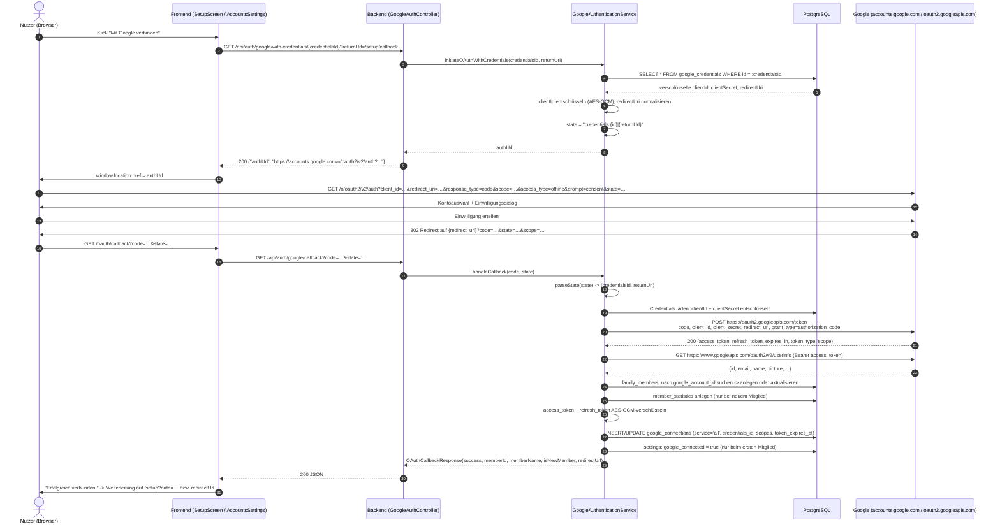
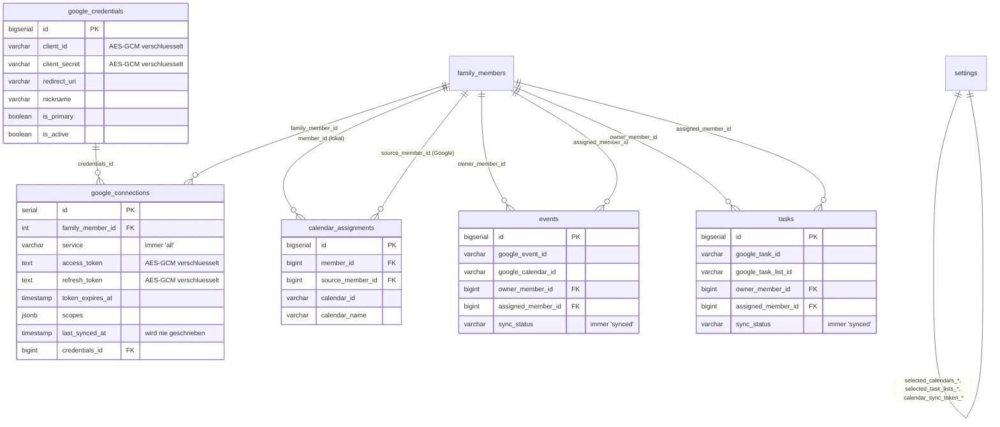

# 06 — Google-Integration (Calendar, Tasks, OAuth 2.0)

## Zweck & Geltungsbereich

Dieses Dokument beschreibt vollständig die Anbindung des Altsystems FamilyHub an die Google-APIs:
OAuth-2.0-Flow, Credentials- und Token-Verwaltung, Kalender- und Aufgaben-Synchronisation sowie den
Setup-Wizard, über den ein Nutzer die Verbindung herstellt. Es ist so geschrieben, dass ein
Entwicklungsteam die Google-Anbindung ohne Zugriff auf den Altcode neu implementieren kann.
Nicht Teil dieses Dokuments: Foto-Anbindung (erfolgt im Altsystem über Synology Photos, **nicht**
über Google Photos — siehe Kapitel 2.4), Wetter, Haushaltsaufgaben, Badges.

Anforderungs-Präfixe dieses Dokuments: `FA-GOO-nn` (fachliche Anforderungen),
`TA-GOO-nn` (technische Anforderungen).

---

## Inhaltsverzeichnis

- [1. Überblick](#1-überblick)
- [2. Genutzte Google-Dienste](#2-genutzte-google-dienste)
- [3. Google-Cloud-Voraussetzungen (Schritt für Schritt)](#3-google-cloud-voraussetzungen-schritt-für-schritt)
- [4. OAuth-2.0-Flow](#4-oauth-20-flow)
- [5. Scopes](#5-scopes)
- [6. Token-Management](#6-token-management)
- [7. Credentials-Verwaltung](#7-credentials-verwaltung)
- [8. Kalender-Integration](#8-kalender-integration)
- [9. Tasks-Integration](#9-tasks-integration)
- [10. Synchronisation (SyncScheduler)](#10-synchronisation-syncscheduler)
- [11. Fehlerbehandlung & Rate Limits](#11-fehlerbehandlung--rate-limits)
- [12. Setup-Wizard aus Nutzersicht](#12-setup-wizard-aus-nutzersicht)
- [13. Datenmodell (Übersicht)](#13-datenmodell-übersicht)
- [14. Endpoint-Referenz](#14-endpoint-referenz)
- [15. Bekannte Schwächen / offene Punkte](#15-bekannte-schwächen--offene-punkte)
- [16. Empfehlungen für die Neuauflage](#16-empfehlungen-für-die-neuauflage)

---

## 1. Überblick

### 1.1 Grundprinzip

FamilyHub ist eine selbst gehostete Anwendung ohne zentralen Betreiber. Es gibt daher **keinen
vorkonfigurierten OAuth-Client**. Jeder Betreiber legt sich in der Google Cloud Console ein eigenes
Projekt mit eigener OAuth-Client-ID an und trägt Client-ID, Client-Secret und Redirect-URI im
Setup-Wizard der Anwendung ein. Diese Werte werden **verschlüsselt in der Datenbank** abgelegt
(Tabelle `google_credentials`) und nicht in `.env`.

Begründung im Altsystem (dokumentiert in `familyhub/.env_example` und `docs/GOOGLE_SETUP.md`):

- Der Endnutzer soll die Anwendung ohne Editieren von Konfigurationsdateien und ohne Neustart des
  Containers in Betrieb nehmen können.
- Es sollen **mehrere Google-Cloud-Projekte / OAuth-Clients parallel** verwaltbar sein
  (Multi-Account, siehe 1.3). Eine `.env` kann nur einen Satz Credentials abbilden.
- Änderungen (z. B. neue Redirect-URI nach Umzug auf eine Domain) sollen zur Laufzeit über die
  Einstellungen möglich sein.

### 1.2 Beteiligte Komponenten

| Komponente | Datei (Altsystem) | Aufgabe |
|------------|-------------------|---------|
| `GoogleOAuthConfig` | `familyhub/backend/src/main/kotlin/com/familyhub/config/GoogleOAuthConfig.kt` | Statische Scope-Liste, Konstanten für Token-/UserInfo-URL, `RestTemplate`-Bean |
| `GoogleAuthenticationService` | `.../service/GoogleAuthenticationService.kt` | Auth-URL-Erzeugung, Code-Tausch, Refresh, Callback-Verarbeitung, Disconnect |
| `GoogleOAuthService` | `.../service/GoogleOAuthService.kt` | Nur noch `getUserInfo(accessToken)` |
| `GoogleCredentialsService` | `.../service/GoogleCredentialsService.kt` | CRUD für OAuth-Client-Credentials, Primary-Verwaltung |
| `CredentialsEncryptionService` | `.../service/CredentialsEncryptionService.kt` | AES-GCM-Verschlüsselung von Client-ID/Secret |
| `TokenEncryptionService` | `.../service/TokenEncryptionService.kt` | AES-GCM-Verschlüsselung von Access-/Refresh-Token |
| `RedirectUriValidator` | `.../service/RedirectUriValidator.kt` | Normalisierung/Validierung der Redirect-URI |
| `GoogleCalendarService` | `.../service/GoogleCalendarService.kt` | HTTP-Client für Calendar API v3 |
| `GoogleTasksService` | `.../service/GoogleTasksService.kt` | HTTP-Client für Tasks API v1 |
| `CalendarSyncService` | `.../service/CalendarSyncService.kt` | Mapping Google-Event ↔ `Event`, Sync-Logik, Sync-Token |
| `TasksSyncService` | `.../service/TasksSyncService.kt` | Mapping Google-Task ↔ `Task`, Sync-Logik |
| `CalendarAssignmentService` | `.../service/CalendarAssignmentService.kt` | Zuordnung fremder Kalender zu lokalen Mitgliedern |
| `SyncScheduler` | `.../scheduler/SyncScheduler.kt` | Zeitgesteuerter Sync aller Mitglieder |
| `GoogleAuthController` | `.../controller/GoogleAuthController.kt` | REST-Endpoints `/api/auth/google/**` |
| `GoogleCredentialsController` | `.../controller/GoogleCredentialsController.kt` | REST-Endpoints `/api/setup/credentials/**` |
| Setup-Wizard (Frontend) | `familyhub/frontend/src/components/setup/**` | 7-Schritt-Assistent |
| OAuth-Callback-Seite | `familyhub/frontend/src/pages/OAuthCallback.tsx` | Route `/oauth/callback` |

### 1.3 Multi-Account-Konzept

Das Altsystem kennt **zwei voneinander unabhängige Mehrfachkonzepte**:

1. **Mehrere OAuth-Client-Credentials** (`google_credentials`): Jeder Datensatz repräsentiert ein
   eigenes Google-Cloud-Projekt bzw. einen eigenen OAuth-Client, identifiziert über ein
   frei wählbares `nickname` (z. B. „Familie“, „Papa“). Genau ein Datensatz ist `is_primary = true`.
   Fehlt beim OAuth-Start eine explizite `credentialsId`, werden die Primary-Credentials verwendet.
2. **Mehrere verbundene Google-Konten** (`google_connections` je `family_members`): Jedes
   Familienmitglied, das den OAuth-Flow durchlaufen hat, besitzt genau eine Connection mit
   `service = "all"` (kombinierte Verbindung für Kalender **und** Tasks). Die Connection referenziert
   über `credentials_id` die verwendeten Client-Credentials.

Zusätzlich existieren **lokale Mitglieder ohne Google-Konto**. Für diese können Kalender eines
Google-verbundenen Mitglieds über `calendar_assignments` „geliehen“ werden (siehe 8.4).

| ID | Anforderung | Priorität | Ist-Zustand |
|----|-------------|-----------|-------------|
| FA-GOO-01 | Das System muss mehrere Google-OAuth-Client-Credentials parallel speichern und verwalten können. | MUSS | Umgesetzt |
| FA-GOO-02 | Das System muss genau einen Credentials-Datensatz als „Primary“ führen und diesen bei fehlender expliziter Auswahl verwenden. | MUSS | Umgesetzt |
| FA-GOO-03 | Das System muss mehrere Google-Konten (je Familienmitglied eines) verbinden können. | MUSS | Umgesetzt |
| FA-GOO-04 | Das System muss Client-ID und Client-Secret ausschließlich verschlüsselt in der Datenbank ablegen und niemals über die API zurückgeben. | MUSS | Umgesetzt |
| FA-GOO-05 | Das System muss die Google-Konfiguration vollständig über die Oberfläche (Setup-Wizard/Einstellungen) erfassbar machen, ohne Datei-Konfiguration. | MUSS | Umgesetzt |

---

## 2. Genutzte Google-Dienste

### 2.1 Übersicht der angesprochenen Hosts/Endpoints

| Zweck | Basis-URL | Konstante im Altsystem |
|-------|-----------|------------------------|
| Authorization Endpoint | `https://accounts.google.com/o/oauth2/v2/auth` | in `GoogleAuthenticationService.getOAuthUrlForCredentials()` per `UriComponentsBuilder` zusammengesetzt |
| Token Endpoint | `https://oauth2.googleapis.com/token` | `GoogleOAuthConfig.TOKEN_URL` |
| UserInfo Endpoint | `https://www.googleapis.com/oauth2/v2/userinfo` | `GoogleOAuthConfig.USER_INFO_URL` |
| Calendar API v3 | `https://www.googleapis.com/calendar/v3` | `GoogleCalendarService.BASE_URL` |
| Tasks API v1 | `https://tasks.googleapis.com/tasks/v1` | `GoogleTasksService.BASE_URL` |

### 2.2 Google Calendar API v3

Genutzte Ressourcen:

| Operation | HTTP | Pfad |
|-----------|------|------|
| Kalenderliste abrufen | GET | `/users/me/calendarList` |
| Termine abrufen | GET | `/calendars/{calendarId}/events` |
| Termin anlegen | POST | `/calendars/{calendarId}/events` |
| Termin ändern | PUT | `/calendars/{calendarId}/events/{eventId}` |
| Termin löschen | DELETE | `/calendars/{calendarId}/events/{eventId}` |

### 2.3 Google Tasks API v1

| Operation | HTTP | Pfad |
|-----------|------|------|
| Aufgabenlisten abrufen | GET | `/users/@me/lists` |
| Aufgaben abrufen | GET | `/lists/{taskListId}/tasks?showCompleted=…&showHidden=…` |
| Aufgabe anlegen | POST | `/lists/{taskListId}/tasks` |
| Aufgabe ändern | PUT | `/lists/{taskListId}/tasks/{taskId}` |
| Aufgabe löschen | DELETE | `/lists/{taskListId}/tasks/{taskId}` |

`taskListId` und `taskId` werden vor dem Einsetzen in die URL mit
`URLEncoder.encode(value, UTF-8)` kodiert.

### 2.4 Google OAuth2 UserInfo API (v2)

`GET https://www.googleapis.com/oauth2/v2/userinfo` mit `Authorization: Bearer <access_token>`.
Ausgewertete Felder: `id`, `email`, `name`, `picture`, `given_name`, `family_name`,
`verified_email`. Wird ausschließlich unmittelbar nach dem Code-Tausch aufgerufen, um das
Familienmitglied anzulegen bzw. zu identifizieren.

### 2.5 Nicht genutzte Google-Dienste

| Dienst | Status im Altsystem |
|--------|---------------------|
| Google Photos / Photos Picker API | **Nicht umgesetzt.** `docs/GOOGLE_SETUP.md` nennt die Photos Picker API als „optional“ und listet den Scope `photospicker.mediaitems.readonly`; im Backend existiert **kein** Code dafür. Fotos werden über Synology Photos bezogen (`SynologyPhotosService`). Der Scope wird vom Backend nie angefordert. |
| Google People API | Nicht genutzt. Profildaten kommen aus dem UserInfo-Endpoint. |
| Google Drive / Gmail | Nicht genutzt. |
| Google Calendar Push Notifications (Watch/Webhooks) | Nicht genutzt. Synchronisation erfolgt ausschließlich per Polling. |

### 2.6 Verwendete Client-Bibliotheken

**Es wird keine offizielle Google-Client-Library eingesetzt.** Sämtliche Aufrufe erfolgen mit
Spring `RestTemplate` gegen die REST-Endpoints, JSON-Mapping über Jackson.

Relevante Abhängigkeiten aus `familyhub/backend/build.gradle.kts`:

| Abhängigkeit | Version | Anmerkung |
|--------------|---------|-----------|
| `org.springframework.boot:spring-boot-starter-web` | über Boot 3.2.2 verwaltet | liefert `RestTemplate` |
| `org.springframework.boot:spring-boot-starter-oauth2-client` | über Boot 3.2.2 verwaltet | **deklariert, aber für den Google-Flow nicht verwendet** — der Flow ist handgeschrieben |
| `com.fasterxml.jackson.module:jackson-module-kotlin` | über Boot 3.2.2 verwaltet | JSON-Deserialisierung der Google-Antworten |
| `org.apache.httpcomponents.client5:httpclient5` | 5.3 | nur für Synology-SSL benötigt, nicht für Google |
| `com.google.api-client` / `google-api-services-calendar` / `google-api-services-tasks` | — | **nicht vorhanden** |

Kotlin 1.9.22, Spring Boot 3.2.2, Java 17.

| ID | Anforderung | Priorität | Ist-Zustand |
|----|-------------|-----------|-------------|
| TA-GOO-01 | Das System muss die Google Calendar API v3 und die Google Tasks API v1 über HTTPS-REST-Aufrufe ansprechen. | MUSS | Umgesetzt (ohne Google-Client-Library) |
| TA-GOO-02 | Das System muss Profilinformationen des verbundenen Kontos über den OAuth2-UserInfo-Endpoint beziehen. | MUSS | Umgesetzt |

---

## 3. Google-Cloud-Voraussetzungen (Schritt für Schritt)

Diese Anleitung entspricht `docs/GOOGLE_SETUP.md` und dem im Wizard angezeigten Text
(`familyhub/frontend/src/components/setup/steps/GoogleGuideStep.tsx`).

### 3.1 Voraussetzungen

- Ein Google-Konto.
- Zugang zur Google Cloud Console (`https://console.cloud.google.com/`).

### 3.2 Schritt 1 — Google-Cloud-Projekt anlegen

1. `https://console.cloud.google.com/` öffnen und anmelden.
2. Projekt-Dropdown oben links öffnen → **„Neues Projekt“**.
3. Projektnamen vergeben (Vorschlag im Wizard: „FamilyHub“).
4. **„Erstellen“** klicken.

### 3.3 Schritt 2 — APIs aktivieren

Unter **APIs & Dienste → Bibliothek** (`https://console.cloud.google.com/apis/library`) aktivieren:

| API | Pflicht? | Begründung |
|-----|----------|------------|
| Google Calendar API | **Pflicht** | Kalenderliste, Termine lesen/schreiben |
| Google Tasks API | **Pflicht** | Aufgabenlisten und Aufgaben lesen/schreiben |
| Google Photos Picker API | Optional/obsolet | In `docs/GOOGLE_SETUP.md` erwähnt, im Code nicht genutzt (siehe 2.5) |

Ein separates Aktivieren der „Google OAuth2 API“ ist nicht nötig; der UserInfo-Endpoint ist Teil
der Standard-OAuth-Infrastruktur.

### 3.4 Schritt 3 — OAuth-Consent-Screen konfigurieren

Unter **APIs & Dienste → OAuth-Zustimmungsbildschirm**
(`https://console.cloud.google.com/apis/credentials/consent`):

| Feld | Wert |
|------|------|
| Nutzertyp | **Extern** (bei Google Workspace alternativ „Intern“) |
| App-Name | z. B. `FamilyHub` |
| Support-E-Mail | E-Mail des Betreibers |
| Entwicklerkontakt | E-Mail des Betreibers |

**Scopes eintragen** (die vom Backend tatsächlich angeforderten, siehe Kapitel 5):

```
https://www.googleapis.com/auth/userinfo.profile
https://www.googleapis.com/auth/userinfo.email
https://www.googleapis.com/auth/calendar
https://www.googleapis.com/auth/tasks
```

> Hinweis zur Inkonsistenz: Der Wizard-Text in `GoogleGuideStep.tsx` nennt die Scopes
> `openid`, `email`, `profile`, `…/auth/calendar`, `…/auth/tasks`. Das Backend fordert jedoch
> `…/auth/userinfo.profile` und `…/auth/userinfo.email` an (nicht `openid`). Für die Neuauflage ist
> eine der beiden Listen zu korrigieren; funktional sind `email`/`profile` und
> `userinfo.email`/`userinfo.profile` bei Google Aliase, `openid` wird vom Altsystem nicht benötigt.

**Publishing-Status / Testnutzer:** Solange die App im Status **„Testing“** steht, müssen alle
Google-Konten, die verbunden werden sollen, unter **„Testnutzer“** explizit eingetragen werden
(maximal 100). Refresh-Tokens laufen in diesem Zustand nach 7 Tagen ab (siehe 6.6). Für den
Dauerbetrieb ist entweder der Verifizierungsprozess („In Produktion“) zu durchlaufen oder ein
Workspace-interner Consent-Screen zu verwenden.

### 3.5 Schritt 4 — OAuth-2.0-Client-ID erstellen

Unter **APIs & Dienste → Anmeldedaten** (`https://console.cloud.google.com/apis/credentials`):

1. **„Anmeldedaten erstellen“ → „OAuth-Client-ID“**.
2. Anwendungstyp: **Webanwendung**.
3. Name: z. B. `FamilyHub Web Client`.
4. **Autorisierte Weiterleitungs-URIs** eintragen (siehe 3.6).
5. **„Erstellen“**. Client-ID (Format `<zahlen>-<hash>.apps.googleusercontent.com`) und
   Client-Secret (Format `GOCSPX-<redacted>`) notieren.

### 3.6 Autorisierte Redirect-URIs — Achtung, widersprüchliche Angaben im Altsystem

Im Altsystem existieren **drei unterschiedliche Vorgaben** für die Redirect-URI:

| Quelle | Vorgeschlagene URI |
|--------|--------------------|
| `docs/GOOGLE_SETUP.md` | `http://localhost:8081/api/auth/google/callback` (Backend-Port) |
| Wizard-Schritt „4. OAuth 2.0 Client ID erstellen“ (`GoogleGuideStep.tsx`) | `<origin-des-frontends>/api/auth/google/callback` |
| Vorbelegung des Eingabefelds in `CredentialsStep.tsx` | `<origin-des-frontends>/oauth/callback` |

Funktionsfähig ist im Altsystem **nur die Frontend-Route** `<origin>/oauth/callback`, weil die
Seite `OAuthCallback.tsx` den Code entgegennimmt und selbst an das Backend weiterreicht
(siehe 4.4). Wird `…/api/auth/google/callback` eingetragen, landet der Nutzer direkt auf einer
JSON-Antwort des Backends statt in der Oberfläche.

Empfohlene Einträge in der Google Cloud Console (alle Varianten, die im Betrieb vorkommen können):

```
http://localhost:8080/oauth/callback          # Vite-Dev-Server
http://localhost:3080/oauth/callback          # Frontend im Docker-Compose
http://<nas-ip>:3080/oauth/callback           # Zugriff im Heimnetz
https://familyhub.<deine-domain>/oauth/callback
```

Google akzeptiert `http://` nur für `localhost`; für alle anderen Hosts ist `https://`
erforderlich. Das Altsystem erzwingt dies **nicht** (siehe `RedirectUriValidator`, Kapitel 7.4).

| ID | Anforderung | Priorität | Ist-Zustand |
|----|-------------|-----------|-------------|
| FA-GOO-06 | Das System muss den Nutzer schrittweise durch die Einrichtung des Google-Cloud-Projekts führen (Projekt, APIs, Consent-Screen, Client-ID). | MUSS | Umgesetzt (`GoogleGuideStep`) |
| FA-GOO-07 | Das System soll die im Betrieb tatsächlich gültige Redirect-URI anzeigen und vorbelegen. | SOLL | Teilweise (widersprüchliche Angaben, siehe 15.2) |

---

## 4. OAuth-2.0-Flow

### 4.1 Ablaufdiagramm



### 4.2 Authorization Request — Parameter

Erzeugt in `GoogleAuthenticationService.getOAuthUrlForCredentials(credentials, state)`.

| Parameter | Wert im Altsystem | Anmerkung |
|-----------|-------------------|-----------|
| Basis-URL | `https://accounts.google.com/o/oauth2/v2/auth` | fest |
| `client_id` | entschlüsselte `client_id` aus `google_credentials` | — |
| `redirect_uri` | `RedirectUriValidator.normalizeOrThrow(credentials.redirectUri)` | Schema+Host kleingeschrieben, User-Info und Fragment entfernt |
| `response_type` | `code` | Authorization-Code-Flow |
| `scope` | Scope-Liste mit **Leerzeichen** verkettet (`joinToString(" ")`) | siehe Kapitel 5 |
| `access_type` | `offline` | Voraussetzung für Refresh-Token |
| `prompt` | `consent` | erzwingt bei **jedem** Lauf den Einwilligungsdialog → Google liefert immer ein Refresh-Token |
| `state` | `credentials:{credentialsId}\|{returnUrl}` | siehe 4.3 |
| PKCE (`code_challenge`) | **nicht gesetzt** | im Altsystem nicht implementiert |
| `login_hint`, `include_granted_scopes` | nicht gesetzt | — |

Die Query-Parameter werden durch `UriComponentsBuilder` URL-kodiert.

### 4.3 State-Handling und CSRF-Schutz

**Format:** `credentials:{id}|{returnUrl}`, z. B. `credentials:1|/setup/callback`.
Fehlt `returnUrl`, wird der Default `"/dashboard"` (`DEFAULT_RETURN_URL`) eingesetzt.

**Parsing** (`parseState`):

1. `state == null` → `(null, "/dashboard")`.
2. `state` beginnt mit `credentials:` → Präfix entfernen, an erstem `|` in maximal zwei Teile
   splitten; Teil 1 = `credentialsId` (`toLongOrNull()`, bei Parsefehler `null`), Teil 2 =
   `returnUrl` (sanitisiert).
3. Sonst → gesamter State gilt als `returnUrl` (sanitisiert), `credentialsId = null`.

**`sanitizeReturnUrl`** (Open-Redirect-Schutz): Der Wert wird getrimmt; er wird auf `"/dashboard"`
zurückgesetzt, wenn er leer ist, **nicht** mit `/` beginnt, mit `//` beginnt oder `://` enthält.
Damit sind nur relative Pfade zulässig.

**CSRF-Schutz: nicht vorhanden.** Der `state`-Parameter enthält ausschließlich Routing-Information.
Es wird **kein** kryptografisch zufälliger Nonce erzeugt, gespeichert und beim Callback verglichen.
Ein Angreifer kann folglich einen Callback mit fremdem `code` an das Backend senden
(„Login-CSRF“ / Account-Injection). Zusätzlich ist der Callback-Endpoint unauthentifiziert
erreichbar (siehe 11.5). Siehe Schwäche 15.1.

| ID | Anforderung | Priorität | Ist-Zustand |
|----|-------------|-----------|-------------|
| TA-GOO-03 | Das System muss den Authorization-Code-Flow mit `access_type=offline` und `prompt=consent` verwenden, um ein Refresh-Token zu erhalten. | MUSS | Umgesetzt |
| TA-GOO-04 | Das System muss den `state`-Parameter gegen CSRF absichern (zufälliger, serverseitig gespeicherter Nonce mit Einmalverwendung). | MUSS | **Nicht umgesetzt** |
| TA-GOO-05 | Das System muss die Rücksprung-URL nach dem OAuth-Flow auf relative Pfade beschränken (Open-Redirect-Schutz). | MUSS | Umgesetzt (`sanitizeReturnUrl`) |
| TA-GOO-06 | Das System soll PKCE (S256) verwenden. | SOLL | **Nicht umgesetzt** |

### 4.4 Callback-Verarbeitung

Google leitet auf die in den Credentials hinterlegte `redirect_uri` um. Im funktionierenden Aufbau
ist das die **Frontend-Route** `/oauth/callback` (`familyhub/frontend/src/pages/OAuthCallback.tsx`).
Diese Seite:

1. liest `code`, `state` und `error` aus der Query-String,
2. bricht bei gesetztem `error` mit der Meldung „Google-Authentifizierung wurde abgebrochen.“ ab,
3. ruft andernfalls per `fetch` auf: `GET /api/auth/google/callback?code=<code>&state=<state>`
   (Werte `encodeURIComponent`-kodiert; **relative URL**, nicht über den API-Client — dies
   funktioniert nur, wenn Frontend und Backend unter demselben Origin erreichbar sind, im
   Docker-Setup über den nginx-Proxy `location /api/`),
4. zeigt bei Erfolg „Erfolgreich verbunden!“ plus „Willkommen, {memberName}!“,
5. leitet nach 1500 ms weiter: enthält das Ziel `/setup`, wird auf
   `/setup?data=<urlencoded JSON>` navigiert (JSON mit `success`, `memberId`, `memberName`,
   `isNewMember`); sonst auf `data.redirectUrl` bzw. `state` bzw. `/`,
6. zeigt bei Fehler „Verbindung fehlgeschlagen“ mit Detailtext und Button „Erneut versuchen“
   (Navigation zu `/setup`).

Fehlt der Code komplett: „Kein Autorisierungscode erhalten.“

### 4.5 Authorization-Code-Tausch

`GoogleAuthenticationService.exchangeCodeForTokensWithCredentials(code, credentials)`:

```http
POST https://oauth2.googleapis.com/token
Content-Type: application/x-www-form-urlencoded

code=<authorization_code>
&client_id=<entschlüsselte client_id>
&client_secret=<entschlüsseltes client_secret>
&redirect_uri=<normalisierte redirect_uri>
&grant_type=authorization_code
```

Antwort (`GoogleTokenResponse`, `familyhub/backend/src/main/kotlin/com/familyhub/dto/GoogleDtos.kt`):

| JSON-Feld | Kotlin-Feld | Typ | Pflicht |
|-----------|-------------|-----|---------|
| `access_token` | `accessToken` | String | ja |
| `refresh_token` | `refreshToken` | String? | nein (fehlt bei wiederholter Zustimmung ohne `prompt=consent`) |
| `expires_in` | `expiresIn` | Long (Sekunden) | ja |
| `token_type` | `tokenType` | String | ja |
| `scope` | `scope` | String? (leerzeichengetrennt) | nein |

Ist der Response-Body leer → `RuntimeException("Failed to exchange code for tokens")` → HTTP 500.

### 4.6 Anlegen/Aktualisieren des Familienmitglieds

Nach dem Token-Tausch wird `getUserInfo(accessToken)` aufgerufen und danach:

1. `familyMemberRepository.findByGoogleAccountId(userInfo.id)`.
2. **Vorhanden:** `name` und `profilePhotoUrl` werden aus den UserInfo-Daten aktualisiert,
   `updatedAt = now`. `isNewMember = false`.
3. **Nicht vorhanden:** neuer `FamilyMember` mit `googleAccountId = userInfo.id`,
   `googleEmail = userInfo.email`, `name = userInfo.name`, `profilePhotoUrl = userInfo.picture`
   und einer zufälligen Farbe aus der Liste
   `#3B82F6, #10B981, #F59E0B, #EF4444, #8B5CF6, #EC4899, #06B6D4, #84CC16`.
   Zusätzlich wird ein `MemberStatistics`-Datensatz angelegt. `isNewMember = true`.
4. Ist das Mitglied neu **und** ist es das einzige (`count() == 1`), wird das Setting
   `google_connected = "true"` gesetzt.

Das Feld `family_members.google_credential_id` wird an dieser Stelle **nicht** gesetzt
(nur `google_account_id`); die Zuordnung Mitglied ↔ Credentials erfolgt über
`google_connections.credentials_id`.

### 4.7 Umgang mit fehlendem Refresh-Token

In `saveGoogleConnection`:

```kotlin
val encryptedRefresh = tokens.refreshToken?.let { tokenEncryptionService.encrypt(it) }
    ?: throw IllegalStateException("No refresh token received")
```

**Verhalten:** Liefert Google kein `refresh_token`, bricht der gesamte Callback mit einer
`IllegalStateException` ab. Der `GlobalExceptionHandler` beantwortet das mit **HTTP 500**
(`{"status":500,"error":"Internal Server Error","message":"No refresh token received"}`). Das
Frontend zeigt „Verbindung fehlgeschlagen“. Es findet **kein** automatischer Wiederholungsversuch
mit `prompt=consent` statt (dieser ist ohnehin immer gesetzt, siehe 4.2) und es wird **kein**
bestehendes Refresh-Token wiederverwendet.

**Wichtiger Nebeneffekt:** Existiert bereits eine Connection (`service = "all"`) für dasselbe
Mitglied, werden im Update-Zweig nur `accessToken`, `tokenExpiresAt` und `credentialsId`
überschrieben — das **Refresh-Token bleibt unverändert** (das Feld ist als `val` deklariert und
damit nicht änderbar). Ein bei einer erneuten Autorisierung ausgestelltes neues Refresh-Token wird
also verworfen. Ebenso werden `scopes` bei einer erneuten Verbindung **nicht** aktualisiert.

| ID | Anforderung | Priorität | Ist-Zustand |
|----|-------------|-----------|-------------|
| TA-GOO-07 | Das System muss beim Fehlen eines Refresh-Tokens eine verständliche, fachliche Fehlermeldung liefern statt HTTP 500. | MUSS | **Nicht umgesetzt** |
| TA-GOO-08 | Das System muss bei erneuter Autorisierung ein neu ausgestelltes Refresh-Token und die aktualisierte Scope-Liste übernehmen. | MUSS | **Nicht umgesetzt** |

---

## 5. Scopes

### 5.1 Angeforderte Scopes

Quelle: `application.yml` → `google.oauth2.scopes` bzw. der identische Default in
`GoogleOAuthConfig`. Die Liste wird an Kommas gesplittet, getrimmt und für die Authorization-URL
mit Leerzeichen verkettet.

| Scope-URL | Wofür im Altsystem benötigt | Google-Klassifizierung | Verwendung |
|-----------|------------------------------|------------------------|------------|
| `https://www.googleapis.com/auth/calendar` | Kalenderliste lesen, Termine lesen **und schreiben** (POST/PUT/DELETE) | **Sensitive** (Consent-Verifizierung erforderlich für Produktion) | `GoogleCalendarService` (alle Methoden) |
| `https://www.googleapis.com/auth/tasks` | Aufgabenlisten lesen, Aufgaben lesen **und schreiben** | **Sensitive** | `GoogleTasksService` (alle Methoden) |
| `https://www.googleapis.com/auth/userinfo.profile` | Name und Profilbild des Kontos für das Familienmitglied | Nicht-sensitiv (Basis-Scope) | `GoogleOAuthService.getUserInfo` |
| `https://www.googleapis.com/auth/userinfo.email` | E-Mail-Adresse als Kontokennung (`google_email`) | Nicht-sensitiv (Basis-Scope) | `GoogleOAuthService.getUserInfo` |

**Restricted Scopes** (z. B. Gmail, Drive-Vollzugriff) werden **nicht** angefordert. Ein
Security Assessment durch Google ist damit nicht nötig; für die beiden *sensitive* Scopes ist
für den Produktivbetrieb (Publishing-Status „In Produktion“) jedoch die OAuth-Verifizierung
erforderlich. Im Testing-Status genügen eingetragene Testnutzer.

### 5.2 Nicht angeforderte, aber irgendwo erwähnte Scopes

| Scope | Fundstelle | Status |
|-------|------------|--------|
| `openid`, `email`, `profile` | Wizard-Text `GoogleGuideStep.tsx` | Werden vom Backend **nicht** angefordert. |
| `https://www.googleapis.com/auth/photospicker.mediaitems.readonly` | `docs/GOOGLE_SETUP.md` | Kein Code vorhanden. |
| `https://www.googleapis.com/auth/calendar.readonly` | nur in Testfixtures (`CalendarSyncServiceTest`) | Nicht produktiv angefordert. |
| `https://www.googleapis.com/auth/photoslibrary.readonly` | nur in Testfixtures | Nicht produktiv angefordert. |

### 5.3 Scope-Prüfung zur Laufzeit

Die von Google zurückgegebene Scope-Zeichenkette (`GoogleTokenResponse.scope`) wird an Leerzeichen
gesplittet und als JSONB-Array in `google_connections.scopes` gespeichert.

Geprüft wird zur Laufzeit nur mit einem **Substring-Vergleich**:

```kotlin
connection.scopes.any { scope -> scope.contains("calendar") }
```

- `CalendarSyncService.validateGoogleConnection(member)` wirft `IllegalStateException`, wenn
  keine Connection existiert („…has no Google account connected…“) oder kein Scope „calendar“
  enthält („…has not granted calendar permissions…“).
- `CalendarSyncService.hasCalendarScope(member)` nutzt dieselbe Prüfung für das Kalender-Listing.
- Für Tasks existiert **keine** Scope-Prüfung.

| ID | Anforderung | Priorität | Ist-Zustand |
|----|-------------|-----------|-------------|
| FA-GOO-08 | Das System muss genau die Scopes `calendar`, `tasks`, `userinfo.profile`, `userinfo.email` anfordern. | MUSS | Umgesetzt |
| TA-GOO-09 | Das System muss die tatsächlich erteilten Scopes persistieren und vor API-Aufrufen prüfen. | MUSS | Teilweise (Substring-Prüfung, nur für Calendar) |

---

## 6. Token-Management

### 6.1 Speicherung — Tabelle `google_connections`

Migrationen: `V2__create_google_connections.sql`, `V14__add_credentials_id_to_google_connections.sql`,
`V15__convert_scopes_to_jsonb.sql`.

| Spalte | Typ | Null | Bedeutung |
|--------|-----|------|-----------|
| `id` | `SERIAL` PK | nein | — |
| `family_member_id` | `INT` FK → `family_members(id)` `ON DELETE CASCADE` | ja | Besitzer der Verbindung |
| `service` | `VARCHAR(50)` | nein | Im Code **immer** `"all"` (kombinierte Verbindung). Der Kommentar im Entity nennt „photos, calendar, tasks“ — diese Werte werden nicht mehr geschrieben. |
| `access_token` | `TEXT` | ja | AES-GCM-verschlüsselt, Base64 |
| `refresh_token` | `TEXT` | nein | AES-GCM-verschlüsselt, Base64 |
| `token_expires_at` | `TIMESTAMP` | ja | Ablaufzeitpunkt des Access-Tokens (`now + expires_in`) |
| `scopes` | `JSONB` (ursprünglich `TEXT[]`) | nein | Liste der erteilten Scope-URLs |
| `connected_at` | `TIMESTAMP` default `NOW()` | ja | Zeitpunkt der Erstverbindung |
| `last_synced_at` | `TIMESTAMP` | ja | **Wird im Sync-Code nie geschrieben** (siehe 15.6); nur im Status-Endpoint gelesen |
| `credentials_id` | `BIGINT` FK → `google_credentials(id)` `ON DELETE SET NULL` | ja | verwendete OAuth-Client-Credentials |

Constraints/Indizes: `UNIQUE(family_member_id, service)`,
`idx_google_connections_member`, `idx_google_connections_service`,
`idx_google_connections_credentials_id`.

### 6.2 Verschlüsselung

Zwei funktional identische Services mit unterschiedlichen Schlüsseln:

| Service | Verschlüsselt | Property | Env-Variable | Default im Code |
|---------|---------------|----------|--------------|-----------------|
| `TokenEncryptionService` | Access- und Refresh-Token | `familyhub.security.encryption-key` | `FAMILYHUB_ENCRYPTION_KEY` | `defaultKey12345678901234567890123` |
| `CredentialsEncryptionService` | `client_id`, `client_secret` | `familyhub.security.credentials-encryption-key` | `CREDENTIALS_ENCRYPTION_KEY` | `credentialsKey1234567890123456789` |

> Die Default-Werte stehen im Klartext im Quellcode und in `application.yml`. In `.env` sind für
> beide Variablen produktive Werte zu setzen (`.env_example` dokumentiert sie mit Beispielwerten
> `your-32-character-encryption-key` bzw. `your-32-character-credentials-key`). Reale Werte gehören
> **nicht** in die Dokumentation.

**Algorithmus (identisch in beiden Services):**

| Aspekt | Wert |
|--------|------|
| Transformation | `AES/GCM/NoPadding` |
| Schlüssellänge | 256 Bit (32 Byte) |
| Schlüsselableitung | **Keine KDF.** `padKey()`: der Schlüsselstring wird mit `'0'` auf 32 Zeichen aufgefüllt, danach auf 32 Zeichen abgeschnitten, dann als UTF-8-Bytes verwendet. Bei Nicht-ASCII-Zeichen ergibt das >32 Byte und führt zu `InvalidKeyException`. |
| IV | 12 Byte, pro Verschlüsselung neu aus `java.security.SecureRandom` |
| GCM-Tag-Länge | 128 Bit |
| Ausgabeformat | `Base64( IV[12] ‖ Ciphertext ‖ Tag[16] )` als ASCII-String |
| Entschlüsselung | Base64 dekodieren, erste 12 Byte = IV, Rest = Ciphertext+Tag |
| AAD | keine |

Pseudocode:

```kotlin
fun encrypt(plainText: String): String {
    val key = SecretKeySpec(padKey(encryptionKey), "AES")
    val cipher = Cipher.getInstance("AES/GCM/NoPadding")
    val iv = ByteArray(12).also { SecureRandom().nextBytes(it) }
    cipher.init(Cipher.ENCRYPT_MODE, key, GCMParameterSpec(128, iv))
    val encrypted = cipher.doFinal(plainText.toByteArray(Charsets.UTF_8))
    return Base64.getEncoder().encodeToString(iv + encrypted)
}
```

Es gibt **keine** Schlüsselversionierung und **keine** Rotationsunterstützung: Ändert sich der
Schlüssel, sind alle bestehenden Tokens und Credentials unlesbar (die Entschlüsselung wirft
`AEADBadTagException`, die als HTTP 500 endet).

### 6.3 Ablauf-Erkennung

In `GoogleCalendarService.getValidAccessToken()` und `GoogleTasksService.getValidAccessToken()`
(**doppelt implementierter, identischer Code**):

```kotlin
val needsRefresh = connection.tokenExpiresAt?.let { expiresAt ->
    Instant.now().plusSeconds(60).isAfter(expiresAt)   // TOKEN_EXPIRY_BUFFER_SECONDS = 60
} ?: true    // kein Ablaufdatum => immer refreshen
```

Verwendet wird jeweils `googleConnectionRepository.findAllByFamilyMemberId(member.id).firstOrNull()`
— also die **erste** Connection des Mitglieds ohne definierte Sortierung. Existiert keine:
`IllegalStateException("No Google connection found for member <name>")`.

### 6.4 Refresh-Mechanismus

**Wann:** lazy, unmittelbar vor jedem Google-API-Aufruf, wenn `needsRefresh == true`.
Es existiert **kein** proaktiver Refresh-Job.

**Wie:** `GoogleAuthenticationService.refreshAccessTokenForConnection(connection, refreshToken)`
ermittelt die Credentials in dieser Reihenfolge:

1. `connection.credentialsId`,
2. sonst `googleCredentialsService.getPrimaryCredentials()?.id`,
3. sonst `ResourceNotFoundException("Keine Google Credentials konfiguriert. Bitte zuerst im
   Setup-Wizard einrichten.")` → HTTP 404.

Danach:

```http
POST https://oauth2.googleapis.com/token
Content-Type: application/x-www-form-urlencoded

refresh_token=<entschlüsseltes refresh_token>
&client_id=<entschlüsselte client_id>
&client_secret=<entschlüsseltes client_secret>
&grant_type=refresh_token
```

Nach erfolgreicher Antwort:

```kotlin
connection.accessToken = tokenEncryptionService.encrypt(newTokens.accessToken)
connection.tokenExpiresAt = Instant.now().plusSeconds(newTokens.expiresIn)
googleConnectionRepository.save(connection)
```

Das Refresh-Token wird nicht neu geschrieben (Google gibt bei `grant_type=refresh_token` ohnehin
keins zurück). `scopes` bleiben unverändert.

**Manueller Refresh:** `POST /api/auth/google/refresh?memberId={id}` →
`refreshTokenForMember(memberId)` mit identischer Logik; Antwort
`{"success": true, "expiresAt": "<ISO-8601>"}`.

### 6.5 Verhalten bei `invalid_grant` / widerrufenem Zugriff

**Nicht gesondert behandelt.** Google antwortet auf ein ungültiges/widerrufenes Refresh-Token mit
`HTTP 400` und `{"error":"invalid_grant"}`. Ablauf im Altsystem:

1. `RestTemplate` wirft `HttpClientErrorException.BadRequest`.
2. Diese wird in `refreshAccessTokenWithCredentials` **nicht** gefangen und propagiert nach oben.
3. Im geplanten Sync fängt `SyncScheduler.syncAll()` die Exception pro Mitglied ab, protokolliert
   `Sync failed for <name>: <message>` auf ERROR-Level und zählt `failureCount++`; der Sync läuft
   mit dem nächsten Mitglied weiter.
4. Bei einem interaktiven Aufruf (z. B. Kalenderliste) endet die Exception im
   `GlobalExceptionHandler` als **HTTP 500** (`HttpClientErrorException` ist keine
   `GoogleApiException`).

Es erfolgt **keine** Markierung der Connection als „ungültig“, **keine** Benachrichtigung des
Nutzers und **keine** Aufforderung zur Neuverbindung. Die Verbindung bleibt in der Datenbank stehen
und schlägt bei jedem Sync-Lauf erneut fehl.

### 6.6 Ablauf von Refresh-Tokens (Google-seitig)

Nicht im Code behandelt, aber betriebsrelevant: Bei Consent-Screens im Publishing-Status
**„Testing“** invalidiert Google Refresh-Tokens nach **7 Tagen**. Die Anwendung reagiert darauf mit
dem in 6.5 beschriebenen Dauerfehler. Ohne Verifizierung des Consent-Screens ist daher wöchentlich
eine manuelle Neuverbindung nötig.

### 6.7 Revoke / Disconnect

`POST /api/auth/google/disconnect` mit Header `X-Pin-Session: <sessionId>`:

```kotlin
if (!pinService.isSessionValid(sessionId)) throw UnauthorizedException("Invalid or expired session")
googleConnectionRepository.deleteAll()   // Full Reset: ALLE Verbindungen aller Mitglieder
```

Merkmale:

- Es wird **kein** `POST https://oauth2.googleapis.com/revoke` aufgerufen — die Zustimmung bleibt
  im Google-Konto bestehen, nur die lokalen Tokens werden gelöscht.
- Es gibt **kein** Trennen einer einzelnen Verbindung; der Aufruf löscht die Verbindungen aller
  Familienmitglieder.
- `google_credentials` (Client-ID/Secret) bleiben erhalten; ebenso Mitglieder, Events und Tasks.
- Die Aktion ist über die PIN-Session geschützt (einziger geschützter Google-Endpoint).

| ID | Anforderung | Priorität | Ist-Zustand |
|----|-------------|-----------|-------------|
| TA-GOO-10 | Das System muss OAuth-Tokens verschlüsselt speichern (AES-256-GCM mit zufälligem IV je Datensatz). | MUSS | Umgesetzt |
| TA-GOO-11 | Das System muss den Verschlüsselungsschlüssel aus einer Umgebungsvariable beziehen und ohne gesetzten Wert nicht produktiv starten. | MUSS | Teilweise (Default-Schlüssel im Code, Start wird nicht verweigert) |
| TA-GOO-12 | Das System muss abgelaufene Access-Tokens automatisch mit einem Puffer von 60 s vor Ablauf erneuern. | MUSS | Umgesetzt |
| TA-GOO-13 | Das System muss bei `invalid_grant` die Verbindung als ungültig markieren und den Nutzer zur Neuverbindung auffordern. | MUSS | **Nicht umgesetzt** |
| FA-GOO-09 | Das System muss beim Trennen einer Verbindung den Zugriff auch bei Google widerrufen (`/revoke`). | SOLL | **Nicht umgesetzt** |
| FA-GOO-10 | Das System soll das Trennen einzelner Konten statt eines Komplett-Resets erlauben. | SOLL | **Nicht umgesetzt** |

---

## 7. Credentials-Verwaltung

### 7.1 Tabelle `google_credentials`

Migration `V13__create_google_credentials_table.sql`:

| Spalte | Typ | Null | Default | Bedeutung |
|--------|-----|------|---------|-----------|
| `id` | `BIGSERIAL` PK | nein | — | — |
| `client_id` | `VARCHAR(512)` | nein | — | **verschlüsselt** (AES-GCM, Base64) |
| `client_secret` | `VARCHAR(512)` | nein | — | **verschlüsselt** (AES-GCM, Base64) |
| `redirect_uri` | `VARCHAR(512)` | nein | — | **Klartext**, normalisiert |
| `nickname` | `VARCHAR(100)` | nein | — | Anzeigename, z. B. „Familie“ |
| `is_primary` | `BOOLEAN` | nein | `FALSE` | genau ein Datensatz `true` |
| `is_active` | `BOOLEAN` | nein | `TRUE` | wird im Code nie auf `false` gesetzt (Löschen erfolgt hart) |
| `created_at` | `TIMESTAMPTZ` | nein | `CURRENT_TIMESTAMP` | — |
| `updated_at` | `TIMESTAMPTZ` | nein | `CURRENT_TIMESTAMP` | — |

Partielle Indizes: `idx_google_credentials_is_primary` (`WHERE is_primary = true`),
`idx_google_credentials_is_active` (`WHERE is_active = true`).
Eine Datenbank-Constraint, die **genau einen** Primary erzwingt, existiert nicht.

### 7.2 Erfassung im Wizard

`CredentialsStep.tsx` erfasst vier Felder:

| Feld | Label (UI) | Vorbelegung | Placeholder |
|------|-----------|-------------|-------------|
| `nickname` | „Nickname“ | `"Familie"` | `"z.B. Familie Muller"` |
| `clientId` | „Client ID“ | leer | `"xxxxx.apps.googleusercontent.com"` |
| `clientSecret` | „Client Secret“ (`type="password"`) | leer | `"GOCSPX-..."` |
| `redirectUri` | „Redirect URI“ | `` `${window.location.origin}/oauth/callback` `` | — |

Hinweistext unter der Redirect-URI: „Diese URI muss in der Google Cloud Console als autorisierte
Weiterleitungs-URI eingetragen sein.“

**Client-seitige Validierung** (`validateForm`):

| Regel | Fehlermeldung |
|-------|---------------|
| `nickname` nicht leer | „Nickname ist erforderlich“ |
| `clientId` nicht leer | „Client ID ist erforderlich“ |
| `clientId` endet auf `.apps.googleusercontent.com` | „Client ID muss auf .apps.googleusercontent.com enden“ |
| `clientSecret` nicht leer | „Client Secret ist erforderlich“ |
| `redirectUri` nicht leer | „Redirect URI ist erforderlich“ |

### 7.3 Validierung serverseitig — `POST /api/setup/credentials/validate`

Request: `{ "clientId": "...", "clientSecret": "...", "redirectUri": "..." }`
Response: `{ "isValid": boolean, "errorMessage": string|null }`

Geprüft wird ausschließlich **formal**:

| Prüfung | Fehlermeldung (deutsch, wörtlich) |
|---------|-----------------------------------|
| `clientId` nicht leer | „Client ID darf nicht leer sein“ |
| `clientSecret` nicht leer | „Client Secret darf nicht leer sein“ |
| `redirectUri` nicht leer | „Redirect URI darf nicht leer sein“ |
| `clientId` endet auf `.apps.googleusercontent.com` | „Client ID hat ein ungültiges Format. Erwartet: *.apps.googleusercontent.com“ |
| `RedirectUriValidator.normalizeOrThrow` erfolgreich | „Redirect URI hat ein ungültiges Format“ |
| OAuth-URL lässt sich bauen | „Validierung fehlgeschlagen“ |

> **Wichtig:** Es findet **kein** Netzwerkaufruf zu Google statt. Der Button heißt in der UI
> „Verbindung testen“ und die Erfolgsmeldung lautet „Verbindung erfolgreich!“ — beides ist
> irreführend, da weder Client-Secret noch Redirect-URI gegen Google geprüft werden. Ein
> falsches Secret fällt erst beim Code-Tausch auf. Siehe Schwäche 15.3.

### 7.4 `RedirectUriValidator`

`object RedirectUriValidator.normalizeOrThrow(rawUri, fieldName = "Redirect URI"): String`

Ablauf:

1. Trimmen. Leer → `BadRequestException("<fieldName> darf nicht leer sein")`.
2. `URI(trimmed)`; `URISyntaxException` → `BadRequestException("Ungültige <fieldName>")`.
3. Ablehnung (ebenfalls `BadRequestException("Ungültige <fieldName>")`), wenn:
   - Schema (lowercase) nicht in `{"http", "https"}`,
   - Host `null` oder leer,
   - `userInfo != null` (z. B. `https://user:pw@host/`),
   - `fragment != null` (z. B. `…#abc`).
4. Rückgabe einer neu zusammengesetzten URI: `scheme` (Original-Schreibweise), `userInfo = null`,
   `host` **kleingeschrieben**, `port` unverändert, `path` unverändert, `query` unverändert,
   `fragment = null`.

Nicht geprüft: Allowlist von Hosts, Pflicht zu `https` für Nicht-Localhost-Hosts, Übereinstimmung
mit dem tatsächlichen Anwendungs-Origin, Existenz des Pfads. Die normalisierte URI wird bei
**jeder** Verwendung erneut durch `normalizeOrThrow` geschickt (Auth-URL-Bau und Token-Tausch), was
die Identität beider Werte sicherstellt.

### 7.5 Speichern, Ändern, Löschen

`GoogleCredentialsService`:

| Methode | Verhalten |
|---------|-----------|
| `saveCredentials(request)` | `isFirst = !existsByIsActiveTrue()`; Redirect-URI normalisieren; `clientId`/`clientSecret` verschlüsseln; `isPrimary = isFirst`, `isActive = true`; speichern |
| `updateCredentials(id, request)` | Nur gesetzte (`non-null`) Felder werden übernommen; `clientId`/`clientSecret` werden neu verschlüsselt; `redirectUri` neu normalisiert; `updatedAt = now`. Unbekannte ID → `IllegalArgumentException` → Controller antwortet **404** |
| `deleteCredentials(id)` | Harte Löschung (`deleteById`). War der Datensatz Primary, wird der **erste** verbleibende aktive Datensatz zum neuen Primary (`findByIsActiveTrue().first()`) |
| `setPrimaryCredentials(id)` | Entfernt das Primary-Flag beim bisherigen Primary, setzt es beim neuen; beide `updatedAt = now` |
| `getPrimaryCredentials()` | `findByIsPrimaryTrue()` |
| `hasAnyCredentials()` | `existsByIsActiveTrue()` |
| `getDecryptedClientId/Secret(credentials)` | Entschlüsselung für interne Nutzung |

**Ausgabe nach außen:** `CredentialsResponse` enthält bewusst **niemals** `clientId` oder
`clientSecret` (Kommentar im Code: „NIEMALS clientId oder clientSecret zurückgeben!“). Enthalten
sind `id`, `nickname`, `redirectUri`, `isPrimary`, `isActive`, `createdAt`; `nickname` und
`redirectUri` werden mit `HtmlUtils.htmlEscape()` ausgegeben.

> Das Frontend (`AccountsSettings.tsx`) deklariert im TypeScript-Interface ein Feld `clientId` —
> dieses wird vom Backend nie geliefert und nirgends angezeigt (toter Code).

### 7.6 Verwaltung in den Einstellungen

`AccountsSettings.tsx` (Bereich „Konten“ in den Einstellungen):

- Lädt `GET /api/setup/credentials/status` und listet alle Konten als Karten mit `nickname`,
  Badge „Primary“ und gekürzter Redirect-URI (max. 40 Zeichen + „…“).
- Leerzustand: „Keine Google Konten konfiguriert.“ / „Fuge ein Konto hinzu, um Kalender, Aufgaben
  und Fotos zu synchronisieren.“
- Aktion „Als Primary setzen“ → `PUT /api/setup/credentials/{id}/primary`.
- Aktion „Loschen“ → Bestätigungsdialog „Konto loschen?“ mit Text „Mochtest du das Google Konto
  „{nickname}“ wirklich loschen? Diese Aktion kann nicht ruckgangig gemacht werden.“; bei
  Primary-Konten zusätzlich: „Achtung: Dies ist das Primary Konto. Nach dem Loschen muss ein neues
  Primary Konto festgelegt werden.“ → `DELETE /api/setup/credentials/{id}`.
- Button „Neuen Account hinzufugen“ öffnet `AddAccountDialog` (Sheet von rechts) mit den beiden
  Schritten „Neues Google Konto hinzufugen“ (`GoogleGuideStep`) und „OAuth Credentials eingeben“
  (`CredentialsStep`).

> In den Einstellungen wird nach dem Speichern der Credentials **kein** OAuth-Flow gestartet — der
> Dialog schließt sich lediglich. Das Verbinden des Kontos muss separat erfolgen.

| ID | Anforderung | Priorität | Ist-Zustand |
|----|-------------|-----------|-------------|
| FA-GOO-11 | Das System muss Client-ID und Client-Secret über die Oberfläche erfassen, validieren, verschlüsseln und speichern. | MUSS | Umgesetzt (Validierung nur formal) |
| FA-GOO-12 | Das System muss die Redirect-URI normalisieren und auf `http`/`https` ohne User-Info und Fragment beschränken. | MUSS | Umgesetzt |
| FA-GOO-13 | Das System soll die eingegebenen Credentials durch einen echten Testaufruf gegen Google prüfen. | SOLL | **Nicht umgesetzt** (nur Formatprüfung, UI suggeriert einen echten Test) |
| FA-GOO-14 | Das System muss Konten in den Einstellungen auflisten, als Primary markieren und löschen können. | MUSS | Umgesetzt |

---

## 8. Kalender-Integration

### 8.1 Kalenderliste abrufen

```http
GET https://www.googleapis.com/calendar/v3/users/me/calendarList
Authorization: Bearer <access_token>
```

Ausgewertete Felder je Eintrag (`GoogleCalendar`): `id`, `summary`, `description`,
`backgroundColor`, `foregroundColor`, `accessRole`, `primary`. Alle unbekannten Felder werden
ignoriert (`@JsonIgnoreProperties(ignoreUnknown = true)`). **Pagination wird nicht ausgewertet** —
`nextPageToken` ist im DTO `GoogleCalendarListResponse` nicht einmal deklariert.

Fehlerfall: `HttpClientErrorException` → `GoogleApiException("Failed to list calendars: …",
statusCode)`.

**Fallback für lokale Mitglieder** (`CalendarSyncService.listAvailableCalendars(memberId)`):
Hat das Mitglied keinen Kalender-Scope, wird die Kalenderliste des **ersten** Mitglieds mit einer
Connection, deren Scopes „calendar“ enthalten, zurückgegeben. Existiert keines, wird eine leere
Liste geliefert.

REST-Endpoint: `GET /api/google-calendar/calendars?memberId={id}`. Der Controller fängt jede
Exception ab und liefert im Fehlerfall eine **leere Liste mit HTTP 200** (Kommentar im Code:
„Return empty list instead of error to prevent frontend crashes“); nur `IllegalArgumentException`
(Mitglied unbekannt) ergibt 404.

### 8.2 Auswahl der zu synchronisierenden Kalender

Die Auswahl wird **nicht** in einer eigenen Tabelle, sondern im generischen `settings`-Store
abgelegt:

| Setting-Key | Wert | Erzeuger |
|-------------|------|----------|
| `selected_calendars_{memberId}` | Kalender-IDs, **komma-separiert** in einem String | `CalendarSyncService.saveSelectedCalendars` |
| `selected_task_lists_{memberId}` | Tasklisten-IDs, komma-separiert | `TasksSyncService.saveSelectedTaskLists` |
| `calendar_sync_token_{memberId}_{calendarId.hashCode()}` | Google-`nextSyncToken` | `CalendarSyncService.saveSyncToken` |
| `google_connected` | `"true"` nach erster erfolgreicher Verbindung | `GoogleAuthenticationService.handleCallback` |

> Da Kalender-IDs bei Google i. d. R. E-Mail-artige Strings sind, ist die Komma-Trennung
> funktional, aber fragil. Der Sync-Token-Key nutzt `String.hashCode()` der Kalender-ID — die
> Kollisionswahrscheinlichkeit ist gering, aber nicht null; zudem ist der Key nicht rückverfolgbar.

Endpoints: `POST /api/google-calendar/selected` (Body `{memberId, calendarIds[]}`) und
`GET /api/google-calendar/selected?memberId={id}`.

Ist für ein Mitglied **keine** Auswahl gespeichert, synchronisiert `syncCalendars` ausschließlich
den Kalender mit der ID `"primary"`.

### 8.3 Termine abrufen

`GoogleCalendarService.listEvents(member, calendarId, timeMin, timeMax, syncToken)` kennt drei Wege:

**a) Inkrementell (Sync-Token vorhanden):**

```http
GET /calendar/v3/calendars/{calendarId}/events?syncToken={token}
```

Keine weiteren Parameter (Google verbietet die Kombination von `syncToken` mit `timeMin`/`timeMax`
und `orderBy`).

**b) Vollsync (Standard):**

```http
GET /calendar/v3/calendars/{calendarId}/events
    ?singleEvents=true
    &orderBy=startTime
    &timeMin={RFC3339}
    &timeMax={RFC3339}
```

**c) Vollsync-Fallback:** Schlägt (b) mit einer `GoogleApiException` fehl, wird ohne
`singleEvents`/`orderBy` erneut versucht (Log: „Calendar {id} doesn't support singleEvents, trying
simple query“):

```http
GET /calendar/v3/calendars/{calendarId}/events?timeMin={RFC3339}&timeMax={RFC3339}
```

**Zeitfenster des Vollsyncs** (`CalendarSyncService.performFullSync`):

| Grenze | Berechnung | Konstante |
|--------|------------|-----------|
| `timeMin` | `now` (UTC) minus **3 Monate** | `DEFAULT_SYNC_MONTHS_BACK = 3L` |
| `timeMax` | `now` (UTC) plus **1 Jahr** | `DEFAULT_SYNC_YEARS_FORWARD = 1L` |

Formatierung: `Instant.toString()`, also ISO-8601/RFC3339 in UTC (`2026-04-21T09:15:00Z`).

**Nicht gesetzte Parameter:** `maxResults` (Google-Default: 250), `pageToken`, `showDeleted`,
`timeZone`, `q`, `updatedMin`.

**Pagination:** Das DTO `GoogleEventsResponse` deklariert zwar `nextPageToken`, der Wert wird aber
**nirgends ausgewertet**. Kalender mit mehr als 250 Terminen im Zeitfenster werden folglich
unvollständig synchronisiert. Siehe Schwäche 15.4.

**Sync-Token:** `nextSyncToken` aus der Antwort wird nach der Verarbeitung im Setting
`calendar_sync_token_{memberId}_{hash}` gespeichert. Beim nächsten Lauf wird er verwendet.
Schlägt der inkrementelle Aufruf fehl (z. B. HTTP 410 `fullSyncRequired`), wird der Token gelöscht
(Log: „Sync token invalid for calendar {id} …, clearing token and performing full sync“) und
sofort ein Vollsync ausgeführt.

### 8.4 Kalender-Zuordnung zu Familienmitgliedern (`CalendarAssignment`)

Zweck: Ein Familienmitglied **ohne** Google-Konto (lokaler Nutzer, z. B. ein Kind) soll Termine aus
dem Kalender eines Google-verbundenen Mitglieds sehen.

Tabelle `calendar_assignments` (Migration `V21__create_calendar_assignments.sql`):

| Spalte | Typ | Null | Bedeutung |
|--------|-----|------|-----------|
| `id` | `BIGSERIAL` PK | nein | — |
| `member_id` | `BIGINT` FK → `family_members` `ON DELETE CASCADE` | nein | **lokaler** Nutzer, der die Termine sehen soll |
| `source_member_id` | `BIGINT` FK → `family_members` `ON DELETE CASCADE` | nein | Google-verbundenes Mitglied, dem der Kalender gehört |
| `calendar_id` | `VARCHAR(255)` | nein | Google-Kalender-ID |
| `calendar_name` | `VARCHAR(255)` | ja | Anzeigename (nur Darstellung) |
| `created_at` | `TIMESTAMPTZ` default `NOW()` | ja | — |

Constraints/Indizes: `UNIQUE(member_id, calendar_id)`,
`idx_calendar_assignments_member_id`, `idx_calendar_assignments_source_member_id`,
`idx_calendar_assignments_source_calendar (source_member_id, calendar_id)`.
Dieselbe Migration ergänzt `events.assigned_member_id` (FK, `ON DELETE SET NULL`) plus Index.

**Nicht vorhanden:** Farbe, Sichtbarkeits-Flag und Gruppen-Zugehörigkeit je Zuordnung sind im
Altsystem **nicht** modelliert. Die Farbe eines Termins kommt entweder aus `events.color`
(Google-`colorId`) oder aus der Mitgliedsfarbe `family_members.color`; eine Kalenderfarbe wird nur
für die Auswahl-UI aus `backgroundColor` der Google-Kalenderliste gelesen und **nicht persistiert**.
Eine Gruppierung von Kalendern ist im Code nicht ermittelbar — sie existiert nicht.

**Verfügbare Kalender ermitteln** (`getAvailableCalendarsForAssignment`): Alle Mitglieder mit
`googleCredentialId != null || googleAccountId != null` werden durchlaufen; für jedes wird die
Google-Kalenderliste abgerufen. Fehler je Mitglied werden geloggt und übersprungen. Ergebnis je
Eintrag: `calendarId`, `calendarName` (`summary` oder ersatzweise `id`), `sourceMemberId`,
`sourceMemberName`, `backgroundColor`, `primary`.

**Wirkung im Sync:** Beim Anlegen bzw. Aktualisieren eines Events wird
`findBySourceMemberIdAndCalendarId(member.id, calendarId)` ausgeführt und der **erste** Treffer als
`event.assignedMember` gesetzt. Sind mehrere lokale Mitglieder demselben Kalender zugeordnet,
erhält nur das erste (undefinierte Reihenfolge) den Termin. Siehe Schwäche 15.5.

### 8.5 Mapping Google-Event → internes `Event` (Feld für Feld)

Quelle: `CalendarSyncService.applyGoogleEventData` und `createEventFromGoogle`.
Zieltabelle `events` (Migration `V4__create_events.sql`, erweitert durch `V21`).

| Google-Feld (`GoogleEvent`) | Internes Feld (`Event`) | Typ intern | Transformation / Regel |
|-----------------------------|-------------------------|-----------|------------------------|
| `id` | `googleEventId` | `String?` | 1:1. Ist `null`/leer → Event wird übersprungen (Log „Skipping event without ID in calendar …“) |
| — (Aufrufparameter) | `googleCalendarId` | `String?` | Kalender-ID, aus der synchronisiert wurde |
| — (Aufrufkontext) | `ownerMember` | FK | Das Mitglied, über dessen Connection synchronisiert wurde |
| — (aus `calendar_assignments`) | `assignedMember` | FK? | Erster Treffer aus `findBySourceMemberIdAndCalendarId(ownerMember.id, calendarId)`, sonst `null` |
| `summary` | `title` | `String` (NOT NULL) | `summary ?: "Untitled"` — **englischer Fallback trotz deutscher UI** |
| `description` | `description` | `String?` | 1:1 |
| `location` | `location` | `String?` | 1:1 |
| `start` | `startTime` | `Instant` (NOT NULL) | `parseGoogleDateTime(start)`, siehe 8.6. Ist `start == null` → Event wird übersprungen |
| `end` | `endTime` | `Instant?` | `parseGoogleDateTime(end)` falls vorhanden, sonst `null` |
| `start.date != null` | `allDay` | `Boolean` | `true`, wenn das Startobjekt ein `date` (statt `dateTime`) trägt |
| `recurrence[0]` | `recurrenceRule` | `String?` | **Nur das erste** Element des `recurrence`-Arrays (i. d. R. die `RRULE:`-Zeile). `EXDATE`/`RDATE`-Zeilen gehen verloren |
| `colorId` | `color` | `String?` | Google-Farb-ID („1“–„11“) als String, **keine** Übersetzung in einen Hex-Wert |
| `reminders.overrides[].minutes` | `reminderMinutes` | `Array<Int>?` (`integer[]`) | Liste der Minutenwerte; `reminders.method` (`popup`/`email`) und `useDefault` werden verworfen |
| `status` | — | — | Nicht gespeichert. Wert `"cancelled"` steuert das Löschen (siehe 8.7) |
| `created`, `updated` | — | — | **Nicht übernommen**; `Event.createdAt`/`updatedAt` sind lokale Zeitstempel |
| `attendees`, `organizer`, `htmlLink`, `hangoutLink`, `conferenceData`, `attachments`, `visibility`, `transparency`, `iCalUID`, `recurringEventId`, `originalStartTime`, `extendedProperties` | — | — | **Nicht im DTO deklariert und damit nicht übernommen** |
| — | `syncStatus` | `String` | Konstant `"synced"` |
| — | `syncedAt` | `Instant?` | `Instant.now()` bei jedem Sync |

Interne Zusatzfelder ohne Google-Entsprechung: `id` (PK), `createdAt`, `updatedAt`.

**Identifizierender Schlüssel** für die Duplikaterkennung:
`eventRepository.findByGoogleEventIdAndGoogleCalendarId(googleEventId, calendarId)`. Derselbe
Termin, der über zwei Kalender (z. B. Original und Einladung) sichtbar ist, wird folglich als
**zwei** Datensätze gespeichert.

### 8.6 Zeitzonen und Ganztagstermine

`parseGoogleDateTime(dt: GoogleEventDateTime?): Instant`:

1. `dt == null` → `IllegalArgumentException("GoogleEventDateTime cannot be null")`.
2. `dt.dateTime != null` (Termin mit Uhrzeit):
   - Zuerst `ZonedDateTime.parse(dateTimeStr, DateTimeFormatter.ISO_OFFSET_DATE_TIME).toInstant()`
     (z. B. `2026-01-15T10:00:00+01:00`).
   - Bei `DateTimeParseException` Fallback `Instant.parse(dateTimeStr)` (z. B. `…T10:00:00Z`).
3. `dt.date != null` (Ganztagstermin, Format `yyyy-MM-dd`):
   - Zeitzone: `dt.timeZone`, falls vorhanden und gültig (`ZoneId.of`), sonst **UTC**
     (bei ungültigem Wert Log „Invalid timezone '<x>', using UTC“).
   - `LocalDate.parse(date).atStartOfDay(zone).toInstant()`.
4. Weder `dateTime` noch `date` → `IllegalArgumentException`.

**Konsequenz:** Ganztagstermine werden praktisch immer als `00:00 UTC` gespeichert, weil Google im
`date`-Fall regelmäßig kein `timeZone` liefert. In Mitteleuropa (UTC+1/+2) erscheinen sie damit in
lokaler Darstellung um 01:00/02:00 Uhr des korrekten Tages — die Anzeigeschicht muss `allDay`
auswerten und die Uhrzeit ignorieren. Eine anwendungsweit konfigurierte Zeitzone existiert nicht.

Für Google-`end` bei Ganztagsterminen gilt Googles Exklusiv-Semantik (`end.date` = Tag **nach**
dem letzten Tag). Das Altsystem korrigiert dies **nicht** — mehrtägige Ganztagstermine enden intern
einen Tag zu spät.

### 8.7 Wiederkehrende, abgesagte und gelöschte Termine

| Fall | Verhalten |
|------|-----------|
| Serientermin, Vollsync mit `singleEvents=true` | Google liefert die **expandierten Einzeltermine**; jede Instanz wird als eigener `Event`-Datensatz gespeichert (eigene `googleEventId` mit Instanz-Suffix). `recurrenceRule` ist bei Instanzen leer. |
| Serientermin, Fallback ohne `singleEvents` | Google liefert den **Master-Termin**; `recurrenceRule` wird aus `recurrence[0]` befüllt. Eine Expansion findet lokal **nicht** statt — die Serie erscheint nur zum Starttermin. |
| Ausnahmen einer Serie (`EXDATE`, geänderte Einzeltermine) | Nur bei `singleEvents=true` korrekt; ansonsten nicht abgebildet |
| `status == "cancelled"` | Vorhandener lokaler Datensatz wird gelöscht (`EventAction.DELETED`, Log „Deleted cancelled event: <id>“). Existiert er nicht, passiert nichts (`EventAction.NONE`) |
| In Google gelöschter Termin | Wird **nur** im inkrementellen Sync erkannt, weil `syncToken`-Antworten gelöschte Einträge als `status = "cancelled"` enthalten. Im Vollsync (ohne `showDeleted=true`) tauchen sie nicht auf → verwaiste lokale Termine bleiben bestehen. Es gibt **keinen** Abgleich „lokal vorhanden, in Google nicht mehr“ wie bei Tasks. |
| Termin ohne `id` oder ohne `start` | Wird übersprungen (Warn-Log) |

Fehler bei der Verarbeitung eines einzelnen Termins werden gefangen
(`processEventSafely`): Log „Failed to process event <id>: <message>“ auf ERROR-Level, danach
`entityManager.clear()` („to avoid session corruption“), der Termin wird als `null` verworfen und
der Sync läuft weiter.

### 8.8 Schreiboperationen Richtung Google

**Ja — die Kalender-Integration ist bidirektional.** `CalendarController` löst bei jeder
schreibenden Operation unmittelbar einen Push aus:

| REST-Endpoint | Ablauf |
|---------------|--------|
| `POST /api/events` | `eventService.createEvent(request)` → `calendarSyncService.pushEventToGoogle(event)` |
| `PUT /api/events/{id}` | `eventService.updateEvent(id, request)` → `pushEventToGoogle(event)` |
| `DELETE /api/events/{id}` | `eventService.findById(id)` → `deleteEventFromGoogle(event)` |
| `POST /api/events/quick-add` | `eventService.quickAddEvent(text, memberId, calendarId)` → `pushEventToGoogle(event)` |

`pushEventToGoogle(event)`:

1. Zielkalender: `event.googleCalendarId`, sonst `getPrimaryCalendarId(member)` — dieser ruft die
   Kalenderliste ab und nimmt den Eintrag mit `primary == true`, ersatzweise den Literalwert
   `"primary"` (auch im Fehlerfall, mit Log „Could not retrieve calendars, using 'primary' as
   default“).
2. `event.googleEventId != null` → `PUT /calendars/{calId}/events/{eventId}`, sonst
   `POST /calendars/{calId}/events`.
3. Bei Neuanlage wird ein **neues** `Event`-Objekt mit derselben `id`, aber gesetzter
   `googleEventId`/`googleCalendarId` gespeichert (die Felder sind `val`).
4. `syncStatus = "synced"`, `syncedAt = updatedAt = now`.

`deleteEventFromGoogle(event)`: `DELETE` bei Google (nur wenn `googleEventId` **und**
`googleCalendarId` gesetzt sind); Fehler werden gefangen und nur geloggt („Failed to delete event
from Google (may already be deleted)“). Danach wird der lokale Datensatz in jedem Fall gelöscht.

**Mapping internes `Event` → `GoogleEventRequest`** (`Event.toGoogleEventRequest()`):

| Internes Feld | Google-Feld | Regel |
|---------------|-------------|-------|
| `title` | `summary` | 1:1 (Pflichtfeld) |
| `description` | `description` | 1:1 |
| `location` | `location` | 1:1 |
| `startTime`, `allDay = true` | `start.date` | `startTime.atOffset(UTC).toLocalDate().toString()`, `dateTime = null`, `timeZone = null` |
| `startTime`, `allDay = false` | `start.dateTime` | `startTime.atOffset(UTC).format(ISO_OFFSET_DATE_TIME)`, `timeZone = "UTC"` |
| `endTime` (analog) | `end.date` / `end.dateTime` | wie oben; `null` wenn `endTime == null` |
| `recurrenceRule` | `recurrence` | `listOf(recurrenceRule)` falls gesetzt |
| `reminderMinutes` | `reminders` | **Wird nicht übertragen** (`reminders` bleibt `null`) |
| `color` | `colorId` | **Wird nicht übertragen** (`GoogleEventRequest` hat kein `colorId`) |
| `assignedMember` | — | Wird nicht übertragen |

**Konsequenz:** Lokal gesetzte Erinnerungen, Farben und Zuordnungen gehen bei einem Push verloren
und werden beim nächsten Pull-Sync mit den Google-Werten überschrieben. Alle geschriebenen Zeiten
tragen die Zeitzone `UTC`, nicht die Zeitzone des Nutzers.

| ID | Anforderung | Priorität | Ist-Zustand |
|----|-------------|-----------|-------------|
| FA-GOO-15 | Das System muss die Kalenderliste des verbundenen Kontos abrufen und zur Auswahl anbieten. | MUSS | Umgesetzt |
| FA-GOO-16 | Das System muss Termine aus den ausgewählten Kalendern in einem Fenster von −3 Monaten bis +1 Jahr einlesen. | MUSS | Umgesetzt |
| FA-GOO-17 | Das System muss lokal angelegte/geänderte/gelöschte Termine nach Google zurückschreiben. | MUSS | Umgesetzt |
| FA-GOO-18 | Das System muss in Google gelöschte Termine lokal entfernen. | MUSS | Teilweise (nur bei aktivem Sync-Token) |
| FA-GOO-19 | Das System muss Kalender eines Google-Kontos lokalen Familienmitgliedern zuordnen können. | MUSS | Umgesetzt (ohne Farbe/Sichtbarkeit/Gruppen) |
| TA-GOO-14 | Das System muss die Pagination (`nextPageToken`) der Calendar API auswerten. | MUSS | **Nicht umgesetzt** |
| TA-GOO-15 | Das System muss Ganztagstermine zeitzonenkorrekt und mit Googles exklusivem Enddatum verarbeiten. | MUSS | **Nicht umgesetzt** |
| TA-GOO-16 | Das System soll Erinnerungen und Farben auch beim Schreiben nach Google übertragen. | SOLL | **Nicht umgesetzt** |

---

## 9. Tasks-Integration

### 9.1 Aufgabenlisten abrufen

```http
GET https://tasks.googleapis.com/tasks/v1/users/@me/lists
Authorization: Bearer <access_token>
```

DTO `GoogleTaskList`: `id`, `title`, `updated`. `nextPageToken` wird nicht ausgewertet.

REST: `GET /api/tasks/lists?memberId={id}` → `[{id, title, updated}]`.
Speichern der Auswahl: `POST /api/tasks/lists/selected` (Body `{memberId, taskListIds[]}`),
Lesen: `GET /api/tasks/lists/selected?memberId={id}`.

Ist keine Auswahl gespeichert, wird die Liste `["@default"]` verwendet
(`DEFAULT_TASK_LIST = "@default"`).

### 9.2 Aufgaben abrufen

```http
GET /tasks/v1/lists/{taskListId}/tasks?showCompleted=true&showHidden=true
```

Im Sync (`syncSingleTaskList`) werden explizit `showCompleted = true` und `showHidden = true`
gesetzt (die Methoden-Defaults sind `showCompleted = true`, `showHidden = false`).
`maxResults`, `pageToken`, `dueMin`, `dueMax`, `updatedMin` werden **nicht** gesetzt; Pagination
wird ignoriert (Google-Default 20 Einträge, Maximum 100 pro Seite) → **Listen mit vielen Aufgaben
werden unvollständig synchronisiert**. Siehe Schwäche 15.4.

### 9.3 Mapping Google-Task → internes `Task` (Feld für Feld)

Quelle: `TasksSyncService.createTaskFromGoogle` / `updateTaskFromGoogle`. Zieltabelle `tasks`
(`V5__create_tasks.sql`).

| Google-Feld (`GoogleTask`) | Internes Feld (`Task`) | Typ intern | Transformation / Regel |
|----------------------------|------------------------|-----------|------------------------|
| `id` | `googleTaskId` | `String?` | 1:1 |
| — (Aufrufparameter) | `googleTaskListId` | `String?` | ID der Google-Taskliste |
| — (Aufrufkontext) | `ownerMember` | FK | Mitglied, über dessen Connection synchronisiert wurde |
| `notes` (Marker) | `assignedMember` | FK? | Aus `notes` per Regex `\[ASSIGNED_TO:(\d+):([^]]*)\]` extrahierte Member-ID; `findById` oder `null` |
| `title` | `title` | `String` (NOT NULL) | `title ?: "Ohne Titel"` |
| `notes` | `notes` | `String?` | Marker entfernt (`replace(ASSIGNMENT_REGEX, "")`), getrimmt; leer → `null` |
| `due` | `dueDate` | `Instant?` | `LocalDate.parse(due.substring(0,10)).atStartOfDay(UTC).toInstant()`. Parsefehler → Log „Failed to parse due date: …“ und **`Instant.now()`** als Ersatz |
| `status` | `status` | `String` | `"completed"` → `"completed"`, alles andere → `"pending"` (Google verwendet `needsAction`) |
| `completed` | `completedAt` | `Instant?` | `Instant.parse(...)`; Parsefehler → Log und `Instant.now()` |
| `position` | `position` | `Int?` | `position.toIntOrNull()` — Googles `position` ist ein **20-stelliger, links mit Nullen aufgefüllter String** und passt nicht in `Int`; das Ergebnis ist praktisch immer `null` |
| `parent` | `parentTask` | FK? | **Nicht gemappt** — Unteraufgaben werden nicht verknüpft |
| `deleted` | — | — | `true` → lokaler Datensatz wird gelöscht |
| `hidden` | — | — | Nicht ausgewertet |
| `updated` | — | — | Nicht übernommen |
| `links`, `webViewLink`, `etag` | — | — | Nicht im DTO deklariert |
| — | `priority` | `String?` | Rein lokal, keine Google-Entsprechung |
| — | `completedByMember` | FK? | Rein lokal (wer die Aufgabe abgehakt hat) |
| — | `syncStatus` | `String` | Konstant `"synced"` |
| — | `syncedAt`, `updatedAt` | `Instant` | `Instant.now()` |

**Identifizierender Schlüssel:** `googleTaskId` innerhalb der über
`taskRepository.findAllByGoogleTaskListId(listId)` geladenen Menge (Map `googleTaskId → Task`).

**Zuweisungs-Marker:** Da Google Tasks keine Zuweisung an Personen kennt, kodiert das Altsystem sie
im Notizfeld: `[ASSIGNED_TO:{memberId}:{memberName}]`, angehängt nach zwei Zeilenumbrüchen. Beim
Lesen wird der Marker entfernt, beim Schreiben wieder angehängt. Der Marker ist für andere
Google-Tasks-Clients sichtbarer Text.

### 9.4 Status / Completion

| Aktion | Google | Lokal |
|--------|--------|-------|
| Abhaken | `PUT /lists/{listId}/tasks/{taskId}` mit `{"id":…, "status":"completed"}` | `status = "completed"`, `completedAt = now`, `completedByMember` gesetzt |
| Abhaken rückgängig | `PUT` mit `{"status":"needsAction"}` (Methode `uncompleteTask`) | über `TaskController` erfolgt stattdessen ein generischer `pushTaskToGoogle` |
| Lesen | `status == "completed"` | `"completed"`, sonst `"pending"` |

Bemerkenswert: `completeTaskInGoogle(task, completedByMember)` wird vom Controller **ohne** den
zweiten Parameter aufgerufen — `completedByMember` bleibt damit beim Google-Pfad immer `null`,
während der rein lokale Pfad (`taskService.completeTask(id, completedByMemberId)`) ihn setzt. Das
ist eine Inkonsistenz mit Auswirkung auf Statistiken und Badges.

Google erwartet bei `PUT` die `id` im Body; `GoogleTasksService.updateTask` setzt sie deshalb per
`task.copy(id = taskId)`. `PATCH` wird bewusst nicht verwendet (Kommentar: „PATCH requires special
HTTP client configuration“). Da `PUT` ein Vollersatz ist und `GoogleTaskRequest` nur
`id, title, notes, status, due` kennt, **löscht ein Complete-Aufruf Titel, Notizen und Fälligkeit
der Aufgabe bei Google** (alle Felder außer `status` sind `null`). Siehe Schwäche 15.7.

### 9.5 Fälligkeitsdaten

- **Lesen:** Google liefert `due` als RFC-3339-Zeitstempel, dessen Uhrzeitanteil laut
  Google-Dokumentation bedeutungslos ist. Das Altsystem nimmt die ersten 10 Zeichen (`yyyy-MM-dd`)
  und interpretiert sie als `00:00 UTC`.
- **Schreiben:** `formatDueDate(instant)` erzeugt
  `instant.atOffset(UTC).toLocalDate().toString() + "T00:00:00.000Z"`.
- Eine Uhrzeit für Fälligkeiten wird weder unterstützt noch übertragen.

### 9.6 Bidirektionale Synchronisation und Konfliktbehandlung

**Ja, bidirektional.** `TaskController` pusht bei jeder schreibenden Operation — allerdings nur,
wenn `task.ownerMember.hasGoogleConnection` (`googleCredentialId != null || googleAccountId != null`):

| Endpoint | Mit Google-Konto | Ohne Google-Konto |
|----------|------------------|-------------------|
| `POST /api/tasks` | `pushTaskToGoogle` | nur lokal |
| `PUT /api/tasks/{id}` | `pushTaskToGoogle` | nur lokal |
| `DELETE /api/tasks/{id}` | `deleteTaskFromGoogle` (Google + lokal) | `taskService.deleteTask` |
| `POST /api/tasks/{id}/complete` | `completeTaskInGoogle` | `taskService.completeTask` |
| `POST /api/tasks/{id}/uncomplete` | `pushTaskToGoogle` | nur lokal |
| `POST /api/tasks/quick-add` | `pushTaskToGoogle` | nur lokal |

**Konfliktbehandlung: keine.** Es gibt weder ETags/`If-Match`, noch einen Vergleich von
`updated`-Zeitstempeln, noch ein Konflikt-Flag. Es gilt **Last Write Wins**:

- Ein lokaler Schreibvorgang überschreibt den Google-Stand sofort.
- Der nächste geplante Sync-Lauf überschreibt lokale Felder mit dem Google-Stand.
- Wurde ein Datensatz zwischen zwei Sync-Läufen auf beiden Seiten geändert, gewinnt derjenige, der
  zuletzt geschrieben hat; die andere Änderung geht ohne Meldung verloren.
- Das Feld `sync_status` existiert in `events` und `tasks`, wird aber ausschließlich auf `"synced"`
  gesetzt — es gibt keine Zustände `pending`/`conflict`/`error`.

### 9.7 Löscherkennung bei Tasks

Anders als beim Kalender wird ein **Abgleich der Mengen** durchgeführt:

```kotlin
val existingTasks = taskRepository.findAllByGoogleTaskListId(listId)
val googleTaskIds = googleTasks.map { it.id }.toSet()
existingTasks.filter { it.googleTaskId !in googleTaskIds }.forEach { taskRepository.delete(it) }
```

**Risiko:** Da die Pagination nicht ausgewertet wird (9.2), enthält `googleTasks` bei großen Listen
nur die erste Seite. Alle lokalen Aufgaben, die nicht auf dieser Seite liegen, werden dadurch
**gelöscht**. Zusätzlich werden lokal angelegte Aufgaben, die (noch) keine `googleTaskId` besitzen,
aber derselben Liste zugeordnet sind, ebenfalls entfernt, da `null !in googleTaskIds` gilt. Siehe
Schwäche 15.4.

Zusätzlich wird `googleTask.deleted == true` ausgewertet und der lokale Datensatz gelöscht.

| ID | Anforderung | Priorität | Ist-Zustand |
|----|-------------|-----------|-------------|
| FA-GOO-20 | Das System muss Google-Tasklisten abrufen und zur Auswahl anbieten. | MUSS | Umgesetzt |
| FA-GOO-21 | Das System muss Aufgaben aus den ausgewählten Listen bidirektional synchronisieren. | MUSS | Umgesetzt |
| FA-GOO-22 | Das System muss die Zuweisung einer Aufgabe an ein Familienmitglied persistieren. | MUSS | Umgesetzt (als Text-Marker im Notizfeld — Workaround) |
| TA-GOO-17 | Das System muss die Pagination der Tasks API auswerten, bevor es lokale Aufgaben löscht. | MUSS | **Nicht umgesetzt** (Datenverlustrisiko) |
| TA-GOO-18 | Das System muss beim Aktualisieren einer Aufgabe die nicht geänderten Felder erhalten (PATCH oder vollständiges PUT). | MUSS | **Nicht umgesetzt** |
| TA-GOO-19 | Das System soll Konflikte zwischen lokaler und Google-Änderung erkennen und auflösen. | SOLL | **Nicht umgesetzt** (Last Write Wins) |

---

## 10. Synchronisation (SyncScheduler)

### 10.1 Zeitsteuerung

`familyhub/backend/src/main/kotlin/com/familyhub/scheduler/SyncScheduler.kt`:

```kotlin
@Scheduled(
    fixedRateString  = "\${familyhub.sync.interval-ms:900000}",
    initialDelayString = "\${familyhub.sync.initial-delay-ms:60000}"
)
fun syncAll() { ... }
```

| Parameter | Property | Default | Bedeutung |
|-----------|----------|---------|-----------|
| Intervall | `familyhub.sync.interval-ms` | `900000` ms = **15 Minuten** | Feste Rate (`fixedRate`, nicht `fixedDelay`) ab Startzeitpunkt des vorigen Laufs |
| Startverzögerung | `familyhub.sync.initial-delay-ms` | `60000` ms = **1 Minute** | Verzögerung nach Anwendungsstart |
| Ein/Aus | `familyhub.sync.enabled` | `true` | Bei `false` wird der Lauf mit Debug-Log „Sync is disabled, skipping scheduled sync“ übersprungen |

**Es wird kein Cron-Ausdruck verwendet.** Die drei Properties sind in `application.yml` **nicht**
deklariert; es greifen ausschließlich die Defaults aus den Annotationen. Sie können über
Umgebungsvariablen (`FAMILYHUB_SYNC_INTERVAL_MS` usw.) gesetzt werden, sind aber in
`.env_example` nicht dokumentiert.

> Ob `@EnableScheduling` gesetzt ist, ist in den geprüften Dateien nicht ermittelbar; ohne diese
> Annotation an der Application-Klasse würde der Scheduler nicht laufen.

Der zweite Haushaltsaufgaben-Scheduler (`HouseholdTaskScheduler`) ist nicht Teil dieser
Google-Anbindung.

### 10.2 Was in welchem Lauf synchronisiert wird

1. `familyMemberRepository.findAllByIsActiveTrue()`.
2. Filter auf `hasGoogleConnection` (`googleCredentialId != null || googleAccountId != null`).
3. Ist die Menge leer: Log „No active members with Google accounts found, skipping sync“, Ende.
4. Je Mitglied **sequentiell**:
   a. `calendarSyncService.syncCalendars(member)` — alle in
      `selected_calendars_{memberId}` hinterlegten Kalender, sonst `"primary"`.
   b. `tasksSyncService.syncTasks(member)` — alle in `selected_task_lists_{memberId}`
      hinterlegten Listen, sonst `"@default"`.
5. Ergebnisse werden als `SyncResult(created, updated, deleted)` aufsummiert.

Es gibt keine Parallelisierung, kein Locking gegen überlappende Läufe und keine Priorisierung.

### 10.3 Voll- vs. Delta-Sync

| Bereich | Verfahren |
|---------|-----------|
| Kalender | **Delta-Sync**, sobald ein `nextSyncToken` gespeichert ist; sonst Vollsync über das Fenster −3 Monate/+1 Jahr. Ungültiger Token → Token löschen + Vollsync |
| Tasks | **Immer Vollabruf** der jeweiligen Liste (`showCompleted=true`, `showHidden=true`). Die Tasks API bietet kein Sync-Token; `updatedMin` wird nicht genutzt |

### 10.4 Duplikatvermeidung — identifizierende Schlüssel

| Entität | Schlüssel | Repository-Methode |
|---------|-----------|--------------------|
| `Event` | (`google_event_id`, `google_calendar_id`) | `findByGoogleEventIdAndGoogleCalendarId` |
| `Task` | `google_task_id` innerhalb `google_task_list_id` | `findAllByGoogleTaskListId` + In-Memory-Map |
| `GoogleConnection` | (`family_member_id`, `service="all"`) | DB-Constraint `UNIQUE(family_member_id, service)` |
| `FamilyMember` | `google_account_id` (`UNIQUE`) | `findByGoogleAccountId` |
| `CalendarAssignment` | (`member_id`, `calendar_id`) | DB-Constraint `UNIQUE` |

Für `events` und `tasks` existiert **keine** entsprechende DB-Unique-Constraint; die Eindeutigkeit
wird nur anwendungsseitig sichergestellt.

### 10.5 Löscherkennung

| Bereich | Mechanismus | Einschränkung |
|---------|-------------|---------------|
| Kalender | Google liefert `status = "cancelled"` (nur im Delta-Sync) | Ohne Sync-Token bleiben gelöschte Termine lokal bestehen |
| Tasks | Mengenabgleich lokale Aufgaben ↔ abgerufene Google-IDs; zusätzlich `deleted == true` | Bricht bei Pagination und löscht lokal-only-Aufgaben derselben Liste |

### 10.6 Fehler- und Retry-Verhalten

| Ebene | Verhalten |
|-------|-----------|
| Einzelner Termin | `runCatching` → ERROR-Log + `entityManager.clear()`, Termin wird übersprungen |
| Einzelne Aufgabe | `try/catch` → ERROR-Log „Failed to process task <id>“, Aufgabe wird übersprungen |
| Einzelner Kalender | `try/catch` in `syncCalendars` → ERROR-Log „Failed to sync calendar <id> for member ID <n>“, nächster Kalender |
| Einzelne Taskliste | `try/catch` in `syncTasks` → ERROR-Log, nächste Liste |
| Einzelnes Mitglied | `try/catch` in `syncAll` → ERROR-Log „Sync failed for <name>: <message>“, `failureCount++`, nächstes Mitglied |
| Gesamtlauf | Läuft immer bis zum Ende durch; kein Abbruch |

**Retry:** nicht vorhanden. Kein Exponential Backoff, keine Wiederholung, keine Dead-Letter-Queue.
Der nächste reguläre Lauf (15 Minuten später) ist der einzige „Retry“.

### 10.7 Logging

| Zeitpunkt | Level | Beispieltext |
|-----------|-------|--------------|
| Lauf-Start | INFO | `Starting scheduled sync...` |
| Kalender-Sync-Start je Mitglied | INFO | `Starting calendar sync for member ID: 1` |
| Ergebnis je Mitglied (Kalender) | INFO | `Calendar sync for Papa: created=3, updated=12, deleted=0` |
| Ergebnis je Mitglied (Tasks) | INFO | `Tasks sync for Papa: created=1, updated=4, deleted=0` |
| Lauf-Ende | INFO | `Scheduled sync completed: 2 successful, 0 failed, calendar events: created=…, updated=…, deleted=…, tasks: created=…, updated=…, deleted=…` |
| Token-Refresh | DEBUG | `Refreshing access token for member Papa` |
| Ungültiger Sync-Token | WARN | `Sync token invalid for calendar <id> (<msg>), clearing token and performing full sync` |
| API-Fehler | ERROR | `Failed to list events for calendar <id>: 403 - <body>` |

Log-Level laut `application.yml`: `root: INFO`, `com.familyhub: INFO`,
`org.springframework.web: INFO`. Es werden **keine** Tokens oder Secrets geloggt; wohl aber
Mitgliedsnamen und Kalender-IDs (potenziell E-Mail-Adressen).

**Manueller Sync:** `SyncScheduler.triggerSyncForMember(memberId)` existiert, ist aber an **keinen
REST-Endpoint** angebunden. Manuelle Auslösung erfolgt stattdessen über
`POST /api/google-calendar/sync?memberId={id}` und `POST /api/tasks/sync?memberId={id}`.

`google_connections.last_synced_at` wird von keinem Sync-Pfad geschrieben und bleibt daher
dauerhaft `NULL`; der Status-Endpoint meldet folglich immer `lastSynced: null`.

| ID | Anforderung | Priorität | Ist-Zustand |
|----|-------------|-----------|-------------|
| FA-GOO-23 | Das System muss Kalender und Aufgaben aller aktiven Mitglieder mit Google-Konto regelmäßig automatisch synchronisieren. | MUSS | Umgesetzt (alle 15 min) |
| FA-GOO-24 | Das System muss den Sync manuell je Mitglied auslösbar machen. | MUSS | Umgesetzt (getrennte Endpoints für Kalender und Tasks) |
| TA-GOO-20 | Das System muss den Zeitpunkt der letzten erfolgreichen Synchronisation je Verbindung persistieren. | MUSS | **Nicht umgesetzt** (`last_synced_at` bleibt `NULL`) |
| TA-GOO-21 | Das System muss überlappende Sync-Läufe verhindern. | SOLL | **Nicht umgesetzt** |
| TA-GOO-22 | Das System soll fehlgeschlagene Sync-Vorgänge mit Backoff wiederholen. | SOLL | **Nicht umgesetzt** |

---

## 11. Fehlerbehandlung & Rate Limits

### 11.1 Fehlerübersetzung im Backend

`GoogleCalendarService` und `GoogleTasksService` fangen ausschließlich
`org.springframework.web.client.HttpClientErrorException` (HTTP 4xx) und werfen

```kotlin
throw GoogleApiException("Failed to <operation>: ${e.message}", e.statusCode.value())
```

`HttpServerErrorException` (5xx), `ResourceAccessException` (Timeout, DNS, Verbindungsabbruch) und
`RestClientException` werden **nicht** gefangen und propagieren unverändert.

`GlobalExceptionHandler` (`.../config/GlobalExceptionHandler.kt`) bildet ab:

| Ausgangslage | Antwort an den Client |
|--------------|-----------------------|
| `GoogleApiException(statusCode = 401)` | **401** `{"status":401,"error":"Google API Error","message":…}` |
| `GoogleApiException(statusCode = 403)` | **401** (403 wird auf 401 abgebildet — Quota-/Berechtigungsfehler erscheinen als Authentifizierungsfehler) |
| `GoogleApiException(statusCode = 404)` | **404** |
| `GoogleApiException(statusCode = 429)` oder jeder andere Wert | **502 Bad Gateway** |
| `HttpClientErrorException` außerhalb der Google-Services (z. B. Token-Refresh) | **500** über den generischen Handler |
| `HttpServerErrorException` (Google 500/502/503) | **500** über den generischen Handler |
| `ResourceNotFoundException` | 404 |
| `BadRequestException` | 400 |
| `UnauthorizedException` | 401 |
| `ConflictException` | 409 |
| Alles Übrige | 500 mit ERROR-Log „Unhandled exception: …“ |

Fehlerkörper einheitlich:

```json
{
  "status": 502,
  "error": "Google API Error",
  "message": "Failed to list events: 429 Too Many Requests",
  "timestamp": "2026-04-21T09:15:00Z"
}
```

### 11.2 Behandlung einzelner HTTP-Statuscodes von Google

| Google-Status | Bedeutung | Verhalten im Altsystem |
|---------------|-----------|------------------------|
| **401 Unauthorized** | Access-Token ungültig/abgelaufen | **Kein** reaktiver Refresh. Der Refresh erfolgt ausschließlich präventiv über `tokenExpiresAt` (60 s Puffer). Ein 401 führt direkt zum Fehler. |
| **403 Forbidden** | Fehlender Scope, deaktivierte API, `rateLimitExceeded`/`userRateLimitExceeded` | Wird als `GoogleApiException(403)` → HTTP 401 an den Client gemeldet. Keine Unterscheidung zwischen Berechtigungs- und Quota-Fehler, kein Backoff. |
| **404 Not Found** | Kalender/Termin/Liste existiert nicht | → HTTP 404. Beim Löschen von Terminen/Aufgaben wird der Fehler gefangen und nur geloggt. |
| **410 Gone** | `fullSyncRequired` (Sync-Token abgelaufen) | Wird im Delta-Sync als beliebige Exception behandelt: Token löschen, Vollsync ausführen. Korrekt, aber nicht statuscode-spezifisch. |
| **429 Too Many Requests** | Quota überschritten | **Nicht gesondert behandelt.** → HTTP 502. `Retry-After` wird ignoriert, kein Backoff, kein Drosseln. |
| **5xx** | Google-seitige Störung | Nicht gefangen → HTTP 500. Kein Retry. |
| Netzwerk-Timeout | — | `RestTemplate` ohne konfigurierte Timeouts (`RestTemplate()`-Default: JDK-Standard, praktisch unbegrenzt) → Sync kann blockieren. |

### 11.3 Google-API-Quotas (Rahmenbedingungen)

Die konkreten Quotas sind projektabhängig und in der Google Cloud Console unter
**APIs & Dienste → Kontingente** einsehbar. Richtwerte für die Planung:

| API | Typische Standardquota |
|-----|------------------------|
| Google Calendar API | 1.000.000 Queries/Tag je Projekt; zusätzlich ein Limit pro Nutzer und 100 Sekunden |
| Google Tasks API | 50.000 Queries/Tag je Projekt (deutlich niedriger als Calendar) |

Lastabschätzung des Altsystems pro Sync-Lauf und Mitglied:
`1 × Token-Refresh (bei Bedarf) + 1 Request je ausgewähltem Kalender + 1 Request je ausgewählter
Taskliste`. Bei 4 Mitgliedern, je 3 Kalendern und 2 Tasklisten ergibt das ca. 24 Requests alle
15 Minuten ≈ 2.300 Requests/Tag — unkritisch. Kritisch wird es erst durch die interaktiven
Endpoints: `GET /api/calendar-assignments/available` ruft die Kalenderliste **jedes** Mitglieds
einzeln ab, ebenso `getPrimaryCalendarId` bei jedem Event-Push ohne gesetzte Kalender-ID.

Im Code existiert **keine** Quota-Überwachung, kein Zähler und keine Drosselung.

### 11.4 Eingehendes Rate Limiting (nicht Google-bezogen)

`RateLimitConfig` (bucket4j 8.7.0) begrenzt eingehende Requests pro Client-IP:

| Property | Env | Default |
|----------|-----|---------|
| `familyhub.rate-limit.enabled` | `FAMILYHUB_RATE_LIMIT_ENABLED` | `false` (deaktiviert) |
| `familyhub.rate-limit.requests-per-minute` | `FAMILYHUB_RATE_LIMIT_RPM` | `100` |

Antwort bei Überschreitung: HTTP 429 mit Headern `X-Rate-Limit-Limit`,
`X-Rate-Limit-Remaining`, `X-Rate-Limit-Retry-After`.

### 11.5 Zugriffsschutz der Google-Endpoints

`SecurityConfig` setzt `csrf().disable()`, CORS mit `allowedOriginPatterns = ["*"]`,
`allowCredentials = true` und

```kotlin
.requestMatchers("/api/health").permitAll()
.anyRequest().permitAll()
```

**Sämtliche Google-Endpoints sind unauthentifiziert erreichbar**, einschließlich
`POST /api/setup/credentials` (Anlegen neuer Client-Credentials), `GET /api/auth/google/callback`
und aller Sync-Trigger. Einzige Ausnahme: `POST /api/auth/google/disconnect` verlangt eine gültige
PIN-Session im Header `X-Pin-Session`. Die Kombination aus `allowedOriginPatterns = "*"` und
`allowCredentials = true` ist zudem eine unzulässige CORS-Konfiguration.

| ID | Anforderung | Priorität | Ist-Zustand |
|----|-------------|-----------|-------------|
| TA-GOO-23 | Das System muss HTTP 429 und 5xx von Google mit exponentiellem Backoff und Respektierung von `Retry-After` wiederholen. | MUSS | **Nicht umgesetzt** |
| TA-GOO-24 | Das System muss bei HTTP 401 einer Google-API einmalig einen Token-Refresh versuchen und den Aufruf wiederholen. | MUSS | **Nicht umgesetzt** |
| TA-GOO-25 | Das System muss für alle ausgehenden Google-Aufrufe Connect- und Read-Timeouts konfigurieren. | MUSS | **Nicht umgesetzt** |
| TA-GOO-26 | Das System muss administrative Google-Endpoints (Credentials, Sync, Callback) authentifizieren. | MUSS | **Nicht umgesetzt** |

---

## 12. Setup-Wizard aus Nutzersicht

### 12.1 Aufbau

`familyhub/frontend/src/components/setup/SetupScreen.tsx` — Route `/setup`. Sieben Schritte,
Fortschrittsanzeige oben („Schritt X von 7“ plus Prozentwert und Balkensegmente in
`SetupProgress.tsx`). Kopfbereich: Haus-Emoji plus Titel „FamilyHub Setup“.

| # | Interner Key | Titel/Inhalt | Nutzereingabe |
|---|--------------|--------------|---------------|
| 1 | `welcome` | „Willkommen!“ | keine — Button „Los geht's“ |
| 2 | `google-guide` | „Google Cloud einrichten“ | 4 Checkboxen abhaken |
| 3 | `credentials` | „Google OAuth Credentials“ | Nickname, Client ID, Client Secret, Redirect URI |
| 4 | `google-connect` | „Mit Google verbinden“ | Button-Klick → OAuth |
| 5 | `calendar-select` | „Kalender auswahlen“ | Kalender ankreuzen |
| 6 | `resources-select` | „Aufgabenlisten auswahlen“ | Tasklisten ankreuzen (überspringbar) |
| 7 | `pin-setup` | PIN festlegen | 4–6-stellige PIN |

### 12.2 Schritt 1 — Willkommen

Text: „FamilyHub verbindet deinen Familienkalender, Aufgaben und Fotos an einem zentralen Ort. Im
naechsten Schritt zeigen wir dir, wie du dein Google Cloud Projekt einrichtest.“
Button: „Los geht's“.

### 12.3 Schritt 2 — Google Cloud einrichten

Untertitel: „Folge dieser Anleitung um dein Google Cloud Projekt zu konfigurieren.“
Vier aufklappbare Abschnitte (Accordion) mit je einer Checkbox:

1. „1. Google Cloud Project erstellen“
2. „2. APIs aktivieren“ (Google Calendar API, Google Tasks API)
3. „3. OAuth Consent Screen konfigurieren“ (inkl. Scope-Liste und Testnutzer-Hinweis)
4. „4. OAuth 2.0 Client ID erstellen“ (zeigt die einzutragende Redirect-URI als Codeblock:
   `<origin>/api/auth/google/callback` — siehe Widerspruch in 3.6)

Der Button „Weiter“ ist **deaktiviert**, bis alle vier Checkboxen gesetzt sind; darunter erscheint
sonst der Hinweis „Hake alle Schritte ab um fortzufahren“. Zweiter Button: „Zuruck“.

### 12.4 Schritt 3 — Credentials

Überschrift „Google OAuth Credentials“, Untertitel „Gib die Anmeldedaten aus der Google Cloud
Console ein.“ Felder siehe 7.2. Drei Aktionen:

- „Verbindung testen“ → `POST /api/setup/credentials/validate`; Ergebnis als grüner Kasten
  („Verbindung erfolgreich!“) oder roter Kasten mit der Fehlermeldung (siehe 7.3 — es findet
  **kein** echter Verbindungstest statt).
- „Zuruck“ → Schritt 2.
- „Speichern & Weiter“ → `POST /api/setup/credentials`; die zurückgegebene `id` wird als
  `credentialsId` im Wizard-State gehalten; weiter zu Schritt 4. Während der Aktionen lauten die
  Beschriftungen „Teste Verbindung...“ bzw. „Speichere...“.

### 12.5 Schritt 4 — Mit Google verbinden

Text: „Jetzt verbinden wir dein Google-Konto mit FamilyHub. Deine Daten bleiben auf deinem eigenen
Server.“ Darunter eine Aufzählung der angeforderten Berechtigungen:

- „✓ Google Kalender lesen & schreiben“
- „✓ Google Tasks lesen & schreiben“
- „✓ Profil-Informationen (Name, Bild)“

Button „Mit Google verbinden“ (während des Ladens „Verbinde...“). Ablauf:

```
GET /api/auth/google/with-credentials/{credentialsId}?returnUrl=/setup/callback
```

bzw. ohne bekannte `credentialsId`:

```
GET /api/auth/google?returnUrl=/setup/callback
```

Die zurückgegebene `authUrl` wird per `window.location.href` aufgerufen. Bei einem Fehler:
„Verbindung zu Google fehlgeschlagen. Bitte erneut versuchen.“ Zusätzlich Button „Zurueck“.

### 12.6 Schritt 5 — Kalender auswählen

Nach dem OAuth-Rücksprung zeigt der Wizard oben einen grünen Kasten „✓ Verbunden als {Name}“.

Überschrift „Kalender auswahlen“, Untertitel „Wahle die Kalender aus, die in FamilyHub angezeigt
werden sollen.“ Datenquelle `GET /api/google-calendar/calendars?memberId={id}`.
Der **Primärkalender wird automatisch vorausgewählt**. Je Eintrag: Farbpunkt
(`backgroundColor`), Name (`summary`), Badge „Haupt“ beim Primärkalender, darunter ggf. die
Beschreibung. Fußzeile: „{n} Kalender ausgewahlt“.

Ladezustand: „Kalender laden...“ / „Bitte warten...“.
Leerzustand: „Keine Kalender gefunden. Bitte stelle sicher, dass du Google Kalender verwendest.“
plus Button „Erneut versuchen“.
Fehler bei leerer Auswahl: „Bitte wahle mindestens einen Kalender aus“.
Speichern: `POST /api/google-calendar/selected`; Button „Weiter“ (während des Speicherns
„Speichere...“), zusätzlich „Zuruck“.

### 12.7 Schritt 6 — Aufgabenlisten auswählen

Überschrift „Aufgabenlisten auswahlen“, Untertitel „Wahle die Google Tasks Listen aus, die
synchronisiert werden sollen.“ Datenquelle `GET /api/tasks/lists?memberId={id}`.
**Alle Listen sind vorausgewählt.** Kopfzeile: „{n} von {m} ausgewahlt“ plus Umschalter
„Alle auswahlen“ / „Alle abwahlen“.

Leerzustand: „Keine Aufgabenlisten gefunden. Du kannst diesen Schritt uberspringen und spater
Aufgabenlisten hinzufugen.“
Buttons: „Zuruck“, „Weiter“ (speichert via `POST /api/tasks/lists/selected`) bzw. „Uberspringen“
(ohne Speichern). Ist die Liste leer, heißt der primäre Button „Weiter“ und überspringt ebenfalls.

### 12.8 Schritt 7 — PIN

`PinSetup`-Komponente; nach Abschluss `window.location.href = '/'`. Die PIN schützt die
Einstellungen und das Trennen der Google-Verbindung.

### 12.9 Wiederaufnahme und Abbruch

Beim Laden ruft `SetupScreen` `GET /api/settings/setup-status` auf und springt an den vom Backend
berechneten Schritt (`SettingsController.getSetupStatus()`):

| Bedingung (in dieser Reihenfolge) | `currentStep` |
|-----------------------------------|---------------|
| keine Google-Credentials vorhanden | **2** (Google-Guide) |
| keine Familienmitglieder vorhanden | **4** (OAuth) |
| kein Mitglied hat ausgewählte Kalender | **5** |
| PIN nicht konfiguriert | **7** |
| sonst | **7** |

> Das Backend liefert `currentStep` als **Zahl** (`SetupStatusDetailResponse.currentStep: Int`),
> das Frontend erwartet einen **String**-Key (`'welcome' | 'google-guide' | …`) und mappt über eine
> Lookup-Tabelle. Der Lookup schlägt daher immer fehl, und der Wizard startet stets bei
> „welcome“. Die Wiederaufnahme funktioniert im Ist-Zustand **nicht**. Siehe Schwäche 15.8.

Schritt 6 ist überspringbar, Schritte 2–5 sind es nicht. Ein Abbruch (Schließen des Browsers) führt
zu keinem Datenverlust bereits gespeicherter Schritte (Credentials, Verbindung, Kalenderauswahl
liegen serverseitig), der Wizard beginnt aber wegen des genannten Fehlers wieder von vorn. Bereits
gespeicherte Credentials werden dabei **erneut** angelegt, wenn der Nutzer Schritt 3 wiederholt
durchläuft — es gibt keine Duplikatprüfung auf Client-ID.

Der OAuth-Rücksprung in den Wizard erfolgt über `/setup?data=<urlencoded JSON>`; `SetupScreen`
liest den Parameter, setzt `memberId`/`connectedMember`, springt auf Schritt 5 und bereinigt die
URL per `window.history.replaceState({}, '', '/setup')`. Enthält das JSON ein `error`, wird die
Meldung angezeigt und auf Schritt 4 zurückgesprungen.

| ID | Anforderung | Priorität | Ist-Zustand |
|----|-------------|-----------|-------------|
| FA-GOO-25 | Das System muss den Nutzer in einem mehrstufigen Assistenten von der Google-Cloud-Einrichtung bis zur Kalenderauswahl führen. | MUSS | Umgesetzt |
| FA-GOO-26 | Das System muss den Setup-Assistenten an der zuletzt erreichten Stelle fortsetzen. | MUSS | **Nicht umgesetzt** (Typ-Mismatch `currentStep`) |
| FA-GOO-27 | Das System muss den Primärkalender vorauswählen und mindestens einen Kalender erzwingen. | SOLL | Umgesetzt |
| FA-GOO-28 | Das System muss die Auswahl der Aufgabenlisten überspringbar machen. | SOLL | Umgesetzt |

---

## 13. Datenmodell (Übersicht)



Relevante Migrationen: `V2` (google_connections), `V13` (google_credentials),
`V14` (credentials_id), `V15` (scopes → JSONB), `V17` (family_members.google_credential_id),
`V20` (Mitglieder ohne Google erlaubt), `V21` (calendar_assignments + events.assigned_member_id).

---

## 14. Endpoint-Referenz

### 14.1 OAuth (`/api/auth/google`)

| Methode | Pfad | Parameter | Antwort | Beschreibung |
|---------|------|-----------|---------|--------------|
| GET | `/api/auth/google` | `returnUrl` (optional) | `{"authUrl": "..."}` | Auth-URL mit Primary-Credentials |
| GET | `/api/auth/google/with-credentials/{credentialsId}` | Pfad: `credentialsId`; Query: `returnUrl` | `{"authUrl": "..."}` | Auth-URL mit bestimmten Credentials |
| GET | `/api/auth/google/callback` | `code` (Pflicht), `state`, `error` | `OAuthCallbackResponse` | Code-Tausch, Mitglied anlegen/aktualisieren, Tokens speichern. Bei gesetztem `error`: HTTP 400 mit `{success:false, error:…}` |
| GET | `/api/auth/google/status` | — | `ConnectionStatusResponse` | `{isConnected, connectedAccounts:[{memberId, email, name, services, lastSynced}]}` |
| POST | `/api/auth/google/disconnect` | Header `X-Pin-Session` | 200 leer | Löscht **alle** Verbindungen |
| POST | `/api/auth/google/refresh` | `memberId` | `{"success":true,"expiresAt":"…"}` | Erzwingt Token-Refresh |

### 14.2 Credentials (`/api/setup/credentials`)

| Methode | Pfad | Body/Parameter | Antwort |
|---------|------|----------------|---------|
| GET | `/api/setup/credentials` | — | `CredentialsResponse[]` |
| POST | `/api/setup/credentials` | `{clientId, clientSecret, redirectUri, nickname}` | **201** `CredentialsResponse` |
| GET | `/api/setup/credentials/{id}` | — | `CredentialsResponse` / 404 |
| PUT | `/api/setup/credentials/{id}` | `{clientId?, clientSecret?, redirectUri?, nickname?}` | `CredentialsResponse` / 404 |
| DELETE | `/api/setup/credentials/{id}` | — | **204** |
| GET | `/api/setup/credentials/status` | — | `{hasCredentials, accounts[], primaryAccountId}` |
| POST | `/api/setup/credentials/validate` | `{clientId, clientSecret, redirectUri}` | `{isValid, errorMessage}` |
| PUT | `/api/setup/credentials/{id}/primary` | — | `CredentialsResponse` / 404 |

### 14.3 Kalender

| Methode | Pfad | Parameter | Antwort |
|---------|------|-----------|---------|
| GET | `/api/events` | `start`, `end`, `calendarId`, `memberId` (alle optional) | `EventResponse[]` |
| GET | `/api/events/{id}` | — | `EventResponse` |
| POST | `/api/events` | `EventCreateRequest` | `EventResponse` (nach Push zu Google) |
| PUT | `/api/events/{id}` | `EventUpdateRequest` | `EventResponse` (nach Push) |
| DELETE | `/api/events/{id}` | — | 200 leer (Google + lokal) |
| POST | `/api/events/quick-add` | `{text, memberId, calendarId?}` | `EventResponse` |
| POST | `/api/google-calendar/sync` | `memberId` | `{created, updated, deleted}` |
| GET | `/api/google-calendar/calendars` | `memberId` | `GoogleCalendarResponse[]` (leere Liste bei Fehler) |
| GET | `/api/google-calendar/selected` | `memberId` | `string[]` |
| POST | `/api/google-calendar/selected` | `{memberId, calendarIds[]}` | 200 leer |

`start`/`end` werden in dieser Reihenfolge geparst: `Instant.parse` → `ZonedDateTime.parse` →
`LocalDate.parse` + `atStartOfDay(UTC)`.

### 14.4 Kalender-Zuordnungen (`/api/calendar-assignments`)

| Methode | Pfad | Parameter | Antwort |
|---------|------|-----------|---------|
| GET | `/api/calendar-assignments` | `memberId` | `CalendarAssignmentResponse[]` |
| GET | `/api/calendar-assignments/available` | — | `AvailableCalendarResponse[]` (leere Liste bei Fehler) |
| PUT | `/api/calendar-assignments` | `memberId` + `{assignments:[{calendarId, sourceMemberId, calendarName}]}` | `CalendarAssignmentResponse[]` |
| POST | `/api/calendar-assignments` | `{memberId, sourceMemberId, calendarId, calendarName}` | `CalendarAssignmentResponse` |
| DELETE | `/api/calendar-assignments` | `memberId`, `calendarId` | 200 leer |

### 14.5 Tasks (`/api/tasks`)

| Methode | Pfad | Parameter | Antwort |
|---------|------|-----------|---------|
| GET | `/api/tasks` | `status`, `assignedTo`, `dueDate` | `TaskResponse[]` |
| GET | `/api/tasks/{id}` | — | `TaskResponse` |
| POST | `/api/tasks` | `TaskCreateRequest` | `TaskResponse` |
| PUT | `/api/tasks/{id}` | `TaskUpdateRequest` | `TaskResponse` |
| DELETE | `/api/tasks/{id}` | — | 200 leer |
| POST | `/api/tasks/{id}/complete` | `completedByMemberId` (optional) | `TaskResponse` |
| POST | `/api/tasks/{id}/uncomplete` | — | `TaskResponse` |
| POST | `/api/tasks/quick-add` | `{text, ownerMemberId, assignedMemberId}` | `TaskResponse` |
| POST | `/api/tasks/sync` | `memberId` | `{created, updated, deleted}` |
| GET | `/api/tasks/lists` | `memberId` | `TaskListResponse[]` |
| GET | `/api/tasks/lists/selected` | `memberId` | `string[]` |
| POST | `/api/tasks/lists/selected` | `{memberId, taskListIds[]}` | 200 leer |

### 14.6 Frontend-Datenzugriff

| Hook / Komponente | Endpoint | React-Query-Key |
|-------------------|----------|-----------------|
| `useCalendarsForMember(memberId)` | `GET /google-calendar/calendars?memberId=` | `['calendars','member',id]` |
| `useSelectedCalendars(memberId)` | `GET /google-calendar/selected?memberId=` | `['calendars','selected',id]` |
| `useSaveSelectedCalendars()` | `POST /google-calendar/selected` | invalidiert `['calendars','selected',id]` und `['events']` |
| `useCalendarAssignments(memberId)` | `GET /calendar-assignments?memberId=` | `['calendar-assignments','member',id]` |
| `useAvailableCalendars()` | `GET /calendar-assignments/available` | `['calendar-assignments','available']` |
| `useUpdateCalendarAssignments()` | `PUT /calendar-assignments?memberId=` | invalidiert Zuordnungen + `['events']` |
| `useAddCalendarAssignment()` | `POST /calendar-assignments` | invalidiert Zuordnungen |
| `useRemoveCalendarAssignment()` | `DELETE /calendar-assignments?memberId=&calendarId=` | invalidiert Zuordnungen |

API-Basis-URL (`familyhub/frontend/src/lib/api.ts`):
`VITE_API_BASE_URL`, sonst `/api` (Produktion) bzw. `http://localhost:8081/api` (Entwicklung);
Request-Timeout 30.000 ms. **Ausnahme:** `OAuthCallback.tsx` verwendet eine hartkodierte relative
URL `/api/auth/google/callback` ohne den API-Client — im Vite-Dev-Server (Port 8080) existiert
**kein** Proxy auf Port 8081, der Callback funktioniert dort daher nur, wenn Frontend und Backend
über denselben Origin ausgeliefert werden (Docker/nginx, `location /api/` → `backend:8081`).

`CalendarSettings.tsx` bietet je Mitglied mit Google-Konto eine aufklappbare Kalenderliste
(„Kalender verwalten“, „Waehle fuer jedes Familienmitglied die Kalender aus, die synchronisiert
werden sollen.“) mit Buttons „Aktualisieren“ und „Auswahl speichern“. Ohne PIN-Session sind die
Checkboxen deaktiviert („Melde dich mit PIN an, um Kalender zu verwalten.“).

---

## 15. Bekannte Schwächen / offene Punkte

### 15.1 Kein CSRF-Schutz im OAuth-State (kritisch)

Der `state`-Parameter transportiert nur `credentialsId` und `returnUrl`. Es gibt keinen zufälligen,
serverseitig hinterlegten Nonce und keine Einmalverwendung. In Kombination mit dem vollständig
offenen `SecurityConfig` kann jeder, der den Callback-Endpoint erreicht, mit einem beliebigen
Authorization-Code ein Familienmitglied im System anlegen. **Für die Neuauflage zwingend zu
beheben.**

### 15.2 Drei widersprüchliche Redirect-URI-Angaben

`docs/GOOGLE_SETUP.md`, `GoogleGuideStep.tsx` und die Vorbelegung in `CredentialsStep.tsx` nennen
drei verschiedene URIs (siehe 3.6). Nur `<origin>/oauth/callback` funktioniert. Nutzer, die der
Wizard-Anleitung folgen, erhalten nach der Google-Einwilligung eine rohe JSON-Antwort statt der
Oberfläche.

### 15.3 „Verbindung testen“ testet keine Verbindung

`POST /api/setup/credentials/validate` prüft ausschließlich Formate und baut lokal eine URL
zusammen. Weder Client-Secret noch Redirect-URI-Registrierung noch Aktivierung der APIs werden
geprüft. Die Erfolgsmeldung „Verbindung erfolgreich!“ ist damit irreführend.

### 15.4 Keine Pagination (Datenverlust bei Tasks)

Weder `GoogleCalendarListResponse` noch `GoogleEventsResponse` noch `GoogleTasksResponse` werden
seitenweise abgerufen; `nextPageToken` bleibt ungenutzt.

- **Kalender:** ab dem 251. Termin im Zeitfenster werden Termine nicht importiert.
- **Tasks:** Google liefert per Default 20 Einträge. Der anschließende Mengenabgleich in
  `syncSingleTaskList` **löscht alle lokalen Aufgaben der Liste, die nicht auf der ersten Seite
  liegen** — ein echter Datenverlust, der auch die Google-Seite nicht wiederherstellt (lokal
  gelöschte Aufgaben werden beim nächsten Lauf zwar neu angelegt, verlieren aber alle rein lokalen
  Felder wie `priority` und `completedByMember`).
- Ebenfalls betroffen: lokal angelegte Aufgaben ohne `googleTaskId`, die derselben Liste zugeordnet
  sind — sie erfüllen `null !in googleTaskIds` und werden gelöscht.

### 15.5 Kalender-Zuordnung nur 1:1 statt 1:n

`createEventFromGoogle`/`updateEventFromGoogle` nehmen `assignments.firstOrNull()`. Ist ein Kalender
mehreren lokalen Mitgliedern zugeordnet, sieht nur eines (in undefinierter Reihenfolge) die Termine.
Farbe, Sichtbarkeit und Gruppierung je Zuordnung fehlen vollständig.

### 15.6 Sync-Metadaten unvollständig

- `google_connections.last_synced_at` wird nie geschrieben → Status-Endpoint meldet immer
  `lastSynced: null`, die Oberfläche kann keinen „zuletzt synchronisiert“-Zeitpunkt anzeigen.
- `events.sync_status` / `tasks.sync_status` kennen nur den Wert `"synced"` — Fehler- oder
  Pending-Zustände sind nicht abbildbar.
- Sync-Token-Keys nutzen `calendarId.hashCode()` und sind damit nicht rückverfolgbar und theoretisch
  kollisionsanfällig.
- Auswahllisten (`selected_calendars_*`, `selected_task_lists_*`) liegen als komma-separierte
  Strings im generischen Settings-Store statt in einer eigenen Tabelle.

### 15.7 `PUT` statt `PATCH` bei Google Tasks

`completeTask`/`uncompleteTask` senden ein `GoogleTaskRequest`, in dem nur `id` und `status` gesetzt
sind. Da `PUT` bei Google ein Vollersatz ist, **verlieren abgehakte Aufgaben bei Google Titel,
Notizen und Fälligkeitsdatum**. Beim nächsten Sync wird der Titel lokal auf `"Ohne Titel"` gesetzt.

### 15.8 Setup-Wiederaufnahme funktioniert nicht

`SetupStatusDetailResponse.currentStep` ist ein `Int` (2/4/5/7), das Frontend erwartet einen
String-Key und mappt über `stepMapping[status.currentStep]`. Der Lookup schlägt immer fehl; der
Wizard startet immer bei Schritt 1. Zusätzlich weicht die im Frontend deklarierte
`SetupStatusResponse`-Struktur (`setupComplete`, `hasCredentials`, `hasMembers`, `hasPin`)
komplett vom tatsächlichen Backend-DTO ab.

### 15.9 Fehlende Robustheit bei Netzwerk und Quota

Kein Retry, kein Backoff, keine Auswertung von `Retry-After`, keine Timeouts am `RestTemplate`,
5xx-Fehler nicht gefangen, HTTP 403 wird pauschal auf 401 abgebildet und verdeckt damit
Quota-Probleme.

### 15.10 Sicherheitslage insgesamt

- Alle Google-Endpoints außer `disconnect` sind unauthentifiziert (`anyRequest().permitAll()`).
- CORS: `allowedOriginPatterns = ["*"]` zusammen mit `allowCredentials = true`.
- CSRF global deaktiviert.
- Verschlüsselungsschlüssel mit funktionsfähigen Defaults im Quellcode; keine KDF (nur
  Auffüllen/Abschneiden auf 32 Zeichen), keine Schlüsselrotation, kein Fail-Fast beim Start.
- Kein `revoke`-Aufruf beim Trennen.
- Kein PKCE.

### 15.11 Code-Duplizierung und tote Pfade

- `getValidAccessToken()` ist in `GoogleCalendarService` und `GoogleTasksService` identisch
  dupliziert.
- `spring-boot-starter-oauth2-client` ist deklariert, aber ungenutzt.
- `SyncScheduler.triggerSyncForMember()` ist an keinen Endpoint angebunden.
- `google_credentials.is_active` wird nie auf `false` gesetzt.
- `GoogleConnection.service` ist immer `"all"`, obwohl Modell und Index eine Differenzierung nach
  Dienst vorsehen.
- `AccountsSettings.tsx` deklariert ein Feld `clientId`, das das Backend niemals liefert.
- `CalendarSyncService.getSelectedCalendars` enthält ein wirkungsloses
  `@Suppress("UNCHECKED_CAST")`.

### 15.12 Fachliche Lücken

- Google Photos ist dokumentiert, aber nicht implementiert (Fotos kommen von Synology).
- Serientermine werden im Fallback-Pfad (ohne `singleEvents`) nicht expandiert.
- Ganztagstermine: Zeitzone und exklusives Enddatum werden nicht korrekt behandelt.
- Termine, die über zwei Kalender sichtbar sind, erzeugen zwei lokale Datensätze.
- `Event.title`-Fallback ist englisch (`"Untitled"`), obwohl die UI deutsch ist
  (Tasks nutzen korrekt `"Ohne Titel"`).
- Beim Abhaken über den Google-Pfad geht `completedByMember` verloren.
- `Task.position` ist faktisch immer `null` (Googles 20-stelliger String passt nicht in `Int`).
- `Task.parent` (Unteraufgaben) wird nicht gemappt.

---

## 16. Empfehlungen für die Neuauflage

> Dieses Kapitel enthält ausschließlich Empfehlungen, keinen Ist-Zustand.

### 16.1 OAuth und Sicherheit

1. **State als Nonce.** Kryptografisch zufälliger `state` (≥128 Bit), serverseitig mit TTL
   (z. B. 10 Minuten), Zweckdaten (`credentialsId`, `returnUrl`) und Einmalverwendung speichern.
   Callback ohne passenden State ablehnen.
2. **PKCE (S256)** zusätzlich implementieren.
3. **Authentifizierung** für alle administrativen Endpoints (Credentials-CRUD, Sync-Trigger,
   Callback-Abschluss). Der offene `permitAll()`-Zustand ist nicht tragbar.
4. **CORS** auf konkrete Origins beschränken, sobald `allowCredentials = true` gesetzt ist.
5. **Revoke.** Beim Trennen einer Verbindung `POST https://oauth2.googleapis.com/revoke?token=…`
   aufrufen und das Trennen je Konto (statt global) ermöglichen.
6. **Schlüsselverwaltung.** Verschlüsselungsschlüssel per KDF (z. B. HKDF/PBKDF2 mit Salt) ableiten,
   Schlüsselversion je Datensatz speichern (Rotation ermöglichen) und den Start ohne gesetzten
   Schlüssel in Produktionsprofilen verweigern. Alternativ die Secret-Verwaltung an einen externen
   Speicher (Docker-Secret, Vault) delegieren.
7. **Redirect-URI** einheitlich definieren und im UI, in der Dokumentation und in der Vorbelegung
   identisch ausgeben; für Nicht-Localhost-Hosts `https` erzwingen.

### 16.2 Robustheit der API-Anbindung

8. **Pagination** für Kalenderliste, Termine, Tasklisten und Aufgaben konsequent umsetzen
   (`pageToken`-Schleife) — **vor** jeder Löschlogik.
9. **Retry mit exponentiellem Backoff und Jitter** für 429 und 5xx, `Retry-After` respektieren,
   Obergrenze für Versuche, Circuit Breaker je Konto.
10. **Reaktiver Refresh** bei HTTP 401: einmalig Token erneuern und den Aufruf wiederholen.
11. **Timeouts** (Connect/Read, z. B. 5 s/30 s) am HTTP-Client konfigurieren.
12. **`invalid_grant` behandeln:** Connection als `status = "revoked"` markieren, Sync für dieses
    Konto aussetzen, Nutzer in der Oberfläche zur Neuverbindung auffordern.
13. **Echte Credentials-Validierung:** Beim „Verbindung testen“ einen tatsächlichen Aufruf
    ausführen (z. B. `POST /token` mit ungültigem Code und Auswertung von `invalid_client` vs.
    `invalid_grant`), um Client-ID/Secret-Kombination zu prüfen.

### 16.3 Datenmodell und Synchronisation

14. **Auswahl und Sync-Token in eigene Tabellen** überführen
    (`calendar_subscriptions(member_id, calendar_id, sync_token, color, is_visible, group_id)`)
    statt komma-separierter Settings-Strings mit `hashCode()`-Keys.
15. **`CalendarAssignment` erweitern** um Farbe, Sichtbarkeits-Flag und optionale Gruppen; die
    Zuordnung 1:n auflösen (ein Kalender an mehrere lokale Mitglieder).
16. **Unique-Constraints** in der Datenbank für `(google_event_id, google_calendar_id)` und
    `(google_task_id, google_task_list_id)`.
17. **`sync_status` sinnvoll nutzen** (`pending`, `synced`, `error`, `conflict`) und
    `last_synced_at` je Verbindung sowie je Kalender/Liste schreiben.
18. **Konflikterkennung** über `etag`/`updated`-Zeitstempel und `If-Match`; bei Konflikt entweder
    „Google gewinnt“ konfigurierbar machen oder den Nutzer entscheiden lassen.
19. **`PATCH` statt `PUT`** bei Google Tasks verwenden, damit Teil-Updates keine Felder löschen.
20. **Zuweisung von Aufgaben** nicht im Notizfeld kodieren, sondern lokal in einer Verknüpfungs-
    tabelle halten; alternativ Googles `links`/`extendedProperties` prüfen.
21. **Löscherkennung für Kalender** unabhängig vom Sync-Token absichern (z. B. Vollsync mit
    `showDeleted=true` in größerem Intervall oder Abgleich der ID-Mengen je Kalenderfenster).

### 16.4 Zeit und Zeitzonen

22. **Anwendungsweite Zeitzone** konfigurierbar machen (Default `Europe/Berlin`) und alle
    Schreiboperationen in dieser Zone senden statt in UTC.
23. **Ganztagstermine** als `LocalDate`-Bereich speichern (nicht als `Instant`) und Googles
    exklusives `end.date` beim Lesen um einen Tag reduzieren, beim Schreiben um einen Tag erhöhen.
24. **Serientermine** ausschließlich mit `singleEvents=true` verarbeiten; wo das nicht möglich ist,
    lokal per RRULE-Bibliothek expandieren.

### 16.5 Architektur und Betrieb

25. **Token-Beschaffung zentralisieren.** Eine einzige `GoogleTokenProvider`-Komponente statt
    duplizierter `getValidAccessToken()`-Implementierungen; Aufrufer erhalten einen fertig
    konfigurierten HTTP-Client.
26. **Google-Client-Library evaluieren** (`google-api-services-calendar`,
    `google-api-services-tasks`, `google-auth-library-oauth2-http`) — sie liefert Token-Refresh,
    Backoff, Pagination und Fehlerklassifikation bereits mit. Alternativ bewusst beim eigenen
    REST-Client bleiben, dann aber die genannten Aspekte selbst implementieren.
27. **Sync entkoppeln:** Job-Queue je Konto/Kalender statt eines sequentiellen Monolith-Laufs;
    Überlappungsschutz (Locking), Parallelität begrenzen, Ergebnisse als Sync-Historie persistieren.
28. **Beobachtbarkeit:** Metriken für Anzahl Requests je API, Fehlerraten je Statuscode,
    Sync-Dauer, Alter des letzten erfolgreichen Syncs; Health-Indicator „Google-Verbindung“.
29. **Setup-Status vereinheitlichen:** Ein DTO, ein Typ (String-Key), gemeinsame Definition der
    Schritte zwischen Backend und Frontend; Wiederaufnahme testen.
30. **Google Photos**: entweder tatsächlich über die Photos Picker API implementieren oder alle
    Erwähnungen aus Dokumentation und Setup-Anleitung entfernen, damit Nutzer keine unnötige API
    aktivieren.
