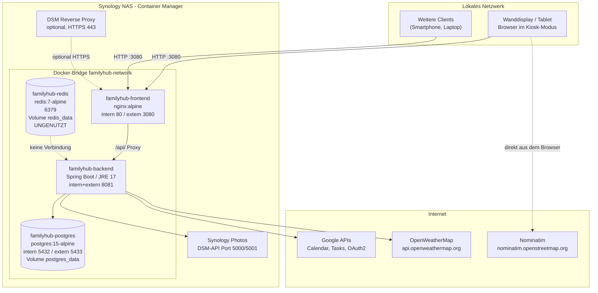

# 08 — Technologie-Stack, Konfiguration, Betrieb und Deployment

## Zweck & Geltungsbereich

Dieses Dokument beschreibt vollständig den technischen Unterbau des bestehenden FamilyHub:
Technologie-Stack mit Versionen, Laufzeittopologie der Container, sämtliche Konfigurationsebenen
(Umgebungsvariablen, `application.yml`, Laufzeit-Settings in der Datenbank, Frontend-Build-Variablen),
Build- und Entwicklungsabläufe, Deployment auf einer Synology NAS, Betriebsprozesse (Logging,
Monitoring, Backup, Update), technische Anbindung des Wetterdienstes, Datei-/Avatarablage,
Qualitätssicherung und Sicherheit im Betrieb.

Fachliche Anforderungen (Kalender, Aufgaben, Fotos, Gamification, UI) sind **nicht** Gegenstand
dieses Dokuments. Reservierte Anforderungs-Präfixe: `TA-BUILD-`, `TA-CONF-`, `TA-DEPLOY-`,
`TA-TEST-`, `TA-OPS-`.

## Inhaltsverzeichnis

1. [Technologie-Stack](#1-technologie-stack)
2. [Systemarchitektur & Laufzeittopologie](#2-systemarchitektur--laufzeittopologie)
3. [Konfiguration](#3-konfiguration)
4. [Build & lokale Entwicklung](#4-build--lokale-entwicklung)
5. [Deployment auf Synology NAS](#5-deployment-auf-synology-nas)
6. [Betrieb](#6-betrieb)
7. [Wetter-Anbindung (technisch)](#7-wetter-anbindung-technisch)
8. [Avatar- und Dateiablage](#8-avatar--und-dateiablage)
9. [Qualitätssicherung](#9-qualitätssicherung)
10. [Sicherheit im Betrieb](#10-sicherheit-im-betrieb)
11. [Bekannte Probleme im Betrieb](#11-bekannte-probleme-im-betrieb)
12. [Empfehlungen für die Neuauflage](#12-empfehlungen-für-die-neuauflage)

---

## 1. Technologie-Stack

### 1.1 Plattform-Versionen

| Komponente | Version | Quelle |
|------------|---------|--------|
| Java (Source/Target/Toolchain) | 17 | `familyhub/backend/build.gradle.kts` (`JavaVersion.VERSION_17`, `jvmToolchain(17)`) |
| JDK-Image Build-Stage | `eclipse-temurin:17-jdk-alpine` | `familyhub/backend/Dockerfile` |
| JRE-Image Runtime-Stage | `eclipse-temurin:17-jre-alpine` | `familyhub/backend/Dockerfile` |
| Kotlin | 1.9.22 (`jvm`, `plugin.spring`, `plugin.jpa`) | `familyhub/backend/build.gradle.kts` |
| Spring Boot | 3.2.2 | `familyhub/backend/build.gradle.kts` |
| Gradle Wrapper | 8.12 (`gradle-8.12-bin.zip`) | `familyhub/backend/gradle/wrapper/gradle-wrapper.properties` |
| Node.js (Build-Container) | `node:20-alpine` | `familyhub/frontend/Dockerfile` |
| Node.js (lokale Entwicklung) | nicht festgelegt — keine `.nvmrc`, kein `engines`-Feld in `package.json` | — |
| nginx (Runtime Frontend) | `nginx:alpine` (kein Version-Pin) | `familyhub/frontend/Dockerfile` |
| PostgreSQL | `postgres:15-alpine` (Produktion), `postgres:16-alpine` (Testcontainers) | `familyhub/docker-compose.yml`, `BaseIntegrationTest.kt` |
| Redis | `redis:7-alpine` — **im Code nicht genutzt**, siehe Abschnitt 2.4 | `familyhub/docker-compose.yml` |

Codeumfang zur Einordnung: Backend 84 Kotlin-Dateien / ca. 9.443 Zeilen; Frontend 178
TypeScript-/TSX-Dateien; 22 Flyway-Migrationen (`V1` … `V22`).

### 1.2 Backend-Abhängigkeiten

Deklariert in `familyhub/backend/build.gradle.kts`. Versionen ohne Angabe werden über das
Spring-Boot-BOM (`io.spring.dependency-management` 1.1.4) auf die Spring-Boot-3.2.2-Reihe gesetzt.

| Bibliothek / Plugin | Version | Zweck |
|---------------------|---------|-------|
| `org.springframework.boot` (Gradle-Plugin) | 3.2.2 | Bootstrapping, `bootJar`, `bootRun` |
| `io.spring.dependency-management` | 1.1.4 | Abhängigkeits-BOM |
| `kotlin("jvm")` | 1.9.22 | Kotlin-Compiler, `-Xjsr305=strict` |
| `kotlin("plugin.spring")` | 1.9.22 | `all-open` für Spring-Beans |
| `kotlin("plugin.jpa")` | 1.9.22 | `no-arg`-Konstruktoren für JPA-Entities |
| `jacoco` (Gradle-Core-Plugin) | Tool 0.8.12 | Testabdeckung, XML- und HTML-Report |
| `spring-boot-starter-web` | via BOM | REST-Controller, eingebetteter Tomcat |
| `spring-boot-starter-data-jpa` | via BOM | Hibernate/JPA, Repositories |
| `spring-boot-starter-validation` | via BOM | Bean Validation (Jakarta) |
| `spring-boot-starter-security` | via BOM | Security-Filterkette (Konfiguration: alles `permitAll`) |
| `spring-boot-starter-oauth2-client` | via BOM | OAuth2-Client-Infrastruktur für Google |
| `com.fasterxml.jackson.module:jackson-module-kotlin` | via BOM | JSON-(De)Serialisierung von Kotlin-Datenklassen |
| `org.flywaydb:flyway-core` | 10.6.0 | Datenbank-Migrationen |
| `org.flywaydb:flyway-database-postgresql` | 10.6.0 | PostgreSQL-Dialektunterstützung für Flyway 10 |
| `org.jetbrains.kotlin:kotlin-reflect` | 1.9.22 (via Kotlin-Plugin) | Reflection für Spring/Jackson |
| `org.apache.httpcomponents.client5:httpclient5` | 5.3 | HTTP-Client mit anpassbarem SSL-Kontext (selbstsignierte Synology-Zertifikate) |
| `com.bucket4j:bucket4j-core` | 8.7.0 | Token-Bucket-Rate-Limiting (optional aktivierbar) |
| `net.coobird:thumbnailator` | 0.4.20 | Bildskalierung/-komprimierung für Avatare |
| `org.postgresql:postgresql` | via BOM (`runtimeOnly`) | JDBC-Treiber |

Test-Abhängigkeiten:

| Bibliothek | Version | Zweck |
|------------|---------|-------|
| `spring-boot-starter-test` (ohne `org.mockito`) | via BOM | JUnit 5, AssertJ, MockMvc, Spring Test |
| `spring-security-test` | via BOM | Security-Testunterstützung |
| `io.mockk:mockk` | 1.13.9 | Mocking für Kotlin |
| `com.ninja-squad:springmockk` | 4.0.2 | `@MockkBean` für Spring-Kontexte |
| `org.testcontainers:testcontainers` | 1.19.5 | Container-basierte Integrationstests |
| `org.testcontainers:junit-jupiter` | 1.19.5 | JUnit-5-Integration für Testcontainers |
| `org.testcontainers:postgresql` | 1.19.5 | PostgreSQL-Container |
| `io.kotest:kotest-assertions-core` | 5.8.0 | Assertions im Kotest-Stil |
| `com.h2database:h2` | 2.2.224 | Deklariert für schnelle Unit-Tests; im Testprofil wird jedoch der PostgreSQL-Dialekt gesetzt |

Mockito wird bewusst aus `spring-boot-starter-test` ausgeschlossen (`exclude(group = "org.mockito")`),
um Konflikte mit MockK/SpringMockK zu vermeiden.

### 1.3 Frontend-Abhängigkeiten

Deklariert in `familyhub/frontend/package.json`. Paketname im Manifest ist `vite_react_shadcn_ts`,
Version `0.0.0`, `"type": "module"`, `"private": true`. Es existieren sowohl `package-lock.json`
als auch `bun.lockb` — der Docker-Build verwendet `npm ci`, also den npm-Lockfile.

#### Laufzeit-Abhängigkeiten (`dependencies`)

| Paket | Version | Zweck |
|-------|---------|-------|
| `react` | ^18.3.1 | UI-Bibliothek |
| `react-dom` | ^18.3.1 | DOM-Renderer |
| `react-router-dom` | ^6.30.3 | Client-seitiges Routing |
| `@tanstack/react-query` | ^5.83.0 | Server-State, Caching, Invalidierung |
| `react-hook-form` | ^7.61.1 | Formularverwaltung |
| `@hookform/resolvers` | ^3.10.0 | Schema-Anbindung für React Hook Form |
| `zod` | ^3.25.76 | Schema-Validierung |
| `date-fns` | ^3.6.0 | Datums-/Zeitberechnungen |
| `chrono-node` | ^2.9.0 | Natürlichsprachliche Datumsanalyse (Quick-Add/NLP) |
| `lucide-react` | ^0.462.0 | Icon-Set |
| `class-variance-authority` | ^0.7.1 | Varianten-API für Komponenten-Styles |
| `clsx` | ^2.1.1 | Bedingte Klassennamen |
| `tailwind-merge` | ^2.6.0 | Zusammenführen konkurrierender Tailwind-Klassen |
| `tailwindcss-animate` | ^1.0.7 | Animations-Utilities |
| `next-themes` | ^0.3.0 | Theme-Umschaltung (hell/dunkel) |
| `sonner` | ^1.7.4 | Toast-Benachrichtigungen |
| `cmdk` | ^1.1.1 | Command-Palette |
| `vaul` | ^0.9.9 | Drawer-Komponente |
| `embla-carousel-react` | ^8.6.0 | Karussell |
| `recharts` | ^2.15.4 | Diagramme (Statistiken/Leaderboard) |
| `react-day-picker` | ^8.10.1 | Datumsauswahl |
| `react-resizable-panels` | ^2.1.9 | Teilbare Layoutbereiche |
| `react-simple-keyboard` | ^3.8.154 | Bildschirmtastatur für Touch-/Kiosk-Betrieb |
| `input-otp` | ^1.4.2 | PIN-/OTP-Eingabefeld |
| `@radix-ui/react-accordion` | ^1.2.11 | Basisprimitive (shadcn/ui) |
| `@radix-ui/react-alert-dialog` | ^1.1.14 | Basisprimitive |
| `@radix-ui/react-aspect-ratio` | ^1.1.7 | Basisprimitive |
| `@radix-ui/react-avatar` | ^1.1.10 | Basisprimitive |
| `@radix-ui/react-checkbox` | ^1.3.2 | Basisprimitive |
| `@radix-ui/react-collapsible` | ^1.1.11 | Basisprimitive |
| `@radix-ui/react-context-menu` | ^2.2.15 | Basisprimitive |
| `@radix-ui/react-dialog` | ^1.1.14 | Basisprimitive |
| `@radix-ui/react-dropdown-menu` | ^2.1.15 | Basisprimitive |
| `@radix-ui/react-hover-card` | ^1.1.14 | Basisprimitive |
| `@radix-ui/react-label` | ^2.1.7 | Basisprimitive |
| `@radix-ui/react-menubar` | ^1.1.15 | Basisprimitive |
| `@radix-ui/react-navigation-menu` | ^1.2.13 | Basisprimitive |
| `@radix-ui/react-popover` | ^1.1.14 | Basisprimitive |
| `@radix-ui/react-progress` | ^1.1.7 | Basisprimitive |
| `@radix-ui/react-radio-group` | ^1.3.7 | Basisprimitive |
| `@radix-ui/react-scroll-area` | ^1.2.9 | Basisprimitive |
| `@radix-ui/react-select` | ^2.2.5 | Basisprimitive |
| `@radix-ui/react-separator` | ^1.1.7 | Basisprimitive |
| `@radix-ui/react-slider` | ^1.3.5 | Basisprimitive |
| `@radix-ui/react-slot` | ^1.2.3 | Basisprimitive |
| `@radix-ui/react-switch` | ^1.2.5 | Basisprimitive |
| `@radix-ui/react-tabs` | ^1.1.12 | Basisprimitive |
| `@radix-ui/react-toast` | ^1.2.14 | Basisprimitive |
| `@radix-ui/react-toggle` | ^1.1.9 | Basisprimitive |
| `@radix-ui/react-toggle-group` | ^1.1.10 | Basisprimitive |
| `@radix-ui/react-tooltip` | ^1.2.7 | Basisprimitive |

#### Entwicklungs-Abhängigkeiten (`devDependencies`)

| Paket | Version | Zweck |
|-------|---------|-------|
| `vite` | ^7.3.1 | Build-Tool und Dev-Server |
| `@vitejs/plugin-react-swc` | ^4.2.3 | React-Transform über SWC |
| `vite-plugin-pwa` | ^1.2.0 | Manifest- und Service-Worker-Generierung |
| `typescript` | ^5.8.3 | Typprüfung |
| `@types/node` | ^22.16.5 | Node-Typdefinitionen |
| `@types/react` | ^18.3.23 | React-Typdefinitionen |
| `@types/react-dom` | ^18.3.7 | React-DOM-Typdefinitionen |
| `tailwindcss` | ^3.4.17 | Utility-CSS-Framework |
| `@tailwindcss/typography` | ^0.5.16 | Typografie-Plugin (in `tailwind.config.ts` **nicht** eingebunden) |
| `postcss` | ^8.5.6 | CSS-Pipeline |
| `autoprefixer` | ^10.4.21 | Vendor-Prefixe |
| `eslint` | ^9.32.0 | Linting (Flat Config) |
| `@eslint/js` | ^9.32.0 | ESLint-Basisregeln |
| `typescript-eslint` | ^8.38.0 | TypeScript-Regeln |
| `eslint-plugin-react-hooks` | ^5.2.0 | Hook-Regeln |
| `eslint-plugin-react-refresh` | ^0.4.20 | Fast-Refresh-Regeln |
| `globals` | ^15.15.0 | Globale Variablen-Sets für ESLint |
| `vitest` | ^4.0.18 | Testrunner |
| `@vitest/coverage-v8` | ^4.0.18 | Coverage-Provider (V8) |
| `@vitest/ui` | ^4.0.18 | Test-UI |
| `jsdom` | ^28.0.0 | DOM-Umgebung für Tests |
| `@testing-library/react` | ^16.3.2 | Komponententests |
| `@testing-library/dom` | ^10.4.1 | DOM-Queries |
| `@testing-library/jest-dom` | ^6.9.1 | DOM-Matcher |
| `@testing-library/user-event` | ^14.6.1 | Simulation von Nutzerinteraktionen |
| `msw` | ^2.12.8 | HTTP-Mocking (Mock Service Worker) |
| `fake-indexeddb` | ^6.2.5 | IndexedDB-Ersatz in Tests |
| `lovable-tagger` | ^1.1.13 | Komponenten-Tagging, nur im Modus `development` aktiv |

Kein Prettier, kein Husky, kein `lint-staged`, keine Commit-Hooks im Repository.

### 1.4 npm-Scripts

| Script | Befehl | Zweck |
|--------|--------|-------|
| `dev` | `vite` | Dev-Server auf Port 8080 |
| `build` | `vite build` | Produktions-Build nach `dist/` |
| `build:dev` | `vite build --mode development` | Build im Entwicklungsmodus (mit `lovable-tagger`) |
| `preview` | `vite preview` | Lokale Vorschau des Produktions-Builds |
| `lint` | `eslint .` | Linting |
| `test` | `vitest` | Tests im Watch-Modus |
| `test:watch` | `vitest --watch` | Identisch zu `test` |
| `test:run` | `vitest run` | Einmaliger Testlauf |
| `test:coverage` | `vitest run --coverage` | Testlauf mit Coverage-Report |
| `test:ui` | `vitest --ui` | Vitest-Weboberfläche |

Ein Script für reine Typprüfung (`tsc --noEmit`) existiert **nicht**.

### 1.5 Gradle-Tasks (Backend)

| Task | Zweck |
|------|-------|
| `./gradlew build` | Kompilieren, Tests, Assemblieren |
| `./gradlew bootRun` | Anwendung auf Port 8081 starten |
| `./gradlew bootJar` | Ausführbares Fat-JAR nach `build/libs/` |
| `./gradlew test` | Alle Tests (JUnit Platform); löst anschließend automatisch `jacocoTestReport` aus (`finalizedBy`) |
| `./gradlew test --tests "com.familyhub.service.TaskServiceTest"` | Einzelne Testklasse |
| `./gradlew jacocoTestReport` | Coverage-Report (XML + HTML nach `build/reports/jacoco`) |
| `./gradlew jacocoTestCoverageVerification` | Schwellwertprüfung, Minimum **0.60** — wird von keinem anderen Task automatisch aufgerufen |

### 1.6 Anforderungen Build-Umgebung

| ID | Anforderung | Priorität | Ist-Zustand |
|----|-------------|-----------|-------------|
| TA-BUILD-01 | Das Backend muss mit Java 17 (LTS) übersetzt und ausgeführt werden. | MUSS | Umgesetzt |
| TA-BUILD-02 | Das Backend muss über den mitgelieferten Gradle-Wrapper (8.12) reproduzierbar baubar sein. | MUSS | Umgesetzt |
| TA-BUILD-03 | Das Frontend muss mit Node.js 20 und npm über einen Lockfile reproduzierbar baubar sein (`npm ci`). | MUSS | Umgesetzt (Docker); lokal keine Node-Version festgeschrieben |
| TA-BUILD-04 | Backend und Frontend müssen als Multi-Stage-Docker-Images ohne Build-Werkzeuge im Laufzeit-Image ausgeliefert werden. | MUSS | Umgesetzt |
| TA-BUILD-05 | Das Backend-Laufzeit-Image soll als Nicht-Root-Benutzer laufen. | SOLL | Umgesetzt (`appuser`, UID/GID 1001) |
| TA-BUILD-06 | Das Frontend-Laufzeit-Image soll als Nicht-Root-Benutzer laufen. | SOLL | Nicht umgesetzt (nginx-Standardimage, Master-Prozess als root) |
| TA-BUILD-07 | Der Build soll eine statische Typprüfung des Frontends erzwingen. | SOLL | Nicht umgesetzt (kein `tsc`-Script; `strict: false`) |
| TA-BUILD-08 | Alle Basis-Images sollen auf eine konkrete Version gepinnt sein. | SOLL | Teilweise (`nginx:alpine` ohne Versionspin) |

---

## 2. Systemarchitektur & Laufzeittopologie

### 2.1 Container

Definiert in `familyhub/docker-compose.yml`. Es gibt keine `version:`-Angabe (Compose-V2-Syntax).

| Container-Name | Image / Build | Interner Port | Veröffentlichter Port | Netzwerk | Abhängigkeit |
|----------------|---------------|---------------|-----------------------|----------|--------------|
| `familyhub-postgres` | `postgres:15-alpine` | 5432 | **5433** | `familyhub-network` | keine |
| `familyhub-redis` | `redis:7-alpine` | 6379 | **6379** | `familyhub-network` | keine |
| `familyhub-backend` | Build aus `./backend` | 8081 | **8081** | `familyhub-network` | `postgres` mit `condition: service_healthy` |
| `familyhub-frontend` | Build aus `./frontend` | 80 | **3080** | `familyhub-network` | `backend` mit `condition: service_healthy` |

Netzwerk: ein einziges Bridge-Netzwerk `familyhub-network`. Volumes: `postgres_data`
(`/var/lib/postgresql/data`) und `redis_data` (`/data`). **Für Avatare existiert kein Volume**
(siehe Abschnitt 8 und 11).

### 2.2 Healthchecks

| Container | Test | Intervall | Timeout | Start-Periode | Retries |
|-----------|------|-----------|---------|---------------|---------|
| `postgres` | `pg_isready -U familyhub -d familyhub` | 10 s | 5 s | — | 5 |
| `redis` | `redis-cli ping` | 10 s | 5 s | — | 5 |
| `backend` (Compose) | `wget --no-verbose --tries=1 --spider http://localhost:8081/api/health` | 30 s | 5 s | 60 s | 3 |
| `backend` (Dockerfile `HEALTHCHECK`) | identischer `wget`-Aufruf | 30 s | 3 s | 60 s | 3 |
| `frontend` (Compose) | `curl -f http://localhost/` | 30 s | 5 s | — | 3 |
| `frontend` (Dockerfile `HEALTHCHECK`) | `curl -f http://localhost/` | 30 s | 3 s | 5 s | 3 |

Der Healthcheck-Endpoint `GET /api/health` (`HealthController.kt`) liefert unabhängig vom
Datenbankzustand:

```json
{ "status": "UP", "timestamp": "2026-02-06T21:14:03.117Z", "service": "familyhub-backend" }
```

Spring Boot Actuator ist **nicht** eingebunden — es gibt keine `/actuator/health`-,
`/actuator/metrics`- oder `/actuator/info`-Endpunkte, keine Liveness-/Readiness-Trennung und
keine Prüfung der Datenbankverbindung im Healthcheck.

### 2.3 Request-Fluss und Reverse Proxy im Frontend-Container

`familyhub/frontend/nginx.conf` konfiguriert einen einzelnen Server-Block auf Port 80:

- `root /usr/share/nginx/html`, `index index.html`
- Gzip aktiv (`gzip_min_length 1024`, `gzip_proxied expired no-cache no-store private auth`;
  Typen: `text/plain`, `text/css`, `text/xml`, `text/javascript`, `application/x-javascript`,
  `application/xml`, `application/javascript`) — **`application/json` und `image/svg+xml` fehlen**
- SPA-Fallback: `location / { try_files $uri $uri/ /index.html; }`
- Statische Assets (`js|css|png|jpg|jpeg|gif|ico|svg|woff|woff2`): `expires 1y`,
  `Cache-Control: public, immutable`
- API-Proxy: `location /api/ { proxy_pass http://backend:8081/api/; }` mit
  `proxy_http_version 1.1`, `Upgrade`/`Connection: upgrade`, `Host`, `X-Real-IP`,
  `X-Forwarded-For`, `X-Forwarded-Proto`, `proxy_cache_bypass $http_upgrade`

Es sind **keine** Security-Header gesetzt (kein `Content-Security-Policy`, `X-Frame-Options`,
`X-Content-Type-Options`, `Referrer-Policy`, `Strict-Transport-Security`), kein HTTPS und keine
Größen-/Timeout-Begrenzung für Proxy-Requests (`client_max_body_size` bleibt beim nginx-Default
von 1 MB, was Avatar-Uploads zusätzlich begrenzt).

### 2.4 Rolle von Redis

**Redis wird von der Anwendung nicht genutzt.** Belege:

- In `familyhub/backend/build.gradle.kts` existiert keine Redis-Abhängigkeit
  (kein `spring-boot-starter-data-redis`, kein Lettuce, kein Jedis).
- In `familyhub/backend/src/main/resources/application.yml` gibt es keinen `spring.redis`- bzw.
  `spring.data.redis`-Block.
- Eine Volltextsuche über `familyhub/backend/src/main/kotlin` und `familyhub/frontend/src` nach
  „redis“, „lettuce“, „jedis“ liefert **keine** Treffer.
- Der Backend-Container erhält keine Redis-Umgebungsvariablen; `depends_on` verweist nur auf
  `postgres`.

Alle Caches sind stattdessen prozesslokal bzw. clientseitig realisiert:

| Cache | Ort | Technik | Gültigkeit |
|-------|-----|---------|------------|
| Aktuelles Wetter | Backend-Prozess | `@Volatile`-Feld in `WeatherService` | 10 Minuten |
| Wettervorhersage | Backend-Prozess | `@Volatile`-Feld in `WeatherService` | 30 Minuten |
| Synology-Session | Backend-Prozess | Feld in `SynologyPhotosService` | bis Ablauf, dann Re-Login |
| PIN-Sessions | Backend-Prozess | `ConcurrentHashMap` in `PinService` | `pin-timeout-minutes` (Default 30) |
| Rate-Limit-Buckets | Backend-Prozess | `ConcurrentHashMap` in `RateLimitFilter` | rollierend, 1 Minute |
| Foto-Auslieferung | HTTP-Client | `Cache-Control` in `SynologyPhotosController` | Foto 1 h, Thumbnail 24 h, Video 1 h |
| Fotos offline | Browser | IndexedDB `familyhub-photos` (`usePhotoCache`) | konfigurierbar über `slideshow.config.cacheTtlMinutes` |
| Reverse-Geocoding | Browser | IndexedDB `familyhub-geocoding` + In-Memory-Map | unbegrenzt |
| Theme | Browser | `localStorage`-Schlüssel `familyhub_theme` | dauerhaft |

Der Redis-Container ist damit reiner Ballast: Er belegt Arbeitsspeicher, ein Volume und
veröffentlicht Port 6379 ungeschützt im lokalen Netz.

### 2.5 Deployment-Topologie



### 2.6 Anforderungen Topologie

| ID | Anforderung | Priorität | Ist-Zustand |
|----|-------------|-----------|-------------|
| TA-DEPLOY-01 | Das System muss als Docker-Compose-Stack aus Datenbank, Backend und Frontend startbar sein. | MUSS | Umgesetzt |
| TA-DEPLOY-02 | Das Frontend muss API-Anfragen serverseitig an das Backend weiterleiten, damit der Client nur einen Port benötigt. | MUSS | Umgesetzt (nginx `location /api/`) |
| TA-DEPLOY-03 | Der Start des Backends muss auf eine gesunde Datenbank warten. | MUSS | Umgesetzt (`condition: service_healthy`) |
| TA-DEPLOY-04 | Alle Container müssen einen Healthcheck besitzen. | MUSS | Umgesetzt |
| TA-DEPLOY-05 | Container müssen nach einem Neustart des Hosts automatisch wieder starten. | MUSS | **Nicht umgesetzt** — keine `restart`-Policy in `docker-compose.yml` |
| TA-DEPLOY-06 | Persistente Anwendungsdaten müssen in Volumes liegen. | MUSS | Teilweise — nur Datenbank; Avatare liegen im Container-Dateisystem |
| TA-DEPLOY-07 | Nur die tatsächlich benötigten Ports sollen im LAN veröffentlicht werden. | SOLL | Nicht umgesetzt — 5433 (DB), 6379 (Redis), 8081 (Backend) sind zusätzlich offen |
| TA-DEPLOY-08 | Ungenutzte Infrastrukturkomponenten sollen nicht mit ausgeliefert werden. | SOLL | Nicht umgesetzt — Redis läuft ohne Verwendung |

---

## 3. Konfiguration

FamilyHub kennt vier Konfigurationsebenen. Die Rangfolge ist in Abschnitt 3.5 beschrieben.

### 3.1 Umgebungsvariablen (Backend)

Vorlage: `familyhub/.env_example`. Alle Werte in der folgenden Tabelle sind **Platzhalter**; die
reale `.env` enthält abweichende Werte, die hier bewusst nicht wiedergegeben werden.

| Variable | Zweck | Pflicht | Beispielwert | Default im Code |
|----------|-------|---------|--------------|-----------------|
| `SPRING_DATASOURCE_URL` | JDBC-URL der PostgreSQL-Datenbank | Ja (im Container gesetzt) | `jdbc:postgresql://localhost:5433/familyhub` | `jdbc:postgresql://localhost:5433/familyhub` |
| `SPRING_DATASOURCE_USERNAME` | Datenbankbenutzer | Ja | `familyhub` | `familyhub` |
| `SPRING_DATASOURCE_PASSWORD` | Datenbankpasswort | Ja | `<redacted>` | `familyhub_dev` |
| `FAMILYHUB_SETTINGS_PIN` | Fallback-PIN für den Einstellungsbereich, falls in der Datenbank kein `setup.pin` gesetzt ist (4–6 Ziffern) | Nein | `1234` | `1234` (in `application.yml`); `PinService` selbst hat Default `""` |
| `FAMILYHUB_PIN_TIMEOUT` | Gültigkeitsdauer einer PIN-Session in Minuten | Nein | `30` | `30` |
| `FAMILYHUB_ENCRYPTION_KEY` | AES-256-Schlüssel zur Verschlüsselung von OAuth-Tokens, Wetter-API-Key und Synology-Passwort (32 Zeichen empfohlen) | **Ja in Produktion** | `your-32-character-encryption-key` | `defaultKey12345678901234567890123` |
| `CREDENTIALS_ENCRYPTION_KEY` | AES-256-Schlüssel zur Verschlüsselung der Google-Client-Credentials in der Tabelle `google_credentials` | **Ja in Produktion** | `your-32-character-credentials-key` | `credentialsKey1234567890123456789` |
| `FAMILYHUB_RATE_LIMIT_ENABLED` | Aktiviert den Bucket4j-Filter | Nein | `false` | `false` |
| `FAMILYHUB_RATE_LIMIT_RPM` | Erlaubte Requests pro Minute und Client-IP | Nein | `100` | `100` |

Zusätzlich im Code ausgewertete, aber **weder in `.env_example` noch in `application.yml`**
dokumentierte Properties (nur über `-D`/`SPRING_APPLICATION_JSON`/eigene YAML setzbar):

| Property | Zweck | Default |
|----------|-------|---------|
| `familyhub.sync.enabled` | Schaltet die geplante Google-Synchronisation ab | `true` |
| `familyhub.sync.interval-ms` | Intervall der Synchronisation in Millisekunden | `900000` (15 Minuten) |
| `familyhub.sync.initial-delay-ms` | Verzögerung des ersten Sync-Laufs nach dem Start | `60000` (1 Minute) |
| `familyhub.household.max-tasks-per-day` | Obergrenze generierter Haushaltsaufgaben pro Person und Tag | `5` |
| `familyhub.avatars.storage-path` | Ablageverzeichnis für Avatare | `./data/avatars` |
| `familyhub.avatars.max-size` | Kantenlänge des skalierten Avatars in Pixeln | `200` |
| `familyhub.avatars.quality` | JPEG-Qualität (0.0–1.0) | `0.85` |
| `google.oauth2.scopes` | Kommaseparierte OAuth-Scopes | siehe Abschnitt 3.2 |

Die reale `familyhub/.env` enthält ausschließlich die folgenden Variablennamen — sie ist damit
eine **Teilmenge** von `.env_example` und definiert insbesondere `CREDENTIALS_ENCRYPTION_KEY`
nicht: `SPRING_DATASOURCE_URL`, `SPRING_DATASOURCE_USERNAME`, `SPRING_DATASOURCE_PASSWORD`,
`FAMILYHUB_SETTINGS_PIN`, `FAMILYHUB_PIN_TIMEOUT`, `FAMILYHUB_ENCRYPTION_KEY`,
`FAMILYHUB_RATE_LIMIT_ENABLED`, `FAMILYHUB_RATE_LIMIT_RPM`. Werte werden hier nicht wiedergegeben.

> **Kritischer Befund:** `familyhub/docker-compose.yml` enthält **weder eine `env_file:`-Angabe
> noch Variablen-Interpolation (`${…}`)**. Die Datei `.env` wird im Compose-Betrieb also
> vollständig ignoriert. Der Backend-Container erhält ausschließlich die drei fest
> einkompilierten Werte `SPRING_DATASOURCE_URL`, `SPRING_DATASOURCE_USERNAME` und
> `SPRING_DATASOURCE_PASSWORD` (letzteres hartkodiert als `familyhub_dev`). Konsequenz: Im
> Docker-Betrieb laufen Verschlüsselung, PIN-Fallback und Rate-Limiting **immer** mit den
> im Quellcode hinterlegten Standardwerten. Siehe Abschnitt 11.

Die Anleitung `familyhub/docs/SYNOLOGY_DEPLOYMENT.md` beschreibt zudem Variablen, die es im Code
gar nicht gibt: `DB_NAME`, `DB_USER`, `DB_PASSWORD`, `GOOGLE_CLIENT_ID`, `GOOGLE_CLIENT_SECRET`,
`GOOGLE_REDIRECT_URI`, `SETTINGS_PIN`, `PIN_TIMEOUT`, `ENCRYPTION_KEY`. Google-Credentials werden
seit dem Setup-Wizard ausschließlich in der Datenbank verwaltet. Die Anleitung ist an dieser
Stelle veraltet.

### 3.2 `application.yml` — vollständige Property-Referenz

Datei: `familyhub/backend/src/main/resources/application.yml`. Es gibt **kein** produktives
Spring-Profil; das einzige zusätzliche Profil ist `test` (Abschnitt 3.6).

| Property | Wert / Ausdruck | Bedeutung |
|----------|-----------------|-----------|
| `spring.application.name` | `familyhub-backend` | Anwendungsname für Logausgaben |
| `spring.datasource.url` | `${SPRING_DATASOURCE_URL:jdbc:postgresql://localhost:5433/familyhub}` | JDBC-URL; Default zeigt auf den Compose-Port 5433 des Hosts |
| `spring.datasource.username` | `${SPRING_DATASOURCE_USERNAME:familyhub}` | Datenbankbenutzer |
| `spring.datasource.password` | `${SPRING_DATASOURCE_PASSWORD:familyhub_dev}` | Datenbankpasswort |
| `spring.jpa.hibernate.ddl-auto` | `none` | Hibernate erzeugt kein Schema; Schemahoheit liegt vollständig bei Flyway |
| `spring.jpa.open-in-view` | `false` | Kein „Open Session in View“; Lazy-Loading nur innerhalb von `@Transactional` |
| `spring.flyway.enabled` | `true` | Migrationen laufen automatisch beim Start |
| `spring.flyway.locations` | `classpath:db/migration` | Ablageort der 22 Migrationsskripte |
| `server.port` | `8081` | HTTP-Port des Backends |
| `familyhub.security.settings-pin` | `${FAMILYHUB_SETTINGS_PIN:1234}` | Fallback-PIN, wenn `setup.pin` in der Datenbank leer ist |
| `familyhub.security.pin-timeout-minutes` | `${FAMILYHUB_PIN_TIMEOUT:30}` | Session-Gültigkeit in Minuten |
| `familyhub.security.encryption-key` | `${FAMILYHUB_ENCRYPTION_KEY:defaultKey12345678901234567890123}` | Schlüssel für `TokenEncryptionService` (AES/GCM) |
| `familyhub.security.credentials-encryption-key` | `${CREDENTIALS_ENCRYPTION_KEY:credentialsKey1234567890123456789}` | Schlüssel für `CredentialsEncryptionService` |
| `familyhub.rate-limit.enabled` | `${FAMILYHUB_RATE_LIMIT_ENABLED:false}` | Aktiviert `RateLimitConfig` (`@ConditionalOnProperty`, `matchIfMissing = false`) |
| `familyhub.rate-limit.requests-per-minute` | `${FAMILYHUB_RATE_LIMIT_RPM:100}` | Bucket-Größe je Client-IP |
| `familyhub.avatars.storage-path` | `${FAMILYHUB_AVATAR_STORAGE_PATH:./data/avatars}` | Verzeichnis der Avatardateien, relativ zum Arbeitsverzeichnis (`/app` im Container) |
| `familyhub.avatars.max-size` | `${FAMILYHUB_AVATAR_MAX_SIZE:200}` | Zielkantenlänge in Pixeln |
| `familyhub.avatars.quality` | `${FAMILYHUB_AVATAR_QUALITY:0.85}` | JPEG-Qualität |
| `logging.level.root` | `INFO` | Standard-Loglevel |
| `logging.level.com.familyhub` | `INFO` | Loglevel des Anwendungscodes |
| `logging.level.org.springframework.web` | `INFO` | Loglevel der Web-Schicht |
| `google.oauth2.scopes` | `https://www.googleapis.com/auth/calendar,https://www.googleapis.com/auth/tasks,https://www.googleapis.com/auth/userinfo.profile,https://www.googleapis.com/auth/userinfo.email` | Angeforderte OAuth-Scopes; Client-ID/-Secret/Redirect-URI kommen aus der Datenbank (Setup-Wizard) |

Die drei Umgebungsvariablen `FAMILYHUB_AVATAR_STORAGE_PATH`, `FAMILYHUB_AVATAR_MAX_SIZE` und
`FAMILYHUB_AVATAR_QUALITY` sind in `application.yml` verdrahtet, fehlen aber in `.env_example`.

Nicht konfiguriert und daher auf Spring-Defaults:
`spring.servlet.multipart.max-file-size` (**1 MB**) und `max-request-size` (**10 MB**),
Connection-Pool (HikariCP, 10 Verbindungen), `server.compression` (aus),
`spring.jackson`-Einstellungen, `spring.flyway.baseline-on-migrate` (aus).

### 3.3 Laufzeit-Einstellungen in der Datenbank

Tabelle `settings`, erzeugt in `V11__create_settings.sql` und in
`V12__refactor_settings_to_string.sql` von `JSONB` auf `TEXT` umgestellt:

```sql
CREATE TABLE settings (
  key        VARCHAR(255) PRIMARY KEY,
  value      TEXT NOT NULL,
  updated_at TIMESTAMP DEFAULT NOW()
);
```

Entity: `familyhub/backend/src/main/kotlin/com/familyhub/model/Setting.kt`.
Zugriff ausschließlich über `SettingsService` (`getSettingValue`, `updateSetting`,
`updateSettings`, `deleteSetting`, `getSettingsByPrefix`, `getSlideshowConfig`,
`updateSlideshowConfig`). **Alle Werte sind Strings** — Typkonvertierung findet erst im
Aufrufer statt, es gibt keine Schemavalidierung und keine Typspalte.

Zugehörige HTTP-Endpunkte (`SettingsController`):

| Methode | Pfad | Wirkung | Schutz |
|---------|------|---------|--------|
| `GET` | `/api/settings` | Alle Settings inkl. Werte | **kein** |
| `GET` | `/api/settings/search?prefix=…` | Settings nach Präfix | **kein** |
| `GET` | `/api/settings/{key}` | Einzelnes Setting | **kein** |
| `PUT` | `/api/settings/{key}` | Einzelnes Setting schreiben | **kein** |
| `PUT` | `/api/settings` | Mehrere Settings schreiben | **kein** |
| `DELETE` | `/api/settings/{key}` | Setting löschen | **kein** |
| `GET` | `/api/settings/slideshow` | Slideshow-Konfiguration | **kein** |
| `PUT` | `/api/settings/slideshow` | Slideshow-Konfiguration schreiben | Header `X-Settings-Session` (PIN-Session) |
| `POST` | `/api/settings/verify-pin` | PIN prüfen, Session-ID erzeugen | — |
| `POST` | `/api/settings/refresh-session` | Session verlängern | Header `X-Pin-Session` |
| `POST` | `/api/settings/logout` | Session invalidieren | Header `X-Pin-Session` |
| `GET` | `/api/settings/setup-status` | Fortschritt des Setup-Wizards | **kein** |
| `POST` | `/api/settings/set-pin` | Erst-PIN setzen (4–6 Ziffern) | nur beim Erstsetup erlaubt |
| `POST` | `/api/settings/complete-setup` | Setup als abgeschlossen markieren | **kein** |

#### Vollständige Settings-Key-Tabelle

| Key | Typ / Format | Default | Bedeutung | Gepflegt in |
|-----|--------------|---------|-----------|-------------|
| `setup.completed` | `"true"` / `"false"` | `false` (V12) | Setup-Wizard abgeschlossen | automatisch durch `POST /api/settings/set-pin` bzw. `/complete-setup`; Auswertung im Setup-Guard des Frontends |
| `setup.pin` | 4–6 Ziffern, **Klartext** | `""` (V12) | PIN für Einstellungen und Kiosk-Ausstieg | Setup-Wizard, Schritt „PIN setzen“ (`PinSetup.tsx`) |
| `setup.pin_configured` | `"true"` / `"false"` | `false` (V12) | Wurde je eine PIN gesetzt | automatisch mit `setup.pin` |
| `slideshow.config.durationSeconds` | Ganzzahl als String | kein DB-Eintrag; Code-Fallback `10` | Anzeigedauer je Foto in Sekunden | Einstellungen → Slideshow (`SlideshowSettings.tsx`) |
| `slideshow.config.transition` | `fade` \| `slide` \| `none` | `fade` (V12) | Überblendeffekt | Einstellungen → Slideshow |
| `slideshow.config.transitionDurationMs` | Ganzzahl als String | Fallback `1000` | Dauer der Überblendung in ms | Einstellungen → Slideshow |
| `slideshow.config.order` | `random` \| `chronological` | `random` (V12) | Reihenfolge der Fotos | Einstellungen → Slideshow |
| `slideshow.config.showClock` | `"true"` / `"false"` | Fallback `true` | Uhr einblenden | Einstellungen → Slideshow |
| `slideshow.config.clockPosition` | `top-left` \| `top-right` \| `bottom-left` \| `bottom-right` | Fallback `top-right` | Position der Uhr | Einstellungen → Slideshow |
| `slideshow.config.clockFormat` | `12h` \| `24h` | Fallback `24h` | Zeitformat | Einstellungen → Slideshow |
| `slideshow.config.showMetadata` | `"true"` / `"false"` | Fallback `false` | Metadaten (Ort/Datum) einblenden | Einstellungen → Slideshow |
| `slideshow.config.cacheTtlMinutes` | Ganzzahl als String | Fallback `60` | Gültigkeitsdauer des Browser-Fotocaches (IndexedDB) | Einstellungen → Slideshow; **kein Backend-Konstante, kein Migrations-Default** |
| `slideshow.config.duration_seconds` | Ganzzahl als String | `10` (V12) | **Tot** — Alt-Schreibweise, wird nie gelesen | — |
| `slideshow.config.transition_duration_ms` | Ganzzahl als String | `1000` (V12) | **Tot** | — |
| `slideshow.config.show_clock` | Boolean-String | `true` (V12) | **Tot** | — |
| `slideshow.config.clock_position` | String | `top-right` (V12) | **Tot** | — |
| `slideshow.config.clock_format` | String | `24h` (V12) | **Tot** | — |
| `slideshow.config.show_metadata` | Boolean-String | `true` (V12) | **Tot** | — |
| `slideshow.config.metadata_position` | String | `bottom` (V12) | **Tot** — ohne camelCase-Gegenstück, im Frontend gar nicht vorhanden | — |
| `badge.system_enabled` | Boolean-String | `true` (V12) | Gedacht als Schalter für das Badge-System — **wird nirgends gelesen** | keine UI |
| `task.max_per_user_per_day` | Ganzzahl als String | `5` (V12) | Gedacht als Obergrenze Haushaltsaufgaben — **wird nirgends gelesen**; wirksam ist stattdessen `familyhub.household.max-tasks-per-day` | keine UI |
| `task.generation_hour` | Ganzzahl 0–23 als String | `0` (V12) | Gedacht als Uhrzeit der Aufgabengenerierung — **wird nirgends gelesen**; wirksam ist der feste Cron `0 0 0 * * *` | keine UI |
| `selected_calendars_<memberId>` | CSV von Google-Kalender-IDs | kein Eintrag ⇒ Rückfall auf den Primärkalender | Welche Google-Kalender pro Mitglied synchronisiert werden | Setup-Wizard Schritt „Kalender auswählen“, später Einstellungen → Kalender |
| `selected_task_lists_<memberId>` | CSV von Google-Task-Listen-IDs | kein Eintrag ⇒ Rückfall auf `@default` | Welche Google-Aufgabenlisten synchronisiert werden | Setup-Wizard Schritt „Ressourcen auswählen“ |
| `calendar_sync_token_<memberId>_<hash(calendarId)>` | opaker Google-Sync-Token | keiner | Cursor für inkrementelle Kalendersynchronisation; wird bei HTTP 410 gelöscht und ein Vollsync ausgelöst | intern, keine UI |
| `google_connected` | `"true"` | keiner | Wird einmalig beim ersten OAuth-Connect gesetzt — **wird nie gelesen** | intern, keine UI |
| `weather.api_key_encrypted` | AES/GCM-verschlüsselt, Base64 | keiner | OpenWeatherMap-API-Key | Einstellungen → Wetter |
| `weather.city` | Ortsname (z. B. `Berlin,DE`) | keiner | Ort für die Wetterabfrage | Einstellungen → Wetter |
| `weather.units` | `metric` \| `imperial` | Code-Fallback `metric` | Einheitensystem | Einstellungen → Wetter |
| `weather.language` | ISO-639-Code | Code-Fallback `de` | Sprache der Wetterbeschreibungen | Einstellungen → Wetter |
| `synology.dsm_url` | Basis-URL | keiner | DSM-Adresse für Synology Photos | Einstellungen → Synology Photos |
| `synology.username` | Klartext-String | keiner | DSM-Benutzername | Einstellungen → Synology Photos |
| `synology.password_encrypted` | AES/GCM-verschlüsselt, Base64 | keiner | DSM-Passwort | Einstellungen → Synology Photos |
| `synology.api_path` | String, immer `photo/webapi` | keiner | API-Pfad — **wird geschrieben, aber nie gelesen** (Konstante im Code) | implizit beim Verbinden |
| `synology.album_id` | Ganzzahl als String | keiner | Ausgewähltes Album | Einstellungen → Synology Photos |
| `synology.album_name` | String | keiner | Anzeigename des Albums | Einstellungen → Synology Photos |
| `synology.album_passphrase` | String | keiner | Passphrase geteilter Alben; wird gelöscht, wenn das Album nicht geteilt ist | implizit bei Albumauswahl |
| `photos.selected_album_id` | Ganzzahl als String (gedacht) | keiner | **Verwaiste Leseoperation** — wird in `/api/settings/setup-status` für `hasSelectedAlbum` ausgewertet, aber von keiner Stelle geschrieben; das Flag ist daher dauerhaft `false` | — |

Von den 15 in `V12` eingefügten Zeilen sind **11 wirkungslos**. Die in `V11` angelegten Schlüssel
(`slideshow_config`, `badge_system_enabled`, `max_tasks_per_user_per_day`, `task_generation_hour`,
`setup_completed`) existieren zur Laufzeit nicht mehr, weil `V12` per `DELETE FROM settings` alle
Zeilen entfernt und neu befüllt.

Ursache des camelCase/snake_case-Bruchs: `SettingsService.updateSlideshowConfig()` stellt dem vom
Frontend gesendeten Schlüssel lediglich das Präfix `slideshow.config.` voran und speichert ihn
unverändert. Das Frontend sendet camelCase, die Migration hat snake_case angelegt. `GET
/api/settings/slideshow` liefert daher beide Varianten nebeneinander zurück; ausgewertet wird nur
camelCase.

### 3.4 Frontend-Build-Variablen (`VITE_*`)

| Variable | Zweck | Pflicht | Default |
|----------|-------|---------|---------|
| `VITE_API_BASE_URL` | Basis-URL der Backend-API. Wird zur Build-Zeit in das Bundle eingebettet. | Nein | Produktion (`import.meta.env.PROD`): `/api` (relativ, nginx-Proxy). Entwicklung: `http://localhost:8081/api` |

Auswertende Stellen: `familyhub/frontend/src/lib/api.ts`, `familyhub/frontend/src/lib/familyApi.ts`
und `familyhub/frontend/src/components/views/PhotosViewApi.tsx`. `api.ts` normalisiert den Wert:
ein abschließender Schrägstrich wird entfernt und `/api` angehängt, falls es fehlt — sowohl
`http://nas:8081` als auch `http://nas:8081/api` funktionieren. In `PhotosViewApi.tsx` wird
derselbe Wert dagegen **ohne** `/api`-Suffix als Bild-Basis-URL verwendet
(Produktions-Default dort: leerer String). Diese abweichende Semantik ist eine Inkonsistenz.

Im Repository existiert `familyhub/frontend/.env.local` mit genau einer Variable:
`VITE_API_BASE_URL` (Wert nicht wiedergegeben). Der Docker-Build kopiert diese Datei mit
`COPY . .` in den Build-Container — eine lokal gesetzte Entwickler-URL kann dadurch
**versehentlich in das Produktions-Bundle gelangen**. `.env.local` ist über `.gitignore`
(`.env.local`) von der Versionierung ausgeschlossen, aber nicht vom Docker-Build (es gibt keine
`.dockerignore`-Datei im Frontend).

Weitere Build-Einstellungen aus `familyhub/frontend/vite.config.ts`:

| Einstellung | Wert | Bedeutung |
|-------------|------|-----------|
| `server.host` | `"::"` | Dev-Server lauscht auf allen IPv4-/IPv6-Adressen |
| `server.port` | `8080` | Port des Dev-Servers |
| `resolve.alias["@"]` | `./src` | Pfad-Alias, identisch in `tsconfig*.json` und `vitest.config.ts` |
| `plugins` | `@vitejs/plugin-react-swc`, `lovable-tagger` (nur `mode === "development"`), `vite-plugin-pwa` | — |
| PWA `registerType` | `autoUpdate` | Service Worker aktualisiert sich selbst |
| PWA `includeAssets` | `favicon.ico`, `apple-touch-icon.png` | zusätzlich ausgelieferte Assets |
| PWA `workbox.globPatterns` | `[]` | **kein Precaching** |
| PWA `workbox.runtimeCaching` | `[]` | **kein Runtime-Caching — kein Offline-Betrieb** |

Erzeugtes Manifest (`dist/manifest.webmanifest`): `name` und `short_name` „FamilyHub“,
`description` „Dein digitales Familien-Dashboard“, `start_url` `/`, `scope` `/`,
`display` `standalone`, `orientation` `any`, `theme_color` `#3b82f6`,
`background_color` `#ffffff`, Icons 192×192 und 512×512 (letzteres zusätzlich als `maskable`).
Auffällig: Das Manifest enthält `"lang":"en"`, obwohl `index.html` `lang="de"` deklariert und die
Oberfläche deutsch ist.

Vorhandene PWA-Assets unter `familyhub/frontend/public/`: `favicon.ico` (818 B), `favicon.png`
(10.007 B), `icon.svg` (1.439 B), `apple-touch-icon.png` (5.730 B), `pwa-192x192.png` (5.953 B),
`pwa-512x512.png` (19.192 B), `placeholder.svg`, `robots.txt`. Ein handgeschriebenes
`manifest.json` existiert nicht — es wird ausschließlich generiert. Der Service Worker
(`dist/sw.js` samt `registerSW.js` und `workbox-*.js`) wird erzeugt, hat aber wegen der leeren
Caching-Konfiguration keine Funktion außer der Installierbarkeit der App.

### 3.5 Rangfolge und Zuständigkeit der Konfigurationsebenen

| Ebene | Wird gesetzt in | Wirkt auf | Vorrang |
|-------|-----------------|-----------|---------|
| 1. Datenbank-Settings (`settings`) | Setup-Wizard und Einstellungsbereich der Oberfläche | Wetter, Synology, Slideshow, PIN, Kalender-/Listenauswahl | **Höchster Vorrang** für die Fachkonfiguration; überschreibt für die PIN die Property |
| 2. Umgebungsvariablen | `.env` bzw. Container-`environment` | Datenbankzugang, Schlüssel, PIN-Fallback, Rate-Limit, Avatar-Ablage | Überschreibt die Defaults aus `application.yml` |
| 3. `application.yml` | Repository | Alle Backend-Properties | Liefert die Defaults, wenn keine Umgebungsvariable gesetzt ist |
| 4. `VITE_*` | Build-Zeit des Frontends | ausschließlich API-Basis-URL | Kann zur Laufzeit **nicht** geändert werden |

Konkrete Vorrangregeln:

- **PIN:** `PinService.getConfiguredPin()` liest zuerst `setup.pin` aus der Datenbank. Nur wenn
  dieser Wert leer oder nicht vorhanden ist, greift `familyhub.security.settings-pin`
  (Umgebungsvariable `FAMILYHUB_SETTINGS_PIN`, Default `1234`). Ist beides leer, gibt
  `verifyPin` immer `null` zurück und der Einstellungsbereich ist nicht erreichbar.
- **Haushaltsaufgaben pro Tag:** Wirksam ist ausschließlich die Property
  `familyhub.household.max-tasks-per-day` (Default 5). Das Datenbank-Setting
  `task.max_per_user_per_day` hat keine Wirkung.
- **Zeitpunkt der Aufgabengenerierung:** Wirksam ist der fest kodierte Cron-Ausdruck
  `0 0 0 * * *`. Das Setting `task.generation_hour` hat keine Wirkung.
- **API-Basis-URL:** `VITE_API_BASE_URL` wird beim Build eingebrannt. Eine Änderung erfordert
  einen Neubau des Frontend-Images.

### 3.6 Testprofil

`familyhub/backend/src/test/resources/application-test.yml`, aktiv über `@ActiveProfiles("test")`:

| Property | Wert |
|----------|------|
| `spring.jpa.show-sql` | `false` |
| `spring.jpa.properties.hibernate.dialect` | `org.hibernate.dialect.PostgreSQLDialect` |
| `spring.flyway.enabled` | `false` (Schema kommt aus `ddl-auto: create-drop`) |
| `spring.security.oauth2.client.registration.google.client-id` | `test-client-id` |
| `spring.security.oauth2.client.registration.google.client-secret` | `test-client-secret` |
| `familyhub.security.encryption-key` | `test-encryption-key-32-bytes!!` |
| `familyhub.security.settings-pin` | `"1234"` |
| `familyhub.security.pin-timeout-minutes` | `30` |
| `familyhub.household.max-tasks-per-day` | `5` |
| `familyhub.avatars.storage-path` | `${java.io.tmpdir}/familyhub-test-avatars` |
| `familyhub.avatars.max-size` | `200` |
| `familyhub.avatars.quality` | `0.85` |
| `logging.level.com.familyhub` | `DEBUG` |
| `logging.level.org.springframework.security` | `DEBUG` |

Da Flyway im Testprofil abgeschaltet ist und das Schema per Hibernate erzeugt wird, werden die
Migrationsskripte **durch die automatisierten Tests nicht verifiziert**.

### 3.7 Anforderungen Konfiguration

| ID | Anforderung | Priorität | Ist-Zustand |
|----|-------------|-----------|-------------|
| TA-CONF-01 | Alle Geheimnisse müssen über Umgebungsvariablen konfigurierbar sein und dürfen keine funktionsfähigen Defaults besitzen. | MUSS | Teilweise — konfigurierbar, aber mit funktionsfähigen Default-Schlüsseln |
| TA-CONF-02 | Die im Container gesetzten Umgebungsvariablen müssen aus einer versionierten, geheimnisfreien Vorlage ableitbar sein. | MUSS | Teilweise — `.env_example` vorhanden, wird von Compose aber nicht eingelesen |
| TA-CONF-03 | Das Deployment muss die `.env`-Datei tatsächlich in die Container übernehmen. | MUSS | **Nicht umgesetzt** — für die Neuauflage ausdrücklich als zu behebender Defekt bestätigt |
| TA-CONF-03a | Jeder Dienst in der Compose-Datei, der Konfiguration benötigt, muss die `.env` über `env_file` oder explizite Interpolation einbinden. | MUSS | Nicht umgesetzt |
| TA-CONF-03b | Nach dem Start muss überprüfbar sein, welche Konfigurationswerte tatsächlich wirksam sind (z. B. Logausgabe der aktiven, geheimnisfreien Konfiguration). | SOLL | Nicht umgesetzt — der Defekt blieb dadurch unbemerkt |
| TA-CONF-03c | Erkennt die Anwendung beim Start einen Default-Verschlüsselungsschlüssel, muss sie den Start abbrechen oder unübersehbar warnen. | MUSS | Nicht umgesetzt |
| TA-CONF-04 | Fachliche Laufzeit-Einstellungen müssen ohne Neustart über die Oberfläche änderbar sein. | MUSS | Umgesetzt (Tabelle `settings`) |
| TA-CONF-05 | Laufzeit-Einstellungen sollen typisiert und validiert gespeichert werden. | SOLL | Nicht umgesetzt — alle Werte sind untypisierte Strings ohne Validierung |
| TA-CONF-06 | Schreibende Zugriffe auf Einstellungen müssen authentifiziert sein. | MUSS | **Nicht umgesetzt** — nur `PUT /api/settings/slideshow` prüft eine Session |
| TA-CONF-07 | Die Datenbank darf keine ungenutzten oder widersprüchlichen Einstellungsschlüssel enthalten. | SOLL | Nicht umgesetzt — 11 von 15 Migrations-Schlüsseln sind wirkungslos |
| TA-CONF-08 | Die Betriebsdokumentation muss mit den tatsächlich ausgewerteten Variablen übereinstimmen. | MUSS | Nicht umgesetzt — `SYNOLOGY_DEPLOYMENT.md` nennt neun nicht existierende Variablen |

---

## 4. Build & lokale Entwicklung

### 4.1 Voraussetzungen

| Werkzeug | Version | Anmerkung |
|----------|---------|-----------|
| JDK | 17 | zwingend; `build.gradle.kts` setzt eine Toolchain auf 17 |
| Node.js | 20 empfohlen | im Repository nicht erzwungen |
| npm | passend zu Node 20 | `package-lock.json` ist maßgeblich |
| Docker / Docker Compose | aktuell | für Datenbank und Integrationstests |
| Freie Ports | 5433, 6379, 8080, 8081 | 3080 zusätzlich im vollen Compose-Betrieb |

### 4.2 Datenbank starten

```bash
cd familyhub
docker-compose up -d postgres redis     # Redis ist funktional entbehrlich
```

PostgreSQL ist danach unter `localhost:5433` erreichbar (Datenbank `familyhub`, Benutzer
`familyhub`, Passwort aus `docker-compose.yml`). Genau diese Adresse ist der Default in
`application.yml`, sodass das Backend ohne weitere Konfiguration startet.

### 4.3 Backend bauen und starten

```bash
cd familyhub/backend

./gradlew build                 # kompilieren + testen + assemblieren
./gradlew bootRun               # startet auf http://localhost:8081

./gradlew test                  # nur Tests (löst jacocoTestReport automatisch aus)
./gradlew test jacocoTestReport # Tests mit Coverage-Report
./gradlew test --tests "com.familyhub.service.TaskServiceTest"   # einzelne Klasse
./gradlew bootJar               # Fat-JAR nach build/libs/
```

Beim Start führt Flyway automatisch alle 22 Migrationen aus `src/main/resources/db/migration`
aus. Hibernate erzeugt kein Schema (`ddl-auto: none`). Der `HouseholdTaskScheduler` erzeugt
fünf Sekunden nach dem Start einmalig die Haushaltsaufgaben des aktuellen Tages, der
`SyncScheduler` startet 60 Sekunden nach dem Start den ersten Google-Sync.

Verifikation:

```bash
curl http://localhost:8081/api/health
# {"status":"UP","timestamp":"…","service":"familyhub-backend"}
```

### 4.4 Frontend bauen und starten

```bash
cd familyhub/frontend

npm install            # oder npm ci für einen reproduzierbaren Stand
npm run dev            # http://localhost:8080

npm run lint           # ESLint
npm run test:run       # Tests einmalig
npm run test:coverage  # Tests mit Coverage-Report nach coverage/
npm run test:ui        # Vitest-Oberfläche
npm run build          # Produktions-Build nach dist/
npm run preview        # Vorschau des Produktions-Builds
```

Im Entwicklungsmodus spricht das Frontend das Backend direkt unter
`http://localhost:8081/api` an (kein Vite-Proxy konfiguriert). Cross-Origin-Anfragen sind
möglich, weil `CorsConfig` für `/api/**` alle Origin-Muster erlaubt.

Ein einzelner Test wird ohne npm-Script ausgeführt:

```bash
npx vitest run src/services/common/__tests__/DateService.test.ts
```

### 4.5 Vollständiger Stack lokal

```bash
cd familyhub
docker-compose up -d --build      # Erststart inkl. Image-Build
docker-compose ps                 # Status
docker-compose logs -f            # Logs aller Container
docker-compose down               # stoppen (Volumes bleiben erhalten)
```

Danach: Oberfläche unter `http://localhost:3080`, Backend direkt unter
`http://localhost:8081/api/health`.

Der Backend-Image-Build lädt in einer eigenen Layer zunächst die Gradle-Abhängigkeiten
(`./gradlew dependencies --no-daemon`) und baut anschließend mit `./gradlew bootJar --no-daemon
-x test` — **die Tests laufen im Image-Build bewusst nicht mit**. Der Frontend-Build führt
`npm ci` und `npm run build` aus; auch hier laufen keine Tests und kein Lint.

### 4.6 Build-Ergebnis Frontend

Der eingecheckte Produktions-Build unter `familyhub/frontend/dist/` umfasst 952 KB:

| Datei | Größe |
|-------|-------|
| `assets/index-*.js` | 778.047 Bytes (unkomprimiert, ein einziges Bundle) |
| `assets/index-*.css` | 96.503 Bytes |
| `sw.js`, `registerSW.js`, `workbox-*.js` | Service-Worker-Gerüst ohne Caching-Regeln |
| `manifest.webmanifest`, Icons, `robots.txt` | statische Assets |

Es findet **kein Code-Splitting** statt (keine `manualChunks`-Konfiguration, kein
Route-Level-Lazy-Loading in der Vite-Konfiguration). Für ein dauerhaft geöffnetes Wanddisplay
ist das vertretbar, für den Erstaufruf auf schwachen Geräten nicht optimal.

### 4.7 Anforderungen Entwicklung

| ID | Anforderung | Priorität | Ist-Zustand |
|----|-------------|-----------|-------------|
| TA-BUILD-09 | Ein Entwickler muss Backend und Frontend mit maximal je drei Befehlen lokal starten können. | MUSS | Umgesetzt |
| TA-BUILD-10 | Die Datenbank muss lokal per Container bereitstellbar sein. | MUSS | Umgesetzt |
| TA-BUILD-11 | Der Image-Build soll Tests und Linting ausführen oder von einer vorgelagerten Prüfung abhängig sein. | SOLL | Nicht umgesetzt — Tests werden im Build übersprungen, keine CI |
| TA-BUILD-12 | Der Frontend-Build soll das Bundle in mehrere Chunks aufteilen. | KANN | Nicht umgesetzt |

---

## 5. Deployment auf Synology NAS

Grundlage: `familyhub/docs/SYNOLOGY_DEPLOYMENT.md` und `familyhub/docker-compose.yml`.

> **Vorgabe für die Neuauflage – Ablage der Installationsanleitung:**
> Die Deployment-Dokumentation des Altsystems ist über mehrere Dateien in zwei
> Verzeichnissen verstreut (`docs/SYNOLOGY_DEPLOYMENT.md`, `docs/BACKUP.md`, `docs/UPDATE.md`,
> `docs/GOOGLE_SETUP.md`) und weicht inhaltlich vom tatsächlichen Verhalten ab – sie nennt
> unter anderem neun Umgebungsvariablen, die es nicht gibt.
>
> In der Neuauflage gilt: Es gibt **genau eine** `INSTALLATION.md` im Wurzelverzeichnis des
> Repositories, die sämtliche Anleitungen zum Deployment auf der NAS enthält. Die `README.md`
> beschreibt nur kurz das Produkt und **verweist für die Installation ausdrücklich auf die
> `INSTALLATION.md`**; sie enthält selbst keine Installationsschritte, damit beide Dateien
> nicht auseinanderlaufen können. Der verbindliche Mindestinhalt steht in Abschnitt 5.10
> (`TA-DEPLOY-14` bis `TA-DEPLOY-18`).

### 5.1 Voraussetzungen

| Kategorie | Anforderung |
|-----------|-------------|
| DSM | Version 7.0 oder höher |
| Arbeitsspeicher | mindestens 2 GB frei |
| Speicherplatz | mindestens 1 GB frei |
| Pakete | **Container Manager** (Docker); **Synology Photos** für die Fotoanzeige |
| Zugang | SSH empfohlen (DSM → Systemsteuerung → Terminal & SNMP → SSH aktivieren) |

### 5.2 Vorbereitung Synology Photos

1. DSM → Systemsteuerung → Benutzer & Gruppe → **Erstellen**: Benutzer `familyhub`,
   sicheres Passwort, Gruppe ausschließlich `users` (**keine Administratorrechte**), kein
   Zugriff auf gemeinsame Ordner.
2. In Synology Photos ein **geteiltes Album** mit den anzuzeigenden Fotos anlegen und mit
   `familyhub` teilen — Berechtigung **„Nur ansehen“**.
3. Album-ID aus der URL ablesen, z. B. `…#/album/3` → Album-ID `3`.

### 5.3 Vorbereitung Google Cloud

1. Projekt in der Google Cloud Console anlegen (z. B. `FamilyHub`).
2. APIs aktivieren: **Google Calendar API**, **Google Tasks API**.
3. OAuth-Zustimmungsbildschirm konfigurieren, User Type **Extern**, Scopes `openid`, `email`,
   `profile`, `https://www.googleapis.com/auth/calendar`,
   `https://www.googleapis.com/auth/tasks`; die eigenen E-Mail-Adressen als Testnutzer eintragen.
4. OAuth-2.0-Client-ID vom Typ **Webanwendung** erstellen. Autorisierte Weiterleitungs-URIs
   gemäß Anleitung:
   `http://NAS-IP:8080/api/auth/google/callback` und
   `http://familyhub.local:8080/api/auth/google/callback`.
   **Hinweis:** Der dort genannte Port 8080 ist der Vite-Dev-Port. Im Compose-Betrieb ist die
   Oberfläche unter Port **3080** erreichbar; die Redirect-URI muss zum tatsächlich genutzten
   Zugangspunkt passen. Die Anleitung ist an dieser Stelle inkonsistent.
5. Client-ID und Client-Secret notieren — sie werden **nicht** in eine Datei eingetragen,
   sondern später im Setup-Wizard der Oberfläche erfasst und verschlüsselt in der Tabelle
   `google_credentials` abgelegt.

### 5.4 Installation

```bash
ssh admin@NAS-IP
cd /volume1/docker
git clone <repository-url> familyhub
cd familyhub
cp .env_example .env
vi .env                      # Werte anpassen
docker-compose up -d --build
```

Alternativ ohne SSH über die File Station: Repository als ZIP herunterladen, Ordner
`/docker/familyhub` anlegen, Dateien entpacken und den Stack im Container Manager als
Projekt anlegen.

> **Wichtig:** Wie in Abschnitt 3.1 beschrieben, wertet `docker-compose.yml` die Datei `.env`
> nicht aus. Ohne eine Anpassung der Compose-Datei (Ergänzung von `env_file: .env` oder
> Variablen-Interpolation) bleibt das Bearbeiten der `.env` **wirkungslos**.

### 5.5 Statusprüfung

```bash
docker-compose ps
docker-compose logs -f

curl http://localhost:3080/                 # Frontend
curl http://localhost:8081/api/health       # Backend
# erwartete Ausgabe: {"status":"UP","timestamp":"…","service":"familyhub-backend"}
```

### 5.6 Portfreigaben

| Port (Host) | Dienst | Notwendig für | Empfehlung |
|-------------|--------|---------------|------------|
| 3080 | Frontend (nginx) | Zugriff der Anzeigegeräte | erforderlich |
| 8081 | Backend direkt | Diagnose, OAuth-Callback wenn direkt adressiert | auf das LAN beschränken |
| 5433 | PostgreSQL | Wartung / Backup vom Host | sollte nicht veröffentlicht werden |
| 6379 | Redis | nichts (ungenutzt) | Veröffentlichung entfernen |
| 5000/5001 | DSM / Synology Photos | Zugriff des Backends auf die Photos-API | NAS-intern |

Es ist keine Firewall-Regel und keine Bindung an eine bestimmte Host-Adresse konfiguriert; alle
veröffentlichten Ports lauschen auf allen Schnittstellen der NAS.

### 5.7 Reverse Proxy und HTTPS

Beschrieben in `SYNOLOGY_DEPLOYMENT.md` als optionaler Schritt über den DSM-Anwendungsportal:

1. DSM → Systemsteuerung → **Anwendungsportal** → Reverse Proxy → **Erstellen**
2. Beschreibung: `FamilyHub`
3. Quelle: Protokoll **HTTPS**, Hostname `familyhub.deine-domain.de`, Port **443**
4. Ziel: Protokoll **HTTP**, Hostname `localhost`, Port **3080**
5. HTTPS-Zertifikat über **Let's Encrypt** in DSM einrichten

QuickConnect wird ausdrücklich **nicht** empfohlen, weil die OAuth-Callbacks damit
problematisch sind.

Der Stack selbst terminiert kein TLS: Der nginx im Frontend-Container lauscht ausschließlich
auf Port 80 ohne Zertifikat. HTTPS ist also nur über den vorgelagerten DSM-Reverse-Proxy
möglich, und die Verbindung zwischen Reverse Proxy und Container bleibt unverschlüsselt.

### 5.8 Autostart

`docker-compose.yml` enthält für **keinen** Container eine `restart`-Policy. Der Docker-Default
ist `no`, das heißt: Nach einem Neustart der NAS oder nach einem Absturz eines Containers
startet FamilyHub **nicht** automatisch wieder. Im Container Manager muss der Stack manuell
gestartet werden, oder es ist je Dienst `restart: unless-stopped` zu ergänzen.

### 5.9 Troubleshooting (aus der Betriebsdokumentation)

| Symptom | Vorgehen |
|---------|----------|
| Container startet nicht | `docker-compose logs backend`, `docker-compose logs postgres`, anschließend `docker-compose restart` |
| Datenbank-Verbindungsfehler | `docker exec -it familyhub-postgres psql -U familyhub -d familyhub`, danach `\dt` zur Tabellenprüfung |
| OAuth-Callback schlägt fehl | Redirect-URI in der Google Cloud Console muss **exakt** mit der konfigurierten übereinstimmen; Erreichbarkeit des Ports prüfen |
| Synology-Photos-Verbindung fehlgeschlagen | Existenz des Benutzers `familyhub` und die Albumfreigabe prüfen; Anmeldung testen über `.../photo/webapi/auth.cgi?api=SYNO.API.Auth&version=3&method=login&account=familyhub&passwd=<redacted>` |
| Port bereits belegt | `netstat -tlnp \| grep 3080` bzw. `grep 8081`; alternativen Port in `docker-compose.yml` eintragen |

### 5.10 Anforderungen Deployment

| ID | Anforderung | Priorität | Ist-Zustand |
|----|-------------|-----------|-------------|
| TA-DEPLOY-09 | Das System muss auf einer Synology NAS mit DSM 7.0+ über den Container Manager betreibbar sein. | MUSS | Umgesetzt |
| TA-DEPLOY-10 | Die Installation muss ohne manuelle Codeänderungen auskommen. | MUSS | Teilweise — die Compose-Datei muss für `.env` und Autostart angepasst werden |
| TA-DEPLOY-11 | Der Zugriff über HTTPS muss möglich sein. | SOLL | Teilweise — nur über DSM-Reverse-Proxy, nicht im Stack selbst |
| TA-DEPLOY-12 | Nach einem Neustart der NAS müssen alle Dienste selbsttätig hochfahren. | MUSS | **Nicht umgesetzt** |
| TA-DEPLOY-13 | Für Synology Photos soll ein Benutzer mit minimalen Rechten verwendet werden. | SOLL | Umgesetzt (dokumentiert) |
| TA-DEPLOY-14 | Das Repository muss im Wurzelverzeichnis eine `INSTALLATION.md` enthalten, die sämtliche Anleitungen zum Deployment auf der Synology NAS bündelt. | MUSS | **Nicht umgesetzt** — im Altsystem auf vier Dateien in zwei Verzeichnissen verteilt |
| TA-DEPLOY-15 | Die `README.md` muss an sichtbarer Stelle auf die `INSTALLATION.md` verweisen und selbst keine konkurrierenden Installationsschritte enthalten. | MUSS | Nicht umgesetzt |
| TA-DEPLOY-16 | Die `INSTALLATION.md` muss mindestens abdecken: Voraussetzungen (DSM-Version, Pakete, Ressourcen), Vorbereitung von Synology Photos, Einrichtung des Google-Cloud-Projekts, Bezug bzw. Bau der Images, Anlegen und Befüllen der `.env`, Start über den Container Manager, Anlegen der Volumes (inklusive Avatar-Ablage), Portfreigaben, Reverse Proxy und HTTPS, Autostart nach Neustart der NAS, Statusprüfung, Ersteinrichtung im Browser, Backup, Restore, Update und Fehlerbehebung. | MUSS | Nicht umgesetzt |
| TA-DEPLOY-17 | Die `INSTALLATION.md` darf ausschließlich Konfigurationsschlüssel nennen, die von der Anwendung tatsächlich ausgewertet werden; die Übereinstimmung ist bei jeder Änderung zu prüfen. | MUSS | **Nicht umgesetzt** — die Altdokumentation nennt neun nicht existierende Variablen |
| TA-DEPLOY-18 | Die `INSTALLATION.md` muss von einer Person ohne Kenntnis des Quellcodes einmal vollständig durchlaufen worden sein, bevor eine Version als freigegeben gilt. | SOLL | Nicht umgesetzt |

---

## 6. Betrieb

### 6.1 Logging

| Aspekt | Ist-Zustand |
|--------|-------------|
| Framework | SLF4J über Logback (Spring-Boot-Standard); Logger je Klasse via `LoggerFactory.getLogger(...)` |
| Konfiguration | Ausschließlich `logging.level.*` in `application.yml`; **keine** `logback-spring.xml`, kein `logback.xml` |
| Format | Spring-Boot-Standard-Pattern, unstrukturierter Klartext (kein JSON) |
| Level | `root: INFO`, `com.familyhub: INFO`, `org.springframework.web: INFO`; im Testprofil `com.familyhub: DEBUG`, `org.springframework.security: DEBUG` |
| Ziel | ausschließlich `STDOUT` → Docker-Logging-Treiber (Default `json-file`) |
| Rotation / Größenbegrenzung | **nicht konfiguriert** — weder `logging.file.*` noch `logging:`-Optionen im Compose; die Log-Dateien wachsen unbegrenzt |
| Korrelations-IDs | nicht vorhanden (kein MDC), siehe `technical-issues.md` Punkt 14 |
| Zugriffs-Logs Frontend | nginx-Standard-Access-Log nach `stdout`/`stderr` |

Systematisch geloggte Ereignisse (Auswahl):

| Ereignis | Level | Quelle |
|----------|-------|--------|
| Start und Ergebnis eines geplanten Syncs (erstellt/aktualisiert/gelöscht je Kalender und Aufgabenliste, Erfolgs- und Fehlerzähler) | INFO | `SyncScheduler` |
| Sync deaktiviert / keine Mitglieder mit Google-Konto | DEBUG / INFO | `SyncScheduler` |
| Tägliche Generierung von Haushaltsaufgaben, Startup-Nachholung, Zurücksetzen der Zähler | INFO, bei Fehler ERROR | `HouseholdTaskScheduler` |
| Fehlerhafte Einzelereignisse beim Kalendersync | ERROR | `CalendarSyncService` |
| Wetterkonfiguration gespeichert/gelöscht, fehlgeschlagene API-Validierung | INFO / ERROR | `WeatherService` |
| Avatar gespeichert/gelöscht, Verzeichnis angelegt, Bildverarbeitung fehlgeschlagen | INFO / ERROR | `AvatarService` |
| Jede nicht behandelte Ausnahme | ERROR mit Stacktrace | `GlobalExceptionHandler.handleGeneric` |

Die einheitliche Fehlerantwort des Backends lautet:

```json
{
  "status": 404,
  "error": "Not Found",
  "message": "Setting not found: weather.city",
  "timestamp": "2026-02-06T21:14:03.117Z"
}
```

Abbildung der Ausnahmen auf Statuscodes (`GlobalExceptionHandler`):

| Ausnahme | Status | `error`-Feld |
|----------|--------|--------------|
| `ResourceNotFoundException` | 404 | `Not Found` |
| `BadRequestException` | 400 | `Bad Request` |
| `UnauthorizedException` | 401 | `Unauthorized` |
| `ConflictException` | 409 | `Conflict` |
| `SynologyAuthException` | 401 | `synology_auth_expired` |
| `GoogleApiException` (401/403) | 401 | `Google API Error` |
| `GoogleApiException` (404) | 404 | `Google API Error` |
| `GoogleApiException` (sonst) | 502 | `Google API Error` |
| alle übrigen `Exception` | 500 | `Internal Server Error` |

> **Sicherheitsrelevant:** Der generische Handler gibt `ex.message` unverändert an den Client
> zurück. Interne Details (SQL-Fragmente, Dateipfade, Bibliotheksmeldungen) können dadurch nach
> außen gelangen.

Bei aktiviertem Rate-Limiting antwortet der Filter mit HTTP **429** und dem Rumpf
`{"status":429,"error":"Too Many Requests","message":"Rate limit exceeded. Please try again later."}`.
Gesetzte Header: `X-Rate-Limit-Limit`, `X-Rate-Limit-Remaining` und im Ablehnungsfall
`X-Rate-Limit-Retry-After` (Sekunden). Die Client-Identifikation erfolgt über den ersten Eintrag
in `X-Forwarded-For`, sonst über `request.remoteAddr`. `/api/health` ist vom Rate-Limiting
ausgenommen.

### 6.2 Monitoring und Healthchecks

- Einziger Überwachungspunkt ist `GET /api/health`. Er prüft **nicht** die Datenbank und liefert
  auch dann `UP`, wenn keine Verbindung zu PostgreSQL besteht.
- Docker-Healthchecks überwachen alle vier Container (Intervalle siehe Abschnitt 2.2).
- Es gibt **keine** Metriken (kein Actuator, kein Micrometer, kein Prometheus-Endpunkt), **keine**
  Alarmierung und **keine** aggregierte Logauswertung.
- Nach einem Update wird der Erfolg laut `UPDATE.md` manuell geprüft: `curl` gegen
  `http://localhost:8081/api/health` (Erwartung: Rumpf enthält `UP`) und gegen
  `http://localhost:3080/` (Erwartung: HTTP 200).

### 6.3 Zeitgesteuerte Aufgaben

Aktiviert über `@EnableScheduling` in `FamilyHubApplication.kt`. Es gibt **keinen** dedizierten
Scheduler-Thread-Pool; alle Aufgaben laufen im Standard-Single-Thread-Scheduler.

| Aufgabe | Auslöser | Klasse | Wirkung |
|---------|----------|--------|---------|
| `syncAll` | `fixedRate` 900.000 ms (15 min), `initialDelay` 60.000 ms | `SyncScheduler` | Synchronisiert Kalender und Aufgaben aller aktiven Mitglieder mit Google-Verbindung; überspringbar über `familyhub.sync.enabled=false` |
| `generateDailyTasks` | Cron `0 0 0 * * *` (täglich 00:00) | `HouseholdTaskScheduler` | Erzeugt die Haushaltsaufgaben des Tages |
| `generateOnStartup` | `initialDelay` 5.000 ms, `fixedDelay` `Long.MAX_VALUE` (also genau einmal) | `HouseholdTaskScheduler` | Holt versäumte Generierungen nach dem Start nach |
| `resetDailyCounters` | Cron `0 1 0 * * *` (täglich 00:01) | `HouseholdTaskScheduler` | Setzt Tageszähler der Statistik zurück |
| `resetWeeklyCounters` | Cron `0 2 0 * * MON` (montags 00:02) | `HouseholdTaskScheduler` | Setzt Wochenzähler zurück |
| `resetMonthlyCounters` | Cron `0 3 0 1 * *` (am 1. des Monats 00:03) | `HouseholdTaskScheduler` | Setzt Monatszähler zurück |

Alle Cron-Ausdrücke laufen in der Zeitzone der JVM. Diese ist weder in `application.yml` noch in
`docker-compose.yml` gesetzt (`TZ` fehlt), sodass im Container **UTC** gilt — die „Mitternachts“-
Läufe finden in Mitteleuropa also um 01:00 bzw. 02:00 Ortszeit statt.

### 6.4 Backup

Grundlage: `familyhub/docs/BACKUP.md`.

| Datenbestand | Ort | Kritikalität | Im Backup-Skript enthalten |
|--------------|-----|--------------|----------------------------|
| PostgreSQL-Datenbank (inkl. aller Settings, Tokens, Credentials) | Docker-Volume `postgres_data` | kritisch | ja |
| Konfiguration `.env` | `/volume1/docker/familyhub/.env` | kritisch | ja |
| `docker-compose.yml` | Projektverzeichnis | mittel | ja |
| **Avatare** (`/app/data/avatars` im Backend-Container) | Container-Dateisystem | mittel | **nein — nicht gesichert und nicht persistent** |
| Logs | Docker-Volume | optional | nein |

Fotos werden nicht lokal gespeichert, sondern zur Anzeigezeit von Synology Photos geladen; sie
sind daher nicht Bestandteil des Backups.

Das dokumentierte Skript `scripts/backup.sh` (im Repository **nicht** enthalten, es muss laut
Anleitung angelegt werden) arbeitet wie folgt:

- Zielverzeichnis `/volume1/backups/familyhub`, Zeitstempel `%Y%m%d_%H%M%S`, Aufbewahrung
  `KEEP_DAYS=7`
- Datenbank: `docker exec familyhub-postgres pg_dump -U familyhub familyhub | gzip > db_$DATE.sql.gz`
- Konfiguration: `.env` → `env_$DATE.backup`, `docker-compose.yml` → `docker-compose_$DATE.yml`
- Aufräumen: `find … -mtime +7 -delete` für alle drei Dateimuster
- Ausführung geplant über DSM → Systemsteuerung → **Aufgabenplaner** → benutzerdefiniertes
  Skript als Benutzer `root`, täglich **03:00 Uhr**, alternativ per Crontab
  `0 3 * * * /volume1/docker/familyhub/scripts/backup.sh >> /var/log/familyhub-backup.log 2>&1`
- Optionale Auslagerung über **Cloud Sync** (nur hochladen) oder **Hyper Backup**

Das Backup ist ein **logischer Dump ohne Konsistenzfenster** — die Container laufen währenddessen
weiter. Das ist für `pg_dump` unkritisch, erfasst aber nicht die Avatardateien.

### 6.5 Restore

```bash
# Vollständige Wiederherstellung
cd /volume1/docker/familyhub
docker-compose down
gunzip < /volume1/backups/familyhub/db_DATUM.sql.gz | \
  docker-compose exec -T postgres psql -U familyhub familyhub
cp /volume1/backups/familyhub/env_DATUM.backup .env
docker-compose up -d

# Nur Datenbank (Container läuft)
gunzip < /volume1/backups/familyhub/db_DATUM.sql.gz | \
  docker exec -i familyhub-postgres psql -U familyhub familyhub

# Datenbank vollständig neu aufbauen (ACHTUNG: Datenverlust)
docker-compose down
docker volume rm familyhub_postgres_data
docker-compose up -d
sleep 30
gunzip < /volume1/backups/familyhub/db_DATUM.sql.gz | \
  docker exec -i familyhub-postgres psql -U familyhub familyhub
```

Der erste Befehl der vollständigen Wiederherstellung ist in der Anleitung fehlerhaft: Nach
`docker-compose down` läuft kein Postgres-Container mehr, sodass `docker-compose exec -T postgres`
scheitert. Praktisch funktioniert nur die zweite Variante mit laufendem Container.

**Entscheidend:** Ein Restore der Datenbank ist nur dann verwertbar, wenn derselbe
`FAMILYHUB_ENCRYPTION_KEY` und derselbe `CREDENTIALS_ENCRYPTION_KEY` verwendet werden wie zum
Zeitpunkt der Sicherung. Andernfalls lassen sich OAuth-Tokens, Google-Client-Secrets, der
Wetter-API-Key und das Synology-Passwort nicht mehr entschlüsseln und müssen komplett neu
eingerichtet werden. Die Schlüssel gehören daher zwingend mit ins Backup — und getrennt davon
gesichert.

### 6.6 Update-Prozess

Grundlage: `familyhub/docs/UPDATE.md`. Das dokumentierte Skript `scripts/update.sh` (ebenfalls
nicht im Repository enthalten) durchläuft sechs Schritte:

1. Aktuelle Version aus einer Datei `VERSION` lesen — **eine solche Datei existiert im Repository
   nicht**, das Skript meldet dann `unknown`.
2. `git fetch origin main`; bei identischem Commit Abbruch mit Erfolgsmeldung.
3. Backup erstellen (überspringbar mit `--no-backup`; Fallback auf ein inline erzeugtes
   `db_pre_update_$DATE.sql.gz` plus `env_pre_update_$DATE.backup`).
4. `docker-compose down`.
5. `git pull origin main`.
6. `docker-compose up -d --build`, danach 30 Sekunden warten und Health-Checks gegen
   `http://localhost:8081/api/health` und `http://localhost:3080/` ausführen.

Weitere Optionen: `--force`, `--help`. Manuelles Update ohne Skript: Backup → `docker-compose down`
→ `git pull origin main` → `docker-compose up -d --build` → `docker-compose ps` / `logs -f`.

Rollback laut Anleitung: `docker-compose down`, `git checkout <COMMIT_HASH>`,
`docker-compose up -d --build`, anschließend das Vor-Update-Backup einspielen. Ein Rollback der
Datenbank ist damit nur über den Dump möglich — Flyway kennt keine Down-Migrationen.

Optional beschrieben, aber ausdrücklich **nicht empfohlen**: automatische Updates per Cron
(`0 4 * * 0`) oder per Watchtower-Container (`WATCHTOWER_SCHEDULE=0 0 4 * * *`), wobei Watchtower
nur Images und keine Git-Änderungen überwacht.

Es gibt weder eine Versionsdatei noch ein `CHANGELOG.md` noch Git-Tags im Repository; die im
Backend gepflegte Gradle-Version steht unverändert auf `0.0.1-SNAPSHOT`. Eine belastbare
Versionsanzeige zur Laufzeit existiert nicht.

### 6.7 Migrationsverhalten bei Updates

- Flyway ist dauerhaft aktiv (`spring.flyway.enabled: true`) und führt beim Backend-Start alle
  noch nicht angewandten Skripte aus `classpath:db/migration` aus.
- Stand: 22 Migrationen `V1` … `V22`. Zwei davon sind fachlich destruktiv:
  `V12__refactor_settings_to_string.sql` löscht **alle** Zeilen der Tabelle `settings`
  (`DELETE FROM settings`) und legt sie neu an; `V19__remove_daily_frequency.sql` entfernt einen
  Frequenztyp.
- `spring.flyway.baseline-on-migrate` ist **nicht** gesetzt. Eine bestehende Datenbank ohne
  `flyway_schema_history`-Tabelle lässt sich daher nicht ohne Weiteres übernehmen.
- Checksummen-Validierung ist aktiv (Standard). Nachträglich geänderte Migrationsskripte führen
  beim Start zu einem Fehler. `UPDATE.md` schlägt dafür `SPRING_FLYWAY_VALIDATEONCREATE=false`
  vor — diese Property existiert bei Flyway/Spring Boot **nicht**; der korrekte Schalter wäre
  `spring.flyway.validate-on-migrate=false` und ist für den Produktivbetrieb nicht ratsam.
- Bei einem Migrationsfehler bleibt das Backend im Fehlerzustand und der Container läuft nicht an;
  die Anleitung empfiehlt dann Prüfung per `docker-compose logs backend | grep -i flyway`, im
  Zweifel Löschen des Volumes und Einspielen des Backups.
- Ein Rollback auf eine ältere Anwendungsversion nach einer bereits gelaufenen Migration ist nur
  über den Datenbank-Dump möglich.

### 6.8 Anforderungen Betrieb

| ID | Anforderung | Priorität | Ist-Zustand |
|----|-------------|-----------|-------------|
| TA-OPS-01 | Das System muss einen Healthcheck-Endpunkt bereitstellen. | MUSS | Umgesetzt (`GET /api/health`) |
| TA-OPS-02 | Der Healthcheck muss den Zustand der Datenbankverbindung berücksichtigen. | MUSS | **Nicht umgesetzt** |
| TA-OPS-03 | Das System muss alle Logs nach `stdout` schreiben, damit die Container-Plattform sie einsammelt. | MUSS | Umgesetzt |
| TA-OPS-04 | Logs sollen strukturiert (z. B. JSON) und mit Korrelations-ID versehen sein. | SOLL | Nicht umgesetzt |
| TA-OPS-05 | Die Log-Menge muss begrenzt sein (Rotation). | MUSS | Nicht umgesetzt |
| TA-OPS-06 | Es muss ein dokumentierter Backup- und Restore-Prozess für Datenbank und Konfiguration existieren. | MUSS | Umgesetzt (dokumentiert); Skripte selbst nicht versioniert |
| TA-OPS-07 | Das Backup muss alle persistenten Anwendungsdaten umfassen. | MUSS | **Nicht umgesetzt** — Avatare fehlen |
| TA-OPS-08 | Schemaänderungen müssen beim Start automatisch und versioniert eingespielt werden. | MUSS | Umgesetzt (Flyway) |
| TA-OPS-09 | Die laufende Version muss zur Laufzeit ablesbar sein. | SOLL | Nicht umgesetzt — keine `VERSION`-Datei, kein Tag, kein Endpunkt |
| TA-OPS-10 | Zeitgesteuerte Aufgaben müssen in der lokalen Zeitzone der Familie laufen. | MUSS | Nicht umgesetzt — Container läuft in UTC |

---

## 7. Wetter-Anbindung (technisch)

Implementierung: `familyhub/backend/src/main/kotlin/com/familyhub/service/WeatherService.kt`,
`controller/WeatherController.kt`, `dto/WeatherDtos.kt`. Es handelt sich um eine reine
Backend-Anbindung; das Frontend spricht nur die eigenen `/api/weather/*`-Endpunkte an.

### 7.1 Anbieter und Endpunkte

| Merkmal | Wert |
|---------|------|
| Anbieter | **OpenWeatherMap** |
| Host | `api.openweathermap.org` (immer `https`) |
| Aktuelles Wetter | `GET /data/2.5/weather` |
| Vorhersage | `GET /data/2.5/forecast` |
| API-Version | 2.5 (kostenloser Tarif) |
| Icon-Basis-URL | `https://openweathermap.org/img/wn/{icon}@2x.png` |
| API-Key erforderlich | **Ja** — ohne Key liefert jeder Aufruf HTTP 400 mit `"Weather not configured - API key missing"` |
| HTTP-Client | `RestTemplate` (Bean `googleRestTemplate`, `@Primary`, ohne gesetzte Timeouts) |

Der URI-Aufbau erfolgt über `UriComponentsBuilder`; als Endpunktnamen sind ausschließlich
`weather` und `forecast` zugelassen (`BadRequestException("Invalid weather endpoint")`).

### 7.2 Query-Parameter

| Parameter | Quelle | Bemerkung |
|-----------|--------|-----------|
| `q` | Setting `weather.city` | Ortsname; Pflicht — fehlt er, HTTP 400 `"Weather not configured - city missing"` |
| `appid` | Setting `weather.api_key_encrypted`, entschlüsselt | Pflicht |
| `units` | Setting `weather.units`, Fallback `metric` | `metric` = °C und m/s, `imperial` = °F und mph |
| `lang` | Setting `weather.language`, Fallback `de` | Sprache der Wetterbeschreibung |
| `cnt` | fest `40` | **nur** beim Endpunkt `forecast`: 40 Einträge à 3 Stunden = 5 Tage |

### 7.3 API des Backends

| Methode | Pfad | Schutz | Wirkung |
|---------|------|--------|---------|
| `GET` | `/api/weather/config` | kein | Liefert `isConfigured`, `city`, `units`, `language`; der API-Key wird **nicht** zurückgegeben |
| `POST` | `/api/weather/config` | Header `X-Settings-Session` (gültige PIN-Session, sonst HTTP 401) | Validiert den Key mit einem Testaufruf, verschlüsselt und speichert ihn, leert die Caches |
| `DELETE` | `/api/weather/config` | Header `X-Settings-Session` | Löscht die vier `weather.*`-Settings und leert die Caches |
| `GET` | `/api/weather/current` | **kein** | Aktuelles Wetter |
| `GET` | `/api/weather/forecast` | **kein** | 5-Tages-Vorhersage in 3-Stunden-Schritten |

Konfigurations-Request (`WeatherConfigRequest`):

```json
{ "apiKey": "<redacted>", "city": "Berlin,DE", "units": "metric", "language": "de" }
```

`units` und `language` haben die DTO-Defaults `"metric"` und `"de"`. Es gibt **keine**
Bean-Validation-Annotationen auf dem Request — leere Strings werden angenommen und erst durch
den Testaufruf gegen OpenWeatherMap abgelehnt.

### 7.4 Antwortstruktur

`WeatherResponse` (aktuelles Wetter): `city`, `country`, `temperature`, `feelsLike`, `humidity`,
`pressure`, `windSpeed`, `windDirection`, `description`, `icon`, `iconUrl`, `sunrise`, `sunset`,
`visibility`, `clouds`, `updatedAt`.

`WeatherForecastResponse`: `city`, `country`, `updatedAt` sowie eine Liste `forecasts` aus
`ForecastItem` mit `timestamp`, `temperature`, `temperatureMin`, `temperatureMax`, `humidity`,
`description`, `icon`, `iconUrl`, `windSpeed`, `pop` (Niederschlagswahrscheinlichkeit 0.0–1.0).

Zeitangaben (`sunrise`, `sunset`, `timestamp`, `updatedAt`) sind **Unix-Sekunden**. Die
OpenWeatherMap-DTOs sind durchgängig mit `@JsonIgnoreProperties(ignoreUnknown = true)` versehen
und haben Default-Werte, sodass fehlende Felder toleriert werden.

### 7.5 Caching

| Datensatz | Gültigkeit | Technik |
|-----------|------------|---------|
| Aktuelles Wetter | **10 Minuten** (`10 * 60 * 1000` ms) | `@Volatile`-Feld im Singleton `WeatherService` |
| Vorhersage | **30 Minuten** (`30 * 60 * 1000` ms) | `@Volatile`-Feld im Singleton |

Der Cache liegt im Prozessspeicher und geht bei jedem Neustart verloren. Er wird beim Speichern
und beim Löschen der Konfiguration explizit geleert (`clearCache()`). Eine
Cache-Größenbegrenzung oder ein Ablauf-Thread sind nicht nötig, da jeweils nur ein Objekt
gehalten wird. Der Cache ist **nicht** nach Ort geschlüsselt — eine Änderung des Ortes ohne
Neukonfiguration (etwa durch direktes Schreiben von `weather.city` über
`PUT /api/settings/{key}`) liefert bis zu 30 Minuten lang Daten des alten Ortes.

### 7.6 Fehlerverhalten

| Situation | Verhalten |
|-----------|-----------|
| Kein API-Key gespeichert | HTTP 400, `"Weather not configured - API key missing"` |
| Kein Ort gespeichert | HTTP 400, `"Weather not configured - city missing"` |
| Leere Antwort von OpenWeatherMap | HTTP 400, `"Empty response from OpenWeatherMap"` |
| `cod != 200` (aktuelles Wetter) bzw. `cod != "200"` (Vorhersage) | HTTP 400, `"Weather API error: <cod>"` |
| Bei der Konfiguration: `cod == 401` | HTTP 400, `"Invalid API key"` |
| Bei der Konfiguration: `cod == 404` | HTTP 400, `"City not found: <city>"` |
| Netzwerk-/Verbindungsfehler bei der Konfiguration | HTTP 400, `"Failed to connect to OpenWeatherMap: <Meldung>"`, zusätzlich ERROR-Log |
| Netzwerkfehler bei `/current` oder `/forecast` | **kein** eigenes Handling — die `RestClientException` läuft in den generischen Handler und erzeugt HTTP **500** |

Es gibt **keinen** Retry, **kein** Backoff, **kein** Circuit-Breaking und **keine**
Timeout-Konfiguration am `RestTemplate`. Ein hängender Aufruf gegen OpenWeatherMap blockiert
den bearbeitenden Request-Thread unbegrenzt. Ein Rückfall auf zuletzt bekannte Werte
(„stale-while-error“) findet nicht statt: Nach Cache-Ablauf und gleichzeitigem API-Ausfall
erhält der Client einen Fehler statt veralteter Daten.

### 7.7 Standortermittlung und Geocoding

- Der Ort wird **ausschließlich als Textwert** (`weather.city`) gepflegt und unverändert als
  `q`-Parameter an OpenWeatherMap übergeben. Eine Auflösung nach Koordinaten findet im Backend
  **nicht** statt; die OpenWeatherMap-Geocoding-API wird nicht verwendet.
- Es gibt **keine** automatische Standortermittlung (weder Browser-Geolocation noch
  IP-basierte Ermittlung) für das Wetter.
- Ein Reverse-Geocoding existiert im Frontend, dient aber **nicht** dem Wetter, sondern der
  Ortsanzeige zu Fotos: `familyhub/frontend/src/services/GeocodingService.ts` fragt
  `https://nominatim.openstreetmap.org/reverse` mit `format=json`, `zoom=10`,
  `accept-language=de` und dem Header
  `User-Agent: FamilyHub/1.0 (https://github.com/familyhub)` ab. Ergebnisse werden mit einer
  auf drei Nachkommastellen gerundeten Koordinate (~111 m Raster) als Schlüssel in einer
  In-Memory-`Map` und in der IndexedDB-Datenbank `familyhub-geocoding` (Store `locations`,
  Version 1) unbegrenzt zwischengespeichert. Ein clientseitiges Rate-Limit von
  **1.100 ms** zwischen zwei Anfragen setzt die Nominatim-Nutzungsbedingung von einer Anfrage
  pro Sekunde um. Bei Fehlern wird `null` zurückgegeben und eine Warnung in die Browserkonsole
  geschrieben. Diese Abfrage läuft direkt aus dem Browser, nicht über das Backend.

### 7.8 Anforderungen Wetter (technisch)

| ID | Anforderung | Priorität | Ist-Zustand |
|----|-------------|-----------|-------------|
| TA-CONF-09 | Der Wetter-API-Key muss verschlüsselt gespeichert und nie an den Client zurückgegeben werden. | MUSS | Umgesetzt |
| TA-CONF-10 | Der Wetter-API-Key muss beim Speichern gegen den Anbieter validiert werden. | SOLL | Umgesetzt |
| TA-OPS-11 | Wetterabfragen müssen serverseitig zwischengespeichert werden, um das API-Kontingent zu schonen. | MUSS | Umgesetzt (10 bzw. 30 Minuten) |
| TA-OPS-12 | Ausgehende HTTP-Aufrufe müssen ein Verbindungs- und Lese-Timeout besitzen. | MUSS | **Nicht umgesetzt** für Google und OpenWeatherMap (nur der Synology-Client hat 30 s) |
| TA-OPS-13 | Bei Ausfall des Wetteranbieters sollen die zuletzt bekannten Werte weiter angezeigt werden. | SOLL | Nicht umgesetzt |

---

## 8. Avatar- und Dateiablage

Implementierung: `familyhub/backend/src/main/kotlin/com/familyhub/service/AvatarService.kt`,
Endpunkte in `controller/FamilyMemberController.kt`.

### 8.1 Ablage

| Merkmal | Wert |
|---------|------|
| Verzeichnis | `familyhub.avatars.storage-path`, Default `./data/avatars` — relativ zum Arbeitsverzeichnis, im Container also `/app/data/avatars` |
| Verzeichnis im Repository | `familyhub/data/avatars/` (vorhanden, leer) |
| Anlegen | Im `init`-Block des Services über `Files.createDirectories(...)`, falls nicht vorhanden; Logeintrag „Created avatar storage directory: …“ |
| Dateiname | `avatar_<memberId>.jpg` — deterministisch, ein Bild je Mitglied, Überschreiben beim erneuten Upload |
| Persistiertes Format | **immer JPEG**, unabhängig vom Eingabeformat |
| In der Datenbank gespeichert | nur der relative Dateiname, nicht der Inhalt |

### 8.2 Verarbeitung beim Upload

1. `validateFile()` prüft in dieser Reihenfolge:
   - Datei nicht leer, sonst `"File is empty"`
   - Größe ≤ `MAX_FILE_SIZE_BYTES` = **10 MB** (`10 * 1024 * 1024`), sonst
     `"File size exceeds maximum allowed size of 10MB"`
   - `Content-Type` (kleingeschrieben) in `{image/jpeg, image/png, image/heic, image/heif}`,
     sonst `"Invalid file type. Allowed types: jpg, png, heic"`
   - Dateiendung in `{jpg, jpeg, png, heic, heif}`, sonst
     `"Invalid file extension. Allowed extensions: jpg, jpeg, png, heic, heif"`
2. `processImage()` liest das Bild mit `ImageIO.read`. Schlägt das fehl, wird
   `"Could not read image. HEIC format may require additional libraries."` gemeldet.
3. Skalierung und Komprimierung mit **Thumbnailator 0.4.20**:
   `Thumbnails.of(image).size(maxSize, maxSize).outputFormat("jpg").outputQuality(quality)` —
   Standard **200 × 200 Pixel** bei Qualität **0.85**. `size()` erhält das Seitenverhältnis, die
   Kantenlänge ist also eine Obergrenze.
4. Schreiben über `Files.write(...)`, Logeintrag „Stored avatar for member … at …“.

> **Bekannter Bruch:** HEIC/HEIF sind zwar in der Whitelist, werden von `ImageIO` ohne
> zusätzlichen Decoder aber nicht unterstützt. Uploads im HEIC-Format — dem Standardformat
> aktueller iPhones — schlagen mit HTTP 400 fehl. Der Kommentar im Quelltext benennt das
> ausdrücklich als offenen Punkt.

> **Zweiter Bruch:** Die Prüfung auf 10 MB greift nie, weil Spring Boots
> `spring.servlet.multipart.max-file-size` nicht konfiguriert ist und beim Default **1 MB**
> liegt. Zusätzlich begrenzt nginx über `client_max_body_size` (Default ebenfalls **1 MB**)
> den Proxy-Weg. Dateien zwischen 1 MB und 10 MB werden daher mit HTTP 413 bzw. 500
> abgewiesen, nicht mit der vorgesehenen Fehlermeldung.

### 8.3 Endpunkte

| Methode | Pfad | Content-Type | Wirkung |
|---------|------|--------------|---------|
| `POST` | `/api/family-members/{id}/avatar` | `multipart/form-data`, Feldname `file` | Verarbeitet und speichert das Bild, gibt das aktualisierte Mitglied zurück |
| `GET` | `/api/family-members/{id}/avatar` | Antwort `image/jpeg` | Liefert die Bilddaten mit `Cache-Control: max-age=3600` |
| `DELETE` | `/api/family-members/{id}/avatar` | — | Löscht die Datei; das Mitglied fällt auf das Google-Profilbild zurück |

`POST` und `DELETE` deklarieren den Header `X-Pin-Session` als `String?` — der Wert wird jedoch
**nicht ausgewertet**. Beide Operationen sind damit faktisch unauthentifiziert (siehe
Abschnitt 10).

### 8.4 Pfadsicherheit

`getAvatar()` und `deleteAvatar()` lösen den übergebenen Pfad mit `Paths.get(storagePath,
avatarPath).normalize()` auf und prüfen anschließend `resolvedPath.startsWith(storagePath)`.
Bei Verletzung wird `BadRequestException("Invalid avatar path")` geworfen. Directory Traversal
über `../` ist damit abgewehrt. Symlinks werden nicht gesondert behandelt.

### 8.5 Volume-Bedarf

Bei 200 × 200 Pixeln und Qualität 0.85 liegt eine Avatardatei typischerweise bei 8–20 KB. Bei
einer Familie mit bis zu zehn Mitgliedern werden also unter **1 MB** benötigt.

**Es existiert kein Volume-Mapping für dieses Verzeichnis.** Weder `docker-compose.yml` noch
das `backend/Dockerfile` binden `/app/data` ein. Konsequenz: Alle hochgeladenen Avatare gehen
bei jedem `docker-compose up -d --build`, bei jedem Update und bei jedem Neuerstellen des
Containers verloren, während die Datenbank weiterhin auf die nicht mehr existierenden
Dateinamen verweist. `GET /api/family-members/{id}/avatar` liefert dann eine leere bzw.
fehlerhafte Antwort.

Erforderlich wäre eine Ergänzung analog zu:

```yaml
  backend:
    volumes:
      - avatar_data:/app/data/avatars
volumes:
  avatar_data:
```

### 8.6 Weitere Dateiablagen

| Bestand | Ort | Persistenz |
|---------|-----|------------|
| Fotos der Slideshow | **nicht** lokal gespeichert; werden bei Bedarf über `/api/synology/photo/{id}` bzw. `/thumbnail/{id}` von Synology Photos durchgereicht | keine |
| Foto-Cache des Clients | Browser-IndexedDB `familyhub-photos` (Stores `photo-cache`, `cache-meta`) | clientseitig, TTL über `slideshow.config.cacheTtlMinutes` |
| Geocoding-Cache | Browser-IndexedDB `familyhub-geocoding` (Store `locations`) | clientseitig, unbegrenzt |
| Theme-Auswahl | Browser-`localStorage`, Schlüssel `familyhub_theme` | clientseitig |
| Kiosk-Modus | flüchtiger React-State | nicht persistent |

### 8.7 Anforderungen Dateiablage

| ID | Anforderung | Priorität | Ist-Zustand |
|----|-------------|-----------|-------------|
| TA-OPS-14 | Hochgeladene Avatare müssen Container-Neustarts, Rebuilds und Updates überdauern. | MUSS | **Nicht umgesetzt** — im Altsystem liegen sie ohne Volume im Container-Dateisystem |
| TA-OPS-14a | Die Avatar-Ablage muss auf ein persistentes Volume bzw. ein Verzeichnis auf der NAS gemappt sein, dessen Pfad über eine Umgebungsvariable konfigurierbar ist. | MUSS | Nicht umgesetzt |
| TA-OPS-14b | Die Avatar-Ablage muss Teil des dokumentierten Backups sein (siehe TA-OPS-07). | MUSS | Nicht umgesetzt |
| TA-OPS-14c | Beim Start muss geprüft werden, ob das Avatar-Verzeichnis existiert und beschreibbar ist; andernfalls muss eine verständliche Fehlermeldung im Log erscheinen. | SOLL | Nicht umgesetzt |
| TA-OPS-14d | Verweist ein Familienmitglied auf eine nicht mehr vorhandene Avatardatei, muss die Oberfläche auf die Standarddarstellung zurückfallen statt ein defektes Bild zu zeigen. | MUSS | Zu prüfen |
| TA-OPS-15 | Avatare müssen serverseitig auf eine feste Zielgröße normalisiert werden. | MUSS | Umgesetzt (200 × 200, JPEG, Qualität 0.85) |
| TA-OPS-16 | Der Upload muss Dateityp, Endung und Größe prüfen. | MUSS | Umgesetzt, die Größenprüfung wird aber vom Multipart-Limit ausgehebelt |
| TA-OPS-17 | Der Upload muss die vom iPhone erzeugten HEIC-Dateien verarbeiten können. | SOLL | **Nicht umgesetzt** — Whitelist enthält HEIC, Decoder fehlt |
| TA-OPS-18 | Zugriffe auf Avatardateien müssen gegen Directory Traversal abgesichert sein. | MUSS | Umgesetzt |

---

## 9. Qualitätssicherung

### 9.1 Teststrategie Backend

| Merkmal | Ausprägung |
|---------|------------|
| Framework | JUnit 5 (`useJUnitPlatform()`) |
| Mocking | MockK 1.13.9, SpringMockK 4.0.2 (`@MockkBean`); Mockito ist ausgeschlossen |
| Assertions | AssertJ (aus dem Starter) und Kotest-Assertions 5.8.0 |
| Web-Tests | Spring MockMvc (`@AutoConfigureMockMvc`) |
| Integrationstests | Testcontainers 1.19.5 mit `postgres:16-alpine`, `withReuse(true)` |
| Testprofil | `@ActiveProfiles("test")`, Konfiguration siehe Abschnitt 3.6 |
| Basisklasse | `BaseIntegrationTest` — startet den Container statisch, registriert die Datasource per `@DynamicPropertySource`, setzt `ddl-auto=create-drop` und `flyway.enabled=false`, leert in `@BeforeEach` elf Repositories in Fremdschlüsselreihenfolge |
| Testdaten | Fabrikfunktionen in `TestFixtures.kt` |
| Coverage | JaCoCo 0.8.12, XML + HTML nach `build/reports/jacoco`; automatisch nach jedem `test`-Lauf (`finalizedBy`) |
| Schwellwert | `jacocoTestCoverageVerification` mit Minimum **0.60**, wird aber von keinem Task automatisch ausgeführt und bricht den Build daher nie ab |

Umfang: 37 Testdateien, davon 11 Controller-Tests, 20 Service-Tests, 2 Scheduler-Tests sowie
Fixtures und Testkonfiguration. Insgesamt **714 Testmethoden**.

Abgedeckte Klassen (Auswahl): `AvatarServiceTest`, `BadgeServiceTest`, `CalendarSyncServiceTest`,
`EventServiceTest`, `FamilyMemberServiceTest`, `GoogleCalendarServiceTest`,
`GoogleCredentialsServiceTest`, `GoogleOAuthServiceTest`, `GoogleTasksServiceTest`,
`HouseholdTaskGenerationServiceTest`, `HouseholdTaskInstanceServiceTest`,
`HouseholdTaskTemplateServiceTest`, `LeaderboardServiceTest`, `MemberStatisticsServiceTest`,
`PinServiceTest`, `SettingsServiceTest`, `SynologyPhotosServiceTest`, `TaskServiceTest`,
`TasksSyncServiceTest`, `TokenEncryptionServiceTest`.

**Nicht** durch Tests abgedeckt: die Flyway-Migrationen (im Testprofil abgeschaltet), die
Security-Konfiguration im Produktivzustand (`TestSecurityConfig` wird importiert), der
`RateLimitFilter`, `CorsConfig` und `SynologyConfig`.

### 9.2 Aktueller Stand Backend-Tests

Der im Arbeitsverzeichnis liegende Gradle-Report `backend/build/reports/tests/test/index.html`
dokumentiert den letzten dort ausgeführten Lauf:

| Kennzahl | Wert |
|----------|------|
| Tests gesamt | **714** |
| Fehlgeschlagen | **260** |
| Übersprungen | 0 |
| Erfolgsquote | **63 %** |
| Laufzeit | 2,938 s |

Die Fehlschläge betreffen unter anderem `GetMemberBadges`, `GetMemberProgress` und
`GetRecentBadges`. Die extrem kurze Laufzeit deutet darauf hin, dass der Spring-Kontext bzw. die
Testcontainer nicht hochkamen (Docker nicht verfügbar) und die betroffenen Klassen deshalb
scheiterten. Der zugehörige JaCoCo-Report weist entsprechend nur **2 % Instruktionsabdeckung**
(27.657 von 28.474 Instruktionen nicht abgedeckt) und **1 % Branch-Abdeckung** aus — er ist damit
nicht aussagekräftig für die tatsächliche Testgüte, belegt aber, dass **kein reproduzierbar
grüner Backend-Testlauf vorliegt**. Ein belastbarer Coverage-Wert für das Backend ist aus dem
Repository **nicht ermittelbar**.

### 9.3 Teststrategie Frontend

| Merkmal | Ausprägung |
|---------|------------|
| Runner | Vitest 4.0.18, Konfiguration in `familyhub/frontend/vitest.config.ts` |
| Umgebung | `jsdom` 28, `globals: true` |
| Setup | `./src/test/setup.ts` |
| Testmuster | `src/**/*.{test,spec}.{ts,tsx}` |
| Komponententests | Testing Library (React 16.3, DOM 10.4, jest-dom 6.9, user-event 14.6) |
| HTTP-Mocking | MSW 2.12 (`setupServer`) gegen die Basis-URL `http://localhost:8081/api`; `onUnhandledRequest: 'error'` — jede nicht gemockte Anfrage lässt den Test scheitern |
| Browser-API-Mocks | `src/test/mocks/browserAPIs.ts`, zusätzlich `fake-indexeddb` |
| Aufräumen | `afterEach`: `cleanup()`, `server.resetHandlers()`, `vi.clearAllMocks()`, `vi.useRealTimers()` |
| Coverage-Provider | V8 (`@vitest/coverage-v8`), Reporter `text`, `json`, `html` |
| Coverage-Ausschlüsse | `node_modules/`, `src/test/`, `**/*.d.ts`, `src/components/ui/` |
| Coverage-Schwellwerte | jeweils **80 %** für Branches, Functions, Lines, Statements |

Umfang: **31 Testdateien** mit rund **1.094** `it()`-/`test()`-Aufrufen, verteilt auf zwölf
`__tests__`-Verzeichnisse: `src/components/__tests__` (Integrationstests),
`src/components/dialogs/__tests__`, `src/components/household/__tests__`,
`src/components/views/__tests__`, `src/hooks/__tests__`, `src/lib/__tests__` sowie
`src/services/{auth,calendar,common,household,photos,tasks}/__tests__`.

### 9.4 Aktueller Coverage-Stand Frontend

Im Repository liegt ein HTML-Coverage-Report unter `familyhub/frontend/coverage/`
(Stand **05.02.2026**):

| Metrik | Wert | Absolut |
|--------|------|---------|
| Statements | **96,46 %** | 1281 / 1328 |
| Branches | **89,26 %** | 807 / 904 |
| Functions | **96,17 %** | 427 / 444 |
| Lines | **97,22 %** | 1192 / 1226 |

Der Report umfasst die Verzeichnisse `components/{dialogs,family,household,views}`, `hooks`,
`lib` und `services/{auth,calendar,common,household,photos,tasks}`.

Abweichend dazu nennt `familyhub/frontend/TEST_PLAN.md` (ebenfalls Stand 05.02.2026)
**1117 Tests** und **98,37 % Statement-Coverage** (93,29 % Branches, 97,48 % Functions,
98,66 % Lines) mit folgender Aufschlüsselung:

| Bereich | Statements | Branches | Functions | Lines |
|---------|-----------|----------|-----------|-------|
| `hooks` | 96,17 % | 86,25 % | 90,41 % | 96,69 % |
| `lib` | 100 % | 96,38 % | 100 % | 100 % |
| `services/auth` | 100 % | 100 % | 100 % | 100 % |
| `services/calendar` | 100 % | 96,55 % | 100 % | 100 % |
| `services/common` | 100 % | 100 % | 100 % | 100 % |
| `services/household` | 100 % | 100 % | 100 % | 100 % |
| `services/photos` | 100 % | 100 % | 100 % | 100 % |
| `services/tasks` | 98,07 % | 97,5 % | 100 % | 100 % |

Verteilung der Tests laut `TEST_PLAN.md`: Services 327, Utilities 152, API-Hooks 163,
Browser-Hooks 147, Komponenten 316, Integration 12. Größte Einzelposten: `nlp-parser` 93,
`TaskDialog` 80, `CalendarEventService` 79, `CalendarViewApi` 63, `useKioskMode` 55,
`ColorService` 53, `TaskProcessingService` 50, `usePhotoCache` 48.

Die Differenz zwischen Report (96,46 %) und Plan (98,37 %) ist im Repository nicht auflösbar;
maßgeblich ist der tatsächlich erzeugte Report. Das Verzeichnis `coverage/` ist über
`.gitignore` eigentlich ausgeschlossen, liegt aber dennoch im Arbeitsverzeichnis vor.

### 9.5 CI/CD

**Nicht vorhanden.** Im Repository existieren weder `.github/workflows/`, noch `.gitlab-ci.yml`,
noch `Jenkinsfile`, noch eine andere Pipeline-Definition. Es gibt keine automatisierte
Ausführung von Tests, Linting, Typprüfung, Security-Scans oder Image-Builds. Sämtliche
Qualitätsprüfungen sind manuell auszulösen. Die Docker-Builds überspringen die Tests explizit
(`bootJar -x test` bzw. nur `npm run build`).

### 9.6 Linting und Formatierung

| Aspekt | Ist-Zustand |
|--------|-------------|
| Frontend-Linter | ESLint 9 (Flat Config, `familyhub/frontend/eslint.config.js`) auf Basis von `@eslint/js` recommended plus `typescript-eslint` recommended |
| Aktive Plugins | `eslint-plugin-react-hooks` (recommended-Regeln), `eslint-plugin-react-refresh` |
| Ausnahmen | `react-refresh/only-export-components` als `warn`, abgeschaltet für `src/components/ui/**`, `src/test/**` und `src/components/household/BadgeNotification.tsx`; `@typescript-eslint/no-unused-vars` global **`off`** |
| Ignoriert | `dist`, `coverage` |
| Formatierer | **keiner** — kein Prettier, keine `.editorconfig` |
| Commit-Hooks | keine (kein Husky, kein lint-staged) |
| Kotlin-Linter | **keiner** — kein ktlint, kein detekt, kein Spotless |
| Statische Analyse | keine (kein SonarQube, kein SpotBugs) |

TypeScript ist bewusst weich konfiguriert: In `tsconfig.json` und `tsconfig.app.json` sind
`strict: false`, `strictNullChecks: false`, `noImplicitAny: false`, `noUnusedLocals: false` und
`noUnusedParameters: false` gesetzt. Nur `tsconfig.node.json` (gültig ausschließlich für
`vite.config.ts`) arbeitet mit `strict: true`. Zusammen mit dem deaktivierten
`no-unused-vars`-Regelwerk bedeutet das: Typfehler und tote Variablen bleiben weitgehend
unentdeckt. Zielwerte: `tsconfig.app.json` kompiliert nach `ES2020` mit
`moduleResolution: bundler`, `jsx: react-jsx`, `isolatedModules: true`, `noEmit: true`.

`components.json` konfiguriert shadcn/ui: Style `default`, `rsc: false`, `tsx: true`,
Basisfarbe `slate`, CSS-Variablen aktiv, kein Klassenpräfix, Aliase `@/components`, `@/lib/utils`,
`@/components/ui`, `@/lib`, `@/hooks`. Die generierten Komponenten unter `src/components/ui/`
gelten als Fremdcode und sind aus Coverage und Teilen des Lintings ausgenommen.

Tailwind (`tailwind.config.ts`): `darkMode: ["class"]`, Content-Globs `./pages`, `./components`,
`./app`, `./src` (jeweils `**/*.{ts,tsx}`), Container zentriert mit 2 rem Padding und Breakpoint
`2xl: 1400px`, Farbsystem vollständig über HSL-CSS-Variablen (`--background`, `--primary`,
`--success`, `--sidebar-*` …), Radien abgeleitet von `--radius`, Keyframes/Animationen
`accordion-down` und `accordion-up` (je 0,2 s `ease-out`), einziges Plugin `tailwindcss-animate`.
Das installierte `@tailwindcss/typography` ist **nicht** eingebunden. Die Content-Globs
`./pages`, `./components` und `./app` zeigen auf nicht existierende Verzeichnisse (Altlast der
Projektvorlage). PostCSS lädt `tailwindcss` und `autoprefixer`.

### 9.7 Anforderungen Qualitätssicherung

| ID | Anforderung | Priorität | Ist-Zustand |
|----|-------------|-----------|-------------|
| TA-TEST-01 | Geschäftslogik im Backend muss durch Unit-Tests abgedeckt sein. | MUSS | Umgesetzt (714 Testmethoden), aber aktuell nicht grün |
| TA-TEST-02 | REST-Endpunkte müssen durch Integrationstests gegen eine echte PostgreSQL-Instanz geprüft werden. | MUSS | Umgesetzt (Testcontainers) |
| TA-TEST-03 | Die Flyway-Migrationen müssen durch mindestens einen Test verifiziert werden. | MUSS | **Nicht umgesetzt** — Flyway ist im Testprofil abgeschaltet |
| TA-TEST-04 | Frontend-Services, -Hooks und -Views müssen durch automatisierte Tests abgedeckt sein. | MUSS | Umgesetzt (31 Dateien, ca. 1.094 Tests) |
| TA-TEST-05 | Die Testabdeckung des Frontends muss mindestens 80 % je Metrik betragen. | MUSS | Umgesetzt (96,46 % / 89,26 % / 96,17 % / 97,22 %) |
| TA-TEST-06 | Die Testabdeckung des Backends soll mindestens 60 % betragen und den Build bei Unterschreitung abbrechen. | SOLL | Nicht umgesetzt — Regel definiert, aber nie ausgeführt; Ist-Wert nicht ermittelbar |
| TA-TEST-07 | Es muss eine CI-Pipeline geben, die bei jedem Push Tests, Linting und Typprüfung ausführt. | MUSS | **Nicht vorhanden** |
| TA-TEST-08 | Der Quellcode muss automatisch formatiert und einheitlich geprüft werden. | SOLL | Nicht umgesetzt — kein Formatierer, kein Kotlin-Linter |
| TA-TEST-09 | Der TypeScript-Compiler soll im Strict-Modus laufen. | SOLL | Nicht umgesetzt |
| TA-TEST-10 | Es sollen End-to-End-Tests der Kernabläufe existieren. | SOLL | Nicht vorhanden (kein Playwright, kein Cypress) |

---

## 10. Sicherheit im Betrieb

### 10.1 Verschlüsselung ruhender Daten

Es existieren zwei funktionsgleiche, aber getrennt geschlüsselte Dienste:

| Dienst | Property | Default-Schlüssel | Schützt |
|--------|----------|-------------------|---------|
| `TokenEncryptionService` | `familyhub.security.encryption-key` | `defaultKey12345678901234567890123` | Google-OAuth-Access-/Refresh-Tokens, `weather.api_key_encrypted`, `synology.password_encrypted` |
| `CredentialsEncryptionService` | `familyhub.security.credentials-encryption-key` | `credentialsKey1234567890123456789` | Google-Client-Secrets in der Tabelle `google_credentials` |

Verfahren beider Dienste (identisch implementiert):

| Merkmal | Wert |
|---------|------|
| Algorithmus | `AES/GCM/NoPadding` |
| Schlüssellänge | 256 Bit |
| GCM-Tag-Länge | 128 Bit |
| IV-Länge | 12 Byte, je Vorgang neu aus `SecureRandom` |
| Ablageformat | Base64 von `IV || Ciphertext || Tag` |
| Schlüsselableitung | **keine** — `padKey()` füllt den konfigurierten String rechts mit `'0'` auf 32 Zeichen auf bzw. schneidet ihn ab und nutzt die UTF-8-Bytes direkt als Schlüssel |

Bewertung: Modus und IV-Handhabung sind korrekt (zufälliger IV je Verschlüsselung, authentifizierte
Verschlüsselung). Schwach ist die Schlüsselbehandlung: Es gibt keine KDF (kein PBKDF2/Argon2/HKDF),
kein Salt, keine Prüfung auf Mindestentropie und keine Möglichkeit zur Schlüsselrotation. Ein zu
kurz gewählter Schlüssel wird mit Nullen aufgefüllt und schwächt die effektive Entropie erheblich.

Die Datenbank selbst ist **nicht** verschlüsselt; das Docker-Volume `postgres_data` liegt im
Klartext auf der NAS.

### 10.2 Schlüsselverwaltung

- Beide Schlüssel sind ausschließlich über Umgebungsvariablen setzbar
  (`FAMILYHUB_ENCRYPTION_KEY`, `CREDENTIALS_ENCRYPTION_KEY`).
- **Beide besitzen funktionsfähige Defaults im Quellcode.** Wird keine Variable gesetzt, startet
  die Anwendung ohne Warnung mit einem öffentlich bekannten Schlüssel. Es gibt keine Prüfung, ob
  in Produktion ein Default aktiv ist.
- Da `docker-compose.yml` keine `env_file`-Angabe besitzt (Abschnitt 3.1), ist im
  Standard-Deployment **genau dieser Fall die Regel**: Alle Tokens, Client-Secrets und Passwörter
  sind mit dem im Repository stehenden Schlüssel verschlüsselt.
- Die reale `.env` enthält `CREDENTIALS_ENCRYPTION_KEY` nicht — selbst bei korrigierter
  Compose-Datei bliebe dieser Schlüssel auf dem Default.
- Ein Rotationsverfahren (Neu-Verschlüsselung bestehender Werte) existiert nicht.
- Die Schlüssel sind Bestandteil des Backups (`.env`), was für die Wiederherstellbarkeit
  notwendig, aber sicherheitstechnisch heikel ist: Datenbank-Dump und Schlüssel liegen im selben
  Backup-Verzeichnis.

### 10.3 PIN-Verfahren

Implementierung: `familyhub/backend/src/main/kotlin/com/familyhub/service/PinService.kt`.

| Merkmal | Ist-Zustand |
|---------|-------------|
| Speicherort | Datenbank-Setting `setup.pin` |
| **Hashing** | **keines — die PIN liegt im Klartext in der Tabelle `settings`** |
| Verschlüsselung | keine (im Gegensatz zu Wetter-Key und Synology-Passwort) |
| Länge / Zeichenvorrat | 4–6 Ziffern, geprüft in `SettingsController.setPin` (`"PIN must be 4-6 digits"`) |
| Fallback | Property `familyhub.security.settings-pin` (Default `1234`), greift nur bei leerem DB-Wert |
| Vergleich | einfacher String-Vergleich `pin != configuredPin` — nicht zeitkonstant |
| Session-ID | `UUID.randomUUID()` |
| Session-Speicher | `ConcurrentHashMap<String, Instant>` im Prozessspeicher — geht bei jedem Neustart verloren |
| Gültigkeit | `familyhub.security.pin-timeout-minutes`, Default **30 Minuten** ab Erstellung bzw. letztem Refresh |
| Ablaufprüfung | in `isSessionValid`; abgelaufene Sessions werden dabei entfernt |
| Aufräumen | `cleanupExpiredSessions()` existiert, wird aber von **keinem** Scheduler aufgerufen — die Map wächst mit jeder nie geprüften Session |
| Brute-Force-Schutz | **keiner** — keine Fehlversuchszählung, keine Sperre, keine Verzögerung; das optionale Rate-Limiting ist standardmäßig aus |
| Übertragung | Klartext im JSON-Body von `POST /api/settings/verify-pin`, ohne TLS |
| Auslieferung an den Client | Der Wert ist zusätzlich über `GET /api/settings` und `GET /api/settings/setup.pin` **ohne jede Authentifizierung abrufbar** |

Die PIN erfüllt damit keine Schutzfunktion gegenüber einem Angreifer mit Netzwerkzugriff; sie
wirkt ausschließlich als Bedienschutz gegen Kinder am Wanddisplay.

> **Produktentscheidung (verbindlich für die Neuauflage):** Genau das ist das gewollte
> Schutzziel. Die PIN ist eine **Kindersicherung**, kein Sicherheitsmerkmal. Sie soll
> verhindern, dass Kinder am Display versehentlich oder absichtlich Einstellungen verändern –
> sie soll ausdrücklich **keinen** Angreifer mit Netzwerkzugriff abwehren.
>
> Daraus folgt für die Neuauflage:
> - Klartextspeicherung und einfacher Vergleich sind **akzeptabel**; ein Hash-Verfahren ist
>   kein Muss. Die entsprechenden Anforderungen sind auf `KANN` herabgestuft (siehe 10.6).
> - Der PIN-Wert darf trotzdem **nicht** beiläufig über die allgemeine Einstellungsabfrage
>   ausgeliefert werden – nicht aus Sicherheitsgründen, sondern weil ein neugieriges Kind mit
>   einem Browser sonst die Kindersicherung in einem Schritt aushebelt. Das bleibt eine
>   `MUSS`-Anforderung, ist aber trivial umzusetzen.
> - Ebenso muss die Einstellungs-API die PIN-Session **serverseitig** prüfen, sonst genügt ein
>   direkter API-Aufruf zum Umgehen. Auch das ist Bedienschutz, keine Härtung.
>
> Nicht betroffen von dieser Entscheidung sind die Google-Tokens, das NAS-Passwort und die
> Client-Secrets: Deren Verschlüsselung schützt fremde Zugangsdaten und bleibt uneingeschränkt
> `MUSS` (siehe 10.1 und 10.2).

### 10.4 Netzwerkexposition und Zugriffsschutz

`SecurityConfig` konfiguriert die Spring-Security-Filterkette wie folgt:

```kotlin
http
    .csrf { it.disable() }
    .cors { }
    .authorizeHttpRequests { auth ->
        auth
            .requestMatchers("/api/health").permitAll()
            .anyRequest().permitAll()
    }
```

Das bedeutet: **Es gibt keinerlei Authentifizierung oder Autorisierung.** Jeder Aufruf ist
erlaubt. CSRF ist abgeschaltet. `CorsConfig` erlaubt für `/api/**` alle Origin-Muster (`"*"`),
die Methoden `GET`, `POST`, `PUT`, `DELETE`, `OPTIONS`, alle Header und setzt
`allowCredentials = true`.

Faktischer Schutz einzelner Operationen erfolgt nur punktuell und auf Controller-Ebene über den
Header `X-Settings-Session` bzw. `X-Pin-Session`:

| Endpunkt | Prüfung |
|----------|---------|
| `PUT /api/settings/slideshow` | `pinService.isSessionValid(...)`, sonst HTTP 400 |
| `POST /api/weather/config` | `pinService.isSessionValid(...)`, sonst HTTP 401 |
| `DELETE /api/weather/config` | `pinService.isSessionValid(...)`, sonst HTTP 401 |
| `POST /api/settings/refresh-session`, `POST /api/settings/logout` | Header erforderlich (aber nur zum Nachschlagen der Session) |
| `POST` / `DELETE /api/family-members/{id}/avatar` | Header **deklariert, aber nicht ausgewertet** |
| alle übrigen Endpunkte (Settings-CRUD, Events, Tasks, Haushalt, Badges, Google-Credentials, Synology, Wetterabfragen) | **keine** |

Ungeschützt erreichbar sind damit insbesondere:

- `GET /api/settings` — gibt **alle** Einstellungen aus, inklusive `setup.pin` im Klartext sowie
  der verschlüsselten Werte `weather.api_key_encrypted` und `synology.password_encrypted`
- `PUT`/`DELETE /api/settings/{key}` — beliebiges Überschreiben und Löschen von Einstellungen,
  einschließlich der PIN selbst
- sämtliche schreibenden Endpunkte für Termine, Aufgaben, Haushaltsvorlagen und Mitglieder
- die Synology-Foto-Endpunkte (Durchreichen beliebiger Bilder des freigegebenen Albums)

Weitere Expositionsaspekte:

| Aspekt | Ist-Zustand |
|--------|-------------|
| Transportverschlüsselung | keine im Stack; HTTPS nur über einen optionalen DSM-Reverse-Proxy |
| Security-Header | keine (weder in nginx noch in Spring) |
| Veröffentlichte Ports | 3080 (Frontend), 8081 (Backend direkt), 5433 (PostgreSQL), 6379 (Redis) — alle auf allen Schnittstellen |
| Datenbankzugang | Benutzer `familyhub` mit dem in `docker-compose.yml` fest hinterlegten Passwort `familyhub_dev`, aus dem LAN über Port 5433 erreichbar |
| Redis | ohne Passwort, ohne `protected-mode`-Anpassung, aus dem LAN erreichbar |
| Rate-Limiting | vorhanden, aber standardmäßig **deaktiviert**; Buckets nur im Prozessspeicher, Client-Identifikation über `X-Forwarded-For` (fälschbar) |
| TLS-Prüfung Synology | bewusst abgeschaltet — `SynologyConfig` nutzt `TrustAllStrategy` und `NoopHostnameVerifier`, akzeptiert also jedes Zertifikat (Begründung: selbstsignierte NAS-Zertifikate). Timeouts: 30 s Connect, 30 s Connection-Request |
| Fehlerantworten | geben `ex.message` unverändert nach außen |
| Container-Benutzer | Backend läuft als `appuser` (UID 1001); nginx-Container läuft mit Root-Master-Prozess |

### 10.5 Anforderungen Sicherheit

| ID | Anforderung | Priorität | Ist-Zustand |
|----|-------------|-----------|-------------|
| TA-OPS-19 | Alle schreibenden und alle datenoffenlegenden Endpunkte müssen authentifiziert sein. | MUSS | **Nicht umgesetzt** |
| TA-OPS-20 | Die PIN kann als Hash mit Salt gespeichert werden. | KANN | Nicht umgesetzt (Klartext). **Herabgestuft**: Die PIN ist laut Produktentscheidung eine Kindersicherung, kein Sicherheitsmerkmal (siehe 10.3). |
| TA-OPS-21 | Die PIN darf über keinen Endpunkt auslesbar sein. | MUSS | **Nicht umgesetzt** — über `GET /api/settings` abrufbar. Bleibt `MUSS`, weil die Kindersicherung sonst mit einem Browseraufruf umgangen wird. |
| TA-OPS-22 | Die PIN-Prüfung soll gegen automatisiertes Durchprobieren abgesichert sein. | KANN | Nicht umgesetzt. **Herabgestuft** — bei vierstelliger Kindersicherung im Heimnetz kein relevantes Szenario. |
| TA-OPS-23 | Die Prüfung der PIN-Session muss serverseitig erfolgen, nicht nur in der Oberfläche. | MUSS | **Nicht umgesetzt** — nur ein einziger Endpunkt prüft die Session. Ohne dies genügt ein direkter API-Aufruf zum Umgehen der Kindersicherung. |
| TA-OPS-23 | Geheimnisse müssen verschlüsselt ruhen; die Schlüssel dürfen keine Defaults im Quellcode haben. | MUSS | Teilweise — Verschlüsselung vorhanden, Defaults vorhanden |
| TA-OPS-24 | Die Anwendung muss den Start verweigern oder deutlich warnen, wenn Default-Schlüssel aktiv sind. | MUSS | Nicht umgesetzt |
| TA-OPS-25 | Schlüssel müssen ohne Datenverlust rotierbar sein. | SOLL | Nicht umgesetzt |
| TA-OPS-26 | Der Datenverkehr soll TLS-verschlüsselt sein. | SOLL | Teilweise — nur über externen Reverse Proxy |
| TA-OPS-27 | Es dürfen nur die für den Betrieb notwendigen Ports im Netzwerk veröffentlicht werden. | MUSS | Nicht umgesetzt |
| TA-OPS-28 | Datenbank- und Redis-Zugangsdaten dürfen nicht im versionierten Deployment-Deskriptor stehen. | MUSS | Nicht umgesetzt |
| TA-OPS-29 | Fehlerantworten dürfen keine internen Details preisgeben. | SOLL | Nicht umgesetzt |
| TA-OPS-30 | Zertifikatsprüfungen dürfen nur gezielt und begründet deaktiviert werden. | SOLL | Teilweise — global für den Synology-Client, ohne Einschränkung auf den konfigurierten Host |

---

## 11. Bekannte Probleme im Betrieb

### 11.1 Eigene Befunde aus der Analyse des Ist-Standes

| Nr. | Befund | Auswirkung | Schwere |
|-----|--------|------------|---------|
| B-01 | `docker-compose.yml` bindet die `.env` nicht ein (kein `env_file`, keine Interpolation). | Verschlüsselungsschlüssel, PIN-Fallback und Rate-Limit-Einstellungen bleiben im Docker-Betrieb **immer** auf den Defaults aus dem Quellcode. Anpassungen in `.env` sind wirkungslos. | kritisch |
| B-02 | Kein Volume für `/app/data/avatars`. | Alle hochgeladenen Avatare gehen bei jedem Rebuild/Update verloren; die Datenbank verweist auf nicht mehr existierende Dateien. | hoch |
| B-03 | Keine `restart`-Policy in `docker-compose.yml`. | Nach einem Neustart der NAS oder einem Containerabsturz läuft FamilyHub nicht wieder an. | hoch |
| B-04 | `setup.pin` wird im Klartext gespeichert und ist über `GET /api/settings` ohne Authentifizierung abrufbar. | Der Einstellungsschutz ist wirkungslos. | kritisch |
| B-05 | `SecurityConfig` erlaubt jeden Zugriff (`anyRequest().permitAll()`), CSRF deaktiviert, CORS für alle Origins mit `allowCredentials = true`. | Jedes Gerät im LAN kann sämtliche Daten lesen, ändern und löschen. | kritisch |
| B-06 | Redis wird gestartet, aber von keiner Codestelle verwendet. | Unnötiger Ressourcenverbrauch und eine zusätzliche, ungeschützt exponierte Angriffsfläche auf Port 6379. | mittel |
| B-07 | 11 der 15 in `V12` angelegten Settings-Zeilen sind wirkungslos; die Slideshow-Defaults stehen in snake_case, das Frontend liest camelCase. | Die in der Migration hinterlegten Standardwerte greifen nie; `GET /api/settings/slideshow` liefert doppelte Schlüssel. Fehlersuche wird erschwert. | mittel |
| B-08 | `photos.selected_album_id` wird ausgewertet, aber nie geschrieben (geschrieben wird `synology.album_id`). | `hasSelectedAlbum` im Setup-Status ist dauerhaft `false`; der optionale Wizard-Schritt zeigt nie „erledigt“. | mittel |
| B-09 | `badge.system_enabled`, `task.max_per_user_per_day`, `task.generation_hour` und `google_connected` werden nie gelesen; `synology.api_path` nie ausgewertet. | Einstellungen suggerieren Konfigurierbarkeit, die nicht existiert. | mittel |
| B-10 | Spring-Multipart-Limit (1 MB) und nginx-`client_max_body_size` (1 MB) unterlaufen die 10-MB-Prüfung des `AvatarService`. | Avatar-Uploads über 1 MB scheitern mit einer irreführenden Fehlermeldung. | mittel |
| B-11 | HEIC/HEIF stehen in der Upload-Whitelist, `ImageIO` kann sie ohne Zusatzbibliothek nicht dekodieren. | Uploads direkt vom iPhone schlagen fehl. | mittel |
| B-12 | Keine Timeouts am `RestTemplate` für Google und OpenWeatherMap. | Ein hängender Fremddienst blockiert Request-Threads unbegrenzt; im Extremfall Stillstand des Backends. | hoch |
| B-13 | `GET /api/weather/current` und `/forecast` behandeln Netzwerkfehler nicht; sie enden im generischen Handler mit HTTP 500. | Unklare Fehlermeldung in der Oberfläche statt eines definierten Zustands. | niedrig |
| B-14 | Der Wetter-Cache ist nicht nach Ort geschlüsselt. | Nach einer Ortsänderung über den generischen Settings-Endpunkt bis zu 30 Minuten falsche Daten. | niedrig |
| B-15 | `PinService.cleanupExpiredSessions()` wird nie aufgerufen. | Die Session-Map wächst unbegrenzt (kleines, aber stetiges Speicherleck). | niedrig |
| B-16 | Keine Zeitzone gesetzt (`TZ` fehlt, kein `spring.jackson.time-zone`). | Alle Cron-Läufe erfolgen in UTC; die „Mitternachts“-Generierung der Haushaltsaufgaben läuft in Mitteleuropa um 01:00 bzw. 02:00 Ortszeit. | mittel |
| B-17 | `/api/health` prüft die Datenbank nicht. | Der Container gilt als gesund, obwohl die Anwendung ohne Datenbank arbeitsunfähig ist; `depends_on: service_healthy` des Frontends greift ins Leere. | mittel |
| B-18 | Keine Log-Rotation konfiguriert. | Die Docker-Logdateien wachsen unbegrenzt und können den NAS-Speicher füllen. | mittel |
| B-19 | Letzter dokumentierter Backend-Testlauf: 260 von 714 Tests fehlgeschlagen (63 % Erfolgsquote), JaCoCo-Report bei 2 %. | Kein belastbarer Qualitätsnachweis für das Backend. | hoch |
| B-20 | Keine CI-Pipeline; Docker-Builds überspringen die Tests. | Regressionen werden erst im Betrieb entdeckt. | hoch |
| B-21 | Flyway ist im Testprofil abgeschaltet (`ddl-auto: create-drop`). | Die 22 Migrationsskripte werden von keinem Test verifiziert; Migrationsfehler fallen erst beim Deployment auf. | hoch |
| B-22 | `SYNOLOGY_DEPLOYMENT.md` beschreibt neun nicht existierende Umgebungsvariablen und Port 8080 statt 3080 für die OAuth-Redirect-URI. | Fehlgeschlagene Ersteinrichtung, insbesondere beim OAuth-Callback. | mittel |
| B-23 | Die Restore-Anleitung nutzt `docker-compose exec -T postgres` nach `docker-compose down`. | Der dokumentierte Wiederherstellungsweg funktioniert so nicht. | mittel |
| B-24 | Die in `BACKUP.md`/`UPDATE.md` beschriebenen Skripte `scripts/backup.sh` und `scripts/update.sh` liegen nicht im Repository und müssen manuell erstellt werden; `update.sh` erwartet eine nicht existierende `VERSION`-Datei. | Betriebsprozesse sind nicht reproduzierbar; keine Versionsnachverfolgbarkeit. | mittel |
| B-25 | `frontend/.env.local` wird durch `COPY . .` in den Docker-Build übernommen (keine `.dockerignore`). | Eine lokale Entwickler-URL kann ungewollt ins Produktions-Bundle gelangen. | mittel |
| B-26 | Der generische Exception-Handler gibt `ex.message` an den Client zurück. | Preisgabe interner Details. | mittel |
| B-27 | `SynologyConfig` vertraut über `TrustAllStrategy` und `NoopHostnameVerifier` jedem Zertifikat. | Man-in-the-Middle gegenüber der NAS-API möglich. | mittel |
| B-28 | Kein Code-Splitting; ein JS-Bundle von 778 KB. | Längere Erstladezeit auf schwachen Anzeigegeräten. | niedrig |
| B-29 | PWA ohne Precaching und ohne Runtime-Caching (`globPatterns: []`, `runtimeCaching: []`). | Trotz Service Worker kein Offline-Betrieb; bei Netzwerkausfall bleibt das Wanddisplay leer. | mittel |
| B-30 | Manifest meldet `"lang":"en"`, `index.html` deklariert `lang="de"`. | Falsche Sprachkennzeichnung der installierten App. | niedrig |
| B-31 | TypeScript mit `strict: false`, `strictNullChecks: false`, `@typescript-eslint/no-unused-vars: off`. | Typ- und Nullfehler bleiben unentdeckt. | mittel |
| B-32 | Tailwind-Content-Globs verweisen auf nicht existierende Verzeichnisse `./pages`, `./components`, `./app`. | Altlast der Projektvorlage; keine unmittelbare Auswirkung, aber irreführend. | niedrig |
| B-33 | nginx setzt keine Security-Header und komprimiert `application/json` nicht. | Fehlende Härtung; unnötiges Übertragungsvolumen bei API-Antworten (die allerdings über den Proxy laufen). | niedrig |

### 11.2 Offene Punkte aus `familyhub/technical-issues.md`

Die Datei (Stand 06.02.2026) dokumentiert den Code-Review der Kalenderfunktion. Drei als kritisch
eingestufte Punkte gelten als behoben: uneinheitliche Zeitzonenbehandlung, fehlende
Parametervalidierung und stille Datenkorruption in `CalendarSyncService.parseGoogleDateTime()`
(wirft nun Ausnahmen statt `Instant.now()` zurückzugeben).

Offene Empfehlungen („Should Fix“):

| Nr. | Punkt | Ort | Aufwand |
|-----|-------|-----|---------|
| 4 | Der Sync-Button synchronisiert nur das **erste** Familienmitglied (`syncEvents.mutate(members[0].id)`), alle weiteren werden ignoriert. | `frontend/src/components/views/CalendarViewApi.tsx:130-134` | mittel |
| 5 | Keine React Error Boundary — ein fehlerhaftes Ereignis kann die gesamte Kalenderansicht zum Absturz bringen. | `frontend/src/components/views/CalendarViewApi.tsx` | gering |
| 6 | `entityManager.clear()` im Fehlerpfad ist eine schwere Operation und kann parallele Transaktionen beeinträchtigen; `detach()` wäre angemessener. | `backend/.../service/CalendarSyncService.kt:124-126` | gering |
| 7 | Fehlende JSDoc für öffentliche Methoden wie `getEventsForDay`, `getTimedEventsForDay`, insbesondere zu Zeitzonenannahmen. | `frontend/src/services/calendar/CalendarEventService.ts` | gering |
| 8 | Felder von `Event` sind unnötig als `var` deklariert. | `backend/.../model/Event.kt:25-47` | mittel |

Offene Vorschläge („Nice to Have“):

| Nr. | Punkt | Ort |
|-----|-------|-----|
| 9 | Magische Konstanten des Zeitrasters (`START_HOUR = 6`, `END_HOUR = 22`, `HOUR_HEIGHT = 50`) sind nicht konfigurierbar. | `CalendarViewApi.tsx:44-46` |
| 10 | Brüchige Testselektoren wie `document.querySelector('button svg.lucide-chevron-left')`; `data-testid` fehlt. | `CalendarViewApi.test.tsx:286-287` |
| 11 | Ereignisse werden einzeln statt als Batch (`saveAll()`) persistiert. | `CalendarSyncService.kt:112-114` |
| 12 | Fehlender zusammengesetzter Index auf `(owner_member_id, start_time)`. | Datenbankschema |
| 13 | `syncStatus` ist als `String` statt als Enum modelliert. | `model/Event.kt` |
| 14 | Keine Korrelations-IDs (MDC) für die Nachverfolgung von Sync-Läufen. | `CalendarSyncService.kt` |
| 15 | Keine Berücksichtigung der Google-API-Kontingente; kein exponentielles Backoff. | `GoogleCalendarService.kt` |

Offene Fragen aus dem Review: erwartete Sync-Frequenz bzw. Einsatz von Webhooks;
Ein- oder Mehr-Mitglieder-Sync; Löschverhalten synchronisierter Termine beim Entfernen eines
Kalenders aus `selectedCalendars`; Expansion wiederkehrender Termine (`recurrenceRule` wird
gespeichert, die Expansionslogik ist nicht erkennbar).

Als gelungen bewertet und bewusst unverändert: Ereigniskategorisierung in
`CalendarEventService.categorizeEvents()`, inkrementeller Sync mit Sync-Token und automatischem
Rückfall auf Vollsync, Überlappungsberechnung bei der Terminpositionierung, Testdaten-Builder in
Backend und Frontend, Cache-Invalidierung in `use-events.ts` sowie die extrahierten Hilfsfunktionen
`buildSyncTokenKey`, `applyGoogleEventData` und `getEventColors`.

### 11.3 Funktionale Lücken aus `docs/Phase-10-Finalisierung.md`

Betriebsrelevante Auszüge (Stand 04.02.2026), da sie den tatsächlichen Reifegrad des
ausgelieferten Stands bestimmen:

| Bereich | Zustand |
|---------|---------|
| Einkaufsliste | **Keine** Backend-Implementierung; die Ansicht arbeitet ausschließlich mit Mock-Daten — auch im API-Modus |
| Mahlzeiten | **Keine** Backend-Implementierung; ausschließlich Mock-Daten — auch im API-Modus |
| Badges | Backend vollständig, **kein UI** |
| Fotos | Grundgerüst vorhanden, Synology-Anbindung als „ungetestet“ markiert; Google-Photos-Picker nicht vorhanden; kein Video-Playback |
| Wetter | Backend und Einstellungsdialog vorhanden, als „ungetestet“ markiert |
| Dunkelmodus / Theme | Schalter vorhanden, **nicht funktional** bzw. nicht persistent |
| Benachrichtigungen | Schalter vorhanden, **nicht implementiert** |
| API-Modus | Über einen `localStorage`-Schalter zwischen Mock- und API-Betrieb umschaltbar — im Produktivbetrieb eine Fehlerquelle |

Ebenfalls dort dokumentiert: Zeitfenster (`morning`, `afternoon`, `evening`, `chores`) existieren
nur im Mock-Modus; API-Aufgaben werden pauschal als „chores“ behandelt. Aufgaben liefern kein
Icon aus dem Backend, das Frontend setzt den Ersatzwert `📋`.

---

## 12. Empfehlungen für die Neuauflage

> Dieses Kapitel ist ausdrücklich **Empfehlung** und beschreibt nicht den Ist-Zustand.

### 12.1 Deployment und Konfiguration

1. **Eine einzige Konfigurationsquelle je Belang festlegen.** Infrastruktur (Datenbank,
   Schlüssel, Ports) ausschließlich über Umgebungsvariablen; fachliche Einstellungen
   ausschließlich in der Datenbank. Doppelte Wege wie „PIN in DB *und* als Property“ und
   Karteileichen wie `task.max_per_user_per_day` vermeiden.
2. **`env_file: .env` und Variablen-Interpolation** in der Compose-Datei verwenden, keine
   Zugangsdaten im versionierten Deskriptor. Für die Datenbank ein zufällig erzeugtes Passwort
   beim Erstsetup.
3. **`restart: unless-stopped`** für alle Dienste.
4. **Volumes für alle persistenten Daten**, mindestens `postgres_data` und ein Avatar-Volume.
   Alternativ Avatare als BLOB in der Datenbank ablegen — dann deckt das vorhandene
   Datenbank-Backup sie automatisch mit ab.
5. **Redis ersatzlos streichen**, solange keine verteilte Cache- oder Session-Anforderung
   besteht. Sonst tatsächlich für PIN-Sessions und Wetter-Cache nutzen.
6. **Ports minimieren:** nur der Frontend-Port nach außen; Backend, Datenbank und Cache
   ausschließlich im internen Docker-Netz.
7. **Zeitzone explizit setzen** (`TZ=Europe/Berlin` je Container und `spring.jackson.time-zone`),
   damit Cron-Läufe zur erwarteten Ortszeit stattfinden.
8. **Startup-Validierung:** Die Anwendung soll den Start verweigern, wenn ein
   Verschlüsselungsschlüssel dem Default entspricht oder kürzer als 32 Byte ist.
9. **Versionsinformation** in das Image einbrennen (Git-SHA, Build-Zeitpunkt) und über einen
   Endpunkt sowie in der Oberfläche anzeigen.

### 12.2 Sicherheit

10. **Echte Authentifizierung einführen.** Mindestens eine sessionbasierte Anmeldung mit
    serverseitig erzwungener Autorisierung in der Security-Filterkette statt punktueller
    Header-Prüfungen in einzelnen Controllern. Nur explizit freigegebene Endpunkte
    (`/api/health`, Setup-Status) bleiben offen.
11. **PIN als wirksame Kindersicherung umsetzen:** nie über einen Endpunkt zurückgeben und die
    Sitzung bei jedem schreibenden Einstellungsaufruf serverseitig prüfen. Hashing,
    zeitkonstanter Vergleich und Sperre nach Fehlversuchen sind laut Produktentscheidung
    **nicht** erforderlich (siehe 10.3) – die PIN schützt vor Kindern, nicht vor Angreifern.
12. **Getrennte Rollen** für Anzeigemodus (nur lesen) und Verwaltung (schreiben) vorsehen,
    passend zum Wanddisplay-Szenario.
13. **Schlüsselableitung** über eine KDF mit Salt statt Auffüllen mit Nullen; Rotationspfad
    (Neu-Verschlüsselung aller Werte) von Anfang an einplanen.
14. **TLS im Stack** ermöglichen oder den Reverse-Proxy-Betrieb verbindlich dokumentieren, inklusive
    Security-Headern (`Content-Security-Policy`, `X-Content-Type-Options`, `Referrer-Policy`,
    `X-Frame-Options`, HSTS).
15. **Zertifikatsprüfung für Synology** nicht global abschalten, sondern das NAS-Zertifikat in
    einen anwendungsspezifischen Truststore aufnehmen.
16. **Fehlerantworten generisch halten**; Details nur ins Log, an den Client nur ein Fehlercode
    und eine Korrelations-ID.
17. **Rate-Limiting standardmäßig aktivieren**, mindestens für die PIN-Prüfung.

### 12.3 Datenmodell der Einstellungen

18. **Typisierte Konfiguration** statt eines untypisierten Key-Value-Stores: entweder ein
    Konfigurations-Aggregat je Fachbereich (Slideshow, Wetter, Synology, Setup) mit Schema und
    Validierung oder ein Key-Value-Store mit Typspalte, Wertebereich und serverseitiger Prüfung.
19. **Eine Namenskonvention** verbindlich festlegen (durchgängig `snake_case` oder `camelCase`)
    und Schlüssel im Backend als Konstanten definieren — die Ursache des Slideshow-Bruchs war,
    dass der Server unbekannte Schlüssel ungeprüft übernommen hat.
20. **Unbekannte Schlüssel ablehnen** statt sie zu speichern.
21. **Geheimnisse nie über generische Lese-Endpunkte ausliefern**; verschlüsselte Werte in
    Antworten maskieren (`"configured": true` statt des Wertes).

### 12.4 Qualitätssicherung

22. **CI-Pipeline einrichten**, die bei jedem Push Backend-Tests inklusive Testcontainern,
    Frontend-Tests, ESLint, `tsc --noEmit` und beide Docker-Builds ausführt. Merge nur bei
    grüner Pipeline.
23. **Migrationstests:** Flyway im Testprofil aktivieren und mindestens einen Test, der eine
    leere Datenbank vollständig migriert und das erwartete Schema prüft.
24. **Coverage-Schwellen erzwingen**, nicht nur definieren (`check` von
    `jacocoTestCoverageVerification` abhängig machen).
25. **TypeScript im Strict-Modus** und `@typescript-eslint/no-unused-vars` aktivieren.
26. **Formatierer verbindlich machen** (Prettier für das Frontend, ktlint oder Spotless für
    Kotlin) plus Pre-Commit-Hook.
27. **End-to-End-Tests** der Kernabläufe (Setup-Wizard, PIN, Terminanlage, Slideshow) mit
    Playwright.
28. **Statische Testselektoren** (`data-testid`) einführen statt DOM-/Klassen-Selektoren.

### 12.5 Betrieb und Beobachtbarkeit

29. **Spring Boot Actuator** einbinden mit getrennter Liveness- und Readiness-Prüfung, wobei die
    Readiness die Datenbankverbindung einschließt.
30. **Strukturierte Logs** (JSON) mit Korrelations-ID je Request und je Sync-Lauf (MDC).
31. **Log-Rotation** über den Docker-Logging-Treiber (`max-size`, `max-file`) festlegen.
32. **Backup-Skript versionieren** und alle persistenten Daten einschließen; Restore regelmäßig
    testen. Schlüsselmaterial getrennt vom Datenbank-Dump sichern.
33. **Timeouts und Resilienz** für alle ausgehenden Aufrufe: Connect- und Read-Timeout,
    exponentielles Backoff, Circuit Breaker; bei Wetterausfall die zuletzt bekannten Werte mit
    Alterskennzeichnung anzeigen.
34. **Ablaufsteuerung der Sessions** an einen Scheduler binden oder eine Cache-Bibliothek mit
    TTL verwenden.

### 12.6 Frontend und PWA

35. **Offline-Fähigkeit tatsächlich umsetzen** oder den Service Worker weglassen: Precaching der
    App-Shell und Runtime-Caching für API-Antworten mit „stale-while-revalidate“, damit das
    Wanddisplay bei Netzwerkstörungen weiter etwas anzeigt.
36. **Code-Splitting** nach Ansichten, um den Erstaufruf zu beschleunigen.
37. **Mock-Modus entfernen.** Ein Umschalter zwischen Mock- und Echtdaten über `localStorage`
    gehört nicht in eine ausgelieferte Anwendung; Mock-Daten gehören ausschließlich in Tests.
38. **Sprachkennzeichnung vereinheitlichen** (`lang: "de"` im Manifest).
39. **Error Boundaries** um alle Hauptansichten, damit ein einzelner fehlerhafter Datensatz nicht
    das gesamte Display lahmlegt.
40. **API-Basis-URL zur Laufzeit** auflösen (relativer Pfad plus optionale
    Runtime-Konfigurationsdatei) statt sie beim Build einzubrennen; `.dockerignore` ergänzen,
    damit lokale `.env.local`-Dateien nicht in das Image gelangen.

### 12.7 Dokumentation

41. **Betriebsdokumentation aus der Konfiguration ableiten** oder mindestens durch einen
    CI-Schritt gegen die tatsächlich ausgewerteten Variablennamen prüfen — die aktuelle
    Abweichung von neun erfundenen Variablen wäre so nicht entstanden.
42. **Ein zentrales `CHANGELOG.md` und Git-Tags** je Release, damit Update und Rollback einem
    definierten Stand zugeordnet werden können.


